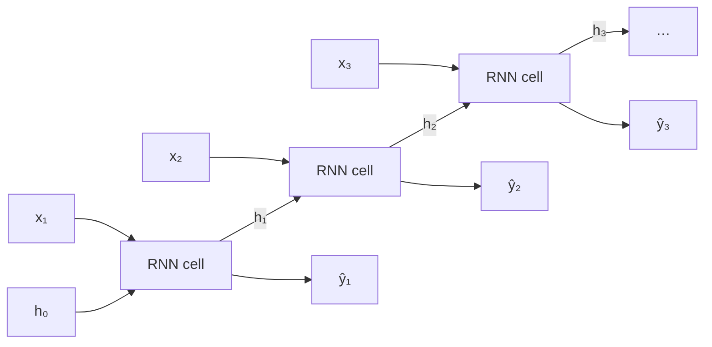
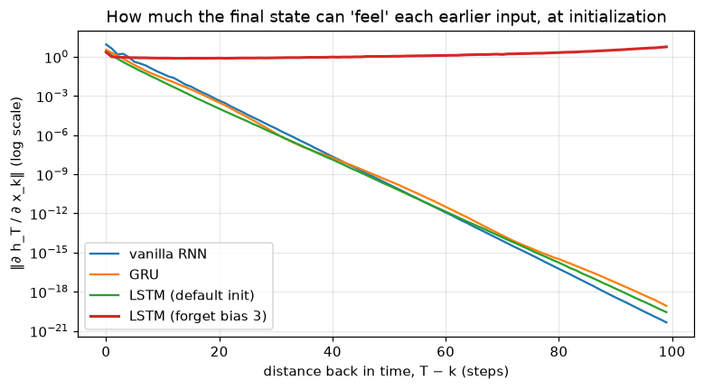

# Sequence Models

> **Level 7 · Chapter 4** · ⏱️ ~80 min read · Prerequisites: [The training loop](02-the-training-loop.md), [Forward and backpropagation](../06-neural-networks/02-forward-and-backpropagation.md), [Training deep networks](../06-neural-networks/05-training-deep-networks.md)

Text, speech, sensor readings, clickstreams, and prices arrive in order, and the order carries meaning. This chapter covers the networks built for that: **recurrent neural networks (RNNs)**, which read a sequence one step at a time while carrying a memory. You'll implement a vanilla RNN by hand and check it against `nn.RNN`, derive **backpropagation through time** and see gradients **vanish** in a measured demo, work through the **LSTM** and **GRU** equations, use **bidirectional** and **stacked** RNNs, **pack** variable-length sequences, and train a **sequence-to-sequence** model with **teacher forcing** to reverse strings of digits. Its failures on long inputs will show you exactly why the field moved to attention.

## Why it matters

Priya's team built a model to translate short product descriptions between two languages for an online shop. It was an encoder-decoder RNN, the standard approach at the time: one network read the source sentence into a single vector, and a second network wrote the translation from that vector. On short titles like "red cotton t-shirt" it was excellent. On full descriptions it fell apart. The first few words were fine, then the output drifted, dropped details ("machine washable at 30 degrees" vanished), and occasionally repeated phrases.

The team tried a bigger hidden state, which helped a little, and longer training, which didn't. The real problem was structural. The whole description, however long, had to be squeezed into one fixed-size vector before the decoder wrote a single word. The fix that eventually worked, letting the decoder look back at every encoder state as it wrote each word, is called attention, and it is the subject of [Level 8](../08-modern-deep-learning/01-attention-and-transformers.md). To understand why it was needed, and why the transformer that grew out of it took over, you need to understand recurrence, its training problems, and its bottleneck. That's this chapter.

## Concepts

### Sequences and why order matters

A **sequence** is an ordered list $\mathbf{x}_1, \mathbf{x}_2, \ldots, \mathbf{x}_T$ of vectors: word embeddings, characters, audio frames, or daily measurements. Its length $T$ varies from example to example. Two facts make sequences awkward for the models you've seen so far:

- **Order carries meaning.** "The dog bit the man" and "the man bit the dog" contain the same words. A bag-of-words model, as in [Feature engineering](../02-data-science-workflow/04-feature-engineering.md), can't tell them apart.
- **Lengths vary.** An MLP needs a fixed-size input. You could pad every sequence to the maximum length and flatten, but then position 7 has its own weights, unrelated to position 8, and the model has to learn "not" separately at every position.

The convolution in the [previous chapter](03-convolutional-networks.md) solved the analogous problem for images by sharing weights across *space*. A recurrent network shares weights across *time*.

### Recurrence: the vanilla RNN

An RNN reads the sequence one element at a time and maintains a **hidden state** $\mathbf{h}_t \in \mathbb{R}^H$, a vector that summarizes everything it has read so far. At each step it combines the new input with the previous state:

$$
\mathbf{h}_t = \tanh\left(W_{xh}\mathbf{x}_t + W_{hh}\mathbf{h}_{t-1} + \mathbf{b}_h\right), \qquad \hat{\mathbf{y}}_t = W_{hy}\mathbf{h}_t + \mathbf{b}_y,
$$

where $\mathbf{x}_t \in \mathbb{R}^D$ is the input at step $t$, $W_{xh}$ is $H \times D$, $W_{hh}$ is $H \times H$, the initial state $\mathbf{h}_0$ is usually zero, and $\hat{\mathbf{y}}_t$ is an optional output at step $t$. The same weights are used at every step, so the model has the same number of parameters for a sequence of length 5 or 5,000, and something learned about a word at position 3 applies at position 30.

**Unrolling** the recurrence over time turns it into a deep feedforward network with one layer per time step, all layers sharing weights:



Depending on which inputs and outputs you use, the same cell handles different tasks:

| Pattern | Example | Uses |
|---|---|---|
| Many-to-one | Sentiment of a review; fraud score of a transaction history | The final hidden state $\mathbf{h}_T$ (or a pooled summary of all states) |
| Many-to-many, aligned | Part-of-speech tags, one per word; anomaly flag per time step | Every $\hat{\mathbf{y}}_t$ |
| One-to-many / generation | Generating text one character at a time | Feed each output back as the next input |
| Sequence-to-sequence | Translation, summarization | An encoder RNN and a decoder RNN (below) |

### Backpropagation through time

Training an unrolled RNN is ordinary backpropagation on the unrolled graph, called **backpropagation through time (BPTT)**. The loss is usually a sum over time steps, $\mathcal{L} = \sum_t \mathcal{L}_t$. Because $W_{hh}$ is used at every step, its gradient is a sum of contributions from every step, as in any graph where a parameter is used more than once.

The interesting part is how the gradient travels backward through the hidden states. The hidden state at step $t$ depends on the one at step $t-1$ through the Jacobian

$$
\frac{\partial \mathbf{h}_t}{\partial \mathbf{h}_{t-1}} = \operatorname{diag}\left(1 - \mathbf{h}_t^2\right) W_{hh},
$$

since the derivative of $\tanh(a)$ is $1 - \tanh^2(a)$. A loss at step $T$ reaches a much earlier state $\mathbf{h}_k$ through the chain rule as a product of $T - k$ such Jacobians:

$$
\frac{\partial \mathcal{L}_T}{\partial \mathbf{h}_k} = \frac{\partial \mathcal{L}_T}{\partial \mathbf{h}_T}\prod_{t=k+1}^{T}\frac{\partial \mathbf{h}_t}{\partial \mathbf{h}_{t-1}} = \frac{\partial \mathcal{L}_T}{\partial \mathbf{h}_T}\prod_{t=k+1}^{T}\operatorname{diag}\left(1 - \mathbf{h}_t^2\right) W_{hh}.
$$

Take norms. The tanh derivative is at most 1, so each factor has norm at most $\lVert W_{hh}\rVert$, whose largest singular value is $\sigma_{\max}$. Therefore

$$
\left\lVert\frac{\partial \mathbf{h}_T}{\partial \mathbf{h}_k}\right\rVert \le \sigma_{\max}^{\,T-k}.
$$

If $\sigma_{\max} < 1$, the gradient from step $T$ to step $k$ shrinks exponentially with the distance $T - k$: the **vanishing gradient problem** (analyzed by Hochreiter in 1991, Bengio et al. in 1994, and Pascanu, Mikolov, and Bengio in 2013). Saturated tanh units, with derivatives near zero, make it worse. If the Jacobians are large instead, the gradient can grow exponentially: the **exploding gradient problem**.

This is the same depth problem you met in [Training deep networks](../06-neural-networks/05-training-deep-networks.md), but harsher, for two reasons. An unrolled RNN is as deep as the sequence is long, often hundreds of steps. And because every step multiplies by the *same* matrix $W_{hh}$, the effect compounds like a power, rather than averaging out over different layers.

The consequences are practical:

- **Vanishing gradients** mean the network can't *learn* long-range dependencies. The gradient signal saying "the word 40 steps ago mattered" is too weak to change the weights, so a vanilla RNN in practice remembers only the last 10 to 20 steps.
- **Exploding gradients** produce sudden huge updates that wreck training. The standard fix is **gradient clipping**: if the gradient norm exceeds a threshold, rescale it to that threshold, `nn.utils.clip_grad_norm_(model.parameters(), 1.0)`. It's cheap and should be in every RNN training loop.
- **Truncated BPTT** limits the cost on long sequences: process the sequence in chunks of, say, 100 steps, carry the hidden state forward between chunks, but detach it (`h = h.detach()`) so gradients flow back only within each chunk.

Clipping fixes explosion. Vanishing needs a change of architecture.

### LSTM: a memory with gates

The **long short-term memory** network (Hochreiter and Schmidhuber, 1997, with the forget gate added by Gers et al. in 2000) adds a second state, the **cell state** $\mathbf{c}_t$, designed so information and gradients can flow across many steps. Three **gates**, each a vector of numbers between 0 and 1 computed by a sigmoid, control it:

$$
\begin{aligned}
\mathbf{i}_t &= \sigma\left(W_{xi}\mathbf{x}_t + W_{hi}\mathbf{h}_{t-1} + \mathbf{b}_i\right) && \text{input gate: how much new information to write} \\
\mathbf{f}_t &= \sigma\left(W_{xf}\mathbf{x}_t + W_{hf}\mathbf{h}_{t-1} + \mathbf{b}_f\right) && \text{forget gate: how much old memory to keep} \\
\mathbf{g}_t &= \tanh\left(W_{xg}\mathbf{x}_t + W_{hg}\mathbf{h}_{t-1} + \mathbf{b}_g\right) && \text{candidate values to write} \\
\mathbf{o}_t &= \sigma\left(W_{xo}\mathbf{x}_t + W_{ho}\mathbf{h}_{t-1} + \mathbf{b}_o\right) && \text{output gate: how much memory to expose} \\
\mathbf{c}_t &= \mathbf{f}_t \odot \mathbf{c}_{t-1} + \mathbf{i}_t \odot \mathbf{g}_t && \text{update the memory} \\
\mathbf{h}_t &= \mathbf{o}_t \odot \tanh(\mathbf{c}_t) && \text{the new hidden state}
\end{aligned}
$$

Here $\sigma$ is the sigmoid and $\odot$ is elementwise multiplication. Think of the cell state as a conveyor belt. At each step, the forget gate decides what to erase, the input gate decides what to add, and the output gate decides what to read out into $\mathbf{h}_t$, which is what the rest of the network sees.

**Why this fixes vanishing gradients.** Look at the cell-state update. Its direct dependence on the previous cell state is

$$
\frac{\partial \mathbf{c}_t}{\partial \mathbf{c}_{t-1}} = \operatorname{diag}(\mathbf{f}_t)
$$

(plus indirect terms through the gates, which are usually small). There's no weight matrix and no squashing derivative in this path: just the forget gate. When the network sets $\mathbf{f}_t \approx 1$ for some memory cell, the gradient passes through that cell nearly unchanged for as many steps as the gate stays open. The update is *additive*, like a residual connection in time, which is not a coincidence: both ideas give the gradient an uninterrupted path. Hochreiter and Schmidhuber called this the **constant error carousel**.

The network *learns* when to keep and when to forget. One practical detail matters: at initialization, with small weights, the forget gate is about $\sigma(0) = 0.5$, which halves the memory every step and lets gradients vanish just like a vanilla RNN's. A common remedy, recommended by Jozefowicz, Zaremba, and Sutskever (2015), is to initialize the forget gate's bias to 1 or more, so the LSTM starts out remembering. You'll see the effect in the demo below.

An LSTM layer has four sets of weights (for $\mathbf{i}, \mathbf{f}, \mathbf{g}, \mathbf{o}$), so it has four times the parameters of a vanilla RNN of the same size. PyTorch stores them stacked in one matrix, in the order $i, f, g, o$, and uses two bias vectors (`bias_ih` and `bias_hh`) that are simply added.

### GRU: a lighter gated unit

The **gated recurrent unit** (Cho et al., 2014) merges the cell and hidden state and uses two gates. In PyTorch's convention:

$$
\begin{aligned}
\mathbf{r}_t &= \sigma\left(W_{xr}\mathbf{x}_t + W_{hr}\mathbf{h}_{t-1} + \mathbf{b}_r\right) && \text{reset gate} \\
\mathbf{z}_t &= \sigma\left(W_{xz}\mathbf{x}_t + W_{hz}\mathbf{h}_{t-1} + \mathbf{b}_z\right) && \text{update gate} \\
\mathbf{n}_t &= \tanh\left(W_{xn}\mathbf{x}_t + \mathbf{b}_{xn} + \mathbf{r}_t \odot \left(W_{hn}\mathbf{h}_{t-1} + \mathbf{b}_{hn}\right)\right) && \text{candidate state} \\
\mathbf{h}_t &= (1 - \mathbf{z}_t) \odot \mathbf{n}_t + \mathbf{z}_t \odot \mathbf{h}_{t-1} && \text{interpolate}
\end{aligned}
$$

The update gate $\mathbf{z}_t$ plays the role of the LSTM's forget and input gates together: when $\mathbf{z}_t \approx 1$, the state is copied forward unchanged, with the same additive gradient path. The reset gate lets the candidate ignore the old state, which helps the unit start fresh at boundaries such as the start of a new phrase. A GRU has three sets of weights, so 25% fewer parameters than an LSTM. In practice, LSTMs and GRUs perform similarly on most tasks (Chung et al., 2014; Jozefowicz et al., 2015); try both if it matters.

### Bidirectional and stacked RNNs

A standard RNN's state at step $t$ knows only the past. For many tasks the future matters too: whether "bank" means a riverbank or a financial institution may depend on words that come later. A **bidirectional RNN** runs two independent RNNs, one forward from $\mathbf{x}_1$ to $\mathbf{x}_T$ and one backward from $\mathbf{x}_T$ to $\mathbf{x}_1$, and concatenates their states at each step: $\mathbf{h}_t = [\overrightarrow{\mathbf{h}}_t; \overleftarrow{\mathbf{h}}_t]$, of size $2H$. Use it whenever the whole sequence is available before you predict: classification, tagging, and the encoder of a seq2seq model. **Never** use it for forecasting or generation, where the future isn't available at prediction time; a bidirectional model there is trained on information it won't have, which is a form of leakage.

A **stacked** (multi-layer, or deep) RNN feeds the sequence of hidden states of layer $l$ as the input sequence to layer $l+1$. Lower layers tend to capture local patterns, higher ones longer-range structure. Two to four layers is typical; beyond that, RNNs get hard to train without residual connections between layers. Dropout between layers (`nn.LSTM(..., num_layers=2, dropout=0.3)`) is the usual regularizer.

### Variable-length sequences: padding, masking, and packing

To batch sequences of different lengths, you **pad** them to a common length with a special value, typically zero or a `<pad>` token. That creates two problems. The RNN will process the padding steps, wasting computation, and worse, the "final" hidden state of a short sequence is computed after reading a run of padding, so it's no longer the state at the sequence's true end.

PyTorch solves this with **packed sequences**. `pack_padded_sequence(padded, lengths, batch_first=True, enforce_sorted=False)` builds a `PackedSequence` that records each sequence's true length. The RNN modules accept it, process only the real steps, and return `h_n` holding each sequence's state at its own last real step. `pad_packed_sequence` converts the per-step outputs back to a padded tensor. For losses computed per step (as in seq2seq), padding positions must also be excluded from the loss, which `cross_entropy(..., ignore_index=PAD)` does.

### Sequence to sequence

Many tasks map an input sequence to an output sequence of a different length: translation, summarization, question answering, converting speech to text. The **encoder-decoder** or **sequence-to-sequence (seq2seq)** architecture (Sutskever, Vinyals, and Le, 2014; Cho et al., 2014) uses two RNNs:

1. The **encoder** reads the input $\mathbf{x}_1, \ldots, \mathbf{x}_n$ and produces a final hidden state, the **context vector** $\mathbf{c}$, meant to summarize the whole input.
2. The **decoder** is a conditional language model. Starting from $\mathbf{c}$ as its initial state and a special start-of-sequence token `<sos>`, it predicts the output one token at a time, feeding each token back in as the next input, until it emits an end-of-sequence token `<eos>`.

The model defines the probability of an output sequence $\mathbf{y} = (y_1, \ldots, y_m)$ by the chain rule of probability,

$$
p(\mathbf{y} \mid \mathbf{x}) = \prod_{t=1}^{m} p\left(y_t \mid y_1, \ldots, y_{t-1}, \mathbf{c}\right),
$$

and is trained to maximize its log, which means minimizing the summed cross-entropy of each next-token prediction.

**Teacher forcing.** During training, what should the decoder receive as its input at step $t$: its own previous prediction $\hat{y}_{t-1}$, or the true previous token $y_{t-1}$? **Teacher forcing** feeds the true token. Each step's prediction then matches the conditional probability in the formula above exactly, all steps can be computed in one call to the RNN (the whole shifted target sequence is known in advance), and training is fast and stable. Without it, early in training the decoder's own predictions are garbage, so every later step is conditioned on garbage and learns little.

The cost is a mismatch called **exposure bias**: in training the decoder only ever sees correct prefixes, but at inference it must consume its own predictions, including its own mistakes, which it never practiced recovering from. One error can push it into unfamiliar territory and cascade. **Scheduled sampling** (Bengio et al., 2015) mixes the two, feeding the model's own prediction with a probability that grows during training. In practice, teacher forcing remains the default for training seq2seq models and, as you'll see in Level 8, transformers.

**Decoding.** At inference, **greedy decoding** picks the most likely token at each step. **Beam search** keeps the $k$ most probable partial sequences at each step and returns the best complete one, which usually gives better translations than greedy decoding. Sampling strategies for open-ended generation (temperature, top-$k$, top-$p$) are covered in [Language models](../08-modern-deep-learning/02-language-models.md).

### The limits that led to attention

The seq2seq model has a structural flaw: the **bottleneck**. Everything the decoder knows about the input must pass through one fixed-size vector $\mathbf{c} \in \mathbb{R}^H$, whether the input has 5 words or 50. The encoder must decide what to keep before it knows what the decoder will need, and information from early in the input has to survive many steps of recurrence. Cho et al. (2014) showed that the translation quality of such models drops sharply as sentences get longer. Sutskever et al. found that simply *reversing* the source sentence helped, because it put the first source words close to the first target words, which is a hint about how much distance hurts.

**Attention** (Bahdanau, Cho, and Bengio, 2015) removes the bottleneck. Instead of one context vector, the decoder at each step $t$ computes a fresh context as a weighted average of *all* the encoder's hidden states,

$$
\mathbf{c}_t = \sum_{j=1}^{n}\alpha_{tj}\,\mathbf{h}_j, \qquad \alpha_{tj} = \frac{\exp(e_{tj})}{\sum_{k=1}^{n}\exp(e_{tk})},
$$

where $e_{tj}$ is a learned score of how relevant input position $j$ is to output step $t$. The decoder can look directly at the input words it needs, at any distance, and the gradient path from an output to any input word is short.

RNNs have a second limit that attention alone doesn't fix: they're **sequential**. Step $t$ can't be computed before step $t - 1$, so a sequence of length $T$ takes $T$ sequential steps no matter how many processors you have. GPUs, which thrive on parallel work, sit mostly idle. The **transformer** (Vaswani et al., 2017) dropped recurrence entirely and used attention for everything, so all positions are processed in parallel. That made training on enormous datasets practical and led directly to today's language models. RNNs remain useful for streaming data, small models, and some time series, and the ideas of gating and additive memory paths reappear throughout modern architectures.

## In practice

### A vanilla RNN by hand, checked against `nn.RNN`

```python
import time

import numpy as np
import torch
import torch.nn as nn
import torch.nn.functional as F
from torch.nn.utils.rnn import pack_padded_sequence, pad_packed_sequence, pad_sequence

torch.set_num_threads(4)
torch.manual_seed(0)

def rnn_forward(x, h0, W_ih, W_hh, b_ih, b_hh):
    """x: (batch, T, D); h0: (batch, H). Returns all states (batch, T, H) and the last state."""
    h, states = h0, []
    for t in range(x.shape[1]):
        h = torch.tanh(x[:, t] @ W_ih.T + b_ih + h @ W_hh.T + b_hh)
        states.append(h)
    return torch.stack(states, dim=1), h

rnn = nn.RNN(input_size=3, hidden_size=5, batch_first=True)
x = torch.randn(4, 7, 3)                         # 4 sequences, 7 steps, 3 features
h0 = torch.zeros(4, 5)
out_mine, h_mine = rnn_forward(x, h0, rnn.weight_ih_l0, rnn.weight_hh_l0, rnn.bias_ih_l0, rnn.bias_hh_l0)
out_torch, h_torch = rnn(x)                      # h0 defaults to zeros
print("weights:", {n: tuple(p.shape) for n, p in rnn.named_parameters()})
print("outputs:", tuple(out_torch.shape), "| h_n:", tuple(h_torch.shape))
print("max difference, outputs:", (out_mine - out_torch).abs().max().item(),
      "| final state:", (h_mine - h_torch[0]).abs().max().item())
print("output at the last step is h_n:", torch.equal(out_torch[:, -1], h_torch[0]))
```

```text
weights: {'weight_ih_l0': (5, 3), 'weight_hh_l0': (5, 5), 'bias_ih_l0': (5,), 'bias_hh_l0': (5,)}
outputs: (4, 7, 5) | h_n: (1, 4, 5)
max difference, outputs: 5.960464477539063e-08 | final state: 5.960464477539063e-08
output at the last step is h_n: True
```

The loop of five lines is the whole of `nn.RNN`. Note the shapes: with `batch_first=True`, inputs and outputs are `(batch, time, features)`, but `h_n` is always `(num_layers × num_directions, batch, hidden)`.

### The LSTM by hand

PyTorch stacks the four gates' weights in the order input, forget, candidate, output:

```python
def lstm_forward(x, W_ih, W_hh, b_ih, b_hh):
    n, T, _ = x.shape
    H = W_hh.shape[1]
    h, c, states = torch.zeros(n, H), torch.zeros(n, H), []
    for t in range(T):
        gates = x[:, t] @ W_ih.T + b_ih + h @ W_hh.T + b_hh            # (n, 4H)
        i, f, g, o = gates.chunk(4, dim=1)
        i, f, g, o = torch.sigmoid(i), torch.sigmoid(f), torch.tanh(g), torch.sigmoid(o)
        c = f * c + i * g
        h = o * torch.tanh(c)
        states.append(h)
    return torch.stack(states, 1), (h, c)

lstm = nn.LSTM(input_size=3, hidden_size=5, batch_first=True)
out_mine, (h_mine, c_mine) = lstm_forward(x, lstm.weight_ih_l0, lstm.weight_hh_l0, lstm.bias_ih_l0, lstm.bias_hh_l0)
out_torch, (h_torch, c_torch) = lstm(x)
print("weight_ih:", tuple(lstm.weight_ih_l0.shape), "= (4 * hidden, input)")
print("max difference:", (out_mine - out_torch).abs().max().item(), (c_mine - c_torch[0]).abs().max().item())
for name, m in [("RNN", nn.RNN(100, 128)), ("GRU", nn.GRU(100, 128)), ("LSTM", nn.LSTM(100, 128))]:
    print(f"{name:4s} parameters (input 100, hidden 128): {sum(p.numel() for p in m.parameters()):,}")
```

```text
weight_ih: (20, 3) = (4 * hidden, input)
max difference: 5.960464477539063e-08 5.960464477539063e-08
RNN  parameters (input 100, hidden 128): 29,440
GRU  parameters (input 100, hidden 128): 88,320
LSTM parameters (input 100, hidden 128): 117,760
```

A vanilla RNN layer has $H(D + H) + 2H$ parameters: $128 \cdot 228 + 256 = 29{,}440$. The GRU has three times that, and the LSTM four.

### Vanishing gradients, measured

How much does the last hidden state depend on each earlier input? Feed a random sequence of length 100, take the gradient of the final state with respect to every input $\mathbf{x}_k$, and plot its norm against the distance $T - k$. Compare a vanilla RNN, a GRU, an LSTM with PyTorch's default initialization, and an LSTM whose forget-gate bias starts at 3 (so $\sigma(3) \approx 0.95$: "remember by default").

```python
T, H = 100, 64

def input_gradient_profile(rnn, seed=0):
    torch.manual_seed(seed)
    x = torch.randn(32, T, 8, requires_grad=True)
    out, _ = rnn(x)
    out[:, -1].sum().backward()                      # d(final state) / d(each input)
    return x.grad.norm(dim=(0, 2)).flip(0)           # index 0 = the last step, index k = k steps back

torch.manual_seed(0)
models = {"vanilla RNN": nn.RNN(8, H, batch_first=True),
          "GRU": nn.GRU(8, H, batch_first=True),
          "LSTM (default init)": nn.LSTM(8, H, batch_first=True),
          "LSTM (forget bias 3)": nn.LSTM(8, H, batch_first=True)}
with torch.no_grad():
    models["LSTM (forget bias 3)"].bias_ih_l0[H:2 * H] = 3.0   # forget-gate slice of the bias
profiles = {name: input_gradient_profile(m) for name, m in models.items()}
for name, g in profiles.items():
    print(f"{name:21s}", "  ".join(f"{k:2d} back: {g[k]:.0e}" for k in [0, 10, 20, 40, 80]))
rho = torch.linalg.eigvals(models["vanilla RNN"].weight_hh_l0).abs().max().item()
print(f"vanilla RNN: spectral radius of W_hh = {rho:.2f}")
```

```text
vanilla RNN            0 back: 9e+00  10 back: 5e-02  20 back: 4e-04  40 back: 2e-08  80 back: 6e-17
GRU                    0 back: 3e+00  10 back: 2e-02  20 back: 3e-04  40 back: 2e-08  80 back: 3e-16
LSTM (default init)    0 back: 3e+00  10 back: 1e-02  20 back: 1e-04  40 back: 1e-08  80 back: 2e-16
LSTM (forget bias 3)   0 back: 2e+00  10 back: 8e-01  20 back: 8e-01  40 back: 1e+00  80 back: 2e+00
vanilla RNN: spectral radius of W_hh = 0.65
```

```python
import matplotlib.pyplot as plt

fig, ax = plt.subplots(figsize=(8, 4))
for name, g in profiles.items():
    ax.semilogy(np.arange(T), g.numpy(), label=name, lw=2 if "bias 3" in name else 1.5)
ax.set(xlabel="distance back in time, T − k (steps)", ylabel="‖∂ h_T / ∂ x_k‖ (log scale)",
       title="How much the final state can 'feel' each earlier input, at initialization")
ax.grid(alpha=0.3, which="both")
ax.legend()
plt.show()
```


*Straight lines on a log scale are exponential decay, as the BPTT bound predicts. An open forget gate turns the LSTM's cell into a highway for gradients.*

The vanilla RNN's gradient falls exponentially, by about a factor of 100 every 10 steps, which matches the bound: its recurrent matrix has spectral radius 0.65, and saturating tanh units shrink it further. Forty steps back, the signal is $10^{-8}$ of what it is at the last step, far too small to learn from. The default LSTM and GRU decay just as fast *at initialization*, because their gates start near 0.5. Gating doesn't guarantee memory; it makes memory *learnable*. With the forget gate initialized open, the LSTM's cell state carries the gradient 80 steps back undiminished. Training can learn the same thing for the cells that need it, which is why gated RNNs handle dependencies of a hundred steps or more where vanilla RNNs manage a dozen or two.

### Bidirectional and stacked RNNs: shapes

```python
bilstm = nn.LSTM(input_size=10, hidden_size=16, num_layers=2, bidirectional=True, batch_first=True, dropout=0.2)
bilstm.eval()                                        # turn off inter-layer dropout for the checks
x = torch.randn(3, 9, 10)
out, (h_n, c_n) = bilstm(x)
print("output:", tuple(out.shape), "= (batch, T, 2 * hidden)")
print("h_n:   ", tuple(h_n.shape), "= (layers * directions, batch, hidden)")
print("last layer, forward direction  = output at the LAST step, first half: ", torch.allclose(h_n[-2], out[:, -1, :16]))
print("last layer, backward direction = output at the FIRST step, second half:", torch.allclose(h_n[-1], out[:, 0, 16:]))
summary = torch.cat([h_n[-2], h_n[-1]], dim=1)       # the usual sequence summary for classification
print("sequence summary for a classifier:", tuple(summary.shape))
```

```text
output: (3, 9, 32) = (batch, T, 2 * hidden)
h_n:    (4, 3, 16) = (layers * directions, batch, hidden)
last layer, forward direction  = output at the LAST step, first half:  True
last layer, backward direction = output at the FIRST step, second half: True
sequence summary for a classifier: (3, 32)
```

The backward direction finishes at step 1, so its final state sits at the *first* position of the output. Taking `out[:, -1]` as a summary of a bidirectional RNN is a common bug: it gives the backward direction's state after reading only the last element.

### Packing variable-length sequences

```python
torch.manual_seed(0)
seqs = [torch.randn(5, 3), torch.randn(2, 3), torch.randn(4, 3)]   # lengths 5, 2, 4
lengths = torch.tensor([len(s) for s in seqs])
padded = pad_sequence(seqs, batch_first=True)                        # zeros after each sequence ends
print("padded batch:", tuple(padded.shape), "| lengths:", lengths.tolist())

gru = nn.GRU(3, 4, batch_first=True)
_, h_padded = gru(padded)                                            # naive: runs through the padding
packed = pack_padded_sequence(padded, lengths, batch_first=True, enforce_sorted=False)
out_packed, h_packed = gru(packed)
_, h_alone = gru(seqs[1].unsqueeze(0))                               # the length-2 sequence on its own

print("length-2 sequence, final state run alone:", h_alone[0, 0].detach().numpy().round(4))
print("  ... from the padded batch:             ", h_padded[0, 1].detach().numpy().round(4))
print("  ... from the packed batch:             ", h_packed[0, 1].detach().numpy().round(4))
out, out_lengths = pad_packed_sequence(out_packed, batch_first=True)
print("unpacked outputs:", tuple(out.shape), "| padding positions are zero:", bool((out[1, 2:] == 0).all()))
```

```text
padded batch: (3, 5, 3) | lengths: [5, 2, 4]
length-2 sequence, final state run alone: [-0.4162 -0.1032  0.016  -0.1747]
  ... from the padded batch:              [ 0.0431 -0.1042 -0.4578 -0.1843]
  ... from the packed batch:              [-0.4162 -0.1032  0.016  -0.1747]
unpacked outputs: (3, 5, 4) | padding positions are zero: True
```

Run naively, the padded batch gives the short sequence a final state after three extra steps of reading zeros, which is wrong. The packed batch gives exactly the same state as running the sequence alone.

!!! warning "Common mistake: using `h_n` from a padded batch"
    Without packing, `h_n` (and `out[:, -1]`) for every sequence shorter than the longest one is computed after reading padding. The model still trains, so nothing crashes; it just learns from corrupted summaries and quietly does worse on short inputs. Either pack the batch, or gather each sequence's output at its true last index: `out[torch.arange(n), lengths - 1]`.

### Seq2seq with teacher forcing: reversing digit strings

The toy task: given a string of 3 to 12 random digits, output it reversed. It's trivial to state, needs no data download, and needs the model to carry every input digit through the bottleneck, since the first output digit is the *last* input digit and the last output digit is the *first* input digit. The vocabulary has the 10 digits plus three special tokens.

```python
PAD, SOS, EOS = 10, 11, 12
VOCAB = 13

def make_batch(n, gen, min_len=3, max_len=12):
    """Source: digits padded with PAD. Target: the reversed digits, then EOS, padded with PAD."""
    lengths = torch.randint(min_len, max_len + 1, (n,), generator=gen)
    src = torch.full((n, max_len), PAD)
    tgt = torch.full((n, max_len + 1), PAD)
    for i, L in enumerate(lengths.tolist()):
        digits = torch.randint(0, 10, (L,), generator=gen)
        src[i, :L] = digits
        tgt[i, :L] = digits.flip(0)
        tgt[i, L] = EOS
    return src, lengths, tgt

src, lengths, tgt = make_batch(2, torch.Generator().manual_seed(1))
print("source:", src[0].tolist(), "length", lengths[0].item())
print("target:", tgt[0].tolist())
```

```text
source: [4, 8, 3, 3, 1, 1, 9, 2, 10, 10, 10, 10] length 8
target: [2, 9, 1, 1, 3, 3, 8, 4, 12, 10, 10, 10, 10]
```

The model: an embedding layer turns each token into a vector (the next chapter is about embeddings), the encoder GRU reads the packed source, and its final state initializes the decoder GRU. With teacher forcing, the decoder's input is the target shifted right by one, with `<sos>` in front, so the whole decoder runs in a single call.

```python
class Seq2Seq(nn.Module):
    def __init__(self, emb=32, hidden=128):
        super().__init__()
        self.src_emb = nn.Embedding(VOCAB, emb, padding_idx=PAD)
        self.encoder = nn.GRU(emb, hidden, batch_first=True)
        self.tgt_emb = nn.Embedding(VOCAB, emb, padding_idx=PAD)
        self.decoder = nn.GRU(emb, hidden, batch_first=True)
        self.out = nn.Linear(hidden, VOCAB)

    def encode(self, src, lengths):
        packed = pack_padded_sequence(self.src_emb(src), lengths, batch_first=True, enforce_sorted=False)
        _, h = self.encoder(packed)
        return h                                       # (1, batch, hidden): the context vector

    def forward(self, src, lengths, tgt):              # teacher forcing
        h = self.encode(src, lengths)
        sos = torch.full((len(src), 1), SOS)
        dec_in = torch.cat([sos, tgt[:, :-1]], dim=1)  # <sos> y1 y2 ... : the true previous tokens
        dec_out, _ = self.decoder(self.tgt_emb(dec_in), h)
        return self.out(dec_out)                       # (batch, T_out, VOCAB)

    @torch.no_grad()
    def greedy_decode(self, src, lengths, max_steps=16):
        h = self.encode(src, lengths)
        tok = torch.full((len(src), 1), SOS)
        outputs = []
        for _ in range(max_steps):                     # feed back the model's OWN predictions
            dec_out, h = self.decoder(self.tgt_emb(tok), h)
            tok = self.out(dec_out).argmax(-1)
            outputs.append(tok)
        return torch.cat(outputs, dim=1)

def train_seq2seq(make_batch_fn, steps=1000, seed=0, log_every=250):
    torch.manual_seed(seed)
    gen = torch.Generator().manual_seed(seed)
    model = Seq2Seq()
    opt = torch.optim.Adam(model.parameters(), lr=3e-3)
    model.train()
    for step in range(1, steps + 1):
        src, lengths, tgt = make_batch_fn(128, gen)
        logits = model(src, lengths, tgt)
        loss = F.cross_entropy(logits.reshape(-1, VOCAB), tgt.reshape(-1), ignore_index=PAD)
        opt.zero_grad()
        loss.backward()
        nn.utils.clip_grad_norm_(model.parameters(), 1.0)
        opt.step()
        if log_every and step % log_every == 0:
            print(f"  step {step:4d}  loss {loss.item():.4f}")
    return model

t0 = time.time()
model = train_seq2seq(make_batch)
print(f"trained in {time.time() - t0:.0f}s; {sum(p.numel() for p in model.parameters()):,} parameters")
```

```text
  step  250  loss 0.3757
  step  500  loss 0.1907
  step  750  loss 0.1495
  step 1000  loss 0.0849
trained in 43s; 126,925 parameters
```

The loss is the average cross-entropy per output token, under teacher forcing. The real test is free-running greedy decoding, scored by **exact match**: the whole reversed string must be right.

```python
def evaluate_by_length(model, make_batch_fn, lengths=range(1, 15), n=500, seed=123):
    gen = torch.Generator().manual_seed(seed)
    exact, per_token = {}, {}
    model.eval()
    for L in lengths:
        src, lens, tgt = make_batch_fn(n, gen, L, L)
        pred = model.greedy_decode(src, lens)[:, :L + 1]
        exact[L] = (pred == tgt).all(dim=1).float().mean().item()
        per_token[L] = (pred[:, :L] == tgt[:, :L]).float().mean().item()
    return exact, per_token

exact, per_token = evaluate_by_length(model, make_batch)
for L in [1, 3, 6, 9, 12, 13, 14]:
    note = "  (longer than any training example)" if L > 12 else "  (shorter than any training example)" if L < 3 else ""
    print(f"length {L:2d}: exact match {exact[L]:.3f}, per-digit accuracy {per_token[L]:.3f}{note}")

src, lens, tgt = make_batch(1, torch.Generator().manual_seed(7), 12, 12)
pred = model.greedy_decode(src, lens)[0, :13].tolist()
print("input:    ", src[0].tolist())
print("expected: ", tgt[0].tolist())
print("predicted:", pred)
```

```text
length  1: exact match 1.000, per-digit accuracy 1.000  (shorter than any training example)
length  3: exact match 1.000, per-digit accuracy 1.000
length  6: exact match 0.974, per-digit accuracy 0.995
length  9: exact match 0.794, per-digit accuracy 0.947
length 12: exact match 0.222, per-digit accuracy 0.765
length 13: exact match 0.116, per-digit accuracy 0.684  (longer than any training example)
length 14: exact match 0.022, per-digit accuracy 0.586  (longer than any training example)
input:     [2, 1, 6, 3, 7, 7, 9, 8, 1, 8, 1, 8]
expected:  [8, 1, 8, 1, 8, 9, 7, 7, 3, 6, 1, 2, 12]
predicted: [8, 1, 8, 1, 8, 7, 9, 7, 3, 6, 2, 1, 12]
```

```python
fig, axes = plt.subplots(1, 2, figsize=(11, 3.8))
Ls = list(exact)
axes[0].plot(Ls, [exact[L] for L in Ls], "o-", label="exact match (whole string)")
axes[0].plot(Ls, [per_token[L] for L in Ls], "s-", label="per-digit accuracy")
axes[0].axvspan(3, 12, color="gray", alpha=0.12, label="training lengths")
axes[0].set(xlabel="input length", ylabel="accuracy", title="Seq2seq without attention: accuracy vs length")
axes[0].legend(loc="lower left")

gen = torch.Generator().manual_seed(5)
src12, lens12, tgt12 = make_batch(1000, gen, 12, 12)
pred12 = model.greedy_decode(src12, lens12)[:, :12]
pos_acc = (pred12 == tgt12[:, :12]).float().mean(0)
axes[1].bar(range(1, 13), pos_acc.numpy())
axes[1].set(xlabel="output position (1 = last input digit, 12 = first input digit)", ylabel="accuracy",
            title="Length-12 strings: accuracy by output position", ylim=(0.5, 1.02))
for ax in axes:
    ax.grid(alpha=0.3)
plt.tight_layout()
plt.show()
```


*The bottleneck, measured: the longer the input, the more of it fails to survive the trip through one 128-dimensional vector.*

Three lessons in one picture:

- **The bottleneck.** Short strings are reversed perfectly; at length 12, only 22% are. Per-digit accuracy is still 77%, so the model knows roughly what the string was but loses details: in the example it swapped two pairs of neighboring digits. All 12 digits had to be packed into the 128 numbers of the context vector.
- **Distance hurts.** On the right, the first output position (the most recently read input digit) is always right, and accuracy falls steadily over the next few positions to about 70% for the positions that need the earliest input digits. Those had to survive the most steps of recurrence in the encoder, and then the most decoding steps.
- **Weak length generalization.** At lengths 13 and 14, longer than anything in training, exact match collapses to 12% and 2%. (Lengths 1 and 2, shorter than anything seen, happen to work, since short strings are easy to hold.) Seq2seq RNNs learn the length distribution of their training data, and degrade quickly outside it.

An attention-based decoder fixes the first two by looking back at every encoder state directly. That's where [Level 8](../08-modern-deep-learning/01-attention-and-transformers.md) begins.

!!! warning "Common mistake: teacher forcing at evaluation time"
    Calling `model(src, lengths, tgt)` on validation data feeds the decoder the *true* previous tokens, so it reports an optimistic accuracy that free-running inference can't reach. Evaluate generation with the decoding loop the deployed model will use (here `greedy_decode`). Validation loss under teacher forcing is still a fine signal for early stopping; just don't report it as the model's accuracy.

## Exercises

### Exercise 1: Counting parameters (easy)

How many parameters does `nn.LSTM(input_size=50, hidden_size=100, num_layers=2, bidirectional=True)` have? Remember what the input to layer 2 is. Check with PyTorch.

??? success "Solution"

    One LSTM direction of one layer with input size $D$ and hidden size $H$ has $4(HD + H^2 + 2H)$ parameters (two bias vectors). Layer 1: $D = 50$, so $4(5{,}000 + 10{,}000 + 200) = 60{,}800$ per direction, 121,600 for both. Layer 2's input is the concatenation of both directions, $D = 200$: $4(20{,}000 + 10{,}000 + 200) = 120{,}800$ per direction, 241,600 for both. Total: 363,200.

    ```python
    print(sum(p.numel() for p in nn.LSTM(50, 100, num_layers=2, bidirectional=True).parameters()))
    ```

    ```text
    363200
    ```

### Exercise 2: BPTT for a scalar linear RNN (easy)

Take a scalar RNN with no nonlinearity, $h_t = w\,h_{t-1} + x_t$. (a) Derive $\partial h_T / \partial x_k$. (b) Evaluate it for $T - k = 50$ with $w = 0.9$ and $w = 1.1$. (c) What does this say about choosing $w$ to remember inputs from 50 steps ago?

??? success "Solution"

    (a) Unrolling, $h_T = \sum_{k=1}^{T} w^{T-k}x_k + w^T h_0$, so $\partial h_T/\partial x_k = w^{T-k}$.

    (b) $0.9^{50} \approx 0.0052$ and $1.1^{50} \approx 117$.

    ```python
    print(round(0.9 ** 50, 4), round(1.1 ** 50, 1))
    ```

    ```text
    0.0052 117.4
    ```

    (c) There's no good fixed $w$. Below 1, distant inputs fade exponentially (vanishing); above 1, they're amplified exponentially, and so is the state itself (exploding). Only $w = 1$ exactly preserves information, and it also accumulates everything forever, with no way to forget. The LSTM's answer is to make the "$w$" of the memory path a *gate*, computed from the input at each step, so it can be near 1 while information should be kept and near 0 when it should be erased.

### Exercise 3: A GRU cell by hand (medium)

Implement one step of a GRU from the equations in the chapter, using the weights of an `nn.GRUCell(6, 8)` (PyTorch stacks the gates in the order reset, update, new), and check it against the cell.

??? success "Solution"

    ```python
    def gru_cell(x, h, W_ih, W_hh, b_ih, b_hh):
        xr, xz, xn = (x @ W_ih.T + b_ih).chunk(3, dim=1)
        hr, hz, hn = (h @ W_hh.T + b_hh).chunk(3, dim=1)
        r = torch.sigmoid(xr + hr)
        z = torch.sigmoid(xz + hz)
        n = torch.tanh(xn + r * hn)          # the reset gate multiplies (W_hn h + b_hn)
        return (1 - z) * n + z * h

    torch.manual_seed(0)
    cell = nn.GRUCell(6, 8)
    x, h = torch.randn(5, 6), torch.randn(5, 8)
    mine = gru_cell(x, h, cell.weight_ih, cell.weight_hh, cell.bias_ih, cell.bias_hh)
    print((mine - cell(x, h)).abs().max().item())
    ```

    ```text
    1.1920928955078125e-07
    ```

    The subtle point is where the reset gate goes: PyTorch applies it to $W_{hn}\mathbf{h}_{t-1} + \mathbf{b}_{hn}$ (bias included), which is why the two bias vectors aren't simply interchangeable. The original paper applies it to $\mathbf{h}_{t-1}$ before the multiplication; the two variants perform about the same.

### Exercise 4: When is bidirectional allowed? (medium)

For each task, say whether a bidirectional RNN is appropriate, and why: (a) classifying the sentiment of a finished review; (b) forecasting tomorrow's electricity demand from the past 60 days; (c) a real-time speech recognizer that must display words as the person speaks; (d) tagging each word of a sentence with its part of speech; (e) the encoder and the decoder of a translation model.

??? success "Solution"

    (a) Yes. The whole review exists before you classify it.

    (b) The target is in the future, so no model can see it; but the 60-day input window is fully known, so a bidirectional encoder *over the window* is legitimate. What's not allowed is any bidirectional processing that reaches past the forecast origin, such as a model trained on a series where each step's label depends on later inputs.

    (c) No, or only with a bounded look-ahead. A backward RNN needs the end of the utterance, which doesn't exist yet. Streaming systems use unidirectional models or wait a short, fixed delay to see a few future frames.

    (d) Yes. Whether "book" is a noun or a verb depends on both sides of it.

    (e) The encoder, yes: the source sentence is fully known. The decoder, no: it generates left to right, and at step $t$ the later target words don't exist yet. A bidirectional decoder trained with teacher forcing would see the future tokens it is supposed to predict, a leak that makes training loss look excellent and inference fail.

### Exercise 5: Copying is harder than reversing (hard)

Train the same seq2seq model on *copying* the digit string (target = the digits in the original order, then `<eos>`) for the same number of steps, and compare exact match at lengths 6, 9, and 12 with the reversal model. Explain the difference. (This is the effect that led Sutskever et al. to reverse their source sentences.)

??? success "Solution"

    ```python
    def make_copy_batch(n, gen, min_len=3, max_len=12):
        src, lengths, tgt = make_batch(n, gen, min_len, max_len)
        for i, L in enumerate(lengths.tolist()):
            tgt[i, :L] = src[i, :L]                    # same digits, original order
        return src, lengths, tgt

    copy_model = train_seq2seq(make_copy_batch, log_every=0)
    copy_exact, _ = evaluate_by_length(copy_model, make_copy_batch, lengths=[6, 9, 12])
    for L in [6, 9, 12]:
        print(f"length {L:2d}: reverse {exact[L]:.3f}   copy {copy_exact[L]:.3f}")
    ```

    ```text
    length  6: reverse 0.974   copy 0.982
    length  9: reverse 0.794   copy 0.706
    length 12: reverse 0.222   copy 0.102
    ```

    For short strings both are easy, but as length grows copying falls behind: at 12 digits, the copy model gets fewer than half as many strings exactly right. To copy, the decoder's *first* output must be the encoder's *first* input, which was read 12 steps before the context vector was formed: the longest possible path through the recurrence. And every output position is far from its source: the distance between input digit $j$ and output digit $j$ is about $n$ steps for all $j$. When reversing, the first outputs come from the most recent inputs, so early decoding is easy, the decoder gets a good start, and only the last few outputs have to come from far away. Same information, same bottleneck, very different path lengths. Attention makes every input exactly one step away from every output, which makes copy and reverse equally easy.

## Check yourself

1. Write the vanilla RNN update and say which weights are shared across time.

    ??? note "Answer"

        $\mathbf{h}_t = \tanh(W_{xh}\mathbf{x}_t + W_{hh}\mathbf{h}_{t-1} + \mathbf{b}_h)$. All of $W_{xh}$, $W_{hh}$, and $\mathbf{b}_h$ (and any output weights) are the same at every step.

2. Why do gradients vanish or explode in RNNs, in one sentence of math?

    ??? note "Answer"

        The gradient from step $T$ to step $k$ is a product of $T - k$ Jacobians $\operatorname{diag}(1 - \mathbf{h}_t^2)W_{hh}$, so its norm behaves roughly like $\sigma_{\max}(W_{hh})^{T-k}$ (shrunk further by saturated units): exponential decay if that's below 1, possible exponential growth if above.

3. What is the standard fix for exploding gradients, and why doesn't it fix vanishing ones?

    ??? note "Answer"

        Gradient norm clipping: rescale the gradient when its norm exceeds a threshold. It caps the size of an update; it can't restore a signal that has already decayed to $10^{-8}$.

4. Which LSTM equation creates the path for gradients across many steps, and what controls it?

    ??? note "Answer"

        The additive cell update $\mathbf{c}_t = \mathbf{f}_t \odot \mathbf{c}_{t-1} + \mathbf{i}_t \odot \mathbf{g}_t$. Its direct derivative $\partial\mathbf{c}_t/\partial\mathbf{c}_{t-1} = \operatorname{diag}(\mathbf{f}_t)$ involves no weight matrix or squashing, so the forget gate controls how much gradient (and information) passes.

5. Why would you initialize an LSTM's forget-gate bias to a positive value?

    ??? note "Answer"

        With zero bias, the forget gate starts near 0.5, which halves the memory every step, so gradients vanish at initialization as in a vanilla RNN. A positive bias makes the cell remember by default, so long-range gradients exist from the start of training.

6. What does packing a padded batch fix?

    ??? note "Answer"

        The RNN processes only each sequence's real steps, so the final hidden state of a short sequence is its state at its true last element rather than after reading padding, and no computation is wasted on padding.

7. What is teacher forcing, and what problem does it create?

    ??? note "Answer"

        Feeding the decoder the true previous target token during training, instead of its own prediction. It makes training fast, stable, and parallel over time steps, but creates exposure bias: at inference the decoder conditions on its own, possibly wrong, predictions, a situation it never saw in training.

8. Name the two limitations of RNN seq2seq models that attention and transformers address.

    ??? note "Answer"

        The fixed-size context bottleneck (the whole input must fit in one vector, and distant inputs must survive many recurrent steps), which attention fixes by letting the decoder look at all encoder states. And sequential computation (step $t$ waits for step $t - 1$), which transformers fix by replacing recurrence with attention so all positions are processed in parallel.

## Key takeaways

- An RNN shares weights across time and carries a hidden state; unrolled, it's a deep network as deep as the sequence is long.
- BPTT multiplies one Jacobian per step, so gradients decay or grow exponentially with distance. Clip gradients for explosion; use gated cells for vanishing.
- LSTMs and GRUs add an additive, gated memory path. Gates make long memory learnable, not automatic: a forget-gate bias that starts open helps.
- Bidirectional RNNs need the whole sequence, so they suit classification, tagging, and encoders, never forecasting or decoders. Stacking adds depth.
- Pad and pack variable-length batches, and mask padding out of per-step losses with `ignore_index`.
- Seq2seq models encode the input into a context vector and decode with teacher forcing; evaluate with free-running decoding.
- The context bottleneck makes accuracy fall with input length and distance, which motivated attention; sequential computation motivated the transformer.

## Further reading

- Christopher Olah, "Understanding LSTM Networks" (blog post, 2015), with the clearest diagrams of the gates.
- Razvan Pascanu, Tomas Mikolov, and Yoshua Bengio, "On the difficulty of training recurrent neural networks" (ICML 2013), on vanishing and exploding gradients and clipping.
- Ilya Sutskever, Oriol Vinyals, and Quoc V. Le, "Sequence to Sequence Learning with Neural Networks" (NeurIPS 2014).
- Dzmitry Bahdanau, Kyunghyun Cho, and Yoshua Bengio, "Neural Machine Translation by Jointly Learning to Align and Translate" (ICLR 2015), which introduced attention.
- Goodfellow, Bengio, and Courville, *Deep Learning* (MIT Press, 2016), chapter 10, "Sequence Modeling: Recurrent and Recursive Nets".

## Next

The seq2seq model turned digits into vectors with `nn.Embedding` without explaining it. Next, learn what embeddings are, how word2vec learns them, and how to build text classifiers with them: [Embeddings and NLP basics](05-embeddings-and-nlp.md).
