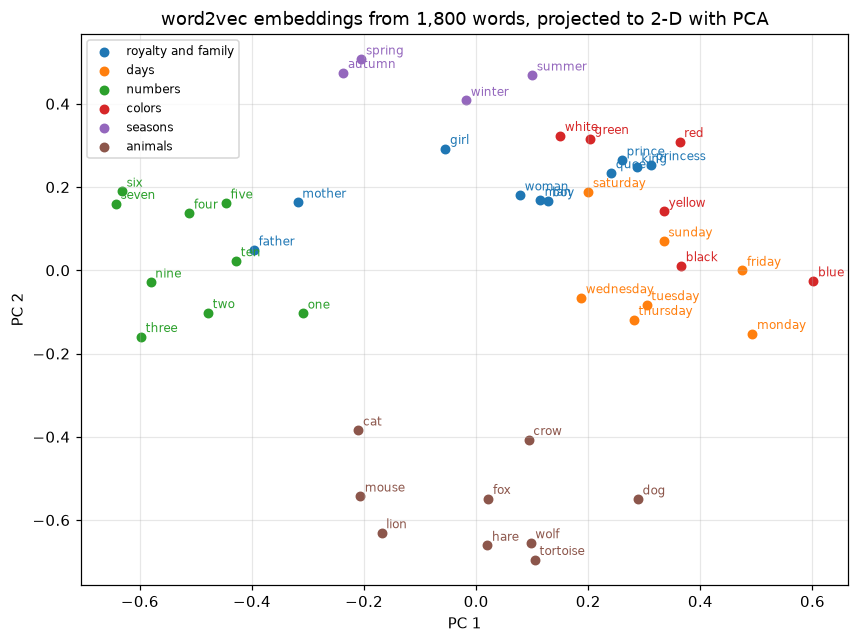

# Embeddings and NLP Basics

> **Level 7 · Chapter 5** · ⏱️ ~75 min read · Prerequisites: [PyTorch fundamentals](01-pytorch-fundamentals.md), [Sequence models](04-sequence-models.md), [Feature engineering](../02-data-science-workflow/04-feature-engineering.md)

Neural networks need numbers, and text is made of discrete symbols. This chapter covers the bridge: **tokenization** (turning text into a sequence of integer IDs), **one-hot vectors** versus learned dense **embeddings**, and PyTorch's `nn.Embedding`. You'll derive and train **word2vec** (skip-gram with negative sampling) on a small corpus embedded in this page, probe the result with nearest neighbors and analogies (and see honestly what a tiny corpus can and can't do), learn how **GloVe** gets similar vectors from co-occurrence counts, study **embedding geometry**, build a **text classifier** with `nn.EmbeddingBag`, and preview the **subword tokenization** that every modern language model uses.

## Why it matters

Wei was building a support-ticket router: read a customer's message and send it to billing, shipping, technical support, or account security. The first model used one-hot word features and a linear classifier, the TF-IDF approach from [Feature engineering](../02-data-science-workflow/04-feature-engineering.md). It worked on the training data. Then customers wrote "I was double billed" instead of "charged twice", or "the parcel never came" instead of "package not delivered". To a one-hot model, "parcel" and "package" are as different as "parcel" and "password": every word is its own unrelated dimension, so nothing learned about one transfers to the other. And a word never seen in training, like a misspelling or a new product name, simply vanished.

The second version represented each word as a learned dense vector, an embedding, initialized from vectors pretrained on a large text corpus, in which "parcel" and "package" already sat close together. Routing errors on rephrased tickets dropped sharply. A third version used subword tokens, so even "re-shipment" or "refnd" broke into pieces the model knew. Each step was about one question: how do you represent words so that similar meanings get similar numbers? That's what this chapter answers.

## Concepts

### From text to tokens

**Tokenization** splits text into units called **tokens**, and maps each to an integer ID from a **vocabulary**. It's the first step of every NLP pipeline, and choices made here limit everything downstream.

- **Word-level tokenization** splits on whitespace and punctuation: "The fox's cheese fell." becomes `the`, `fox's`, `cheese`, `fell`, `.` (after lowercasing). Simple and interpretable. The vocabulary grows with every new word, typos, names, and inflections ("run", "runs", "running" are unrelated tokens), and a word outside the vocabulary becomes a single **unknown** token `<unk>`, losing all its information.
- **Character-level tokenization** uses individual characters. The vocabulary is tiny and nothing is ever unknown, but sequences become long (five times longer for English) and the model has to learn spelling before meaning.
- **Subword tokenization** (byte-pair encoding, WordPiece, unigram) sits in between: frequent words stay whole, and rare words split into frequent pieces ("unhappiness" → `un`, `happi`, `ness`). It's the standard for modern models. You'll implement a tiny version at the end of this chapter.

Building a word-level vocabulary has a few standard steps: normalize (lowercase, maybe strip accents), split into tokens, count frequencies, keep tokens that appear at least `min_freq` times, and add **special tokens** such as `<pad>` (for batching, as in the [previous chapter](04-sequence-models.md)), `<unk>`, and sometimes `<sos>` and `<eos>`. **Numericalizing** a text means replacing each token by its ID.

Word frequencies in natural language follow **Zipf's law**: the $r$-th most frequent word has frequency roughly proportional to $1/r$. A few words ("the", "a", "of") are extremely common, and a long tail of words appears once or twice. That's why `min_freq` cuts the vocabulary so much, and why the long tail is where word-level models struggle.

### One-hot vectors versus embeddings

Once each token is an integer $i \in \{0, \ldots, V-1\}$ for a vocabulary of size $V$, the simplest vector representation is a **one-hot** vector $\mathbf{e}_i \in \mathbb{R}^V$: all zeros except a 1 at position $i$. One-hot vectors have two problems:

- **They're huge.** A 50,000-word vocabulary gives 50,000-dimensional, almost entirely zero vectors.
- **They encode no similarity.** Any two different one-hot vectors are orthogonal: $\mathbf{e}_i^\top\mathbf{e}_j = 0$, and every pair of distinct words is exactly the same distance apart. "Cat" is as far from "kitten" as from "carburetor".

An **embedding** maps each token to a dense vector of a much smaller dimension $d$ (typically 50 to 1,024), stored as row $i$ of an **embedding matrix** $E \in \mathbb{R}^{V \times d}$. The vectors are learned, so words that play similar roles can end up close together.

Here's the key fact connecting the two: multiplying a one-hot vector by $E$ selects a row,

$$
\mathbf{e}_i^\top E = E_{i,:}.
$$

So an embedding layer is exactly a linear layer applied to one-hot inputs, with no bias. It's implemented as a table lookup, because multiplying by a vector of zeros is a waste. `nn.Embedding(V, d)` stores $E$ as its weight and returns `E[ids]` for a tensor of IDs of any shape, adding a trailing dimension of size $d$. In the backward pass, only the rows that were looked up receive gradient, so the gradient is **sparse**: a batch touches a few hundred rows of a table that may have a million.

Embeddings can be learned in two ways. They can be trained **end to end** as the first layer of a model for some task, like the token embeddings in the seq2seq model of the previous chapter. Or they can be **pretrained** on a large unlabeled corpus with an objective designed to capture meaning, then reused, which is what word2vec and GloVe do.

### The distributional hypothesis

How can you learn meaning without labels? Linguist J. R. Firth put the guiding idea memorably in 1957: "You shall know a word by the company it keeps." This is the **distributional hypothesis**: words that occur in similar contexts tend to have similar meanings. "Coffee" and "tea" both appear near "cup", "drink", "hot", and "morning". You've never been told they're similar, but their contexts say so.

So, train a model to predict a word's context from the word, and words with similar contexts must get similar vectors, because similar vectors make similar predictions. That's word2vec.

### word2vec: the skip-gram model

**word2vec** (Mikolov et al., 2013) comes in two flavors. **CBOW** (continuous bag of words) predicts a word from the average of its neighbors. **Skip-gram** predicts each neighbor from the word, and it's the one to know.

Slide a window over the corpus. For each position, the word there is the **center word** $w$, and each word within $m$ positions of it is a **context word** $c$. Every (center, context) pair is a training example. For the sentence "the fox ate the cheese" with $m = 2$, the center "ate" gives pairs (ate, the), (ate, fox), (ate, the), (ate, cheese).

Skip-gram keeps **two** embedding matrices: an input (center) vector $\mathbf{v}_w$ for each word, and an output (context) vector $\mathbf{u}_c$ for each word. The model's probability that $c$ appears near $w$ is a softmax over the vocabulary:

$$
p(c \mid w) = \frac{\exp(\mathbf{u}_c^\top\mathbf{v}_w)}{\sum_{c'=1}^{V}\exp(\mathbf{u}_{c'}^\top\mathbf{v}_w)},
$$

and training maximizes the average log-probability of all observed pairs. The dot product $\mathbf{u}_c^\top\mathbf{v}_w$ is a compatibility score: high when $c$ is a typical context of $w$. Two words with similar context distributions need similar $\mathbf{v}$ vectors to score the same contexts highly. After training, the $\mathbf{v}$ vectors are the word embeddings (some implementations average them with the $\mathbf{u}$ vectors).

The softmax is the problem: its denominator sums over the whole vocabulary, and so does its gradient, for every one of the billions of training pairs.

### Negative sampling

**Negative sampling** replaces the $V$-way softmax with a cheap binary task: tell real (center, context) pairs from fake ones. For each real pair $(w, c)$, draw $k$ **negative** words $n_1, \ldots, n_k$ at random from a noise distribution, and train a logistic classifier to output 1 for the real pair and 0 for the fakes. With the sigmoid $\sigma(z) = 1/(1 + e^{-z})$, the loss for one pair is

$$
\mathcal{L}(w, c) = -\log\sigma\left(\mathbf{u}_c^\top\mathbf{v}_w\right) - \sum_{j=1}^{k}\log\sigma\left(-\mathbf{u}_{n_j}^\top\mathbf{v}_w\right).
$$

The first term pulls $\mathbf{v}_w$ and $\mathbf{u}_c$ together (raising their dot product); the second pushes $\mathbf{v}_w$ away from the $k$ random words. Each update now touches only $k + 2$ vectors instead of $V$. Typical values are $k = 5$ to 20 for small corpora and 2 to 5 for large ones.

The gradient makes the mechanics concrete. With $s = \mathbf{u}_c^\top\mathbf{v}_w$, the derivative of $-\log\sigma(s)$ with respect to $s$ is $\sigma(s) - 1$, so

$$
\frac{\partial\mathcal{L}}{\partial\mathbf{v}_w} = \left(\sigma(\mathbf{u}_c^\top\mathbf{v}_w) - 1\right)\mathbf{u}_c + \sum_{j=1}^{k}\sigma\left(\mathbf{u}_{n_j}^\top\mathbf{v}_w\right)\mathbf{u}_{n_j}.
$$

A gradient step moves $\mathbf{v}_w$ toward $\mathbf{u}_c$ by an amount proportional to how badly the model is still unsure about the real pair, and away from each negative in proportion to how much the model wrongly likes it. It's the same "prediction minus label" form as logistic regression, because it *is* logistic regression, with both the weights and the inputs being learned.

Two details from the paper matter in practice:

- **The noise distribution** is the unigram frequency raised to the power $3/4$: $P_n(w) \propto f(w)^{3/4}$. The exponent flattens the distribution, so rare words are sampled as negatives somewhat more often than their raw frequency. It was chosen empirically.
- **Subsampling frequent words.** Words like "the" appear in nearly every window and carry little information. Each occurrence of word $w$ is discarded with a probability that grows with its frequency $f(w)$ (as a fraction of all tokens), for example $1 - \sqrt{t/f(w)}$ with a threshold $t$ around $10^{-5}$ in large corpora. This speeds training and improves the vectors of less frequent words.

### GloVe: embeddings from global counts

word2vec learns from one window at a time. **Count-based** methods start from the global **co-occurrence matrix** $X$, where $X_{ij}$ counts how often word $j$ appears in the context of word $i$ across the whole corpus. Decomposing a transformed version of $X$ also yields word vectors. Classic methods apply the SVD from [Matrix decompositions](../01-math-foundations/02-matrix-decompositions.md) to a **pointwise mutual information** matrix, $\operatorname{PMI}(i, j) = \log\frac{p(i, j)}{p(i)p(j)}$, which measures how much more often two words co-occur than chance.

**GloVe** (Pennington, Socher, and Manning, 2014) fits word vectors $\mathbf{w}_i$, context vectors $\tilde{\mathbf{w}}_j$, and biases $b_i, \tilde{b}_j$ so that their dot products match the log co-occurrence counts, by weighted least squares:

$$
J = \sum_{i,j:\,X_{ij} > 0} f(X_{ij})\left(\mathbf{w}_i^\top\tilde{\mathbf{w}}_j + b_i + \tilde{b}_j - \log X_{ij}\right)^2, \qquad f(x) = \begin{cases}(x/x_{\max})^{\alpha} & x < x_{\max} \\ 1 & \text{otherwise.}\end{cases}
$$

The weighting function $f$ (with $\alpha = 3/4$ and $x_{\max} = 100$ in the paper) gives rare, noisy co-occurrences little weight and caps the influence of very common ones. The motivation is that *ratios* of co-occurrence probabilities carry meaning: "ice" co-occurs with "solid" much more than "steam" does, and with "gas" much less, while both co-occur similarly with "water" and "fashion". Fitting log counts with dot products turns those ratios into vector differences.

The two families are closer than they look. Levy and Goldberg (2014) showed that skip-gram with negative sampling implicitly factorizes a shifted PMI matrix, $\mathbf{u}_c^\top\mathbf{v}_w \approx \operatorname{PMI}(w, c) - \log k$. Prediction-based and count-based embeddings are two routes to the same structure, and with careful tuning they perform similarly. Pretrained word2vec, GloVe, and **fastText** vectors (which add subword character n-grams, so even unseen words get a vector) are freely downloadable and were the standard starting point for NLP models until contextual models replaced them.

### Embedding geometry

Trained embeddings have useful geometry.

- **Similarity is the cosine.** The **cosine similarity** $\cos(\mathbf{a}, \mathbf{b}) = \mathbf{a}^\top\mathbf{b}/(\lVert\mathbf{a}\rVert\lVert\mathbf{b}\rVert)$ compares directions and ignores length, which mostly reflects word frequency. **Nearest neighbors** by cosine are the standard probe: "france" sits near "spain", "italy", "germany".
- **Some relations are offsets.** Mikolov et al. found that in vectors trained on billions of words, $\mathbf{v}_{\text{king}} - \mathbf{v}_{\text{man}} + \mathbf{v}_{\text{woman}}$ is closer to $\mathbf{v}_{\text{queen}}$ than to any other word (excluding the three input words). Relations like gender, country to capital, and verb tense appear as roughly constant vector offsets. An **analogy** "a is to b as c is to ?" is answered by the word nearest to $\mathbf{v}_b - \mathbf{v}_a + \mathbf{v}_c$.
- **But be careful with analogies.** The excluded-input-words rule does a lot of work: often $\mathbf{v}_{b} - \mathbf{v}_{a} + \mathbf{v}_{c}$ is nearest to $b$ itself, and the "answer" is just $b$'s nearest neighbor. Later analyses (for example, Linzen, 2016, and Rogers, Drozd, and Li, 2017) showed analogy benchmarks overstate how much linear structure there is. Treat analogies as a probe, not a proof.
- **Embeddings absorb bias.** Vectors learned from human text encode its stereotypes. Bolukbasi et al. (2016) found occupation words aligned along a gender direction in word2vec vectors trained on news text. Any model built on such vectors can inherit those associations, which is a concrete case of the issues in [Responsible ML](../05-applied-ml/06-responsible-ml.md).
- **Static vectors have one meaning per word.** "Bank" gets one vector, a blend of the river and the money senses. **Contextual embeddings** from models like ELMo and BERT give each *occurrence* its own vector, computed from the surrounding sentence. That's the subject of [Level 8](../08-modern-deep-learning/02-language-models.md).

To look at embeddings, project them to two dimensions with PCA (as in [Dimensionality reduction](../04-ml-algorithms/06-dimensionality-reduction.md)), or with t-SNE or UMAP for a more local view. Projections distort distances, so use them to get a feel, and use cosine similarities in the full space for any claim.

### Text classification with embeddings

The simplest strong neural text classifier averages the embeddings of a document's tokens and feeds that one vector to a linear layer:

$$
\mathbf{z} = \frac{1}{\lvert D\rvert}\sum_{t \in D} E_{t,:}, \qquad \hat{\mathbf{y}} = \operatorname{softmax}(W\mathbf{z} + \mathbf{b}),
$$

where $D$ is the list of token IDs in the document. This is the core of **fastText** classification (Joulin et al., 2017), which is fast, often competitive with much larger models on topic classification, and a great baseline. It's a bag-of-words model: averaging discards word order, so "not good, bad" and "not bad, good" get the same vector. Adding bigrams as extra tokens recovers some order cheaply; sequence models (RNNs, CNNs over text, transformers) recover all of it.

PyTorch has a dedicated layer for this, **`nn.EmbeddingBag`**. Instead of a padded $(n, T)$ batch, it takes all the batch's token IDs concatenated into one flat tensor plus an `offsets` tensor marking where each document starts, and computes the per-document sum, mean, or max without ever building the padded tensor. No padding means no wasted computation on variable-length text.

### A preview of subword tokenization

**Byte-pair encoding (BPE)** started as a compression algorithm and was adapted for neural machine translation by Sennrich, Haddow, and Birch (2016). It learns a vocabulary from data:

1. Start with each word split into characters, plus an end-of-word marker `</w>` (so "est" at the end of a word differs from "est" in the middle).
2. Count all adjacent symbol pairs, weighted by word frequency.
3. Merge the most frequent pair into a new symbol, everywhere.
4. Repeat for a chosen number of merges, which sets the vocabulary size (30,000 to 100,000+ in practice).

To tokenize new text, apply the learned merges in order. Common words end up as single tokens; rare words split into known pieces; and nothing is ever unknown, because in the worst case a word falls back to characters (or, in **byte-level BPE**, as used by GPT-2 and later, to raw bytes). Related schemes include **WordPiece** (BERT), which picks merges by likelihood rather than raw frequency, and the **unigram** language model tokenizer in **SentencePiece**, which starts large and prunes. Their details and their surprising effects on language models are in [Language models](../08-modern-deep-learning/02-language-models.md).

## In practice

### The corpus

The corpus for this chapter is a set of short fables, about 1,800 words, written for this handbook and dedicated to the public domain. Expand the block to see it; the code defines it as the string `CORPUS`. It's deliberately simple and repetitive, like a children's book, and it's about a million times smaller than the corpora word2vec was designed for. Keep that in mind when you read the results.

??? example "The corpus: CORPUS (expand to see or copy)"

    ```python
    CORPUS = """
    The King and the Queen. Once there was a king who lived in a castle on a hill above a river. The king had a queen, and the queen was wise and kind. Every morning the king walked in the garden, and every morning the queen read in the library. One winter the king said to the queen, "The people of the village are hungry." The queen said to the king, "Then we must open the royal granary." So the king and the queen opened the granary, and the people of the village had bread again. The people loved the king and they loved the queen.
    
    The king and the queen had a son and a daughter. The son was a prince and the daughter was a princess. The prince rode a white horse and the princess rode a black horse. The prince was a brave boy and the princess was a clever girl. He liked to climb trees and she liked to read books. His sword was made of silver and her crown was made of gold. When the prince grew up he became a strong man, and when the princess grew up she became a wise woman. In time the old king died and the prince became the new king. Later the old queen died and the princess became the new queen of the land beyond the river. The new king ruled the castle on the hill, and the new queen ruled the castle by the sea.
    
    The Farmer and His Wife. A farmer and his wife lived on a farm near the village. The farmer was a tall man and his wife was a strong woman. They had a son and a daughter. The boy fed the pigs and the girl fed the hens. In spring the farmer planted wheat and his wife planted barley. In summer the sun was hot and the wheat grew tall and the barley grew tall. In autumn the farmer cut the wheat and his wife cut the barley, and the son and the daughter carried the sheaves to the barn. In winter the snow was deep and the river was frozen, and the farmer and his wife ate bread and soup by the fire. The father told stories to the boy and the mother told stories to the girl. Spring came again, and summer, and autumn, and winter, and every year the farmer and his wife worked in the fields.
    
    The Baker's Week. In the town there lived a baker. On Monday the baker baked bread. On Tuesday the baker baked cakes. On Wednesday the baker baked pies. On Thursday the baker sold bread at the market. On Friday the baker sold cakes at the market. On Saturday the baker sold pies at the market. On Sunday the baker rested and walked by the river. On Monday the baker woke early and baked bread again. One Tuesday a woman came to the shop and asked for cakes. One Wednesday a man came to the shop and asked for pies. On Thursday a girl bought bread, on Friday a boy bought cakes, and on Saturday the queen herself bought pies. On Sunday the baker counted the coins and smiled.
    
    The Shepherd Who Counted. A shepherd kept sheep on the hill. Every evening he counted them. One sheep, two sheep, three sheep, four sheep, five sheep, six sheep, seven sheep, eight sheep, nine sheep, ten sheep. One evening he counted only nine sheep, and he was afraid. He looked behind the barn and under the bridge and in the forest. At last he found the tenth sheep asleep by the river. The next evening he counted ten sheep again. The shepherd had two dogs and three cats. The two dogs helped him with the sheep, and the three cats chased the mice in the barn. He sold four sheep in spring and bought five sheep in autumn. He had six brothers and seven sisters, and he was the eighth child of his father and mother.
    
    The Painter. In the city there lived a painter. The painter painted red apples and green leaves. She painted a blue sky and a yellow sun. She painted white clouds and a black night. She painted the red roof of the castle and the green grass of the hill. She painted the blue river and the yellow wheat of the farm. A man asked her, "Why is the sea blue?" She said, "Because the sky is blue." A boy asked her, "Why is the night black?" She said, "Because the sun is sleeping." The painter sold a red painting on Monday and a blue painting on Friday. The king bought a green painting and the queen bought a yellow painting.
    
    The Fox and the Crow. A crow sat in a tree with a piece of cheese in her beak. A fox walked under the tree and saw the cheese. The fox said, "Crow, you are beautiful. Your feathers are black and shining. Surely your voice is beautiful too. Sing for me." The crow was proud, and she opened her beak to sing. The cheese fell, and the fox ate the cheese. The fox said, "You have a voice, but you do not have wisdom." The crow was angry, and the fox ran back into the forest.
    
    The Hare and the Tortoise. A hare laughed at a tortoise because the tortoise was slow. The tortoise said, "Let us run a race to the river." The hare ran fast and soon he was far ahead. The hare lay down under a tree and slept. The tortoise walked slowly and did not stop. When the hare woke, the tortoise was at the river. The tortoise won the race. Slow and steady wins the race.
    
    The Lion and the Mouse. A lion slept in the forest. A mouse ran over his nose and woke him. The lion caught the mouse in his paw. The mouse said, "Please let me go, and one day I will help you." The lion laughed, but he let the mouse go. Later the lion was caught in a hunter's net. He roared and roared. The mouse heard the lion and ran to the net. The mouse chewed the rope, and the lion was free. The lion said to the mouse, "You were small, but you were a good friend."
    
    The Dog and the Wolf. A hungry wolf met a fat dog on the road. The wolf said, "Dog, why are you so fat?" The dog said, "My master feeds me bread and meat." The wolf said, "Then I will come with you." On the road the wolf saw that the dog wore a collar. The wolf said, "What is that around your neck?" The dog said, "It is my collar. My master ties me to the door at night." The wolf said, "Then keep your bread and meat. I would rather be hungry and free." And the wolf ran back to the forest.
    
    The Cat and the Mice. The mice in the barn were afraid of the cat. One night the mice held a meeting. A young mouse said, "Let us tie a bell around the neck of the cat. Then we will hear the cat coming." All the mice said, "Yes, yes." Then an old mouse said, "But who will tie the bell on the cat?" No mouse said a word. It is easy to give advice and hard to follow it.
    
    The Travelers. A man and a woman walked from the village to the city. On the first day they walked through the forest. On the second day they crossed the river on a bridge. On the third day they climbed the hill. On the fourth day they saw the city and the castle and the sea. In the city they bought bread and cheese and apples and honey. The man ate the bread and cheese, and the woman ate the apples and honey. They stayed in the city for five days. Then they walked home through the forest and over the bridge and across the river to the village.
    
    The Brother and the Sister. A brother and a sister lived with their father and mother in a house near the forest. The brother was a boy of ten and the sister was a girl of nine. The father was a woodcutter and the mother was a weaver. Every day the father cut wood in the forest and the mother wove cloth by the window. The brother helped his father, and the sister helped her mother. One day the brother and the sister walked into the forest and lost the road. They saw a wolf and they were afraid. Then they saw a fox and a hare and a tortoise. The fox showed them the road, and the brother and the sister ran home to their father and mother. The father hugged his son and the mother hugged her daughter.
    
    The Prince and the Princess Travel. One spring the young prince and the young princess traveled to the city by the sea. The prince wore a red cloak and the princess wore a blue cloak. On Monday they crossed the river. On Tuesday they rode through the forest. On Wednesday they climbed the hill. On Thursday they saw the sea. In the city the prince met a king and the princess met a queen. The king gave the prince a white horse, and the queen gave the princess a black horse. The prince thanked the king, and the princess thanked the queen. In summer they rode home to their father, the old king, and their mother, the old queen.
    
    The Seasons. Spring is green and summer is yellow. Autumn is red and winter is white. In spring the farmer plants, in summer the farmer waters, in autumn the farmer harvests, and in winter the farmer rests. In spring the birds sing, in summer the sun is hot, in autumn the leaves fall, and in winter the snow is deep. The king likes spring and the queen likes summer. The prince likes autumn and the princess likes winter. The man likes the river in summer and the woman likes the forest in autumn.
    
    The Market. Every Saturday there was a market in the town. The farmer sold wheat and barley. His wife sold eggs and milk. The baker sold bread and cakes and pies. The shepherd sold sheep and wool. A man sold apples and a woman sold honey. A boy sold cheese and a girl sold flowers. The king came to the market on Saturday, and the queen came on Sunday. The prince bought a red apple and the princess bought a yellow flower. The people of the town were happy, because the market was full and the bread was good.
    """
    ```

### Tokenizing and building a vocabulary

```python
import collections
import re
import time

import numpy as np
import torch
import torch.nn as nn
import torch.nn.functional as F

torch.set_num_threads(4)

def tokenize(text):
    """Lowercase, then keep runs of letters (with an optional apostrophe part, as in fox's)."""
    return re.findall(r"[a-z]+(?:'[a-z]+)?", text.lower())

print(tokenize("The fox's cheese fell! 'Sing for me,' said the Fox."))
print("naive split:", "The fox's cheese fell! 'Sing for me,' said the Fox.".split()[:6])

tokens = tokenize(CORPUS)
counts = collections.Counter(tokens)
print(f"{len(tokens):,} tokens, {len(counts)} distinct words")
print("most common:", counts.most_common(8))
print("words seen only once:", sum(c == 1 for c in counts.values()))
```

```text
['the', "fox's", 'cheese', 'fell', 'sing', 'for', 'me', 'said', 'the', 'fox']
naive split: ['The', "fox's", 'cheese', 'fell!', "'Sing", 'for']
1,806 tokens, 368 distinct words
most common: [('the', 299), ('and', 136), ('a', 84), ('in', 38), ('on', 32), ('was', 29), ('to', 23), ('queen', 20)]
words seen only once: 147
```

Splitting on whitespace alone keeps "fell!" and "'Sing" as tokens, distinct from "fell" and "sing". Even in 1,800 words, Zipf's law shows: "the" is 17% of all tokens, and 147 of the 368 words appear once. Build a vocabulary with a minimum frequency and the special tokens:

```python
class Vocab:
    def __init__(self, tokens, min_freq=1, specials=("<pad>", "<unk>")):
        counts = collections.Counter(tokens)
        self.itos = list(specials) + [w for w, c in counts.most_common() if c >= min_freq and w not in specials]
        self.stoi = {w: i for i, w in enumerate(self.itos)}
        self.unk = self.stoi["<unk>"]

    def __len__(self):
        return len(self.itos)

    def encode(self, tokens):
        return [self.stoi.get(t, self.unk) for t in tokens]

    def decode(self, ids):
        return [self.itos[i] for i in ids]

vocab = Vocab(tokens, min_freq=2)
ids = vocab.encode(tokenize("The princess painted a purple dragon."))
print("vocabulary size:", len(vocab), "| encoded:", ids, "| decoded:", vocab.decode(ids))
```

```text
vocabulary size: 223 | encoded: [2, 19, 81, 4, 1, 1] | decoded: ['the', 'princess', 'painted', 'a', '<unk>', '<unk>']
```

"Purple" and "dragon" aren't in the vocabulary, so both become `<unk>`, and the model can no longer tell them apart from each other or from any other unknown word. That's the word-level tokenizer's basic weakness.

### One-hot, `nn.Embedding`, and sparse gradients

```python
torch.manual_seed(0)
V, d = len(vocab), 4
emb = nn.Embedding(V, d)
ids = torch.tensor([vocab.stoi["king"], vocab.stoi["queen"], vocab.stoi["king"]])

one_hot = F.one_hot(ids, num_classes=V).float()             # (3, V): mostly zeros
print("one-hot shape:", tuple(one_hot.shape), "| cosine(king, queen) as one-hot:",
      F.cosine_similarity(one_hot[0], one_hot[1], dim=0).item())
print("one_hot @ E equals the lookup:", torch.allclose(one_hot @ emb.weight, emb(ids)))

emb(ids).sum().backward()
rows_with_grad = emb.weight.grad.abs().sum(1).nonzero().view(-1).tolist()
print("rows with nonzero gradient:", vocab.decode(rows_with_grad), "out of", V)
print("gradient of the 'king' row (looked up twice):", emb.weight.grad[vocab.stoi["king"]].tolist())
```

```text
one-hot shape: (3, 223) | cosine(king, queen) as one-hot: 0.0
one_hot @ E equals the lookup: True
rows with nonzero gradient: ['queen', 'king'] out of 223
gradient of the 'king' row (looked up twice): [2.0, 2.0, 2.0, 2.0]
```

An embedding lookup is a one-hot matrix multiplication, and only the looked-up rows get gradient. "King" was used twice, so its row accumulated two contributions.

### word2vec from scratch: skip-gram with negative sampling

First, the training pairs, with frequent-word subsampling. The code uses the keep probability from the released word2vec C code, $\left(\sqrt{f(w)/t} + 1\right)t/f(w)$ capped at 1, a slightly gentler variant of the formula above. The threshold is $t = 10^{-3}$, much higher than for big corpora, because in a tiny corpus every word is "frequent" relative to $10^{-5}$.

```python
ids_all = torch.tensor([vocab.stoi[t] for t in tokens if t in vocab.stoi])
freq = torch.zeros(len(vocab))
for t, c in counts.items():
    if t in vocab.stoi:
        freq[vocab.stoi[t]] = c
f = freq / freq.sum()
keep_prob = torch.where(f > 0, torch.clamp((torch.sqrt(f / 1e-3) + 1) * 1e-3 / f.clamp(min=1e-12), max=1.0), 0.0)
noise_dist = freq ** 0.75
noise_dist /= noise_dist.sum()

def skipgram_pairs(ids, window, gen):
    """Subsample frequent words, then emit (center, context) pairs with a random window size per center."""
    kept = ids[torch.rand(len(ids), generator=gen) < keep_prob[ids]]
    centers, contexts = [], []
    for i in range(len(kept)):
        b = torch.randint(1, window + 1, (1,), generator=gen).item()    # smaller windows more often
        for j in range(max(0, i - b), min(len(kept), i + b + 1)):
            if j != i:
                centers.append(kept[i])
                contexts.append(kept[j])
    return torch.stack(centers), torch.stack(contexts)

gen = torch.Generator().manual_seed(0)
c, o = skipgram_pairs(ids_all, window=4, gen=gen)
print(f"{len(ids_all)} tokens -> {len(c):,} pairs this epoch; keep prob of 'the' {keep_prob[vocab.stoi['the']]:.2f}, "
      f"of 'king' {keep_prob[vocab.stoi['king']]:.2f}")
print("first pairs:", list(zip(vocab.decode(c[:4].tolist()), vocab.decode(o[:4].tolist()))))
```

```text
1659 tokens -> 4,436 pairs this epoch; keep prob of 'the' 0.08, of 'king' 0.38
first pairs: [('and', 'queen'), ('and', 'there'), ('and', 'who'), ('and', 'lived')]
```

The model is two embedding tables and the negative-sampling loss from the Concepts section, written directly:

```python
class SkipGramNS(nn.Module):
    def __init__(self, V, d):
        super().__init__()
        self.center = nn.Embedding(V, d)          # v_w: the word vectors we keep
        self.context = nn.Embedding(V, d)         # u_c: output vectors
        nn.init.uniform_(self.center.weight, -0.5 / d, 0.5 / d)
        nn.init.zeros_(self.context.weight)

    def forward(self, centers, contexts, negatives):
        v = self.center(centers)                                     # (B, d)
        u_pos = self.context(contexts)                               # (B, d)
        u_neg = self.context(negatives)                              # (B, k, d)
        pos = F.logsigmoid((v * u_pos).sum(-1))                      # log sigma(u_c . v_w)
        neg = F.logsigmoid(-(u_neg @ v.unsqueeze(-1)).squeeze(-1))   # log sigma(-u_n . v_w), (B, k)
        return -(pos + neg.sum(-1)).mean()

def train_word2vec(d=50, k=5, window=4, epochs=60, lr=5e-3, batch=256, seed=0):
    torch.manual_seed(seed)
    gen = torch.Generator().manual_seed(seed)
    model = SkipGramNS(len(vocab), d)
    opt = torch.optim.Adam(model.parameters(), lr=lr)
    history = []
    for epoch in range(epochs):
        c, o = skipgram_pairs(ids_all, window, gen)                 # fresh subsampling each epoch
        perm = torch.randperm(len(c), generator=gen)
        total = 0.0
        for s in range(0, len(c), batch):
            b = perm[s:s + batch]
            neg = torch.multinomial(noise_dist, len(b) * k, replacement=True, generator=gen).view(len(b), k)
            loss = model(c[b], o[b], neg)
            opt.zero_grad()
            loss.backward()
            opt.step()
            total += loss.item() * len(b)
        history.append(total / len(c))
    return model, history

t0 = time.time()
w2v, history = train_word2vec()
print(f"trained in {time.time() - t0:.1f}s; loss per pair: epoch 1 {history[0]:.3f}, "
      f"epoch 30 {history[29]:.3f}, epoch 60 {history[-1]:.3f}")
print(f"(a model that knows nothing scores (1 + k) * ln 2 = {6 * np.log(2):.3f})")
```

```text
trained in 2.9s; loss per pair: epoch 1 4.104, epoch 30 1.702, epoch 60 1.602
(a model that knows nothing scores (1 + k) * ln 2 = 4.159)
```

At initialization the context vectors are zero, so every dot product is 0 and every $\sigma(0) = 0.5$, giving $(1 + k)\ln 2$ per pair; the first epoch's average is just below that. The loss falls as the model learns to tell real context words from random ones.

### Nearest neighbors and analogies, honestly

```python
E = F.normalize(w2v.center.weight.detach(), dim=1)          # unit vectors: dot product = cosine

def neighbors(word, k=5):
    sims = E @ E[vocab.stoi[word]]
    top = sims.argsort(descending=True)[1:k + 1]
    return ", ".join(f"{vocab.itos[i]} {sims[i]:.2f}" for i in top)

for w in ["king", "boy", "monday", "red", "three", "spring", "fox", "he"]:
    print(f"{w:7s} -> {neighbors(w)}")
```

```text
king    -> queen 0.92, died 0.64, loved 0.64, wise 0.62, gave 0.60
boy     -> girl 0.83, stories 0.64, told 0.61, fed 0.59, asked 0.55
monday  -> cloak 0.75, tuesday 0.74, baked 0.73, crossed 0.72, baker 0.71
red     -> green 0.73, painted 0.73, blue 0.71, cloak 0.67, leaves 0.67
three   -> cats 0.96, two 0.92, dogs 0.88, four 0.87, sheep 0.79
spring  -> summer 0.74, autumn 0.71, winter 0.68, planted 0.67, four 0.67
fox     -> tree 0.83, crow 0.80, have 0.78, beak 0.73, cheese 0.72
he      -> evening 0.71, sheep 0.70, six 0.69, seven 0.67, nine 0.66
```

From 1,800 words, the top neighbors are often exactly right: king and queen, boy and girl, red and green, three with two and four, and spring with the other three seasons; monday has tuesday in second place. These pairs appear in parallel contexts again and again ("the king said to the queen", "on Monday the baker ... on Tuesday the baker"). But look at the rest of each list: "died", "cloak", "cats", "evening". Those are words that happened to share a sentence or two. "Fox" is closest to the things in its one story (tree, crow, cheese), not to other animals; that's **topical** similarity (shared documents), not **functional** similarity (shared roles). And "he" has learned mostly the shepherd story it appears in. With so little data, a handful of co-occurrences decide a word's vector.

Now analogies, with an honest baseline: compare the analogy's answer with simply taking the nearest neighbor of $b$.

```python
def analogy(a, b, c, k=3):
    """a is to b as c is to ?  -> nearest words to v_b - v_a + v_c, excluding a, b, c."""
    target = F.normalize(E[vocab.stoi[b]] - E[vocab.stoi[a]] + E[vocab.stoi[c]], dim=0)
    order = (E @ target).argsort(descending=True).tolist()
    return [vocab.itos[i] for i in order if vocab.itos[i] not in (a, b, c)][:k]

def nearest_to_b(a, b, c, k=3):
    order = (E @ E[vocab.stoi[b]]).argsort(descending=True).tolist()
    return [vocab.itos[i] for i in order if vocab.itos[i] not in (a, b, c)][:k]

for a, b, c, expected in [("man", "king", "woman", "queen"), ("boy", "prince", "girl", "princess"),
                          ("brother", "sister", "father", "mother"), ("he", "his", "she", "her"),
                          ("monday", "tuesday", "two", "three")]:
    got = analogy(a, b, c)
    print(f"{a}:{b} :: {c}:? expected {expected:9s} analogy -> {got}   nearest-to-{b} baseline -> {nearest_to_b(a, b, c)}")
```

```text
man:king :: woman:? expected queen     analogy -> ['queen', 'died', 'loved']   nearest-to-king baseline -> ['queen', 'died', 'loved']
boy:prince :: girl:? expected princess  analogy -> ['princess', 'likes', 'died']   nearest-to-prince baseline -> ['princess', 'gave', 'horse']
brother:sister :: father:? expected mother    analogy -> ['mother', 'their', 'hugged']   nearest-to-sister baseline -> ['near', 'helped', 'into']
he:his :: she:? expected her       analogy -> ['sky', 'farm', 'wheat']   nearest-to-his baseline -> ['cut', 'wife', 'caught']
monday:tuesday :: two:? expected three     analogy -> ['dogs', 'three', 'cats']   nearest-to-tuesday baseline -> ['baked', 'wednesday', 'crossed']
```

Three of the five "work", but the baseline column says to discount two of them: for king and prince, the right answer is already $b$'s nearest neighbor, so the vector arithmetic isn't doing anything. That's exactly the caveat from the Concepts section. "Brother : sister :: father : mother" is a genuine success: "sister" alone points to unrelated words, and the offset moves the answer to "mother". "Monday : tuesday :: two : ?" is a near miss: the arithmetic moves the answer into the numbers, and "three" is second. "He : his :: she : ?" fails completely. With 1,800 tokens there simply isn't enough evidence for consistent offsets. Real word2vec vectors were trained on about 100 billion words of news; [pretrained vectors](#further-reading) show the famous analogies far more convincingly.

### A picture of the space

```python
import matplotlib.pyplot as plt

groups = {
    "royalty and family": ["king", "queen", "prince", "princess", "man", "woman", "boy", "girl", "father", "mother"],
    "days": ["monday", "tuesday", "wednesday", "thursday", "friday", "saturday", "sunday"],
    "numbers": ["one", "two", "three", "four", "five", "six", "seven", "nine", "ten"],
    "colors": ["red", "green", "blue", "yellow", "white", "black"],
    "seasons": ["spring", "summer", "autumn", "winter"],
    "animals": ["fox", "crow", "hare", "tortoise", "lion", "mouse", "wolf", "dog", "cat"],
}
words = [w for ws in groups.values() for w in ws]
X = E[[vocab.stoi[w] for w in words]].numpy()
Xc = X - X.mean(0)
_, S, Vt = np.linalg.svd(Xc, full_matrices=False)          # PCA via SVD
P = Xc @ Vt[:2].T
print(f"variance explained by 2 components: {(S[:2] ** 2).sum() / (S ** 2).sum():.0%}")

fig, ax = plt.subplots(figsize=(9, 6.5))
start = 0
for g, (name, ws) in enumerate(groups.items()):
    pts = P[start:start + len(ws)]
    ax.scatter(pts[:, 0], pts[:, 1], color=f"C{g}", label=name, s=30)
    for (x, y), w in zip(pts, ws):
        ax.annotate(w, (x, y), fontsize=8, xytext=(3, 3), textcoords="offset points", color=f"C{g}")
    start += len(ws)
ax.set(title="word2vec embeddings from 1,800 words, projected to 2-D with PCA", xlabel="PC 1", ylabel="PC 2")
ax.legend(fontsize=8, loc="best")
ax.grid(alpha=0.3)
plt.show()
```

```text
variance explained by 2 components: 31%
```


*Numbers, seasons, and royalty cluster because they appear in parallel sentences. Days and colors overlap, because the stories often mention them together.*

Two components keep under a third of the variance, so this picture is a rough shadow of a 50-dimensional space. The groups the neighbor lists suggested are visible: numbers, seasons, and royalty each sit together (father and mother drift toward the numbers, from the shepherd story). Days and colors overlap, because the painter sells "a red painting on Monday" and the prince wears "a red cloak" on the Monday he crosses the river. The animals look like a group here, at the bottom, yet the neighbor list showed "fox" closest to "tree", "crow", and "cheese": in the full space, each animal's nearest words come from its own fable. A projection can make a group look tidier than it is.

!!! warning "Common mistake: trusting a projection"
    Two words close together in a 2-D projection may be far apart in the full space, and vice versa. Check claims with cosine similarities in the original dimension, and use projections only to explore.

### Text classification with `nn.EmbeddingBag`

Back to Wei's ticket router. Here's a synthetic dataset of support tickets in four categories. Each ticket mixes category-specific phrases with generic filler, and 15% of tickets mention a phrase from a second category, so the task isn't trivial.

```python
import random

INTENTS = {
    "billing": ["charged twice", "refund", "invoice", "payment failed", "overcharged", "billing error",
                "credit card", "subscription fee", "receipt", "wrong price"],
    "shipping": ["package", "delivery", "tracking number", "courier", "arrived late", "not delivered",
                 "shipping address", "lost parcel", "delayed", "warehouse"],
    "technical": ["app crashes", "error message", "cannot install", "bug", "screen freezes", "update failed",
                  "slow loading", "button broken", "website down", "blank page"],
    "account": ["password reset", "change email", "delete account", "username", "two factor",
                "locked out", "profile", "verify identity", "security question", "login code"],
}
LABELS = list(INTENTS)
OPENERS = ["hi", "hello", "please help", "urgent", "hey team", "good morning", "", "dear support"]
FILLER = ["i need help with", "there is a problem with", "can you check", "my", "the", "since yesterday",
          "again", "thanks", "asap", "for my order", "today", "it says", "still", "why is"]

def make_ticket(rng):
    label = rng.randrange(4)
    parts = [rng.choice(OPENERS)] + rng.sample(FILLER, 3) + rng.sample(INTENTS[LABELS[label]], rng.choice([1, 2]))
    if rng.random() < 0.15:                                          # a distracting mention of another intent
        other = rng.choice([l for l in LABELS if l != LABELS[label]])
        parts.append(rng.choice(INTENTS[other]))
    rng.shuffle(parts)
    return " ".join(p for p in parts if p), label

rng = random.Random(0)
data = [make_ticket(rng) for _ in range(3000)]
train_data, test_data = data[:2400], data[2400:]
for text, label in train_data[:3]:
    print(f"[{LABELS[label]}] {text}")

tvocab = Vocab([t for text, _ in train_data for t in tokenize(text)], min_freq=1)
print("ticket vocabulary:", len(tvocab))
```

```text
[account] asap two factor i need help with profile the
[technical] for my order website down still there is a problem with please help cannot install
[technical] since yesterday today for my order website down
ticket vocabulary: 103
```

`EmbeddingBag` wants a flat tensor of token IDs and the offset where each document starts. A custom collate function builds both:

```python
from torch.utils.data import DataLoader

def collate(batch):
    ids, offsets, labels = [], [0], []
    for text, label in batch:
        tok = torch.tensor(tvocab.encode(tokenize(text)))
        ids.append(tok)
        offsets.append(offsets[-1] + len(tok))
        labels.append(label)
    return torch.cat(ids), torch.tensor(offsets[:-1]), torch.tensor(labels)

ids_b, offsets_b, labels_b = collate(train_data[:3])
print("flat ids:", tuple(ids_b.shape), "| offsets:", offsets_b.tolist(), "| labels:", labels_b.tolist())

class BagClassifier(nn.Module):
    def __init__(self, V, d, n_classes):
        super().__init__()
        self.bag = nn.EmbeddingBag(V, d, mode="mean")
        self.fc = nn.Linear(d, n_classes)

    def forward(self, ids, offsets):
        return self.fc(self.bag(ids, offsets))

torch.manual_seed(0)
clf = BagClassifier(len(tvocab), 32, 4)
opt = torch.optim.Adam(clf.parameters(), lr=1e-2)
train_dl = DataLoader(train_data, batch_size=64, shuffle=True, collate_fn=collate, generator=torch.Generator().manual_seed(0))
test_dl = DataLoader(test_data, batch_size=600, collate_fn=collate)

@torch.no_grad()
def accuracy(model, loader):
    model.eval()
    hits = sum((model(i, o).argmax(1) == y).sum().item() for i, o, y in loader)
    return hits / len(loader.dataset)

for epoch in range(1, 6):
    clf.train()
    for i, o, y in train_dl:
        loss = F.cross_entropy(clf(i, o), y)
        opt.zero_grad()
        loss.backward()
        opt.step()
    print(f"epoch {epoch}: train loss {loss.item():.3f}, test accuracy {accuracy(clf, test_dl):.3f}")
print("parameters:", sum(p.numel() for p in clf.parameters()))
```

```text
flat ids: (32,) | offsets: [0, 9, 24] | labels: [3, 2, 2]
epoch 1: train loss 0.928, test accuracy 0.870
epoch 2: train loss 0.345, test accuracy 0.947
epoch 3: train loss 0.170, test accuracy 0.957
epoch 4: train loss 0.101, test accuracy 0.955
epoch 5: train loss 0.063, test accuracy 0.958
parameters: 3428
```

A model with about 3,400 parameters routes 96% of held-out tickets correctly. Try it on new phrasings, and look at what it can't do:

```python
def predict(text):
    with torch.no_grad():
        clf.eval()
        ids = torch.tensor(tvocab.encode(tokenize(text)))
        probs = F.softmax(clf(ids, torch.tensor([0])), dim=1)[0]
    return LABELS[probs.argmax()], round(probs.max().item(), 2), vocab_coverage(text)

def vocab_coverage(text):
    toks = tokenize(text)
    return f"{sum(t in tvocab.stoi for t in toks)}/{len(toks)} words known"

for text in ["my refund has not arrived", "the courier lost my parcel",
             "i was double billed", "the parcel never came", "my order is late and the app crashes"]:
    print(f"{text:38s} -> {predict(text)}")

a = clf(torch.tensor(tvocab.encode(tokenize("refund delayed"))), torch.tensor([0]))
b = clf(torch.tensor(tvocab.encode(tokenize("delayed refund"))), torch.tensor([0]))
print("word order ignored:", torch.allclose(a, b))
```

```text
my refund has not arrived              -> ('shipping', 0.94, '4/5 words known')
the courier lost my parcel             -> ('shipping', 1.0, '5/5 words known')
i was double billed                    -> ('shipping', 0.78, '1/4 words known')
the parcel never came                  -> ('shipping', 1.0, '2/4 words known')
my order is late and the app crashes   -> ('technical', 0.57, '7/8 words known')
word order ignored: True
```

Look at the failures. "My refund has not arrived" is a billing ticket, but the bag sees "not" and "arrived", which in training came from "not delivered" and "arrived late", and it confidently says shipping. "I was double billed" is worse: only "i" is in the vocabulary, so the model sees one generic word, yet it still answers shipping with 78% confidence. A confident answer from almost no evidence is a reason to monitor the fraction of unknown tokens in production. That's Wei's original problem, and the remedies are the ones in the story: pretrained embeddings (so words unseen in training still have meaningful vectors) and subword tokens (so "billed" shares a piece with "billing"). The last ticket mixes two intents, and the averaged bag can only pick one. And because the bag averages, word order is invisible: "refund delayed" and "delayed refund" get identical outputs.

### A tiny BPE

Here is byte-pair encoding's learning loop, on the word counts from Sennrich et al.'s paper:

```python
def learn_bpe(word_counts, num_merges):
    words = {tuple(w) + ("</w>",): c for w, c in word_counts.items()}     # split into characters
    merges = []
    for _ in range(num_merges):
        pairs = collections.Counter()
        for symbols, c in words.items():
            for pair in zip(symbols, symbols[1:]):
                pairs[pair] += c
        if not pairs:
            break
        best = max(pairs, key=pairs.get)
        merges.append(best)
        new_words = {}
        for symbols, c in words.items():                                  # apply the merge everywhere
            out, i = [], 0
            while i < len(symbols):
                if i < len(symbols) - 1 and (symbols[i], symbols[i + 1]) == best:
                    out.append(symbols[i] + symbols[i + 1])
                    i += 2
                else:
                    out.append(symbols[i])
                    i += 1
            new_words[tuple(out)] = c
        words = new_words
    return merges, words

def apply_bpe(word, merges):
    symbols = list(word) + ["</w>"]
    for a, b in merges:                                                   # merges in the order learned
        i, out = 0, []
        while i < len(symbols):
            if i < len(symbols) - 1 and symbols[i] == a and symbols[i + 1] == b:
                out.append(a + b)
                i += 2
            else:
                out.append(symbols[i])
                i += 1
        symbols = out
    return symbols

merges, segmented = learn_bpe({"low": 5, "lower": 2, "newest": 6, "widest": 3}, num_merges=10)
print("merges in order:", [a + b for a, b in merges])
print("training words:", [" ".join(s) for s in segmented])
for w in ["lowest", "newer", "wider", "slow"]:
    print(f"{w:7s} -> {apply_bpe(w, merges)}")
```

```text
merges in order: ['es', 'est', 'est</w>', 'lo', 'low', 'ne', 'new', 'newest</w>', 'low</w>', 'wi']
training words: ['low</w>', 'low e r </w>', 'newest</w>', 'wi d est</w>']
lowest  -> ['low', 'est</w>']
newer   -> ['new', 'e', 'r', '</w>']
wider   -> ['wi', 'd', 'e', 'r', '</w>']
slow    -> ['s', 'low</w>']
```

The first merges build the frequent suffix "est" at the end of a word, then "low" and "new". The never-seen word "lowest" is tokenized as `low` + `est</w>`, two meaningful pieces, where a word-level tokenizer would have returned `<unk>`. With tens of thousands of merges learned from a large corpus, this is how GPT-style models tokenize text.

## Exercises

### Exercise 1: Embedding parameters (easy)

A model has a vocabulary of 50,000 tokens and 300-dimensional embeddings, followed by an `EmbeddingBag` classifier into 20 classes. (a) How many parameters are in the embedding table, and how much memory in float32? (b) How many in the classifier head? (c) What fraction of the embedding table receives gradient from a batch of 64 documents of 100 tokens each, at most?

??? success "Solution"

    (a) $50{,}000 \times 300 = 15{,}000{,}000$ parameters, $\times 4$ bytes = 60 MB. (b) $300 \times 20 + 20 = 6{,}020$. Nearly all parameters are in the embedding table. (c) The batch contains at most $64 \times 100 = 6{,}400$ distinct tokens, so at most $6{,}400/50{,}000 = 12.8\%$ of the rows, and in practice far fewer, since common words repeat. This sparsity is why `nn.Embedding(..., sparse=True)` with a sparse-aware optimizer (`torch.optim.SparseAdam`) can save a lot of work for huge vocabularies.

### Exercise 2: The negative-sampling gradient (medium)

Verify the gradient formula for $\partial\mathcal{L}/\partial\mathbf{v}_w$ from the Concepts section numerically: build random $\mathbf{v}_w$, $\mathbf{u}_c$, and $k = 3$ negative vectors $\mathbf{u}_{n_j}$ in float64, compute the loss, get the gradient with autograd, and compare it with the formula.

??? success "Solution"

    ```python
    torch.manual_seed(0)
    v = torch.randn(8, dtype=torch.float64, requires_grad=True)
    u_c = torch.randn(8, dtype=torch.float64)
    u_n = torch.randn(3, 8, dtype=torch.float64)
    loss = -F.logsigmoid(u_c @ v) - F.logsigmoid(-(u_n @ v)).sum()
    loss.backward()
    formula = (torch.sigmoid(u_c @ v) - 1) * u_c + (torch.sigmoid(u_n @ v).unsqueeze(1) * u_n).sum(0)
    print((v.grad - formula.detach()).abs().max().item())
    ```

    ```text
    1.1102230246251565e-16
    ```

    The derivative of $-\log\sigma(s)$ is $\sigma(s) - 1$ and the derivative of $-\log\sigma(-s)$ is $\sigma(s)$; the chain rule through $s = \mathbf{u}^\top\mathbf{v}$ multiplies each by $\mathbf{u}$.

### Exercise 3: How many negatives? (medium)

Retrain word2vec with $k = 1$ and $k = 15$ negatives (everything else as in the chapter) and print the nearest neighbors of "king", "monday", and "three". Does the number of negatives change the quality you can see?

??? success "Solution"

    ```python
    for k in [1, 15]:
        w2v_k, _ = train_word2vec(k=k)
        Ek = F.normalize(w2v_k.center.weight.detach(), dim=1)
        print(f"k = {k}")
        for w in ["king", "monday", "three"]:
            sims = Ek @ Ek[vocab.stoi[w]]
            print("  ", w, "->", [vocab.itos[i] for i in sims.argsort(descending=True)[1:5]])
    ```

    ```text
    k = 1
       king -> ['queen', 'died', 'wise', 'morning']
       monday -> ['baked', 'baker', 'crossed', 'cloak']
       three -> ['cats', 'dogs', 'two', 'sheep']
    k = 15
       king -> ['queen', 'died', 'granary', 'new']
       monday -> ['cloak', 'baker', 'baked', 'crossed']
       three -> ['cats', 'two', 'dogs', 'sheep']
    ```

    The strongest pairs survive any setting (king and queen, three with two and the cats and dogs it counts), but the rest of each list shuffles, and "monday" loses "tuesday" altogether in both runs. In a corpus this small, the neighbors are limited by how little evidence exists for each word, and much of what you see is noise from sampling, not an effect of $k$. To compare settings fairly you'd need several seeds per setting, as in [the training loop](02-the-training-loop.md). In large corpora, more negatives sharpen the contrast between true contexts and random words; the paper recommends 5 to 20 for small datasets and 2 to 5 for large ones.

### Exercise 4: Count-based embeddings (hard)

Build count-based embeddings for the same corpus: a co-occurrence matrix with a window of 4 (over the vocabulary of words appearing at least twice), convert it to **positive PMI** (PPMI, negative values set to 0), take a truncated SVD to 50 dimensions, and use $U_{:,:50}\Sigma_{:50}^{1/2}$ as the word vectors. Compare the nearest neighbors of "king", "monday", "red", and "spring" with word2vec's.

??? success "Solution"

    ```python
    Vn = len(vocab)
    C = np.zeros((Vn, Vn))
    seq = ids_all.tolist()
    for i, w in enumerate(seq):
        for j in range(max(0, i - 4), min(len(seq), i + 5)):
            if j != i:
                C[w, seq[j]] += 1
    total = C.sum()
    pw = C.sum(1, keepdims=True) / total
    pc = C.sum(0, keepdims=True) / total
    with np.errstate(divide="ignore", invalid="ignore"):
        pmi = np.log((C / total) / (pw * pc))
    ppmi = np.nan_to_num(np.maximum(pmi, 0), nan=0.0, posinf=0.0, neginf=0.0)
    U, S, _ = np.linalg.svd(ppmi)
    W = U[:, :50] * np.sqrt(S[:50])
    W /= np.linalg.norm(W, axis=1, keepdims=True) + 1e-12
    for w in ["king", "monday", "red", "spring"]:
        sims = W @ W[vocab.stoi[w]]
        print(w, "->", [vocab.itos[i] for i in np.argsort(-sims)[1:5]])
    ```

    ```text
    king -> ['queen', 'the', 'new', 'granary']
    monday -> ['cloak', 'on', 'wore', 'tuesday']
    red -> ['green', 'painting', 'blue', 'painted']
    spring -> ['likes', 'autumn', 'snow', 'winter']
    ```

    The count-based vectors find much of the same structure (king and queen, red with green and blue, spring with autumn and winter), which illustrates Levy and Goldberg's result: skip-gram with negative sampling and factorized PMI are two routes to the same co-occurrence statistics. They also show the classic weakness of raw PPMI: function words ("the", "on") and rare words leak into the neighbor lists, because PMI overrates rare co-occurrences. Levy, Goldberg, and Dagan (2015) showed that borrowing word2vec's tricks fixes much of this, for example **context distribution smoothing** (raising context counts to the power 0.75, like the negative-sampling distribution). GloVe is a weighted, log-count version of the same idea.

### Exercise 5: Breaking the bag (medium)

Write two tickets with the same words in a different order and opposite meaning for routing purposes, for example one where the customer's problem is billing and shipping is only context, and one the other way round. Show that the `BagClassifier` can't distinguish them. Then name two ways to give the model access to word order.

??? success "Solution"

    ```python
    t1 = "refund for my package please not the delivery"
    t2 = "delivery for my package please not the refund"
    print(predict(t1), predict(t2))
    ```

    ```text
    ('shipping', 1.0, '8/8 words known') ('shipping', 1.0, '8/8 words known')
    ```

    Same multiset of words, same mean embedding, same output: both go to shipping with full confidence, so the first ticket, a refund request, is misrouted. Ways to add order: (1) add **n-gram features**, such as bigrams like "not_the" and "the_refund", as extra tokens in the bag, which fastText does cheaply; (2) use a **sequence model** over the embeddings: an RNN or LSTM from the [previous chapter](04-sequence-models.md), a 1-D CNN over the token sequence, or a transformer, which models order through positional encodings. Note also that the model is certain while being wrong. Confidence from a bag-of-words model says nothing about whether the word order changed the meaning.

## Check yourself

1. What are the trade-offs between word-level, character-level, and subword tokenization?

    ??? note "Answer"

        Word-level: short sequences and interpretable tokens, but a huge vocabulary, no sharing between related forms, and unknown words. Character-level: tiny vocabulary and no unknowns, but long sequences and spelling must be learned. Subword: frequent words whole, rare words split into known pieces, no unknowns, moderate lengths. The standard today.

2. Why is an embedding lookup equivalent to multiplying a one-hot vector by a matrix, and why is it implemented as a lookup?

    ??? note "Answer"

        $\mathbf{e}_i^\top E$ selects row $i$ of $E$, which is exactly what indexing does. Multiplying by a vector that's all zeros except one entry wastes $V - 1$ multiplications per token, so libraries index instead. The gradient is correspondingly sparse: only looked-up rows are updated.

3. What does skip-gram predict, and why does that make similar words get similar vectors?

    ??? note "Answer"

        It predicts context words from the center word. Words that occur in similar contexts must produce similar predictions, so the training pushes their vectors toward the same direction (the distributional hypothesis).

4. What problem does negative sampling solve, and what is its loss?

    ??? note "Answer"

        The full softmax over the vocabulary is too expensive for every pair. Negative sampling turns the task into binary classification of real pairs versus $k$ random ones: $-\log\sigma(\mathbf{u}_c^\top\mathbf{v}_w) - \sum_j\log\sigma(-\mathbf{u}_{n_j}^\top\mathbf{v}_w)$, which touches only $k + 2$ vectors per pair.

5. How does GloVe differ from word2vec, and how are they related?

    ??? note "Answer"

        GloVe fits dot products of word and context vectors to log co-occurrence counts from the whole corpus, by weighted least squares; word2vec learns from sampled local windows with SGD. Skip-gram with negative sampling implicitly factorizes a shifted PMI matrix, so both capture co-occurrence statistics, and they perform similarly when tuned.

6. Why should you be skeptical of the "king − man + woman = queen" demonstration?

    ??? note "Answer"

        The method excludes the input words from the answers, and often the right answer is simply the nearest neighbor of "king", so the arithmetic contributes little. Analogy results also vary a lot by relation type. Compare with a nearest-neighbor baseline before concluding that relations are linear offsets.

7. What does `nn.EmbeddingBag` compute, and what can't a model built on it represent?

    ??? note "Answer"

        The sum, mean, or max of the embeddings of each document's tokens, from a flat ID tensor and offsets, without padding. It can't represent word order: any permutation of a document's tokens gives the same output.

8. How does BPE tokenize a word it has never seen?

    ??? note "Answer"

        It splits the word into characters (plus the end-of-word marker) and applies the learned merges in order. The word ends up as a few frequent subword pieces, or characters in the worst case. Nothing becomes unknown.

## Key takeaways

- Tokenization maps text to integer IDs; word-level vocabularies suffer from unknown words and a Zipfian long tail, which subword tokenization fixes.
- One-hot vectors are huge and make every pair of words equally different. An embedding is a learned dense row lookup, equivalent to a one-hot matrix multiply, with sparse gradients.
- Skip-gram with negative sampling learns vectors by telling real (word, context) pairs from random ones; its gradient is logistic regression's "prediction minus label".
- GloVe fits log co-occurrence counts; both it and word2vec factorize co-occurrence statistics.
- Cosine similarity and nearest neighbors are the main probes. Analogies need a baseline, projections need care, and embeddings inherit their corpus's biases.
- Averaged embeddings with `EmbeddingBag` make a fast, strong text classifier that ignores word order.
- Small corpora give a few sharp results and much noise. Real embeddings need large corpora, which is why pretrained vectors, and later pretrained models, took over.

## Further reading

- Tomas Mikolov, Ilya Sutskever, Kai Chen, Greg Corrado, and Jeffrey Dean, "Distributed Representations of Words and Phrases and their Compositionality" (NeurIPS 2013), the negative-sampling paper.
- Jeffrey Pennington, Richard Socher, and Christopher Manning, "GloVe: Global Vectors for Word Representation" (EMNLP 2014). Pretrained vectors are at nlp.stanford.edu/projects/glove.
- Omer Levy and Yoav Goldberg, "Neural Word Embedding as Implicit Matrix Factorization" (NeurIPS 2014).
- Rico Sennrich, Barry Haddow, and Alexandra Birch, "Neural Machine Translation of Rare Words with Subword Units" (ACL 2016), which introduced BPE for NLP.
- Dan Jurafsky and James H. Martin, *Speech and Language Processing* (3rd edition draft, free online), chapter 6, "Vector Semantics and Embeddings".

## Next

Embeddings pretrained on a big corpus and reused on a small task are one example of a bigger idea. Next, reuse whole pretrained networks: [Transfer learning](06-transfer-learning.md).
