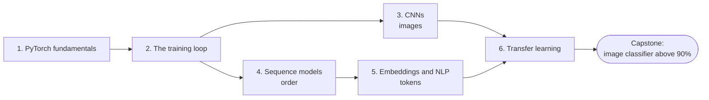

# Level 7: Deep Learning with PyTorch

> **Level 7 · Overview** · ⏱️ ~5–7 weeks at about an hour a day · Prerequisites: all of [Level 6](../06-neural-networks/index.md), especially [Autograd from scratch](../06-neural-networks/06-autograd-from-scratch.md)

You built neural networks by hand in Level 6: backpropagation in matrix form, an autograd engine, optimizers, initialization, normalization, dropout, and residual connections. Now you switch to PyTorch, the framework most deep learning research and much of industry uses, and learn the architectures that made deep learning work on images and text.

## What this level covers

PyTorch gives you industrial versions of the three things you wrote yourself in Level 6: tensors with automatic differentiation, layers, and optimizers. Because you know what they do underneath, you can focus on using them well: writing a training loop that is correct, reproducible, and debuggable, and choosing the architecture that fits the structure of your data.

The level has three parts:

1. **The toolkit (Chapters 1–2).** Tensors, dtypes, devices, views and copies, autograd, `nn.Module`, `Dataset` and `DataLoader`. Then the canonical training loop and everything around it: train and eval modes, validation, early stopping, resumable checkpoints, seeding, mixed precision, logging, a learning-rate finder, and the "overfit one batch" sanity check.
2. **Architectures for structure (Chapters 3–5).** Convolutional networks for the spatial structure of images, from a hand-written convolution to ResNet. Recurrent networks, LSTMs, and GRUs for sequences, ending at the bottleneck that motivated attention. Embeddings for discrete tokens, with word2vec trained from scratch and a text classifier.
3. **Standing on others' shoulders (Chapter 6).** Transfer learning: feature extraction, fine-tuning, freezing, discriminative learning rates, domain shift, torchvision pretrained models, and Hugging Face basics.

Every example runs on a laptop CPU in minutes. The image chapters and the capstone use **FashionMNIST** (70,000 small clothing images, downloaded by torchvision the first time, about 30 MB); the sequence chapter uses synthetic tasks; the NLP chapter uses a small corpus embedded in the page and a synthetic ticket dataset. Where a step needs a large download (ImageNet-pretrained weights, Hugging Face models), the code is shown and clearly marked as not run on the page.

## What you'll be able to do

- Write device-agnostic PyTorch code with tensors, autograd, `nn.Module`, and `DataLoader`, and verify autograd against gradients you derive by hand.
- Write a training loop with validation, early stopping, checkpoints that resume exactly, seeding, mixed precision, and logging, and debug it with an initial-loss check, a single-batch overfit test, and an LR range test.
- Implement a convolution by hand, compute output sizes, receptive fields, and parameter counts, build and train CNNs with augmentation, and inspect their filters and feature maps.
- Trace the path from LeNet to VGG to ResNet, and explain what object detection and segmentation add.
- Implement RNN and LSTM cells, explain and measure vanishing gradients through time, handle variable-length batches, and train a sequence-to-sequence model with teacher forcing.
- Tokenize text, train word2vec with negative sampling, reason honestly about embedding geometry, build a text classifier with `EmbeddingBag`, and explain subword tokenization.
- Choose between feature extraction and fine-tuning, freeze layers correctly, use discriminative learning rates, and recognize and mitigate domain shift.

## Chapters

| # | Chapter | What it covers | Time |
|---|---|---|---|
| 1 | [PyTorch fundamentals](01-pytorch-fundamentals.md) | Tensors, dtypes, devices, views vs copies, broadcasting, autograd and the backward graph, gradient accumulation, `no_grad` and `detach`, `nn.Module`, `Dataset`/`DataLoader`, NumPy interop | ~3.5 h |
| 2 | [The training loop](02-the-training-loop.md) | The canonical loop, train vs eval mode, validation, early stopping, checkpointing, seeding, mixed precision (`autocast`, `GradScaler`), TensorBoard, an LR finder, overfitting one batch | ~4 h |
| 3 | [Convolutional neural networks](03-convolutional-networks.md) | Convolution by hand, stride, padding, output size, pooling, receptive fields, parameter counts, LeNet → VGG → ResNet, augmentation, filters and feature maps, detection and segmentation | ~4.5 h |
| 4 | [Sequence models](04-sequence-models.md) | RNNs by hand, BPTT and vanishing gradients, LSTM and GRU, bidirectional and stacked RNNs, packing, seq2seq with teacher forcing, the bottleneck that led to attention | ~4.5 h |
| 5 | [Embeddings and NLP basics](05-embeddings-and-nlp.md) | Tokenization, one-hot vs embeddings, word2vec with negative sampling, GloVe, embedding geometry, `EmbeddingBag` text classification, a BPE preview | ~4 h |
| 6 | [Transfer learning](06-transfer-learning.md) | Why pretrained models work, feature extraction vs fine-tuning, freezing, discriminative learning rates, domain shift and AdaBN, torchvision models, Hugging Face basics | ~3.5 h |

Times include reading, running the code, and doing the exercises.

## How to study this level

- **Connect every PyTorch call to Level 6.** When you call `loss.backward()`, picture the reverse topological sort in your own autograd engine. When you call `optimizer.step()`, picture your Adam class.
- **Make Chapter 2's loop muscle memory.** Every later chapter, and every project after this handbook, uses it. Write `train_one_epoch`, `evaluate`, and `fit` from memory until you get them right without looking.
- **Print shapes constantly.** Most PyTorch bugs are shape, dtype, or device bugs. Keep the [PyTorch cheat sheet](../../cheatsheets/pytorch.md) open.
- **Run the experiments, then change them.** Each chapter's results are real outputs from the code on the page. Change a seed, a learning rate, or a width, and predict what will happen before you run it. Several chapters show honest, unglamorous results on purpose; learn to read them.
- **Keep a log of runs.** Write down the configuration and result of every training run in this level. The habit pays off in the capstone.

!!! tip "GPUs and Google Colab"
    Everything in this level runs on a CPU, and the chapters are written so it finishes in minutes. A GPU makes the CNN and transfer-learning code several times faster and lets you try bigger models, wider networks, and full datasets. If you don't have one, open a notebook in [Google Colab](https://colab.research.google.com/), choose *Runtime → Change runtime type → GPU*, and the device-agnostic code from [Chapter 1](01-pytorch-fundamentals.md) will pick it up automatically. Rerun the capstone there with a wider network and more epochs and compare.

## Capstone

[**Train an image classifier above 90% accuracy, with augmentation, tracking, and an error analysis.**](../../exercises/level-7-capstone.md) You'll build a complete FashionMNIST project as four scripts: a seeded data pipeline with augmentation, a baseline and sanity checks, a ResNet-style CNN that trains on a CPU in minutes, logged metrics and checkpoints, one honest test evaluation, and an error analysis with a confusion matrix, the most-confused pairs, and a gallery of mistakes.
