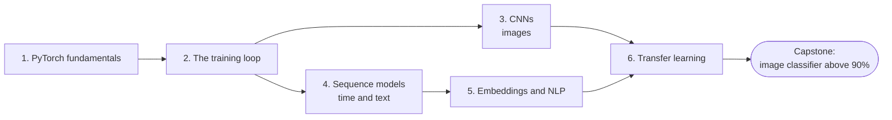

# Level 7: Deep Learning with PyTorch

> **Level 7 · Overview** · ⏱️ ~5–7 weeks at about an hour a day · Prerequisites: all of [Level 6](../06-neural-networks/index.md), especially [autograd from scratch](../06-neural-networks/06-autograd-from-scratch.md)

You built neural networks by hand in Level 6. Now you switch to PyTorch, the framework most deep learning research and much of industry uses, and you learn the architectures that made deep learning work on images and text.

## What this level covers

PyTorch gives you three things you wrote yourself in Level 6: tensors, automatic differentiation, and building blocks for layers and optimizers. Because you already know what they do underneath, you can focus on using them well. That means writing a training loop that is correct, reproducible, and debuggable, and knowing which architecture fits which kind of data.

The level has three parts:

1. **The toolkit (Chapters 1–2).** Tensors, devices, autograd, `nn.Module`, `Dataset` and `DataLoader`, then the canonical training loop and everything around it: train and eval modes, validation, checkpointing, seeding, mixed precision, logging, learning-rate finders, and the "overfit one batch" sanity check.
2. **Architectures for structure (Chapters 3–5).** Convolutional networks exploit the spatial structure of images. Recurrent networks, LSTMs, and GRUs process sequences one step at a time. Embeddings turn discrete tokens such as words into vectors a network can learn from.
3. **Standing on others' shoulders (Chapter 6).** Transfer learning: reusing a model trained on a large dataset for your smaller problem. This is how most real deep learning projects start.

All examples run on a laptop CPU in minutes, using scikit-learn's digits, synthetic data, or small embedded text. Where the standard datasets (MNIST, Fashion-MNIST, CIFAR-10) or pretrained models are the natural choice, the chapters give you the download code to run yourself.

## What you'll be able to do

- Write device-agnostic PyTorch code with tensors, autograd, `nn.Module`, and `DataLoader`.
- Write a correct training loop with validation, checkpointing, seeding, mixed precision, and logging, and debug it with a single-batch overfit test and a learning-rate finder.
- Explain convolution, stride, padding, pooling, and receptive fields, compute output shapes by hand, and build and train a CNN with data augmentation.
- Trace the path from LeNet to VGG to ResNet, and explain what object detection and segmentation add.
- Implement RNN and LSTM cells, explain backpropagation through time and why gradients vanish, and train a sequence-to-sequence model with teacher forcing.
- Tokenize text, train word2vec embeddings with negative sampling, reason about embedding geometry, and build a text classifier.
- Fine-tune a pretrained model, choosing between feature extraction, full fine-tuning, and gradual unfreezing with discriminative learning rates, and recognize domain shift.

## Chapters

| # | Chapter | What it covers | Time |
|---|---|---|---|
| 1 | [PyTorch fundamentals](01-pytorch-fundamentals.md) | Tensors and devices, autograd in PyTorch, `nn.Module`, `Dataset` and `DataLoader`, NumPy interop, GPU basics | ~3.5 h |
| 2 | [The training loop](02-the-training-loop.md) | The canonical loop, train vs eval mode, validation, checkpointing, seeding, mixed precision, logging, learning-rate finders, overfitting one batch | ~4 h |
| 3 | [Convolutional neural networks](03-convolutional-networks.md) | Convolutions from scratch, kernels, stride, padding, pooling, receptive fields, LeNet to ResNet, augmentation, visualizing filters, detection and segmentation | ~4.5 h |
| 4 | [Sequence models](04-sequence-models.md) | Recurrence, vanilla RNNs, backpropagation through time, LSTMs and GRUs, bidirectional and stacked RNNs, seq2seq and teacher forcing, the limits that led to attention | ~4.5 h |
| 5 | [Embeddings and NLP basics](05-embeddings-and-nlp.md) | Tokenization, one-hot vs dense embeddings, word2vec with negative sampling, GloVe, embedding geometry, text classification, a BPE preview | ~4 h |
| 6 | [Transfer learning](06-transfer-learning.md) | Why pretrained models work, feature extraction vs fine-tuning, torchvision models, freezing and discriminative learning rates, Hugging Face basics, domain shift | ~3.5 h |

Times include reading, running the code, and doing the exercises.

## How to study this level

- **Connect every PyTorch call to Level 6.** When you call `loss.backward()`, picture the topological sort from your own autograd engine. When you call `optimizer.step()`, picture your Adam class.
- **Make Chapter 2's loop muscle memory.** Every later chapter, and every project you do after this handbook, uses it. Write it from memory until you get it right without looking.
- **Print shapes constantly.** Most PyTorch bugs are shape bugs. The shape tables in the [PyTorch cheat sheet](../../cheatsheets/pytorch.md) and [neural network recipes](../../cheatsheets/neural-network-recipes.md) help.
- **Run the small examples, then scale up.** Everything here trains on a CPU. If you have a GPU or a free Colab session, rerun the CNN and transfer-learning examples on MNIST or CIFAR-10 to see the same ideas at scale.
- **Keep a log of runs.** Write down the hyperparameters and the result of every training run you do in this level. The habit pays off in the capstone.

## Capstone

[**Train an image classifier above 90% accuracy, with augmentation, tracking, and an error analysis.**](../../exercises/level-7-capstone.md) You'll build a full image-classification project on Fashion-MNIST: a clean data pipeline, a baseline, a CNN with augmentation, tracked experiments, a checkpointed best model, one honest test evaluation, and an error analysis that explains what the model gets wrong.
