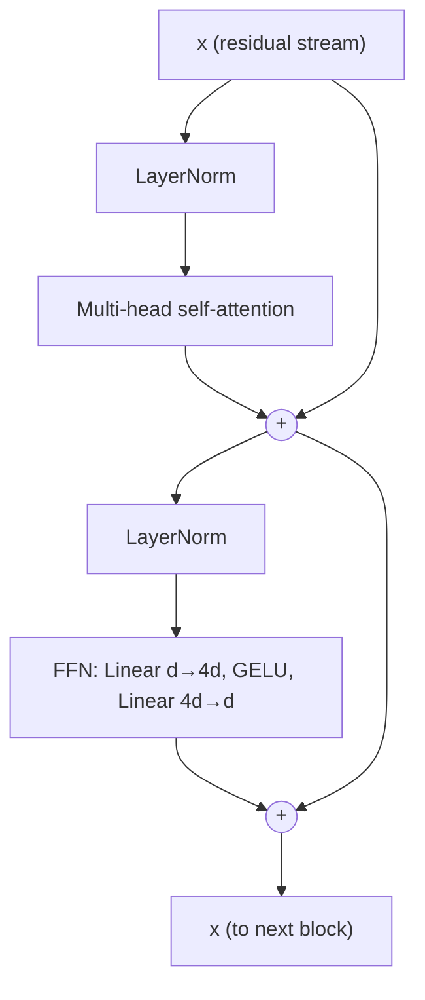
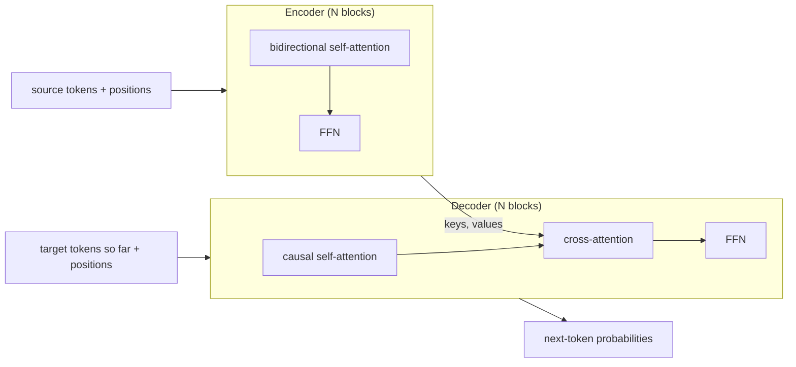
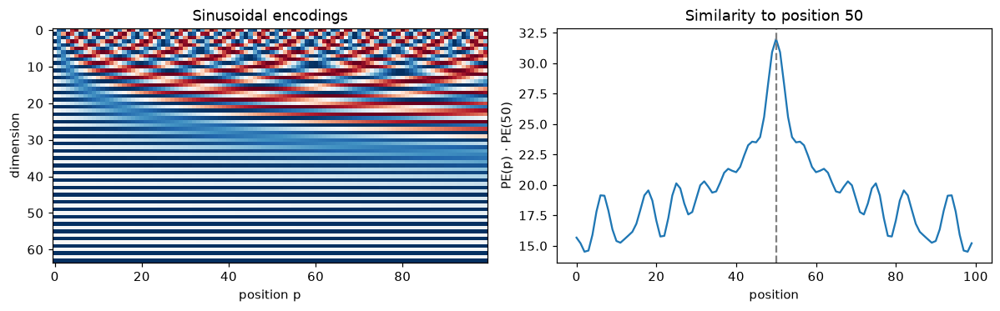
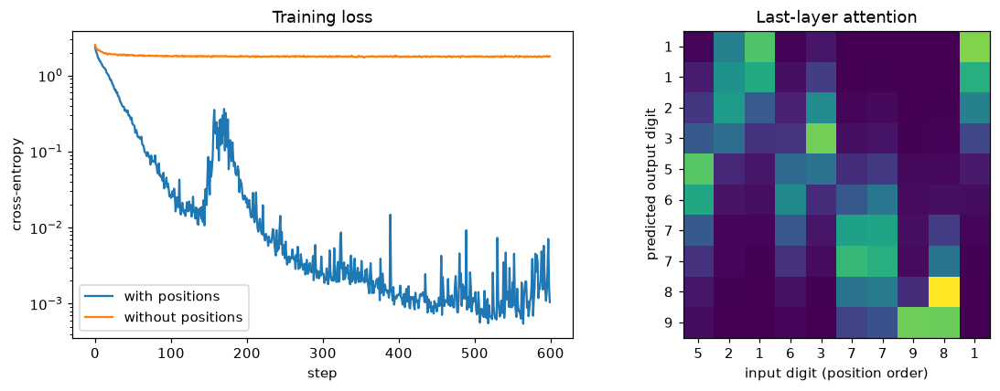

# Attention and Transformers

> **Level 8 · Chapter 1** · ⏱️ ~85 min read · Prerequisites: [Sequence models](../07-deep-learning-pytorch/04-sequence-models.md), [Embeddings and NLP basics](../07-deep-learning-pytorch/05-embeddings-and-nlp.md), [Training deep networks](../06-neural-networks/05-training-deep-networks.md)

The transformer is the architecture behind nearly every large model you've heard of, and its core is one small operation: **attention**, a differentiable way for each position in a sequence to look up information from every other position. This chapter derives scaled dot-product attention (including why it divides by $\sqrt{d_k}$), builds multi-head attention, three kinds of positional encoding, and a full pre-LN transformer block from scratch, checks each against PyTorch, and trains a tiny transformer that learns to sort.

## Why it matters

Sam was porting a small attention model from a tutorial to a bigger configuration. The tutorial used 16-dimensional attention heads and trained beautifully. Sam's version used 256-dimensional heads and a slightly "cleaned up" attention function, and its loss sat on a plateau for thousands of steps, then crawled down far slower than expected. Sam spent two days on learning rates, initialization, and warmup.

The bug was one missing division. While tidying, Sam had dropped the `/ math.sqrt(d_k)` from the attention scores, thinking it was a cosmetic constant. With 16-dimensional heads the scores were large but tolerable. With 256-dimensional heads they were four times larger again, the softmax saturated into near one-hot weights, and its gradient almost vanished. The model could barely learn which positions to attend to.

That constant isn't cosmetic. It comes from a two-line variance calculation you'll do in this chapter, and you'll see it numerically. More broadly, the transformer's parts (the scaling, the masking, the residual stream, the layer norms, and the positional encodings) each solve a specific problem. If you know which problem each part solves, you can read any modern architecture paper and debug any transformer that won't train.

## Concepts

### The problem attention solves

In [Sequence models](../07-deep-learning-pytorch/04-sequence-models.md) you built sequence-to-sequence models with RNNs. The encoder reads the whole input and squeezes it into one fixed-size vector, and the decoder generates the output from that vector. Two problems follow.

- **The bottleneck.** A 50-word sentence and a 5-word sentence get the same size summary. Long inputs lose information.
- **Sequential computation.** An RNN must process position $t-1$ before position $t$. You can't parallelize across time, and information from position 1 must pass through every step to reach position 100, with gradients shrinking along the way.

In 2015, Bahdanau, Cho, and Bengio let the decoder, at each output step, look back at *all* the encoder's hidden states and take a weighted average of them, with weights computed on the fly: **attention**. Translation quality on long sentences improved dramatically. Two years later, Vaswani et al. asked: what if attention is the *only* mechanism, with no recurrence at all? The answer, the **transformer**, processes all positions in parallel and connects any two positions in one step. Their paper's title said it: "Attention Is All You Need."

### Attention as a soft dictionary lookup

Think of a Python dictionary. You have a **query**, you compare it with every **key**, and you return the **value** of the key that matches exactly.

```text
query "cat"  →  keys ["dog", "cat", "eel"]  →  match key 2  →  return value 2
```

That's a **hard lookup**: one key wins, everything else contributes nothing. It isn't differentiable, because a tiny change in the query either changes nothing or flips the winner.

Attention makes it soft. Each key is a vector $\mathbf{k}_i$, each value a vector $\mathbf{v}_i$, and the query a vector $\mathbf{q}$. Score how well the query matches each key, turn the scores into positive weights that sum to 1, and return the weighted average of the values:

$$
s_i = \operatorname{score}(\mathbf{q}, \mathbf{k}_i), \qquad \alpha_i = \frac{e^{s_i}}{\sum_{j=1}^{n} e^{s_j}}, \qquad \operatorname{attn}(\mathbf{q}) = \sum_{i=1}^{n} \alpha_i\,\mathbf{v}_i.
$$

The weights $\alpha_i$ (the **attention weights**) come from a softmax, so everything is smooth. If one score is much larger than the others, the result is close to a hard lookup of that value. If the scores are all equal, it's the plain average of all values. Training adjusts how queries and keys are produced, so the model *learns what to look up*.

The most common score is the **dot product** $\mathbf{q}^\top\mathbf{k}_i$, which is large when the two vectors point in similar directions. (Bahdanau's original score was a small MLP, called **additive attention**. Dot products won because they're a single matrix multiplication, which GPUs do extremely fast.)

### Scaled dot-product attention

Stack $m$ queries as the rows of a matrix $Q \in \mathbb{R}^{m \times d_k}$, $n$ keys as rows of $K \in \mathbb{R}^{n \times d_k}$, and the $n$ values as rows of $V \in \mathbb{R}^{n \times d_v}$. Here $d_k$ is the query and key dimension, and $d_v$ the value dimension. All the dot products at once are the entries of $QK^\top \in \mathbb{R}^{m \times n}$: row $i$, column $j$ is query $i$ dotted with key $j$. **Scaled dot-product attention** is

$$
\operatorname{Attention}(Q, K, V) = \operatorname{softmax}\!\left(\frac{QK^\top}{\sqrt{d_k}}\right) V,
$$

where the softmax is applied to each row separately. The output has shape $m \times d_v$: one blended value per query. The $m \times n$ matrix $A = \operatorname{softmax}(QK^\top/\sqrt{d_k})$ is the **attention matrix**; row $i$ says how much query $i$ draws from each value.

**Why divide by $\sqrt{d_k}$?** Look at the raw score of one query and one key. Suppose, as is roughly true at initialization when inputs are normalized, that the components $q_1, \ldots, q_{d_k}$ and $k_1, \ldots, k_{d_k}$ are independent with mean 0 and variance 1. The score is a sum of $d_k$ terms:

$$
\mathbf{q}^\top\mathbf{k} = \sum_{j=1}^{d_k} q_j k_j.
$$

Each term has mean $\mathbb{E}[q_j k_j] = \mathbb{E}[q_j]\,\mathbb{E}[k_j] = 0$ (independence), and variance

$$
\operatorname{Var}(q_j k_j) = \mathbb{E}[q_j^2 k_j^2] - \left(\mathbb{E}[q_j k_j]\right)^2 = \mathbb{E}[q_j^2]\,\mathbb{E}[k_j^2] - 0 = 1 \cdot 1 = 1.
$$

The terms are independent, so their variances add:

$$
\operatorname{Var}(\mathbf{q}^\top\mathbf{k}) = d_k, \qquad \operatorname{Std}(\mathbf{q}^\top\mathbf{k}) = \sqrt{d_k}.
$$

So the typical score grows like $\sqrt{d_k}$. With $d_k = 256$, scores have a standard deviation of 16, and the gap between the largest and second-largest score in a row is often more than 10. Then $e^{10} \approx 22{,}000$, and the softmax is effectively one-hot.

A one-hot softmax is bad for learning. The softmax Jacobian (you derived it in [Forward and backpropagation](../06-neural-networks/02-forward-and-backpropagation.md)) is

$$
\frac{\partial \alpha_i}{\partial s_j} = \alpha_i(\delta_{ij} - \alpha_j),
$$

where $\delta_{ij}$ is 1 if $i = j$ and 0 otherwise. If one $\alpha_i \approx 1$ and the rest $\approx 0$, every entry is close to 0: $\alpha_i(1 - \alpha_i) \approx 0$ on the diagonal and $\alpha_i\alpha_j \approx 0$ off it. The gradient that should teach the model *where* to attend almost disappears. Dividing the scores by $\sqrt{d_k}$ brings their variance back to 1 regardless of head size, so the softmax starts in its responsive range. You'll measure all of this in the In practice section.

### Self-attention and cross-attention

Where do $Q$, $K$, and $V$ come from? In **self-attention**, all three come from the same sequence. Let $X \in \mathbb{R}^{T \times d}$ hold the $T$ token representations of a sequence, one $d$-dimensional row per position. Three learned weight matrices project it:

$$
Q = XW_Q, \qquad K = XW_K, \qquad V = XW_V, \qquad W_Q, W_K \in \mathbb{R}^{d \times d_k},\; W_V \in \mathbb{R}^{d \times d_v}.
$$

Each position produces a query ("what am I looking for?"), a key ("what do I contain?"), and a value ("what do I pass on if selected?"). The output at position $t$ is a mix of all positions' values, weighted by how well $t$'s query matches their keys. In the sentence "The animal didn't cross the street because it was too tired", a well-trained layer can make the representation of "it" draw heavily from "animal".

Having separate projections matters. If queries and keys were the same vector, every token would match itself most strongly. Separate $W_Q$ and $W_K$ let the model learn asymmetric relations: a verb looking for its subject, a closing bracket looking for its opening one.

In **cross-attention**, queries come from one sequence and keys and values from another. In translation, the decoder's positions produce queries and the encoder's output produces keys and values, so each target word can look up the relevant source words. The attention matrix is then $T_{\text{dec}} \times T_{\text{enc}}$, not square.

Self-attention costs $O(T^2 d)$ time and $O(T^2)$ memory for the attention matrix, because every position scores against every other. That quadratic cost in sequence length is the transformer's main weakness, and much research (and the KV cache of the next chapter) is about living with it.

### Masking

Sometimes a position must *not* see certain others. You enforce that with a **mask**: set the forbidden scores to $-\infty$ before the softmax. Since $e^{-\infty} = 0$, those positions get exactly zero weight, and the remaining weights still sum to 1.

$$
\operatorname{Attention}(Q, K, V, M) = \operatorname{softmax}\!\left(\frac{QK^\top}{\sqrt{d_k}} + M\right)V, \qquad M_{ij} = \begin{cases} 0 & \text{if query } i \text{ may see key } j \\ -\infty & \text{otherwise.} \end{cases}
$$

Two masks are everywhere:

- A **padding mask.** Batches contain sequences of different lengths, padded with a filler token to a common length. Padding positions carry no information, so no query should attend to them.
- A **causal mask** (or look-ahead mask). A model that predicts the next token must not see the future. Position $t$ may attend only to positions $1, \ldots, t$, so $M$ is $-\infty$ above the diagonal. The attention matrix becomes lower triangular. This one mask is what turns a transformer into a language model, as you'll see in the [next chapter](02-language-models.md).

### Multi-head attention

One attention operation computes one weighting per query. But a token often needs several kinds of information at once: its syntactic head, the entity it refers to, the previous token. A single softmax has to compromise between them.

**Multi-head attention** runs $h$ attention operations, called **heads**, in parallel, each with its own smaller projections, then concatenates their outputs and mixes them with one more matrix:

$$
\operatorname{head}_i = \operatorname{Attention}(XW_Q^{(i)},\, XW_K^{(i)},\, XW_V^{(i)}), \qquad \operatorname{MHA}(X) = \operatorname{Concat}(\operatorname{head}_1, \ldots, \operatorname{head}_h)\,W_O.
$$

Usually each head has $d_k = d_v = d/h$, so the total work is about the same as one full-width head. With $d = 512$ and $h = 8$, each head attends in a 64-dimensional subspace. In code you don't create $h$ separate matrices: you compute one $d \times d$ projection and *reshape* the result into $h$ heads of size $d/h$, which is mathematically identical.

**Parameter count.** $W_Q$, $W_K$, $W_V$, and $W_O$ are each $d \times d$ in total across heads, plus a bias of size $d$ each if used:

$$
\text{params}(\operatorname{MHA}) = 4d^2 + 4d.
$$

Note that this doesn't depend on $h$. More heads means narrower heads, not more parameters.

Heads do specialize in trained models. Researchers have found heads that attend to the previous token, heads that track syntactic relations, and "induction heads" that find an earlier occurrence of the current token and copy what came after it. Many heads are also redundant and can be pruned with little loss.

### Positions: attention can't tell order

Here's a surprising property. Self-attention without anything else is **permutation-equivariant**: shuffle the input positions and the outputs are shuffled the same way, but otherwise unchanged. Each output is a weighted average whose weights depend only on content (query-key dot products), never on where tokens sit. "Dog bites man" and "man bites dog" give the same set of output vectors.

So transformers must inject position information explicitly. There are three main ways.

**Sinusoidal encodings** (the original transformer). Add to each token's embedding a fixed vector that depends on its position $p$. Dimension pairs $(2i, 2i+1)$ oscillate at different frequencies:

$$
\mathrm{PE}(p, 2i) = \sin\!\left(\frac{p}{10000^{2i/d}}\right), \qquad \mathrm{PE}(p, 2i+1) = \cos\!\left(\frac{p}{10000^{2i/d}}\right),
$$

for $i = 0, \ldots, d/2 - 1$. Low dimensions change quickly with position (wavelength $2\pi$), high dimensions slowly (wavelength up to $10000 \cdot 2\pi$), like the hands of a clock, or the bits of a binary counter made smooth. Why sines and cosines? Write $\omega_i = 10000^{-2i/d}$ for pair $i$'s frequency. By the angle-addition formulas,

$$
\begin{pmatrix} \sin(\omega_i(p + k)) \\ \cos(\omega_i(p + k)) \end{pmatrix} = \begin{pmatrix} \cos\omega_i k & \sin\omega_i k \\ -\sin\omega_i k & \cos\omega_i k \end{pmatrix} \begin{pmatrix} \sin\omega_i p \\ \cos\omega_i p \end{pmatrix}.
$$

The encoding of position $p + k$ is a fixed linear function (a rotation) of the encoding of position $p$, for any $p$. That makes "attend to the token $k$ steps back" something a linear layer can express. Sinusoidal encodings need no parameters and are defined for any position, though models rarely generalize well beyond the lengths they trained on.

**Learned absolute embeddings** (BERT, GPT-2). Keep a trainable table with one $d$-dimensional vector per position, `nn.Embedding(max_len, d)`, and add row $p$ to the token at position $p$. Simple and flexible, but it can't handle positions beyond `max_len` at all.

**Rotary position embeddings (RoPE)** (Su et al., 2021; used by Llama, Mistral, and most recent LLMs). Instead of adding anything to the embeddings, RoPE *rotates* each query and key by an angle proportional to its position, inside the attention layer. Take one pair of dimensions and treat it as a complex number $z = x_1 + i x_2$. For a query at position $m$ and a key at position $n$, rotate:

$$
\tilde{q} = q\,e^{i m\theta}, \qquad \tilde{k} = k\,e^{i n\theta}.
$$

The real dot product of two 2D vectors $a$ and $b$, viewed as complex numbers, is $\operatorname{Re}(a\,\bar{b})$, where $\bar{b}$ is the complex conjugate. So the attention score for this pair becomes

$$
\operatorname{Re}\!\left(\tilde{q}\,\overline{\tilde{k}}\right) = \operatorname{Re}\!\left(q\,e^{im\theta}\,\bar{k}\,e^{-in\theta}\right) = \operatorname{Re}\!\left(q\,\bar{k}\,e^{i(m - n)\theta}\right).
$$

The absolute positions $m$ and $n$ have vanished; only the offset $m - n$ remains. The score depends on content and **relative position**, which is what language mostly cares about. RoPE applies this to each of the $d/2$ pairs with its own frequency $\theta_i = 10000^{-2i/d}$, like the sinusoidal scheme. In real coordinates, rotating pair $(x_1, x_2)$ by angle $\phi$ is

$$
\begin{pmatrix} x_1' \\ x_2' \end{pmatrix} = \begin{pmatrix} x_1\cos\phi - x_2\sin\phi \\ x_1\sin\phi + x_2\cos\phi \end{pmatrix}.
$$

Rotations preserve length, so RoPE doesn't change the scale of queries and keys. Values aren't rotated. Another relative scheme you'll meet is **ALiBi** (Press et al., 2022), which adds a penalty proportional to the distance $|m - n|$ directly to the scores.

### The transformer block

A transformer is a stack of identical **blocks**. Each block has two sublayers:

1. **Multi-head self-attention**, which moves information *between* positions.
2. A **feed-forward network (FFN)**, also called the MLP, which processes each position *independently*: two linear layers with a nonlinearity between, usually expanding to $4d$ in the middle.

$$
\operatorname{FFN}(\mathbf{x}) = W_2\,\operatorname{GELU}(W_1\mathbf{x} + \mathbf{b}_1) + \mathbf{b}_2, \qquad W_1 \in \mathbb{R}^{4d \times d},\; W_2 \in \mathbb{R}^{d \times 4d}.
$$

A useful mental model: attention is *communication* (positions exchange information), and the FFN is *computation* (each position thinks about what it gathered). Two-thirds of a block's parameters are in the FFN, and research suggests much of a model's factual knowledge is stored there.

Each sublayer is wrapped in a **residual connection** and **layer normalization**, both from [Training deep networks](../06-neural-networks/05-training-deep-networks.md). There are two arrangements.

**Post-LN** (the original 2017 transformer) normalizes after adding the residual:

$$
\mathbf{x} \leftarrow \operatorname{LN}(\mathbf{x} + \operatorname{MHA}(\mathbf{x})), \qquad \mathbf{x} \leftarrow \operatorname{LN}(\mathbf{x} + \operatorname{FFN}(\mathbf{x})).
$$

**Pre-LN** (GPT-2 and almost every model since) normalizes the *input* of each sublayer and leaves the residual path untouched:

$$
\mathbf{x} \leftarrow \mathbf{x} + \operatorname{MHA}(\operatorname{LN}(\mathbf{x})), \qquad \mathbf{x} \leftarrow \mathbf{x} + \operatorname{FFN}(\operatorname{LN}(\mathbf{x})).
$$

In pre-LN there's a clean path from the input embeddings to the output: the **residual stream**. Each sublayer reads a normalized copy of the stream and *adds* its contribution. Gradients flow straight back along the identity path, so deep pre-LN stacks train stably without the careful learning-rate warmup that post-LN needs (Xiong et al., 2020, analyzed why). Pre-LN models need one extra LayerNorm after the last block, before the output layer, because the stream itself is never normalized. Many recent models use **RMSNorm**, a LayerNorm without mean-centering, and **SwiGLU**, a gated FFN variant; the structure is the same.

**Parameter count of a block.** Attention has $4d^2 + 4d$. The FFN has $d \cdot 4d + 4d$ for the first layer and $4d \cdot d + d$ for the second, so $8d^2 + 5d$. Two LayerNorms have a scale and a shift of size $d$ each, $4d$ in total. The block has

$$
12d^2 + 13d \approx 12d^2 \text{ parameters.}
$$

Remember $12d^2$ per layer; you'll use it to count GPT parameters in the next chapter.



### Encoders, decoders, and encoder-decoders

The same blocks assemble into three families, which differ mainly in their masks.

| Family | Attention | Trained to | Good at | Examples |
|---|---|---|---|---|
| **Encoder-only** | Bidirectional self-attention (no causal mask) | Fill in masked tokens | Understanding: classification, retrieval embeddings, tagging | BERT, RoBERTa, ViT |
| **Decoder-only** | Causal self-attention | Predict the next token | Generation; with scale, nearly everything | GPT family, Llama, Mistral, Claude |
| **Encoder-decoder** | Encoder: bidirectional; decoder: causal self-attention plus cross-attention to the encoder | Map an input sequence to an output sequence | Translation, summarization, speech recognition | Original transformer, T5, BART, Whisper |

An encoder-decoder block in the decoder has three sublayers: causal self-attention over the output so far, cross-attention whose keys and values come from the encoder's final output, and the FFN.



Why did decoder-only models take over? A decoder-only model can turn any task into "continue this text", it trains on raw text with no labels, and it gets a training signal at every position. Encoder-only models remain strong and cheap for embeddings and classification. Encoder-decoders remain common where input and output are clearly different things, such as audio to text.

## In practice

### Attention as a soft lookup, in numbers

Start with the dictionary picture. Three keys in 2D, three scalar values, and a query close to the second key. A "sharpness" factor multiplies the scores, so you can see the softmax move from a blurry average to a near-hard lookup.

```python
import math
import time
import numpy as np
import torch
import torch.nn as nn
import torch.nn.functional as F
import matplotlib.pyplot as plt

torch.set_num_threads(4)
torch.manual_seed(0)

keys = torch.tensor([[1.0, 0.0], [0.0, 1.0], [-1.0, 0.0]])
values = torch.tensor([10.0, 20.0, 30.0])
query = torch.tensor([0.1, 0.9])

for sharpness in [0.1, 1.0, 5.0, 50.0]:
    w = (sharpness * keys @ query).softmax(dim=0)
    print(f"sharpness {sharpness:5.1f}: weights {w.numpy().round(3)}, output {w @ values:.2f}")
```

```text
sharpness   0.1: weights [0.326 0.354 0.32 ], output 19.94
sharpness   1.0: weights [0.247 0.55  0.202], output 19.55
sharpness   5.0: weights [0.018 0.976 0.007], output 19.89
sharpness  50.0: weights [0. 1. 0.], output 20.00
```

At low sharpness every value contributes; at high sharpness the output is almost exactly the second value, 20. Attention lives between these extremes, and the model learns how sharp to be by learning the scale of its queries and keys.

### Scaled dot-product attention by hand, checked against PyTorch

Here is attention in five lines. The mask convention matches PyTorch's `F.scaled_dot_product_attention`: a boolean mask where `True` means "may attend".

```python
def attention(Q, K, V, mask=None):
    """Scaled dot-product attention. Q: (..., m, d_k), K: (..., n, d_k), V: (..., n, d_v)."""
    d_k = Q.shape[-1]
    scores = Q @ K.transpose(-2, -1) / math.sqrt(d_k)         # (..., m, n)
    if mask is not None:
        scores = scores.masked_fill(~mask, float("-inf"))      # forbidden -> -inf
    weights = scores.softmax(dim=-1)                           # each row sums to 1
    return weights @ V, weights

B, T, d_k = 2, 5, 8
Q, K, V = torch.randn(B, T, d_k), torch.randn(B, T, d_k), torch.randn(B, T, d_k)

out, w = attention(Q, K, V)
ref = F.scaled_dot_product_attention(Q, K, V)
print("shapes:", tuple(out.shape), tuple(w.shape))
print("rows sum to 1:", torch.allclose(w.sum(-1), torch.ones(B, T)))
print(f"max |ours - torch|, no mask:     {(out - ref).abs().max():.2e}")

causal = torch.tril(torch.ones(T, T, dtype=torch.bool))       # True on and below the diagonal
out_c, w_c = attention(Q, K, V, mask=causal)
ref_c = F.scaled_dot_product_attention(Q, K, V, is_causal=True)
print(f"max |ours - torch|, causal mask: {(out_c - ref_c).abs().max():.2e}")
print("causal weights for batch 0:\n", w_c[0].numpy().round(2))
```

```text
shapes: (2, 5, 8) (2, 5, 5)
rows sum to 1: True
max |ours - torch|, no mask:     2.38e-07
max |ours - torch|, causal mask: 1.19e-07
causal weights for batch 0:
 [[1.   0.   0.   0.   0.  ]
 [0.84 0.16 0.   0.   0.  ]
 [0.26 0.11 0.62 0.   0.  ]
 [0.44 0.06 0.06 0.44 0.  ]
 [0.32 0.25 0.08 0.18 0.18]]
```

The differences are at the level of float32 rounding, so the implementation is right. The causal weights are lower triangular: position 0 can only see itself, so its weight is 1, and position 4 spreads its attention over all five.

!!! warning "Common mistake: two opposite mask conventions"
    In `F.scaled_dot_product_attention`, a boolean `attn_mask` marks positions that **may** be attended (`True` = keep). In `nn.MultiheadAttention` and `nn.Transformer`, a boolean `attn_mask` or `key_padding_mask` marks positions that are **blocked** (`True` = mask out). Pass one API's mask to the other and your model silently attends only to the forbidden positions. Always test a mask on a tiny example and print the weights.

### Why $\sqrt{d_k}$: the variance argument, measured

Now check the derivation. For each head size $d_k$, draw random unit-variance queries and keys, and measure: the standard deviation of raw dot products, the average largest softmax weight over 8 keys with and without scaling, and the size of the softmax Jacobian $\alpha_i(\delta_{ij} - \alpha_j)$, which is what lets gradients reach the scores.

```python
torch.manual_seed(0)
n_keys = 8
print(f"{'d_k':>5} {'std(q.k)':>9} {'sqrt(d_k)':>9} | {'max weight':>10} {'(scaled)':>9} | {'|Jacobian|':>10} {'(scaled)':>9}")
for d_k in [4, 16, 64, 256, 1024]:
    q = torch.randn(4000, 1, d_k)
    k = torch.randn(4000, n_keys, d_k)
    s = (q @ k.transpose(1, 2)).squeeze(1)            # (4000, 8) raw scores
    stats = []
    for scores in [s, s / math.sqrt(d_k)]:
        a = scores.softmax(-1)
        jac = torch.diag_embed(a) - a.unsqueeze(2) * a.unsqueeze(1)   # d alpha_i / d s_j
        stats += [a.max(-1).values.mean().item(), jac.norm(dim=(1, 2)).mean().item()]
    print(f"{d_k:>5} {s.std():9.2f} {math.sqrt(d_k):9.2f} | {stats[0]:10.3f} {stats[2]:9.3f} | {stats[1]:10.3f} {stats[3]:9.3f}")
```

```text
  d_k  std(q.k) sqrt(d_k) | max weight  (scaled) | |Jacobian|  (scaled)
    4      1.99      2.00 |      0.526     0.342 |      0.342     0.360
   16      3.97      4.00 |      0.741     0.352 |      0.260     0.364
   64      8.00      8.00 |      0.878     0.362 |      0.148     0.366
  256     16.14     16.00 |      0.939     0.364 |      0.081     0.366
 1024     32.10     32.00 |      0.967     0.362 |      0.045     0.366
```

Everything matches the math. The standard deviation of $\mathbf{q}^\top\mathbf{k}$ is $\sqrt{d_k}$ almost exactly. Without scaling, the largest weight creeps toward 1 as $d_k$ grows, and the Jacobian's size falls roughly like $1/\sqrt{d_k}$: at $d_k = 1024$ the gradient signal into the scores is about 8 times weaker than with scaling. With scaling, both columns stay flat no matter the head size. That's Sam's bug, quantified.

### Multi-head attention from scratch, checked against `nn.MultiheadAttention`

The from-scratch module projects to queries, keys, and values with three $d \times d$ linear layers, reshapes into heads, calls the `attention` function above on all heads at once, and merges the heads back. It also accepts a separate `kv` input, which makes it cross-attention.

```python
class MultiHeadAttention(nn.Module):
    def __init__(self, d_model, n_heads):
        super().__init__()
        assert d_model % n_heads == 0
        self.h, self.d_head = n_heads, d_model // n_heads
        self.q_proj = nn.Linear(d_model, d_model)
        self.k_proj = nn.Linear(d_model, d_model)
        self.v_proj = nn.Linear(d_model, d_model)
        self.o_proj = nn.Linear(d_model, d_model)

    def split(self, x):                       # (B, T, d) -> (B, h, T, d_head)
        B, T, _ = x.shape
        return x.view(B, T, self.h, self.d_head).transpose(1, 2)

    def forward(self, x, kv=None, mask=None):
        kv = x if kv is None else kv          # self-attention unless kv is given
        q, k, v = self.split(self.q_proj(x)), self.split(self.k_proj(kv)), self.split(self.v_proj(kv))
        out, w = attention(q, k, v, mask)     # (B, h, T_q, d_head), (B, h, T_q, T_kv)
        self.last_weights = w.detach()
        B, _, T, _ = out.shape
        return self.o_proj(out.transpose(1, 2).reshape(B, T, self.h * self.d_head))

d_model, n_heads = 32, 4
torch.manual_seed(0)
mine = MultiHeadAttention(d_model, n_heads)
ref = nn.MultiheadAttention(d_model, n_heads, batch_first=True)
with torch.no_grad():                          # copy our weights into PyTorch's layout
    ref.in_proj_weight.copy_(torch.cat([mine.q_proj.weight, mine.k_proj.weight, mine.v_proj.weight]))
    ref.in_proj_bias.copy_(torch.cat([mine.q_proj.bias, mine.k_proj.bias, mine.v_proj.bias]))
    ref.out_proj.weight.copy_(mine.o_proj.weight)
    ref.out_proj.bias.copy_(mine.o_proj.bias)

x = torch.randn(3, 6, d_model)
out_mine = mine(x)
out_ref, w_ref = ref(x, x, x)                  # weights averaged over heads by default
print(f"output max diff:  {(out_mine - out_ref).abs().max():.2e}")
print(f"weights max diff: {(mine.last_weights.mean(1) - w_ref).abs().max():.2e}")

blocked = ~torch.tril(torch.ones(6, 6, dtype=torch.bool))     # PyTorch's convention: True = blocked
out_ref_c, _ = ref(x, x, x, attn_mask=blocked)
print(f"causal max diff:  {(mine(x, mask=~blocked) - out_ref_c).abs().max():.2e}")
print("parameters:", sum(p.numel() for p in mine.parameters()), "= 4d^2 + 4d =", 4 * d_model**2 + 4 * d_model)

enc_out = torch.randn(3, 10, d_model)          # cross-attention: 6 decoder queries, 10 encoder keys
print("cross-attention output", tuple(mine(x, kv=enc_out).shape), "weights", tuple(mine.last_weights.shape))
```

```text
output max diff:  8.94e-08
weights max diff: 2.98e-08
causal max diff:  8.94e-08
parameters: 4224 = 4d^2 + 4d = 4224
cross-attention output (3, 6, 32) weights (3, 4, 6, 10)
```

The outputs agree to float precision, with and without a mask. Note the inverted mask in the causal check, as the warning above explained. The cross-attention weights have shape (batch, heads, 6 queries, 10 keys): each decoder position distributes its attention over the 10 encoder positions.

### Positional encodings: sinusoidal, learned, and RoPE

First the sinusoidal table and its key property. The figure shows the encoding matrix and the dot product between position 50's encoding and every other position's: it peaks at offset 0 and decays with distance, so nearby positions have similar encodings.

```python
def sinusoidal_encoding(max_len, d):
    pos = torch.arange(max_len).unsqueeze(1)                  # (max_len, 1)
    freq = 10000 ** (-torch.arange(0, d, 2) / d)              # (d/2,) the omega_i
    pe = torch.zeros(max_len, d)
    pe[:, 0::2] = torch.sin(pos * freq)
    pe[:, 1::2] = torch.cos(pos * freq)
    return pe

pe = sinusoidal_encoding(100, 64)
fig, axes = plt.subplots(1, 2, figsize=(11, 3.5))
axes[0].imshow(pe.T, aspect="auto", cmap="RdBu")
axes[0].set(xlabel="position p", ylabel="dimension", title="Sinusoidal encodings")
axes[1].plot(pe @ pe[50])
axes[1].axvline(50, color="gray", ls="--")
axes[1].set(xlabel="position", ylabel="PE(p) · PE(50)", title="Similarity to position 50")
plt.tight_layout()
plt.show()

# The rotation property: PE(p + k) is a fixed linear map of PE(p), the same for every p.
k = 7
R = torch.linalg.lstsq(pe[:80], pe[k:80 + k]).solution     # fit PE(p+k) ≈ PE(p) @ R
print(f"max error predicting PE(p+{k}) from PE(p) with one matrix: {(pe[:80] @ R - pe[k:80 + k]).abs().max():.1e}")

learned = nn.Embedding(100, 64)                               # learned absolute positions: just a table
print("learned table:", tuple(learned.weight.shape), "trainable parameters:", learned.weight.numel())
```

```text
max error predicting PE(p+7) from PE(p) with one matrix: 3.3e-06
learned table: (100, 64) trainable parameters: 6400
```



*Left: each column is one position's encoding; low dimensions oscillate fast, high dimensions slowly. Right: encodings of nearby positions are most similar.*

A single matrix maps every position's encoding to the encoding 7 steps later, up to float error, which is the angle-addition argument in action.

Now RoPE. The function rotates each consecutive pair of dimensions $(x_{2i}, x_{2i+1})$ by angle $p\,\theta_i$. The test places the same query vector and the same key vector at different absolute positions, keeping the offset fixed, and checks that the score doesn't change.

```python
def rope(x, base=10000.0):
    """Apply rotary position embeddings to x of shape (..., T, d), d even. Position = index along T."""
    T, d = x.shape[-2], x.shape[-1]
    theta = base ** (-torch.arange(0, d, 2) / d)              # (d/2,) frequencies
    angle = torch.arange(T).unsqueeze(1) * theta              # (T, d/2): p * theta_i
    cos, sin = angle.cos(), angle.sin()
    x1, x2 = x[..., 0::2], x[..., 1::2]
    out = torch.empty_like(x)
    out[..., 0::2] = x1 * cos - x2 * sin
    out[..., 1::2] = x1 * sin + x2 * cos
    return out

torch.manual_seed(0)
d, T = 16, 64
q, k = torch.randn(d), torch.randn(d)
rq, rk = rope(q.expand(T, d)), rope(k.expand(T, d))           # the same q and k placed at every position
for m, n in [(5, 2), (20, 17), (60, 57), (10, 2)]:
    print(f"q at {m:2d}, k at {n:2d} (offset {m - n}): score {rq[m] @ rk[n]: .4f}")
print(f"norms preserved: {torch.allclose(rq.norm(dim=-1), q.norm().expand(T))}")
```

```text
q at  5, k at  2 (offset 3): score -4.2207
q at 20, k at 17 (offset 3): score -4.2207
q at 60, k at 57 (offset 3): score -4.2207
q at 10, k at  2 (offset 8): score -0.9723
norms preserved: True
```

Same offset, same score, wherever the pair sits; a different offset gives a different score. In a real model you call `rope` on the query and key tensors of shape `(B, h, T, d_head)` right after projection and before the dot product.

### A pre-LN transformer block

Now assemble the block. It takes an optional mask, so the same class serves as an encoder block (no mask) or a decoder block (causal mask).

```python
class TransformerBlock(nn.Module):
    def __init__(self, d_model, n_heads, dropout=0.0):
        super().__init__()
        self.ln1 = nn.LayerNorm(d_model)
        self.attn = MultiHeadAttention(d_model, n_heads)
        self.ln2 = nn.LayerNorm(d_model)
        self.ffn = nn.Sequential(nn.Linear(d_model, 4 * d_model), nn.GELU(),
                                 nn.Linear(4 * d_model, d_model), nn.Dropout(dropout))
        self.drop = nn.Dropout(dropout)

    def forward(self, x, mask=None):
        x = x + self.drop(self.attn(self.ln1(x), mask=mask))   # communicate
        x = x + self.ffn(self.ln2(x))                          # compute
        return x

d = 64
block = TransformerBlock(d, n_heads=4)
n_params = sum(p.numel() for p in block.parameters())
print(f"block parameters: {n_params:,}  formula 12d^2 + 13d = {12 * d**2 + 13 * d:,}")

x = torch.randn(2, 10, d)
y = block(x, mask=torch.tril(torch.ones(10, 10, dtype=torch.bool)))
print("input", tuple(x.shape), "-> output", tuple(y.shape))

# Causality check: changing a future token must not change earlier outputs.
x2 = x.clone()
x2[:, 7] += 1.0
y2 = block(x2, mask=torch.tril(torch.ones(10, 10, dtype=torch.bool)))
print("positions 0-6 unchanged:", torch.allclose(y[:, :7], y2[:, :7]), "| position 7 changed:", not torch.allclose(y[:, 7], y2[:, 7]))
```

```text
block parameters: 49,984  formula 12d^2 + 13d = 49,984
input (2, 10, 64) -> output (2, 10, 64)
positions 0-6 unchanged: True | position 7 changed: True
```

The parameter count matches the formula exactly. The causality test is worth copying into your own projects: perturb a future position and assert that the past is untouched. It catches mask bugs that would otherwise show up only as a suspiciously low training loss.

### Training a tiny transformer to sort

Time to see a transformer learn. The task: given 10 random digits, output the same digits in sorted order, one output per position. This needs both content (which digits are present) and position (output position $i$ must hold the $i$-th smallest). It's an encoder-only setup, since every output may look at the whole input.

The model is token embeddings plus learned position embeddings, two pre-LN blocks, a final LayerNorm, and a linear layer to 10 logits per position. The loss is cross-entropy at every position. Training both versions takes well under a minute on a CPU. Then the same model is trained again *without* positional embeddings.

```python
VOCAB, SEQ = 10, 10

def sort_batch(n, generator=None):
    x = torch.randint(0, VOCAB, (n, SEQ), generator=generator)
    return x, x.sort(dim=1).values

class Sorter(nn.Module):
    def __init__(self, d=64, n_heads=4, n_layers=2, use_positions=True):
        super().__init__()
        self.tok = nn.Embedding(VOCAB, d)
        self.pos = nn.Embedding(SEQ, d) if use_positions else None
        self.blocks = nn.ModuleList([TransformerBlock(d, n_heads) for _ in range(n_layers)])
        self.ln_f = nn.LayerNorm(d)
        self.head = nn.Linear(d, VOCAB)

    def forward(self, x):
        h = self.tok(x)
        if self.pos is not None:
            h = h + self.pos(torch.arange(x.shape[1]))
        for blk in self.blocks:
            h = blk(h)                       # no mask: encoder-style, sees all positions
        return self.head(self.ln_f(h))       # (B, T, VOCAB)

def train_sorter(use_positions, steps=600):
    torch.manual_seed(0)
    model = Sorter(use_positions=use_positions)
    opt = torch.optim.AdamW(model.parameters(), lr=3e-3)
    losses = []
    for step in range(steps):
        x, y = sort_batch(128)
        loss = F.cross_entropy(model(x).reshape(-1, VOCAB), y.reshape(-1))
        opt.zero_grad()
        loss.backward()
        opt.step()
        losses.append(loss.item())
    x, y = sort_batch(2000, torch.Generator().manual_seed(123))   # fresh test sequences
    with torch.no_grad():
        pred = model(x).argmax(-1)
    return model, losses, (pred == y).float().mean().item(), (pred == y).all(1).float().mean().item()

t0 = time.time()
model, losses, tok_acc, seq_acc = train_sorter(use_positions=True)
_, losses_nopos, tok_acc_np, seq_acc_np = train_sorter(use_positions=False)
print(f"with positions:    token accuracy {tok_acc:.4f}, whole sequence correct {seq_acc:.4f}")
print(f"without positions: token accuracy {tok_acc_np:.4f}, whole sequence correct {seq_acc_np:.4f}")
```

```text
with positions:    token accuracy 0.9986, whole sequence correct 0.9860
without positions: token accuracy 0.2758, whole sequence correct 0.0000
```

With positions, the model sorts about 99% of fresh sequences perfectly after 600 steps, and gets more than 99.8% of individual tokens right. Without positions, it fails completely. That's not a training problem; it's the permutation-equivariance argument. Without position information, every output position receives the same computation over the same set of tokens, so the model can't produce different digits at different positions. Its best strategy is to predict the same distribution everywhere, which gets about 27% of tokens right.

Let's look inside the working model. For one test sequence, plot the last layer's attention (averaged over heads): rows are output positions, columns are input positions.

```python
x, y = sort_batch(1, torch.Generator().manual_seed(7))
with torch.no_grad():
    pred = model(x).argmax(-1)
w = model.blocks[-1].attn.last_weights[0].mean(0)         # (T, T), averaged over heads

fig, axes = plt.subplots(1, 2, figsize=(11, 4))
axes[0].plot(losses, label="with positions")
axes[0].plot(losses_nopos, label="without positions")
axes[0].set(xlabel="step", ylabel="cross-entropy", yscale="log", title="Training loss")
axes[0].legend()
axes[1].imshow(w, cmap="viridis")
axes[1].set_xticks(range(SEQ), [str(t) for t in x[0].tolist()])
axes[1].set_yticks(range(SEQ), [str(t) for t in pred[0].tolist()])
axes[1].set(xlabel="input digit (position order)", ylabel="predicted output digit", title="Last-layer attention")
plt.tight_layout()
plt.show()
print("input: ", x[0].tolist())
print("output:", pred[0].tolist())
```

```text
input:  [5, 2, 1, 6, 3, 7, 7, 9, 8, 1]
output: [1, 1, 2, 3, 5, 6, 7, 7, 8, 9]
```



*Left: with positions the loss drops fast; without them it stalls. Right: each output position attends mostly to input positions holding the digit it outputs.*

The attention map is interpretable: most output rows put their heaviest weight on the input columns that hold the digit they emit (the rows emitting 1 look at the two 1s, the row emitting 8 at the 8), with some weight on digits of neighboring rank. Each output position has learned to look up "the input token whose rank matches my position". That's attention as a learned, soft lookup, doing exactly what the first section described.

!!! warning "Common mistake: a training loss that is too good"
    If a decoder-style model's loss drops to almost zero within a few hundred steps on real text, suspect a broken causal mask before celebrating. A model that can see the next token just copies it. Run the causality test from the block section.

## Exercises

### Exercise 1: Attention by hand (easy)

One query $\mathbf{q} = (1, 0)$, two keys $\mathbf{k}_1 = (2, 0)$ and $\mathbf{k}_2 = (0, 2)$, and two values $v_1 = 10$ and $v_2 = -10$. Here $d_k = 2$. Compute the scaled scores, the attention weights, and the output by hand. Then say what happens to the output if the query becomes $(10, 0)$.

??? success "Solution"

    Raw scores: $\mathbf{q}^\top\mathbf{k}_1 = 2$ and $\mathbf{q}^\top\mathbf{k}_2 = 0$. Scaled by $\sqrt{2}$: $1.414$ and $0$.

    Weights: $\alpha_1 = e^{1.414}/(e^{1.414} + 1) = 4.113/5.113 = 0.804$, and $\alpha_2 = 0.196$.

    Output: $0.804 \cdot 10 + 0.196 \cdot (-10) = 6.09$.

    With $\mathbf{q} = (10, 0)$, the scaled scores are $20/\sqrt{2} = 14.1$ and 0, so $\alpha_1 = 1/(1 + e^{-14.1}) \approx 0.9999993$ and the output is essentially 10: a hard lookup. Scaling the query up sharpens attention, which is exactly the effect of large $d_k$ without the $\sqrt{d_k}$ correction.

    ```python
    q = torch.tensor([[1.0, 0.0]]); K = torch.tensor([[2.0, 0.0], [0.0, 2.0]]); V = torch.tensor([[10.0], [-10.0]])
    for qq in [q, 10 * q]:
        out, w = attention(qq, K, V)
        print(w.numpy().round(4), out.item())
    ```

    ```text
    [[0.8044 0.1956]] 6.08859395980835
    [[1. 0.]] 9.999984741210938
    ```

### Exercise 2: Variance when inputs aren't unit-variance (medium)

Suppose query components have variance $\sigma_q^2$ and key components variance $\sigma_k^2$, all independent with mean 0. Derive $\operatorname{Var}(\mathbf{q}^\top\mathbf{k})$. If a layer's queries and keys both have component standard deviation 2, what divisor would restore unit-variance scores? Why don't real models bother to compute this divisor exactly?

??? success "Solution"

    Each term $q_j k_j$ has mean 0 and variance $\mathbb{E}[q_j^2]\mathbb{E}[k_j^2] = \sigma_q^2\sigma_k^2$. Summing $d_k$ independent terms:

    $$
    \operatorname{Var}(\mathbf{q}^\top\mathbf{k}) = d_k\,\sigma_q^2\sigma_k^2.
    $$

    With $\sigma_q = \sigma_k = 2$, the standard deviation is $\sqrt{d_k} \cdot 4$, so you'd divide by $4\sqrt{d_k}$.

    Real models use the fixed $1/\sqrt{d_k}$ because it's only needed to get the *initial* scale right. The inputs to attention are layer-normalized, and $W_Q$, $W_K$ are initialized so projections have roughly unit variance. After that, training learns the scale it wants: the model can make attention sharper or softer by growing or shrinking the projection weights. The divisor prevents a bad starting point, not every possible scale.

### Exercise 3: Count the parameters (medium)

A model has $d = 768$, 12 layers, $h = 12$ heads, and a 4x FFN, with biases and two LayerNorms per block as in this chapter. (a) How many parameters are in one attention sublayer? (b) One block? (c) All 12 blocks? (d) If you changed to $h = 24$ heads, what would change in (a)? Check (b) with code.

??? success "Solution"

    (a) $4d^2 + 4d = 4 \cdot 589{,}824 + 3{,}072 = 2{,}362{,}368$.

    (b) $12d^2 + 13d = 7{,}077{,}888 + 9{,}984 = 7{,}087{,}872$.

    (c) $12 \times 7{,}087{,}872 = 85{,}054{,}464$, about 85 million. (This is GPT-2 small's configuration. Its total of about 124 million adds the token and position embeddings, as you'll count in the next chapter.)

    (d) Nothing. More heads split the same $d \times d$ projections into narrower pieces.

    ```python
    print(f"{sum(p.numel() for p in TransformerBlock(768, 12).parameters()):,}")
    ```

    ```text
    7,087,872
    ```

### Exercise 4: RoPE's relative property (medium)

(a) Using the 2D rotation matrix $R(\phi)$, show that $(R(m\theta)\mathbf{q})^\top(R(n\theta)\mathbf{k}) = \mathbf{q}^\top R((n - m)\theta)\mathbf{k}$, so the score depends only on $n - m$. (b) Without running code, explain whether `rope` applied to the *values* as well would break anything.

??? success "Solution"

    (a) Rotation matrices satisfy $R(a)^\top = R(-a)$ and $R(a)R(b) = R(a + b)$. So

    $$
    (R(m\theta)\mathbf{q})^\top R(n\theta)\mathbf{k} = \mathbf{q}^\top R(m\theta)^\top R(n\theta)\mathbf{k} = \mathbf{q}^\top R(-m\theta)R(n\theta)\mathbf{k} = \mathbf{q}^\top R((n - m)\theta)\mathbf{k}.
    $$

    Each pair of dimensions contributes such a term with its own $\theta_i$, and the total score is their sum, so it depends only on $n - m$.

    (b) Rotating values wouldn't change the attention weights (those come from queries and keys). But the output would be a mix of values each rotated by its own *absolute* position, so the output would carry absolute position information in a tangled way, and the clean relative-position property of the output would be lost. RoPE rotates only queries and keys for this reason.

### Exercise 5: A decoder that copies (hard)

Turn the sorter into a *causal* model for a different task: given a sequence of 10 random digits, predict at each position $t$ the digit at position $t - 3$ (output anything for $t < 3$; exclude those positions from the loss). (a) Before training, explain why a causal mask doesn't prevent solving this task, but would prevent solving "predict the digit at position $t + 3$". (b) Implement it by adding a causal mask to every block and train for 600 steps. Report the test token accuracy on positions 3 to 9.

??? success "Solution"

    (a) With a causal mask, position $t$ sees positions $0, \ldots, t$. The digit at $t - 3$ is in that range, so a head can learn to attend 3 positions back (an easy pattern with learned positions). The digit at $t + 3$ is in the future, which the mask hides; no amount of training can recover information the model never sees, so accuracy would stay at chance, 10%.

    (b)

    ```python
    class CausalSorter(Sorter):
        def forward(self, x):
            T = x.shape[1]
            mask = torch.tril(torch.ones(T, T, dtype=torch.bool))
            h = self.tok(x) + self.pos(torch.arange(T))
            for blk in self.blocks:
                h = blk(h, mask=mask)
            return self.head(self.ln_f(h))

    torch.manual_seed(0)
    cm = CausalSorter()
    opt = torch.optim.AdamW(cm.parameters(), lr=3e-3)
    for step in range(600):
        x = torch.randint(0, VOCAB, (128, SEQ))
        loss = F.cross_entropy(cm(x)[:, 3:].reshape(-1, VOCAB), x[:, :-3].reshape(-1))
        opt.zero_grad(); loss.backward(); opt.step()
    x = torch.randint(0, VOCAB, (2000, SEQ), generator=torch.Generator().manual_seed(1))
    with torch.no_grad():
        acc = (cm(x)[:, 3:].argmax(-1) == x[:, :-3]).float().mean()
    print(f"test accuracy on positions 3-9: {acc:.4f}")
    ```

    ```text
    test accuracy on positions 3-9: 1.0000
    ```

    The model learns to look exactly three positions back. This "attend to a fixed offset" pattern is a real circuit found in trained language models (previous-token heads are the offset-1 case).

## Check yourself

1. In the soft-lookup view, what play the roles of the query, the keys, and the values, and what makes attention differentiable where a dictionary lookup isn't?

    ??? note "Answer"

        The query is what a position is looking for, keys describe what each position offers to be matched against, and values are what each position returns if selected. A hard lookup returns the single exact match; attention returns a softmax-weighted average of all values, with weights that change smoothly with the query and keys, so gradients flow to all of them.

2. Why does the dot product of two random $d_k$-dimensional vectors have standard deviation $\sqrt{d_k}$, and what goes wrong if you don't divide by it?

    ??? note "Answer"

        It's a sum of $d_k$ independent terms, each with mean 0 and variance 1, so the variance is $d_k$ and the standard deviation $\sqrt{d_k}$. Without the division, large heads produce large scores, the softmax saturates to nearly one-hot, and its Jacobian $\alpha_i(\delta_{ij} - \alpha_j)$ is nearly zero, so the model gets almost no gradient for learning where to attend.

3. How does a causal mask work, and why does it set scores to $-\infty$ rather than setting weights to 0 after the softmax?

    ??? note "Answer"

        It forbids position $t$ from attending to positions after $t$ by adding $-\infty$ to those scores. After the softmax they get weight exactly 0, and the allowed weights still sum to 1. Zeroing weights after the softmax would leave rows that no longer sum to 1, and the softmax would have already been influenced by the future scores in its normalizer.

4. Does multi-head attention with 16 heads have more parameters than with 4 heads, for the same $d$? Why use several heads?

    ??? note "Answer"

        No. Parameters are $4d^2 + 4d$ regardless of $h$; more heads are just narrower. Several heads let a position attend to several things at once with different weightings (a syntactic relation, a coreference, the previous token), which one softmax can't do without compromising.

5. Why does a transformer need positional information at all? What happened when the sorter had none?

    ??? note "Answer"

        Self-attention is permutation-equivariant: outputs depend on the set of tokens, not their order. Without positions, every output position performs the same computation on the same set, so the sorter couldn't output different digits at different positions and stalled at about 27% token accuracy.

6. What is the key property of RoPE, and how does it follow from rotations?

    ??? note "Answer"

        The attention score between a query at position $m$ and a key at position $n$ depends only on their content and the offset $m - n$. Rotating by $m\theta$ and $n\theta$ and taking a dot product gives $\mathbf{q}^\top R((n - m)\theta)\mathbf{k}$, because $R(a)^\top R(b) = R(b - a)$.

7. What's the difference between pre-LN and post-LN blocks, and why do modern models use pre-LN?

    ??? note "Answer"

        Post-LN normalizes after the residual addition, $\operatorname{LN}(x + f(x))$; pre-LN normalizes the sublayer's input and adds its output to an untouched residual stream, $x + f(\operatorname{LN}(x))$. Pre-LN keeps an identity path from input to output, so gradients flow cleanly through deep stacks and training is stable without delicate warmup. It needs a final LayerNorm before the output head.

8. When would you choose an encoder-only model over a decoder-only one?

    ??? note "Answer"

        When the task is understanding a whole input rather than generating text: classification, tagging, or producing embeddings for search. Bidirectional attention lets every position use context on both sides, and encoders are usually smaller and cheaper for these tasks.

## Key takeaways

- Attention is a differentiable soft lookup: a softmax over query-key scores weights a sum of values. Scaled dot-product attention is $\operatorname{softmax}(QK^\top/\sqrt{d_k})V$.
- The $\sqrt{d_k}$ divisor keeps score variance at 1; without it, large heads saturate the softmax and starve learning of gradient.
- Masks set forbidden scores to $-\infty$. A causal mask makes a decoder; watch the opposite boolean conventions in PyTorch APIs.
- Multi-head attention splits $d$ into $h$ subspaces at no extra parameter cost ($4d^2 + 4d$ either way).
- Attention ignores order, so positions must be added: sinusoidal, learned, or RoPE, which makes scores depend on relative offset.
- A pre-LN block is $x + \operatorname{MHA}(\operatorname{LN}(x))$ then $x + \operatorname{FFN}(\operatorname{LN}(x))$, about $12d^2$ parameters; stacks of them, with different masks, make encoders, decoders, and encoder-decoders.

## Further reading

- Ashish Vaswani et al., "Attention Is All You Need" (NeurIPS 2017). The original transformer paper.
- Dzmitry Bahdanau, Kyunghyun Cho, and Yoshua Bengio, "Neural Machine Translation by Jointly Learning to Align and Translate" (ICLR 2015). Where attention began.
- Jianlin Su et al., "RoFormer: Enhanced Transformer with Rotary Position Embedding" (2021). The RoPE paper.
- Ruibin Xiong et al., "On Layer Normalization in the Transformer Architecture" (ICML 2020). Why pre-LN trains more stably.
- Alexander Rush, "The Annotated Transformer" (Harvard NLP). The original paper, line by line, with code.

## Next

Add a causal mask, train on next-token prediction, and scale up: that's a GPT. Continue to [Language models](02-language-models.md).
