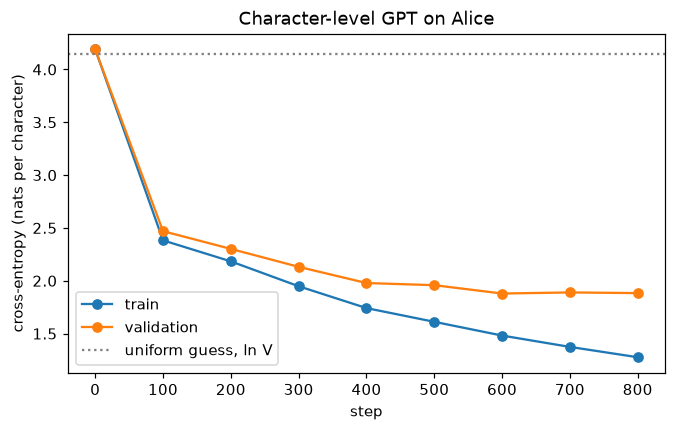
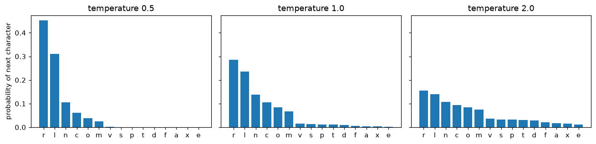

# Language Models

> **Level 8 · Chapter 2** · ⏱️ ~90 min read · Prerequisites: [Attention and transformers](01-attention-and-transformers.md), [Embeddings and NLP basics](../07-deep-learning-pytorch/05-embeddings-and-nlp.md), [Information theory and optimization](../01-math-foundations/06-information-theory-and-optimization.md)

A **language model** assigns probabilities to text, one token at a time. Train a causal transformer to predict the next token on enough text and it learns spelling, grammar, facts, and some reasoning, because all of them help prediction. This chapter covers next-token prediction, BPE tokenization (built from scratch), the GPT architecture and how to count its parameters and FLOPs, a character-level GPT trained on *Alice's Adventures in Wonderland*, temperature, top-k, and top-p sampling, perplexity, the KV cache, and what scaling laws and emergent abilities do and don't tell you.

## Why it matters

Priya's team was choosing between two in-house language models for autocomplete in a support tool. Model A reported a validation perplexity of 3.1. Model B reported 24.5. The decision looked obvious, and Model A went into a user test, where it did noticeably worse.

The numbers were both correct and completely incomparable. Model A was a character-level model: its perplexity measured uncertainty about the next *character*. Model B used a subword tokenizer that averaged about 4 characters per token: its perplexity measured uncertainty about the next *chunk of four characters*. Converted to the same unit, bits per character, Model B was clearly better.

Language models are built from a handful of definitions: what a token is, what probability the model assigns, how that probability becomes a metric, and how a sample is drawn from it. Each definition hides a choice, and each choice can quietly mislead you. This chapter builds all of them so that you know exactly what a number like "perplexity 24.5" means.

## Concepts

### Next-token prediction

Any text is a sequence of tokens $x_1, x_2, \ldots, x_T$. By the chain rule of probability, the probability of the whole sequence factors exactly into a product of conditionals:

$$
p(x_1, \ldots, x_T) = \prod_{t=1}^{T} p(x_t \mid x_1, \ldots, x_{t-1}) = \prod_{t=1}^{T} p(x_t \mid x_{<t}).
$$

No approximation is involved. So if you can predict the next token given the previous ones, you have a full probability model of text. An **autoregressive language model** is a neural network $p_\theta(x_t \mid x_{<t})$ with parameters $\theta$ that outputs a probability distribution over the vocabulary for the next token.

Training maximizes the likelihood of real text, which is the same as minimizing the average **negative log-likelihood**, the cross-entropy between the data and the model (you derived this equivalence in [Information theory and optimization](../01-math-foundations/06-information-theory-and-optimization.md)):

$$
\mathcal{L}(\theta) = -\frac{1}{T}\sum_{t=1}^{T} \log p_\theta(x_t \mid x_{<t}).
$$

That's the whole pretraining objective. It needs no labels: every position of every document is a training example, with the next token as its target. This is **self-supervised learning**, where the data supplies its own labels.

Why does such a simple objective produce such capable models? Because predicting the next token *well* requires modeling whatever determines it. To continue "The capital of France is", you need a fact. To continue a Python function, you need to track variables. To continue "If all A are B, and x is an A, then x is", you need a bit of logic. The loss rewards every one of these skills in proportion to how much it reduces uncertainty about the text.

### Tokenization and byte-pair encoding

A model needs a finite vocabulary. There are three natural choices of unit.

- **Characters.** A tiny vocabulary (about 100 for English), no unknown words, but long sequences. Attention costs $O(T^2)$, so long sequences are expensive, and the model must learn to spell before it can learn anything else.
- **Words.** Short sequences, but the vocabulary is huge, every typo or rare name is out of vocabulary, and "run", "runs", and "running" share nothing.
- **Subwords.** Frequent words get their own token, rare words split into pieces. This is the standard compromise.

**Byte-pair encoding (BPE)** (Sennrich, Haddow, and Birch, 2016, adapting a 1994 compression algorithm by Gage) learns subwords from data with a simple greedy rule.

1. Start with a vocabulary of single characters (or bytes), and write the training text as a sequence of them.
2. Count every pair of adjacent symbols.
3. Merge the most frequent pair into a new symbol, add it to the vocabulary, and record the merge.
4. Repeat steps 2 and 3 until the vocabulary reaches the target size.

To tokenize new text, apply the recorded merges in the order they were learned. Common sequences like "the" and "ing" become single tokens early; rare words stay split into smaller pieces.

Two practical details. First, text is usually **pre-tokenized** into word-like chunks with a regular expression, and merges never cross chunk boundaries, so a token can't span "word. The". GPT-2 attaches the leading space to the word, so " the" and "the" are different tokens. Second, GPT-2 introduced **byte-level BPE**: start from the 256 possible bytes of UTF-8 instead of characters, so any string at all, in any language, can be encoded, with no unknown tokens. GPT-2's vocabulary has 50,257 tokens: 256 bytes, 50,000 merges, and one end-of-text token.

Tokenization explains many odd behaviors of LLMs. A model that sees "strawberry" as two or three tokens never directly sees its letters, so counting the r's is surprisingly hard for it. Numbers split into irregular chunks make arithmetic harder. Languages underrepresented in the tokenizer's training data need more tokens per word, so they cost more and fit less into the context.

### Causal masking and teacher forcing

How do you train on all positions at once? Feed the sequence $x_1, \ldots, x_T$ into a transformer with a **causal mask** (from [Attention and transformers](01-attention-and-transformers.md)), so position $t$ can only attend to positions $\le t$. The output at position $t$ is then a prediction of $x_{t+1}$ that used only $x_{\le t}$. The targets are the inputs shifted left by one:

```text
input:   A   l   i   c   e
target:  l   i   c   e   ␣
```

One forward pass yields $T$ predictions, each scored against the true next token. Feeding the *true* previous tokens, rather than the model's own predictions, is **teacher forcing**, the same idea you used to train seq2seq decoders in [Sequence models](../07-deep-learning-pytorch/04-sequence-models.md). Unlike an RNN, the transformer processes all $T$ positions in parallel, which is why transformers train so much faster on modern hardware.

### The GPT architecture

**GPT** (generative pretrained transformer; Radford et al., 2018 and 2019) is a decoder-only transformer:

1. A **token embedding** table $W_E \in \mathbb{R}^{V \times d}$ maps each of the $V$ vocabulary tokens to a $d$-dimensional vector.
2. A **position embedding** table $W_P \in \mathbb{R}^{T_{\max} \times d}$ (learned, in GPT-2) is added. $T_{\max}$ is the **context length** or block size: the most tokens the model can see at once.
3. $L$ pre-LN transformer blocks with causal self-attention.
4. A final LayerNorm.
5. A **language-modeling head**: a linear layer from $d$ to $V$ logits, followed by a softmax.

GPT-2 **ties** the head's weight matrix to the token embedding: the logit for token $v$ is the dot product of the final hidden state with $v$'s embedding. That saves $Vd$ parameters and works well, because "tokens that should appear here" and "tokens with similar meaning" live in the same space.

**Counting parameters.** Using $12d^2 + 13d$ per block from the last chapter:

$$
N = \underbrace{Vd}_{\text{token emb.}} + \underbrace{T_{\max}\,d}_{\text{pos. emb.}} + \underbrace{L\,(12d^2 + 13d)}_{\text{blocks}} + \underbrace{2d}_{\text{final LN}} \quad (\text{head tied}).
$$

For GPT-2 small ($V = 50{,}257$, $T_{\max} = 1024$, $d = 768$, $L = 12$), that's $38{.}6\text{M} + 0{.}8\text{M} + 85{.}1\text{M} + 1{.}5\text{K} \approx 124$ million, the model's published size. You'll compute it exactly below. For large models the blocks dominate, and $N \approx 12Ld^2$ is a good shortcut.

**Counting FLOPs.** A **FLOP** is one floating-point operation. A matrix-vector product with an $m \times n$ matrix takes about $2mn$ FLOPs (a multiply and an add per weight). Each parameter in a linear layer is used once per token in the forward pass, so the forward pass costs about $2N$ FLOPs per token. The backward pass computes two gradients for each layer, one for its input and one for its weights, each as costly as the forward product, so about $4N$. Training therefore costs about

$$
C \approx 6ND \text{ FLOPs},
$$

where $D$ is the number of training tokens. This ignores the attention scores themselves (about $2 \cdot 2 L T d$ extra FLOPs per token for context length $T$, small unless $T$ is large compared with $d$), but it's the standard back-of-the-envelope rule. For example, GPT-3 (175 billion parameters, 300 billion tokens; Brown et al., 2020) needed about $6 \times 1.75 \times 10^{11} \times 3 \times 10^{11} \approx 3 \times 10^{23}$ FLOPs.

### Pretraining data and objectives

A base model is shaped by its data more than by anything else. Pretraining corpora are mixtures: filtered web crawls (Common Crawl is the usual raw source), books, Wikipedia, scientific papers, and code. The pipeline that turns raw crawl into training data matters enormously:

- **Quality filtering**, with heuristics (length, symbol ratios, repeated lines) and classifiers trained to recognize "reference-like" text.
- **Deduplication**, exact and near-duplicate. Repeated documents waste compute and increase memorization of the repeated text.
- **Removal** of personal data and toxic content, to the extent possible.
- **Mixture weights**, deciding how much of each source the model sees, and how many times (epochs) it sees each.
- **Decontamination**: removing benchmark test questions from the training data. If you don't, evaluation scores measure memorization, the language-model version of test-set leakage.

The causal language-modeling objective (predict the next token) isn't the only one:

| Objective | What's predicted | Attention | Used by |
|---|---|---|---|
| Causal LM | Each token from its left context | Causal | GPT family, most LLMs |
| Masked LM | 15% of tokens, masked out, from both sides | Bidirectional | BERT, RoBERTa |
| Span corruption | Masked spans, generated by a decoder | Encoder-decoder | T5 |
| Prefix LM | Continuation, with bidirectional attention over a prefix | Mixed | Some T5 and PaLM variants |

Causal LM won for general-purpose models because it trains on every token, generates naturally, and turns every task into text continuation.

### Sampling: turning probabilities into text

A trained model gives a distribution over the next token. **Decoding** picks one, appends it, and repeats. How you pick matters a lot.

**Greedy decoding** takes the most likely token every time. It's deterministic and tends to be repetitive and dull: the most likely continuation of a sentence is often a loop. **Beam search** keeps the $b$ most likely partial sequences; it's good for tasks with one right answer (translation) but makes open-ended text even blander.

**Sampling** draws from the distribution. Pure sampling is diverse but occasionally picks a very unlikely token, and one bad token can derail everything after it. Three knobs control this.

**Temperature.** Divide the logits $z_v$ by a temperature $\tau > 0$ before the softmax:

$$
p_\tau(v) = \frac{\exp(z_v / \tau)}{\sum_{u} \exp(z_u / \tau)}.
$$

$\tau = 1$ is the model's distribution. $\tau < 1$ sharpens it (as $\tau \to 0$, it becomes greedy), and $\tau > 1$ flattens it toward uniform. It's the same "sharpness" you saw in attention.

**Top-k sampling** (Fan et al., 2018) keeps only the $k$ most likely tokens, renormalizes, and samples. It cuts off the long tail of unlikely tokens. The weakness: a fixed $k$ is too many when the model is confident (after "Alice in Wonder", only one token is plausible) and too few when many continuations are reasonable.

**Top-p (nucleus) sampling** (Holtzman et al., 2020) adapts. Sort tokens by probability and keep the smallest set whose total probability is at least $p$ (say 0.9). When the model is confident, that's one or two tokens; when it's uncertain, it's many. Most LLM APIs expose temperature and top-p together.

### Perplexity

The training loss is an average negative log-likelihood in nats per token. **Perplexity** is its exponential:

$$
\operatorname{PPL} = \exp\!\left(-\frac{1}{T}\sum_{t=1}^{T} \log p_\theta(x_t \mid x_{<t})\right).
$$

Perplexity has a nice reading: it's the **effective number of choices** the model is uniformly unsure between. A model that assigns probability $1/k$ to the right token every time has perplexity exactly $k$. A uniform guess over a vocabulary of size $V$ has perplexity $V$; a perfect model has perplexity 1.

Perplexity is **per token**, which is what tripped up Priya's team. To compare models with different tokenizers, convert to a per-character (or per-byte) quantity. The total log-likelihood of a text doesn't depend on how you chop it; only the denominator does. If $\mathcal{L}_{\text{tok}}$ is the loss in nats per token and the text has $c$ characters per token on average,

$$
\text{bits per character} = \frac{\mathcal{L}_{\text{tok}}}{c \,\ln 2}.
$$

In the story, Model A had $\ln 3.1 / \ln 2 = 1.63$ bits per character. Model B had $\ln 24.5 / (4 \ln 2) = 1.15$. B was better.

Also note that perplexity measures how well a model predicts *this* distribution of text. It's a good guide while developing one model on one dataset, and a poor guide to how useful an assistant is.

### The KV cache

Generation is sequential: to produce token $t+1$, the model runs on all $t$ tokens so far. Done naively, step $t$ recomputes the keys and values of every earlier token, in every layer, even though they haven't changed (the causal mask guarantees earlier positions never see later ones). Generating $T$ tokens does $O(T^2)$ token-forward-passes of work.

The **KV cache** stores each layer's keys and values as they're computed. At each new step, the model processes only the *new* token: it computes that token's query, key, and value, appends the key and value to the cache, and attends from the new query to all cached keys. Each step is now one token-forward-pass plus attention over the cache, so generation does $O(T)$ token-forward-passes.

The price is memory. The cache holds, per sequence,

$$
\text{KV cache bytes} = 2 \times L \times T \times d \times \text{bytes per number},
$$

the 2 being one key and one value. For a model with $L = 32$ layers, $d = 4096$, a 4,096-token context, and 16-bit numbers, that's $2 \times 32 \times 4096 \times 4096 \times 2 \approx 2.1$ GB *per sequence*. Serving many users at once is often limited by KV cache memory, not by the weights, which is why techniques like grouped-query attention (several query heads sharing one key-value head) exist. The [Scaling and efficiency](06-scaling-and-efficiency.md) chapter returns to this.

### Scaling laws

In 2020, Kaplan et al. ("Scaling Laws for Neural Language Models") trained many transformer language models and found that the test loss falls as a smooth **power law** in each of three quantities, when the other two aren't the bottleneck: the number of parameters $N$, the number of training tokens $D$, and the training compute $C$:

$$
\mathcal{L}(N) \approx \left(\frac{N_c}{N}\right)^{\alpha_N}, \qquad \mathcal{L}(D) \approx \left(\frac{D_c}{D}\right)^{\alpha_D},
$$

where $N_c$, $D_c$ are fitted constants and the fitted exponents were small (about 0.076 for $N$ and 0.095 for $D$ in their setup). Small exponents mean each halving of loss requires enormous increases in scale, but the trend held across more than six orders of magnitude, so it could be extrapolated. Architecture details like depth versus width mattered much less than total size.

In 2022, Hoffmann et al. ("Training Compute-Optimal Large Language Models") asked: for a fixed compute budget $C \approx 6ND$, how should you split it between model size and data? Fitting a loss of the form

$$
\mathcal{L}(N, D) = E + \frac{A}{N^{\alpha}} + \frac{B}{D^{\beta}},
$$

where $E$ is the irreducible loss (the entropy of text itself), they found that $N$ and $D$ should grow in roughly equal proportion, which works out to about **20 training tokens per parameter**. Many earlier models were too big for their data. Their 70-billion-parameter model Chinchilla, trained on 1.4 trillion tokens, outperformed their own 280-billion-parameter Gopher, trained on 300 billion tokens with similar compute.

Two cautions. Scaling laws predict *loss*, not specific abilities. And "compute-optimal" is about training cost only. Models that will serve billions of requests are often trained on far more than 20 tokens per parameter, because a smaller model that took longer to train is cheaper to run forever after.

### Emergent abilities

Some capabilities seem to appear suddenly with scale. Brown et al. (2020) showed that GPT-3 could do **few-shot learning**: given a handful of examples in the prompt, it performed new tasks with no gradient updates, much better than smaller models. Wei et al. ("Emergent Abilities of Large Language Models", 2022) collected tasks, such as multi-digit arithmetic and some reasoning benchmarks, where performance stayed near chance for smaller models and then jumped above it past some scale. They called these **emergent abilities**.

Schaeffer, Miranda, and Koyejo ("Are Emergent Abilities of Large Language Models a Mirage?", 2023) offered an important counterpoint. Many of the sharp jumps used all-or-nothing metrics, like exact match on a 5-digit answer. If per-token accuracy improves smoothly, the chance of getting all five digits right can still look like a sudden jump. Under continuous metrics, many "emergent" curves became smooth. The current picture: the underlying improvements are often gradual and predictable, but *useful* capabilities can still cross a threshold abruptly from a user's point of view. Treat claims of emergence with care, and look at which metric was used.

## In practice

### Loading the text

The examples use the public-domain text of *Alice's Adventures in Wonderland* by Lewis Carroll, Project Gutenberg eBook #11. If you don't have `alice.txt`, this downloads it once and strips Project Gutenberg's header and license.

<!-- skip-run -->
```python
import urllib.request
from pathlib import Path

path = Path("alice.txt")
if not path.exists():
    raw = urllib.request.urlopen("https://www.gutenberg.org/cache/epub/11/pg11.txt").read().decode("utf-8")
    start = raw.index("\n", raw.index("*** START")) + 1
    end = raw.index("*** END")
    path.write_text(raw[start:end].strip())
```

The outputs on this page were produced with an excerpt: the first two chapters, about 22,000 characters. With the full book (roughly 150,000 characters) the model trains on more data, so your losses will be lower and your samples better (your numbers will vary).

```python
import math
import re
import time
from collections import Counter
from pathlib import Path

import matplotlib.pyplot as plt
import torch
import torch.nn as nn
import torch.nn.functional as F

torch.set_num_threads(4)
torch.manual_seed(0)

path = Path("alice.txt")
text = path.read_text()
print(f"{len(text):,} characters, {len(set(text))} distinct")
print(text[:200])
```

```text
22,297 characters, 63 distinct
ALICE'S ADVENTURES IN WONDERLAND

Lewis Carroll

CHAPTER I.
Down the Rabbit-Hole

Alice was beginning to get very tired of sitting by her sister on the bank, and of having nothing to do: once or twice
```

### BPE from scratch

This implementation follows the GPT-2 recipe at small scale: pre-tokenize with a regular expression that keeps a word's leading space attached, count the distinct chunks, and learn merges over chunk *types* weighted by their counts (much faster than scanning the raw text each time). Ties go to the pair seen first, so the result is deterministic.

```python
PRETOKENIZE = re.compile(r" ?[A-Za-z]+| ?[0-9]+| ?[^A-Za-z0-9\s]+|\s+")

def train_bpe(text, n_merges):
    words = Counter(PRETOKENIZE.findall(text))                # chunk -> count
    splits = {w: list(w) for w in words}                      # each chunk as a list of symbols
    merges = []
    for _ in range(n_merges):
        pairs = Counter()
        for w, count in words.items():
            sym = splits[w]
            for a, b in zip(sym, sym[1:]):
                pairs[a, b] += count
        if not pairs:
            break
        best = max(pairs, key=pairs.get)                      # most frequent adjacent pair
        merges.append(best)
        for w in words:                                       # apply the merge everywhere
            sym, out, i = splits[w], [], 0
            while i < len(sym):
                if i < len(sym) - 1 and (sym[i], sym[i + 1]) == best:
                    out.append(sym[i] + sym[i + 1])
                    i += 2
                else:
                    out.append(sym[i])
                    i += 1
            splits[w] = out
    return merges

def bpe_encode(text, merges):
    rank = {pair: r for r, pair in enumerate(merges)}
    tokens = []
    for chunk in PRETOKENIZE.findall(text):
        sym = list(chunk)
        while len(sym) > 1:                                   # merge the earliest-learned pair first
            pairs = [(rank.get((a, b), math.inf), i) for i, (a, b) in enumerate(zip(sym, sym[1:]))]
            r, i = min(pairs)
            if r == math.inf:
                break
            sym[i:i + 2] = [sym[i] + sym[i + 1]]
        tokens.extend(sym)
    return tokens

split_at = int(0.9 * len(text))
merges = train_bpe(text[:split_at], n_merges=400)
print(f"learned {len(merges)} merges")
print("first 12 merges:", ["".join(m) for m in merges[:12]])
print("merges 300-305: ", ["".join(m) for m in merges[300:306]])

sentence = "Alice was very curious about the White Rabbit's watch."
toks = bpe_encode(sentence, merges)
print(toks)
print("round trip ok:", "".join(toks) == sentence)
held_out = text[split_at:]
print(f"held-out text: {len(held_out) / len(bpe_encode(held_out, merges)):.2f} characters per token")
```

```text
learned 400 merges
first 12 merges: [' t', 'he', ' s', ' a', 'in', ' w', ' the', ' o', 'it', 'nd', 'er', 'ou']
merges 300-305:  [' poor', ' can', 'ew', ' use', 'ons', ' sudden']
['Alice', ' was', ' very', ' cur', 'i', 'ous', ' about', ' the', ' Wh', 'ite', ' Rabbit', "'", 's', ' wa', 't', 'ch', '.']
round trip ok: True
held-out text: 2.45 characters per token
```

The first merges are the most common English fragments, and " the" becomes a token by merge seven. Frequent words of this book ("Alice", " Rabbit") are single tokens; rarer words split into pieces (" cur", "i", "ous"). With 400 merges, held-out text needs about 2.5 times fewer tokens than characters. Real tokenizers learn 30,000 to 200,000 merges from terabytes of text.

!!! warning "Common mistake: decoding by joining with spaces"
    BPE tokens carry their own spaces (" was"), so decoding is plain concatenation. Joining tokens with `" "` corrupts text, and stripping whitespace from tokens loses information. Always test that `decode(encode(s)) == s` on varied text, including punctuation, digits, and newlines.

For the model, the rest of this chapter uses characters: with only 22,000 characters of training text, a subword vocabulary would leave too few examples of each token. The capstone lets you try both.

### A character-level GPT

The data pipeline: map each character to an integer, split the first 90% for training and the last 10% for validation (contiguous, so validation text is genuinely unseen), and sample random windows of `block_size` characters. The target is the window shifted by one.

```python
chars = sorted(set(text))
stoi = {c: i for i, c in enumerate(chars)}
itos = {i: c for c, i in stoi.items()}
encode = lambda s: torch.tensor([stoi[c] for c in s])
decode = lambda ids: "".join(itos[int(i)] for i in ids)

data = encode(text)
n_train = int(0.9 * len(data))
train_data, val_data = data[:n_train], data[n_train:]

def get_batch(split, batch_size, block_size, generator=None):
    src = train_data if split == "train" else val_data
    ix = torch.randint(len(src) - block_size - 1, (batch_size,), generator=generator)
    x = torch.stack([src[i:i + block_size] for i in ix])
    y = torch.stack([src[i + 1:i + block_size + 1] for i in ix])
    return x, y

x, y = get_batch("train", 2, 12)
print("x:", repr(decode(x[0])))
print("y:", repr(decode(y[0])))
print(f"vocabulary {len(chars)}, train {len(train_data):,} chars, val {len(val_data):,} chars")
```

```text
x: ' little nerv'
y: 'little nervo'
vocabulary 63, train 20,067 chars, val 2,230 chars
```

Now the model. It's the decoder from the last chapter with GPT-2's details: learned positions, a final LayerNorm, a tied head, weights initialized with standard deviation 0.02, and dropout. The attention layer uses `F.scaled_dot_product_attention` (fast and already checked against our version), and supports a KV cache, which you'll use later: pass a dictionary per layer, and the layer appends its keys and values to it.

```python
class CausalSelfAttention(nn.Module):
    def __init__(self, d, n_heads, dropout):
        super().__init__()
        self.h, self.dropout = n_heads, dropout
        self.qkv = nn.Linear(d, 3 * d)
        self.proj = nn.Linear(d, d)

    def forward(self, x, cache=None):
        B, T, d = x.shape
        q, k, v = self.qkv(x).view(B, T, 3, self.h, d // self.h).permute(2, 0, 3, 1, 4)  # each (B, h, T, d_h)
        if cache is not None:
            if "k" in cache:                                 # decoding: one new token sees everything cached
                assert T == 1
                k, v = torch.cat([cache["k"], k], dim=2), torch.cat([cache["v"], v], dim=2)
            cache["k"], cache["v"] = k, v
        y = F.scaled_dot_product_attention(q, k, v, is_causal=(T > 1),
                                           dropout_p=self.dropout if self.training else 0.0)
        return self.proj(y.transpose(1, 2).reshape(B, T, d))

class Block(nn.Module):
    def __init__(self, d, n_heads, dropout):
        super().__init__()
        self.ln1, self.ln2 = nn.LayerNorm(d), nn.LayerNorm(d)
        self.attn = CausalSelfAttention(d, n_heads, dropout)
        self.mlp = nn.Sequential(nn.Linear(d, 4 * d), nn.GELU(), nn.Linear(4 * d, d))
        self.drop = nn.Dropout(dropout)

    def forward(self, x, cache=None):
        x = x + self.drop(self.attn(self.ln1(x), cache))
        return x + self.drop(self.mlp(self.ln2(x)))

class GPT(nn.Module):
    def __init__(self, vocab_size, block_size, d=96, n_layers=3, n_heads=4, dropout=0.1):
        super().__init__()
        self.block_size = block_size
        self.tok_emb = nn.Embedding(vocab_size, d)
        self.pos_emb = nn.Embedding(block_size, d)
        self.drop = nn.Dropout(dropout)
        self.blocks = nn.ModuleList([Block(d, n_heads, dropout) for _ in range(n_layers)])
        self.ln_f = nn.LayerNorm(d)
        self.head = nn.Linear(d, vocab_size, bias=False)
        self.head.weight = self.tok_emb.weight                # weight tying
        for m in self.modules():                              # GPT-2 style initialization
            if isinstance(m, (nn.Linear, nn.Embedding)):
                nn.init.normal_(m.weight, mean=0.0, std=0.02)
            if isinstance(m, nn.Linear) and m.bias is not None:
                nn.init.zeros_(m.bias)

    def forward(self, idx, targets=None, caches=None, start_pos=0):
        T = idx.shape[1]
        pos = torch.arange(start_pos, start_pos + T)
        x = self.drop(self.tok_emb(idx) + self.pos_emb(pos))
        for i, blk in enumerate(self.blocks):
            x = blk(x, None if caches is None else caches[i])
        logits = self.head(self.ln_f(x))
        loss = None if targets is None else F.cross_entropy(logits.view(-1, logits.size(-1)), targets.view(-1))
        return logits, loss

def count_gpt_params(V, T_max, d, L):
    return V * d + T_max * d + L * (12 * d**2 + 13 * d) + 2 * d

V, block_size = len(chars), 64
model = GPT(V, block_size)
n_params = sum(p.numel() for p in model.parameters())     # tied weights are counted once
print(f"our GPT: {n_params:,} parameters, formula {count_gpt_params(V, block_size, 96, 3):,}")
print(f"GPT-2 small by the formula: {count_gpt_params(50257, 1024, 768, 12):,}")

with torch.no_grad():
    _, loss0 = model(*get_batch("train", 32, block_size))
print(f"initial loss {loss0:.3f}, uniform guessing would give ln(V) = {math.log(V):.3f}")
```

```text
our GPT: 347,904 parameters, formula 347,904
GPT-2 small by the formula: 124,439,808
initial loss 4.171, uniform guessing would give ln(V) = 4.143
```

The formula matches the code exactly, and gives GPT-2 small's well-known 124 million. The initial loss is within a few hundredths of $\ln V$: with small initial weights the model starts out predicting a nearly uniform distribution, which is the right starting point. If your initial loss is far above $\ln V$, your initialization makes confident wrong predictions, and the first part of training is wasted undoing them.

!!! tip "Check the initial loss every time"
    Comparing the first loss with $\ln V$ (or with $-\ln$ of the class frequencies) is the cheapest bug check in deep learning. It catches wrong label shifts, bad initialization, and a softmax applied twice.

### Training it

The loop is the standard one from [The training loop](../07-deep-learning-pytorch/02-the-training-loop.md): AdamW with weight decay, gradient clipping, and a periodic estimate of train and validation loss on fixed batches. It runs for 800 steps (about 1.6 million characters, roughly 80 passes over the small training text), which takes a minute or two on a CPU.

```python
@torch.no_grad()
def estimate_loss(model, n_batches=10, batch_size=32):
    model.eval()
    out = {}
    for split in ["train", "val"]:
        g = torch.Generator().manual_seed(0)                  # same batches every time
        out[split] = sum(model(*get_batch(split, batch_size, block_size, g))[1].item()
                         for _ in range(n_batches)) / n_batches
    model.train()
    return out

torch.manual_seed(0)
model = GPT(V, block_size)
opt = torch.optim.AdamW(model.parameters(), lr=3e-3, weight_decay=0.1)
steps, eval_every, history = 800, 100, []
for step in range(steps + 1):
    if step % eval_every == 0:
        history.append((step, *estimate_loss(model).values()))
        print(f"step {step:4d}  train {history[-1][1]:.3f}  val {history[-1][2]:.3f}")
    if step == steps:
        break
    xb, yb = get_batch("train", 32, block_size)
    _, loss = model(xb, yb)
    opt.zero_grad(set_to_none=True)
    loss.backward()
    torch.nn.utils.clip_grad_norm_(model.parameters(), 1.0)
    opt.step()
tokens_seen = steps * 32 * block_size
print(f"tokens seen {tokens_seen:,}; training compute ≈ 6ND = {6 * n_params * tokens_seen:.1e} FLOPs")
```

```text
step    0  train 4.191  val 4.190
step  100  train 2.383  val 2.469
step  200  train 2.184  val 2.302
step  300  train 1.948  val 2.132
step  400  train 1.741  val 1.979
step  500  train 1.612  val 1.958
step  600  train 1.482  val 1.879
step  700  train 1.374  val 1.890
step  800  train 1.276  val 1.883
tokens seen 1,638,400; training compute ≈ 6ND = 3.4e+12 FLOPs
```

```python
steps_, train_l, val_l = zip(*history)
plt.figure(figsize=(7, 4))
plt.plot(steps_, train_l, "o-", label="train")
plt.plot(steps_, val_l, "o-", label="validation")
plt.axhline(math.log(V), color="gray", ls=":", label="uniform guess, ln V")
plt.xlabel("step")
plt.ylabel("cross-entropy (nats per character)")
plt.title("Character-level GPT on Alice")
plt.legend()
plt.show()
```



*Both losses fall fast at first. After about 600 steps the validation loss stops improving while the training loss keeps falling: the model is overfitting a tiny corpus.*

The model went from uniform guessing to roughly 1.9 nats per character on unseen text. The widening gap between train and validation loss (1.28 versus 1.88 at the end, with validation flat since step 600) is the main story of training on a small corpus: the model is memorizing. With 22,000 characters, a few hundred thousand parameters is already plenty. More data, more dropout, or early stopping (keeping the checkpoint with the best validation loss) are the cures, and the capstone asks you to use them.

### Sampling: temperature, top-k, and top-p

Here's a sampler with all three knobs. Top-p sorts the probabilities, keeps the smallest prefix whose cumulative probability reaches $p$, and always keeps at least the most likely token.

```python
def sample_next(logits, temperature=1.0, top_k=None, top_p=None, generator=None):
    """logits: (B, V) for the last position. Returns (B, 1) token ids."""
    if temperature == 0:
        return logits.argmax(dim=-1, keepdim=True)            # greedy
    logits = logits / temperature
    if top_k is not None:
        kth = torch.topk(logits, top_k).values[:, [-1]]       # k-th largest logit
        logits = logits.masked_fill(logits < kth, float("-inf"))
    if top_p is not None:
        sorted_logits, order = logits.sort(dim=-1, descending=True)
        probs = sorted_logits.softmax(dim=-1)
        drop = probs.cumsum(dim=-1) - probs > top_p           # mass *before* this token already >= p
        sorted_logits = sorted_logits.masked_fill(drop, float("-inf"))
        logits = torch.full_like(logits, float("-inf")).scatter(-1, order, sorted_logits)
    return torch.multinomial(logits.softmax(dim=-1), 1, generator=generator)

@torch.no_grad()
def generate(model, prompt, n_new, **kw):
    model.eval()
    idx = encode(prompt).unsqueeze(0)
    for _ in range(n_new):
        logits, _ = model(idx[:, -model.block_size:])         # crop to the context window
        idx = torch.cat([idx, sample_next(logits[:, -1], **kw)], dim=1)
    return decode(idx[0])

context = "Alice was beginning to get very ti"
with torch.no_grad():
    logits = model(encode(context).unsqueeze(0))[0][0, -1]
for tau in [0.5, 1.0, 2.0]:
    p = (logits / tau).softmax(-1)
    top = p.topk(4)
    shown = ", ".join(f"{itos[int(i)]!r} {v:.2f}" for v, i in zip(top.values, top.indices))
    nucleus = int((p.sort(descending=True).values.cumsum(0) < 0.9).sum()) + 1
    print(f"T={tau}: {shown} | tokens in the 0.9 nucleus: {nucleus}")
```

```text
T=0.5: 'r' 0.45, 'l' 0.31, 'n' 0.11, 'c' 0.06 | tokens in the 0.9 nucleus: 4
T=1.0: 'r' 0.29, 'l' 0.24, 'n' 0.14, 'c' 0.11 | tokens in the 0.9 nucleus: 6
T=2.0: 'r' 0.15, 'l' 0.14, 'n' 0.11, 'c' 0.09 | tokens in the 0.9 nucleus: 17
```

The model's favorites are "r" (as in "tired") and "l" (as in "till"), and temperature reshapes how strongly it prefers them. The nucleus size shows top-p at work: at temperature 1, six characters are needed to cover 90% of the probability here, while at a point in a word where the model is confident (say, after "Alic") the nucleus would be a single character. The figure shows the full distributions.

```python
fig, axes = plt.subplots(1, 3, figsize=(12, 3), sharey=True)
order = logits.softmax(-1).argsort(descending=True)[:15]
for ax, tau in zip(axes, [0.5, 1.0, 2.0]):
    p = (logits / tau).softmax(-1)[order]
    ax.bar(range(15), p)
    ax.set_xticks(range(15), [repr(itos[int(i)])[1:-1] or "␣" for i in order])
    ax.set_title(f"temperature {tau}")
axes[0].set_ylabel("probability of next character")
plt.tight_layout()
plt.show()
```



*The same logits at three temperatures: low temperature concentrates probability on the top few characters, high temperature spreads it across many.*

Now generate text under different settings, with a fixed random generator for each so the comparison is fair.

```python
prompt = "Alice "
for kw in [dict(temperature=0), dict(temperature=0.8, top_k=10), dict(temperature=1.0, top_p=0.9), dict(temperature=1.5)]:
    out = generate(model, prompt, 150, generator=torch.Generator().manual_seed(0), **kw)
    print(f"--- {kw}\n{out}\n")
```

```text
--- {'temperature': 0}
Alice to her had never to her was to her was to her little see was to her herself she saw to her had not the see to her was to the saying to herself, and sh

--- {'temperature': 0.8, 'top_k': 10}
Alice to to get to to find she litttle in to seement he say way to to the da capid she see had began the surpres feet on that finy red, the cand she was not

--- {'temperature': 1.0, 'top_p': 0.9}
Alice to to gettily, and sort the found she had seelve she Rabbit crilttle a cats things off was not began the words about a surpt like the bank all: as not

--- {'temperature': 1.5}
Alice very you!" sroply I'm to be ganly greaqueess--agh say?

As try larged  As Su(stars! "I was herse after ne-NieI.

 ChI'w my telle, the ba"I Mlose useso
```

These are a two-minute model's outputs, so expect half-words. But the effect of the sampler is unmistakable. Greedy decoding keeps returning to the same phrase ("to her was to her"), the classic repetition failure that motivated sampling. Moderate temperature with top-k or top-p produces varied, English-looking fragments with real words from the book. Temperature 1.5 with no truncation lets the long tail in, and the text dissolves into stray capitals, punctuation, and non-words once a few unlikely characters are picked.

### Perplexity and bits per character

Evaluate on the entire validation text in non-overlapping windows of 64 characters. (The first characters of each window have little context, so this slightly overestimates the loss; a sliding window would be more precise and slower.) Compare with two baselines: uniform guessing, and a **unigram** model that predicts each character with its training-set frequency, ignoring context.

```python
@torch.no_grad()
def eval_nll(model, data, block_size):
    model.eval()
    n = (len(data) - 1) // block_size * block_size
    x = data[:n].view(-1, block_size)
    y = data[1:n + 1].view(-1, block_size)
    _, loss = model(x, y)
    return loss.item()

nll = eval_nll(model, val_data, block_size)
counts = torch.bincount(train_data, minlength=V).float() + 1        # add-one smoothing
unigram_nll = -torch.log(counts / counts.sum())[val_data].mean().item()
for name, l in [("uniform", math.log(V)), ("unigram", unigram_nll), ("GPT", nll)]:
    print(f"{name:8s} loss {l:.3f} nats/char   perplexity {math.exp(l):6.2f}   {l / math.log(2):.3f} bits/char")
```

```text
uniform  loss 4.143 nats/char   perplexity  63.00   5.977 bits/char
unigram  loss 3.089 nats/char   perplexity  21.95   4.456 bits/char
GPT      loss 1.882 nats/char   perplexity   6.57   2.715 bits/char
```

The model is, in effect, choosing among about 6.6 equally likely characters at each step, against 22 for a model that knows character frequencies but no context. Strong character models on large English corpora reach well under 1.5 bits per character; ours is limited by its 20,000 training characters, not by the architecture.

### The KV cache, implemented and timed

To make the timing meaningful, use a model with a longer context (512 positions, 4 layers), untrained, since speed doesn't depend on the weights. Generate 400 tokens greedily, once by recomputing everything each step and once with the cache. Greedy decoding makes the two runs comparable token by token.

```python
@torch.no_grad()
def generate_no_cache(model, idx, n_new):
    for _ in range(n_new):
        logits, _ = model(idx)
        idx = torch.cat([idx, logits[:, -1].argmax(-1, keepdim=True)], dim=1)
    return idx

@torch.no_grad()
def generate_with_cache(model, idx, n_new):
    caches = [{} for _ in model.blocks]
    logits, _ = model(idx, caches=caches)                     # prefill: process the prompt once
    for _ in range(n_new):
        nxt = logits[:, -1].argmax(-1, keepdim=True)
        idx = torch.cat([idx, nxt], dim=1)
        logits, _ = model(nxt, caches=caches, start_pos=idx.shape[1] - 1)   # only the new token
    return idx

torch.manual_seed(0)
big = GPT(V, block_size=512, d=128, n_layers=4, n_heads=4, dropout=0.0).eval()
prompt_ids = encode("Alice was beginning").unsqueeze(0)
times = {}
for name, fn in [("no cache", generate_no_cache), ("KV cache", generate_with_cache)]:
    t0 = time.perf_counter()
    out = fn(big, prompt_ids, 400)
    times[name] = time.perf_counter() - t0
    print(f"{name}: {times[name]:.2f} s")
    if name == "no cache":
        reference = out
print("identical tokens:", torch.equal(out, reference), "| speedup:", f"{times['no cache'] / times['KV cache']:.1f}x")
cache_kb = 2 * 4 * out.shape[1] * 128 * 4 / 1024
print(f"cache size for this sequence: 2 x L x T x d x 4 bytes = {cache_kb:.0f} KB")
```

```text
no cache: 1.60 s
KV cache: 0.30 s
identical tokens: True | speedup: 5.3x
cache size for this sequence: 2 x L x T x d x 4 bytes = 1676 KB
```

Same tokens, several times faster, and the gap grows with sequence length: the uncached version's cost per step grows with the number of tokens so far, while the cached version's is nearly constant here (attention over the cache does grow, but slowly at this size). Exact timings depend on your machine. Every production LLM server uses a KV cache.

!!! warning "Common mistake: forgetting the position offset with a cache"
    When you feed one new token with a KV cache, its position is the current sequence length, not 0. Forgetting `start_pos` gives every generated token position 0's embedding (or RoPE angle). The output still looks almost plausible, which makes the bug hard to spot. Compare cached and uncached greedy outputs, as above.

## Exercises

### Exercise 1: Perplexity by hand (easy)

A model predicts a 4-token sequence and assigns the true tokens probabilities 0.5, 0.25, 0.5, and 0.125. (a) Compute the average loss in nats and bits, and the perplexity. (b) The same text is 20 characters long. What's the loss in bits per character?

??? success "Solution"

    (a) The losses in bits are $-\log_2$ of each probability: 1, 2, 1, 3. Their average is $7/4 = 1.75$ bits per token, or $1.75 \ln 2 = 1.213$ nats. Perplexity is $2^{1.75} = e^{1.213} = 3.36$.

    (b) The total is 7 bits over 20 characters: 0.35 bits per character. The total log-likelihood of a text doesn't depend on the tokenizer, only the denominator does, which is why bits per character is a fair comparison across tokenizers.

### Exercise 2: Counting a bigger GPT (medium)

GPT-2 medium has $d = 1024$, $L = 24$, $V = 50{,}257$, and $T_{\max} = 1024$. (a) Count its parameters with the formula. (b) What fraction is in the transformer blocks? (c) Using $C \approx 6ND$, how many FLOPs does training it on 10 billion tokens take? (d) At a sustained 100 TFLOP/s (100 trillion FLOPs per second) on one GPU, how many days is that?

??? success "Solution"

    ```python
    N = count_gpt_params(50257, 1024, 1024, 24)
    blocks = 24 * (12 * 1024**2 + 13 * 1024)
    C = 6 * N * 10e9
    print(f"N = {N:,}  blocks share {blocks / N:.1%}  C = {C:.2e} FLOPs  days at 100 TFLOP/s: {C / 100e12 / 86400:.1f}")
    ```

    ```text
    N = 354,823,168  blocks share 85.2%  C = 2.13e+19 FLOPs  days at 100 TFLOP/s: 2.5
    ```

    About 355 million parameters (GPT-2 medium's published size is 355M), 85% of them in the blocks. Training takes about $2.1 \times 10^{19}$ FLOPs, roughly 2.5 GPU-days at a sustained 100 TFLOP/s. Real training rarely sustains a GPU's peak; 30% to 50% of peak is typical, so budget two to three times longer.

### Exercise 3: BPE by hand (medium)

Train BPE by hand on the corpus `low low low lower lowest` (pre-tokenized into words, without spaces attached), for three merges. List the merges and the final segmentation of each word. Then check with `train_bpe` on the string `"low low low lower lowest"`: does it give the same merges? If not, why?

??? success "Solution"

    Pair counts at the start (with word counts low: 3, lower: 1, lowest: 1): (l, o) = 5, (o, w) = 5, (w, e) = 2, (e, r) = 1, (e, s) = 1, (s, t) = 1. The top count is a tie between (l, o) and (o, w); taking the first seen, merge 1 is "lo". Now (lo, w) = 5, so merge 2 is "low". Then (low, e) = 2, so merge 3 is "lowe". Segmentations: "low", "lowe r", "lowe s t".

    ```python
    print(["".join(m) for m in train_bpe("low low low lower lowest", 3)])
    ```

    ```text
    ['lo', 'low', ' low']
    ```

    The first two merges agree, but the third differs. The code's pre-tokenizer attaches the leading space to every word after the first, so after "low" exists, the pair (" ", "low") occurs 4 times and beats ("low", "e") with 2. The algorithm is the same; the pre-tokenization differs. Real tokenizers differ in exactly such details, so token counts aren't comparable across tokenizers.

### Exercise 4: Min-p sampling (medium)

**Min-p sampling** keeps every token whose probability is at least $p_{\min}$ times the probability of the most likely token. (a) Implement `min_p_filter(logits, p_min)` that returns logits with the rest set to $-\infty$. (b) Without running it, predict how many characters survive for the "Alice was beginning to get very ti" context with $p_{\min} = 0.1$ at temperature 1, using the probabilities printed in the sampling section. Then run it and check.

??? success "Solution"

    (a)

    ```python
    def min_p_filter(logits, p_min):
        p = logits.softmax(-1)
        return logits.masked_fill(p < p_min * p.max(-1, keepdim=True).values, float("-inf"))

    print((min_p_filter(logits, 0.1) > float("-inf")).sum().item())
    ```

    ```text
    6
    ```

    (b) The top probability at temperature 1 was 0.29, so the cutoff is 0.029. The four printed characters (0.29, 0.24, 0.14, 0.11) all survive, and since they cover only 78% of the probability, a few more characters above 0.029 probably do too: a prediction of 5 to 7 is reasonable. The run gives 6. Like top-p, min-p adapts to the model's confidence, but it's defined relative to the top token, so it behaves more consistently at high temperatures.

### Exercise 5: A compute-optimal budget (hard)

You have a budget of $C = 10^{21}$ FLOPs. (a) Using $C = 6ND$ and the Chinchilla rule $D \approx 20N$, find the compute-optimal $N$ and $D$. (b) A colleague proposes a model 10 times larger, trained on 10 times fewer tokens, for the same compute. Using the fitted loss $\mathcal{L}(N, D) = E + A/N^{0.34} + B/D^{0.28}$ with $E = 1.69$, $A = 406.4$, $B = 410.7$ (the values Hoffmann et al. report for their third fitting approach), compare the predicted losses. (c) Name one reason to train a *smaller* model than compute-optimal.

??? success "Solution"

    (a) $C = 6N \cdot 20N = 120N^2$, so $N = \sqrt{10^{21}/120} \approx 2.9 \times 10^9$ parameters and $D = 20N \approx 5.8 \times 10^{10}$ tokens.

    (b)

    ```python
    def chinchilla_loss(N, D, E=1.69, A=406.4, B=410.7, a=0.34, b=0.28):
        return E + A / N**a + B / D**b

    N_opt = (1e21 / 120) ** 0.5
    D_opt = 20 * N_opt
    print(f"optimal:  N={N_opt:.2e} D={D_opt:.2e} loss {chinchilla_loss(N_opt, D_opt):.3f}")
    print(f"10x size: N={10 * N_opt:.2e} D={D_opt / 10:.2e} loss {chinchilla_loss(10 * N_opt, D_opt / 10):.3f}")
    ```

    ```text
    optimal:  N=2.89e+09 D=5.77e+10 loss 2.335
    10x size: N=2.89e+10 D=5.77e+09 loss 2.562
    ```

    The larger, under-trained model is predicted to be clearly worse for the same compute, which is the Chinchilla finding.

    (c) Inference cost. A model is trained once and run many times; a smaller model trained on more tokens than "optimal" costs more to train but less on every request, and with enough requests that wins. Fitting into a given device's memory is another reason.

## Check yourself

1. Why is next-token prediction a complete probabilistic model of text, rather than an approximation?

    ??? note "Answer"

        By the chain rule, $p(x_1, \ldots, x_T) = \prod_t p(x_t \mid x_{<t})$ exactly. A model of every conditional next-token distribution therefore defines the probability of every sequence.

2. Describe the BPE training loop in two sentences. Why do real tokenizers use byte-level BPE?

    ??? note "Answer"

        Start from single characters or bytes, repeatedly count adjacent pairs, and merge the most frequent pair into a new token, recording the merge order. Encoding applies the merges in that order. Byte-level BPE starts from the 256 bytes, so every possible string can be encoded with no unknown tokens.

3. How does one forward pass of a causal transformer produce a training signal at every position?

    ??? note "Answer"

        The causal mask makes position $t$'s output depend only on tokens $\le t$, so it's a legitimate prediction of token $t+1$. Comparing all outputs with the input shifted left by one gives $T$ cross-entropy terms from one pass (teacher forcing).

4. Where does $C \approx 6ND$ come from?

    ??? note "Answer"

        Each parameter takes part in about one multiply-add (2 FLOPs) per token in the forward pass, so $2N$ per token. The backward pass computes gradients with respect to both inputs and weights, about twice the forward cost, $4N$. Total $6N$ per token, times $D$ tokens.

5. What do temperature, top-k, and top-p each do to the next-token distribution? Which adapts to the model's confidence?

    ??? note "Answer"

        Temperature divides logits, sharpening ($\tau < 1$) or flattening ($\tau > 1$) the whole distribution. Top-k keeps a fixed number of most likely tokens. Top-p keeps the smallest set of tokens with total probability at least $p$, so its size adapts: small when the model is confident, large when it's uncertain.

6. A model has validation loss 2.3 nats per token with a tokenizer averaging 3.5 characters per token. What's its perplexity, and its bits per character?

    ??? note "Answer"

        Perplexity $e^{2.3} \approx 10.0$ per token. Bits per character $= 2.3 / (3.5 \ln 2) \approx 0.95$.

7. What does the KV cache store, what does it save, and what does it cost?

    ??? note "Answer"

        Each layer's keys and values for all tokens processed so far. Each generation step then processes only the new token instead of recomputing the whole prefix, turning $O(T^2)$ token computations into $O(T)$. It costs memory: $2 \times L \times T \times d$ numbers per sequence, which often limits how many sequences a server can batch.

8. What did the Chinchilla paper change about how people size models, and why are many deployed models trained on far more tokens than that?

    ??? note "Answer"

        It showed that for a fixed training budget, parameters and tokens should scale together, about 20 tokens per parameter, so many earlier models were too large and under-trained. Deployed models often go well beyond that because a smaller model is cheaper for every inference request, which can outweigh extra training cost.

## Key takeaways

- A language model factorizes text probability with the chain rule and is trained by minimizing next-token cross-entropy; no labels are needed.
- BPE builds a subword vocabulary by repeatedly merging the most frequent adjacent pair; tokenization choices explain many LLM quirks and make per-token metrics incomparable across tokenizers.
- A GPT is token and position embeddings, $L$ causal pre-LN blocks, a final LayerNorm, and a tied head: $N \approx Vd + 12Ld^2$, and training costs about $6ND$ FLOPs.
- Sampling matters: greedy loops, temperature reshapes, top-k truncates by count, top-p by probability mass.
- Perplexity is $\exp$ of the loss: the effective number of choices per token. Compare models in bits per character or byte when tokenizers differ.
- The KV cache trades memory for speed in generation, and its memory, $2LTd$ numbers per sequence, often limits serving.
- Loss scales as a smooth power law in parameters, data, and compute; compute-optimal training uses about 20 tokens per parameter; "emergent" jumps often depend on the metric.

## Further reading

- Alec Radford et al., "Language Models are Unsupervised Multitask Learners" (OpenAI, 2019). The GPT-2 paper.
- Tom Brown et al., "Language Models are Few-Shot Learners" (NeurIPS 2020). GPT-3 and in-context learning.
- Jordan Hoffmann et al., "Training Compute-Optimal Large Language Models" (2022). The Chinchilla scaling analysis; read alongside Jared Kaplan et al., "Scaling Laws for Neural Language Models" (2020).
- Ari Holtzman et al., "The Curious Case of Neural Text Degeneration" (ICLR 2020). Why greedy and pure sampling fail, and nucleus sampling.
- Rico Sennrich, Barry Haddow, and Alexandra Birch, "Neural Machine Translation of Rare Words with Subword Units" (ACL 2016). BPE for NLP.

## Next

A pretrained model predicts text; it doesn't yet follow instructions. Continue to [LLMs in practice](03-llms-in-practice.md) to see how prompting, fine-tuning, LoRA, preference optimization, and retrieval turn it into a useful system. When you've finished this chapter, you're also ready for the [Level 8 capstone](../../exercises/level-8-capstone.md).
