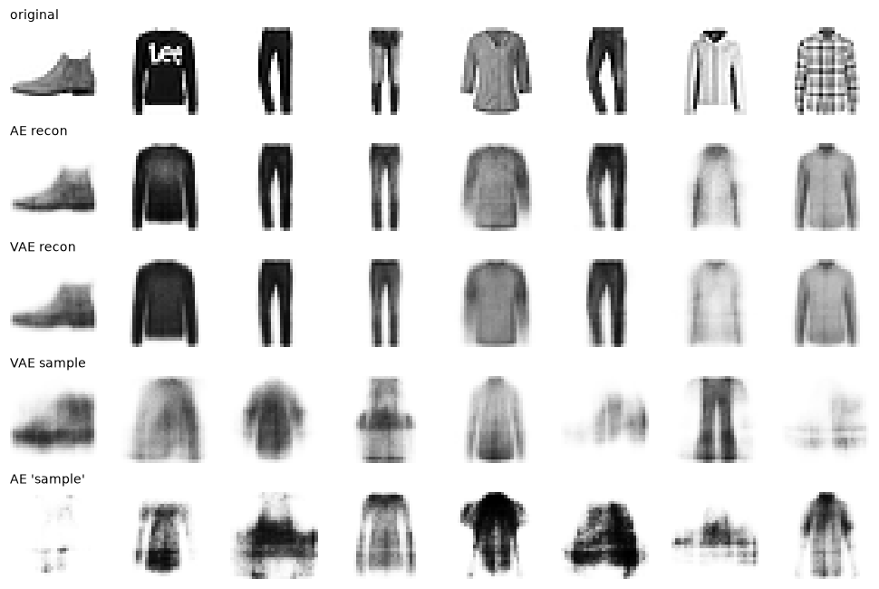
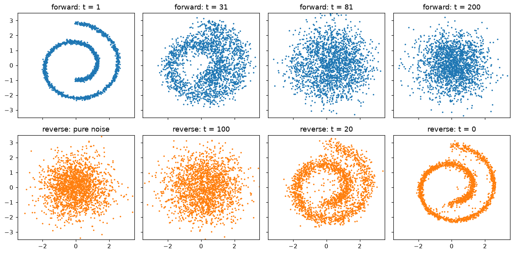

# Generative Models

> **Level 8 · Chapter 4** · ⏱️ ~90 min read · Prerequisites: [Convolutional neural networks](../07-deep-learning-pytorch/03-convolutional-networks.md), [Probability](../01-math-foundations/04-probability.md), [Information theory and optimization](../01-math-foundations/06-information-theory-and-optimization.md)

A **generative model** learns the distribution of its training data well enough to produce new samples from it: new faces, new product photos, new molecules, new audio. This chapter builds the four main ideas behind image generation, from autoencoders to variational autoencoders (deriving the ELBO and the reparameterization trick), generative adversarial networks and their unstable training, and diffusion models (deriving the forward process and implementing a DDPM), and then explains guidance and latent diffusion, the ideas behind modern text-to-image systems.

## Why it matters

Priya's team needed more images of rare equipment defects to train an inspection classifier. Real defect photos were scarce, so they trained a GAN on the few hundred they had and generated ten thousand more. The synthetic images looked convincing; a quick visual check passed. The classifier trained on the augmented set scored well on a validation split drawn from the same mix.

On the factory floor, it missed an entire category of defect, hairline cracks near welds. Looking back, the team found that the GAN had produced almost no images of that kind. It had learned to generate a few defect types very well and quietly dropped the rest, a failure called **mode collapse**. The validation split, partly synthetic, couldn't reveal it.

Each family of generative models fails in its own characteristic way: autoencoders can't sample, VAEs blur, GANs drop modes and oscillate, and diffusion models are slow to sample. You'll see each of these failures directly in this chapter, and why the field moved toward diffusion.

## Concepts

### What a generative model learns

A **discriminative** model, like every classifier so far, learns $p(y \mid \mathbf{x})$: given an image, which class? A **generative** model learns $p(\mathbf{x})$ itself, or at least a way to sample from it. That's much harder. A 28×28 grayscale image is a point in a 784-dimensional space, and almost every point in that space is noise. Real images occupy a thin, curved region (often called the **data manifold**), and the model must learn where it is.

There are two broad strategies. **Explicit density** models write down $p_\theta(\mathbf{x})$ and maximize likelihood: autoregressive models (the language models of [Language models](02-language-models.md)), VAEs (a lower bound on likelihood), normalizing flows, and diffusion models (also a bound). **Implicit** models only learn to sample, with no density to evaluate: GANs.

| Family | Sampling | Likelihood | Typical strengths | Typical weaknesses |
|---|---|---|---|---|
| Autoregressive | Slow (one token at a time) | Exact | Text, code; excellent likelihoods | Slow generation of long outputs |
| VAE | Fast (one pass) | Lower bound | Smooth latent space; stable training | Blurry samples |
| GAN | Fast (one pass) | None | Sharp images | Unstable training; mode collapse |
| Diffusion | Slow (many passes) | Lower bound | Best image quality and diversity; stable training | Many network evaluations per sample |

### Autoencoders

An **autoencoder** is a network trained to reproduce its input through a narrow **bottleneck**. An **encoder** $f_\phi$ maps the input $\mathbf{x}$ to a low-dimensional **code** (or latent vector) $\mathbf{z} = f_\phi(\mathbf{x})$, and a **decoder** $g_\theta$ maps it back, $\hat{\mathbf{x}} = g_\theta(\mathbf{z})$. Training minimizes the **reconstruction error**, such as $\lVert\mathbf{x} - \hat{\mathbf{x}}\rVert^2$.

Because the code is much smaller than the input, the network can't simply copy; it must learn a compressed description that keeps what matters. A linear autoencoder trained with squared error learns the same subspace as PCA (from [Dimensionality reduction](../04-ml-algorithms/06-dimensionality-reduction.md)); nonlinear layers let it learn curved structure.

Autoencoders are useful for compression, denoising (train to reconstruct clean inputs from corrupted ones), and anomaly detection (inputs unlike the training data reconstruct poorly). But they aren't good generators. Nothing in the training objective organizes the latent space: codes of training images may sit in scattered clumps with empty regions between them, and decoding a code from an empty region produces garbage. To sample, you need to know *where* in latent space to sample from. Fixing that is exactly what the VAE does.

### Variational autoencoders and the ELBO

A **variational autoencoder (VAE)** (Kingma and Welling, 2014; Rezende, Mohamed, and Wierstra, 2014) starts from a probabilistic story of how data is generated:

1. Draw a latent vector from a simple **prior**, $\mathbf{z} \sim p(\mathbf{z}) = \mathcal{N}(\mathbf{0}, I)$.
2. Generate the data from it with a decoder, $\mathbf{x} \sim p_\theta(\mathbf{x} \mid \mathbf{z})$.

If you can train this, sampling is easy: draw $\mathbf{z}$ from the prior and decode. Training means maximizing the likelihood of the data,

$$
p_\theta(\mathbf{x}) = \int p_\theta(\mathbf{x} \mid \mathbf{z})\,p(\mathbf{z})\,d\mathbf{z},
$$

but this integral over all latent vectors is intractable. Sampling $\mathbf{z}$ from the prior to estimate it doesn't work either: for a given image, almost every random $\mathbf{z}$ decodes to something unrelated, so the estimate is hopelessly noisy.

The fix is to learn *which* latents are plausible for a given $\mathbf{x}$. An encoder network outputs an approximate **posterior** $q_\phi(\mathbf{z} \mid \mathbf{x})$, a Gaussian with mean $\boldsymbol{\mu}_\phi(\mathbf{x})$ and diagonal variance $\boldsymbol{\sigma}^2_\phi(\mathbf{x})$. Now derive a trainable objective. For any distribution $q$ over $\mathbf{z}$,

$$
\log p_\theta(\mathbf{x}) = \mathbb{E}_{q_\phi(\mathbf{z} \mid \mathbf{x})}\left[\log p_\theta(\mathbf{x})\right] = \mathbb{E}_{q}\left[\log\frac{p_\theta(\mathbf{x}, \mathbf{z})}{p_\theta(\mathbf{z} \mid \mathbf{x})}\right],
$$

since $\log p_\theta(\mathbf{x})$ doesn't depend on $\mathbf{z}$, and $p_\theta(\mathbf{x}, \mathbf{z}) = p_\theta(\mathbf{z} \mid \mathbf{x})\,p_\theta(\mathbf{x})$. Multiply and divide by $q_\phi(\mathbf{z} \mid \mathbf{x})$ inside the log and split:

$$
\log p_\theta(\mathbf{x}) = \underbrace{\mathbb{E}_{q}\left[\log\frac{p_\theta(\mathbf{x}, \mathbf{z})}{q_\phi(\mathbf{z} \mid \mathbf{x})}\right]}_{\text{ELBO}} + \underbrace{\mathbb{E}_{q}\left[\log\frac{q_\phi(\mathbf{z} \mid \mathbf{x})}{p_\theta(\mathbf{z} \mid \mathbf{x})}\right]}_{\operatorname{KL}(q_\phi(\mathbf{z} \mid \mathbf{x})\,\|\,p_\theta(\mathbf{z} \mid \mathbf{x})) \;\ge\; 0}.
$$

The second term is a KL divergence, which is never negative. So the first term is a lower bound on the log-likelihood: the **evidence lower bound (ELBO)**. Maximizing it does two things at once: it pushes up the likelihood, and it pushes $q_\phi$ toward the true posterior (shrinking the gap). Writing $p_\theta(\mathbf{x}, \mathbf{z}) = p_\theta(\mathbf{x} \mid \mathbf{z})\,p(\mathbf{z})$ gives the form you implement:

$$
\operatorname{ELBO}(\mathbf{x}) = \underbrace{\mathbb{E}_{q_\phi(\mathbf{z} \mid \mathbf{x})}\left[\log p_\theta(\mathbf{x} \mid \mathbf{z})\right]}_{\text{reconstruction}} - \underbrace{\operatorname{KL}\big(q_\phi(\mathbf{z} \mid \mathbf{x})\,\|\,p(\mathbf{z})\big)}_{\text{regularizer}}.
$$

Read it as an autoencoder with a twist. The first term rewards reconstructing $\mathbf{x}$ from codes drawn from the encoder's distribution. The second penalizes the encoder for putting codes far from the prior. That penalty is what organizes the latent space: every image's code distribution is pulled toward $\mathcal{N}(\mathbf{0}, I)$, so the codes fill the prior's region without gaps, and decoding a random draw from the prior gives a plausible image.

**The reconstruction term** depends on the decoder's output distribution. For pixels in $[0, 1]$, a Bernoulli decoder gives $\log p_\theta(\mathbf{x} \mid \mathbf{z}) = -\operatorname{BCE}(\mathbf{x}, \hat{\mathbf{x}})$, summed over pixels; a Gaussian decoder with fixed variance gives a scaled negative squared error. (Strictly, Bernoulli is for binary pixels; using it for grayscale values is a common, practical approximation.)

**The KL term** has a closed form for Gaussians. For one latent dimension with $q = \mathcal{N}(\mu, \sigma^2)$ and $p = \mathcal{N}(0, 1)$:

$$
\operatorname{KL}(q\,\|\,p) = \mathbb{E}_q\left[\log q(z) - \log p(z)\right] = \mathbb{E}_q\left[-\log\sigma - \frac{(z - \mu)^2}{2\sigma^2} + \frac{z^2}{2}\right].
$$

The normalizing constants $\frac{1}{2}\log 2\pi$ cancel. Using $\mathbb{E}_q[(z - \mu)^2] = \sigma^2$ and $\mathbb{E}_q[z^2] = \mu^2 + \sigma^2$:

$$
\operatorname{KL}(q\,\|\,p) = -\log\sigma - \frac{1}{2} + \frac{\mu^2 + \sigma^2}{2} = \frac{1}{2}\left(\mu^2 + \sigma^2 - 1 - \log\sigma^2\right),
$$

summed over the latent dimensions. It's zero exactly when $\mu = 0$ and $\sigma = 1$.

### The reparameterization trick

The reconstruction term is an expectation over $\mathbf{z} \sim q_\phi(\mathbf{z} \mid \mathbf{x})$, estimated by sampling. But you can't backpropagate through "draw a random sample": the sample is not a differentiable function of $\boldsymbol{\mu}$ and $\boldsymbol{\sigma}$, so gradients can't reach the encoder.

The **reparameterization trick** moves the randomness outside. A sample from $\mathcal{N}(\boldsymbol{\mu}, \boldsymbol{\sigma}^2)$ can be written as

$$
\mathbf{z} = \boldsymbol{\mu} + \boldsymbol{\sigma} \odot \boldsymbol{\epsilon}, \qquad \boldsymbol{\epsilon} \sim \mathcal{N}(\mathbf{0}, I),
$$

where $\odot$ is elementwise multiplication. Now $\boldsymbol{\epsilon}$ is an input that doesn't depend on any parameter, and $\mathbf{z}$ is a differentiable function of $\boldsymbol{\mu}$ and $\boldsymbol{\sigma}$, with $\partial z_j / \partial \mu_j = 1$ and $\partial z_j / \partial \sigma_j = \epsilon_j$. Gradients of the reconstruction loss flow through $\mathbf{z}$ into the encoder. In practice the encoder outputs $\log\boldsymbol{\sigma}^2$ (any real number) rather than $\boldsymbol{\sigma}$ (which must be positive), and one sample of $\boldsymbol{\epsilon}$ per training example is enough.

(The alternative, the **score-function** or REINFORCE estimator, works for any distribution but has far higher variance. You'll meet it in [Reinforcement learning](07-reinforcement-learning.md), where actions are discrete and reparameterization isn't available.)

**Why VAE samples are blurry.** With a Gaussian or Bernoulli decoder, the best prediction for an ambiguous code is the *average* of the plausible images, and averages of sharp images are blurry. The KL term makes codes overlap a little, so some ambiguity is unavoidable. Weighting the KL term by $\beta > 1$ (the **β-VAE**) gives more organized, sometimes more interpretable latents, at the cost of more blur. Despite blur, VAEs remain important, especially as the compression stage of latent diffusion models.

### Generative adversarial networks

A **generative adversarial network (GAN)** (Goodfellow et al., 2014) drops the likelihood entirely. A **generator** $G_\theta$ maps random noise $\mathbf{z} \sim p(\mathbf{z})$ to a sample $G_\theta(\mathbf{z})$. A **discriminator** $D_\psi(\mathbf{x}) \in (0, 1)$ outputs the probability that $\mathbf{x}$ is real. They play a game: the discriminator tries to tell real from generated, and the generator tries to fool it.

$$
\min_G \max_D\; V(D, G) = \mathbb{E}_{\mathbf{x} \sim p_{\text{data}}}\left[\log D(\mathbf{x})\right] + \mathbb{E}_{\mathbf{z} \sim p(\mathbf{z})}\left[\log\big(1 - D(G(\mathbf{z}))\big)\right].
$$

The discriminator's part is ordinary binary cross-entropy with real images labeled 1 and generated ones labeled 0.

**What the game optimizes.** Fix $G$, which induces a distribution $p_g$ over generated samples. Then $V = \int \left[p_{\text{data}}(\mathbf{x})\log D(\mathbf{x}) + p_g(\mathbf{x})\log(1 - D(\mathbf{x}))\right]d\mathbf{x}$. For each $\mathbf{x}$, maximize $a\log D + b\log(1 - D)$ over $D$: the derivative $a/D - b/(1 - D) = 0$ gives

$$
D^*(\mathbf{x}) = \frac{p_{\text{data}}(\mathbf{x})}{p_{\text{data}}(\mathbf{x}) + p_g(\mathbf{x})}.
$$

Substituting $D^*$ back and rearranging (Goodfellow et al. show the steps) gives

$$
V(D^*, G) = -\log 4 + 2\operatorname{JSD}(p_{\text{data}}\,\|\,p_g),
$$

where JSD is the **Jensen-Shannon divergence**, a symmetric, bounded relative of KL. So, if the discriminator were always optimal, the generator would be minimizing a divergence between its distribution and the data's, with the minimum exactly at $p_g = p_{\text{data}}$, where $D^* = 1/2$ everywhere.

**Training dynamics.** In practice you alternate one or a few gradient steps on $D$ with one on $G$, and this is where GANs get difficult:

- **It's a game, not a minimization.** There's no single loss going down. Simultaneous gradient steps on a two-player game can circle around an equilibrium instead of converging to it, and losses oscillate.
- **Vanishing generator gradients.** Early on, generated samples are obviously fake, $D(G(\mathbf{z})) \approx 0$, and $\log(1 - D(G(\mathbf{z})))$ is flat there. So in practice the generator maximizes $\log D(G(\mathbf{z}))$ instead, the **non-saturating loss**, which has the same fixed point but strong gradients when the generator is losing.
- **Mode collapse.** The generator is rewarded for samples that currently fool the discriminator, not for covering all of the data. It can concentrate on a few modes the discriminator handles poorly; the discriminator adapts; the generator jumps elsewhere. Missing modes may never come back. Priya's missing crack defects were exactly this.

Many fixes made GANs practical: the Wasserstein GAN (Arjovsky, Chintala, and Bottou, 2017) replaces the JSD with a distance that gives useful gradients even when the distributions don't overlap; spectral normalization and gradient penalties constrain the discriminator; and careful architectures like StyleGAN (Karras et al.) produced strikingly realistic faces. GAN samples are typically evaluated with the **Fréchet Inception Distance (FID)** (Heusel et al., 2017), which compares the statistics of real and generated images in a pretrained network's feature space; lower is better.

### Diffusion models

Diffusion models (Sohl-Dickstein et al., 2015; made practical by Ho, Jain, and Abbeel's **DDPM**, 2020) generate by learning to undo noise. The idea: destroying structure is easy; learn to reverse destruction one small step at a time, and you can create structure from pure noise.

**The forward process.** Take a data point $\mathbf{x}_0$ and add a little Gaussian noise, $T$ times, according to a **noise schedule** $\beta_1, \ldots, \beta_T$ of small numbers in $(0, 1)$:

$$
q(\mathbf{x}_t \mid \mathbf{x}_{t-1}) = \mathcal{N}\!\left(\mathbf{x}_t;\; \sqrt{1 - \beta_t}\,\mathbf{x}_{t-1},\; \beta_t I\right), \qquad \text{i.e.}\quad \mathbf{x}_t = \sqrt{1 - \beta_t}\,\mathbf{x}_{t-1} + \sqrt{\beta_t}\,\boldsymbol{\epsilon}_t.
$$

The scaling by $\sqrt{1 - \beta_t}$ keeps the variance from growing: if $\mathbf{x}_{t-1}$ has unit variance, so does $\mathbf{x}_t$, since $(1 - \beta_t) + \beta_t = 1$. After enough steps, $\mathbf{x}_T$ is indistinguishable from pure noise $\mathcal{N}(\mathbf{0}, I)$. There's nothing to learn here.

**Jumping to any step in closed form.** Define $\alpha_t = 1 - \beta_t$ and $\bar\alpha_t = \prod_{s=1}^{t}\alpha_s$. Then

$$
q(\mathbf{x}_t \mid \mathbf{x}_0) = \mathcal{N}\!\left(\mathbf{x}_t;\; \sqrt{\bar\alpha_t}\,\mathbf{x}_0,\; (1 - \bar\alpha_t)I\right), \qquad \text{i.e.}\quad \mathbf{x}_t = \sqrt{\bar\alpha_t}\,\mathbf{x}_0 + \sqrt{1 - \bar\alpha_t}\,\boldsymbol{\epsilon}.
$$

Proof by induction. It holds for $t = 1$, since $\bar\alpha_1 = \alpha_1$. Suppose it holds for $t - 1$: $\mathbf{x}_{t-1} = \sqrt{\bar\alpha_{t-1}}\,\mathbf{x}_0 + \sqrt{1 - \bar\alpha_{t-1}}\,\boldsymbol{\epsilon}'$. Then

$$
\mathbf{x}_t = \sqrt{\alpha_t}\,\mathbf{x}_{t-1} + \sqrt{1 - \alpha_t}\,\boldsymbol{\epsilon}_t = \sqrt{\alpha_t\bar\alpha_{t-1}}\,\mathbf{x}_0 + \underbrace{\sqrt{\alpha_t(1 - \bar\alpha_{t-1})}\,\boldsymbol{\epsilon}' + \sqrt{1 - \alpha_t}\,\boldsymbol{\epsilon}_t}_{\text{sum of independent zero-mean Gaussians}}.
$$

A sum of independent Gaussians is Gaussian with the variances added: $\alpha_t(1 - \bar\alpha_{t-1}) + 1 - \alpha_t = 1 - \alpha_t\bar\alpha_{t-1} = 1 - \bar\alpha_t$. And $\alpha_t\bar\alpha_{t-1} = \bar\alpha_t$. So $\mathbf{x}_t = \sqrt{\bar\alpha_t}\,\mathbf{x}_0 + \sqrt{1 - \bar\alpha_t}\,\boldsymbol{\epsilon}$, as claimed. This matters for training: you can produce a noisy version of any image at any step in one shot, without simulating the chain.

**The reverse process.** Generation runs the chain backward: start from $\mathbf{x}_T \sim \mathcal{N}(\mathbf{0}, I)$ and repeatedly sample $\mathbf{x}_{t-1}$ from a learned $p_\theta(\mathbf{x}_{t-1} \mid \mathbf{x}_t)$. When the steps are small, the true reverse step is close to Gaussian, so the model is a Gaussian with a learned mean: $p_\theta(\mathbf{x}_{t-1} \mid \mathbf{x}_t) = \mathcal{N}(\boldsymbol{\mu}_\theta(\mathbf{x}_t, t), \sigma_t^2 I)$.

What should the mean be? The reverse step *conditioned on the clean image* is tractable. By Bayes' rule, $q(\mathbf{x}_{t-1} \mid \mathbf{x}_t, \mathbf{x}_0) \propto q(\mathbf{x}_t \mid \mathbf{x}_{t-1})\,q(\mathbf{x}_{t-1} \mid \mathbf{x}_0)$, a product of two Gaussians in $\mathbf{x}_{t-1}$, which is Gaussian. Completing the square (Ho et al. give the algebra) yields

$$
q(\mathbf{x}_{t-1} \mid \mathbf{x}_t, \mathbf{x}_0) = \mathcal{N}\!\left(\tilde{\boldsymbol{\mu}}_t,\; \tilde\beta_t I\right), \quad \tilde{\boldsymbol{\mu}}_t = \frac{1}{\sqrt{\alpha_t}}\left(\mathbf{x}_t - \frac{\beta_t}{\sqrt{1 - \bar\alpha_t}}\,\boldsymbol{\epsilon}\right), \quad \tilde\beta_t = \frac{1 - \bar\alpha_{t-1}}{1 - \bar\alpha_t}\,\beta_t,
$$

where $\boldsymbol{\epsilon}$ is the noise that produced $\mathbf{x}_t$ from $\mathbf{x}_0$. The model doesn't know $\boldsymbol{\epsilon}$ at generation time, so it learns to predict it: a network $\boldsymbol{\epsilon}_\theta(\mathbf{x}_t, t)$, and

$$
\boldsymbol{\mu}_\theta(\mathbf{x}_t, t) = \frac{1}{\sqrt{\alpha_t}}\left(\mathbf{x}_t - \frac{\beta_t}{\sqrt{1 - \bar\alpha_t}}\,\boldsymbol{\epsilon}_\theta(\mathbf{x}_t, t)\right).
$$

**The training objective.** Like the VAE, a diffusion model can be trained by maximizing an ELBO on $\log p_\theta(\mathbf{x}_0)$, treating $\mathbf{x}_1, \ldots, \mathbf{x}_T$ as latent variables. The bound decomposes into one KL term per step, $\operatorname{KL}(q(\mathbf{x}_{t-1} \mid \mathbf{x}_t, \mathbf{x}_0)\,\|\,p_\theta(\mathbf{x}_{t-1} \mid \mathbf{x}_t))$, and each is a KL between two Gaussians with the same variance, which is proportional to the squared difference of their means, $\lVert\tilde{\boldsymbol{\mu}}_t - \boldsymbol{\mu}_\theta\rVert^2$. With both means written in terms of noise, that's a weighted $\lVert\boldsymbol{\epsilon} - \boldsymbol{\epsilon}_\theta\rVert^2$. Ho et al. found that dropping the weights works better, giving the famously simple loss:

$$
\mathcal{L}_{\text{simple}}(\theta) = \mathbb{E}_{\mathbf{x}_0,\; t \sim \mathcal{U}\{1, \ldots, T\},\; \boldsymbol{\epsilon} \sim \mathcal{N}(\mathbf{0}, I)}\left[\left\lVert\boldsymbol{\epsilon} - \boldsymbol{\epsilon}_\theta\!\left(\sqrt{\bar\alpha_t}\,\mathbf{x}_0 + \sqrt{1 - \bar\alpha_t}\,\boldsymbol{\epsilon},\; t\right)\right\rVert^2\right].
$$

Training is: pick a data point, pick a random step, add the right amount of noise in one shot, and regress the noise. It's ordinary supervised learning with mean squared error, with none of the GAN's game dynamics.

**Sampling** (DDPM): start from $\mathbf{x}_T \sim \mathcal{N}(\mathbf{0}, I)$; for $t = T, \ldots, 1$, set $\mathbf{x}_{t-1} = \boldsymbol{\mu}_\theta(\mathbf{x}_t, t) + \sigma_t\mathbf{z}$ with $\mathbf{z} \sim \mathcal{N}(\mathbf{0}, I)$ (and no noise at the last step), using $\sigma_t^2 = \beta_t$ or $\tilde\beta_t$. That's $T$ network evaluations per sample, typically hundreds to a thousand, which is diffusion's main cost. Faster samplers such as DDIM (Song, Meng, and Ermon, 2021) take larger deterministic steps and reduce this to tens.

There's also a geometric view. The predicted noise points from $\mathbf{x}_t$ back toward the data, and it's proportional to the **score** $\nabla_{\mathbf{x}}\log q(\mathbf{x}_t)$, the direction in which noisy data becomes more probable: $\nabla_{\mathbf{x}}\log q(\mathbf{x}_t) \approx -\boldsymbol{\epsilon}_\theta(\mathbf{x}_t, t)/\sqrt{1 - \bar\alpha_t}$. Diffusion models are **score-based models** (Song and Ermon, 2019; Song et al., 2021): sampling follows learned score fields from noise to data.

### Guidance: steering generation

To generate "a photo of a red bicycle", the denoiser takes a condition $\mathbf{c}$ (a class or a text embedding): $\boldsymbol{\epsilon}_\theta(\mathbf{x}_t, t, \mathbf{c})$. Conditioning alone often produces samples that only loosely match the condition, so models use **guidance** to strengthen it.

- **Classifier guidance** (Dhariwal and Nichol, 2021) trains a separate classifier on noisy images and adds its gradient $\nabla_{\mathbf{x}}\log p(\mathbf{c} \mid \mathbf{x}_t)$ to the score, pushing samples toward images the classifier confidently assigns to $\mathbf{c}$.
- **Classifier-free guidance** (Ho and Salimans, 2022) needs no classifier. During training, the condition is randomly replaced by a "null" condition $\varnothing$ (say 10% of the time), so one network learns both conditional and unconditional predictions. At sampling, extrapolate away from the unconditional prediction:

$$
\tilde{\boldsymbol{\epsilon}} = \boldsymbol{\epsilon}_\theta(\mathbf{x}_t, t, \varnothing) + w\left(\boldsymbol{\epsilon}_\theta(\mathbf{x}_t, t, \mathbf{c}) - \boldsymbol{\epsilon}_\theta(\mathbf{x}_t, t, \varnothing)\right),
$$

with a **guidance scale** $w > 1$ (values around 3 to 10 are common). Larger $w$ gives samples that match the condition more strongly and look cleaner, at the cost of diversity. In a sampling loop it's two network calls per step:

<!-- skip-run -->
```python
eps_cond = model(x_t, t, cond)               # conditioned on the text or class
eps_uncond = model(x_t, t, null_cond)        # the same network with the condition dropped
eps = eps_uncond + w * (eps_cond - eps_uncond)
x_t = denoise_step(x_t, t, eps)              # the usual DDPM or DDIM update
```

### Latent diffusion

Running diffusion directly on 512×512×3 pixels is expensive: hundreds of steps, each a big network on 786,432 numbers. **Latent diffusion** (Rombach et al., 2022; the basis of Stable Diffusion) splits the job in two:

1. Train an **autoencoder** (a VAE with extra perceptual and adversarial losses) that compresses an image into a much smaller latent, for example 512×512×3 to 64×64×4, and decodes it back with little visible loss.
2. Train the **diffusion model in latent space**. Generate a latent by denoising, then decode it once.

The autoencoder handles imperceptible pixel detail; the diffusion model spends its capacity on content and composition, at about 48 times fewer numbers per step in this example. Text conditioning enters through **cross-attention** layers in the denoiser (keys and values from a text encoder's token embeddings, queries from the image latent), the same mechanism as the encoder-decoder transformer in [Attention and transformers](01-attention-and-transformers.md). Recent systems replace the convolutional U-Net denoiser with a transformer over latent patches (diffusion transformers; Peebles and Xie, 2023). This chapter's pieces, a VAE, a denoiser, cross-attention, and classifier-free guidance, are the core of modern text-to-image models.

## In practice

### Data: FashionMNIST

FashionMNIST has 70,000 grayscale 28×28 images of clothing in 10 classes. For speed, the examples use 20,000 training images, flattened to 784 values in $[0, 1]$.

```python
import math
import time
import numpy as np
import torch
import torch.nn as nn
import torch.nn.functional as F
import matplotlib.pyplot as plt
from torchvision import datasets

torch.set_num_threads(4)
torch.manual_seed(0)

train_ds = datasets.FashionMNIST("data", train=True, download=True)
test_ds = datasets.FashionMNIST("data", train=False, download=True)
X_train = train_ds.data[:20000].float().div(255).view(-1, 784)
X_test = test_ds.data[:2000].float().div(255).view(-1, 784)
print(X_train.shape, X_test.shape, f"pixel mean {X_train.mean():.3f}")
```

```text
torch.Size([20000, 784]) torch.Size([2000, 784]) pixel mean 0.286
```

### An autoencoder and a VAE

Both models use the same MLP encoder and decoder and a 16-dimensional latent. The VAE's encoder outputs a mean and a log-variance, samples with the reparameterization trick, and adds the closed-form KL term to the loss. Both use binary cross-entropy summed over pixels as the reconstruction term (the Bernoulli decoder), averaged over the batch.

```python
LATENT = 16

class Encoder(nn.Module):
    def __init__(self, out_dim):
        super().__init__()
        self.net = nn.Sequential(nn.Linear(784, 400), nn.ReLU(), nn.Linear(400, out_dim))
    def forward(self, x):
        return self.net(x)

def make_decoder():
    return nn.Sequential(nn.Linear(LATENT, 400), nn.ReLU(), nn.Linear(400, 784))   # outputs logits

class AE(nn.Module):
    def __init__(self):
        super().__init__()
        self.enc, self.dec = Encoder(LATENT), make_decoder()
    def forward(self, x):
        z = self.enc(x)
        return self.dec(z), z

class VAE(nn.Module):
    def __init__(self):
        super().__init__()
        self.enc, self.dec = Encoder(2 * LATENT), make_decoder()
    def forward(self, x):
        mu, logvar = self.enc(x).chunk(2, dim=-1)
        z = mu + torch.exp(0.5 * logvar) * torch.randn_like(mu)        # reparameterization trick
        return self.dec(z), mu, logvar

def kl_to_standard_normal(mu, logvar):
    return 0.5 * (mu.pow(2) + logvar.exp() - 1 - logvar).sum(-1)       # per example

# Check the closed form against a Monte Carlo estimate of E_q[log q(z) - log p(z)].
mu, sigma = torch.tensor([0.8]), torch.tensor([0.5])
q = torch.distributions.Normal(mu, sigma)
z = q.sample((200_000,))
mc = (q.log_prob(z) - torch.distributions.Normal(0.0, 1.0).log_prob(z)).mean()
print(f"KL closed form {kl_to_standard_normal(mu, 2 * sigma.log()).item():.4f}, Monte Carlo {mc.item():.4f}")
```

```text
KL closed form 0.6381, Monte Carlo 0.6365
```

Now train both for 6 epochs. The VAE's loss is the negative ELBO; it's printed as its two parts, so you can watch the trade-off.

```python
def train_model(model, epochs=6, batch=128, kind="ae"):
    opt = torch.optim.Adam(model.parameters(), lr=1e-3)
    g = torch.Generator().manual_seed(0)
    for epoch in range(epochs):
        perm = torch.randperm(len(X_train), generator=g)
        tot_rec = tot_kl = 0.0
        for i in range(0, len(X_train), batch):
            x = X_train[perm[i:i + batch]]
            if kind == "ae":
                logits, _ = model(x)
                kl = torch.zeros(len(x))
            else:
                logits, mu, logvar = model(x)
                kl = kl_to_standard_normal(mu, logvar)
            rec = F.binary_cross_entropy_with_logits(logits, x, reduction="none").sum(-1)
            loss = (rec + kl).mean()
            opt.zero_grad()
            loss.backward()
            opt.step()
            tot_rec += rec.sum().item()
            tot_kl += kl.sum().item()
        if epoch in (0, epochs - 1):
            print(f"{kind} epoch {epoch + 1}: reconstruction {tot_rec / len(X_train):.1f}  KL {tot_kl / len(X_train):.1f}  "
                  f"(nats per image)")
    return model

torch.manual_seed(0)
ae = train_model(AE(), kind="ae")
torch.manual_seed(0)
vae = train_model(VAE(), kind="vae")

with torch.no_grad():
    ae_rec = torch.sigmoid(ae(X_test)[0])
    mu, logvar = vae.enc(X_test).chunk(2, dim=-1)
    vae_rec = torch.sigmoid(vae.dec(mu))                               # decode the mean for reconstruction
    vae_elbo = -(F.binary_cross_entropy_with_logits(vae(X_test)[0], X_test, reduction="none").sum(-1)
                 + kl_to_standard_normal(mu, logvar)).mean()
print(f"test pixel MSE: autoencoder {F.mse_loss(ae_rec, X_test):.4f}, VAE {F.mse_loss(vae_rec, X_test):.4f}")
print(f"VAE test ELBO {vae_elbo:.1f} nats per image")
```

```text
ae epoch 1: reconstruction 293.2  KL 0.0  (nats per image)
ae epoch 6: reconstruction 223.2  KL 0.0  (nats per image)
vae epoch 1: reconstruction 308.4  KL 12.1  (nats per image)
vae epoch 6: reconstruction 237.1  KL 15.5  (nats per image)
test pixel MSE: autoencoder 0.0140, VAE 0.0172
VAE test ELBO -253.6 nats per image
```

The autoencoder reconstructs better, as expected: it pays no KL price, so its codes can carry more information. The VAE spends about 16 nats per image on its KL term, the "information budget" its codes are allowed. (Reconstruction terms are not zero even for perfect reconstructions, because binary cross-entropy against gray, non-binary pixels has a nonzero minimum.)

The real difference shows when you sample. For the VAE, decode random draws from the prior $\mathcal{N}(\mathbf{0}, I)$. For the autoencoder, which has no prior, give it a fair chance: fit a Gaussian to its training codes (per-dimension mean and standard deviation) and decode draws from that.

```python
torch.manual_seed(1)
with torch.no_grad():
    vae_samples = torch.sigmoid(vae.dec(torch.randn(8, LATENT)))
    codes = ae.enc(X_train)
    ae_samples = torch.sigmoid(ae.dec(codes.mean(0) + codes.std(0) * torch.randn(8, LATENT)))
    print(f"autoencoder code scale per dimension: mean {codes.mean(0).abs().mean():.2f}, std {codes.std(0).mean():.2f}")
    print(f"VAE posterior means: average std across images {mu.std(0).mean():.2f}; average posterior sigma "
          f"{torch.exp(0.5 * logvar).mean():.2f}")

rows = [("original", X_test[:8]), ("AE recon", ae_rec[:8]), ("VAE recon", vae_rec[:8]),
        ("VAE sample", vae_samples), ("AE 'sample'", ae_samples)]
fig, axes = plt.subplots(len(rows), 8, figsize=(9, 6))
for r, (name, imgs) in enumerate(rows):
    for c in range(8):
        axes[r, c].imshow(imgs[c].view(28, 28), cmap="gray_r", vmin=0, vmax=1)
        axes[r, c].axis("off")
    axes[r, 0].set_title(name, fontsize=9, loc="left")
plt.tight_layout()
plt.show()
```

```text
autoencoder code scale per dimension: mean 1.48, std 2.72
VAE posterior means: average std across images 0.85; average posterior sigma 0.48
```



*Autoencoder reconstructions are a little sharper than the VAE's (both lose fine texture, such as the logo and the plaid). VAE samples from the prior are blurry but mostly read as boots, tops, or trousers; autoencoder "samples" from a Gaussian fit to its codes are noisy, high-contrast blotches.*

The VAE's samples are blurry, and a couple look like blends of two garment types, but most are recognizable; the autoencoder's mostly aren't. Its codes are spread over a wide, irregularly occupied region (standard deviations near 3 per dimension), and a Gaussian over that region lands largely in the gaps between real codes, where the decoder never learned to produce anything sensible. The VAE's KL term packed codes into the prior's region (posterior means with spread under 1, each with its own noise of about 0.5), so a draw from the prior lands among real codes. That's the whole point of the ELBO's regularizer.

!!! warning "Common mistake: averaging the reconstruction term over pixels"
    `F.binary_cross_entropy(..., reduction="mean")` averages over all 784 pixels, which shrinks the reconstruction term by a factor of 784 relative to the KL term. The KL then dominates, the encoder ignores the input, and every output becomes the same average blob, called **posterior collapse**. Sum over pixels (or dimensions) and average over the batch, so both ELBO terms are on the same per-example scale.

### A GAN on a ring of Gaussians

GAN dynamics are easiest to see on 2D data where you can count modes. The data is a mixture of 8 Gaussians on a circle. Both networks are small MLPs, trained with the non-saturating loss, one discriminator step per generator step. Every 500 steps, the code reports how many of the 8 modes the generator covers (at least 1% of samples within 0.15 of the mode's center) and the fraction of "high-quality" samples (within 0.15 of any center).

```python
angles = torch.arange(8) * 2 * math.pi / 8
centers = 2.0 * torch.stack([angles.cos(), angles.sin()], dim=1)

def ring_data(n):
    return centers[torch.randint(8, (n,))] + 0.05 * torch.randn(n, 2)

def mode_stats(samples):
    dist = torch.cdist(samples, centers)
    nearest = dist.min(dim=1)
    good = nearest.values < 0.15
    per_mode = torch.bincount(nearest.indices[good], minlength=8)
    return int((per_mode >= 0.01 * len(samples)).sum()), good.float().mean().item()

def mlp(n_in, n_out):
    return nn.Sequential(nn.Linear(n_in, 128), nn.ReLU(), nn.Linear(128, 128), nn.ReLU(), nn.Linear(128, n_out))

torch.manual_seed(0)
G, D = mlp(8, 2), mlp(2, 1)                    # D outputs a logit
opt_G = torch.optim.Adam(G.parameters(), lr=1e-3, betas=(0.5, 0.999))
opt_D = torch.optim.Adam(D.parameters(), lr=1e-3, betas=(0.5, 0.999))
ones, zeros = torch.ones(256, 1), torch.zeros(256, 1)
print(" step  D loss  G loss  modes covered  high-quality samples")
for step in range(1, 3001):
    real, fake = ring_data(256), G(torch.randn(256, 8))
    loss_D = (F.binary_cross_entropy_with_logits(D(real), ones)
              + F.binary_cross_entropy_with_logits(D(fake.detach()), zeros))
    opt_D.zero_grad()
    loss_D.backward()
    opt_D.step()
    loss_G = F.binary_cross_entropy_with_logits(D(G(torch.randn(256, 8))), ones)   # non-saturating: maximize log D(G(z))
    opt_G.zero_grad()
    loss_G.backward()
    opt_G.step()
    if step % 500 == 0:
        with torch.no_grad():
            modes, quality = mode_stats(G(torch.randn(4000, 8)))
        print(f"{step:5d}  {loss_D.item():6.3f}  {loss_G.item():6.3f}  {modes:13d}  {quality:19.1%}")
print(f"optimum for reference: D loss {2 * math.log(2):.3f} (D outputs 1/2 everywhere), G loss {math.log(2):.3f}")
```

```text
 step  D loss  G loss  modes covered  high-quality samples
  500   1.091   1.077              8                22.2%
 1000   1.092   1.350              7                63.2%
 1500   1.193   0.998              6                78.8%
 2000   1.154   1.070              6                85.1%
 2500   1.277   1.074              6                89.0%
 3000   1.216   0.935              6                89.6%
optimum for reference: D loss 1.386 (D outputs 1/2 everywhere), G loss 0.693
```

This short log shows the classic dynamics. The losses don't decrease steadily the way a classifier's do; they hover and wobble around the game's balance point, so they tell you little about progress. Sample *quality* improves steadily, from 22% of samples on a mode to about 90%. But *coverage* gets worse: early on, the blurry generator touches all 8 modes; as it sharpens, it drops two of them by step 1,500 and never recovers them. A generator rewarded only for fooling the discriminator has no incentive to cover every mode. That's mode collapse in miniature, and it's exactly what a "looks great" visual check misses.

!!! warning "Common mistake: judging a GAN by its losses or by a few samples"
    GAN losses don't measure sample quality or coverage. Use quantitative checks against held-out real data: FID for images, and coverage checks like the mode count here (or precision and recall metrics for generative models), and look at many samples, sorted by class or attribute if you can.

### A diffusion model on a swiss roll

Now a DDPM, end to end, on a 2D "swiss roll" spiral. First the schedule, and a numerical check of the closed-form forward process: noise a fixed point step by step many times, and compare the empirical mean and standard deviation at step $t$ with $\sqrt{\bar\alpha_t}\,\mathbf{x}_0$ and $\sqrt{1 - \bar\alpha_t}$.

```python
from sklearn.datasets import make_swiss_roll

X_roll, _ = make_swiss_roll(10000, noise=0.3, random_state=0)
data = torch.tensor(X_roll[:, [0, 2]] / 5, dtype=torch.float32)        # 2D spiral, roughly unit scale

T = 200
betas = torch.linspace(1e-4, 0.05, T)
alphas = 1 - betas
alpha_bar = torch.cumprod(alphas, dim=0)
print(f"alpha_bar at t=1: {alpha_bar[0]:.4f}, t=50: {alpha_bar[49]:.4f}, t=T: {alpha_bar[-1]:.4f}")

torch.manual_seed(0)
x0 = torch.tensor([1.0, -0.5])
x = x0.repeat(100_000, 1)
for t in range(50):                                                   # simulate 50 steps of the chain
    x = alphas[t].sqrt() * x + betas[t].sqrt() * torch.randn_like(x)
print("step-by-step at t=50: mean", x.mean(0).numpy().round(3), " std", x.std(0).numpy().round(3))
print("closed form at t=50:  mean", (alpha_bar[49].sqrt() * x0).numpy().round(3),
      " std", round((1 - alpha_bar[49]).sqrt().item(), 3))
```

```text
alpha_bar at t=1: 0.9999, t=50: 0.7309, t=T: 0.0061
step-by-step at t=50: mean [ 0.857 -0.428]  std [0.517 0.518]
closed form at t=50:  mean [ 0.855 -0.427]  std 0.519
```

The simulation matches the formula, and $\bar\alpha_T = 0.006$ means $\mathbf{x}_T$ keeps less than 8% of the signal's scale ($\sqrt{0.006}$): essentially pure noise.

The denoiser is a small MLP that takes the noisy point and a sinusoidal embedding of the step $t$ (the same idea as the positional encodings in [Attention and transformers](01-attention-and-transformers.md)) and predicts the noise. Training is the simple loss: random data points, random steps, noise added in one shot, mean squared error on the noise.

```python
class Denoiser(nn.Module):
    def __init__(self, hidden=128, t_dim=32):
        super().__init__()
        self.freqs = torch.exp(-math.log(1000) * torch.arange(t_dim // 2) / (t_dim // 2))
        self.net = nn.Sequential(nn.Linear(2 + t_dim, hidden), nn.SiLU(), nn.Linear(hidden, hidden), nn.SiLU(),
                                 nn.Linear(hidden, hidden), nn.SiLU(), nn.Linear(hidden, 2))
    def forward(self, x, t):
        angle = t[:, None].float() * self.freqs
        return self.net(torch.cat([x, angle.sin(), angle.cos()], dim=1))

torch.manual_seed(0)
denoiser = Denoiser()
opt = torch.optim.Adam(denoiser.parameters(), lr=2e-3)
sched = torch.optim.lr_scheduler.CosineAnnealingLR(opt, 4000)
for step in range(4000):
    x0 = data[torch.randint(len(data), (512,))]
    t = torch.randint(T, (512,))
    eps = torch.randn_like(x0)
    x_t = alpha_bar[t].sqrt()[:, None] * x0 + (1 - alpha_bar[t]).sqrt()[:, None] * eps
    loss = F.mse_loss(denoiser(x_t, t), eps)
    opt.zero_grad()
    loss.backward()
    opt.step()
    sched.step()
    if step % 1000 == 0 or step == 3999:
        print(f"step {step:4d}  noise-prediction MSE {loss.item():.3f}")
```

```text
step    0  noise-prediction MSE 1.029
step 1000  noise-prediction MSE 0.430
step 2000  noise-prediction MSE 0.420
step 3000  noise-prediction MSE 0.374
step 3999  noise-prediction MSE 0.368
```

The loss doesn't go to zero, and shouldn't: at large $t$, the noisy point carries almost no information about which noise was added, so the best possible prediction still has large error. What matters is whether sampling works. Run the reverse chain from pure noise, keeping snapshots, and measure how close samples land to the real data, compared with pure noise and with held-out real points.

```python
@torch.no_grad()
def ddpm_sample(model, n, keep=(199, 150, 100, 50, 20, 0)):
    x = torch.randn(n, 2)
    snapshots = {T: x.clone()}
    for t in reversed(range(T)):
        eps = model(x, torch.full((n,), t))
        mean = (x - betas[t] / (1 - alpha_bar[t]).sqrt() * eps) / alphas[t].sqrt()
        x = mean + (betas[t].sqrt() * torch.randn_like(x) if t > 0 else 0)
        if t in keep:
            snapshots[t] = x.clone()
    return x, snapshots

torch.manual_seed(0)
samples, snaps = ddpm_sample(denoiser, 2000)
reference, held_out = data[:8000], data[8000:]
nn_dist = lambda pts: torch.cdist(pts, reference).min(dim=1).values.mean().item()
print(f"mean distance to nearest real point: DDPM samples {nn_dist(samples):.3f}, "
      f"held-out real data {nn_dist(held_out):.3f}, pure noise {nn_dist(torch.randn(2000, 2)):.3f}")

fig, axes = plt.subplots(2, 4, figsize=(12, 6), sharex=True, sharey=True)
for ax, t in zip(axes[0], [0, 30, 80, T - 1]):
    noisy = alpha_bar[t].sqrt() * data[:2000] + (1 - alpha_bar[t]).sqrt() * torch.randn(2000, 2)
    ax.scatter(*noisy.T, s=2)
    ax.set_title(f"forward: t = {t + 1}")
for ax, t in zip(axes[1], [T, 100, 20, 0]):
    ax.scatter(*snaps[t].T, s=2, color="C1")
    ax.set_title("reverse: pure noise" if t == T else f"reverse: t = {t}")
for ax in axes.flat:
    ax.set(xlim=(-3.5, 3.5), ylim=(-3.5, 3.5))
plt.tight_layout()
plt.show()
```

```text
mean distance to nearest real point: DDPM samples 0.025, held-out real data 0.013, pure noise 0.385
```



*Top: the forward process destroys the spiral. Bottom: the learned reverse process turns pure noise back into it, step by step.*

The reverse process produces points that sit on the spiral: their average distance to the nearest real point is 0.025, close to held-out real data's 0.013 and far below pure noise's 0.385. And the samples spread along the whole spiral rather than collapsing onto parts of it, the mode coverage the GAN couldn't keep. All from a regression loss on noise. Scaling this recipe up, with a convolutional or transformer denoiser on image latents, text conditioning by cross-attention, and classifier-free guidance, is how modern image generators work.

## Exercises

### Exercise 1: The KL term by hand (easy)

An encoder outputs $\mu = (1, 0)$ and $\sigma = (1, 0.5)$ for a 2D latent. (a) Compute $\operatorname{KL}(q\,\|\,\mathcal{N}(\mathbf{0}, I))$ by hand. (b) Which dimension is "spending" more of the KL budget, and why? (c) What would $\mu$ and $\sigma$ be for a dimension the VAE doesn't use at all?

??? success "Solution"

    (a) Dimension 1: $\frac{1}{2}(1 + 1 - 1 - \log 1) = 0.5$. Dimension 2: $\frac{1}{2}(0 + 0.25 - 1 - \log 0.25) = \frac{1}{2}(-0.75 + 1.386) = 0.318$. Total 0.818 nats.

    (b) Dimension 1, because its mean is shifted away from 0. Dimension 2 pays for being narrower than the prior: a small $\sigma$ means the code pins down information precisely.

    (c) $\mu = 0$ and $\sigma = 1$ for every input: the posterior equals the prior, the KL cost is 0, and the dimension carries no information about $\mathbf{x}$. VAEs often leave some dimensions unused like this ("inactive units").

    ```python
    print(kl_to_standard_normal(torch.tensor([1.0, 0.0]), 2 * torch.tensor([1.0, 0.5]).log()).item())
    ```

    ```text
    0.8181471824645996
    ```

### Exercise 2: The optimal discriminator (medium)

(a) Derive $D^*(\mathbf{x}) = p_{\text{data}}(\mathbf{x}) / (p_{\text{data}}(\mathbf{x}) + p_g(\mathbf{x}))$ by maximizing $a\log D + b\log(1 - D)$ over $D \in (0, 1)$. (b) Show that if $p_g = p_{\text{data}}$, then $V(D^*, G) = -\log 4$. (c) Why does the generator's original loss $\log(1 - D(G(\mathbf{z})))$ give weak gradients early in training?

??? success "Solution"

    (a) The derivative is $a/D - b/(1 - D)$. Setting it to zero: $a(1 - D) = bD$, so $D = a/(a + b)$. The second derivative, $-a/D^2 - b/(1 - D)^2$, is negative, so it's a maximum. With $a = p_{\text{data}}(\mathbf{x})$ and $b = p_g(\mathbf{x})$, that's $D^*$.

    (b) If the distributions are equal, $D^* = 1/2$ everywhere, and $V = \mathbb{E}[\log\frac{1}{2}] + \mathbb{E}[\log\frac{1}{2}] = -2\log 2 = -\log 4$.

    (c) Early on, $D(G(\mathbf{z})) \approx 0$. The derivative of $\log(1 - D)$ with respect to $D$ is $-1/(1 - D) \approx -1$, and with respect to the discriminator's logit $s$ (where $D = \sigma(s)$) it's $-D \approx 0$. So the gradient through the logit vanishes exactly when the generator most needs to improve. The non-saturating loss $-\log D(G(\mathbf{z}))$ has logit gradient $-(1 - D) \approx -1$ there.

### Exercise 3: How much signal is left? (medium)

For the schedule in this chapter, the **signal-to-noise ratio** at step $t$ is $\operatorname{SNR}(t) = \bar\alpha_t / (1 - \bar\alpha_t)$. (a) Compute the step at which the SNR first drops below 1 (noise variance exceeds signal variance). (b) Without running the code, predict whether a linear schedule with $T = 200$ and $\beta_T = 0.02$ instead of 0.05 would end close to pure noise. Then check by computing $\bar\alpha_T$.

??? success "Solution"

    ```python
    snr = alpha_bar / (1 - alpha_bar)
    print("first step with SNR < 1:", int((snr < 1).nonzero()[0]) + 1)
    ab2 = torch.cumprod(1 - torch.linspace(1e-4, 0.02, 200), 0)
    print(f"alpha_bar_T with beta_T = 0.02: {ab2[-1]:.3f}  (signal scale {ab2[-1].sqrt():.2f})")
    ```

    ```text
    first step with SNR < 1: 75
    alpha_bar_T with beta_T = 0.02: 0.132  (signal scale 0.36)
    ```

    (b) $\log\bar\alpha_T \approx -\sum_t \beta_t \approx -200 \times 0.01 = -2$, so $\bar\alpha_T \approx e^{-2} \approx 0.135$ (the exact product is 0.132): the final step still contains about 36% of the signal's scale. Sampling would start from $\mathcal{N}(\mathbf{0}, I)$, which isn't what the model saw at $t = T$ during training, a train/test mismatch. That's why DDPM's linear schedule up to 0.02 uses $T = 1000$ steps.

### Exercise 4: Fewer sampling steps (medium)

Diffusion's main cost is the number of reverse steps. A crude speedup is to skip steps. Modify `ddpm_sample` to only visit every other step (100 steps instead of 200), using $\bar\alpha$ values at the visited steps to define an effective $\beta$ for each jump: $\beta^{\text{eff}}_t = 1 - \bar\alpha_t / \bar\alpha_{t'}$, where $t'$ is the next visited step below $t$. Measure the mean nearest-neighbor distance. Is quality preserved?

??? success "Solution"

    ```python
    @torch.no_grad()
    def strided_sample(model, n, stride=2):
        steps = list(range(T - 1, -1, -stride))
        x = torch.randn(n, 2)
        for i, t in enumerate(steps):
            ab_prev = alpha_bar[steps[i + 1]] if i + 1 < len(steps) else torch.tensor(1.0)
            beta_eff = 1 - alpha_bar[t] / ab_prev
            eps = model(x, torch.full((n,), t))
            mean = (x - beta_eff / (1 - alpha_bar[t]).sqrt() * eps) / (1 - beta_eff).sqrt()
            x = mean + (beta_eff.sqrt() * torch.randn_like(x) if i + 1 < len(steps) else 0)
        return x

    torch.manual_seed(0)
    for stride in [2, 5, 20]:
        print(f"stride {stride:2d} ({T // stride:3d} steps): mean NN distance {nn_dist(strided_sample(denoiser, 2000, stride)):.3f}")
    ```

    ```text
    stride  2 (100 steps): mean NN distance 0.028
    stride  5 ( 40 steps): mean NN distance 0.040
    stride 20 ( 10 steps): mean NN distance 0.072
    ```

    Halving the number of steps costs little. At 40 steps, samples drift noticeably off the spiral, and at 10 steps they're much worse, because each big jump is far from the small-step Gaussian assumption that the DDPM update relies on. Principled versions of this idea (DDIM and later fast samplers) are why practical diffusion models need tens of steps, not a thousand.

### Exercise 5: Why not just train the autoencoder's latent with a Gaussian? (hard, conceptual)

A colleague suggests: "Instead of a VAE, train a plain autoencoder, then fit a Gaussian mixture model to its codes and sample from that." (a) In what way does this improve on fitting a single Gaussian, as in the In practice section? (b) What does the VAE's KL term do that this two-stage approach doesn't? (c) Connect this idea to latent diffusion.

??? success "Solution"

    (a) A mixture with many components can follow the clumpy, irregular distribution of codes much better than one Gaussian, so fewer samples land in empty regions. This is a legitimate approach, and it often works reasonably.

    (b) The VAE shapes the latent space *during* training so that it's easy to sample from: the decoder learns to produce good images from everywhere the prior puts mass, because it's trained on noisy codes. A plain autoencoder's decoder is trained only on exact codes of training images, so even a good density model of codes can sample points between them where the decoder never learned to produce anything sensible.

    (c) Latent diffusion is this two-stage idea done with a very powerful second stage: an autoencoder (lightly KL-regularized so its latent space is smooth) compresses images, and then a diffusion model, rather than a Gaussian mixture, learns the distribution of the latents. The light regularization keeps the decoder well-behaved; the diffusion model handles the complex distribution.

## Check yourself

1. Why can't a plain autoencoder be used as a generator, even if it reconstructs perfectly?

    ??? note "Answer"

        Nothing organizes its latent space. Training codes can occupy scattered regions with gaps, and you don't know where to sample. Decoding a code from a gap gives garbage, because the decoder was never trained there.

2. Write the ELBO and explain each term in one sentence.

    ??? note "Answer"

        $\operatorname{ELBO} = \mathbb{E}_{q_\phi(\mathbf{z} \mid \mathbf{x})}[\log p_\theta(\mathbf{x} \mid \mathbf{z})] - \operatorname{KL}(q_\phi(\mathbf{z} \mid \mathbf{x})\,\|\,p(\mathbf{z}))$. The first term rewards reconstructing $\mathbf{x}$ from codes sampled from the encoder; the second keeps each image's code distribution close to the prior so the latent space can be sampled.

3. Why is the ELBO a lower bound on $\log p_\theta(\mathbf{x})$?

    ??? note "Answer"

        $\log p_\theta(\mathbf{x}) = \operatorname{ELBO} + \operatorname{KL}(q_\phi(\mathbf{z} \mid \mathbf{x})\,\|\,p_\theta(\mathbf{z} \mid \mathbf{x}))$, and a KL divergence is never negative. The bound is tight when the encoder matches the true posterior.

4. What problem does the reparameterization trick solve, and how?

    ??? note "Answer"

        You can't backpropagate through sampling $\mathbf{z} \sim \mathcal{N}(\boldsymbol{\mu}, \boldsymbol{\sigma}^2)$. Writing $\mathbf{z} = \boldsymbol{\mu} + \boldsymbol{\sigma} \odot \boldsymbol{\epsilon}$ with parameter-free noise $\boldsymbol{\epsilon}$ makes $\mathbf{z}$ a differentiable function of $\boldsymbol{\mu}$ and $\boldsymbol{\sigma}$, so gradients reach the encoder.

5. What is mode collapse, and why doesn't the GAN objective prevent it in practice?

    ??? note "Answer"

        The generator produces only some of the data's modes. The generator is rewarded for samples that fool the current discriminator, not for coverage; with alternating gradient steps the game may never reach the equilibrium where $p_g = p_{\text{data}}$, and once a mode is dropped, nothing strongly pulls the generator back to it.

6. Derive $q(\mathbf{x}_t \mid \mathbf{x}_0)$'s mean and variance in one line, and say why it matters for training.

    ??? note "Answer"

        By induction, adding independent Gaussian noise at each step gives $\mathbf{x}_t = \sqrt{\bar\alpha_t}\,\mathbf{x}_0 + \sqrt{1 - \bar\alpha_t}\,\boldsymbol{\epsilon}$, because the variances $\alpha_t(1 - \bar\alpha_{t-1}) + (1 - \alpha_t)$ add to $1 - \bar\alpha_t$. It lets training produce a noisy sample at any step directly, without simulating the chain.

7. What does a diffusion model's network predict, and what loss trains it?

    ??? note "Answer"

        The noise $\boldsymbol{\epsilon}$ that was added to $\mathbf{x}_0$ to produce $\mathbf{x}_t$, given $\mathbf{x}_t$ and $t$. The loss is the mean squared error $\lVert\boldsymbol{\epsilon} - \boldsymbol{\epsilon}_\theta(\mathbf{x}_t, t)\rVert^2$, a simplified, reweighted version of the ELBO.

8. What do classifier-free guidance and latent diffusion each buy you?

    ??? note "Answer"

        Classifier-free guidance strengthens conditioning (samples that match the prompt better) by extrapolating from the unconditional toward the conditional noise prediction, trading diversity for fidelity, with no separate classifier. Latent diffusion runs the expensive diffusion process in a compressed autoencoder latent space, cutting compute dramatically while a decoder restores fine detail.

## Key takeaways

- Generative models learn $p(\mathbf{x})$ or how to sample from it; each family has a characteristic failure: autoencoders can't sample, VAEs blur, GANs drop modes, diffusion is slow to sample.
- The VAE maximizes the ELBO, reconstruction minus $\operatorname{KL}(q\,\|\,p)$; the KL term (closed form $\frac{1}{2}(\mu^2 + \sigma^2 - 1 - \log\sigma^2)$) organizes the latent space so the prior can be sampled.
- The reparameterization trick, $\mathbf{z} = \boldsymbol{\mu} + \boldsymbol{\sigma} \odot \boldsymbol{\epsilon}$, makes sampling differentiable.
- GANs play a minimax game whose ideal solution matches the data distribution, but alternating training oscillates and collapses modes; losses don't track quality.
- Diffusion adds noise with a fixed schedule, $\mathbf{x}_t = \sqrt{\bar\alpha_t}\,\mathbf{x}_0 + \sqrt{1 - \bar\alpha_t}\,\boldsymbol{\epsilon}$, and trains a network to predict the noise with plain MSE; sampling reverses the chain step by step.
- Classifier-free guidance and latent diffusion, plus cross-attention for text, turn this recipe into modern text-to-image models.

## Further reading

- Diederik P. Kingma and Max Welling, "Auto-Encoding Variational Bayes" (ICLR 2014). The VAE and the reparameterization trick.
- Ian Goodfellow et al., "Generative Adversarial Nets" (NeurIPS 2014).
- Jonathan Ho, Ajay Jain, and Pieter Abbeel, "Denoising Diffusion Probabilistic Models" (NeurIPS 2020).
- Robin Rombach et al., "High-Resolution Image Synthesis with Latent Diffusion Models" (CVPR 2022); and Jonathan Ho and Tim Salimans, "Classifier-Free Diffusion Guidance" (2022).
- Simon J. D. Prince, *Understanding Deep Learning* (MIT Press, 2023), chapters on VAEs, GANs, and diffusion models. Clear derivations with figures.

## Next

All four models here learned from unlabeled data. Continue to [Self-supervised and multimodal learning](05-self-supervised-and-multimodal.md) to see how the same idea, learning from the data's own structure, produces general-purpose representations, vision transformers, and CLIP.
