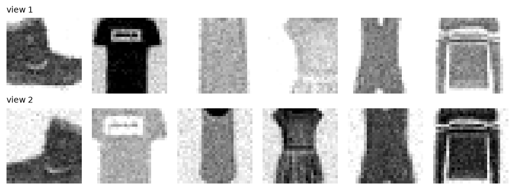
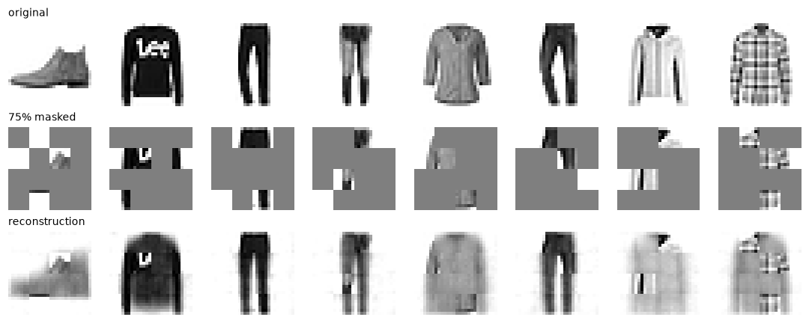

# Self-Supervised and Multimodal Learning

> **Level 8 · Chapter 5** · ⏱️ ~85 min read · Prerequisites: [Attention and transformers](01-attention-and-transformers.md), [Convolutional neural networks](../07-deep-learning-pytorch/03-convolutional-networks.md), [Embeddings and NLP basics](../07-deep-learning-pytorch/05-embeddings-and-nlp.md)

Labels are expensive; raw data is nearly free. **Self-supervised learning** trains networks on tasks whose labels come from the data itself, such as recognizing two crops of the same photo or filling in masked-out patches, and produces representations that transfer to many downstream tasks. This chapter derives the InfoNCE contrastive loss, trains a SimCLR-style model, builds a masked autoencoder and a vision transformer's patch embedding, and then shows how the same contrastive idea, applied to images paired with text, gives CLIP and the multimodal models built on it.

## Why it matters

Wei's team was building a classifier for a parts catalog: 20 part types, a few hundred labeled photos, and about 80,000 unlabeled photos from the warehouse cameras. A CNN trained from scratch on the labeled photos memorized them and generalized poorly. An ImageNet-pretrained model helped, but warehouse photos (gray parts on gray shelves, odd lighting) looked little like ImageNet.

What worked best was using the unlabeled photos. The team pretrained an encoder on all 80,000 with a contrastive objective, teaching it that two random crops of the same photo should map to nearby vectors and crops of different photos to distant ones. Then they trained a small classifier on top with the few hundred labels. Learning what makes warehouse photos similar or different, from the warehouse's own data, gave a representation better suited to the task than any off-the-shelf one.

That's the bet behind self-supervised learning, and behind modern foundation models: learn general structure from huge amounts of unlabeled (or loosely labeled) data, then adapt with a little supervision. Language models do it with next-token prediction. This chapter covers how vision and multimodal models do it.

## Concepts

### Learning without labels

Supervised learning needs a label for every example, and labels are slow, costly, and sometimes require experts. But data has internal structure that can serve as supervision. A **pretext task** is a made-up task whose answer is computable from the data itself, chosen so that solving it requires understanding the content. Early pretext tasks for images included predicting how an image was rotated (Gidaris et al., 2018) and solving jigsaw puzzles of shuffled patches (Noroozi and Favaro, 2016). Next-token prediction from [Language models](02-language-models.md) is the most successful pretext task of all.

Modern self-supervised methods mostly fall into two families:

- **Contrastive and joint-embedding methods**: learn an embedding in which different views of the same example are close and (in contrastive methods) views of different examples are far apart. SimCLR, MoCo, CLIP; and without negatives, BYOL and DINO.
- **Masked modeling**: hide part of the input and predict it from the rest. BERT for text, MAE for images.

How do you know a representation is good if there are no labels? Evaluate it on downstream tasks, with as little extra training as possible. The standard protocol is the **linear probe**: freeze the encoder, extract features for a labeled dataset, and train only a linear classifier on them. A **k-nearest-neighbor** classifier on frozen features is another. Both measure how much useful, linearly accessible information the features contain. **Fine-tuning** the whole network on the labeled task is the other common protocol, and usually gives the best final accuracy.

### Contrastive learning and InfoNCE

The idea of contrastive learning: you don't know what an image *is*, but you know two augmented versions of it show the same thing. So train an encoder $f_\theta$ to map them close together, and to map different images apart.

Formally, take an **anchor** $\mathbf{x}$ and a **positive** $\mathbf{y}^+$ that's related to it (another view of the same image, or the caption of the same image), plus $N - 1$ **negatives** $\mathbf{y}_2, \ldots, \mathbf{y}_N$ that aren't (views of other images). Define a similarity score $s(\mathbf{x}, \mathbf{y})$, usually the cosine similarity of the embeddings, $s = \frac{f(\mathbf{x})^\top g(\mathbf{y})}{\lVert f(\mathbf{x})\rVert\,\lVert g(\mathbf{y})\rVert}$. Now pose an $N$-way classification problem: *which of the $N$ candidates is the positive?* With a softmax over scores divided by a **temperature** $\tau$, the cross-entropy of the correct answer is the **InfoNCE loss** (van den Oord, Li, and Vinyals, 2018):

$$
\mathcal{L}_{\text{InfoNCE}} = -\,\mathbb{E}\left[\log\frac{\exp\big(s(\mathbf{x}, \mathbf{y}^+)/\tau\big)}{\exp\big(s(\mathbf{x}, \mathbf{y}^+)/\tau\big) + \sum_{j=2}^{N}\exp\big(s(\mathbf{x}, \mathbf{y}_j)/\tau\big)}\right].
$$

That's the whole loss: a softmax classifier where the "classes" are the other examples in the batch. The gradient pulls the positive's embedding toward the anchor and pushes each negative away, weighted by its softmax probability, so the negatives that currently look most similar (the **hard negatives**) get the biggest push.

**What does the optimal score learn?** Suppose the positive is drawn from $p(\mathbf{y} \mid \mathbf{x})$ and the negatives independently from the marginal $p(\mathbf{y})$. Given the set $\{\mathbf{y}_1, \ldots, \mathbf{y}_N\}$, the true probability that candidate $i$ is the positive is, by Bayes' rule,

$$
P(\text{positive} = i \mid \mathbf{x}, \mathbf{y}_{1:N}) = \frac{p(\mathbf{y}_i \mid \mathbf{x})\prod_{j \ne i}p(\mathbf{y}_j)}{\sum_{k}p(\mathbf{y}_k \mid \mathbf{x})\prod_{j \ne k}p(\mathbf{y}_j)} = \frac{p(\mathbf{y}_i \mid \mathbf{x})/p(\mathbf{y}_i)}{\sum_{k}p(\mathbf{y}_k \mid \mathbf{x})/p(\mathbf{y}_k)}.
$$

Cross-entropy is minimized when the model's softmax equals this true posterior, so the optimal $\exp(s/\tau)$ is proportional to the **density ratio** $p(\mathbf{y} \mid \mathbf{x})/p(\mathbf{y})$: how much more likely $\mathbf{y}$ is given $\mathbf{x}$ than in general. That ratio is exactly what **mutual information** averages: $I(\mathbf{x}; \mathbf{y}) = \mathbb{E}\left[\log\frac{p(\mathbf{y} \mid \mathbf{x})}{p(\mathbf{y})}\right]$ (from [Information theory and optimization](../01-math-foundations/06-information-theory-and-optimization.md)). Plugging the optimal score back in and bounding the sum over negatives, van den Oord et al. show

$$
I(\mathbf{x}; \mathbf{y}) \ge \log N - \mathcal{L}_{\text{InfoNCE}}.
$$

So minimizing InfoNCE maximizes a lower bound on the mutual information between the two views. The bound can never exceed $\log N$, which is one reason contrastive methods like large batches: more negatives allow a tighter bound and a harder task. (Whether maximizing mutual information is *why* contrastive learning works is debated; Tschannen et al., 2020, showed the choice of encoder and augmentations matters more than the bound's tightness. The classification view is the more reliable intuition.)

**The temperature** $\tau$ controls how sharply the softmax focuses on hard negatives. Cosine similarities lie in $[-1, 1]$, so without a temperature the logits would differ by at most 2, too little for a confident softmax. Typical values are 0.05 to 0.5. Small $\tau$ concentrates the gradient on the hardest negatives; too small, and training becomes unstable.

Wang and Isola (2020) offer a helpful picture: the contrastive loss rewards **alignment** (positives close together) and **uniformity** (embeddings spread evenly over the unit sphere, preserving as much information as possible). Without negatives, the encoder could achieve perfect alignment by mapping everything to one point: **representation collapse**. Negatives prevent that.

### SimCLR

**SimCLR** (Chen et al., 2020) turned this into a simple, strong recipe for images:

1. Take a batch of $N$ images. Make two random **augmentations** of each, giving $2N$ views. SimCLR's key augmentations are random resized crops, color distortion, and blur.
2. Encode each view with a CNN $f$ to a representation $\mathbf{h}$, then a small MLP **projection head** $g$ to $\mathbf{z} = g(\mathbf{h})$.
3. For each view, its partner is the positive and the other $2N - 2$ views are negatives. Apply InfoNCE with cosine similarity to all $2N$ views and average. SimCLR calls this the **NT-Xent** loss (normalized, temperature-scaled cross-entropy).
4. After training, throw away the projection head and use $\mathbf{h}$ for downstream tasks.

Two findings from the paper are worth remembering. **Augmentations define the task**: what the model learns to ignore is exactly what the augmentations vary. Crop plus color distortion was much stronger than either alone, because with crops only, the model can match views by color histogram and learn little else. And the **representation before the projection head** transfers better than the head's output, because the head learns to discard information (like color) that the loss makes irrelevant but downstream tasks may need.

The choice of augmentations is a choice of **invariances**: if you use color jitter, the representation can't distinguish colors well. For a task where color matters (ripe versus unripe fruit), that's a bad choice. Self-supervised learning isn't assumption-free; the assumptions live in the augmentations.

Methods without explicit negatives followed. **BYOL** (Grill et al., 2020) and **SimSiam** predict one view's embedding from the other's through an extra predictor network, with a stop-gradient (and, in BYOL, a slowly moving average "target" encoder) that prevents collapse. **DINO** (Caron et al., 2021) applies a similar self-distillation idea to vision transformers and found attention maps that segment objects without any labels.

### Masked modeling: BERT and MAE

The other family hides part of the input and predicts it.

**BERT** (Devlin et al., 2019) pretrains a transformer *encoder* with **masked language modeling**: choose 15% of tokens; replace 80% of those with a special `[MASK]` token, 10% with a random token, and leave 10% unchanged (so the model can't assume unmasked tokens are always correct); then predict the original tokens at those positions. Because the encoder has bidirectional attention, each prediction uses context on both sides, which makes BERT's representations strong for classification, tagging, and retrieval. BERT can't easily generate text, which is one reason decoder-only GPT-style models became the default for general-purpose LLMs.

**Masked autoencoders (MAE)** (He et al., 2022) bring the idea to images with vision transformers:

1. Split the image into patches and **mask a large fraction at random, 75%**.
2. The **encoder**, a ViT, processes **only the visible patches**. With 75% masked, that's four times fewer tokens, so pretraining is cheap.
3. A small **decoder** receives the encoded visible patches plus a shared, learned **mask token** at each masked position (with position embeddings so it knows where each one is), and predicts the pixels of the masked patches.
4. The loss is the mean squared error **on the masked patches only**.

Why mask so much more than BERT's 15%? Images are highly redundant: a missing patch can often be filled in by interpolating its neighbors, which requires no understanding. Masking 75% removes that shortcut and forces the model to reason about objects and shapes. Words are dense with information, so masking 15% of a sentence is already hard. After pretraining, the decoder is discarded and the encoder is fine-tuned or probed.

### Vision transformers

A transformer operates on a sequence of vectors. The **Vision Transformer (ViT)** (Dosovitskiy et al., 2021) makes an image into one:

1. Split an $H \times W \times C$ image into non-overlapping $P \times P$ patches: $N = HW/P^2$ patches (a 224×224 image with $P = 16$ gives 196).
2. Flatten each patch to a vector of length $P^2 C$ and apply a shared linear layer, the **patch embedding**, to get $N$ tokens of dimension $d$. This is identical to a convolution with kernel size $P$ and stride $P$.
3. Prepend a learned **`[CLS]` token**, whose final representation is used for classification (averaging all patch tokens is a common alternative).
4. Add learned position embeddings, and run a standard transformer encoder: the same pre-LN blocks as in [Attention and transformers](01-attention-and-transformers.md).

A ViT has much weaker built-in assumptions (**inductive biases**) than a CNN. A CNN assumes locality and translation equivariance through its small shared kernels; a ViT's attention can relate any patch to any other from the first layer, and must *learn* that nearby patches matter. With modest data, CNNs win. The original ViT paper found ViTs overtook strong CNNs only when pretrained on very large datasets (hundreds of millions of images); later work (DeiT, Touvron et al., 2021) showed strong augmentation and regularization close much of the gap on ImageNet alone. Their payoff is that they scale well, and they use the same architecture as language models, which makes combining modalities natural.

### CLIP: contrastive learning across modalities

**CLIP** (Radford et al., 2021) applies InfoNCE to *pairs of different modalities*. It trained on about 400 million (image, caption) pairs collected from the internet:

1. An **image encoder** (a ResNet or ViT) maps each image to a vector; a **text encoder** (a transformer) maps each caption to a vector; each is projected to a shared embedding space and normalized.
2. For a batch of $N$ pairs, compute the $N \times N$ matrix of cosine similarities between every image and every caption, scaled by a learned temperature. The diagonal holds the true pairs.
3. Apply cross-entropy in both directions, each image classifying its caption among the $N$, and each caption classifying its image, and average:

$$
\mathcal{L}_{\text{CLIP}} = \frac{1}{2}\left[\frac{1}{N}\sum_{i}-\log\frac{e^{s_{ii}/\tau}}{\sum_j e^{s_{ij}/\tau}} + \frac{1}{N}\sum_{j}-\log\frac{e^{s_{jj}/\tau}}{\sum_i e^{s_{ij}/\tau}}\right],
$$

where $s_{ij}$ is the cosine similarity of image $i$ and caption $j$.

The payoff is **zero-shot classification**. To classify an image into classes nobody trained a classifier for, embed one text prompt per class ("a photo of a dog", "a photo of a cat", ...) and pick the class whose text embedding is most similar to the image's. CLIP matched the accuracy of the original supervised ResNet-50 on ImageNet without using any of ImageNet's 1.28 million training labels, and it was markedly more robust when the image distribution shifted (sketches, renditions). The same shared embedding space powers text-to-image search, and CLIP-style text encoders condition many image generators.

Its limitations are instructive: CLIP is weak at counting, at fine-grained distinctions, and at spatial relations ("a red cube on a blue sphere"), because captions on the internet rarely require them; and it absorbs the social biases of its web data. Zero-shot accuracy also depends on prompt wording, which is why CLIP used prompt templates and ensembles of them.

### Multimodal models

Modern **multimodal models** combine several kinds of input and output. The main patterns:

- **Dual encoders** like CLIP: separate encoders mapping modalities into one embedding space. Ideal for retrieval and zero-shot classification; they don't generate text.
- **Vision-language models (VLMs)** that generate text about images. A common recipe (for example LLaVA, Liu et al., 2023): take a pretrained vision encoder (often CLIP's), map its patch embeddings through a small **projector** into the token-embedding space of a pretrained LLM, and feed them to the LLM as if they were words, then fine-tune on image-instruction data. Flamingo (Alayrac et al., 2022) instead inserted cross-attention layers into a frozen LLM so text tokens could attend to image features.
- **Speech models** like Whisper (Radford et al., 2022): an encoder-decoder transformer that maps audio spectrograms to text, trained on 680,000 hours of weakly supervised audio-transcript pairs.
- **Text-to-image models**: a text encoder (CLIP's or a language model's) conditions a diffusion model through cross-attention, as in [Generative models](04-generative-models.md).
- **Natively multimodal models** that tokenize several modalities into one sequence and train a single transformer on all of them.

The unifying idea: transformers process sequences of vectors, so anything that can be turned into tokens (image patches, audio frames, text) can share a model, and contrastive or generative pretraining aligns them.

## In practice

### The InfoNCE (NT-Xent) loss, from scratch

The implementation computes all pairwise cosine similarities among the $2N$ views, masks out each view's similarity with itself, and uses cross-entropy with each view's partner as the target class.

```python
import math
import time
import numpy as np
import torch
import torch.nn as nn
import torch.nn.functional as F
import matplotlib.pyplot as plt
from torchvision import datasets
from sklearn.linear_model import LogisticRegression

torch.set_num_threads(4)
torch.manual_seed(0)

def nt_xent(z1, z2, tau=0.2):
    """SimCLR loss. z1[i] and z2[i] are embeddings of two views of example i."""
    n = len(z1)
    z = F.normalize(torch.cat([z1, z2]), dim=1)                # (2N, d), unit length
    sim = z @ z.T / tau                                        # cosine similarities / temperature
    sim.fill_diagonal_(float("-inf"))                          # a view is not its own candidate
    targets = torch.cat([torch.arange(n, 2 * n), torch.arange(n)])   # view i's partner
    return F.cross_entropy(sim, targets)

def nt_xent_loop(z1, z2, tau=0.2):
    """The same loss, written as the formula: one anchor at a time."""
    z = F.normalize(torch.cat([z1, z2]), dim=1)
    n2, total = len(z), 0.0
    for i in range(n2):
        j = (i + n2 // 2) % n2                                 # index of the positive
        logits = torch.stack([z[i] @ z[k] / tau for k in range(n2) if k != i])
        pos = j if j < i else j - 1                            # position of the positive after removing i
        total += -(logits[pos] - torch.logsumexp(logits, 0))
    return total / n2

z1, z2 = torch.randn(16, 32), torch.randn(16, 32)
print(f"vectorized {nt_xent(z1, z2):.5f}   loop {nt_xent_loop(z1, z2):.5f}")
print(f"random views:      {nt_xent(z1, z2):.3f}   (log(2N - 1) = {math.log(31):.3f})")
print(f"aligned views:     {nt_xent(z1, z1 + 0.05 * torch.randn(16, 32)):.3f}")
print(f"collapsed (all equal): {nt_xent(torch.ones(16, 32), torch.ones(16, 32)):.3f}")
```

```text
vectorized 4.02403   loop 4.02403
random views:      4.024   (log(2N - 1) = 3.434)
aligned views:     0.249
collapsed (all equal): 3.434
```

The vectorized version matches the formula. Random embeddings give a loss a little above $\log(2N - 1)$, the chance level among 31 candidates (above it because random similarities spread the logits, and the log-sum-exp of spread-out logits exceeds the log of their count). Aligned views give a far lower loss. And a collapsed encoder that maps everything to the same vector is stuck at exactly $\log(2N - 1)$: the negatives make collapse a bad solution, which is their job.

### SimCLR on FashionMNIST

The augmentations are implemented on whole batches with an affine transform (random crop-and-resize with scale 0.6 to 1, and horizontal flips), plus random brightness and contrast and a little noise. The encoder is a small CNN whose 128-dimensional pooled output is the representation $\mathbf{h}$; a two-layer projection head maps it to 64 dimensions for the loss.

```python
train_ds = datasets.FashionMNIST("data", train=True, download=True)
test_ds = datasets.FashionMNIST("data", train=False, download=True)
X_unlab = train_ds.data[:10000].float().div(255).unsqueeze(1)          # "unlabeled" pool
X_lab, y_lab = train_ds.data[50000:51000].float().div(255).unsqueeze(1), train_ds.targets[50000:51000]
X_test, y_test = test_ds.data[:2000].float().div(255).unsqueeze(1), test_ds.targets[:2000]

def augment(x):
    B = x.shape[0]
    scale = torch.empty(B).uniform_(0.6, 1.0)                          # zoom in on a random crop
    shift = (torch.rand(B, 2) * 2 - 1) * (1 - scale)[:, None]
    flip = torch.where(torch.rand(B) < 0.5, -1.0, 1.0)
    theta = torch.zeros(B, 2, 3)
    theta[:, 0, 0], theta[:, 1, 1] = scale * flip, scale
    theta[:, :, 2] = shift
    grid = F.affine_grid(theta, list(x.shape), align_corners=False)
    x = F.grid_sample(x, grid, align_corners=False)
    x = x * torch.empty(B, 1, 1, 1).uniform_(0.6, 1.4) + torch.empty(B, 1, 1, 1).uniform_(-0.2, 0.2)
    return (x + 0.05 * torch.randn_like(x)).clamp(0, 1)

class Encoder(nn.Module):
    def __init__(self):
        super().__init__()
        self.net = nn.Sequential(
            nn.Conv2d(1, 32, 3, padding=1), nn.ReLU(), nn.MaxPool2d(2),
            nn.Conv2d(32, 64, 3, padding=1), nn.ReLU(), nn.MaxPool2d(2),
            nn.Conv2d(64, 128, 3, padding=1), nn.ReLU(), nn.AdaptiveAvgPool2d(1), nn.Flatten())
    def forward(self, x):
        return self.net(x)

torch.manual_seed(0)
views = torch.cat([augment(X_unlab[:6]), augment(X_unlab[:6])])
fig, axes = plt.subplots(2, 6, figsize=(8, 3))
for i, ax in enumerate(axes.flat):
    ax.imshow(views[i, 0], cmap="gray_r", vmin=0, vmax=1)
    ax.axis("off")
axes[0, 0].set_title("view 1", fontsize=9, loc="left")
axes[1, 0].set_title("view 2", fontsize=9, loc="left")
plt.tight_layout()
plt.show()
```



*Each column is one image under two random augmentations. The encoder must map both views close together, and away from the other images' views.*

Before training, set up the evaluation: a linear probe (logistic regression on standardized frozen features) trained on 100 or 1,000 labeled images and tested on 2,000. Two baselines frame the result: raw pixels, and the *same* encoder with random weights.

```python
@torch.no_grad()
def features(encoder, x):
    return encoder(x).numpy() if encoder is not None else x.flatten(1).numpy()

def linear_probe(encoder, n_labels):
    idx = torch.cat([torch.nonzero(y_lab == c)[: n_labels // 10, 0] for c in range(10)])   # balanced
    f_tr, f_te = features(encoder, X_lab[idx]), features(encoder, X_test)
    mean, std = f_tr.mean(0), f_tr.std(0) + 1e-6
    clf = LogisticRegression(max_iter=3000).fit((f_tr - mean) / std, y_lab[idx])
    return clf.score((f_te - mean) / std, y_test)

torch.manual_seed(0)
encoder = Encoder()
print(f"raw pixels:      100 labels {linear_probe(None, 100):.3f}   1,000 labels {linear_probe(None, 1000):.3f}")
print(f"random encoder:  100 labels {linear_probe(encoder, 100):.3f}   1,000 labels {linear_probe(encoder, 1000):.3f}")
```

```text
raw pixels:      100 labels 0.665   1,000 labels 0.792
random encoder:  100 labels 0.617   1,000 labels 0.750
```

Now train with NT-Xent for 4 epochs over the 10,000 unlabeled images (a minute or so on a CPU), probing after each epoch.

```python
head = nn.Sequential(nn.Linear(128, 128), nn.ReLU(), nn.Linear(128, 64))
opt = torch.optim.Adam(list(encoder.parameters()) + list(head.parameters()), lr=2e-3)
for epoch in range(4):
    perm = torch.randperm(len(X_unlab))
    for i in range(0, len(X_unlab) - 255, 256):                      # full batches only
        x = X_unlab[perm[i:i + 256]]
        loss = nt_xent(head(encoder(augment(x))), head(encoder(augment(x))))
        opt.zero_grad()
        loss.backward()
        opt.step()
    print(f"epoch {epoch + 1}: NT-Xent {loss.item():.3f}  (chance {math.log(511):.2f})   "
          f"probe: 100 labels {linear_probe(encoder, 100):.3f}, 1,000 labels {linear_probe(encoder, 1000):.3f}")
```

```text
epoch 1: NT-Xent 5.443  (chance 6.24)   probe: 100 labels 0.600, 1,000 labels 0.730
epoch 2: NT-Xent 4.613  (chance 6.24)   probe: 100 labels 0.628, 1,000 labels 0.776
epoch 3: NT-Xent 4.323  (chance 6.24)   probe: 100 labels 0.644, 1,000 labels 0.773
epoch 4: NT-Xent 4.062  (chance 6.24)   probe: 100 labels 0.663, 1,000 labels 0.790
```

Without seeing a single label, contrastive training improves the encoder's features: after a first epoch spent reorganizing the random features, the linear probe climbs to about 4 points above the same architecture with random weights, with either 100 or 1,000 labels. On this small, clean dataset, a minute of CPU training brings the 128 learned features roughly level with all 784 raw pixels, which are a strong baseline on FashionMNIST (centered, aligned objects on blank backgrounds). The published gains of self-supervised learning come from much longer training (hundreds of epochs), bigger encoders, larger and messier datasets, and harder downstream tasks, where raw pixels are hopeless. The trend here, steady improvement from unlabeled data alone, is the part that scales.

!!! warning "Common mistake: probing the projection head's output"
    Evaluate the representation *before* the projection head ($\mathbf{h}$, the encoder output), not $\mathbf{z}$. The head is trained to discard whatever the augmentations vary, which often includes information downstream tasks need. SimCLR found the pre-head representation substantially better under linear evaluation.

### A ViT patch embedding

The patch embedding is the only part of a vision transformer that's specific to images. Here it is in two equivalent forms: reshape the image into flattened patches and apply a linear layer, or apply a convolution with kernel size and stride equal to the patch size. Copying the weights shows they're the same operation.

```python
class PatchEmbed(nn.Module):
    def __init__(self, img=28, patch=7, chans=1, dim=64):
        super().__init__()
        self.patch, self.n_patches = patch, (img // patch) ** 2
        self.proj = nn.Linear(patch * patch * chans, dim)
        self.cls = nn.Parameter(torch.zeros(1, 1, dim))
        self.pos = nn.Parameter(0.02 * torch.randn(1, self.n_patches + 1, dim))

    def patchify(self, x):                                   # (B, C, H, W) -> (B, N, P*P*C)
        B, C, H, W = x.shape
        p = self.patch
        x = x.reshape(B, C, H // p, p, W // p, p).permute(0, 2, 4, 3, 5, 1)
        return x.reshape(B, (H // p) * (W // p), p * p * C)

    def forward(self, x):
        tokens = self.proj(self.patchify(x))                 # (B, N, dim)
        cls = self.cls.expand(len(x), -1, -1)
        return torch.cat([cls, tokens], dim=1) + self.pos    # (B, N + 1, dim)

torch.manual_seed(0)
pe = PatchEmbed()
conv = nn.Conv2d(1, 64, kernel_size=7, stride=7)
with torch.no_grad():
    # Linear weight (dim, P*P*C) laid out as (row, col, channel) -> conv weight (dim, C, P, P)
    conv.weight.copy_(pe.proj.weight.view(64, 7, 7, 1).permute(0, 3, 1, 2))
    conv.bias.copy_(pe.proj.bias)
x = X_test[:4]
via_linear = pe.proj(pe.patchify(x))
via_conv = conv(x).flatten(2).transpose(1, 2)               # (B, dim, 4, 4) -> (B, 16, dim)
print("patches:", tuple(pe.patchify(x).shape), " tokens with [CLS]:", tuple(pe(x).shape))
print(f"linear vs conv max difference: {(via_linear - via_conv).abs().max():.2e}")
```

```text
patches: (4, 16, 49)  tokens with [CLS]: (4, 17, 64)
linear vs conv max difference: 2.38e-07
```

A 28×28 image becomes 16 tokens of 7×7 pixels, plus a `[CLS]` token. From here, a ViT is just the transformer encoder from Chapter 1. The masked autoencoder below uses this patchify step and a small transformer encoder: it's a tiny ViT.

### A tiny masked autoencoder

The MAE here follows the paper's design at toy scale: mask 75% of the 16 patches at random (12 hidden, 4 visible), encode only the visible patches with a 2-layer transformer, then a 1-layer decoder sees the encoded visible tokens plus a learned mask token at every hidden position and predicts their pixels. The loss is MSE on the masked patches only.

```python
class TinyMAE(nn.Module):
    def __init__(self, dim=64, mask_ratio=0.75):
        super().__init__()
        self.pe = PatchEmbed(dim=dim)
        self.n_keep = int(self.pe.n_patches * (1 - mask_ratio))
        layer = lambda: nn.TransformerEncoderLayer(dim, 4, 2 * dim, dropout=0.0, batch_first=True, norm_first=True)
        self.encoder = nn.TransformerEncoder(layer(), 2)
        self.mask_token = nn.Parameter(torch.zeros(1, 1, dim))
        self.dec_pos = nn.Parameter(0.02 * torch.randn(1, self.pe.n_patches, dim))
        self.decoder = nn.TransformerEncoder(layer(), 1)
        self.to_pixels = nn.Linear(dim, 49)

    def forward(self, x):
        patches = self.pe.patchify(x)                                   # (B, 16, 49) targets
        B, N, _ = patches.shape
        tokens = self.pe.proj(patches) + self.pe.pos[:, 1:]             # patch tokens with positions (no CLS)
        order = torch.rand(B, N).argsort(dim=1)                         # a random permutation per image
        keep, hide = order[:, :self.n_keep], order[:, self.n_keep:]
        visible = torch.gather(tokens, 1, keep[..., None].expand(-1, -1, tokens.shape[-1]))
        encoded = self.encoder(visible)                                 # the encoder sees 4 of 16 patches
        full = self.mask_token.expand(B, N, -1).clone()
        full.scatter_(1, keep[..., None].expand(-1, -1, full.shape[-1]), encoded)
        pred = self.to_pixels(self.decoder(full + self.dec_pos))        # (B, 16, 49)
        hidden = torch.zeros(B, N, dtype=torch.bool).scatter_(1, hide, True)
        loss = ((pred - patches) ** 2).mean(-1)[hidden].mean()          # masked patches only
        return loss, pred, hidden

X_mae = train_ds.data[:20000].float().div(255).unsqueeze(1)
torch.manual_seed(0)
mae = TinyMAE()
opt = torch.optim.AdamW(mae.parameters(), lr=2e-3)
for step in range(1001):
    loss, _, _ = mae(X_mae[torch.randint(len(X_mae), (256,))])
    opt.zero_grad()
    loss.backward()
    opt.step()
    if step % 500 == 0:
        print(f"step {step:4d}  masked-patch MSE {loss.item():.4f}")

# Baseline: predict each hidden patch as the average training patch at that position.
mean_patch = mae.pe.patchify(X_mae).mean(0)
torch.manual_seed(1)
with torch.no_grad():
    test_loss, pred, hidden = mae(X_test[:500])
    base = ((mean_patch.expand(500, -1, -1) - mae.pe.patchify(X_test[:500])) ** 2).mean(-1)[hidden].mean()
print(f"test masked-patch MSE: MAE {test_loss:.4f}  vs  per-position mean patch {base:.4f}")
```

```text
step    0  masked-patch MSE 0.2455
step  500  masked-patch MSE 0.0389
step 1000  masked-patch MSE 0.0335
test masked-patch MSE: MAE 0.0341  vs  per-position mean patch 0.0876
```

```python
def unpatchify(p):                                                      # (B, 16, 49) -> (B, 28, 28)
    return p.view(-1, 4, 4, 7, 7).permute(0, 1, 3, 2, 4).reshape(-1, 28, 28)

target = mae.pe.patchify(X_test[:500])
masked_in = target.clone()
masked_in[hidden] = 0.5                                                 # gray out hidden patches
recon = torch.where(hidden[..., None], pred, target)                    # visible patches + predictions
fig, axes = plt.subplots(3, 8, figsize=(10, 4))
for c in range(8):
    for r, imgs in enumerate([target, masked_in, recon]):
        axes[r, c].imshow(unpatchify(imgs[c:c + 1])[0].clamp(0, 1), cmap="gray_r", vmin=0, vmax=1)
        axes[r, c].axis("off")
for r, name in enumerate(["original", "75% masked", "reconstruction"]):
    axes[r, 0].set_title(name, fontsize=9, loc="left")
plt.tight_layout()
plt.show()
```



*From only 4 of 16 patches, the model reconstructs plausible garment shapes: it has learned what clothing looks like, not just local smoothness.*

The reconstruction error is about a third of the error of the best "know nothing about this image" guess. To fill in 12 of 16 patches from the other 4, the model has to recognize, from fragments, what kind of garment it's looking at, and that's the kind of knowledge a good representation needs. The reconstructions are blurry where the evidence is ambiguous, as with the VAE in the previous chapter, but blur doesn't matter here: the goal is the encoder, not the pictures.

### A toy CLIP

Finally, contrastive learning across two modalities. The "images" are FashionMNIST images; the "text" is short captions built from templates and class names, such as "a picture of the sneaker". The text encoder averages learned word embeddings and applies an MLP; the image encoder is an MLP on pixels. Both project to a shared 32-dimensional space, and the symmetric CLIP loss with a learnable temperature trains them together. No classifier is trained, and class labels are used only to write captions.

```python
classes = ["t-shirt", "trousers", "pullover", "dress", "coat", "sandal", "shirt", "sneaker", "bag", "ankle boot"]
templates = ["a photo of a {}", "a picture of the {}", "a {} on a plain background", "my favourite {}"]
vocab = {w: i for i, w in enumerate(sorted({w for t in templates for c in classes for w in t.format(c).split()}))}

def encode_text(captions):
    ids = [torch.tensor([vocab[w] for w in c.split() if w in vocab]) for c in captions]
    offsets = torch.tensor([0] + [len(t) for t in ids[:-1]]).cumsum(0)
    return torch.cat(ids), offsets

class TinyCLIP(nn.Module):
    def __init__(self, dim=32):
        super().__init__()
        self.image = nn.Sequential(nn.Flatten(), nn.Linear(784, 256), nn.ReLU(), nn.Linear(256, dim))
        self.word = nn.EmbeddingBag(len(vocab), 64, mode="mean")
        self.text = nn.Sequential(nn.ReLU(), nn.Linear(64, dim))
        self.logit_scale = nn.Parameter(torch.tensor(math.log(1 / 0.07)))     # learnable 1/temperature

    def embed_images(self, x):
        return F.normalize(self.image(x), dim=-1)

    def embed_texts(self, captions):
        return F.normalize(self.text(self.word(*encode_text(captions))), dim=-1)

    def loss(self, x, captions):
        logits = self.logit_scale.exp() * self.embed_images(x) @ self.embed_texts(captions).T   # (N, N)
        targets = torch.arange(len(x))
        return (F.cross_entropy(logits, targets) + F.cross_entropy(logits.T, targets)) / 2

X_pairs, y_pairs = train_ds.data[:20000].float().div(255).unsqueeze(1), train_ds.targets[:20000]
torch.manual_seed(0)
clip = TinyCLIP()
opt = torch.optim.Adam(clip.parameters(), lr=1e-3)
rng = np.random.default_rng(0)
for step in range(1001):
    idx = torch.randint(len(X_pairs), (256,))
    caps = [templates[rng.integers(len(templates))].format(classes[int(c)]) for c in y_pairs[idx]]
    loss = clip.loss(X_pairs[idx], caps)
    opt.zero_grad()
    loss.backward()
    opt.step()
    if step % 250 == 0:
        print(f"step {step:4d}  CLIP loss {loss.item():.3f}  temperature {1 / clip.logit_scale.exp().item():.3f}")
```

```text
step    0  CLIP loss 6.497  temperature 0.070
step  250  CLIP loss 3.698  temperature 0.070
step  500  CLIP loss 3.549  temperature 0.070
step  750  CLIP loss 3.598  temperature 0.071
step 1000  CLIP loss 3.562  temperature 0.072
```

The loss stalls well above zero, and that's expected: a batch of 256 contains about 25 images of each class, all with interchangeable captions, so the "correct" caption is often indistinguishable from others of the same class. (These **false negatives** exist in real CLIP training too, at a much lower rate.) The real test is zero-shot classification of held-out images: embed one prompt per class and pick the nearest.

```python
with torch.no_grad():
    img = clip.embed_images(X_test)
    for prompt in ["a photo of a {}", "a {} on a plain background"]:
        txt = clip.embed_texts([prompt.format(c) for c in classes])
        acc = ((img @ txt.T).argmax(1) == y_test).float().mean()
        print(f"zero-shot accuracy with prompt {prompt!r}: {acc:.3f}")
    txt = clip.embed_texts(["a photo of a sneaker"])
    top = (img @ txt.T).squeeze(1).topk(10).indices
    print("top 10 test images for 'a photo of a sneaker':", [classes[int(c)] for c in y_test[top]])
```

```text
zero-shot accuracy with prompt 'a photo of a {}': 0.871
zero-shot accuracy with prompt 'a {} on a plain background': 0.871
top 10 test images for 'a photo of a sneaker': ['sneaker', 'sneaker', 'ankle boot', 'sneaker', 'sneaker', 'sneaker', 'sneaker', 'sneaker', 'sneaker', 'sneaker']
```

Image-text matching alone produces a classifier: no classification head and no cross-entropy over classes, just "which caption fits this image?". The same embeddings support retrieval in both directions. Real CLIP does this with hundreds of millions of natural, varied captions, so its text encoder learns language, not 10 class names, and zero-shot works for concepts it never saw named in a fixed label set.

## Exercises

### Exercise 1: InfoNCE by hand (easy)

An anchor has cosine similarity 0.8 with its positive and 0.2, 0.1, and $-0.3$ with three negatives. (a) Compute the InfoNCE loss with $\tau = 1$ and with $\tau = 0.1$. (b) Which temperature gives a larger gradient on the hardest negative relative to the easiest? Explain from the softmax weights.

??? success "Solution"

    (a) With $\tau = 1$: logits 0.8, 0.2, 0.1, $-0.3$. Softmax of the positive: $e^{0.8}/(e^{0.8} + e^{0.2} + e^{0.1} + e^{-0.3}) = 2.226/(2.226 + 1.221 + 1.105 + 0.741) = 0.421$, loss $-\ln 0.421 = 0.866$. With $\tau = 0.1$: logits 8, 2, 1, $-3$; positive's probability $= 1/(1 + e^{-6} + e^{-7} + e^{-11}) = 0.9966$, loss 0.0034.

    (b) The gradient on each negative's logit is its softmax probability. With $\tau = 1$ the negatives get 0.231, 0.209, and 0.140: nearly even. With $\tau = 0.1$ they're $2.5 \times 10^{-3}$, $9.1 \times 10^{-4}$, and $1.7 \times 10^{-5}$: the hardest negative gets about 150 times the push of the easiest. Low temperature focuses learning on hard negatives.

    ```python
    s = torch.tensor([0.8, 0.2, 0.1, -0.3])
    for tau in [1.0, 0.1]:
        p = (s / tau).softmax(0)
        print(f"tau={tau}: loss {-p[0].log():.4f}, negative weights {p[1:].numpy().round(5)}")
    ```

    ```text
    tau=1.0: loss 0.8664, negative weights [0.23076 0.2088  0.13996]
    tau=0.1: loss 0.0034, negative weights [2.47e-03 9.10e-04 2.00e-05]
    ```

### Exercise 2: The mutual information ceiling (medium)

(a) Using $I(\mathbf{x}; \mathbf{y}) \ge \log N - \mathcal{L}_{\text{InfoNCE}}$, what's the largest mutual information (in nats) that SimCLR in this chapter could certify with a batch of 256 images? (b) The final NT-Xent loss was about 3.6. What lower bound on mutual information does that give? (c) Why might a method want much larger batches, and what are alternatives to huge batches?

??? success "Solution"

    (a) Each anchor chooses among $2N - 1 = 511$ candidates, so the bound can't exceed $\log 511 \approx 6.24$ nats, however good the encoder.

    (b) $6.24 - 3.6 \approx 2.6$ nats.

    (c) A higher ceiling and more (and harder) negatives per step make the task harder and the signal richer. Alternatives: a **memory bank** or **queue** of embeddings from recent batches (MoCo, He et al., 2020, keeps a queue encoded by a slowly updated momentum encoder), or methods that need no negatives at all (BYOL, SimSiam, DINO).

### Exercise 3: Which augmentations? (medium, conceptual)

For each task, say which SimCLR augmentation would be harmful and why: (a) classifying ripe versus unripe bananas from photos; (b) reading the digit in an image (6 versus 9); (c) detecting whether a chest X-ray shows a left-sided or right-sided abnormality.

??? success "Solution"

    (a) Color distortion: ripeness is mostly color, and color jitter teaches the encoder to ignore it.

    (b) Rotation by 180 degrees (and, to a lesser degree, vertical flips): they turn a 6 into a 9, so invariance to them destroys the distinction.

    (c) Horizontal flips: they swap left and right, exactly the property the task depends on.

    The general rule: augmentations encode what should *not* matter. Choose them from knowledge of the downstream tasks.

### Exercise 4: Mask ratio (medium)

Without running anything, predict how the masked-patch MSE of `TinyMAE` would change with mask ratios of 0.25 and 0.9, and explain the trade-off between how hard the task is and how useful it is. Then train both for 1,000 steps and compare test masked-patch MSE with the 0.75 model.

??? success "Solution"

    Prediction: with 25% masked, each hidden patch has many visible neighbors, so interpolation works well and the MSE should be lowest; with 90% masked (1 visible patch of 16), the model must guess almost the whole garment and the MSE should be highest. But low error doesn't mean a useful task: the MAE paper found high ratios (around 75%) gave the best representations, because easy interpolation teaches little about objects.

    ```python
    for ratio in [0.25, 0.9]:
        torch.manual_seed(0)
        m = TinyMAE(mask_ratio=ratio)
        o = torch.optim.AdamW(m.parameters(), lr=2e-3)
        for step in range(1000):
            l, _, _ = m(X_mae[torch.randint(len(X_mae), (256,))])
            o.zero_grad(); l.backward(); o.step()
        torch.manual_seed(1)
        with torch.no_grad():
            print(f"mask ratio {ratio}: {m.n_keep} visible patches, test masked-patch MSE {m(X_test[:500])[0]:.4f}")
    ```

    ```text
    mask ratio 0.25: 12 visible patches, test masked-patch MSE 0.0227
    mask ratio 0.9: 1 visible patches, test masked-patch MSE 0.0567
    ```

    The ordering matches the prediction. Comparing representation quality would need a probe on each encoder, which is a good extension of this exercise.

### Exercise 5: Zero-shot with unseen words (hard)

The toy CLIP's text encoder only knows words from its training captions. (a) What happens when you classify with the prompt "an image of my {}", and why? (b) What does this reveal about why real CLIP's text encoder is a large transformer trained on hundreds of millions of varied captions? (c) Propose a change to the toy that would make "ankle boot" and "boot" have related embeddings.

??? success "Solution"

    (a) "an" and "image" never appeared in training captions, so `encode_text` drops them, and the prompt reduces to "of my {class}". Classification still works, because the class word carries most of the signal, but accuracy drops (compare with the training-template prompts above), since this combination of known words never occurred in training. A prompt with *no* known class word would fail completely.

    ```python
    with torch.no_grad():
        txt = clip.embed_texts(["an image of my {}".format(c) for c in classes])
        print(f"{((img @ txt.T).argmax(1) == y_test).float().mean():.3f}")
    ```

    ```text
    0.822
    ```

    (b) A zero-shot classifier is only as good as its text encoder's understanding of the label text. Real CLIP's encoder must handle any wording, synonyms, and compositions, which needs a language model trained on diverse text.

    (c) Use subword tokens (character n-grams or BPE from [Language models](02-language-models.md)), so "boot" is shared between "ankle boot" and "boot", or initialize the word embeddings from pretrained word vectors (word2vec or GloVe) in which related words are already close.

## Check yourself

1. What is a pretext task, and how do you evaluate a representation learned from one?

    ??? note "Answer"

        A task whose labels come from the data itself (predicting masked content, matching augmented views, predicting the next token). The representation is evaluated on downstream labeled tasks, typically with a linear probe or k-NN on frozen features, or by fine-tuning.

2. Write the InfoNCE loss and explain it as a classification problem.

    ??? note "Answer"

        $-\log\frac{\exp(s(\mathbf{x}, \mathbf{y}^+)/\tau)}{\sum_{j}\exp(s(\mathbf{x}, \mathbf{y}_j)/\tau)}$: an $N$-way softmax classifier must pick the positive among the positive and $N - 1$ negatives, using similarity scores as logits.

3. What does the optimal InfoNCE critic learn, and what bound connects the loss to mutual information?

    ??? note "Answer"

        $\exp(s/\tau)$ becomes proportional to the density ratio $p(\mathbf{y} \mid \mathbf{x})/p(\mathbf{y})$. The bound is $I(\mathbf{x}; \mathbf{y}) \ge \log N - \mathcal{L}_{\text{InfoNCE}}$, so the loss can certify at most $\log N$ nats.

4. Why does SimCLR need negatives, and how do BYOL or SimSiam manage without them?

    ??? note "Answer"

        Without negatives, mapping every input to the same vector perfectly aligns all positives: representation collapse. Negatives make collapse costly. BYOL and SimSiam avoid collapse with an asymmetric architecture: a predictor on one branch and a stop-gradient (plus a moving-average target encoder in BYOL) on the other.

5. Why does MAE mask 75% of image patches when BERT masks 15% of tokens?

    ??? note "Answer"

        Images are spatially redundant, so with a low mask ratio missing patches can be filled in by interpolating neighbors, which teaches little. A high ratio forces reasoning about whole objects. Language is information-dense, so 15% masking is already a demanding task. MAE's encoder also only processes the visible 25%, which makes pretraining cheap.

6. How does a ViT turn an image into tokens, and why does it need more data than a CNN?

    ??? note "Answer"

        It splits the image into $P \times P$ patches, flattens each, applies a shared linear projection (equivalent to a stride-$P$ convolution), prepends a `[CLS]` token, and adds position embeddings. It lacks a CNN's built-in locality and translation equivariance, so it must learn those regularities from data, which takes more data or stronger augmentation.

7. How does CLIP do zero-shot classification?

    ??? note "Answer"

        It embeds a text prompt for each candidate class ("a photo of a {class}") and the image into the shared space, and predicts the class whose prompt embedding has the highest cosine similarity with the image embedding. No classifier is trained for those classes.

8. Describe the common architecture for a vision-language model that answers questions about images.

    ??? note "Answer"

        A pretrained vision encoder (often CLIP's ViT) produces patch embeddings; a small projector maps them into the LLM's token-embedding space; the LLM processes them along with the text tokens and generates an answer. It's fine-tuned on image-instruction data. Alternatives insert cross-attention layers into the LLM instead.

## Key takeaways

- Self-supervised learning creates labels from the data itself; representations are judged by linear probes, k-NN, or fine-tuning on downstream tasks.
- InfoNCE is an $N$-way classification of the positive among negatives; its optimum learns a density ratio, and it lower-bounds mutual information by $\log N - \mathcal{L}$.
- SimCLR: two augmentations per image, an encoder plus projection head, NT-Xent over the batch; the augmentations decide which invariances are learned.
- Masked modeling predicts hidden content: BERT masks 15% of tokens, MAE masks 75% of image patches and encodes only the visible ones.
- A ViT is a transformer over patch embeddings with a `[CLS]` token and position embeddings; it trades a CNN's inductive biases for scalability.
- CLIP applies symmetric InfoNCE to image-caption pairs, giving a shared embedding space for zero-shot classification and retrieval; vision-language models feed projected vision features into LLMs.

## Further reading

- Ting Chen, Simon Kornblith, Mohammad Norouzi, and Geoffrey Hinton, "A Simple Framework for Contrastive Learning of Visual Representations" (ICML 2020). SimCLR.
- Aaron van den Oord, Yazhe Li, and Oriol Vinyals, "Representation Learning with Contrastive Predictive Coding" (2018). InfoNCE and the mutual information bound.
- Kaiming He et al., "Masked Autoencoders Are Scalable Vision Learners" (CVPR 2022); and Jacob Devlin et al., "BERT: Pre-training of Deep Bidirectional Transformers for Language Understanding" (NAACL 2019).
- Alexey Dosovitskiy et al., "An Image is Worth 16x16 Words: Transformers for Image Recognition at Scale" (ICLR 2021). The Vision Transformer.
- Alec Radford et al., "Learning Transferable Visual Models From Natural Language Supervision" (ICML 2021). CLIP.

## Next

Everything so far trains small models on a CPU. Real models need clusters of GPUs and every trick for memory and speed. Continue to [Scaling and efficiency](06-scaling-and-efficiency.md).
