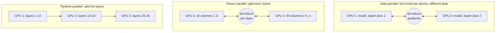
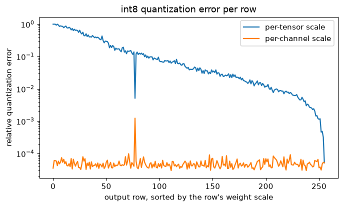
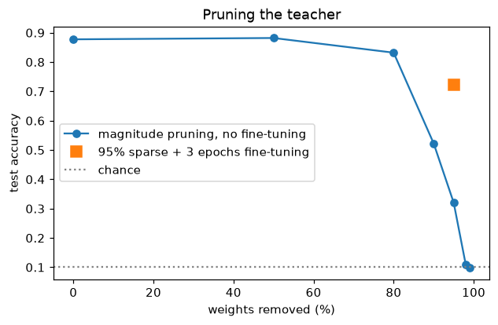

# Scaling and Efficiency

> **Level 8 · Chapter 6** · ⏱️ ~90 min read · Prerequisites: [Language models](02-language-models.md), [The training loop](../07-deep-learning-pytorch/02-the-training-loop.md), [Optimizers](../06-neural-networks/04-optimizers.md)

Modern models are limited less by ideas than by memory, bandwidth, and compute. This chapter explains how GPUs execute deep learning, how to account for every byte of training memory (with worked numbers for a 7-billion-parameter model), and the toolbox for fitting and speeding up big models: mixed precision, gradient accumulation, activation checkpointing, data, tensor, and pipeline parallelism, sharded training with FSDP, quantization, distillation, pruning, and inference techniques such as KV caching, batching, and speculative decoding. You'll implement the core of most of them at small scale.

## Why it matters

Sam wanted to fine-tune a 7-billion-parameter open model on a single 24 GB GPU. The arithmetic seemed fine: 7 billion parameters at 2 bytes each is 14 GB, which fits. The script loaded the model without complaint, then crashed with an out-of-memory error on the first training step. Sam tried a batch size of 1, then a shorter sequence length. Same crash.

The weights were never the problem. Training with Adam needs gradients (another 14 GB) and two optimizer statistics per parameter (28 GB more in 16-bit, or 56 GB in the usual 32-bit), plus a 32-bit master copy of the weights in standard mixed precision, plus activations. The real budget was over 100 GB before activations. Two minutes of memory accounting would have shown that full fine-tuning was impossible on that card and pointed straight at the options that work: LoRA on a quantized base model (QLoRA), or sharding across several GPUs.

Every technique in this chapter is a trade between memory, compute, communication, and accuracy. Knowing the trade lets you choose instead of guess.

## Concepts

### How GPUs work

A CPU has a handful of powerful cores, each optimized to run one thread of complicated, branchy code as fast as possible. A GPU has thousands of simpler cores, grouped into **streaming multiprocessors (SMs)**, that run the same instruction on many data elements at once (NVIDIA calls this SIMT, single instruction, multiple threads). Deep learning is mostly the same operation applied to huge arrays, which is exactly what this design is for.

Three features matter most for performance:

- **Tensor cores.** Specialized units that perform small matrix multiply-accumulates in one step, in low precision (fp16, bf16, fp8, int8). Most of a modern GPU's FLOPs are tensor-core FLOPs, available only for matrix multiplication in reduced precision. That's a major reason mixed precision matters.
- **The memory hierarchy.** Data lives in **high-bandwidth memory (HBM)**, tens of gigabytes reachable at a few terabytes per second. Each SM has a small, much faster on-chip **shared memory / SRAM** (hundreds of kilobytes) and registers. Moving data from HBM to the cores is often the real bottleneck, not arithmetic.
- **Kernels.** Each PyTorch operation launches one or more **kernels**, GPU programs that read inputs from HBM, compute, and write outputs back. A chain of small operations (add, multiply, GELU) reads and writes HBM at every step.

**Arithmetic intensity** decides which limit you hit: the number of FLOPs per byte moved. A data-center GPU like NVIDIA's A100 offers roughly 300 TFLOP/s of 16-bit tensor-core math and roughly 2 TB/s of HBM bandwidth, so it needs about 150 FLOPs per byte to keep the math units busy. Compare:

- **Matrix multiplication** of two $n \times n$ matrices: $2n^3$ FLOPs over about $3n^2$ numbers moved. Intensity grows with $n$ (about $n/3$ FLOPs per byte in 16-bit), so large matmuls are **compute-bound**. Good.
- **Elementwise operations** (add, GELU, dropout, LayerNorm): about one FLOP per number read and written, far below 150. They're **memory-bound**: the cores mostly wait for data.

This simple **roofline** picture explains much of practical deep learning performance. Large batches and large matrices raise intensity. **Kernel fusion** (combining several elementwise operations into one kernel, as `torch.compile` does) avoids HBM round trips. **FlashAttention** (Dao et al., 2022) computes exact attention in tiles that fit in SRAM, never writing the $T \times T$ score matrix to HBM, which makes attention much faster and its memory linear in $T$. And token-by-token LLM generation with batch size 1 is badly memory-bound: every step reads all the weights to do a sliver of math, which is why batching and quantization help inference so much.

### Memory budgets for training

Training memory has four parts. Write $N$ for the number of parameters.

1. **Parameters.** $N$ numbers.
2. **Gradients.** One per parameter: another $N$ numbers.
3. **Optimizer states.** Adam keeps two running averages per parameter ($m$ and $v$, from [Optimizers](../06-neural-networks/04-optimizers.md)): $2N$ numbers, usually in fp32. Plain SGD with momentum keeps one.
4. **Activations.** Everything the forward pass saves for the backward pass: inputs to each linear layer, attention probabilities, normalization statistics, dropout masks. This scales with batch size and sequence length, not with $N$ alone.

With standard **mixed-precision training with Adam** (the setting analyzed in the ZeRO paper, Rajbhandari et al., 2020), the bytes per parameter are:

| Item | Precision | Bytes per parameter |
|---|---|---|
| Weights used in forward and backward | bf16 or fp16 | 2 |
| Gradients | bf16 or fp16 | 2 |
| Master copy of weights | fp32 | 4 |
| Adam first moment $m$ | fp32 | 4 |
| Adam second moment $v$ | fp32 | 4 |
| **Total** | | **16** |

So the rule of thumb is **16 bytes per parameter** for mixed-precision Adam training, before activations. A 7-billion-parameter model needs about 112 GB for model states alone. Pure fp32 training is also 16 bytes per parameter (4 each for weights and gradients, 8 for Adam). For inference, you need only the weights: 2 bytes per parameter in 16-bit (14 GB for 7B), 1 in int8, and 0.5 in 4-bit.

**Activations** depend on the architecture. For a GPT-style transformer layer with hidden size $h$, $a$ heads, sequence length $s$, and micro-batch size $b$, Korthikanti et al. (2022) estimate the activation memory in 16-bit, without recomputation, as

$$
\text{activation bytes per layer} \approx s\,b\,h\left(34 + \frac{5\,a\,s}{h}\right).
$$

The first term covers the linear layers' inputs, LayerNorms, GELU, and dropout masks; the second, which grows with $s^2$, is the attention scores and probabilities (FlashAttention avoids storing it). For long sequences, activations can exceed the model states. You'll compute this for a 7B configuration below.

### Mixed precision: fp32, fp16, and bf16

A floating-point number has a **sign**, an **exponent** (which sets its range) and a **mantissa** (which sets its precision).

| Format | Exponent bits | Mantissa bits | Largest value | Smallest normal | Relative precision (eps) |
|---|---|---|---|---|---|
| fp32 | 8 | 23 | $3.4 \times 10^{38}$ | $1.2 \times 10^{-38}$ | $1.2 \times 10^{-7}$ |
| fp16 | 5 | 10 | 65,504 | $6.1 \times 10^{-5}$ | $9.8 \times 10^{-4}$ |
| bf16 | 8 | 7 | $3.4 \times 10^{38}$ | $1.2 \times 10^{-38}$ | $7.8 \times 10^{-3}$ |

**fp16** has more precision but a tiny range: values above 65,504 overflow to infinity, and gradients below about $3 \times 10^{-8}$ (half its smallest positive value, $6 \times 10^{-8}$) round to zero. **bf16** ("brain float", from Google) keeps fp32's 8-bit exponent and therefore its range, and gives up precision. Neural network training tolerates low precision in individual operations far better than overflow or underflow, which is why bf16 has become the default on hardware that supports it.

**Mixed-precision training** (Micikevicius et al., 2018) runs matrix multiplications in 16-bit and keeps sensitive things in fp32:

- **fp32 master weights.** The optimizer updates an fp32 copy. Why? A typical update is tiny relative to the weight. With bf16's eps of about 0.008, adding an update of $10^{-4}$ to a weight of 1.0 does nothing at all: $1 + 10^{-4}$ rounds back to 1. In fp32, it registers. You'll see this directly below.
- **fp32 reductions.** Sums over many elements (softmax normalizers, LayerNorm statistics, loss values) are computed in fp32. PyTorch's `torch.autocast` picks the precision per operation automatically.
- **Loss scaling** (fp16 only). Multiply the loss by a large factor $S$ (say $2^{16}$) before backward, so small gradients don't underflow, then divide the gradients by $S$ before the update. A **dynamic loss scaler** (`torch.amp.GradScaler`) lowers $S$ when it sees infinities and raises it when it doesn't. bf16 doesn't need loss scaling.

Newer GPUs add **fp8** formats for matrix multiplications, with per-tensor scaling factors, pushing the same idea further.

### Gradient accumulation

If the batch you want doesn't fit in memory, split it into $k$ **micro-batches**, run forward and backward on each, and let the gradients add up before taking one optimizer step. Since the loss is a mean over examples, the gradient of the full batch equals the average of the micro-batch gradients:

$$
\nabla_\theta\frac{1}{B}\sum_{i=1}^{B}\ell_i = \frac{1}{k}\sum_{j=1}^{k}\nabla_\theta\left(\frac{1}{B/k}\sum_{i \in \text{micro-batch } j}\ell_i\right).
$$

So divide each micro-batch loss by $k$, call `backward()` $k$ times (PyTorch adds into `.grad`), then step and zero the gradients. The result is mathematically identical to the big batch, at the cost of $k$ sequential passes. Exceptions: layers that compute statistics across the batch, like BatchNorm, see smaller batches; and if micro-batches have different numbers of tokens, average per token over the whole batch, not per micro-batch.

### Activation checkpointing

**Activation checkpointing** (or gradient checkpointing, or rematerialization; Chen et al., 2016) trades compute for memory. Instead of storing every activation for the backward pass, store only some **checkpoints** (say, the input of each transformer block), and recompute the rest during the backward pass by rerunning that block's forward pass.

With checkpoints at every block, activation memory drops from "everything inside every block" to "one tensor per block, plus the internals of the one block currently being recomputed." The cost is about one extra forward pass. Since backward costs about twice the forward, total compute rises by roughly a third. For large models this is often the difference between fitting and not fitting. Korthikanti et al. showed that **selective recomputation** (recomputing only the cheap-to-recompute but memory-hungry attention internals) gets most of the savings for a few percent of extra compute.

### Data, tensor, and pipeline parallelism

When one device isn't enough, you split the work. There are three basic ways, usually combined.

**Data parallelism.** Every device holds a full copy of the model and processes a different slice of the batch. After the backward pass, devices **all-reduce** their gradients (sum them so every device ends up with the total), so every copy takes the same step and stays identical. It's simple and scales well, as long as the model fits on one device. An efficient **ring all-reduce** sends about $2\frac{n-1}{n}$ times the gradient size per device, nearly independent of the number of devices $n$.

**Tensor parallelism** (Megatron-LM; Shoeybi et al., 2019). Split individual weight matrices across devices. In a transformer FFN, split $W_1$ by **columns**: each device computes part of the hidden layer independently. Then split $W_2$ by **rows**: each device multiplies its part of the hidden layer by its rows of $W_2$, and one all-reduce sums the partial outputs. Attention splits naturally by heads. This needs a collective operation in every layer, so it's used within a node, where devices are linked by very fast interconnects.

**Pipeline parallelism** (GPipe; Huang et al., 2019). Split the model by layers: device 1 holds layers 1 to 8, device 2 layers 9 to 16, and so on, and activations flow from device to device. Naively, only one device works at a time. Splitting each batch into $m$ micro-batches lets devices work on different micro-batches simultaneously, but there's still a startup and drain period, the **pipeline bubble**: with $p$ stages, an idle fraction of about $\frac{p - 1}{m + p - 1}$. More micro-batches shrink it.

Large training runs combine all three (**3D parallelism**): tensor parallelism within a node, pipeline parallelism across a few nodes, and data parallelism across everything. Long-context training adds **sequence or context parallelism**, splitting the sequence dimension across devices.



### DDP and FSDP

PyTorch's two main tools for multi-GPU training:

**DistributedDataParallel (DDP)** implements data parallelism. You launch one process per GPU (with `torchrun`), each with a full model replica. DDP registers hooks that all-reduce gradients in **buckets** as soon as they're ready during the backward pass, overlapping communication with the rest of backward. It's the right default when the model, its gradients, and its optimizer states fit on one GPU.

**FullyShardedDataParallel (FSDP)** implements the **ZeRO** idea (Rajbhandari et al., 2020): data parallelism without redundant copies. Plain data parallelism stores the full 16 bytes per parameter on every one of $n$ devices. ZeRO removes the redundancy in stages:

| ZeRO stage | What's sharded across $n$ devices | Model-state memory per device |
|---|---|---|
| 0 (plain DDP) | Nothing | $16N$ bytes |
| 1 | Optimizer states | $4N + 12N/n$ |
| 2 | + gradients | $2N + 14N/n$ |
| 3 (FSDP full sharding) | + parameters | $16N/n$ |

With full sharding, each device permanently stores only its $1/n$ slice of everything. Before computing a layer, FSDP **all-gathers** that layer's full parameters, uses them, and frees them; after backward, it **reduce-scatters** the gradients so each device gets the summed gradient for just its own slice, and each device updates only its slice. Communication rises (about 1.5 times DDP's), but memory per device falls in proportion to the number of devices. For a 7B model on 8 GPUs, model states drop from 112 GB per GPU to 14 GB.

### Quantization

**Quantization** stores numbers in fewer bits. To map a real tensor $\mathbf{x}$ to 8-bit integers with **symmetric** quantization:

$$
s = \frac{\max_i |x_i|}{127}, \qquad q_i = \operatorname{round}\!\left(\frac{x_i}{s}\right) \in \{-127, \ldots, 127\}, \qquad \hat{x}_i = s\,q_i.
$$

The integer $q_i$ is stored (1 byte), plus one **scale** $s$ per group. **Asymmetric** (affine) quantization adds a zero point so the integer range covers $[\min x, \max x]$, useful for activations after ReLU.

**Error analysis.** Rounding to the nearest multiple of $s$ makes an error between $-s/2$ and $s/2$. If values are spread smoothly relative to the grid, the error is roughly uniform on that interval, with variance

$$
\mathbb{E}[(x - \hat{x})^2] \approx \frac{s^2}{12}.
$$

The error grows with the scale, and the scale is set by the *largest* value in the group. That's the central problem: one **outlier** inflates $s$ for everything in its group, and small values get rounded to zero. The fix is smaller groups:

- **Per-tensor**: one scale for the whole weight matrix. Simplest, most error.
- **Per-channel**: one scale per output row. Rows with small weights get small scales. Standard for weights.
- **Per-group**: one scale per block of, say, 64 or 128 weights. Standard for 4-bit LLM weights.

LLMs make quantization harder because some **activation** dimensions develop huge outliers. LLM.int8() (Dettmers et al., 2022) handled them by doing the outlier dimensions in 16-bit and the rest in int8. Most LLM deployments quantize **weights only** (to 8 or 4 bits) and compute in 16-bit, which halves or quarters memory and, since decoding is memory-bound, speeds it up. Methods like GPTQ (Frantar et al., 2023) choose the rounding of each weight to compensate for errors already made in others, using a little calibration data, and keep 4-bit models close to 16-bit quality. QLoRA's NF4 format places its 16 levels at the quantiles of a normal distribution, matching how weights are distributed.

Two workflows: **post-training quantization (PTQ)** quantizes a trained model, perhaps with calibration data; **quantization-aware training (QAT)** simulates quantization during training (rounding in the forward pass, a straight-through gradient in the backward pass) so the model learns to tolerate it.

### Distillation

**Knowledge distillation** (Hinton, Vinyals, and Dean, 2015) trains a small **student** to imitate a large **teacher**. The teacher's output probabilities contain more information than the hard label: an image of a shirt that the teacher scores as 70% shirt, 25% T-shirt, 4% pullover tells the student which mistakes are reasonable. Hinton et al. called this **dark knowledge**.

Soften both distributions with a temperature $T$ (as in sampling, divide logits by $T$) so the small probabilities become visible, and train the student on a mix of the soft targets and the true labels:

$$
\mathcal{L} = \alpha\,T^2\,\operatorname{KL}\!\left(\operatorname{softmax}(\mathbf{z}_t / T)\,\big\|\,\operatorname{softmax}(\mathbf{z}_s / T)\right) + (1 - \alpha)\operatorname{CE}(y, \operatorname{softmax}(\mathbf{z}_s)),
$$

where $\mathbf{z}_t$ and $\mathbf{z}_s$ are the teacher's and student's logits. The factor $T^2$ compensates for the soft-target gradients shrinking as $1/T^2$, so the balance between the terms doesn't change with $T$. Distillation is widely used to make deployable models: DistilBERT (Sanh et al., 2019) kept about 97% of BERT's language-understanding performance with 40% fewer parameters, and many small LLMs are trained partly on larger models' outputs.

### Pruning

**Pruning** removes parameters. **Unstructured magnitude pruning** sets the smallest-magnitude weights to zero, on the theory that they matter least. Networks are often remarkably tolerant: large fractions of weights can be removed with little loss, especially with some fine-tuning afterward. The **lottery ticket hypothesis** (Frankle and Carbin, 2019) found that dense networks contain sparse subnetworks that, trained from the same initialization, match the full network.

The catch is hardware. A matrix with 90% zeros scattered at random isn't faster on a GPU unless the sparsity is exploited by special kernels, and those rarely beat dense math below very high sparsity. Two practical routes: **structured pruning**, which removes whole neurons, channels, attention heads, or layers so the remaining matrices are simply smaller; and **semi-structured sparsity** like NVIDIA's 2:4 pattern (two of every four consecutive weights are zero), which recent GPUs accelerate directly.

### Inference optimization

Serving a model has different bottlenecks from training it. For LLMs:

- **KV cache.** From [Language models](02-language-models.md): store each layer's keys and values so each new token costs one token's computation. Its memory, $2LTd$ numbers per sequence, often limits how many requests fit. **Grouped-query** and **multi-query attention** (several query heads sharing one key-value head) shrink it several-fold, and quantizing the cache shrinks it further.
- **Batching.** One decoding step for one sequence reads all the weights to do a matrix-vector product: memory-bound. Processing many sequences at once turns it into a matrix-matrix product that reuses each weight many times, so throughput rises almost linearly with batch size until compute becomes the limit. Requests arrive and finish at different times, so servers use **continuous batching** (Orca; Yu et al., 2022): add new requests to the running batch at every step, instead of waiting for the whole batch to finish. vLLM's **PagedAttention** (Kwon et al., 2023) stores KV caches in fixed-size blocks, like virtual memory pages, to avoid fragmentation and fit more sequences.
- **Speculative decoding** (Leviathan, Kalman, and Matias, 2023; Chen et al., 2023). A small, fast **draft model** proposes the next $k$ tokens; the large **target model** scores all $k$ in one forward pass (parallel, like training). Each draft token $x$ is accepted with probability $\min(1, p(x)/q(x))$, where $p$ and $q$ are the target's and draft's probabilities; at the first rejection, a replacement is sampled from the normalized $\max(0, p - q)$ and the rest are discarded. This rule makes the output distribution *exactly* the target model's, while the target runs far fewer sequential passes when the draft is usually right. You'll verify the exactness below.
- **Quantization** of weights (and sometimes activations and KV cache) reduces memory and, for memory-bound decoding, increases speed.
- **Prefill versus decode.** Processing the prompt (prefill) is compute-bound and parallel; generating tokens (decode) is memory-bound and sequential. Servers schedule them differently, and latency metrics separate them: time to first token versus time per output token.

## In practice

### Memory accounting for a 7B model

First, the arithmetic, as a function you can reuse. The configuration is a Llama-style 7B model (hidden size 4096, 32 layers, 32 heads); the activation estimate uses the Korthikanti et al. formula above, which assumes a GPT-style block, so treat it as an approximation.

```python
import copy
import math
import time
import warnings
import numpy as np
import torch
import torch.nn as nn
import torch.nn.functional as F
import matplotlib.pyplot as plt

torch.set_num_threads(4)
torch.manual_seed(0)
GB = 1e9

def model_state_gb(n_params, setup):
    bytes_per_param = {
        "fp32 training, Adam": 4 + 4 + 8,                        # weights, grads, m and v
        "mixed precision, Adam": 2 + 2 + 4 + 4 + 4,              # bf16 weights, grads; fp32 master, m, v
        "inference, bf16": 2, "inference, int8": 1, "inference, 4-bit": 0.5,
    }[setup]
    return n_params * bytes_per_param / GB

N = 7e9
for setup in ["fp32 training, Adam", "mixed precision, Adam", "inference, bf16", "inference, int8", "inference, 4-bit"]:
    print(f"{setup:24s} {model_state_gb(N, setup):6.1f} GB")

def activation_gb(seq, batch, hidden, heads, layers, recompute=False):
    if recompute:                                                # keep only each layer's input (bf16)
        return 2 * seq * batch * hidden * layers / GB
    return seq * batch * hidden * (34 + 5 * heads * seq / hidden) * layers / GB

for seq in [1024, 4096]:
    print(f"activations, seq {seq}, batch 1: {activation_gb(seq, 1, 4096, 32, 32):6.1f} GB, "
          f"with full recomputation {activation_gb(seq, 1, 4096, 32, 32, recompute=True):5.2f} GB")

lora_trainable = 32 * 4 * 2 * 4096 * 16                         # rank 16 on q, k, v, o in 32 layers
qlora = N * 0.5 + lora_trainable * 16                           # 4-bit frozen base + full Adam states for adapters
print(f"QLoRA: 4-bit base {N * 0.5 / GB:.1f} GB + adapters with optimizer {lora_trainable * 16 / GB:.2f} GB "
      f"= {qlora / GB:.1f} GB (+ activations)")
print(f"FSDP full sharding over 8 GPUs: {model_state_gb(N, 'mixed precision, Adam') / 8:.1f} GB of model state per GPU")
```

```text
fp32 training, Adam       112.0 GB
mixed precision, Adam     112.0 GB
inference, bf16            14.0 GB
inference, int8             7.0 GB
inference, 4-bit            3.5 GB
activations, seq 1024, batch 1:    9.9 GB, with full recomputation  0.27 GB
activations, seq 4096, batch 1:  104.2 GB, with full recomputation  1.07 GB
QLoRA: 4-bit base 3.5 GB + adapters with optimizer 0.27 GB = 3.8 GB (+ activations)
FSDP full sharding over 8 GPUs: 14.0 GB of model state per GPU
```

This is Sam's story in numbers. Full fine-tuning needs 112 GB of model state, before any activations; activations at a 4,096-token context could add as much again without recomputation (FlashAttention removes the quadratic term, and checkpointing removes most of the rest). Inference in bf16 fits on a 24 GB card. QLoRA fits the whole fine-tuning job in a few gigabytes plus activations, which is why it made fine-tuning 7B models on a single consumer GPU routine. Full fine-tuning is possible with sharding across 8 large GPUs.

!!! tip "Memory rules of thumb"
    Inference: 2 bytes per parameter in 16-bit (plus the KV cache). Full training with Adam in mixed precision: 16 bytes per parameter, plus activations. LoRA: 2 bytes per parameter for the frozen weights; QLoRA: about 0.5. Always add 10% to 20% for framework overhead, temporary buffers, and fragmentation.

### Number formats and mixed precision

`torch.finfo` reports each format's range and precision. Then three experiments: fp16 overflow and underflow, the "small update vanishes" problem that motivates fp32 master weights, and loss scaling.

```python
for dt in [torch.float32, torch.float16, torch.bfloat16]:
    fi = torch.finfo(dt)
    print(f"{str(dt):15s} max {fi.max:10.3e}  smallest normal {fi.tiny:9.2e}  eps {fi.eps:9.2e}")

big, tiny = torch.tensor(70000.0), torch.tensor(1e-8)
print("\n70000 ->", big.half().item(), "in fp16,", big.bfloat16().item(), "in bf16")
print("1e-8  ->", tiny.half().item(), "in fp16,", f"{tiny.bfloat16().item():.3e}", "in bf16")

# A weight of 1.0 receiving 10,000 updates of +1e-4 each. The right answer is 2.0.
for dt in [torch.float32, torch.bfloat16, torch.float16]:
    w = torch.tensor(1.0, dtype=dt)
    for _ in range(10_000):
        w = w + torch.tensor(1e-4, dtype=dt)
    print(f"accumulating updates in {str(dt):15s}: {w.item():.4f}")

# Loss scaling: a gradient of 2e-8 underflows in fp16 unless the loss is scaled first.
grad = torch.tensor(2e-8)
scale = 2.0 ** 16
print(f"\nfp16 gradient without scaling: {grad.half().item():.3e}; "
      f"with scaling: {(grad * scale).half().float().item() / scale:.3e}")
```

```text
torch.float32   max  3.403e+38  smallest normal  1.18e-38  eps  1.19e-07
torch.float16   max  6.550e+04  smallest normal  6.10e-05  eps  9.77e-04
torch.bfloat16  max  3.390e+38  smallest normal  1.18e-38  eps  7.81e-03

70000 -> inf in fp16, 70144.0 in bf16
1e-8  -> 0.0 in fp16, 1.001e-08 in bf16
accumulating updates in torch.float32  : 2.0002
accumulating updates in torch.bfloat16 : 1.0000
accumulating updates in torch.float16  : 1.0000

fp16 gradient without scaling: 0.000e+00; with scaling: 1.999e-08
```

The accumulation experiment is the important one. In bf16 (and fp16 at this size), $1 + 10^{-4}$ rounds back to exactly 1, so ten thousand updates have no effect at all. Training with 16-bit weights and no fp32 master copy silently stops learning once updates fall below the weights' precision. The loss-scaling line shows the fp16 fix: scale up before casting, scale down in fp32 afterward.

On a CPU, `torch.autocast` with bf16 shows how autocasting works: matrix multiplications run in bf16, while the parameters stay fp32.

```python
layer = nn.Linear(256, 256)
x = torch.randn(64, 256)
with torch.autocast(device_type="cpu", dtype=torch.bfloat16):
    y = layer(x)
    loss = y.float().pow(2).mean()
print("output dtype under autocast:", y.dtype, "| parameter dtype:", layer.weight.dtype)
print(f"max |bf16 matmul - fp32 matmul| relative to output scale: {((y.float() - layer(x)).abs().max() / layer(x).abs().max()):.2e}")
```

```text
output dtype under autocast: torch.bfloat16 | parameter dtype: torch.float32
max |bf16 matmul - fp32 matmul| relative to output scale: 3.36e-03
```

The relative error is around bf16's eps, which is fine for a single layer's activations. On a GPU, the standard loop adds `torch.autocast("cuda", dtype=torch.bfloat16)` around the forward pass and loss; with fp16 it also uses a `GradScaler`. That loop needs a GPU, so it's shown but not run:

<!-- skip-run -->
```python
scaler = torch.amp.GradScaler("cuda")              # only needed for fp16
for x, y in loader:
    x, y = x.cuda(), y.cuda()
    with torch.autocast("cuda", dtype=torch.float16):
        loss = loss_fn(model(x), y)
    optimizer.zero_grad(set_to_none=True)
    scaler.scale(loss).backward()                  # backward on the scaled loss
    scaler.unscale_(optimizer)                     # so clipping sees true gradient sizes
    torch.nn.utils.clip_grad_norm_(model.parameters(), 1.0)
    scaler.step(optimizer)                         # skips the step if gradients overflowed
    scaler.update()                                # adjusts the scale
```

### Gradient accumulation

Check the equivalence: the gradient of one batch of 64 equals the accumulated gradients of four micro-batches of 16, each loss divided by 4.

```python
torch.manual_seed(0)
model = nn.Sequential(nn.Linear(32, 64), nn.GELU(), nn.Linear(64, 10))
X, Y = torch.randn(64, 32), torch.randint(0, 10, (64,))

model.zero_grad()
F.cross_entropy(model(X), Y).backward()
full = [p.grad.clone() for p in model.parameters()]

model.zero_grad()
k = 4
for xb, yb in zip(X.chunk(k), Y.chunk(k)):
    (F.cross_entropy(model(xb), yb) / k).backward()          # gradients add up in .grad
accum = [p.grad.clone() for p in model.parameters()]
print(f"max difference, full batch vs {k} accumulated micro-batches: "
      f"{max((a - b).abs().max().item() for a, b in zip(full, accum)):.2e}")
```

```text
max difference, full batch vs 4 accumulated micro-batches: 1.86e-08
```

Identical up to float rounding. Forgetting the division by $k$ gives gradients $k$ times too large, the same as multiplying the learning rate by $k$.

### Activation checkpointing, measured

To measure activation memory exactly on a CPU, use `torch.autograd.graph.saved_tensors_hooks`, which calls a function for every tensor autograd saves for the backward pass. The model is a stack of 8 MLP blocks; the checkpointed version wraps each block in `torch.utils.checkpoint.checkpoint`.

```python
from torch.utils.checkpoint import checkpoint

class Block(nn.Module):
    def __init__(self, d):
        super().__init__()
        self.ln = nn.LayerNorm(d)
        self.ff = nn.Sequential(nn.Linear(d, 4 * d), nn.GELU(), nn.Linear(4 * d, d))
    def forward(self, x):
        return x + self.ff(self.ln(x))

class Stack(nn.Module):
    def __init__(self, d=256, n=8, use_checkpoint=False):
        super().__init__()
        self.blocks = nn.ModuleList([Block(d) for _ in range(n)])
        self.use_checkpoint = use_checkpoint
    def forward(self, x):
        for b in self.blocks:
            x = checkpoint(b, x, use_reentrant=False) if self.use_checkpoint else b(x)
        return x

def saved_bytes_and_grads(model, x):
    total = [0]
    def pack(t):
        total[0] += t.numel() * t.element_size()
        return t
    with torch.autograd.graph.saved_tensors_hooks(pack, lambda t: t):
        loss = model(x).pow(2).mean()
    model.zero_grad()
    t0 = time.perf_counter()
    loss.backward()
    return total[0], [p.grad.clone() for p in model.parameters()], time.perf_counter() - t0

torch.manual_seed(0)
plain = Stack()
ckpt = copy.deepcopy(plain)
ckpt.use_checkpoint = True
x = torch.randn(512, 256)
b_plain, g_plain, t_plain = saved_bytes_and_grads(plain, x)
b_ckpt, g_ckpt, t_ckpt = saved_bytes_and_grads(ckpt, x)
print(f"saved for backward: plain {b_plain / 1e6:.1f} MB, checkpointed {b_ckpt / 1e6:.1f} MB "
      f"({b_plain / b_ckpt:.1f}x less)")
print("identical gradients:", all(torch.allclose(a, b, atol=1e-6) for a, b in zip(g_plain, g_ckpt)))
print(f"backward time: plain {t_plain * 1000:.0f} ms, checkpointed {t_ckpt * 1000:.0f} ms (includes recomputation)")
```

```text
saved for backward: plain 59.3 MB, checkpointed 4.7 MB (12.6x less)
identical gradients: True
backward time: plain 29 ms, checkpointed 39 ms (includes recomputation)
```

With checkpointing, autograd keeps little more than each block's input (8 tensors of 512 × 256 floats, 0.5 MB each) instead of every intermediate, including the 4×-wide FFN activations. The gradients are identical. The backward pass is slower because it reruns each block's forward pass (your timings will differ). Exactly the trade the Concepts section described.

### Data and tensor parallelism, simulated

You don't need several GPUs to check the math behind parallelism. Data parallelism: each "device" computes the gradient on its shard; averaging them gives the full-batch gradient, which is what all-reduce delivers. Tensor parallelism: split an FFN's first matrix by columns and the second by rows across two "devices"; the sum of the partial outputs (the all-reduce) equals the full FFN.

```python
torch.manual_seed(0)
d, hidden = 64, 256
W1, b1 = torch.randn(hidden, d) / 8, torch.zeros(hidden)
W2, b2 = torch.randn(d, hidden) / 16, torch.zeros(d)
x = torch.randn(10, d)
full = F.gelu(x @ W1.T + b1) @ W2.T + b2

half = hidden // 2
partials = []
for dev in range(2):                                         # each "GPU" holds half of W1's rows and W2's columns
    rows = slice(dev * half, (dev + 1) * half)
    h_part = F.gelu(x @ W1[rows].T + b1[rows])                # no communication needed: GELU is elementwise
    partials.append(h_part @ W2[:, rows].T)
tensor_parallel = sum(partials) + b2                         # the all-reduce
print(f"tensor parallel FFN vs full: max diff {(tensor_parallel - full).abs().max():.2e}")

model.zero_grad()
F.cross_entropy(model(X), Y).backward()
full_grad = model[0].weight.grad.clone()
shard_grads = []
for xb, yb in zip(X.chunk(4), Y.chunk(4)):                   # 4 "GPUs", one shard each
    model.zero_grad()
    F.cross_entropy(model(xb), yb).backward()
    shard_grads.append(model[0].weight.grad.clone())
print(f"data parallel: mean of 4 shard gradients vs full-batch gradient: "
      f"max diff {(torch.stack(shard_grads).mean(0) - full_grad).abs().max():.2e}")

p, m = 4, 8
print(f"pipeline bubble with {p} stages and {m} micro-batches: {(p - 1) / (m + p - 1):.0%} idle; "
      f"with 32 micro-batches: {(p - 1) / (32 + p - 1):.0%}")
```

```text
tensor parallel FFN vs full: max diff 5.96e-07
data parallel: mean of 4 shard gradients vs full-batch gradient: max diff 4.66e-09
pipeline bubble with 4 stages and 8 micro-batches: 27% idle; with 32 micro-batches: 9%
```

The column-then-row split needs just one communication step per FFN, after the second matrix. That's the Megatron-LM design: the GELU between the matrices is elementwise, so each device can apply it to its own columns without talking to the others.

### DDP and FSDP (illustrative)

Real multi-GPU training needs several GPUs and a launcher, so this is shown without running. The structure: `torchrun` starts one process per GPU, each process wraps its model, and a `DistributedSampler` gives each process a different shard of the data.

<!-- skip-run -->
```python
# Launch with: torchrun --nproc_per_node=8 train.py
import os
import torch
import torch.distributed as dist
from torch.nn.parallel import DistributedDataParallel as DDP
from torch.distributed.fsdp import FullyShardedDataParallel as FSDP
from torch.utils.data import DataLoader, DistributedSampler

dist.init_process_group("nccl")
rank = int(os.environ["LOCAL_RANK"])
torch.cuda.set_device(rank)

model = build_model().cuda()
model = DDP(model, device_ids=[rank])       # full replica per GPU, gradients all-reduced in buckets
# model = FSDP(model)                       # or: shard parameters, gradients, and optimizer states

sampler = DistributedSampler(dataset)       # each rank sees a different 1/world_size of the data
loader = DataLoader(dataset, batch_size=8, sampler=sampler)
optimizer = torch.optim.AdamW(model.parameters(), lr=3e-4)   # create after wrapping for FSDP
for epoch in range(epochs):
    sampler.set_epoch(epoch)                # a different shuffle each epoch
    for x, y in loader:
        loss = loss_fn(model(x.cuda()), y.cuda())
        optimizer.zero_grad()
        loss.backward()                     # DDP/FSDP communicate during backward
        optimizer.step()
dist.destroy_process_group()
```

### A model to compress

The rest of the chapter compresses a trained model. The "teacher" is an MLP with two hidden layers of 1,024 units, trained for 4 epochs on all 60,000 FashionMNIST training images. Later, a small student will learn from it using only a 5,000-image **transfer set**, the common situation where the big model has seen far more data than you have at hand.

```python
from torchvision import datasets

train_ds = datasets.FashionMNIST("data", train=True, download=True)
test_ds = datasets.FashionMNIST("data", train=False, download=True)
Xtr, ytr = train_ds.data[:5000].float().div(255).view(-1, 784), train_ds.targets[:5000]
Xte, yte = test_ds.data[:2000].float().div(255).view(-1, 784), test_ds.targets[:2000]

def mlp(widths, dropout=0.0):
    layers = []
    for a, b in zip(widths[:-1], widths[1:]):
        layers += [nn.Linear(a, b), nn.ReLU(), nn.Dropout(dropout)]
    return nn.Sequential(*layers[:-2])                          # no activation after the last layer

def fit(model, epochs, loss_fn, lr=1e-3, seed=0):
    torch.manual_seed(seed)
    opt = torch.optim.Adam(model.parameters(), lr=lr)
    for _ in range(epochs):
        model.train()
        for idx in torch.randperm(len(Xtr)).split(128):
            loss = loss_fn(model, Xtr[idx], ytr[idx], idx)
            opt.zero_grad()
            loss.backward()
            opt.step()
    model.eval()
    return model

@torch.no_grad()
def accuracy(model, X=Xte, y=yte):
    model.eval()
    return (model(X).argmax(1) == y).float().mean().item()

ce = lambda m, x, y, idx: F.cross_entropy(m(x), y)
X_all, y_all = train_ds.data.float().div(255).view(-1, 784), train_ds.targets
torch.manual_seed(0)
teacher = mlp([784, 1024, 1024, 10], dropout=0.3)
opt = torch.optim.Adam(teacher.parameters(), lr=1e-3)
for epoch in range(4):
    teacher.train()
    for idx in torch.randperm(len(X_all)).split(256):
        loss = F.cross_entropy(teacher(X_all[idx]), y_all[idx])
        opt.zero_grad()
        loss.backward()
        opt.step()
teacher.eval()
n_teacher = sum(p.numel() for p in teacher.parameters())
print(f"teacher: {n_teacher:,} parameters, test accuracy {accuracy(teacher):.4f}")
```

```text
teacher: 1,863,690 parameters, test accuracy 0.8775
```

### Quantization: per-tensor versus per-channel, with error analysis

First, implement symmetric int8 quantization with one scale per tensor or one per output row, and test it on a weight matrix built to be hard: rows with very different scales (as in real networks) and one large outlier.

```python
def quantize(w, bits=8, per_channel=False):
    qmax = 2 ** (bits - 1) - 1                                  # 127 for int8, 7 for int4
    amax = w.abs().amax(dim=1, keepdim=True) if per_channel else w.abs().max()
    scale = amax / qmax
    q = torch.clamp(torch.round(w / scale), -qmax, qmax)        # the stored integers
    return q * scale, scale                                     # dequantized weights, scales

torch.manual_seed(0)
row_scale = torch.exp(torch.randn(256, 1))                      # rows differ in scale (log-normal)
W = torch.randn(256, 256) * row_scale * 0.02
W[3, 7] = 1.0                                                   # one outlier weight
for per_channel in [False, True]:
    W_hat, scale = quantize(W, 8, per_channel)
    err = W - W_hat
    mse = err.pow(2).mean().item()
    theory = (scale.pow(2) / 12).mean().item()
    snr_db = 10 * math.log10(W.pow(2).mean() / err.pow(2).mean())
    print(f"int8 {'per-channel' if per_channel else 'per-tensor '}: MSE {mse:.3e}  (s^2/12 predicts {theory:.3e})  "
          f"SNR {snr_db:5.1f} dB  zeroed weights {(W_hat == 0).float().mean():.1%}")

per_row_err = {pc: (W - quantize(W, 8, pc)[0]).pow(2).mean(1) / W.pow(2).mean(1) for pc in [False, True]}
order = row_scale.squeeze().argsort()
plt.figure(figsize=(7, 3.8))
plt.semilogy(per_row_err[False][order], label="per-tensor scale")
plt.semilogy(per_row_err[True][order], label="per-channel scale")
plt.xlabel("output row, sorted by the row's weight scale")
plt.ylabel("relative quantization error")
plt.title("int8 quantization error per row")
plt.legend()
plt.show()
```

```text
int8 per-tensor : MSE 2.060e-05  (s^2/12 predicts 2.140e-05)  SNR  22.4 dB  zeroed weights 37.6%
int8 per-channel: MSE 1.994e-07  (s^2/12 predicts 2.008e-07)  SNR  42.6 dB  zeroed weights 1.0%
```



*With one scale for the whole matrix, rows with small weights are mostly rounded to zero; per-channel scales give every row the same small relative error.*

The single outlier sets the per-tensor scale for all 65,536 weights, so many of them are smaller than half a quantization step and round to zero: more than a third of the weights vanish. Per-channel scales confine the damage to the outlier's row, and the error drops by a factor of about 100 (20 dB). The $s^2/12$ formula predicts both errors well, because the weights are spread across many quantization steps; it's a rule of thumb that breaks down when most values sit inside a single step.

Now quantize the teacher's weights (weights only, computing in float, as in weight-only LLM quantization) and measure test accuracy. Then use PyTorch's built-in dynamic quantization, which stores int8 weights and quantizes activations on the fly.

```python
def quantized_copy(model, bits, per_channel):
    m = copy.deepcopy(model)
    with torch.no_grad():
        for layer in m:
            if isinstance(layer, nn.Linear):
                layer.weight.copy_(quantize(layer.weight, bits, per_channel)[0])
    return m

print(f"fp32 teacher:              {accuracy(teacher):.4f}")
for bits in [8, 4, 3]:
    for pc in [False, True]:
        print(f"int{bits} {'per-channel' if pc else 'per-tensor '} weights: {accuracy(quantized_copy(teacher, bits, pc)):.4f}")

with warnings.catch_warnings():                                 # torch.ao.quantization is deprecated in favor of torchao
    warnings.simplefilter("ignore")
    from torch.ao.quantization import quantize_dynamic
    dq = quantize_dynamic(copy.deepcopy(teacher), {nn.Linear}, dtype=torch.qint8)
    print(f"torch dynamic int8 quantization: {accuracy(dq):.4f}")
print(f"weight storage: fp32 {n_teacher * 4 / 1e6:.2f} MB, int8 {n_teacher / 1e6:.2f} MB, int4 {n_teacher / 2e6:.2f} MB")
```

```text
fp32 teacher:              0.8775
int8 per-tensor  weights: 0.8785
int8 per-channel weights: 0.8780
int4 per-tensor  weights: 0.8655
int4 per-channel weights: 0.8800
int3 per-tensor  weights: 0.8075
int3 per-channel weights: 0.8025
torch dynamic int8 quantization: 0.8785
weight storage: fp32 7.45 MB, int8 1.86 MB, int4 0.93 MB
```

Int8 costs nothing measurable, with either kind of scale, and so does PyTorch's dynamic quantization. At 4 bits, per-tensor scales lose about a point while per-channel scales lose nothing; at 3 bits both lose about 7 points. (Differences of a few tenths of a point are within noise on 2,000 test images. Biases are left in float, as they usually are.) This is why 8-bit weight quantization is routine, and why 4-bit LLM quantization uses per-group scales and smarter rounding like GPTQ.

!!! warning "Common mistake: trusting a quantized model without evaluating it"
    Quantization error is uneven: a model can lose almost nothing on average and fail on specific inputs, layers, or languages. Always evaluate the quantized model on your real task, and check per-layer error for outliers. Embeddings, the output layer, and normalization parameters are commonly left in higher precision.

### Distillation

Train a small student (one hidden layer of 128 units, about 5% of the teacher's size) on the 5,000-image transfer set, twice per seed: once on the labels alone, and once with the distillation loss, $T = 2$ and $\alpha = 0.9$. The teacher's logits for the transfer set are computed once, up front.

```python
with torch.no_grad():
    teacher.eval()
    teacher_logits = teacher(Xtr)

def distill_loss(T=2.0, alpha=0.9):
    def loss_fn(student, x, y, idx):
        s = student(x)
        soft = F.kl_div(F.log_softmax(s / T, dim=1), F.softmax(teacher_logits[idx] / T, dim=1),
                        reduction="batchmean") * T * T
        return alpha * soft + (1 - alpha) * F.cross_entropy(s, y)
    return loss_fn

results = {}
for name, loss_fn in [("labels only", ce), ("distilled", distill_loss())]:
    accs = []
    for seed in range(3):
        torch.manual_seed(seed)
        student = fit(mlp([784, 128, 10]), epochs=20, loss_fn=loss_fn, seed=seed)
        accs.append(accuracy(student))
    results[name] = accs
    print(f"student, {name:11s}: test accuracy {np.mean(accs):.4f} ± {np.std(accs):.4f} over 3 seeds")
n_student = sum(p.numel() for p in student.parameters())
print(f"student parameters: {n_student:,} ({n_student / n_teacher:.1%} of the teacher)")
```

```text
student, labels only: test accuracy 0.8332 ± 0.0143 over 3 seeds
student, distilled  : test accuracy 0.8463 ± 0.0046 over 3 seeds
student parameters: 101,770 (5.5% of the teacher)
```

With 5% of the teacher's parameters, the distilled student gains more than a point of accuracy over the same student trained on labels alone, and is much less sensitive to the seed. The teacher was trained on 12 times more data than the transfer set, and its soft targets pass some of that knowledge on: for each transfer image, they say how similar the classes look (this shirt is a bit like a T-shirt and a pullover, nothing like a sandal), which a one-hot label can't. Two cautions from trying variations of this experiment: distillation helped only when the teacher was clearly better than what the student could reach on its own, and this small student did best at low temperatures, as Exercise 4 explores.

### Pruning

Magnitude pruning, by hand: rank all of the teacher's linear-layer weights by absolute value together (**global** pruning), and zero the smallest fraction. Then check against PyTorch's `torch.nn.utils.prune`, and try a short fine-tune at 95% sparsity with the mask held fixed.

```python
import torch.nn.utils.prune as prune

def magnitude_prune(model, sparsity):
    m = copy.deepcopy(model)
    linears = [l for l in m if isinstance(l, nn.Linear)]
    all_w = torch.cat([l.weight.detach().abs().flatten() for l in linears])
    threshold = all_w.kthvalue(int(sparsity * len(all_w))).values if sparsity > 0 else -1
    masks = []
    with torch.no_grad():
        for l in linears:
            mask = (l.weight.abs() > threshold).float()
            l.weight.mul_(mask)
            masks.append(mask)
    return m, masks

sparsities = [0.0, 0.5, 0.8, 0.9, 0.95, 0.98, 0.99]
accs = [accuracy(magnitude_prune(teacher, s)[0]) for s in sparsities]
for s, a in zip(sparsities, accs):
    print(f"sparsity {s:4.0%}: test accuracy {a:.4f}")

lib = copy.deepcopy(teacher)
params = [(l, "weight") for l in lib if isinstance(l, nn.Linear)]
prune.global_unstructured(params, pruning_method=prune.L1Unstructured, amount=0.9)
print(f"torch.nn.utils.prune at 90%: {accuracy(lib):.4f} (ours: {accs[3]:.4f})")

pruned, masks = magnitude_prune(teacher, 0.95)                 # fine-tune with the mask held fixed
linears = [l for l in pruned if isinstance(l, nn.Linear)]
opt = torch.optim.Adam(pruned.parameters(), lr=3e-4)
torch.manual_seed(0)
for _ in range(3):
    pruned.train()
    for idx in torch.randperm(len(Xtr)).split(128):
        loss = F.cross_entropy(pruned(Xtr[idx]), ytr[idx])
        opt.zero_grad()
        loss.backward()
        opt.step()
        with torch.no_grad():
            for l, mask in zip(linears, masks):
                l.weight.mul_(mask)                            # keep pruned weights at zero
print(f"95% sparse after 3 epochs of fine-tuning: {accuracy(pruned):.4f} (before: {accs[4]:.4f})")

plt.figure(figsize=(6.5, 3.8))
plt.plot([s * 100 for s in sparsities], accs, "o-", label="magnitude pruning, no fine-tuning")
plt.plot(95, accuracy(pruned), "s", ms=9, label="95% sparse + 3 epochs fine-tuning")
plt.axhline(0.1, color="gray", ls=":", label="chance")
plt.xlabel("weights removed (%)")
plt.ylabel("test accuracy")
plt.title("Pruning the teacher")
plt.legend()
plt.show()
```

```text
sparsity   0%: test accuracy 0.8775
sparsity  50%: test accuracy 0.8820
sparsity  80%: test accuracy 0.8320
sparsity  90%: test accuracy 0.5225
sparsity  95%: test accuracy 0.3205
sparsity  98%: test accuracy 0.1100
sparsity  99%: test accuracy 0.0985
torch.nn.utils.prune at 90%: 0.5225 (ours: 0.5225)
95% sparse after 3 epochs of fine-tuning: 0.7230 (before: 0.3205)
```



*Accuracy holds up to about half the weights removed, then falls steeply. Fine-tuning the surviving 5% of the weights recovers most of the loss.*

The by-hand version matches the library exactly. Half the weights contribute nothing measurable (accuracy even ticks up slightly, within noise). Beyond that, accuracy falls quickly: 83% at 80% sparsity, and barely above chance at 98%. Three epochs of fine-tuning with the mask fixed bring the 95%-sparse model from 32% back to 72%, and more fine-tuning, or pruning gradually in several rounds, would recover more. Remember the caveat, though: these zeros are scattered, so on standard hardware this model is no smaller or faster unless it's stored in a sparse format and run with sparse kernels.

### Inference: batching and speculative decoding

Batching first. A linear layer the size of a small LLM's projection, applied to 1 token versus many: the time per call barely grows at first, so throughput (tokens per second) rises dramatically. Your timings will differ.

```python
layer = nn.Linear(2048, 2048)
with torch.no_grad():
    for batch in [1, 8, 64, 512]:
        x = torch.randn(batch, 2048)
        layer(x)                                                # warm up
        t0 = time.perf_counter()
        for _ in range(50):
            layer(x)
        dt = (time.perf_counter() - t0) / 50
        print(f"batch {batch:3d}: {dt * 1e3:6.2f} ms per call, {batch / dt:10,.0f} tokens/s")
```

```text
batch   1:   0.13 ms per call,      7,822 tokens/s
batch   8:   0.42 ms per call,     19,224 tokens/s
batch  64:   1.93 ms per call,     33,087 tokens/s
batch 512:  15.31 ms per call,     33,438 tokens/s
```

At batch 1, the layer reads 16 MB of weights to do a sliver of arithmetic: memory-bound. Larger batches reuse every weight many times, and throughput climbs several-fold before compute becomes the limit. On a GPU, which has far more arithmetic per byte of memory bandwidth than a CPU, the gain from batching is much larger. That's why LLM servers batch aggressively, and why single-user decoding speed is set by memory bandwidth.

Finally, speculative decoding's acceptance rule. The claim is that accepting a draft token with probability $\min(1, p(x)/q(x))$, and otherwise sampling from the normalized $\max(0, p - q)$, produces samples distributed exactly as the target $p$, no matter how bad the draft $q$ is. Check it by simulation on a 5-token vocabulary.

```python
rng = np.random.default_rng(0)
p = np.array([0.50, 0.20, 0.15, 0.10, 0.05])                   # target model's next-token distribution
q = np.array([0.20, 0.40, 0.10, 0.10, 0.20])                   # draft model's (deliberately poor) distribution

def speculative_sample():
    x = rng.choice(5, p=q)                                       # the draft proposes
    if rng.random() < min(1.0, p[x] / q[x]):
        return x, True                                           # accepted
    residual = np.maximum(p - q, 0)
    return rng.choice(5, p=residual / residual.sum()), False     # rejected: resample from the residual

draws = [speculative_sample() for _ in range(200_000)]
counts = np.bincount([x for x, _ in draws], minlength=5) / len(draws)
accept = np.mean([a for _, a in draws])
print("target p:          ", p)
print("speculative output:", counts.round(3))
print(f"acceptance rate {accept:.3f}  (theory: sum of min(p, q) = {np.minimum(p, q).sum():.3f})")
alpha, k = accept, 4
print(f"expected tokens per target pass with {k} drafts: {(1 - alpha ** (k + 1)) / (1 - alpha):.2f}")
```

```text
target p:           [0.5  0.2  0.15 0.1  0.05]
speculative output: [0.499 0.201 0.15  0.101 0.049]
acceptance rate 0.650  (theory: sum of min(p, q) = 0.650)
expected tokens per target pass with 4 drafts: 2.53
```

The output matches the target distribution, even with a draft that's wrong about the most likely token. The draft's quality affects only *speed*: here 65% of proposals are accepted, so with 4 drafted tokens per step the target model produces about 2.5 tokens per forward pass instead of 1 (ignoring the draft's own cost). A good draft model for real text typically has a much higher acceptance rate on easy tokens.

## Exercises

### Exercise 1: Budget a fine-tune (easy)

You have one 80 GB GPU and a 13-billion-parameter model. (a) Can you do full fine-tuning with mixed-precision Adam? (b) Can you run inference in bf16? (c) Can you do LoRA with a bf16 frozen base? (d) QLoRA? Give the model-state memory for each and ignore activations.

??? success "Solution"

    (a) $13 \times 16 = 208$ GB. No.

    (b) $13 \times 2 = 26$ GB. Yes, with room for a KV cache.

    (c) The frozen base is 26 GB; adapters and their optimizer states are typically well under 1 GB. Yes, about 27 GB plus activations.

    (d) $13 \times 0.5 = 6.5$ GB plus adapters. Yes, easily; activations then dominate.

### Exercise 2: How much does bf16 round? (easy)

Without running code, predict the bf16 values of (a) 1.0 + 0.003, (b) 1.0 + 0.005, (c) 256.0 + 1.0, and (d) 300.7. Then check with `torch.tensor(...).bfloat16()`.

??? success "Solution"

    bf16 has 8 significant bits (7 stored plus the implicit leading 1), so the spacing between representable numbers near $x$ is about $x/128$. Near 1 the spacing is $2^{-7} = 0.0078$; near 256 it's 2.

    (a) 1.003 is less than half a step (0.0039) above 1, so it rounds to 1.0. (b) 1.005 is more than half a step, so it rounds up to 1.0078125. (c) 257 lies exactly halfway between 256 and 258; round-half-to-even gives 256. (d) Between 256 and 512 the spacing is 2, so 300.7 rounds to 300.

    ```python
    for v in [1.003, 1.005, 257.0, 300.7]:
        print(v, "->", torch.tensor(v).bfloat16().item())
    ```

    ```text
    1.003 -> 1.0
    1.005 -> 1.0078125
    257.0 -> 256.0
    300.7 -> 300.0
    ```

### Exercise 3: ZeRO arithmetic (medium)

For a 70-billion-parameter model trained with mixed-precision Adam on 64 GPUs with 80 GB each: (a) compute model-state memory per GPU for ZeRO stages 0 to 3; (b) which stages fit, leaving at least 20 GB per GPU for activations? (c) Why might you still combine stage 3 with tensor parallelism?

??? success "Solution"

    ```python
    N, n = 70e9, 64
    for stage, per_gpu in [(0, 16 * N), (1, 4 * N + 12 * N / n), (2, 2 * N + 14 * N / n), (3, 16 * N / n)]:
        print(f"ZeRO-{stage}: {per_gpu / 1e9:7.1f} GB per GPU")
    ```

    ```text
    ZeRO-0:  1120.0 GB per GPU
    ZeRO-1:   293.1 GB per GPU
    ZeRO-2:   155.3 GB per GPU
    ZeRO-3:    17.5 GB per GPU
    ```

    (b) Only stage 3 (17.5 GB, leaving over 60 GB).

    (c) With full sharding, every layer's parameters must be all-gathered from all 64 GPUs in every forward and backward pass, and activations still scale with the sequence length and micro-batch. Tensor parallelism within a node splits each layer's matrices (and activations) across fast-linked GPUs, reducing per-GPU activation memory and the size of each all-gather.

### Exercise 4: Distillation temperature (medium)

Rerun the distillation with $T = 1$, 4, and 10 as well as 2 (keeping $\alpha = 0.9$ and one seed). Before running, predict how the student's accuracy will change with temperature, and explain using what the soft targets look like at each temperature and how much the student can represent.

??? success "Solution"

    One reasonable prediction: higher $T$ reveals more of the "dark knowledge" (the relative sizes of the small probabilities), so it should help, up to the point where everything is flattened toward uniform. But a high temperature also asks the student to match the teacher's tiny probabilities on wrong classes, which a much smaller network may not be able to represent. Hinton et al. noted exactly this: when the student is too small to capture all of the teacher's knowledge, intermediate or low temperatures work best, because ignoring the large negative logits helps.

    ```python
    for T in [1.0, 2.0, 4.0, 10.0]:
        torch.manual_seed(0)
        s = fit(mlp([784, 128, 10]), epochs=20, loss_fn=distill_loss(T=T), seed=0)
        print(f"T={T:4}: student accuracy {accuracy(s):.4f}")
    ```

    ```text
    T= 1.0: student accuracy 0.8555
    T= 2.0: student accuracy 0.8525
    T= 4.0: student accuracy 0.8430
    T=10.0: student accuracy 0.8255
    ```

    Here accuracy *falls* as $T$ rises: this 128-unit student does best at $T = 1$ or 2, and at $T = 10$ it's worse than training on labels alone (0.833 on average in the main example). The student is too small to imitate the teacher's full output distribution, so asking it to do so at high temperature spends its capacity on unimportant details. With one seed, differences of about a point are near the noise level (the labels-only student varied by about 1.4 points across seeds), so a careful comparison would average several seeds, as the main example did.

### Exercise 5: Speculative decoding speedup (hard)

The draft model costs $c$ times a target forward pass ($c = 0.1$, say). Each step drafts $k$ tokens (cost $kc$) and runs the target once (cost 1), producing on average $(1 - \alpha^{k+1})/(1 - \alpha)$ tokens when each draft token is accepted independently with probability $\alpha$. (a) Write the expected speedup over plain decoding. (b) For $\alpha = 0.8$ and $c = 0.1$, find the best $k$ from 1 to 10. (c) Why does speculative decoding help most when decoding is memory-bound?

??? success "Solution"

    (a) Plain decoding costs 1 per token. Speculative decoding costs $1 + kc$ per step and yields $\frac{1 - \alpha^{k+1}}{1 - \alpha}$ tokens, so the speedup is $\frac{1 - \alpha^{k+1}}{(1 - \alpha)(1 + kc)}$.

    (b)

    ```python
    a, c = 0.8, 0.1
    speedups = {k: (1 - a ** (k + 1)) / ((1 - a) * (1 + k * c)) for k in range(1, 11)}
    best = max(speedups, key=speedups.get)
    print({k: round(v, 2) for k, v in speedups.items()}, "best k =", best)
    ```

    ```text
    {1: 1.64, 2: 2.03, 3: 2.27, 4: 2.4, 5: 2.46, 6: 2.47, 7: 2.45, 8: 2.4, 9: 2.35, 10: 2.29} best k = 6
    ```

    (c) Verifying $k$ tokens in one target pass costs about the same as generating one token only when the pass is memory-bound: the weights are read once either way, and the extra arithmetic for $k$ positions is nearly free. If the target were compute-bound (say, already running a large batch), scoring $k$ positions would cost about $k$ times as much, and the advantage would mostly disappear.

## Check yourself

1. What is arithmetic intensity, and why is a batch-size-1 LLM decoding step memory-bound?

    ??? note "Answer"

        FLOPs performed per byte moved from memory. Decoding one token multiplies a vector by each weight matrix: about 2 FLOPs per weight while reading each weight (2 bytes in 16-bit), roughly 1 FLOP per byte, far below the ~150 a modern GPU needs to keep its math units busy. So the step is limited by memory bandwidth.

2. Where does "16 bytes per parameter" come from?

    ??? note "Answer"

        Mixed-precision Adam: 2 bytes for bf16/fp16 weights, 2 for gradients, 4 for an fp32 master copy, and 4 each for Adam's two moments. Activations come on top.

3. Why does mixed-precision training keep an fp32 master copy of the weights?

    ??? note "Answer"

        Updates are often much smaller than the weights. In 16-bit, $w + \Delta w$ rounds back to $w$ when $\Delta w$ is below about half the spacing between representable numbers near $w$ (eps is 0.008 for bf16), so learning silently stops. Accumulating updates in fp32 preserves them.

4. What's the difference between fp16 and bf16, and which needs loss scaling?

    ??? note "Answer"

        fp16 has 5 exponent bits and 10 mantissa bits: more precision, but a range only up to 65,504 and underflow below about $6 \times 10^{-8}$. bf16 has 8 exponent bits (fp32's range) and 7 mantissa bits. fp16 needs loss scaling to keep small gradients from underflowing; bf16 doesn't.

5. What do gradient accumulation and activation checkpointing each trade?

    ??? note "Answer"

        Gradient accumulation trades time (sequential micro-batches) for memory, giving an identical result to the large batch. Checkpointing trades compute (recomputing activations during backward, about one extra forward pass) for activation memory.

6. Compare data, tensor, and pipeline parallelism in one sentence each.

    ??? note "Answer"

        Data: full model copies on each device, different data, gradients all-reduced each step. Tensor: individual weight matrices split across devices, with communication inside every layer (best within a node). Pipeline: consecutive layers on different devices, with micro-batches to reduce the idle bubble.

7. Why does per-channel quantization beat per-tensor quantization?

    ??? note "Answer"

        The scale is set by the largest absolute value in the group, and error grows with the scale ($s^2/12$). One scale for the whole tensor lets an outlier or a large-valued row inflate the error for every weight, rounding small rows to zero. Per-channel scales adapt to each row's range.

8. Why doesn't speculative decoding change the model's output distribution?

    ??? note "Answer"

        Each draft token is accepted with probability $\min(1, p(x)/q(x))$, and on rejection a token is drawn from the normalized $\max(0, p - q)$. The two cases combine to give exactly $p(x)$ for every token. The draft only affects how many tokens are accepted per target pass, i.e., speed.

## Key takeaways

- GPUs are fast at large matrix multiplications in low precision and limited by memory bandwidth elsewhere; arithmetic intensity tells you which limit you're hitting.
- Mixed-precision Adam training needs about 16 bytes per parameter plus activations (112 GB of model state for a 7B model); inference needs about 2 bytes per parameter in 16-bit.
- bf16 has fp32's range and low precision; keep fp32 master weights and reductions, and use loss scaling only with fp16.
- Gradient accumulation and activation checkpointing trade time or compute for memory with identical results.
- Data parallelism replicates, tensor parallelism splits matrices, pipeline parallelism splits layers; FSDP/ZeRO shards model states so memory per GPU falls with the number of GPUs.
- Quantization error scales with the group's maximum value; use per-channel or per-group scales. Distillation transfers a teacher's soft knowledge to a small student; pruning removes weights but needs structure to speed things up.
- Inference is dominated by memory: KV caches, batching (continuous and paged), quantization, and speculative decoding all attack it.

## Further reading

- Samyam Rajbhandari et al., "ZeRO: Memory Optimizations Toward Training Trillion Parameter Models" (SC 2020). The memory accounting and sharding stages behind FSDP.
- Paulius Micikevicius et al., "Mixed Precision Training" (ICLR 2018).
- Mohammad Shoeybi et al., "Megatron-LM: Training Multi-Billion Parameter Language Models Using Model Parallelism" (2019); and Vijay Korthikanti et al., "Reducing Activation Recomputation in Large Transformer Models" (2022).
- Tri Dao et al., "FlashAttention: Fast and Memory-Efficient Exact Attention with IO-Awareness" (NeurIPS 2022).
- Geoffrey Hinton, Oriol Vinyals, and Jeff Dean, "Distilling the Knowledge in a Neural Network" (2015); and Yaniv Leviathan, Matan Kalman, and Yossi Matias, "Fast Inference from Transformers via Speculative Decoding" (ICML 2023).

## Next

One more family of learning remains: agents that learn from rewards. Continue to [Reinforcement learning](07-reinforcement-learning.md), which also completes the story of RLHF from [LLMs in practice](03-llms-in-practice.md).
