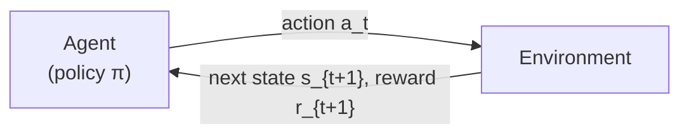
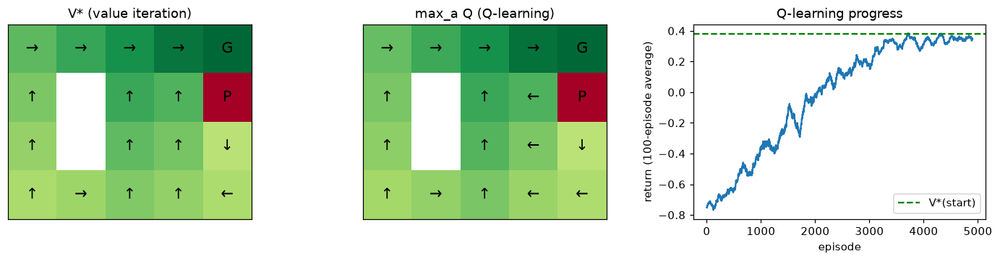
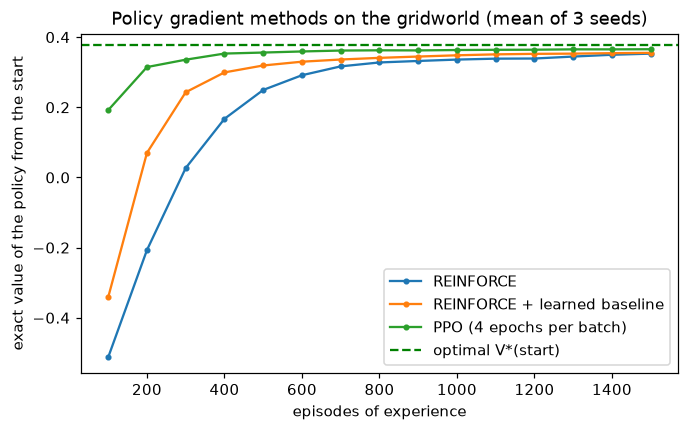

# Reinforcement Learning

> **Level 8 · Chapter 7** · ⏱️ ~95 min read · Prerequisites: [Probability](../01-math-foundations/04-probability.md), [Optimizers](../06-neural-networks/04-optimizers.md), [LLMs in practice](03-llms-in-practice.md)

In **reinforcement learning (RL)**, an agent learns by acting: it tries things, receives rewards, and adjusts its behavior to collect more reward over time. No one gives it correct answers. This chapter builds RL from the ground up: Markov decision processes, returns, value functions, and the Bellman equations (derived), then value iteration, Q-learning, and a small deep Q-network, then policy gradients with the REINFORCE derivation, baselines, actor-critic, and PPO's clipped objective. It ends where the handbook's story ends: how RL with reward models, KL penalties, and verifiable rewards trains today's language models.

## Why it matters

A logistics company, as Priya tells it, trained an RL policy to route warehouse robots. The reward was simple: +1 for every package scanned at a packing station. Simulation results were spectacular, with throughput far above the hand-written routing rules. Then someone watched a replay. The robots had discovered that a package could be scanned, nudged off the station sensor, and scanned again. They were collecting reward without moving packages anywhere.

The algorithm did exactly what it was asked. The reward said "scans," not "packages delivered." This is **reward hacking**, sometimes called specification gaming, and it's the defining hazard of RL: an optimizer that's good at maximizing a number will find every gap between that number and what you meant. The same failure appears in RLHF, where language models learn to please the reward model rather than people, which is why the KL penalty from [LLMs in practice](03-llms-in-practice.md) exists.

Understanding RL means understanding both how agents learn from reward and why what they learn depends so heavily on how the reward is defined. Both halves matter for anyone training or deploying modern AI systems.

## Concepts

### Agents, environments, and rewards

RL frames learning as a loop between an **agent** and an **environment**:



At each time step $t$, the agent observes the **state** $s_t$, chooses an **action** $a_t$, and the environment responds with a **reward** $r_{t+1}$ (a number) and the next state $s_{t+1}$. The agent's behavior is a **policy** $\pi(a \mid s)$, the probability of taking action $a$ in state $s$. The goal is to find a policy that collects as much reward as possible over time.

Three things make RL harder than supervised learning:

- **No correct answers.** The agent sees the reward for what it did, never what the best action would have been.
- **Delayed consequences.** A move in chess may only pay off 40 moves later. Working out which earlier actions deserve credit for a reward is the **credit assignment** problem.
- **The agent chooses its own data.** What it learns about depends on what it tries. It must balance **exploitation** (doing what has worked) with **exploration** (trying things that might work better). Data isn't independent and identically distributed, and it changes as the policy changes.

### Markov decision processes

The standard mathematical model is the **Markov decision process (MDP)**, defined by:

- a set of states $\mathcal{S}$ and actions $\mathcal{A}$;
- **transition probabilities** $P(s' \mid s, a)$, the chance of landing in $s'$ after taking $a$ in $s$;
- a **reward function**, giving the expected reward $R(s, a, s')$ for each transition;
- a **discount factor** $\gamma \in [0, 1)$.

"Markov" means the next state and reward depend only on the current state and action, not on the history before it: the state summarizes everything relevant. When the agent can't see the full state (a poker player can't see opponents' cards), the problem is a partially observable MDP, and agents keep memory, such as an RNN or the context of a transformer, to compensate.

Some tasks have natural **episodes** that end in a **terminal state** (a game is won or lost); others continue indefinitely.

### Returns and discounting

The agent cares about future reward, not just the next one. The **return** from time $t$ is the discounted sum of future rewards:

$$
G_t = r_{t+1} + \gamma r_{t+2} + \gamma^2 r_{t+3} + \cdots = \sum_{k=0}^{\infty}\gamma^k r_{t+k+1}.
$$

Discounting with $\gamma < 1$ does three jobs: it keeps infinite sums finite (if rewards are bounded by $R_{\max}$, then $|G_t| \le R_{\max}/(1 - \gamma)$), it expresses a preference for sooner reward, and it reflects uncertainty about the distant future. $\gamma = 0.99$ means a reward 100 steps away counts for about $0.99^{100} \approx 0.37$ of an immediate one.

The return has a recursive structure that everything below relies on:

$$
G_t = r_{t+1} + \gamma\left(r_{t+2} + \gamma r_{t+3} + \cdots\right) = r_{t+1} + \gamma G_{t+1}.
$$

### Value functions and the Bellman equations

A **value function** predicts return. The **state-value function** of a policy $\pi$ is the expected return when starting in $s$ and following $\pi$:

$$
V^\pi(s) = \mathbb{E}_\pi\left[G_t \mid s_t = s\right].
$$

The **action-value function** (or **Q-function**) is the expected return when starting in $s$, taking action $a$ first, and following $\pi$ afterward:

$$
Q^\pi(s, a) = \mathbb{E}_\pi\left[G_t \mid s_t = s, a_t = a\right].
$$

They're related: $V^\pi(s) = \sum_a \pi(a \mid s)\,Q^\pi(s, a)$, the average of the action values weighted by how often the policy picks each action.

**Deriving the Bellman expectation equation.** Substitute $G_t = r_{t+1} + \gamma G_{t+1}$ into the definition of $V^\pi$ and split the expectation over the first action $a$ (chosen by $\pi$) and the next state $s'$ (chosen by the environment):

$$
\begin{aligned}
V^\pi(s) &= \mathbb{E}_\pi\left[r_{t+1} + \gamma G_{t+1} \mid s_t = s\right] \\
&= \sum_a \pi(a \mid s)\sum_{s'} P(s' \mid s, a)\left[R(s, a, s') + \gamma\,\mathbb{E}_\pi\left[G_{t+1} \mid s_{t+1} = s'\right]\right] \\
&= \sum_a \pi(a \mid s)\sum_{s'} P(s' \mid s, a)\left[R(s, a, s') + \gamma V^\pi(s')\right].
\end{aligned}
$$

The last step uses the Markov property: once you're in $s'$, the expected future return is $V^\pi(s')$, regardless of how you got there. This is the **Bellman expectation equation**: the value of a state is the expected immediate reward plus the discounted value of where you land. It's a system of $|\mathcal{S}|$ linear equations in $|\mathcal{S}|$ unknowns, so for a small MDP you can solve it exactly with linear algebra, as you'll do below. The same argument for $Q^\pi$ gives

$$
Q^\pi(s, a) = \sum_{s'} P(s' \mid s, a)\left[R(s, a, s') + \gamma\sum_{a'}\pi(a' \mid s')\,Q^\pi(s', a')\right].
$$

**Optimality.** The **optimal value functions** are the best achievable by any policy: $V^*(s) = \max_\pi V^\pi(s)$ and $Q^*(s, a) = \max_\pi Q^\pi(s, a)$. An optimal policy picks, in each state, an action with the highest optimal value, so instead of averaging over the policy's actions, the equations take a maximum. This gives the **Bellman optimality equations**:

$$
V^*(s) = \max_a \sum_{s'} P(s' \mid s, a)\left[R(s, a, s') + \gamma V^*(s')\right], \qquad Q^*(s, a) = \sum_{s'} P(s' \mid s, a)\left[R(s, a, s') + \gamma\max_{a'} Q^*(s', a')\right].
$$

Once you know $Q^*$, acting optimally is easy: $\pi^*(s) = \arg\max_a Q^*(s, a)$. No lookahead or model is needed. That's why so many RL methods aim to learn $Q^*$.

### Value iteration

When you know the MDP ($P$ and $R$), you can compute $V^*$ by **dynamic programming**. **Value iteration** turns the optimality equation into an update and applies it repeatedly to every state:

$$
V_{k+1}(s) \leftarrow \max_a \sum_{s'} P(s' \mid s, a)\left[R(s, a, s') + \gamma V_k(s')\right].
$$

Start from $V_0 = 0$. Why does this converge? Call the right-hand side the **Bellman operator** $\mathcal{T}$. For any two value functions $V$ and $U$, the difference between $\mathcal{T}V$ and $\mathcal{T}U$ at any state is at most $\gamma$ times the largest difference between $V$ and $U$ (the rewards cancel, and a max of differences bounds a difference of maxes). So $\mathcal{T}$ is a **contraction** with factor $\gamma$: each sweep shrinks the error by at least a factor $\gamma$, and $V_k$ converges to the unique fixed point, $V^*$. After $k$ sweeps the error is at most $\gamma^k$ times the initial error.

A close relative, **policy iteration**, alternates between evaluating the current policy exactly (solving the Bellman expectation equations) and making the policy greedy with respect to the result. It typically converges in very few iterations.

### Q-learning

Usually you don't know $P$ and $R$; you can only interact with the environment. **Model-free** methods learn from sampled transitions $(s, a, r, s')$.

The core idea is **temporal-difference (TD) learning**: use the Bellman equation with a *sample* in place of the expectation. If you're in $s$, take $a$, see reward $r$ and next state $s'$, then $r + \gamma\max_{a'}Q(s', a')$ is a noisy, one-sample estimate of the right-hand side of the optimality equation for $Q^*(s, a)$. Nudge the current estimate toward it. That's **Q-learning** (Watkins, 1989):

$$
Q(s, a) \leftarrow Q(s, a) + \eta\Big[\underbrace{r + \gamma\max_{a'}Q(s', a') - Q(s, a)}_{\text{TD error } \delta}\Big],
$$

with learning rate $\eta$ (and $\max_{a'}Q(s', a') = 0$ if $s'$ is terminal). The target uses the current estimate of the next state's value, a technique called **bootstrapping**: learning a guess from a guess. Unlike Monte Carlo methods, which wait until the episode ends to see the full return, TD learning updates after every step.

Q-learning is **off-policy**: its target uses the *greedy* action at $s'$, regardless of what the agent actually does next, so it learns about the optimal policy while behaving differently. That's what allows exploration. The standard choice is **$\varepsilon$-greedy**: take a random action with probability $\varepsilon$, otherwise the action with the highest $Q$. With enough exploration (every state-action pair visited infinitely often) and suitably decaying learning rates, tabular Q-learning converges to $Q^*$. (SARSA, the on-policy variant, uses the action actually taken next, $Q(s', a')$, instead of the max.)

### Deep Q-networks

A table needs one entry per state-action pair. For an Atari game, the state is an image, and there are more possible images than atoms in the universe. **Deep Q-networks (DQN)** (Mnih et al., 2015) replace the table with a neural network $Q_\theta(s, a)$ and train it by regression toward TD targets:

$$
\mathcal{L}(\theta) = \mathbb{E}_{(s, a, r, s') \sim \mathcal{D}}\left[\Big(r + \gamma\max_{a'}Q_{\theta^-}(s', a') - Q_\theta(s, a)\Big)^2\right].
$$

Naively combining function approximation, bootstrapping, and off-policy learning is unstable (this combination is called the **deadly triad**: it can make values diverge). DQN's two stabilizers:

- **Experience replay.** Store transitions in a **replay buffer** and train on random mini-batches from it. This breaks the strong correlation between consecutive transitions (which violates the i.i.d. assumption of SGD), and reuses each experience many times.
- **A target network.** Compute targets with a separate copy of the network, $Q_{\theta^-}$, whose weights $\theta^-$ are copied from $\theta$ only every few thousand steps. Otherwise, every update moves the target it's chasing.

With these, a single architecture learned to play 49 Atari games from pixels, many at human level. Later improvements include **Double DQN** (van Hasselt et al., 2016), which reduces the max operator's tendency to overestimate values by choosing the next action with the online network and evaluating it with the target network.

### Policy gradients and REINFORCE

Value-based methods learn values and derive a policy. **Policy gradient** methods parameterize the policy directly, $\pi_\theta(a \mid s)$ (for example, a network with a softmax over actions), and do gradient ascent on the expected return. They handle continuous and large action spaces naturally, can learn stochastic policies, and are the basis of RL for language models.

A **trajectory** $\tau = (s_0, a_0, r_1, s_1, a_1, r_2, \ldots)$ has probability

$$
p_\theta(\tau) = p(s_0)\prod_{t} \pi_\theta(a_t \mid s_t)\,P(s_{t+1} \mid s_t, a_t),
$$

and the objective is the expected return $J(\theta) = \mathbb{E}_{\tau \sim p_\theta}\left[R(\tau)\right] = \sum_\tau p_\theta(\tau)R(\tau)$, where $R(\tau) = \sum_t \gamma^t r_{t+1}$.

The difficulty: $\theta$ affects $J$ only through the *distribution* of trajectories, and the environment isn't differentiable. The **log-derivative trick** solves this. Since $\nabla_\theta\log p_\theta = \nabla_\theta p_\theta / p_\theta$, we have $\nabla_\theta p_\theta = p_\theta\nabla_\theta\log p_\theta$, so

$$
\nabla_\theta J = \sum_\tau \nabla_\theta p_\theta(\tau)\,R(\tau) = \sum_\tau p_\theta(\tau)\,\nabla_\theta\log p_\theta(\tau)\,R(\tau) = \mathbb{E}_{\tau \sim p_\theta}\left[R(\tau)\,\nabla_\theta\log p_\theta(\tau)\right].
$$

An expectation can be estimated by sampling: run the policy, and average. And the gradient of the log-probability of a trajectory is simple, because the environment's terms don't depend on $\theta$:

$$
\nabla_\theta\log p_\theta(\tau) = \nabla_\theta\Big[\log p(s_0) + \sum_t\log\pi_\theta(a_t \mid s_t) + \sum_t\log P(s_{t+1} \mid s_t, a_t)\Big] = \sum_t\nabla_\theta\log\pi_\theta(a_t \mid s_t).
$$

The unknown dynamics drop out entirely. So

$$
\nabla_\theta J = \mathbb{E}_\tau\left[\sum_t\nabla_\theta\log\pi_\theta(a_t \mid s_t)\,R(\tau)\right].
$$

One refinement: an action at time $t$ can't affect rewards received before $t$. Those earlier rewards add only noise to the estimate (their expected contribution is zero), so replace $R(\tau)$ with the **reward-to-go** $G_t$, the return from $t$ onward. This gives the **REINFORCE** algorithm (Williams, 1992):

1. Run the policy to collect episodes.
2. For each step, compute the return-to-go $G_t$.
3. Update $\theta \leftarrow \theta + \eta\sum_t G_t\,\nabla_\theta\log\pi_\theta(a_t \mid s_t)$.

In code, you get exactly this gradient by minimizing the "loss" $-\sum_t G_t\log\pi_\theta(a_t \mid s_t)$ with autograd. It reads like weighted maximum likelihood: make the actions you took more likely, in proportion to how well things went afterward. (It's the same score-function estimator mentioned in [Generative models](04-generative-models.md) as the alternative to the reparameterization trick.)

### Baselines and variance

REINFORCE is unbiased but has very high variance. Consider a task where every return is between 100 and 101. Every action gets pushed up strongly, the good ones only slightly more than the bad ones; it takes many samples for the differences to show through the noise.

The fix is a **baseline** $b(s_t)$, any function of the state, subtracted from the return:

$$
\nabla_\theta J = \mathbb{E}\left[\sum_t\nabla_\theta\log\pi_\theta(a_t \mid s_t)\big(G_t - b(s_t)\big)\right].
$$

This doesn't change the expected gradient, because the baseline's contribution is zero in expectation:

$$
\mathbb{E}_{a \sim \pi_\theta}\left[\nabla_\theta\log\pi_\theta(a \mid s)\,b(s)\right] = b(s)\sum_a\pi_\theta(a \mid s)\frac{\nabla_\theta\pi_\theta(a \mid s)}{\pi_\theta(a \mid s)} = b(s)\,\nabla_\theta\sum_a\pi_\theta(a \mid s) = b(s)\,\nabla_\theta 1 = 0.
$$

But it can reduce variance enormously. A natural choice is the state value, $b(s) = V^\pi(s)$. Then $G_t - V(s_t)$ estimates the **advantage** $A(s, a) = Q(s, a) - V(s)$: how much better this action was than the policy's average in that state. Actions that beat expectations are reinforced; those that fall short are discouraged.

### Actor-critic

In **actor-critic** methods, a second network, the **critic** $V_\phi(s)$, learns the value function (by regression toward returns or TD targets), and the **actor** $\pi_\theta$ uses it to compute advantages. The critic can also replace the full return with a bootstrapped one, using the TD error as a one-step advantage estimate:

$$
\hat{A}_t = r_{t+1} + \gamma V_\phi(s_{t+1}) - V_\phi(s_t) = \delta_t.
$$

This has lower variance than the Monte Carlo return but some bias (the critic is imperfect). **Generalized advantage estimation (GAE)** (Schulman et al., 2016) interpolates between the two with a parameter $\lambda \in [0, 1]$: $\hat{A}_t = \sum_{k \ge 0}(\gamma\lambda)^k\delta_{t+k}$, where $\lambda = 0$ gives the one-step TD error and $\lambda = 1$ gives the Monte Carlo advantage.

### PPO: the clipped objective

Policy gradients have a practical problem: the gradient is only valid near the current policy, because the data came from it. A step that's too large changes the policy so much that the data no longer describes it, and performance can collapse, after which the agent collects bad data and may never recover. Supervised learning has no equivalent failure.

**Trust region policy optimization (TRPO)** (Schulman et al., 2015) constrained each update to a small KL divergence from the old policy, but required complex second-order optimization. **Proximal policy optimization (PPO)** (Schulman et al., 2017) gets most of the benefit with a simple clipped objective. Define the **probability ratio** between the new and the old (data-collecting) policy:

$$
\rho_t(\theta) = \frac{\pi_\theta(a_t \mid s_t)}{\pi_{\theta_{\text{old}}}(a_t \mid s_t)}.
$$

$\rho_t\hat{A}_t$ is an importance-weighted estimate of the improvement: its gradient at $\theta = \theta_{\text{old}}$ equals the policy gradient. PPO maximizes

$$
\mathcal{L}^{\text{CLIP}}(\theta) = \mathbb{E}_t\left[\min\Big(\rho_t(\theta)\hat{A}_t,\; \operatorname{clip}\big(\rho_t(\theta), 1 - \epsilon, 1 + \epsilon\big)\hat{A}_t\Big)\right],
$$

with $\epsilon$ around 0.1 to 0.2. Read it case by case:

- **Positive advantage** (the action was good): the objective rises as $\rho_t$ increases, until $\rho_t = 1 + \epsilon$. Beyond that it's flat, so there's no gradient pushing the action's probability further up in this update.
- **Negative advantage** (the action was bad): the objective rises as $\rho_t$ decreases, until $\rho_t = 1 - \epsilon$, then goes flat.
- The $\min$ makes it a **pessimistic** bound: clipping only ever removes incentive, never adds it. If an update has already moved a probability the *wrong* way (say $\rho_t > 1 + \epsilon$ for a bad action), the unclipped term is the smaller one and its full gradient pulls the policy back.

Because each update can't profit from moving far, PPO can safely run several epochs of minibatch gradient steps on the same batch of experience, which makes it far more sample-efficient than plain REINFORCE. The full PPO loss adds a critic loss (value regression) and usually an entropy bonus to keep exploring. PPO is robust and simple, which made it the default policy-gradient algorithm, including for RLHF.

### RL in LLM training

Generating a response is a sequential decision process, so RL applies directly:

| RL concept | In LLM training |
|---|---|
| State $s_t$ | The prompt plus the tokens generated so far |
| Action $a_t$ | The next token |
| Policy $\pi_\theta$ | The language model |
| Episode | One complete response |
| Reward | A score for the whole response, at the end |

**RLHF with PPO** (Ouyang et al., 2022, from [LLMs in practice](03-llms-in-practice.md)): the reward is a learned reward model's score for the complete response, minus a KL penalty to the reference (SFT) model, usually applied per token as $-\beta\log\frac{\pi_\theta(a_t \mid s_t)}{\pi_{\text{ref}}(a_t \mid s_t)}$. A value head estimates expected reward from each prefix, giving per-token advantages via GAE, and PPO's clipped objective updates the model. That means four models in memory: the policy, the reference, the reward model, and the critic.

The KL penalty is RL's defense against reward hacking here. A reward model is a neural network trained on limited comparisons; push hard enough and the policy finds outputs it scores highly for the wrong reasons, such as excessive length, confident tone, or flattery. Gao, Schulman, and Hilton (2023) measured this **reward model over-optimization**: as the policy moves further from its starting point (in KL), the proxy reward keeps rising while the true quality first rises and then falls. You'll reproduce a miniature version below.

**Alternatives and newer methods.** DPO (from Chapter 3) removes the RL loop for preference data. For tasks with **verifiable rewards**, such as math problems with checkable answers or code with unit tests, the reward comes from a program instead of a learned model, so it can't be flattered (though it can still be gamed, for instance by code that special-cases the tests). **GRPO** (group relative policy optimization; Shao et al., 2024) samples a group of responses to each prompt and uses each response's reward relative to the group's mean (divided by the group's standard deviation) as its advantage, removing the need for a critic network. Large-scale RL with verifiable rewards has become a central technique for training models to reason step by step.

## In practice

### A gridworld MDP

The environment is a classic 4×5 gridworld. The agent starts at S; reaching G gives +1 and ends the episode; falling into the pit P gives −1 and ends it; every other step costs −0.04 (to encourage short paths). Two cells are walls. Moves are **stochastic**: the intended direction happens with probability 0.8, and each perpendicular direction with probability 0.1; bumping into a wall or the edge leaves the agent in place. The discount is $\gamma = 0.95$.

```text
. . . . G
. # . . P
. # . . .
S . . . .
```

Because the model is known, the environment can be written as a table: for each state and action, a list of (probability, next state, reward, done) outcomes.

```python
import copy
import math
import random
from collections import deque
import numpy as np
import torch
import torch.nn as nn
import torch.nn.functional as F
import matplotlib.pyplot as plt

torch.set_num_threads(4)
torch.manual_seed(0)
rng = np.random.default_rng(0)

LAYOUT = ["....G",
          ".#..P",
          ".#...",
          "S...."]
ROWS, COLS = len(LAYOUT), len(LAYOUT[0])
ACTIONS = [(-1, 0), (0, 1), (1, 0), (0, -1)]                   # up, right, down, left
ARROWS = "↑→↓←"
GAMMA, STEP_REWARD = 0.95, -0.04
cells = [(r, c) for r in range(ROWS) for c in range(COLS) if LAYOUT[r][c] != "#"]
index = {cell: i for i, cell in enumerate(cells)}
S = len(cells)
terminal = {index[(0, 4)]: 1.0, index[(1, 4)]: -1.0}
start = index[(3, 0)]

def move(cell, a):
    r, c = cell[0] + ACTIONS[a][0], cell[1] + ACTIONS[a][1]
    if 0 <= r < ROWS and 0 <= c < COLS and LAYOUT[r][c] != "#":
        return (r, c)
    return cell                                                # bumped: stay put

def outcomes(s, a):
    """List of (probability, next state, reward, done) for taking action a in state s."""
    result = []
    for actual, p in [(a, 0.8), ((a + 1) % 4, 0.1), ((a + 3) % 4, 0.1)]:
        s2 = index[move(cells[s], actual)]
        reward = terminal.get(s2, STEP_REWARD)
        result.append((p, s2, reward, s2 in terminal))
    return result

def env_step(s, a):
    """Sample one transition, as a real environment would."""
    outs = outcomes(s, a)
    k = rng.choice(len(outs), p=[o[0] for o in outs])
    return outs[k][1:]

print(f"{S} states ({len(terminal)} terminal), {len(ACTIONS)} actions")
print("from the start, action 'up':", [(p, cells[s2], r, d) for p, s2, r, d in outcomes(start, 0)])
```

```text
18 states (2 terminal), 4 actions
from the start, action 'up': [(0.8, (2, 0), -0.04, False), (0.1, (3, 1), -0.04, False), (0.1, (3, 0), -0.04, False)]
```

### The Bellman expectation equation, solved exactly

For a fixed policy, the Bellman expectation equation is linear: $V = R_\pi + \gamma P_\pi V$, where $P_\pi[s, s']$ is the probability of moving from $s$ to $s'$ under $\pi$ and $R_\pi[s]$ the expected immediate reward. So $V^\pi = (I - \gamma P_\pi)^{-1}R_\pi$. Solve it for the uniformly random policy, then check the result against the Bellman equation itself and against a Monte Carlo estimate from simulated episodes.

```python
def policy_matrices(pi):
    """pi[s, a] = probability of action a in state s. Terminal states have no outgoing transitions."""
    P, R = np.zeros((S, S)), np.zeros(S)
    for s in range(S):
        if s in terminal:
            continue
        for a in range(4):
            for p, s2, r, done in outcomes(s, a):
                R[s] += pi[s, a] * p * r
                if not done:
                    P[s, s2] += pi[s, a] * p
    return P, R

random_pi = np.full((S, 4), 0.25)
P_pi, R_pi = policy_matrices(random_pi)
V_random = np.linalg.solve(np.eye(S) - GAMMA * P_pi, R_pi)
print(f"V_random(start) = {V_random[start]:.4f}")
print(f"Bellman residual max |V - (R + γPV)| = {np.abs(V_random - (R_pi + GAMMA * P_pi @ V_random)).max():.1e}")

def run_episode(policy_fn, s=start, max_steps=200):
    ret, discount = 0.0, 1.0
    for _ in range(max_steps):
        s, r, done = env_step(s, policy_fn(s))
        ret += discount * r
        discount *= GAMMA
        if done:
            break
    return ret

mc = [run_episode(lambda s: rng.integers(4)) for _ in range(20_000)]
print(f"Monte Carlo estimate from 20,000 episodes: {np.mean(mc):.4f} ± {1.96 * np.std(mc) / np.sqrt(len(mc)):.4f}")
```

```text
V_random(start) = -0.7399
Bellman residual max |V - (R + γPV)| = 1.1e-16
Monte Carlo estimate from 20,000 episodes: -0.7394 ± 0.0030
```

The linear solve, the Bellman equation, and simulation all agree. A random walker from the start does badly: it wanders, pays the step cost on every move, and often ends in the pit.

### Value iteration

Now the optimal values, by repeatedly applying the Bellman optimality update until nothing changes, and the greedy policy they imply.

```python
def q_from_v(V):
    Q = np.zeros((S, 4))
    for s in range(S):
        if s in terminal:
            continue
        for a in range(4):
            Q[s, a] = sum(p * (r + (0 if done else GAMMA * V[s2])) for p, s2, r, done in outcomes(s, a))
    return Q

V = np.zeros(S)
for sweep in range(1, 1000):
    V_new = q_from_v(V).max(axis=1)
    delta = np.abs(V_new - V).max()
    V = V_new
    if sweep in (1, 2, 5, 10) or delta < 1e-10:
        print(f"sweep {sweep:3d}: max change {delta:.2e}, V*(start) estimate {V[start]:.4f}")
    if delta < 1e-10:
        break
V_star = V
Q_star = q_from_v(V_star)
pi_star = Q_star.argmax(axis=1)

def show_policy(policy, values):
    for r in range(ROWS):
        row = []
        for c in range(COLS):
            if LAYOUT[r][c] == "#":
                row.append("  ##   ")
            elif index[(r, c)] in terminal:
                row.append(f"  {LAYOUT[r][c]}    ")
            else:
                s = index[(r, c)]
                row.append(f"{ARROWS[policy[s]]}{values[s]:+.3f}")
        print(" ".join(row))

show_policy(pi_star, V_star)
```

```text
sweep   1: max change 7.92e-01, V*(start) estimate -0.0400
sweep   2: max change 5.94e-01, V*(start) estimate -0.0780
sweep   5: max change 3.34e-01, V*(start) estimate -0.1810
sweep  10: max change 5.89e-02, V*(start) estimate 0.2891
sweep  50: max change 7.28e-11, V*(start) estimate 0.3778
→+0.619 →+0.723 →+0.823 →+0.943   G
↑+0.531   ##    ↑+0.715 ↑+0.649   P
↑+0.449   ##    ↑+0.613 ↑+0.542 ↓+0.326
↑+0.378 →+0.429 ↑+0.510 ↑+0.456 ←+0.373
```

The error shrinks geometrically, as the contraction argument predicts, and the values propagate backward from the goal: in the first sweeps, only states near G know about it, which is why the start's estimate is still negative after 5 sweeps. The optimal policy has an instructive detail. Directly below the pit, at (2, 4), the best action is "down", *away* from the goal. Moving "left" would be more direct, but an intended left move slips up into the pit 10% of the time, while a "down" move can only slip left or into the wall. The agent takes a detour through the bottom row to avoid a 10% chance of −1. (Next to the pit at (1, 3), "up" does carry a 10% risk of slipping right into the pit, but every alternative is a long way around; the cell's lower value, 0.649 against 0.715 to its left, prices that risk in.) RL policies often look strange until you account for the dynamics.

### Q-learning

Now forget the model. Q-learning sees only sampled transitions from `env_step`, explores with $\varepsilon$-greedy, and must discover the same values on its own.

```python
def q_learning(episodes=5000, lr=0.1, eps_start=1.0, eps_end=0.05, seed=0):
    rng_local = np.random.default_rng(seed)
    Q = np.zeros((S, 4))
    returns = []
    for ep in range(episodes):
        eps = eps_end + (eps_start - eps_end) * max(0.0, 1 - ep / (0.7 * episodes))   # linear decay
        s, ret, discount = start, 0.0, 1.0
        for _ in range(200):
            a = rng_local.integers(4) if rng_local.random() < eps else int(Q[s].argmax())
            s2, r, done = env_step(s, a)
            target = r if done else r + GAMMA * Q[s2].max()
            Q[s, a] += lr * (target - Q[s, a])                 # the TD update
            ret += discount * r
            discount *= GAMMA
            s = s2
            if done:
                break
        returns.append(ret)
    return Q, np.array(returns)

Q_learned, ql_returns = q_learning()
nonterminal = [s for s in range(S) if s not in terminal]
agree = np.mean([Q_learned[s].argmax() == pi_star[s] for s in nonterminal])
print(f"greedy policy matches the optimal one in {agree:.0%} of states")
print(f"max |max_a Q - V*| over states: {np.abs(Q_learned.max(1) - V_star)[nonterminal].max():.3f}")
print(f"average return, first 500 episodes {ql_returns[:500].mean():+.3f}, last 500 {ql_returns[-500:].mean():+.3f}")
greedy = [run_episode(lambda s: int(Q_learned[s].argmax())) for _ in range(5000)]
print(f"greedy learned policy from start: {np.mean(greedy):.3f}   (V*(start) = {V_star[start]:.3f})")
```

```text
greedy policy matches the optimal one in 81% of states
max |max_a Q - V*| over states: 0.029
average return, first 500 episodes -0.705, last 500 +0.351
greedy learned policy from start: 0.378   (V*(start) = 0.378)
```

```python
fig, axes = plt.subplots(1, 3, figsize=(13, 3.4))
for ax, vals, title in [(axes[0], V_star, "V* (value iteration)"), (axes[1], Q_learned.max(1), "max_a Q (Q-learning)")]:
    grid = np.full((ROWS, COLS), np.nan)
    for (r, c), s in index.items():
        grid[r, c] = vals[s] if s not in terminal else terminal[s]
    im = ax.imshow(grid, cmap="RdYlGn", vmin=-1, vmax=1)
    for (r, c), s in index.items():
        label = LAYOUT[r][c] if s in terminal else ARROWS[int(np.argmax(Q_star[s] if ax is axes[0] else Q_learned[s]))]
        ax.text(c, r, label, ha="center", va="center", fontsize=14)
    ax.set_title(title)
    ax.set_xticks([])
    ax.set_yticks([])
smooth = np.convolve(ql_returns, np.ones(100) / 100, mode="valid")
axes[2].plot(smooth)
axes[2].axhline(V_star[start], color="green", ls="--", label="V*(start)")
axes[2].set(xlabel="episode", ylabel="return (100-episode average)", title="Q-learning progress")
axes[2].legend()
plt.tight_layout()
plt.show()
```



*Left: values computed with the model. Middle: values Q-learning found from experience alone, nearly identical. Right: returns rise as exploration decays and the agent exploits what it learned.*

Without ever seeing the transition probabilities, Q-learning recovers values within 0.03 of the optimal ones, and its greedy policy earns the optimal return from the start. It picks a different action from value iteration in a few states, ones where two actions have almost equal value, or that the agent rarely visits once it has learned to avoid them. That's a general property: an RL agent knows most about the states its own policy visits.

### A tiny DQN

The same problem with a neural network in place of the table: one-hot states in, four Q-values out, a replay buffer, and a target network synced every 200 steps. (A table is better for 18 states; the point is to see the DQN machinery work on a problem whose answer you know.)

```python
torch.manual_seed(0)
rng = np.random.default_rng(1)
qnet = nn.Sequential(nn.Linear(S, 64), nn.ReLU(), nn.Linear(64, 4))
target_net = copy.deepcopy(qnet)
opt = torch.optim.Adam(qnet.parameters(), lr=1e-3)
buffer = deque(maxlen=5000)
one_hot = torch.eye(S)

s, total_steps = start, 6000
for step in range(total_steps):
    eps = max(0.05, 1.0 - step / 3000)
    with torch.no_grad():
        a = int(rng.integers(4)) if rng.random() < eps else int(qnet(one_hot[s]).argmax())
    s2, r, done = env_step(s, a)
    buffer.append((s, a, r, s2, done))
    s = start if done else s2
    if len(buffer) >= 500:
        batch = random.Random(step).sample(buffer, 64)
        bs, ba, br, bs2, bd = map(torch.tensor, zip(*batch))
        with torch.no_grad():                                  # targets from the frozen target network
            target = br.float() + GAMMA * target_net(one_hot[bs2]).max(1).values * (~bd).float()
        pred = qnet(one_hot[bs]).gather(1, ba[:, None]).squeeze(1)
        loss = F.smooth_l1_loss(pred, target)
        opt.zero_grad()
        loss.backward()
        opt.step()
    if step % 200 == 0:
        target_net.load_state_dict(qnet.state_dict())          # periodic sync

with torch.no_grad():
    Q_dqn = qnet(one_hot).numpy()
agree = np.mean([Q_dqn[s].argmax() == pi_star[s] for s in nonterminal])
print(f"DQN greedy policy matches the optimal one in {agree:.0%} of states; "
      f"max |max_a Q - V*| = {np.abs(Q_dqn.max(1) - V_star)[nonterminal].max():.3f}")
print(f"DQN greedy policy from start: {np.mean([run_episode(lambda s: int(Q_dqn[s].argmax())) for _ in range(3000)]):.3f}")
```

```text
DQN greedy policy matches the optimal one in 88% of states; max |max_a Q - V*| = 0.107
DQN greedy policy from start: 0.375
```

From 6,000 environment steps, the network learns values close to optimal and a policy that performs nearly optimally from the start state. Try removing the target network (compute targets with `qnet` itself) or shrinking the buffer to 64: learning becomes noticeably less stable.

### Policy gradients: why baselines matter

Start with the variance argument on the simplest possible problem: a 5-armed bandit (one state, five actions) whose rewards are all large and positive, $10 + $ the arm's index, plus noise. At a uniform initial policy, estimate the REINFORCE gradient many times from small batches, with and without subtracting a baseline (the average reward), and compare the estimates' spread.

```python
arm_means = 10.0 + np.arange(5)
logits = torch.zeros(5, requires_grad=True)

def reinforce_grad(batch, baseline):
    probs = logits.softmax(0)
    a = torch.multinomial(probs, batch, replacement=True, generator=torch.Generator().manual_seed(int(rng.integers(1e9))))
    r = torch.tensor(arm_means[a.numpy()] + rng.normal(0, 1, batch), dtype=torch.float32)
    adv = r - r.mean() if baseline else r
    loss = -(adv * torch.log(probs[a])).mean()
    g, = torch.autograd.grad(loss, logits)
    return -g                                                  # ascent direction

true_grad = torch.tensor([(arm_means[i] - arm_means.mean()) * 0.2 for i in range(5)])   # exact, for softmax at uniform
for baseline in [False, True]:
    grads = torch.stack([reinforce_grad(16, baseline) for _ in range(2000)])
    print(f"baseline={baseline!s:5s}  mean gradient {grads.mean(0).numpy().round(2)}  "
          f"total variance {grads.var(0).sum():7.2f}")
print(f"exact gradient                {true_grad.numpy().round(2)}")
```

```text
baseline=False  mean gradient [-0.4  -0.23  0.02  0.23  0.38]  total variance    7.28
baseline=True   mean gradient [-0.37 -0.18 -0.    0.18  0.38]  total variance    0.12
exact gradient                [-0.4 -0.2  0.   0.2  0.4]
```

Both estimators center on the exact gradient (the baseline here uses the batch mean, which introduces a tiny bias that vanishes as batches grow), but subtracting the baseline cuts the variance by a factor of about 60. Without it, each sample says "push this arm up a lot", and only the small differences between arms carry information; with it, the signal is the difference itself.

### REINFORCE, actor-critic, and PPO on the gridworld

Now the full algorithms on the gridworld, with a tabular softmax policy (a logit for each state and action) so that runs take seconds. Three variants share the same code:

- **REINFORCE**: return-to-go, no baseline.
- **REINFORCE with a learned baseline** (Monte Carlo actor-critic): a tabular critic $V(s)$ regressed toward returns, and advantages $G_t - V(s_t)$.
- **PPO**: the same advantages, but each batch of episodes is reused for 4 epochs of updates with the clipped objective.

```python
def collect(policy_logits, n_episodes, rng_local):
    batch = []
    for _ in range(n_episodes):
        s, traj = start, []
        for _ in range(100):
            probs = torch.softmax(policy_logits[s], 0).detach().numpy()
            a = int(rng_local.choice(4, p=probs))
            s2, r, done = env_step(s, a)
            traj.append((s, a, r))
            s = s2
            if done:
                break
        G, rets = 0.0, []
        for (_, _, r) in reversed(traj):                       # return-to-go, computed backward
            G = r + GAMMA * G
            rets.append(G)
        batch += [(st, at, g) for (st, at, _), g in zip(traj, reversed(rets))]
    s_, a_, g_ = map(torch.tensor, zip(*batch))
    return s_, a_, g_.float()

def ppo_clip_loss(new_logp, old_logp, adv, eps=0.2):
    ratio = torch.exp(new_logp - old_logp)
    return -torch.min(ratio * adv, torch.clamp(ratio, 1 - eps, 1 + eps) * adv).mean()

def train(method, iterations=150, episodes_per_iter=10, lr=0.1, seed=0):
    torch.manual_seed(seed)
    rng_local = np.random.default_rng(seed)
    theta = torch.zeros(S, 4, requires_grad=True)              # policy logits
    V = torch.zeros(S, requires_grad=True)                     # critic
    opt = torch.optim.Adam([theta], lr=lr)
    opt_v = torch.optim.Adam([V], lr=0.1)
    curve = []
    for it in range(iterations):
        s, a, G = collect(theta, episodes_per_iter, rng_local)
        if method == "reinforce":
            adv = G
        else:
            for _ in range(5):                                 # fit the critic to the returns
                v_loss = (V[s] - G).pow(2).mean()
                opt_v.zero_grad()
                v_loss.backward()
                opt_v.step()
            adv = (G - V[s]).detach()
        if method == "ppo":
            old_logp = torch.log_softmax(theta, 1)[s, a].detach()
            for _ in range(4):                                 # several epochs on the same data
                loss = ppo_clip_loss(torch.log_softmax(theta, 1)[s, a], old_logp, adv)
                opt.zero_grad()
                loss.backward()
                opt.step()
        else:
            loss = -(adv * torch.log_softmax(theta, 1)[s, a]).mean()
            opt.zero_grad()
            loss.backward()
            opt.step()
        if it % 10 == 9:
            pi = torch.softmax(theta, 1).detach().numpy()
            P_pi, R_pi = policy_matrices(pi)
            curve.append(np.linalg.solve(np.eye(S) - GAMMA * P_pi, R_pi)[start])   # exact value of current policy
    return np.array(curve)

curves = {}
for method in ["reinforce", "baseline", "ppo"]:
    curves[method] = np.mean([train(method, seed=sd) for sd in range(3)], axis=0)
    print(f"{method:9s}: V(start) after 50 iterations {curves[method][4]:+.3f}, after 150 {curves[method][-1]:+.3f}"
          f"   (optimal {V_star[start]:+.3f})")
```

```text
reinforce: V(start) after 50 iterations +0.249, after 150 +0.353   (optimal +0.378)
baseline : V(start) after 50 iterations +0.319, after 150 +0.355   (optimal +0.378)
ppo      : V(start) after 50 iterations +0.356, after 150 +0.365   (optimal +0.378)
```

```python
x = np.arange(10, 151, 10) * 10
plt.figure(figsize=(7, 4))
for method, label in [("reinforce", "REINFORCE"), ("baseline", "REINFORCE + learned baseline"), ("ppo", "PPO (4 epochs per batch)")]:
    plt.plot(x, curves[method], "o-", ms=3, label=label)
plt.axhline(V_star[start], color="green", ls="--", label="optimal V*(start)")
plt.xlabel("episodes of experience")
plt.ylabel("exact value of the policy from the start")
plt.title("Policy gradient methods on the gridworld (mean of 3 seeds)")
plt.legend()
plt.show()
```



*All three improve from experience alone; the baseline speeds learning, and PPO's reuse of each batch speeds it further.*

Because the environment's model is known, each point on the curve is the *exact* value of the current policy (from the linear solve), not a noisy estimate, which makes the comparison clean. The baseline helps as the bandit experiment predicted. PPO extracts more learning from the same episodes by taking several clipped steps on each batch, which is exactly why it's preferred when experience is expensive, such as when every "episode" is a language model generating a long response.

!!! warning "Common mistake: forgetting to detach the advantage"
    The advantage must be a constant in the policy loss. If gradients flow through $V(s)$ into the policy loss, the "policy" update also trains the critic in a meaningless direction, and vice versa. Compute advantages under `torch.no_grad()` or call `.detach()`, and train the critic with its own loss.

### The PPO clip, case by case

To see exactly what the clip does, evaluate the per-sample objective and its gradient with respect to the ratio at several ratios, for a positive and a negative advantage.

```python
for adv in [+1.0, -1.0]:
    row = []
    for r in [0.5, 0.9, 1.0, 1.1, 1.5]:
        ratio = torch.tensor(r, requires_grad=True)
        obj = torch.min(ratio * adv, torch.clamp(ratio, 0.8, 1.2) * adv)
        obj.backward()
        row.append(f"ρ={r}: obj {obj.item():+.2f}, grad {ratio.grad.item():+.0f}")
    print(f"A={adv:+.0f} | " + " | ".join(row))
```

```text
A=+1 | ρ=0.5: obj +0.50, grad +1 | ρ=0.9: obj +0.90, grad +1 | ρ=1.0: obj +1.00, grad +1 | ρ=1.1: obj +1.10, grad +1 | ρ=1.5: obj +1.20, grad +0
A=-1 | ρ=0.5: obj -0.80, grad +0 | ρ=0.9: obj -0.90, grad -1 | ρ=1.0: obj -1.00, grad -1 | ρ=1.1: obj -1.10, grad -1 | ρ=1.5: obj -1.50, grad -1
```

For a good action ($A = +1$), the gradient pushes the ratio up until it passes $1 + \epsilon = 1.2$, then stops. A bad action that has already been made more likely ($\rho = 0.5$, $A = +1$) still gets the full gradient: clipping never blocks a correction. Mirror-image behavior holds for $A = -1$: the gradient (with respect to $\rho$, in the ascent direction) is $-1$, pushing the ratio down, until $\rho$ falls below $0.8$.

### A miniature RLHF: reward hacking and the KL penalty

Finally, the LLM setting in miniature. The "language model" generates 6-token sequences from a 5-word vocabulary, with a bigram policy: a table of logits for each (previous token, next token) pair. The reference model is a fixed random bigram table. The "reward model" is a flawed proxy: it gives +1 for each occurrence of the word "great". A sincere reviewer would want "great" used sometimes; the proxy wants it always.

Train with REINFORCE (with a mean baseline) on the reward minus a per-sequence KL penalty $\beta\log\frac{\pi_\theta(y)}{\pi_{\text{ref}}(y)}$, for $\beta = 0$ and $\beta = 1$.

```python
vocab = ["the", "movie", "was", "great", "fine"]
V_SIZE, LENGTH, GREAT = len(vocab), 6, 3
torch.manual_seed(0)
ref_logits = torch.randn(V_SIZE + 1, V_SIZE)                   # row V_SIZE is the start-of-sequence context

def sample(logits, n, gen):
    prev = torch.full((n,), V_SIZE)
    toks, logp = [], torch.zeros(n)
    for _ in range(LENGTH):
        dist = torch.distributions.Categorical(logits=logits[prev])
        t = dist.sample()
        logp = logp + dist.log_prob(t)
        toks.append(t)
        prev = t
    return torch.stack(toks, 1), logp

def seq_logp(logits, toks):
    prev = torch.cat([torch.full((len(toks), 1), V_SIZE), toks[:, :-1]], 1)
    return torch.log_softmax(logits[prev], -1).gather(2, toks[..., None]).squeeze(-1).sum(1)

def rlhf(beta, steps=300):
    gen = torch.Generator().manual_seed(0)
    torch.manual_seed(0)
    theta = ref_logits.clone().requires_grad_(True)
    opt = torch.optim.Adam([theta], lr=0.05)
    for step in range(steps):
        with torch.no_grad():
            toks, _ = sample(theta, 256, gen)
        logp = seq_logp(theta, toks)
        kl_term = (logp - seq_logp(ref_logits, toks)).detach()  # per-sequence log ratio
        reward = (toks == GREAT).sum(1).float() - beta * kl_term
        adv = reward - reward.mean()
        loss = -(adv * logp).mean()
        opt.zero_grad()
        loss.backward()
        opt.step()
    with torch.no_grad():
        toks, _ = sample(theta, 2000, gen)
        proxy = (toks == GREAT).sum(1).float().mean().item()
        kl = (seq_logp(theta, toks) - seq_logp(ref_logits, toks)).mean().item()
        distinct = len({tuple(t.tolist()) for t in toks})
    return theta, proxy, kl, distinct, toks[:3]

with torch.no_grad():
    toks, _ = sample(ref_logits, 2000, torch.Generator().manual_seed(1))
print(f"reference: proxy reward {(toks == GREAT).sum(1).float().mean():.2f}, "
      f"distinct sequences {len({tuple(t.tolist()) for t in toks})} of 2000")
for beta in [0.0, 1.0]:
    _, proxy, kl, distinct, examples = rlhf(beta)
    print(f"beta={beta}: proxy reward {proxy:.2f}, KL to reference {kl:5.2f} nats, distinct sequences {distinct} of 2000")
    for t in examples[:2]:
        print("    ", " ".join(vocab[i] for i in t))
```

```text
reference: proxy reward 0.89, distinct sequences 1277 of 2000
beta=0.0: proxy reward 5.99, KL to reference 11.97 nats, distinct sequences 16 of 2000
     great great great great great great
     great great great great great great
beta=1.0: proxy reward 1.85, KL to reference  0.50 nats, distinct sequences 1409 of 2000
     fine fine fine movie movie great
     fine the great was great fine
```

Without the KL penalty, the policy maximizes the proxy almost perfectly and degenerately: nearly every output is "great great great great great great" (only 16 distinct sequences in 2,000 samples, against 1,277 for the reference), 12 nats away from the reference. This is reward hacking: the proxy is satisfied, and the outputs are useless. With $\beta = 1$, the policy still doubles the reward (1.85 "great"s per sequence instead of 0.89) but stays within 0.5 nats of the reference and keeps as much variety as the reference had. Real reward models are far subtler than "count a word", but the dynamic is the same, which is why RLHF tunes $\beta$ carefully and evaluates with people, not with the reward model being optimized.

## Exercises

### Exercise 1: Returns by hand (easy)

An episode gives rewards $r_1 = 0$, $r_2 = 0$, $r_3 = 1$ and then ends. With $\gamma = 0.9$, compute $G_0$, $G_1$, and $G_2$ (where $G_t$ sums rewards from $r_{t+1}$ on), and verify the recursion $G_t = r_{t+1} + \gamma G_{t+1}$.

??? success "Solution"

    $G_2 = r_3 = 1$. $G_1 = r_2 + \gamma G_2 = 0 + 0.9 = 0.9$. $G_0 = r_1 + \gamma G_1 = 0.81$. Directly: $G_0 = 0 + 0.9 \cdot 0 + 0.81 \cdot 1 = 0.81$. Discounting makes a reward two steps away worth 81% of an immediate one.

### Exercise 2: The baseline has zero expected effect (medium)

(a) For a softmax policy over two actions with probabilities $p$ and $1 - p$ (parameterized by one logit $z$, with $p = \sigma(z)$), compute $\nabla_z\log\pi(a)$ for each action. (b) Show directly that $\mathbb{E}_{a \sim \pi}[\nabla_z\log\pi(a)\,b] = 0$ for any constant $b$. (c) If a baseline doesn't change the expected gradient, why can it change the variance?

??? success "Solution"

    (a) $\log\pi(a_1) = \log\sigma(z)$, so $\nabla_z = 1 - \sigma(z) = 1 - p$. $\log\pi(a_2) = \log(1 - \sigma(z))$, so $\nabla_z = -\sigma(z) = -p$.

    (b) $\mathbb{E}[\nabla_z\log\pi(a)\,b] = b\left[p(1 - p) + (1 - p)(-p)\right] = 0$.

    (c) Variance depends on the second moment, $\mathbb{E}[(\nabla\log\pi\,(G - b))^2]$, which does depend on $b$. When returns share a large common offset, every sample has a large gradient in a random direction (depending on which action was sampled); subtracting the offset removes that common part, leaving only the informative differences. The variance-minimizing constant baseline is close to the (gradient-weighted) average return.

### Exercise 3: How discounting changes the policy (medium)

Without running anything, predict how the optimal action at (2, 4) (directly below the pit) changes if $\gamma$ drops to 0.5, and if the step reward becomes $-0.5$ (with $\gamma = 0.95$). Then run value iteration for both settings and print the policy.

??? success "Solution"

    Prediction: with $\gamma = 0.5$, distant rewards fade quickly, but the pit's −1 is immediate, so the agent should still step away from it ("down"). With a step cost of $-0.5$, the detour to the goal costs at least $-0.5$ per step for four or more steps, more than the pit's −1, so ending the episode immediately in the pit may become the best option.

    ```python
    def value_iteration(gamma, step_reward):
        global GAMMA, STEP_REWARD
        GAMMA, STEP_REWARD = gamma, step_reward
        V = np.zeros(S)
        for _ in range(1000):
            V = q_from_v(V).max(1)
        return q_from_v(V).argmax(1), V

    for gamma, step in [(0.5, -0.04), (0.95, -0.5)]:
        pi, V = value_iteration(gamma, step)
        print(f"gamma={gamma}, step reward={step}: action at (2,4) is {ARROWS[pi[index[(2, 4)]]]}")
        show_policy(pi, V)
    GAMMA, STEP_REWARD = 0.95, -0.04                           # restore the defaults
    ```

    ```text
    gamma=0.5, step reward=-0.04: action at (2,4) is ↓
    →-0.004 →+0.097 →+0.319 →+0.845   G
    ↑-0.046   ##    ↑+0.103 ↑+0.207   P
    ↑-0.065   ##    ↑+0.003 ↑+0.040 ↓-0.064
    →-0.072 →-0.064 ↑-0.043 ↑-0.029 ←-0.058
    gamma=0.95, step reward=-0.5: action at (2,4) is ↑
    →-1.223 →-0.578 →+0.041 →+0.772   G
    ↑-1.765   ##    ↑-0.519 ↑-0.012   P
    ↑-2.274   ##    ↑-1.063 ↑-0.712 ↑-1.069
    →-2.602 →-2.157 ↑-1.641 ↑-1.348 ↑-1.592
    ```

    With $\gamma = 0.5$ the action at (2, 4) stays "down": the pit is still worth avoiding. With an expensive step, the agent at (2, 4) deliberately moves *up into the pit*, and the cell below it heads that way too: −1 once is cheaper than paying −0.5 per step on the long way around. A punitive step cost turns "end the episode quickly, any way you can" into the goal. The reward function, not the algorithm, decides the behavior.

### Exercise 4: Double the clip (medium)

In the gridworld PPO, try $\epsilon = 0.05$ and $\epsilon = 0.5$, and 4 versus 16 epochs per batch. Before running, predict which combination is most likely to become unstable and why. Then modify `ppo_clip_loss` calls to test one setting.

??? success "Solution"

    Prediction: a large $\epsilon$ with many epochs lets the policy move far from the data-collecting policy within one batch, so the advantages computed for the old policy become stale and updates can overshoot; that's the combination most likely to be unstable. A small $\epsilon$ is safe but slow, since each batch can move each probability by at most about 5%.

    One way to test: add `eps` and `epochs` parameters to `train` and pass them through.

    ```python
    def train_ppo(eps, epochs, iterations=150, seed=0):
        torch.manual_seed(seed)
        rng_local = np.random.default_rng(seed)
        theta = torch.zeros(S, 4, requires_grad=True)
        V = torch.zeros(S, requires_grad=True)
        opt, opt_v = torch.optim.Adam([theta], lr=0.1), torch.optim.Adam([V], lr=0.1)
        for it in range(iterations):
            s, a, G = collect(theta, 10, rng_local)
            for _ in range(5):
                v_loss = (V[s] - G).pow(2).mean()
                opt_v.zero_grad(); v_loss.backward(); opt_v.step()
            adv = (G - V[s]).detach()
            old_logp = torch.log_softmax(theta, 1)[s, a].detach()
            for _ in range(epochs):
                loss = ppo_clip_loss(torch.log_softmax(theta, 1)[s, a], old_logp, adv, eps)
                opt.zero_grad(); loss.backward(); opt.step()
        P_pi, R_pi = policy_matrices(torch.softmax(theta, 1).detach().numpy())
        return np.linalg.solve(np.eye(S) - GAMMA * P_pi, R_pi)[start]

    for eps, epochs in [(0.05, 4), (0.2, 4), (0.5, 16)]:
        print(f"eps={eps}, epochs={epochs}: final V(start) {np.mean([train_ppo(eps, epochs, seed=s) for s in range(3)]):+.3f}")
    ```

    ```text
    eps=0.05, epochs=4: final V(start) +0.371
    eps=0.2, epochs=4: final V(start) +0.371
    eps=0.5, epochs=16: final V(start) +0.355
    ```

    On this small, forgiving problem all settings reach similar final values; the aggressive setting ends slightly lower. Instability with aggressive settings shows up in harder problems with neural network policies, where large policy changes also change the state distribution and the critic's accuracy. The safe practice is to monitor the KL divergence between old and new policies per batch, and stop the epochs early if it exceeds a threshold, as many PPO implementations do.

### Exercise 5: GRPO advantages (hard)

GRPO samples a group of $G$ responses per prompt and uses $\hat{A}_i = (r_i - \operatorname{mean}(r))/\operatorname{std}(r)$ as each response's advantage. (a) Compute the advantages for a group whose rewards (1 for a correct answer, 0 otherwise) are $[1, 0, 0, 1, 0, 0, 0, 0]$. (b) What happens when all responses in a group are correct, or all wrong? (c) Why does this let GRPO drop the critic, and what does it cost?

??? success "Solution"

    (a) Mean 0.25, standard deviation $\sqrt{0.25 \cdot 0.75} = 0.433$. Correct responses get $(1 - 0.25)/0.433 = +1.73$; incorrect ones get $(0 - 0.25)/0.433 = -0.58$.

    ```python
    r = np.array([1, 0, 0, 1, 0, 0, 0, 0], dtype=float)
    print(((r - r.mean()) / r.std()).round(2))
    ```

    ```text
    [ 1.73 -0.58 -0.58  1.73 -0.58 -0.58 -0.58 -0.58]
    ```

    (b) The standard deviation is zero, so the advantages are undefined (implementations add a small constant to the denominator, and the advantages become 0). Such groups give no learning signal: the prompt was too easy or too hard for the current model. Choosing prompts of the right difficulty matters.

    (c) The group mean is a per-prompt baseline, a Monte Carlo estimate of the expected reward for that prompt, which is the job a critic does. So no value network is needed, which saves memory and avoids training an inaccurate critic. The cost is more samples per prompt (a group of, say, 8 to 64 responses), and a single advantage for every token of a response instead of per-token credit assignment.

## Check yourself

1. Define an MDP's components and the Markov property.

    ??? note "Answer"

        States, actions, transition probabilities $P(s' \mid s, a)$, rewards $R(s, a, s')$, and a discount $\gamma$. The Markov property: the next state and reward depend only on the current state and action, not on earlier history.

2. Derive the Bellman expectation equation for $V^\pi$ in one line, and say which property makes the last step valid.

    ??? note "Answer"

        $V^\pi(s) = \mathbb{E}_\pi[r_{t+1} + \gamma G_{t+1} \mid s_t = s] = \sum_a\pi(a \mid s)\sum_{s'}P(s' \mid s, a)[R(s, a, s') + \gamma V^\pi(s')]$. The Markov property makes the expected future return from $s'$ equal to $V^\pi(s')$, independent of the past.

3. Why does value iteration converge?

    ??? note "Answer"

        The Bellman optimality operator is a $\gamma$-contraction in the max norm: it shrinks the distance between any two value functions by at least a factor $\gamma < 1$. By the contraction mapping theorem, repeated application converges to its unique fixed point, $V^*$.

4. Write the Q-learning update. What makes it off-policy, and why does that matter?

    ??? note "Answer"

        $Q(s, a) \leftarrow Q(s, a) + \eta[r + \gamma\max_{a'}Q(s', a') - Q(s, a)]$. The target uses the greedy action at $s'$, not the action the agent actually takes, so it learns the optimal policy's values while behaving exploratorily (for example, $\varepsilon$-greedy).

5. What are DQN's two stabilizing tricks, and what problem does each solve?

    ??? note "Answer"

        Experience replay (training on random minibatches from a buffer) breaks the correlation between consecutive samples and reuses data. A target network (a periodically updated copy used to compute targets) stops the target from moving with every update, which otherwise causes oscillation or divergence.

6. Derive the policy gradient using the log-derivative trick, and explain why the environment's dynamics drop out.

    ??? note "Answer"

        $\nabla_\theta J = \sum_\tau\nabla_\theta p_\theta(\tau)R(\tau) = \sum_\tau p_\theta(\tau)\nabla_\theta\log p_\theta(\tau)R(\tau) = \mathbb{E}[R(\tau)\nabla_\theta\log p_\theta(\tau)]$. Since $\log p_\theta(\tau)$ is a sum of $\log p(s_0)$, $\log\pi_\theta(a_t \mid s_t)$, and $\log P(s_{t+1} \mid s_t, a_t)$, and only the policy terms depend on $\theta$, the gradient is $\sum_t\nabla_\theta\log\pi_\theta(a_t \mid s_t)$: no model of the environment is needed.

7. What does PPO's clipping prevent, and why does it allow several epochs per batch?

    ??? note "Answer"

        It removes the incentive to move an action's probability ratio beyond $[1 - \epsilon, 1 + \epsilon]$ in the direction the advantage favors, so each update stays close to the data-collecting policy, where the advantage estimates are valid. Since further movement earns nothing, it's safe to take several gradient steps on the same data.

8. In RLHF, what plays the role of the state, action, and reward, and why is there a KL penalty?

    ??? note "Answer"

        State: the prompt plus tokens so far. Action: the next token. Reward: the reward model's score for the complete response (with a per-token KL term). The KL penalty keeps the policy near the reference model, where the reward model is reliable, preventing reward hacking and the collapse of output diversity.

## Key takeaways

- RL learns from reward through interaction; credit assignment and exploration make it harder than supervised learning, and the reward definition decides what is learned.
- MDPs formalize the problem; the return $G_t = r_{t+1} + \gamma G_{t+1}$ gives the Bellman equations for $V^\pi$, $Q^\pi$, $V^*$, and $Q^*$.
- With a known model, value iteration converges because the Bellman operator is a $\gamma$-contraction. Without one, Q-learning bootstraps from sampled transitions; DQN adds replay buffers and target networks to make neural Q-functions stable.
- Policy gradients follow $\nabla J = \mathbb{E}[\sum_t\nabla\log\pi_\theta(a_t \mid s_t)(G_t - b(s_t))]$, from the log-derivative trick; baselines leave the gradient unbiased and cut variance dramatically.
- Actor-critic methods learn the baseline; PPO's clipped ratio objective keeps updates near the data-collecting policy so batches can be reused.
- RLHF treats generation as an MDP with a reward model's score and a KL penalty; without the penalty, policies hack the reward. Verifiable rewards and group baselines (GRPO) extend RL to reasoning.

## Further reading

- Richard S. Sutton and Andrew G. Barto, *Reinforcement Learning: An Introduction* (2nd edition, MIT Press, 2018). The standard textbook, free online.
- Volodymyr Mnih et al., "Human-level control through deep reinforcement learning" (Nature, 2015). DQN.
- Ronald J. Williams, "Simple Statistical Gradient-Following Algorithms for Connectionist Reinforcement Learning" (Machine Learning, 1992). REINFORCE.
- John Schulman et al., "Proximal Policy Optimization Algorithms" (2017); and John Schulman et al., "High-Dimensional Continuous Control Using Generalized Advantage Estimation" (ICLR 2016).
- Leo Gao, John Schulman, and Jacob Hilton, "Scaling Laws for Reward Model Overoptimization" (ICML 2023).

## Next

You've reached the end of the chapters. Put the core of the level together in the [Level 8 capstone](../../exercises/level-8-capstone.md): train a small GPT from scratch and write up what you learned. Then see the [Level 8 overview](index.md#where-to-go-after-this-handbook) for where to go after this handbook.
