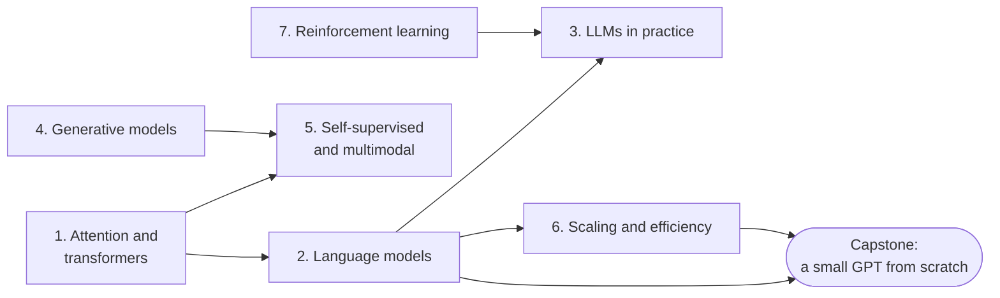

# Level 8: Modern Deep Learning

> **Level 8 · Overview** · ⏱️ ~6–8 weeks at about an hour a day · Prerequisites: all of [Level 7](../07-deep-learning-pytorch/index.md), especially [sequence models](../07-deep-learning-pytorch/04-sequence-models.md) and [embeddings](../07-deep-learning-pytorch/05-embeddings-and-nlp.md)

This is the final level of the handbook. It covers the ideas behind today's AI systems: transformers, large language models, diffusion models, contrastive and multimodal learning, training at scale, and reinforcement learning.

## What this level covers

Almost every headline model of recent years rests on a small number of ideas. Attention lets every position in a sequence look at every other position. Stacking attention into transformer blocks and training them to predict the next token gives you a language model. Scaling that up, then tuning it with instructions and human preferences, gives you an assistant. Learning to reverse a gradual noising process gives you an image generator. Pulling matching pairs together in an embedding space gives you CLIP and the retrieval systems behind RAG. Reinforcement learning ties several of these together.

You'll implement each core idea yourself, at a size that trains on a CPU in minutes:

- scaled dot-product attention, multi-head attention, and a transformer block, checked numerically against PyTorch's own implementations;
- a character-level GPT that trains on a public-domain text and generates new text;
- LoRA from scratch, a DPO loss, and a small retrieval pipeline;
- an autoencoder, a VAE, a GAN, and a tiny diffusion model on 2D data;
- InfoNCE contrastive learning, a masked autoencoder, a small vision transformer, and a CLIP-style loss;
- quantization, distillation, pruning, and a KV cache;
- value iteration, tabular Q-learning, REINFORCE, and the PPO objective.

The full-size versions of these systems need clusters of GPUs. The point here is not to match them. It's to understand them well enough that a paper, a model card, or a training log makes sense to you.

## What you'll be able to do

- Derive and implement scaled dot-product and multi-head attention, positional encodings including RoPE, and a full transformer block.
- Explain how a GPT is built and trained, count its parameters and training FLOPs, tokenize with BPE, sample with temperature, top-k, and top-p, and measure perplexity.
- Use LLMs well in practice: prompting, in-context learning, instruction tuning, LoRA, RLHF and DPO, retrieval-augmented generation, evaluation, and the limits that cause hallucination.
- Explain and implement autoencoders, VAEs, GANs, and diffusion models, including the ELBO, the reparameterization trick, and the denoising objective.
- Explain self-supervised learning (contrastive and masked), vision transformers, and CLIP.
- Estimate the memory needed to train a model, and choose among mixed precision, gradient accumulation, checkpointing, parallelism strategies, quantization, distillation, and inference optimizations.
- Formulate a problem as an MDP, solve it with value iteration and Q-learning, implement policy gradients, and explain how RL is used to train LLMs.

## Chapters

| # | Chapter | What it covers | Time |
|---|---|---|---|
| 1 | [Attention and transformers](01-attention-and-transformers.md) | Attention as soft lookup, scaled dot-product and multi-head attention, positional encodings (sinusoidal, learned, RoPE), the transformer block, encoder and decoder variants, building one from scratch | ~5 h |
| 2 | [Language models](02-language-models.md) | Next-token prediction, BPE, causal masking, the GPT architecture, pretraining objectives, sampling, perplexity, scaling laws, emergent abilities, a character-level GPT | ~5 h |
| 3 | [LLMs in practice](03-llms-in-practice.md) | Prompting and in-context learning, instruction tuning, LoRA from scratch, RLHF and DPO, RAG, embeddings and vector search, evaluation, hallucination and safety | ~4.5 h |
| 4 | [Generative models](04-generative-models.md) | Autoencoders, VAEs and the ELBO, GANs and their dynamics, diffusion models from forward noising to sampling, guidance, latent diffusion | ~5 h |
| 5 | [Self-supervised and multimodal learning](05-self-supervised-and-multimodal.md) | Learning without labels, SimCLR and InfoNCE, masked modeling (BERT, MAE), vision transformers, CLIP, multimodal models | ~4.5 h |
| 6 | [Scaling and efficiency](06-scaling-and-efficiency.md) | How GPUs work, training memory budgets, mixed precision, gradient accumulation and checkpointing, parallelism, DDP and FSDP, quantization, distillation, pruning, KV caching and batching | ~4.5 h |
| 7 | [Reinforcement learning](07-reinforcement-learning.md) | MDPs, value functions and the Bellman equations, Q-learning, DQN, REINFORCE, actor-critic and PPO, RL in LLM training | ~4.5 h |

Times include reading, running the code, and doing the exercises.

Chapters 4 and 7 depend only on Level 7, so you can read them in either order. Chapters 1 and 2 come first because the rest of the level leans on them.

## How to study this level

- **Make Chapters 1 and 2 rock solid.** Write attention from memory. Count a GPT's parameters by hand and check against code. Everything else in this level builds on them.
- **Check against the library.** Each from-scratch piece is checked against PyTorch's own implementation. Do the same for any variation you write. A max absolute difference around `1e-6` means you got it right.
- **Read one original paper per chapter.** The further-reading lists point to the papers that introduced each idea. You now have the background to read them. Start with the abstract, figures, and method section.
- **Expect small models to be small.** A character-level GPT trained for two minutes on a CPU will produce half-words and odd grammar. That's the right result. Watch how loss and samples improve with scale, not whether they match a chatbot.
- **Use the [transformers and LLMs cheat sheet](../../cheatsheets/transformers-llms.md)** for formulas, counting rules, and fine-tuning methods.

## Capstone

[**Train a small GPT from scratch on a text corpus, and write up what you learned.**](../../exercises/level-8-capstone.md) You'll build the tokenizer, model, training loop, and sampler, run ablations on context length, depth, and dropout, and write a short report on what changed and why.

## Where to go after this handbook

Finishing this handbook means you can read most modern deep learning work and implement its core ideas. Here are well-known resources for going deeper.

**Courses**

- **Stanford CS231n: Deep Learning for Computer Vision.** Convolutional networks, training, and vision transformers. Lecture notes are free online.
- **Stanford CS224n: Natural Language Processing with Deep Learning.** From word vectors to transformers and LLMs.
- **Stanford CS336: Language Modeling from Scratch.** Builds a language model end to end, including systems and scaling work.
- **fast.ai, Practical Deep Learning for Coders** by Jeremy Howard. A top-down, code-first course that pairs well with this handbook's bottom-up approach.
- **Andrej Karpathy, "Neural Networks: Zero to Hero."** A free video series that builds micrograd, makemore, and a GPT from scratch.
- **David Silver's UCL Course on Reinforcement Learning**, and OpenAI's **Spinning Up in Deep RL** for practical policy-gradient methods.

**Books**

- *Deep Learning* by Ian Goodfellow, Yoshua Bengio, and Aaron Courville (MIT Press, 2016). The classic reference on the foundations.
- *Dive into Deep Learning* by Aston Zhang, Zachary C. Lipton, Mu Li, and Alexander J. Smola. Free online, with runnable code.
- *Understanding Deep Learning* by Simon J. D. Prince (MIT Press, 2023). Clear, modern, well illustrated, and free as a PDF.
- *Deep Learning: Foundations and Concepts* by Christopher M. Bishop and Hugh Bishop (Springer, 2024).
- *Reinforcement Learning: An Introduction* (2nd edition) by Richard S. Sutton and Andrew G. Barto. Free online.
- *Probabilistic Machine Learning: Advanced Topics* by Kevin P. Murphy. Generative models, Bayesian methods, and more.

**Papers to read next**

- Vaswani et al., "Attention Is All You Need" (2017).
- Radford et al., "Language Models are Unsupervised Multitask Learners" (GPT-2, 2019), and Brown et al., "Language Models are Few-Shot Learners" (GPT-3, 2020).
- Hoffmann et al., "Training Compute-Optimal Large Language Models" (Chinchilla, 2022).
- Ouyang et al., "Training language models to follow instructions with human feedback" (InstructGPT, 2022).
- Ho, Jain, and Abbeel, "Denoising Diffusion Probabilistic Models" (2020).
- Radford et al., "Learning Transferable Visual Models From Natural Language Supervision" (CLIP, 2021).
- Dosovitskiy et al., "An Image is Worth 16x16 Words: Transformers for Image Recognition at Scale" (ViT, 2020).

**Keep practicing**

- Reimplement one paper a month at small scale, and compare your numbers with the paper's.
- Enter a Kaggle competition, or contribute a fix or an example to an open-source library such as PyTorch or Hugging Face.
- Keep your "mistakes I made" log going. It becomes your most valuable reference.
