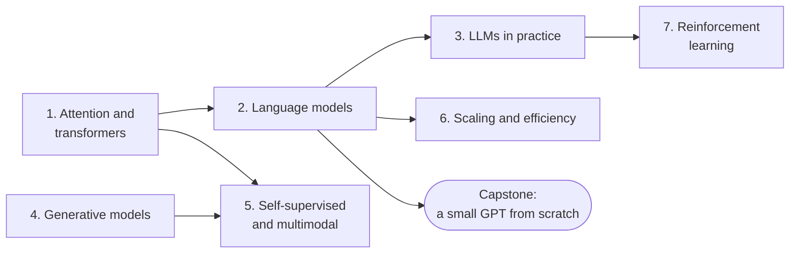

# Level 8: Modern Deep Learning

> **Level 8 · Overview** · ⏱️ ~6–8 weeks at about an hour a day · Prerequisites: all of [Level 7](../07-deep-learning-pytorch/index.md), especially [Sequence models](../07-deep-learning-pytorch/04-sequence-models.md) and [Embeddings and NLP basics](../07-deep-learning-pytorch/05-embeddings-and-nlp.md)

This is the final level of the handbook. It covers the ideas behind today's AI systems: transformers, language models and how they become assistants, generative models from VAEs to diffusion, self-supervised and multimodal learning, training and serving at scale, and reinforcement learning.

## What this level covers

Almost every headline model of recent years rests on a small number of ideas. Attention lets every position in a sequence look up information from every other position. Stacking attention into transformer blocks and training them to predict the next token gives you a language model. Instruction tuning, preference optimization, and retrieval turn that model into a useful assistant. Learning to reverse a gradual noising process gives you an image generator. Pulling matching pairs together in an embedding space gives you CLIP and the retrievers behind RAG. Memory accounting, mixed precision, sharding, and quantization make all of it fit on real hardware. And reinforcement learning, with a reward model and a KL penalty, closes the loop from human preferences back to the model.

You'll implement each core idea yourself, at a size that runs on a CPU in minutes, and check it against a library or an exact answer wherever one exists:

- scaled dot-product attention, multi-head attention, sinusoidal and rotary position encodings, and a pre-LN transformer block, checked against PyTorch, plus a tiny transformer that learns to sort;
- BPE tokenization from scratch, a character-level GPT trained on *Alice's Adventures in Wonderland*, temperature, top-k, and top-p sampling, perplexity, and a timed KV cache;
- LoRA from scratch on a linear layer and a small transformer, the DPO loss on toy preference data (compared with the exact optimum), and a TF-IDF retriever with prompt assembly;
- an autoencoder and a VAE on FashionMNIST, a GAN on 2D data (where you'll watch it drop modes), and a DDPM that turns noise into a spiral;
- the InfoNCE loss, SimCLR-style pretraining with a linear probe, a ViT patch embedding, a tiny masked autoencoder, and a toy CLIP that classifies images zero-shot;
- memory budgets for a 7B model, number-format experiments, measured activation checkpointing, simulated tensor and data parallelism, int8 and int4 quantization with an error analysis, distillation, pruning, and the speculative decoding acceptance rule;
- value iteration, Q-learning, a small DQN, REINFORCE with and without baselines, PPO, and a miniature RLHF run that shows reward hacking and the KL penalty that prevents it.

The full-size versions of these systems need clusters of GPUs. The point here isn't to match them. It's to understand them well enough that a paper, a model card, or a training log makes sense to you, and that you can tell which tool fixes which problem.

## What you'll be able to do

- Derive scaled dot-product attention (including why it divides by $\sqrt{d_k}$), and implement multi-head attention, positional encodings including RoPE, and a full transformer block.
- Explain how a GPT is built and trained, count its parameters and training FLOPs ($6ND$), tokenize with BPE, sample with temperature, top-k, and top-p, measure perplexity correctly across tokenizers, and implement a KV cache.
- Use LLMs well in practice: prompting, in-context learning, instruction tuning with loss masking, LoRA and QLoRA, RLHF and DPO (with the DPO loss derived), retrieval-augmented generation, evaluation, and the limits that cause hallucination and prompt injection.
- Derive the ELBO and the reparameterization trick, explain GAN training dynamics and mode collapse, and derive and implement a diffusion model's forward process, training loss, and sampler; explain guidance and latent diffusion.
- Derive the InfoNCE loss, explain contrastive and masked self-supervised learning, vision transformers, CLIP, and how vision-language models are assembled.
- Estimate the memory needed to train or serve a model, and choose among mixed precision, gradient accumulation, checkpointing, data, tensor, and pipeline parallelism, FSDP, quantization, distillation, pruning, batching, and speculative decoding.
- Formulate a problem as an MDP, derive the Bellman equations and the policy gradient, implement value iteration, Q-learning, REINFORCE, and PPO, and explain how RL is used to train LLMs.

## Chapters

| # | Chapter | What it covers | Time |
|---|---|---|---|
| 1 | [Attention and transformers](01-attention-and-transformers.md) | Attention as soft lookup, scaled dot-product attention and the $\sqrt{d_k}$ variance argument, masking, multi-head attention, sinusoidal, learned, and rotary encodings, the pre-LN block, encoder and decoder variants, a transformer that learns to sort | ~5 h |
| 2 | [Language models](02-language-models.md) | Next-token prediction, BPE from scratch, causal masking, GPT architecture and parameter and FLOP counting, pretraining data, a character-level GPT on *Alice*, sampling, perplexity, the KV cache, scaling laws, emergent abilities | ~5.5 h |
| 3 | [LLMs in practice](03-llms-in-practice.md) | Prompting and in-context learning, instruction tuning, LoRA from scratch, RLHF, DPO derived and implemented, RAG with a TF-IDF retriever, evaluation and pass@k, hallucination and safety | ~5 h |
| 4 | [Generative models](04-generative-models.md) | Autoencoders, VAEs with the ELBO and reparameterization, GANs and mode collapse, diffusion models from forward noising to DDPM sampling, guidance, latent diffusion | ~5 h |
| 5 | [Self-supervised and multimodal learning](05-self-supervised-and-multimodal.md) | Learning without labels, InfoNCE derived, SimCLR, masked modeling (BERT, MAE), vision transformers, CLIP, multimodal models | ~4.5 h |
| 6 | [Scaling and efficiency](06-scaling-and-efficiency.md) | How GPUs work, memory budgets for a 7B model, fp32, fp16, and bf16, gradient accumulation and checkpointing, data, tensor, and pipeline parallelism, DDP and FSDP, quantization, distillation, pruning, inference optimization | ~5 h |
| 7 | [Reinforcement learning](07-reinforcement-learning.md) | MDPs, returns, the Bellman equations, value iteration, Q-learning, DQN, REINFORCE and baselines, actor-critic, PPO, RL in LLM training | ~5 h |

Times include reading, running the code, and doing the exercises.

Chapters 1 and 2 come first: the rest of the level leans on them, and they're all you need for the capstone. Chapter 4 depends only on Level 7, so you can read it at any point. Chapter 7 stands on its own until its last section, which completes the RLHF story from Chapter 3.

## How to study this level

- **Make Chapters 1 and 2 rock solid.** Write attention from memory. Count a GPT's parameters by hand and check against code. Everything else in this level builds on them.
- **Check against the library or an exact answer.** Each from-scratch piece is checked against PyTorch, scikit-learn, or a closed-form solution. Do the same for any variation you write. A maximum absolute difference around `1e-6` in float32 means you got it right.
- **Read the outputs, not just the code.** Several results in this level are honest negatives or surprises: a GAN that drops modes, a contrastive encoder that only ties raw pixels after a minute of training, distillation that helps only under the right conditions. Understanding why is the lesson.
- **Read one original paper per chapter.** The further-reading lists point to the papers that introduced each idea, and you now have the background for them. Start with the abstract, the figures, and the method section.
- **Expect small models to be small.** A character-level GPT trained for two minutes on a CPU produces half-words and odd grammar. That's the right result. Watch how loss and samples change with scale and data, not whether they match a chatbot.
- **Keep the [transformers and LLMs cheat sheet](../../cheatsheets/transformers-llms.md) open** for formulas, counting rules, memory budgets, and fine-tuning methods.

## Capstone

[**Train a small GPT from scratch on a text corpus, and write up what you learned.**](../../exercises/level-8-capstone.md) You'll build a tokenizer, a GPT whose size is set from the command line, a training script with a proper train/validation split, warmup and cosine decay, and best-checkpoint saving, and a sampler with temperature and top-k. You'll report loss curves and perplexity against baselines, run a controlled ablation (such as with and without position embeddings, or two model sizes), and write a one-page report on what you found.

## Where to go after this handbook

Finishing this handbook means you can read most modern deep learning work and implement its core ideas. These well-known resources go deeper.

**Courses**

- **Stanford CS231n: Deep Learning for Computer Vision.** Convolutional networks, training, and vision transformers; the lecture notes are free online.
- **Stanford CS224n: Natural Language Processing with Deep Learning.** From word vectors to transformers and LLMs.
- **Stanford CS336: Language Modeling from Scratch.** Builds a language model end to end, including tokenization, systems, scaling, and alignment.
- **Practical Deep Learning for Coders** (fast.ai), by Jeremy Howard. A top-down, code-first course that pairs well with this handbook's bottom-up approach.
- **Neural Networks: Zero to Hero**, by Andrej Karpathy. A free video series that builds an autograd engine, character-level language models, and a GPT from scratch.
- **David Silver's Reinforcement Learning course** (UCL and DeepMind), and OpenAI's **Spinning Up in Deep RL** for practical policy-gradient methods.

**Books**

- *Deep Learning* by Ian Goodfellow, Yoshua Bengio, and Aaron Courville (MIT Press, 2016). The classic reference on the foundations.
- *Dive into Deep Learning* by Aston Zhang, Zachary C. Lipton, Mu Li, and Alexander J. Smola. Free online, with runnable code.
- *Understanding Deep Learning* by Simon J. D. Prince (MIT Press, 2023). Clear, modern, well illustrated, and free as a PDF.
- *Deep Learning: Foundations and Concepts* by Christopher M. Bishop and Hugh Bishop (Springer, 2024).
- *Build a Large Language Model (From Scratch)* by Sebastian Raschka (Manning, 2024). A GPT-style model built step by step in PyTorch, through instruction fine-tuning.
- *Reinforcement Learning: An Introduction* (2nd edition) by Richard S. Sutton and Andrew G. Barto (MIT Press, 2018). Free online.
- *Probabilistic Machine Learning: Advanced Topics* by Kevin P. Murphy (MIT Press, 2023). Generative models, Bayesian methods, and more.

**Papers to read next**

- Ashish Vaswani et al., "Attention Is All You Need" (2017).
- Alec Radford et al., "Language Models are Unsupervised Multitask Learners" (GPT-2, 2019), and Tom Brown et al., "Language Models are Few-Shot Learners" (GPT-3, 2020).
- Jordan Hoffmann et al., "Training Compute-Optimal Large Language Models" (Chinchilla, 2022).
- Long Ouyang et al., "Training language models to follow instructions with human feedback" (InstructGPT, 2022), and Rafael Rafailov et al., "Direct Preference Optimization: Your Language Model is Secretly a Reward Model" (2023).
- Jonathan Ho, Ajay Jain, and Pieter Abbeel, "Denoising Diffusion Probabilistic Models" (2020).
- Alec Radford et al., "Learning Transferable Visual Models From Natural Language Supervision" (CLIP, 2021).
- Samyam Rajbhandari et al., "ZeRO: Memory Optimizations Toward Training Trillion Parameter Models" (2020).

**Keep practicing**

- Reimplement one paper a month at small scale, and compare your numbers with the paper's.
- Enter a Kaggle competition, or contribute a fix or an example to an open-source library such as PyTorch.
- Scale up your capstone: more data, a BPE tokenizer, a bigger model on a rented GPU, and a fine-tuning or DPO stage on top.
- Keep your "mistakes I made" log going. It becomes your most valuable reference.
