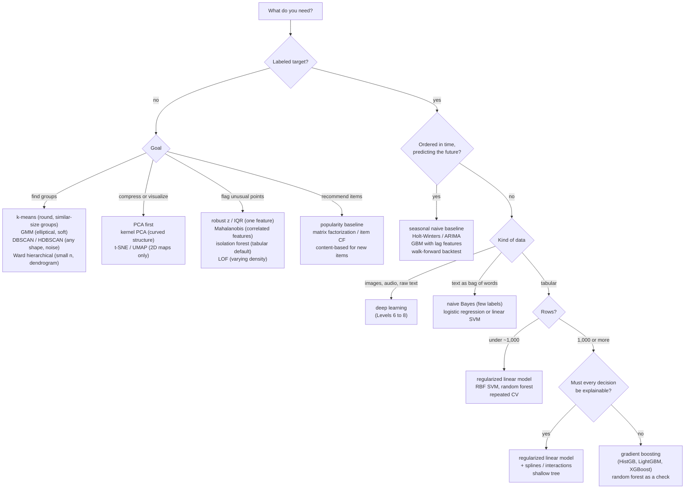

# Choosing a Model Cheat Sheet

A one-page guide to picking a classical ML algorithm: a decision flowchart, then every algorithm from Levels 3 and 4 with its strengths, weaknesses, scaling needs, key hyperparameters, and cost. The flowchart gives a sensible *first* choice; validation decides the final one.

Related chapters: [What is machine learning?](../chapters/03-ml-fundamentals/01-what-is-machine-learning.md) · [Generalization and the bias-variance trade-off](../chapters/03-ml-fundamentals/04-generalization-bias-variance.md) · [Level 4: ML algorithms in depth](../chapters/04-ml-algorithms/index.md) · [Level 4 capstone: a model bake-off](../exercises/level-4-capstone.md)

## The decision flowchart

Whatever the branch: start with a **baseline** (`DummyClassifier`, `DummyRegressor`, mean, seasonal naive, or popularity), compare candidates on the **same folds**, and keep a test set for one final check.

## Supervised models

$n$ = rows, $d$ = features, $T$ = trees, $k$ = neighbors, $n_{\text{SV}}$ = support vectors. Costs are typical, not worst-case.

| Algorithm | Strengths | Weaknesses | Scale features? | Key hyperparameters | Train / predict cost |
|---|---|---|---|---|---|
| [Linear regression (OLS)](../chapters/03-ml-fundamentals/02-linear-regression.md) | Fast, exact solution, interpretable coefficients, extrapolates | Only linear effects unless you add features; sensitive to outliers and collinearity | Not for fit; yes to compare coefficients | None (feature design) | $O(nd^2 + d^3)$ / $O(d)$ |
| [Ridge (L2)](../chapters/03-ml-fundamentals/05-regularization.md) | Stable with correlated features; closed form | Keeps every feature | Yes | `alpha` | $O(nd^2 + d^3)$ / $O(d)$ |
| [Lasso (L1)](../chapters/03-ml-fundamentals/05-regularization.md) | Sparse: selects features | Picks one of a correlated group arbitrarily | Yes | `alpha` | Iterative, about $O(nd)$ per pass / $O(d)$ |
| [Elastic net](../chapters/03-ml-fundamentals/05-regularization.md) | Sparse and stable with correlated groups | Two knobs to tune | Yes | `alpha`, `l1_ratio` | Iterative / $O(d)$ |
| [Logistic regression](../chapters/03-ml-fundamentals/03-logistic-regression.md) | Probabilities, interpretable log-odds, strong text baseline | Linear boundary unless features are engineered | Yes (for regularization and solvers) | `C`, `l1_ratio` | Iterative, $O(nd)$ per pass / $O(d)$ |
| [kNN](../chapters/04-ml-algorithms/01-knn-and-naive-bayes.md) | No training, any boundary shape, simple | Slow, memory-hungry prediction; curse of dimensionality; hurt by irrelevant features | **Yes, essential** | `n_neighbors`, `weights`, `metric` | $O(1)$ / $O(nd)$ per query (less with trees in low $d$) |
| [Gaussian naive Bayes](../chapters/04-ml-algorithms/01-knn-and-naive-bayes.md) | Trains in one pass, works with tiny data | Independence assumption; overconfident probabilities | No | `var_smoothing` | $O(nd)$ / $O(cd)$ for $c$ classes |
| [Multinomial naive Bayes](../chapters/04-ml-algorithms/01-knn-and-naive-bayes.md) | Fast, strong text baseline with few labels | Overconfident; beaten by linear models with more data | No (counts) | `alpha` (smoothing) | $O(\text{nonzeros})$ / $O(cd)$ |
| [Decision tree](../chapters/04-ml-algorithms/02-decision-trees.md) | Readable rules, no scaling, mixed data, interactions | Unstable, overfits, staircase boundaries, can't extrapolate | No | `max_depth`, `min_samples_leaf`, `ccp_alpha` | $O(d\,n\log n)$ / $O(\text{depth})$ |
| [Random forest](../chapters/04-ml-algorithms/03-ensembles.md) | Robust defaults, little tuning, OOB error, hard to break | Large models, slower prediction, weaker than tuned boosting, can't extrapolate | No | `max_features`, `min_samples_leaf`, `n_estimators` | $O(T\,d'\,n\log n)$ with $d'$ features per split / $O(T \cdot \text{depth})$ |
| [AdaBoost](../chapters/04-ml-algorithms/03-ensembles.md) | Turns weak learners into a strong one; few knobs | Sensitive to label noise and outliers (exponential loss) | No | `n_estimators`, `learning_rate`, base depth | $O(T \cdot \text{stump cost})$ / $O(T)$ |
| [Gradient boosting (HistGB, LightGBM, XGBoost, CatBoost)](../chapters/04-ml-algorithms/03-ensembles.md) | Usually the most accurate on tabular data; missing values and categories natively | Many knobs; overfits without early stopping; less transparent | No | `learning_rate`, number of trees (early stopping), `max_leaf_nodes` or `max_depth`, `min_samples_leaf`, subsampling, L2 | Histogram: about $O(T\,nd)$ / $O(T \cdot \text{depth})$ |
| [Linear SVM](../chapters/04-ml-algorithms/04-support-vector-machines.md) | Scales to huge sparse data (text); max-margin | No probabilities; linear boundary | Yes | `C` | About $O(nd)$ per pass / $O(d)$ |
| [Kernel SVM (RBF, polynomial)](../chapters/04-ml-algorithms/04-support-vector-machines.md) | Flexible boundaries on small-to-medium dense data; custom kernels | Training between $O(n^2)$ and $O(n^3)$; sensitive to `C` and `gamma`; no native probabilities | **Yes, essential** | `C`, `gamma` (log grid, together), `kernel`, `degree` | $O(n^2 d)$ to $O(n^3)$ / $O(n_{\text{SV}}\,d)$ |
| [SVR](../chapters/04-ml-algorithms/04-support-vector-machines.md) | Robust to small errors ($\epsilon$ tube), sparse solution | Same scaling limits as kernel SVM; three knobs | Yes (and think about $y$'s scale) | `C`, `gamma`, `epsilon` | As kernel SVM |

## Unsupervised, time series, anomaly, and recommender models

| Algorithm | Strengths | Weaknesses | Scale features? | Key hyperparameters | Train / predict cost |
|---|---|---|---|---|---|
| [k-means](../chapters/04-ml-algorithms/05-clustering.md) | Fast, simple, scales to large $n$ | Round, similar-size clusters only; must choose $k$; always returns $k$ clusters | **Yes** | `n_clusters`, `n_init` | $O(nkd)$ per iteration / $O(kd)$ |
| [Hierarchical (agglomerative)](../chapters/04-ml-algorithms/05-clustering.md) | Dendrogram shows every scale; no $k$ up front | Quadratic memory; greedy merges can't be undone | Yes | `linkage`, cut height or `n_clusters` | $O(n^2)$ memory, $O(n^2\log n)$ time / n/a |
| [DBSCAN / HDBSCAN](../chapters/04-ml-algorithms/05-clustering.md) | Any shape, finds the number of clusters, labels noise | DBSCAN: one density for all clusters; struggles in high $d$ | **Yes** | `eps`, `min_samples` (HDBSCAN: `min_cluster_size`) | About $O(n\log n)$ with an index / n/a |
| [Gaussian mixture (EM)](../chapters/04-ml-algorithms/05-clustering.md) | Soft assignments, elliptical clusters, density estimate, BIC for $K$ | Local optima; full covariances costly in high $d$ | Usually | `n_components`, `covariance_type`, `n_init` | $O(nKd^2)$ per iteration / $O(Kd^2)$ |
| [PCA](../chapters/04-ml-algorithms/06-dimensionality-reduction.md) | Fast, deterministic, interpretable axes, denoises | Linear only; variance isn't relevance; outlier-sensitive | **Yes** (unless same units) | `n_components`, `whiten` | $O(nd\min(n, d))$ (less with randomized SVD) / $O(dk)$ |
| [Kernel PCA](../chapters/04-ml-algorithms/06-dimensionality-reduction.md) | Unfolds curved structure | $n \times n$ kernel matrix; kernel to tune; no easy inverse | Yes | `kernel`, `gamma`, `n_components` | $O(n^2 d + n^3)$ / $O(nd)$ |
| [t-SNE](../chapters/04-ml-algorithms/06-dimensionality-reduction.md) | Excellent local-neighborhood maps for visualization | Cluster sizes and distances meaningless; no `transform`; stochastic | Yes | `perplexity`, `init`, `random_state` | About $O(n\log n)$ (Barnes-Hut) / n/a |
| [UMAP](../chapters/04-ml-algorithms/06-dimensionality-reduction.md) | Faster than t-SNE, scales further, has `transform` | Same reading caveats as t-SNE; separate package | Yes | `n_neighbors`, `min_dist` | About $O(n\log n)$ / fast |
| [Exponential smoothing (Holt-Winters, ETS)](../chapters/04-ml-algorithms/07-time-series.md) | Fast, robust baseline for one seasonality, prediction intervals | One seasonal period; no exogenous drivers | No | `trend`, `seasonal`, `seasonal_periods`, `damped_trend` | $O(n)$ / $O(h)$ for horizon $h$ |
| [ARIMA / SARIMA](../chapters/04-ml-algorithms/07-time-series.md) | Models autocorrelation explicitly; exogenous regressors (SARIMAX) | Needs stationarity; order selection; slow with long seasonal periods | No | `order` $(p,d,q)$, `seasonal_order` | Iterative MLE, about $O(n)$ per evaluation / $O(h)$ |
| [GBM with lag features](../chapters/04-ml-algorithms/07-time-series.md) | Multiple seasonalities, exogenous drivers, many series in one model | Leakage risk; can't extrapolate trends; needs careful backtesting | No | As gradient boosting, plus the lag and window design | As gradient boosting |
| [Robust z-score, IQR, Mahalanobis](../chapters/04-ml-algorithms/08-anomaly-detection-and-recommenders.md) | Simple, explainable thresholds | Assume a shape; per-feature rules miss combinations | n/a | Threshold (3.5, 1.5 IQR, $\chi^2$ quantile) | $O(n)$; MCD costlier / $O(d^2)$ |
| [Isolation forest](../chapters/04-ml-algorithms/08-anomaly-detection-and-recommenders.md) | Fast, no scaling, works in many dimensions; tabular default | Axis-aligned artifacts; threshold still a judgment | No | `n_estimators`, `max_samples`, `contamination` | $O(T\psi\log\psi)$ with $\psi = 256$ / $O(T\log\psi)$ |
| [One-class SVM](../chapters/04-ml-algorithms/08-anomaly-detection-and-recommenders.md) | Smooth boundaries for novelty detection on clean data | Kernel SVM scaling; sensitive to `gamma` | **Yes** | `nu`, `gamma` | As kernel SVM |
| [Local outlier factor](../chapters/04-ml-algorithms/08-anomaly-detection-and-recommenders.md) | Handles clusters of different densities | Distance-based: scaling and high-$d$ issues | **Yes** | `n_neighbors`, `contamination` | About $O(n\log n)$ to $O(n^2)$ / $O(\log n)$ to $O(n)$ |
| [Item-based CF](../chapters/04-ml-algorithms/08-anomaly-detection-and-recommenders.md) | Simple, explainable ("because you liked X") | Sparse data; noisy for rarely rated items; no cold start | n/a | Similarity, number of neighbors, shrinkage | $O(n_i^2)$ similarities / fast lookups |
| [Matrix factorization (SGD, ALS)](../chapters/04-ml-algorithms/08-anomaly-detection-and-recommenders.md) | Strong collaborative model; item and user embeddings | Cold start; optimizes ratings, not ranking, unless adapted | n/a | Factors $k$, regularization $\lambda$, epochs, learning rate | $O(\lvert\text{ratings}\rvert\,k)$ per epoch / $O(k)$ per pair |
| [Content-based filtering](../chapters/04-ml-algorithms/08-anomaly-detection-and-recommenders.md) | Handles new items; explainable | Needs good item features; recommends more of the same | Normalize vectors | Feature design, profile weighting | Cheap |

## Rules of thumb

These are defaults to start from, not laws. Validate every choice.

- **Tabular, more than about a thousand rows, accuracy first**: gradient boosting with early stopping, with a random forest and a regularized linear model as checks.
- **Explanations required**: try a regularized linear model with engineered features (splines, interactions) before giving up accuracy. It's often closer to boosting than you'd expect, as the [Level 4 capstone](../exercises/level-4-capstone.md) shows.
- **Very small data** (hundreds of rows): regularized linear models, SVMs, and random forests, with repeated cross-validation; differences of a point or two are usually noise.
- **Text**: TF-IDF with logistic regression or a linear SVM; multinomial naive Bayes when labels are scarce or speed matters most.
- **Distances involved** (kNN, SVM, k-means, DBSCAN, PCA, LOF): standardize features inside the pipeline.
- **Trees involved**: no scaling needed, but trees can't extrapolate; model a stationary target for trends.
- **Time series**: never shuffle; backtest at the real horizon against seasonal naive.
- **Unsupervised results**: check stability across seeds and samples, and compare against a no-structure baseline.

## Common mistakes

| Mistake | Fix |
|---|---|
| Comparing models on different splits | Same outer folds for every model; paired comparisons |
| Tuning on the test set (including early stopping) | Inner CV or a validation split; test set used once |
| Preprocessing before splitting | Put scalers, imputers, encoders, PCA in a `Pipeline` |
| Declaring a winner from a 0.003 AUC difference | Corrected resampled t-test or bootstrap; call ties ties |
| Forgetting a baseline | Always report `Dummy*`, seasonal naive, or popularity |
| Picking by accuracy on imbalanced data | ROC AUC, average precision, cost-based metrics |
| Ignoring cost and interpretability | Report fit time, predict time, and how each model is explained |
