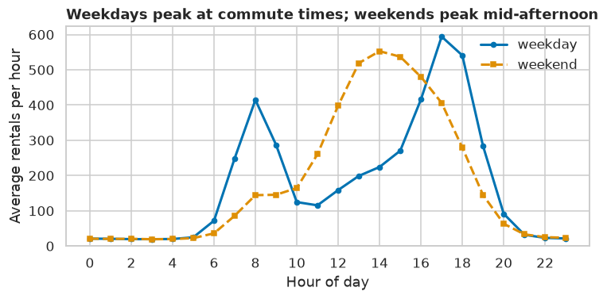
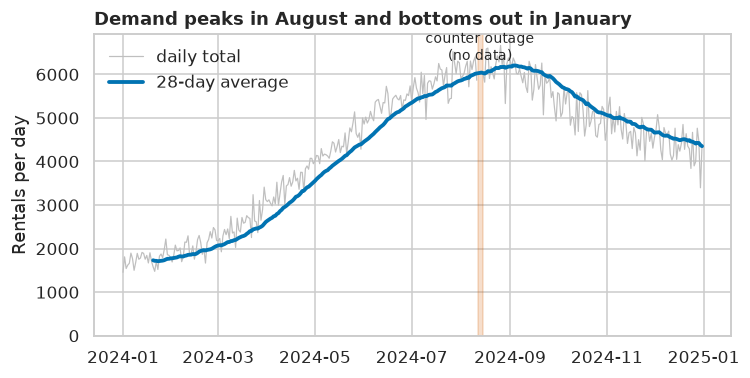
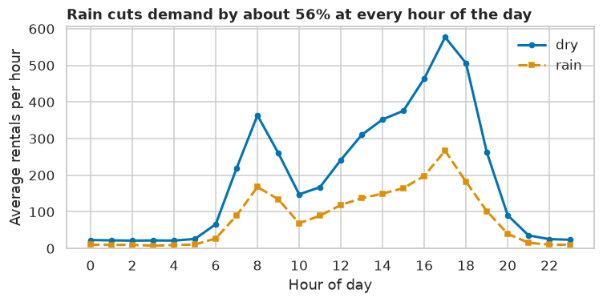
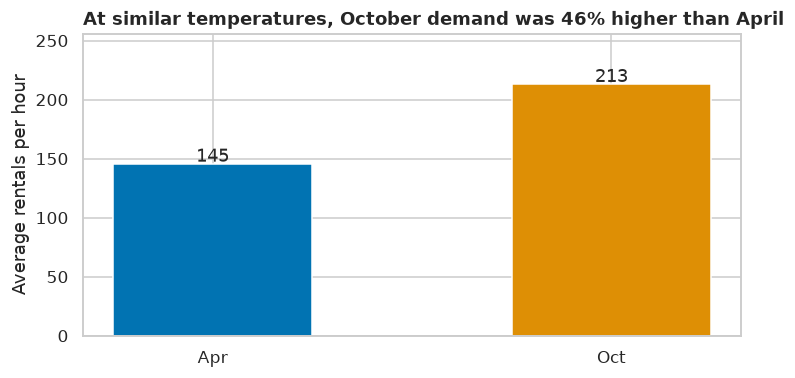

# Level 0 Capstone: Worked Solution

> **Level 0 · Capstone solution** · Try the [capstone](../level-0-capstone.md) yourself before reading this.

This is one good solution, not the only one. Compare your decisions with these, and pay most attention to the reasoning behind each one.

## Part 1: Project setup

```text
citycycle/
├── README.md
├── requirements.in          # numpy, pandas, pyarrow, matplotlib, seaborn, jupyterlab
├── requirements.txt         # uv pip compile requirements.in -o requirements.txt
├── data/
│   ├── raw/rentals.csv
│   └── processed/rentals.parquet
├── notebooks/01-analysis.ipynb
├── reports/
└── src/
    ├── make_data.py         # the generator from the capstone page, plus a main()
    └── clean.py             # load_raw() and clean()
```

```bash
uv venv --python 3.12
uv pip compile requirements.in -o requirements.txt
uv pip sync requirements.txt
.venv/bin/python src/make_data.py        # writes data/raw/rentals.csv
```

The rest of this page is the notebook's code. To keep the page self-contained, it regenerates the data in memory instead of reading the CSV.

```python
import numpy as np
import pandas as pd
import matplotlib.pyplot as plt
import seaborn as sns

pd.set_option("display.width", 100)
sns.set_theme(style="whitegrid", palette="colorblind")

def make_rentals(seed=7):
    rng = np.random.default_rng(seed)
    hours = pd.date_range("2024-01-01", "2024-12-31 23:00", freq="h")
    n = len(hours)
    doy = hours.dayofyear.to_numpy()
    hour = hours.hour.to_numpy()
    weekend = hours.dayofweek.to_numpy() >= 5

    temp = 12 - 10 * np.cos(2 * np.pi * (doy - 15) / 366) + 4 * np.sin(2 * np.pi * (hour - 9) / 24) + rng.normal(0, 2.5, n)
    rain = rng.random(n) < np.where((doy > 270) | (doy < 90), 0.18, 0.08)
    humidity = np.clip(55 + 25 * rain + rng.normal(0, 10, n), 15, 100)

    commute = np.exp(-((hour - 8) ** 2) / 2) * 260 + np.exp(-((hour - 17.5) ** 2) / 3) * 300
    leisure = np.exp(-((hour - 14) ** 2) / 12) * 220
    base = np.where(weekend, 0.25 * commute + 1.4 * leisure, commute + 0.5 * leisure) + 15
    weather = np.clip(1 + 0.035 * (temp - 12), 0.2, 1.6) * np.where(rain, 0.45, 1.0)
    rentals = rng.poisson(base * weather * 1.08 ** ((doy - 1) / 30.5))

    df = pd.DataFrame({
        "timestamp": hours.strftime("%Y-%m-%d %H:%M"),
        "temp_c": temp.round(1),
        "humidity": humidity.round(0),
        "rain": np.where(rain, "yes", "no"),
        "rentals": rentals,
    })
    df.loc[rng.choice(n, 120, replace=False), "temp_c"] = np.nan
    df.loc[rng.choice(n, 40, replace=False), "rain"] = rng.choice(["Yes", "YES", "y"], 40)
    glitch = (hours >= "2024-08-12") & (hours < "2024-08-15")
    df.loc[glitch, "rentals"] = -1
    df = pd.concat([df, df.sample(60, random_state=seed)]).sort_index(kind="stable")
    return df.reset_index(drop=True)

raw = make_rentals()
raw["timestamp"] = pd.to_datetime(raw["timestamp"])
```

## Part 2: Inspect and clean

### Inspect

```python
raw.info()
print(raw.describe().round(1))
```

```text
<class 'pandas.DataFrame'>
RangeIndex: 8844 entries, 0 to 8843
Data columns (total 5 columns):
 #   Column     Non-Null Count  Dtype
---  ------     --------------  -----
 0   timestamp  8844 non-null   datetime64[us]
 1   temp_c     8723 non-null   float64
 2   humidity   8844 non-null   float64
 3   rain       8844 non-null   str
 4   rentals    8844 non-null   int64
dtypes: datetime64[us](1), float64(2), int64(1), str(1)
memory usage: 365.1 KB
                        timestamp  temp_c  humidity  rentals
count                        8844  8723.0    8844.0   8844.0
mean   2024-07-01 22:52:07.001356    12.0      58.1    177.4
min           2024-01-01 00:00:00    -8.5      15.0     -1.0
25%           2024-04-01 09:45:00     5.5      49.0     26.0
50%           2024-07-01 23:30:00    11.9      57.0     95.0
75%           2024-10-01 12:15:00    18.4      66.0    273.0
max           2024-12-31 23:00:00    32.9     100.0   1002.0
std                           NaN     8.0      12.8    202.4
```

`info()` prints directly, so its output appears above the `describe()` table. Three things stand out already: `temp_c` has missing values, `rentals` has a minimum of −1 (a count can't be negative), and there are more rows than the 8,784 hours in 2024 (a leap year).

```python
print("rows:", len(raw), " expected hours:", 366 * 24)
print("exact duplicate rows:", raw.duplicated().sum())
print("duplicate timestamps:", raw["timestamp"].duplicated().sum())
print("missing temp:", raw["temp_c"].isna().sum())
print(raw["rain"].value_counts().to_dict())
neg = raw[raw["rentals"] < 0]
print("negative rentals:", len(neg), "from", neg["timestamp"].min(), "to", neg["timestamp"].max())
```

```text
rows: 8844  expected hours: 8784
exact duplicate rows: 60
duplicate timestamps: 60
missing temp: 121
{'no': 7651, 'yes': 1153, 'y': 16, 'Yes': 13, 'YES': 11}
negative rentals: 72 from 2024-08-12 00:00:00 to 2024-08-14 23:00:00
```

### The problems, and what to do about each

| Problem | Rows | Decision | Why |
|---|---|---|---|
| Exact duplicate rows | see above | drop | the same hour exported twice; keeping them double-counts rentals |
| Inconsistent `rain` labels (`Yes`, `YES`, `y`) | 40 | normalize to a boolean | they all clearly mean "yes" |
| Missing `temp_c` | 120 (121 before removing duplicates) | interpolate in time | temperature changes smoothly hour to hour, so neighbors are a good estimate; dropping rows would delete real rentals |
| Negative `rentals` during a 3-day outage | 72 | set to NaN, and exclude from averages | −1 means "no data", not zero rentals |

Note the duplicates check. The duplicated rows are *exact* copies, so `duplicated()` and duplicated timestamps agree. If they hadn't (the same timestamp with different values), you'd need to investigate which row to trust instead of blindly dropping one.

### Clean

```python
def clean(df: pd.DataFrame) -> pd.DataFrame:
    """Return a cleaned copy of the raw rentals data, one row per hour."""
    out = (
        df.drop_duplicates()
        .assign(
            rain=lambda d: d["rain"].str.lower().str[0].eq("y"),
            temp_c=lambda d: d["temp_c"].interpolate(limit=3),
            rentals=lambda d: d["rentals"].where(d["rentals"] >= 0).astype("Float64"),
        )
        .set_index("timestamp")
        .sort_index()
    )
    assert out.index.is_unique, "duplicate hours remain"
    assert len(out) == 366 * 24, "missing hours"
    return out

hourly = clean(raw)
print(hourly.shape)
print(hourly.isna().sum().to_dict())
print(hourly["rain"].mean().round(3))
```

```text
(8784, 4)
{'temp_c': 0, 'humidity': 0, 'rain': 0, 'rentals': 72}
0.135
```

`interpolate(limit=3)` fills gaps of up to 3 consecutive hours. Longer gaps would stay missing, which is safer than inventing a long stretch of temperatures. The rentals column uses the nullable `Float64` dtype, so the outage hours are clearly `<NA>`. The two `assert` lines check the most important property of the cleaned data: exactly one row per hour of the year.

In the project, `clean` lives in `src/clean.py`, and the notebook saves the result with `hourly.to_parquet("data/processed/rentals.parquet")`.

## Part 3: Answer the questions

Some useful columns first:

```python
h = hourly.assign(
    hour=hourly.index.hour,
    weekday=hourly.index.day_name(),
    is_weekend=hourly.index.dayofweek >= 5,
    month=hourly.index.month,
)
```

### Question 7: the daily rhythm

```python
profile = h.groupby(["is_weekend", "hour"])["rentals"].mean().unstack(0)
profile.columns = ["weekday", "weekend"]
print(profile.round(0).iloc[[0, 4, 8, 12, 14, 17, 18, 22]])
print("weekday peaks:", profile["weekday"].nlargest(2).index.tolist(),
      " weekend peak:", profile["weekend"].idxmax())
```

```text
      weekday  weekend
hour
0        21.0     21.0
4        20.0     20.0
8       415.0    144.0
12      159.0    398.0
14      224.0    553.0
17      594.0    406.0
18      541.0    279.0
22       23.0     25.0
weekday peaks: [17, 18]  weekend peak: 14
```

### Question 8: seasonality

```python
daily = h["rentals"].resample("D").sum(min_count=24)     # NaN if any hour is missing
monthly = daily.groupby(daily.index.month).mean()
print(monthly.round(0).astype("Int64").to_dict())
print("busiest month:", monthly.idxmax(), " quietest:", monthly.idxmin())
```

```text
{1: 1758, 2: 2047, 3: 2562, 4: 3491, 5: 4392, 6: 5305, 7: 5834, 8: 6155, 9: 5854, 10: 5110, 11: 4715, 12: 4393}
busiest month: 8  quietest: 1
```

`sum(min_count=24)` makes a day's total NaN unless all 24 hours are present. Without it, the outage days would get a partial total that looks like a real slump.

### Question 9: weather

A naive comparison mixes up rain, season, and time of day:

```python
naive = h.groupby("rain")["rentals"].mean()
print("naive rainy/dry ratio:", round(naive[True] / naive[False], 2))

by_hour = h.groupby(["hour", "rain"])["rentals"].mean().unstack()
ratio = by_hour[True] / by_hour[False]
daytime = ratio.loc[7:20]
print("rainy/dry ratio by hour (7:00-20:00): median", round(daytime.median(), 2),
      " range", round(daytime.min(), 2), "to", round(daytime.max(), 2))
```

```text
naive rainy/dry ratio: 0.41
rainy/dry ratio by hour (7:00-20:00): median 0.44  range 0.36 to 0.53
```

And temperature, using dry daytime hours only, so rain and night don't confound it:

```python
dry_day = h[(~h["rain"]) & h["hour"].between(7, 20)].dropna(subset=["temp_c", "rentals"])
bins = pd.cut(dry_day["temp_c"], bins=[-10, 0, 5, 10, 15, 20, 25, 35])
by_temp = dry_day.groupby(bins, observed=True)["rentals"].agg(["mean", "size"]).round(0)
print(by_temp)
```

```text
           mean  size
temp_c
(-10, 0]  128.0    74
(0, 5]    169.0   552
(5, 10]   246.0   905
(10, 15]  293.0   770
(15, 20]  330.0   842
(20, 25]  396.0   943
(25, 35]  508.0   339
```

### Question 10: the busiest hours of the week

```python
how = h.groupby(["weekday", "hour"])["rentals"].mean().nlargest(5).round(0)
print(how)
```

```text
weekday    hour
Wednesday  17      618.0
Tuesday    17      604.0
Thursday   17      592.0
Monday     17      585.0
Friday     17      572.0
Name: rentals, dtype: Float64
```

### Question 11: growth

April and October have similar temperatures, so comparing them separates growth from seasonality:

```python
apr_oct = h[h["month"].isin([4, 10])].groupby("month").agg(
    mean_temp=("temp_c", "mean"), mean_rentals=("rentals", "mean")).round(1)
print(apr_oct)
print(f"October vs April: {apr_oct.loc[10, 'mean_rentals'] / apr_oct.loc[4, 'mean_rentals'] - 1:+.0%}")
```

```text
       mean_temp  mean_rentals
month
4           12.0         145.4
10          11.7         212.9
October vs April: +46%
```

## Part 4: Communicate

### The four charts

```python
fig, ax = plt.subplots(figsize=(7, 3.6))
ax.plot(profile.index, profile["weekday"], "o-", label="weekday", lw=2, ms=4)
ax.plot(profile.index, profile["weekend"], "s--", label="weekend", lw=2, ms=4)
ax.set_title("Weekdays peak at commute times; weekends peak mid-afternoon", loc="left", fontweight="bold")
ax.set_xlabel("Hour of day")
ax.set_ylabel("Average rentals per hour")
ax.set_xticks(range(0, 24, 2))
ax.set_ylim(0, None)
ax.legend(frameon=False)
fig.tight_layout()
plt.show()
```



*Chart 1: the daily rhythm.*

```python
fig, ax = plt.subplots(figsize=(7, 3.6))
ax.plot(daily.index, daily, color="0.75", lw=0.8, label="daily total")
ax.plot(daily.index, daily.rolling(28, min_periods=20).mean(), lw=2.5, label="28-day average")
ax.axvspan(pd.Timestamp("2024-08-12"), pd.Timestamp("2024-08-15"), color="C3", alpha=0.2)
ax.annotate("counter outage\n(no data)", (pd.Timestamp("2024-08-13"), daily.max() * 0.95), ha="center", fontsize=9)
ax.set_title(f"Demand peaks in {pd.Timestamp(2024, monthly.idxmax(), 1):%B} and bottoms out in {pd.Timestamp(2024, monthly.idxmin(), 1):%B}",
             loc="left", fontweight="bold")
ax.set_ylabel("Rentals per day")
ax.set_ylim(0, None)
ax.legend(frameon=False, loc="upper left")
fig.tight_layout()
plt.show()
```



*Chart 2: seasonality, with the outage marked rather than hidden.*

```python
fig, ax = plt.subplots(figsize=(7, 3.6))
ax.plot(by_hour.index, by_hour[False], "o-", label="dry", lw=2, ms=4)
ax.plot(by_hour.index, by_hour[True], "s--", label="rain", lw=2, ms=4)
ax.set_title(f"Rain cuts demand by about {1 - daytime.median():.0%} at every hour of the day", loc="left", fontweight="bold")
ax.set_xlabel("Hour of day")
ax.set_ylabel("Average rentals per hour")
ax.set_xticks(range(0, 24, 2))
ax.set_ylim(0, None)
ax.legend(frameon=False)
fig.tight_layout()
plt.show()
```



*Chart 3: the effect of rain, compared hour by hour.*

```python
fig, ax = plt.subplots(figsize=(7, 3.6))
labels = ["Apr", "Oct"]
values = apr_oct["mean_rentals"].to_numpy()
ax.bar(labels, values, color=["C0", "C1"], width=0.5)
for i, v in enumerate(values):
    ax.text(i, v + 2, f"{v:.0f}", ha="center")
ax.set_title(f"At similar temperatures, October demand was {values[1] / values[0] - 1:.0%} higher than April",
             loc="left", fontweight="bold")
ax.set_ylabel("Average rentals per hour")
ax.set_ylim(0, values.max() * 1.2)
fig.tight_layout()
plt.show()
```



*Chart 4: growth, comparing two months with similar weather.*

Each title is computed from the data, so it stays correct if the data is refreshed.

### The summary for Wei

> **To:** Wei · **Re:** 2024 rental patterns, for Friday's meeting
>
> **Key findings**
>
> 1. **Weekday demand follows commuters.** Weekdays peak at 08:00 (about 415 rentals an hour) and 17:00–18:00 (about 540–595). The single busiest hours of the week are 17:00 on Tuesday to Thursday, at 590–620 rentals. Weekends peak mid-afternoon instead (about 550 at 14:00). Overnight demand is about 20 an hour.
> 2. **Demand is strongly seasonal and weather-driven.** Average daily rentals range from about 1,760 in January to about 6,150 in August, 3.5 times as many. In dry daytime hours, demand rises steadily with temperature: from about 130 rentals an hour below 0 °C to about 510 above 25 °C. Rain cuts demand to about 44% of the dry level at the same hour of the day.
> 3. **Underlying demand grew through the year.** October and April had almost identical average temperatures, but October averaged 46% more rentals per hour. That points to a growing user base, which we should confirm with membership data.
>
> **Recommendation.** Schedule maintenance and bike rebalancing overnight (22:00–05:00) and in January–February, when demand is lowest. Staff fully for the weekday 17:00–18:00 peak. Plan next summer's fleet capacity *above* this August's peak, since growth will add to the seasonal rise.
>
> **Data quality.** The export had four problems, all fixed before analysis: 60 duplicated hours (removed), 40 inconsistent rain labels (standardized), 120 missing temperature readings (filled from neighboring hours), and a counter outage from 12 to 14 August, 72 hours where rentals were recorded as −1. Those hours are marked as missing and excluded from averages, not treated as zero. Engineering should look into the outage, since it would have hidden about three days of revenue data from finance.

## What to take away

- **Most of the work was understanding and cleaning the data.** Every later number depends on the decisions in Part 2. Replacing the outage with zeros instead of NaN would have made August look like a slump; keeping the duplicates would have inflated totals.
- **Compare like with like.** The naive rain comparison is confounded by time of day and season. Grouping by hour first gives a fairer answer. You'll formalize this idea as **confounding** in [Level 2](../../chapters/02-data-science-workflow/05-experimentation-and-ab-testing.md).
- **Explanatory charts carry their conclusion in the title.**
- **Correlation isn't proof.** "Growth" here is a comparison of two months, not a controlled estimate. A more careful analysis would model temperature, rain, and the calendar together, which is exactly what you'll learn to do with [linear regression](../../chapters/03-ml-fundamentals/02-linear-regression.md).
