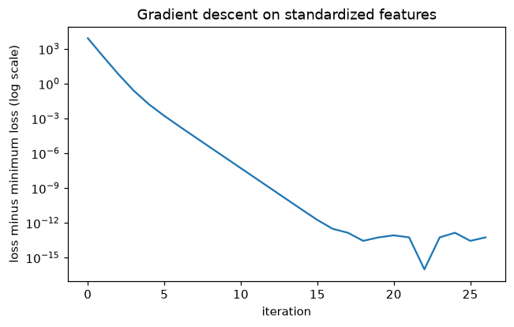

# Level 1 Capstone Solution: Linear Regression Three Ways

> **Level 1 · Capstone solution** · Back to the [capstone brief](../level-1-capstone.md)

This is a complete worked solution. Every number below comes from running the code on this page. The same code, as one runnable script, is in the repository at `scripts/capstones/level-1/linreg_three_ways.py`:

<!-- skip-run -->
```bash
python scripts/capstones/level-1/linreg_three_ways.py
```

Your numbers should match exactly if you used the same data generator and seeds. Your code can look different and still be right: check it against the acceptance checklist.

## Setup

```python
import numpy as np
import matplotlib.pyplot as plt
import statsmodels.api as sm
from scipy import stats

NAMES = ["intercept", "area_m2", "occupants", "outdoor_temp_c", "dist_coast_km"]
TRUE_BETA = np.array([20.0, 0.5, 12.0, -1.5, 0.0])   # dist_coast_km has no real effect
NOISE_SD = 15.0


def make_data(n=200, seed=42):
    """Synthetic monthly electricity bills (USD) for n homes."""
    rng = np.random.default_rng(seed)
    area = rng.normal(120, 30, n).clip(40, None)       # floor area, m^2
    occupants = rng.poisson(1.5, n) + 1                # people living there
    temp = rng.normal(15, 8, n)                        # average outdoor temperature, deg C
    dist = rng.uniform(0, 50, n)                       # distance to the coast, km
    X = np.column_stack([np.ones(n), area, occupants, temp, dist])
    y = X @ TRUE_BETA + rng.normal(0, NOISE_SD, n)
    return X, y


np.set_printoptions(suppress=True)
X, y = make_data()
n, p = X.shape
print(f"n = {n}, p = {p}, mean bill {y.mean():.2f} USD, rank of X = {np.linalg.matrix_rank(X)}")
```

```text
n = 200, p = 5, mean bill 88.01 USD, rank of X = 5
```

$\mathbf{X}$ has full column rank, 5. If it didn't (for example, if one column were a multiple of another), $\mathbf{X}^\top\mathbf{X}$ would be singular, the normal equations would have infinitely many solutions, and the coefficients would be meaningless, even though the predictions would still be fine.

## Part A: The normal equations

### Derivation 1: projection

Every prediction vector $\mathbf{X}\boldsymbol{\beta}$ is a linear combination of the columns of $\mathbf{X}$, so it lies in the column space of $\mathbf{X}$. Least squares minimizes $\lVert \mathbf{y} - \mathbf{X}\boldsymbol{\beta} \rVert$, the distance from $\mathbf{y}$ to a point in that subspace. The closest point is the orthogonal projection, characterized by a residual perpendicular to the subspace, that is, to every column:

$$
\mathbf{X}^\top(\mathbf{y} - \mathbf{X}\hat{\boldsymbol{\beta}}) = \mathbf{0} \quad\Longrightarrow\quad \mathbf{X}^\top\mathbf{X}\,\hat{\boldsymbol{\beta}} = \mathbf{X}^\top\mathbf{y}.
$$

### Derivation 2: calculus

Expand the sum of squared errors:

$$
S(\boldsymbol{\beta}) = \lVert \mathbf{X}\boldsymbol{\beta} - \mathbf{y} \rVert^2 = \boldsymbol{\beta}^\top\mathbf{X}^\top\mathbf{X}\boldsymbol{\beta} - 2\,\mathbf{y}^\top\mathbf{X}\boldsymbol{\beta} + \mathbf{y}^\top\mathbf{y}.
$$

Using $\nabla(\boldsymbol{\beta}^\top\mathbf{A}\boldsymbol{\beta}) = 2\mathbf{A}\boldsymbol{\beta}$ for symmetric $\mathbf{A}$ and $\nabla(\mathbf{a}^\top\boldsymbol{\beta}) = \mathbf{a}$:

$$
\nabla S = 2\mathbf{X}^\top\mathbf{X}\boldsymbol{\beta} - 2\mathbf{X}^\top\mathbf{y} = \mathbf{0} \quad\Longrightarrow\quad \mathbf{X}^\top\mathbf{X}\,\hat{\boldsymbol{\beta}} = \mathbf{X}^\top\mathbf{y}.
$$

The Hessian is $2\mathbf{X}^\top\mathbf{X}$, which is positive definite when $\mathbf{X}$ has full column rank, so $S$ is strictly convex and this critical point is the unique global minimum. The two derivations agree.

### Code

```python
def fit_normal_equations(X, y):
    return np.linalg.solve(X.T @ X, X.T @ y)


beta_ne = fit_normal_equations(X, y)
beta_ls = np.linalg.lstsq(X, y, rcond=None)[0]
resid = y - X @ beta_ne
r2 = 1 - resid @ resid / np.sum((y - y.mean()) ** 2)

for name, b in zip(NAMES, beta_ne):
    print(f"{name:15s} {b:10.4f}")
print("agrees with lstsq:", np.allclose(beta_ne, beta_ls))
print(f"max |X^T r| = {np.abs(X.T @ resid).max():.2e}   (compare: max |X^T y| = {np.abs(X.T @ y).max():.2e})")
print(f"R^2 = {r2:.4f}")
```

```text
intercept          30.1073
area_m2             0.4502
occupants          10.8298
outdoor_temp_c     -1.5181
dist_coast_km      -0.0336
agrees with lstsq: True
max |X^T r| = 5.55e-10   (compare: max |X^T y| = 2.16e+06)
R^2 = 0.7061
```

The residuals are orthogonal to the columns up to rounding: $10^{-10}$ against entries of $\mathbf{X}^\top\mathbf{y}$ in the millions, a relative size of about $10^{-16}$, which is machine precision. The model explains about 71% of the variance in bills; the rest is the simulated noise. The estimates are near the true values (20, 0.5, 12, −1.5, 0), but not equal: they're estimates from 200 noisy homes, which is exactly what Part C quantifies.

## Part B: Gradient descent

### Derivation

For $\mathcal{L}(\boldsymbol{\beta}) = \frac{1}{n}\lVert \mathbf{X}\boldsymbol{\beta} - \mathbf{y} \rVert^2$, Derivation 2 divided by $n$ gives

$$
\nabla\mathcal{L} = \frac{2}{n}\mathbf{X}^\top(\mathbf{X}\boldsymbol{\beta} - \mathbf{y}), \qquad \mathbf{H} = \frac{2}{n}\mathbf{X}^\top\mathbf{X}.
$$

The Hessian is constant because the loss is quadratic.

### Gradient check

```python
def mse(w, X, y):
    r = X @ w - y
    return r @ r / len(y)


def mse_grad(w, X, y):
    return 2 / len(y) * X.T @ (X @ w - y)


def numerical_grad(f, w, h=1e-6):
    g = np.zeros_like(w)
    for i in range(len(w)):
        e = np.zeros_like(w)
        e[i] = h
        g[i] = (f(w + e) - f(w - e)) / (2 * h)
    return g


w_test = np.random.default_rng(0).normal(size=p)
g_a = mse_grad(w_test, X, y)
g_n = numerical_grad(lambda v: mse(v, X, y), w_test)
print(f"relative error: {np.linalg.norm(g_a - g_n) / (np.linalg.norm(g_a) + np.linalg.norm(g_n)):.2e}")
```

```text
relative error: 4.54e-11
```

Well below $10^{-7}$: the analytical gradient is right.

### Conditioning and the learning rate

```python
def standardize(X):
    mu, sd = X[:, 1:].mean(axis=0), X[:, 1:].std(axis=0)
    return np.column_stack([np.ones(len(X)), (X[:, 1:] - mu) / sd]), mu, sd


H_raw = 2 / n * X.T @ X
Xs, mu, sd = standardize(X)
H_std = 2 / n * Xs.T @ Xs
print("eigenvalues, raw:         ", np.round(np.linalg.eigvalsh(H_raw), 3))
print("eigenvalues, standardized:", np.round(np.linalg.eigvalsh(H_std), 3))
print(f"condition number: raw {np.linalg.cond(H_raw):.2e}, standardized {np.linalg.cond(H_std):.2f}")
```

```text
eigenvalues, raw:          [    0.059     3.95    132.677   512.496 31407.249]
eigenvalues, standardized: [1.539 1.966 2.    2.102 2.393]
condition number: raw 5.30e+05, standardized 1.55
```

On raw features the curvature ranges over five orders of magnitude, because floor area (values around 120, squared to around 15,000) dominates while other directions are nearly flat. Standardizing makes every feature's scale comparable, and the loss surface becomes an almost perfectly round bowl. (The eigenvalue of exactly 2 belongs to the intercept direction: after centering, the intercept column is orthogonal to the others, and its Hessian entry is $\frac{2}{n}\cdot n = 2$.)

### Gradient descent on standardized features

Gradient descent multiplies the error along eigenvector $i$ by $1 - \eta\lambda_i$ each step, so it's stable for $\eta < 2/\lambda_{\max}$. Choose $\eta = 1/\lambda_{\max}$:

```python
def gradient_descent(X, y, eta, tol=1e-10, max_iter=100_000):
    w = np.zeros(X.shape[1])
    losses = [mse(w, X, y)]
    for it in range(1, max_iter + 1):
        g = mse_grad(w, X, y)
        w = w - eta * g
        losses.append(mse(w, X, y))
        if np.linalg.norm(g) < tol:
            break
    return w, np.array(losses), it


def unstandardize(w, mu, sd):
    slopes = w[1:] / sd
    intercept = w[0] - np.sum(w[1:] * mu / sd)
    return np.r_[intercept, slopes]


eta = 1 / np.linalg.eigvalsh(H_std).max()
w, losses, iters = gradient_descent(Xs, y, eta)
beta_gd = unstandardize(w, mu, sd)
print(f"eta = {eta:.4f}, iterations = {iters}")
print("loss never increased:", bool(np.all(np.diff(losses) <= 1e-12)))
print(f"max |beta_gd - beta_ne| = {np.abs(beta_gd - beta_ne).max():.2e}")

fig, ax = plt.subplots(figsize=(6.5, 3.8))
ax.semilogy(np.abs(losses - mse(beta_ne, X, y)) + 1e-16)
ax.set_xlabel("iteration"); ax.set_ylabel("loss minus minimum loss (log scale)")
ax.set_title("Gradient descent on standardized features")
plt.show()
```

```text
eta = 0.4179, iterations = 26
loss never increased: True
max |beta_gd - beta_ne| = 5.55e-11
```



*The excess loss falls geometrically: a straight line on a log scale, the signature of gradient descent on a well-conditioned quadratic. After about 15 iterations it hits the floor of floating-point rounding (around 1e-13 for a loss of about 220), while the gradient keeps shrinking until the stopping rule fires.*

With a condition number of 1.55, each step shrinks the slowest error component by a factor of at most $1 - \lambda_{\min}/\lambda_{\max} \approx 0.36$, so 26 iterations suffice to reach a gradient norm of $10^{-10}$. The unstandardized coefficients agree with the normal equations to about $10^{-10}$.

### Gradient descent on raw features

```python
eta_raw = 1 / np.linalg.eigvalsh(H_raw).max()
w_raw, losses_raw, _ = gradient_descent(X, y, eta_raw, max_iter=10_000)
print(f"eta = {eta_raw:.2e}")
for name, b_raw, b in zip(NAMES, w_raw, beta_ne):
    print(f"{name:15s} after 10,000 steps {b_raw:9.4f}   solution {b:9.4f}")
print(f"slowest factor per step: 1 - lambda_min/lambda_max = {1 - 1 / np.linalg.cond(H_raw):.7f}")
```

```text
eta = 3.18e-05
intercept       after 10,000 steps    0.8731   solution   30.1073
area_m2         after 10,000 steps    0.6658   solution    0.4502
occupants       after 10,000 steps    8.5316   solution   10.8298
outdoor_temp_c  after 10,000 steps   -1.3365   solution   -1.5181
dist_coast_km   after 10,000 steps    0.1846   solution   -0.0336
slowest factor per step: 1 - lambda_min/lambda_max = 0.9999981
```

On raw features, the learning rate must be tiny to stay stable in the steepest direction (dominated by floor area). Along the flattest direction (mostly the intercept), each step then shrinks the error by a factor of about $1 - 1/\kappa \approx 1 - 1.9 \times 10^{-6}$. After 10,000 steps that's $(1 - 1.9 \times 10^{-6})^{10{,}000} \approx 0.98$: almost no progress, which is why the intercept is still near 1 instead of 30, and the other coefficients are distorted to compensate. Reaching the solution would take millions of iterations. That's the condition number at work, and it's why you standardize features before gradient descent.

## Part C: Statistical inference

### Derivation of the covariance

Assume $\mathbf{X}$ is fixed and $\mathbf{y} = \mathbf{X}\boldsymbol{\beta} + \boldsymbol{\varepsilon}$, where the errors have mean zero, are uncorrelated, and have constant variance: $\operatorname{Cov}(\boldsymbol{\varepsilon}) = \sigma^2\mathbf{I}$. Substitute into the estimator:

$$
\hat{\boldsymbol{\beta}} = (\mathbf{X}^\top\mathbf{X})^{-1}\mathbf{X}^\top(\mathbf{X}\boldsymbol{\beta} + \boldsymbol{\varepsilon}) = \boldsymbol{\beta} + \mathbf{A}\boldsymbol{\varepsilon}, \qquad \mathbf{A} = (\mathbf{X}^\top\mathbf{X})^{-1}\mathbf{X}^\top.
$$

Taking expectations, $\mathbb{E}[\hat{\boldsymbol{\beta}}] = \boldsymbol{\beta}$: the estimator is unbiased. For any fixed matrix $\mathbf{A}$, $\operatorname{Cov}(\mathbf{A}\boldsymbol{\varepsilon}) = \mathbf{A}\operatorname{Cov}(\boldsymbol{\varepsilon})\mathbf{A}^\top$, so

$$
\operatorname{Cov}(\hat{\boldsymbol{\beta}}) = \sigma^2\,(\mathbf{X}^\top\mathbf{X})^{-1}\mathbf{X}^\top\mathbf{X}(\mathbf{X}^\top\mathbf{X})^{-1} = \sigma^2(\mathbf{X}^\top\mathbf{X})^{-1}.
$$

If the errors are also normal, $\hat{\boldsymbol{\beta}}$ is exactly normal, and replacing $\sigma^2$ by its estimate makes each $(\hat{\beta}_j - \beta_j)/\text{SE}_j$ follow a t distribution with $n - p$ degrees of freedom.

**Why $n - p$?** The residual vector $\mathbf{r} = (\mathbf{I} - \mathbf{P})\boldsymbol{\varepsilon}$ is the projection of the noise onto the $(n - p)$-dimensional orthogonal complement of the column space ($\mathbf{P}$ is the hat matrix). Its expected squared length is $\sigma^2$ times the trace of $\mathbf{I} - \mathbf{P}$, which is $n - p$. So $\mathbb{E}[\text{RSS}] = (n - p)\sigma^2$, and dividing by $n - p$ gives an unbiased estimate. Fitting $p$ coefficients uses up $p$ degrees of freedom, just as estimating a mean uses up one (Bessel's correction).

### Code

```python
def ols_inference(X, y, level=0.95):
    n, p = X.shape
    beta = fit_normal_equations(X, y)
    resid = y - X @ beta
    df = n - p
    sigma2 = resid @ resid / df
    cov = sigma2 * np.linalg.inv(X.T @ X)
    se = np.sqrt(np.diag(cov))
    t = beta / se
    pvals = 2 * stats.t.sf(np.abs(t), df)
    crit = stats.t.ppf(0.5 + level / 2, df)
    ci = np.column_stack([beta - crit * se, beta + crit * se])
    return {"beta": beta, "se": se, "t": t, "p": pvals, "ci": ci, "sigma2": sigma2, "df": df}


res = ols_inference(X, y)
print(f"sigma_hat = {np.sqrt(res['sigma2']):.3f}, df = {res['df']}")
print(f"{'term':15s} {'coef':>9s} {'se':>8s} {'t':>8s} {'p':>9s}   95% CI")
for i, name in enumerate(NAMES):
    print(f"{name:15s} {res['beta'][i]:9.4f} {res['se'][i]:8.4f} {res['t'][i]:8.2f} "
          f"{res['p'][i]:9.2e}   ({res['ci'][i, 0]:.3f}, {res['ci'][i, 1]:.3f})")
```

```text
sigma_hat = 14.910, df = 195
term                 coef       se        t         p   95% CI
intercept         30.1073   6.1193     4.92  1.83e-06   (18.039, 42.176)
area_m2            0.4502   0.0409    11.02  2.97e-22   (0.370, 0.531)
occupants         10.8298   0.7840    13.81  1.03e-30   (9.284, 12.376)
outdoor_temp_c    -1.5181   0.1327   -11.44  1.62e-23   (-1.780, -1.256)
dist_coast_km     -0.0336   0.0754    -0.44  6.57e-01   (-0.182, 0.115)
```

### Check against statsmodels

```python
sm_fit = sm.OLS(y, X).fit()
print("coefficients:        ", np.allclose(res["beta"], sm_fit.params))
print("standard errors:     ", np.allclose(res["se"], sm_fit.bse))
print("t-statistics:        ", np.allclose(res["t"], sm_fit.tvalues))
print("p-values:            ", np.allclose(res["p"], sm_fit.pvalues))
print("confidence intervals:", np.allclose(res["ci"], sm_fit.conf_int(0.05)))
print(f"R^2: {sm_fit.rsquared:.4f}")
```

```text
coefficients:         True
standard errors:      True
t-statistics:         True
p-values:             True
confidence intervals: True
R^2: 0.7061
```

Every quantity matches statsmodels. (`sm_fit.summary()` prints all of this as one table.)

### Answers for Priya

1. **What drives the bill?** Holding the other factors fixed: each extra square meter of floor area adds about **USD 0.45 per month** (95% CI: 0.37 to 0.53), so 10 extra square meters add about USD 4.50. Each extra occupant adds about **USD 10.83 per month** (95% CI: 9.28 to 12.38). Each extra degree of average outdoor temperature *lowers* the bill by about **USD 1.52 per month** (95% CI: 1.26 to 1.78), consistent with less heating in warmer places.
2. **How sure are we?** The confidence intervals above are the ranges. All three effects are estimated precisely: their t-statistics are above 10 in absolute value, and their p-values are astronomically small, so there's no doubt about their direction. The intervals are the more useful output, because they say how big each effect plausibly is.
3. **The coastal claim.** The estimated effect of distance to the coast is −USD 0.03 per km, with a 95% CI of −0.18 to 0.12 and $p = 0.66$. The data show **no evidence** that coastal distance affects bills. That's not proof of zero effect: the interval says any effect is at most about USD 0.18 per km in either direction, which over 50 km could still be up to about USD 9 a month. If the sales team wants to keep making the claim, they need data that shows it, not just the absence of a contradiction. (In this simulation we know the truth is exactly zero, and the interval correctly contains it.)

## Part D: Checking the inference by simulation

```python
def coverage_simulation(reps=2000, n=200, level=0.95):
    covered = np.zeros(len(TRUE_BETA))
    betas, ses = [], []
    for r in range(reps):
        Xr, yr = make_data(n, seed=1000 + r)
        out = ols_inference(Xr, yr, level)
        covered += (out["ci"][:, 0] <= TRUE_BETA) & (TRUE_BETA <= out["ci"][:, 1])
        betas.append(out["beta"])
        ses.append(out["se"])
    return covered / reps, np.std(betas, axis=0, ddof=1), np.mean(ses, axis=0)


cover, emp_sd, mean_se = coverage_simulation()
print(f"{'term':15s} {'coverage':>8s} {'sd of estimates':>16s} {'mean SE':>8s}")
for i, name in enumerate(NAMES):
    print(f"{name:15s} {cover[i]:8.3f} {emp_sd[i]:16.4f} {mean_se[i]:8.4f}")
```

```text
term            coverage  sd of estimates  mean SE
intercept          0.954           5.7290   5.6461
area_m2            0.952           0.0361   0.0358
occupants          0.953           0.8772   0.8773
outdoor_temp_c     0.954           0.1340   0.1342
dist_coast_km      0.944           0.0757   0.0742
```

Every coverage is within the 93.5%–96.5% band. With 2,000 simulations, the Monte Carlo standard error of a coverage estimate is about $\sqrt{0.95 \times 0.05/2000} \approx 0.005$, so values from 0.944 to 0.954 are all consistent with exactly 95%. The standard error formula also describes reality: the average reported SE closely matches the actual spread of the estimates across datasets.

This is the payoff of the whole level. The formula $\sigma^2(\mathbf{X}^\top\mathbf{X})^{-1}$ came from linear algebra and the rules for variances of linear combinations; the t-interval came from the sampling distribution of an estimator; and simulation, which the law of large numbers justifies, confirms that they're right. (In each simulated dataset the feature values are redrawn too, so this checks the intervals averaged over designs as well as over noise. They hold up either way.)

## Stretch goals

### Bootstrap standard errors

```python
rng = np.random.default_rng(7)
boot = np.array([fit_normal_equations(X[idx], y[idx])
                 for idx in rng.integers(0, n, size=(2000, n))])      # resample homes
print(f"{'term':15s} {'formula SE':>10s} {'bootstrap SE':>12s}")
for i, name in enumerate(NAMES):
    print(f"{name:15s} {res['se'][i]:10.4f} {boot[:, i].std(ddof=1):12.4f}")
```

```text
term            formula SE bootstrap SE
intercept           6.1193       5.6379
area_m2             0.0409       0.0380
occupants           0.7840       0.8007
outdoor_temp_c      0.1327       0.1261
dist_coast_km       0.0754       0.0702
```

The bootstrap, which uses no formula at all, agrees with the analytical standard errors to within about 10%, which is as close as you can expect from 2,000 resamples of a single dataset of 200 homes. That's reassuring when the model's assumptions hold. When they don't, the bootstrap (resampling whole rows) remains valid while the formula breaks, as the next experiment shows.

### Heteroscedastic noise

```python
def make_data_hetero(n=200, seed=42):
    X, _ = make_data(n, seed)
    rng = np.random.default_rng(seed + 10_000)
    noise_sd = 15.0 * (X[:, 1] / 120) ** 2                     # noise grows with floor area
    return X, X @ TRUE_BETA + rng.normal(0, noise_sd)

cov_classic, cov_hc3 = np.zeros(5), np.zeros(5)
for r in range(1000):
    Xh, yh = make_data_hetero(seed=5000 + r)
    fit = sm.OLS(yh, Xh).fit()
    ci_c = fit.conf_int(0.05)
    ci_r = sm.OLS(yh, Xh).fit(cov_type="HC3").conf_int(0.05)
    cov_classic += (ci_c[:, 0] <= TRUE_BETA) & (TRUE_BETA <= ci_c[:, 1])
    cov_hc3 += (ci_r[:, 0] <= TRUE_BETA) & (TRUE_BETA <= ci_r[:, 1])
for i, name in enumerate(NAMES):
    print(f"{name:15s} classic {cov_classic[i] / 1000:.3f}   HC3 {cov_hc3[i] / 1000:.3f}")
```

```text
intercept       classic 0.936   HC3 0.954
area_m2         classic 0.893   HC3 0.948
occupants       classic 0.946   HC3 0.941
outdoor_temp_c  classic 0.949   HC3 0.957
dist_coast_km   classic 0.947   HC3 0.948
```

When the noise grows with floor area, the constant-variance assumption behind $\sigma^2(\mathbf{X}^\top\mathbf{X})^{-1}$ fails. The classic intervals become too narrow where it matters most: the area coefficient's interval covers the truth only about 89% of the time, and the intercept's falls short too. **Heteroscedasticity-robust** ("sandwich") standard errors, such as HC3, replace $\sigma^2\mathbf{I}$ with an estimate of each observation's own variance and restore coverage close to 95%. In real data, robust standard errors are a sensible default.

### A perfectly collinear column

```python
X_bad = np.column_stack([X, X[:, 1] * 10.7639])               # area in square feet
print("rank:", np.linalg.matrix_rank(X_bad), "of", X_bad.shape[1])
print(f"cond(X^T X) = {np.linalg.cond(X_bad.T @ X_bad):.1e}")
b_min = np.linalg.lstsq(X_bad, y, rcond=None)[0]
print("lstsq (minimum norm):", np.round(b_min, 4))
print("same predictions:", np.allclose(X_bad @ b_min, X @ beta_ne))
```

```text
rank: 5 of 6
cond(X^T X) = 1.0e+17
lstsq (minimum norm): [30.1073  0.0039 10.8298 -1.5181 -0.0336  0.0415]
same predictions: True
```

With area in both square meters and square feet, the design matrix has rank 5 out of 6 columns, and $\mathbf{X}^\top\mathbf{X}$ is singular (its condition number is effectively infinite). The normal equations can't be solved reliably; `solve` may raise an error or return garbage, depending on rounding. `lstsq` returns the minimum-norm solution, which splits the area effect between the two columns (0.0039 per m² plus 0.0415 per ft², which is $0.0039 + 0.0415 \times 10.7639 \approx 0.450$ per m²) and gives identical predictions. Gradient descent from zero would converge to the same minimum-norm split. Inference breaks down entirely: the individual coefficients aren't identifiable, so their standard errors are infinite. The fix is to drop the redundant column.

## Common mistakes

- **Using `np.linalg.inv(X.T @ X) @ X.T @ y`** for the fit. It works here, but `solve` or `lstsq` is faster and more accurate. You do need the inverse (or its diagonal) for standard errors, which is fine for a $5 \times 5$ matrix.
- **Dividing RSS by $n$ instead of $n - p$.** Your standard errors come out slightly too small, and statsmodels won't match.
- **Using normal critical values (1.96) instead of t critical values.** With 195 degrees of freedom the difference is small (1.972 versus 1.960), but it's enough to fail an `np.allclose` check and it matters for small samples.
- **Forgetting to convert standardized coefficients back** to the original units before comparing with the normal equations.
- **Reading $p = 0.66$ as "proof of no effect".** It means the data are consistent with no effect, and the confidence interval tells you how large an effect you can rule out.
