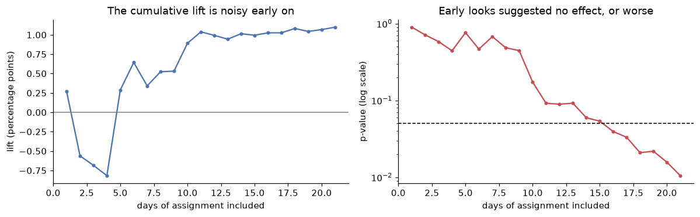
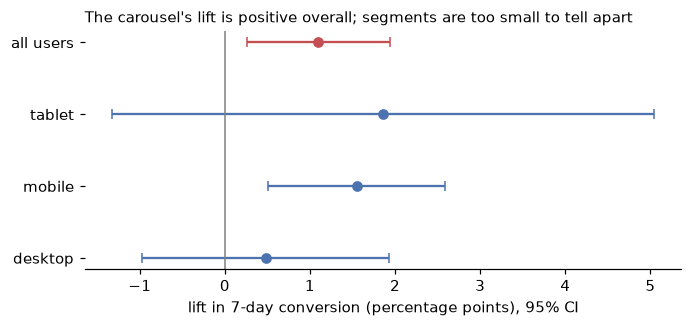

# Level 2 capstone solution: a full data science investigation

> **Level 2 · Capstone solution** · Back to the [capstone brief](../level-2-capstone.md)

This is one complete, worked solution. Yours can differ in structure, tools, and wording and still be right: compare it against the [acceptance checklist](../level-2-capstone.md#acceptance-checklist), not line by line. The code is also saved in the repository as `scripts/capstones/level-2/make_shop_data.py` (the generator) and `scripts/capstones/level-2/solution.py` (everything below, as one script). To reproduce it:

<!-- skip-run -->
```bash
cd scripts/capstones/level-2
python make_shop_data.py     # writes shopco.duckdb
python solution.py           # prints every result and writes figures/ and clean/
```

The numbers below come from running exactly this code with the default seed.

## Setup

??? example "The capstone data generator: make_shop_data.py (expand and run this first)"

    ```python
    """Generate the Level 2 capstone database: ShopCo's 2024 history plus a January 2025 A/B test.

    Usage:
        python make_shop_data.py                    # writes shopco.duckdb in the current directory
        from make_shop_data import make_capstone_data
        tables = make_capstone_data()               # dict of pandas DataFrames

    The data is synthetic and deliberately messy, like the data in the Level 2 chapters.
    """
    from pathlib import Path

    import duckdb
    import numpy as np
    import pandas as pd


    def make_shop(n_users=5000, seed=42):
        """Messy, seeded synthetic data for ShopCo: returns (users, events, orders)."""
        rng = np.random.default_rng(seed)
        start = pd.Timestamp("2024-01-01", tz="UTC")
        end = pd.Timestamp("2025-01-01", tz="UTC")

        # ---------- users ----------
        uid = np.arange(1001, 1001 + n_users)
        country = rng.choice(["US", "UK", "DE", "IN", "BR"], n_users, p=[.40, .20, .15, .15, .10])
        p_mobile = pd.Series(country).map({"US": .35, "UK": .80, "DE": .45, "IN": .80, "BR": .60}).to_numpy()
        device = np.where(rng.random(n_users) < p_mobile, "mobile",
                          rng.choice(["desktop", "tablet"], n_users, p=[.85, .15]))
        channel = rng.choice(["organic", "paid_search", "social", "email", "referral"],
                             n_users, p=[.35, .25, .20, .10, .10])
        signup = start + pd.to_timedelta(rng.uniform(0, 330, n_users), unit="D")
        age_true = np.clip(rng.normal(36, 11, n_users), 18, 80).round()
        age = age_true.copy()
        age[rng.random(n_users) < np.where(device == "mobile", .15, .04)] = np.nan  # mobile form skips age
        age[rng.choice(n_users, 25, replace=False)] = -1                           # "unknown" sentinel
        age[rng.choice(n_users, 4, replace=False)] = [230, 199, 340, 2]            # typos
        variants = {"US": ["us", "USA", "United States"], "UK": ["uk", "U.K.", "United Kingdom"],
                    "DE": ["de", "Germany"], "IN": ["India", " IN"], "BR": ["Brazil", "br "]}
        messy = rng.random(n_users) < 0.2
        country_raw = [rng.choice(variants[c]) if m else c for c, m in zip(country, messy)]
        users = pd.DataFrame({
            "user_id": uid,
            "signup_at": signup.strftime("%Y-%m-%d %H:%M:%S"),    # UTC, stored as text
            "country": country_raw, "device": device, "channel": channel, "age": age,
        })
        users = pd.concat([users, users.sample(60, random_state=seed)])  # double-submitted forms

        # ---------- sessions and funnel events ----------
        lam = pd.Series(channel).map({"email": 9, "referral": 7, "organic": 6,
                                      "social": 4, "paid_search": 4}).to_numpy()
        n_sess = rng.poisson(lam * rng.gamma(2, 0.5, n_users))
        s_user = np.repeat(np.arange(n_users), n_sess)
        s_dev, s_cty = device[s_user], country[s_user]
        # visits follow a daily rhythm in the customer's *local* time, peaking in the evening
        hour_w = np.array([3, 2, 1, 1, 1, 1, 2, 3, 4, 5, 5, 6, 7, 6, 6, 6, 6, 7, 8, 10, 11, 10, 8, 5])
        local_s = rng.choice(24, len(s_user), p=hour_w / hour_w.sum()) * 3600 + rng.uniform(0, 3600, len(s_user))
        utc_off = pd.Series(s_cty).map({"US": -5, "UK": 0, "DE": 1, "IN": 5.5, "BR": -3}).to_numpy()
        day = (signup[s_user] + (end - signup[s_user]) * rng.random(len(s_user))).floor("D")
        s_start = day + pd.to_timedelta(local_s - utc_off * 3600, unit="s")
        s_start = s_start.where(s_start > signup[s_user], signup[s_user] + pd.Timedelta(minutes=5))
        s_start = s_start.where(s_start < end - pd.Timedelta(hours=1), end - pd.Timedelta(hours=1))
        p_buy = np.select([s_dev == "desktop", s_dev == "tablet"], [.85, .70], .40) + .12 * (s_cty == "UK")
        cart = rng.random(len(s_user)) < .35
        checkout = cart & (rng.random(len(s_user)) < .60)
        purchase = checkout & (rng.random(len(s_user)) < p_buy)
        t_cart = s_start + pd.to_timedelta(rng.uniform(30, 600, len(s_user)), unit="s")
        t_chk = t_cart + pd.to_timedelta(rng.uniform(30, 300, len(s_user)), unit="s")
        t_buy = t_chk + pd.to_timedelta(rng.uniform(10, 120, len(s_user)), unit="s")
        sid = np.arange(1, len(s_user) + 1)
        parts = []
        for name, mask, t in [("page_view", np.ones(len(s_user), bool), s_start), ("add_to_cart", cart, t_cart),
                              ("checkout", checkout, t_chk), ("purchase", purchase, t_buy)]:
            parts.append(pd.DataFrame({"session_id": sid[mask], "user_id": uid[s_user][mask],
                                       "event_type": name, "ts_ms": t[mask].as_unit("ms").asi8}))
        events = pd.concat(parts).sort_values("ts_ms", ignore_index=True)
        events = pd.concat([events, events.sample(frac=.01, random_state=seed)])  # client retries
        events = events.sort_values("ts_ms", ignore_index=True)
        events.insert(0, "event_id", np.arange(1, len(events) + 1))

        # ---------- orders (one per purchase session) ----------
        o_idx = np.flatnonzero(purchase)
        n_o = len(o_idx)
        cats = np.array(["electronics", "home", "fashion", "books", "beauty"])
        cat = rng.choice(cats, n_o, p=[.20, .25, .25, .15, .15])
        median = pd.Series(cat).map({"electronics": 120, "home": 60, "fashion": 45,
                                     "books": 18, "beauty": 30}).to_numpy()
        n_items = 1 + rng.poisson(.6, n_o)
        spend = median * n_items ** .7 * np.exp(.01 * (age_true[s_user][o_idx] - 36))
        amount = np.round(spend * rng.lognormal(0, .5, n_o), 2)
        status = rng.choice(["completed", "cancelled", "refunded"], n_o, p=[.90, .05, .05])
        amount[(status == "refunded") & (rng.random(n_o) < .5)] *= -1          # some refunds stored negative
        amount[rng.random(n_o) < .015] = np.nan                                 # lost in a migration
        amount[rng.choice(n_o, 4, replace=False)] = 99999.0                     # QA test orders
        cat_raw = cat.astype(object)
        r = rng.random(n_o)
        cat_raw[r < .10] = np.char.title(cat[r < .10].astype(str))
        cat_raw[(r >= .10) & (r < .15)] = np.char.upper(cat[(r >= .10) & (r < .15)].astype(str))
        cat_raw[(r >= .15) & (r < .20)] = np.char.add(cat[(r >= .15) & (r < .20)].astype(str), " ")
        coupon = rng.choice(np.array([None, "WELCOME10", "SPRING20", "FREESHIP"], dtype=object),
                            n_o, p=[.80, .08, .06, .06])
        # timestamps: web writes UTC with "Z"; the mobile app writes local time with an offset
        t = pd.Series(t_buy[o_idx])
        o_dev, o_cty = s_dev[o_idx], s_cty[o_idx]
        ts = t.dt.strftime("%Y-%m-%dT%H:%M:%SZ")
        tzs = {"US": "America/New_York", "UK": "Europe/London", "DE": "Europe/Berlin",
               "IN": "Asia/Kolkata", "BR": "America/Sao_Paulo"}
        for c, tz in tzs.items():
            m = (o_dev == "mobile") & (o_cty == c)
            local = t[m].dt.tz_convert(tz).dt.strftime("%Y-%m-%d %H:%M:%S%z")
            ts[m] = local.str[:-2] + ":" + local.str[-2:]
        orders = pd.DataFrame({
            "order_id": np.arange(500001, 500001 + n_o), "user_id": uid[s_user][o_idx],
            "order_ts": ts.to_numpy(), "category": cat_raw, "amount_usd": amount,
            "n_items": n_items, "status": status, "coupon": coupon,
        })
        orphans = orders.sample(15, random_state=seed).assign(user_id=lambda d: d.user_id + 90000,
                                                              order_id=lambda d: d.order_id + 50000)
        orders = pd.concat([orders, orphans, orders.sample(frac=.02, random_state=seed + 1)])
        orders = orders.sample(frac=1, random_state=seed).reset_index(drop=True)
        return users.reset_index(drop=True), events, orders


    def make_capstone_data(n_users=8000, seed=2043):
        """Return a dict of raw tables: users, events, orders, assignments."""
        users, events, orders = make_shop(n_users=n_users, seed=seed)
        rng = np.random.default_rng(seed + 1)

        # ---------- January 2025: the "recommended for you" carousel experiment ----------
        start = pd.Timestamp("2025-01-06", tz="UTC")
        n = 24_000                                    # new customers who signed up during the 3-week test
        uid = np.arange(200_001, 200_001 + n)
        assigned = start + pd.to_timedelta(rng.uniform(0, 21, n), unit="D")
        country = rng.choice(["US", "UK", "DE", "IN", "BR"], n, p=[.40, .20, .15, .15, .10])
        device = rng.choice(["mobile", "desktop", "tablet"], n, p=[.55, .38, .07])
        channel = rng.choice(["organic", "paid_search", "social", "email", "referral"], n, p=[.35, .25, .20, .10, .10])
        app = np.where(device == "mobile", rng.choice(["5.0.2", "5.1.0"], n, p=[.6, .4]), "web")
        variant = np.where(rng.random(n) < 0.5, "treatment", "control")
        base = np.select([device == "desktop", device == "tablet"], [.16, .14], .09)
        p = base * np.where(variant == "treatment", 1.10, 1.0)          # true effect: +10% relative
        buys = rng.random(n) < p
        late = ~buys & (rng.random(n) < .03)                            # buys, but after the 7-day window
        t_order = np.where(buys, rng.uniform(0, 7, n), rng.uniform(7.5, 14, n))
        order_at = assigned + pd.to_timedelta(t_order, unit="D")
        has_order = buys | late
        k = int(has_order.sum())

        new_users = pd.DataFrame({
            "user_id": uid, "signup_at": (assigned - pd.Timedelta(minutes=2)).strftime("%Y-%m-%d %H:%M:%S"),
            "country": country, "device": device, "channel": channel,
            "age": np.where(rng.random(n) < .1, np.nan, np.clip(rng.normal(36, 11, n), 18, 80).round()),
        })
        cats = np.array(["electronics", "home", "fashion", "books", "beauty"])
        cat = rng.choice(cats, k, p=[.20, .25, .25, .15, .15])
        median = pd.Series(cat).map({"electronics": 120, "home": 60, "fashion": 45, "books": 18, "beauty": 30}).to_numpy()
        n_items = 1 + rng.poisson(.6, k)
        amount = np.round(median * n_items ** .7 * rng.lognormal(0, .5, k), 2)
        status = rng.choice(["completed", "cancelled", "refunded"], k, p=[.90, .05, .05])
        amount[(status == "refunded") & (rng.random(k) < .5)] *= -1
        cat_raw = cat.astype(object)
        r = rng.random(k)
        cat_raw[r < .10] = np.char.title(cat[r < .10].astype(str))
        t = pd.Series(order_at[has_order])
        ts = t.dt.strftime("%Y-%m-%dT%H:%M:%SZ")
        tzs = {"US": "America/New_York", "UK": "Europe/London", "DE": "Europe/Berlin",
               "IN": "Asia/Kolkata", "BR": "America/Sao_Paulo"}
        for c, tz in tzs.items():
            m = (device[has_order] == "mobile") & (country[has_order] == c)
            local = t[m].dt.tz_convert(tz).dt.strftime("%Y-%m-%d %H:%M:%S%z")
            ts[m] = local.str[:-2] + ":" + local.str[-2:]
        new_orders = pd.DataFrame({
            "order_id": np.arange(800_001, 800_001 + k), "user_id": uid[has_order], "order_ts": ts.to_numpy(),
            "category": cat_raw, "amount_usd": amount, "n_items": n_items, "status": status,
            "coupon": rng.choice(np.array([None, "WELCOME10"], dtype=object), k, p=[.7, .3]),
        })

        assignments = pd.DataFrame({
            "user_id": uid, "experiment": "reco-carousel-v1", "variant": variant,
            "assigned_at": assigned.strftime("%Y-%m-%dT%H:%M:%SZ"), "app_version": app,
        })
        # Bug: app 5.1.0 failed to log most treatment assignments during the first week
        lost = ((assignments["variant"] == "treatment") & (assignments["app_version"] == "5.1.0")
                & (assigned < start + pd.Timedelta(days=7)) & (rng.random(n) < .9))
        assignments = assignments[~lost]
        # Cookie resets: a few users were re-assigned, sometimes to the other variant
        flip = assignments.sample(60, random_state=seed).copy()
        flip["variant"] = np.where(flip["variant"] == "treatment", "control", "treatment")
        flip["assigned_at"] = (pd.to_datetime(flip["assigned_at"]) + pd.Timedelta(hours=5)).dt.strftime("%Y-%m-%dT%H:%M:%SZ")
        assignments = pd.concat([assignments, flip, assignments.sample(frac=.01, random_state=seed + 2)])
        assignments = assignments.sample(frac=1, random_state=seed).reset_index(drop=True)

        users = pd.concat([users, new_users], ignore_index=True)
        orders = pd.concat([orders, new_orders], ignore_index=True).sample(frac=1, random_state=seed).reset_index(drop=True)
        return {"users": users, "events": events, "orders": orders, "assignments": assignments}


    def write_database(path="shopco.duckdb", **kwargs):
        """Write the raw tables into a DuckDB database file, replacing any previous copy."""
        path = Path(path)
        path.unlink(missing_ok=True)
        tables = make_capstone_data(**kwargs)
        with duckdb.connect(str(path)) as con:
            for name, df in tables.items():
                con.register("tmp_df", df)
                con.execute(f"CREATE TABLE {name} AS SELECT * FROM tmp_df")
                con.unregister("tmp_df")
        return {name: len(df) for name, df in tables.items()}
    ```

```python
from pathlib import Path

import duckdb
import matplotlib.pyplot as plt
import numpy as np
import pandas as pd
from scipy import stats

pd.set_option("display.width", 120)
pd.set_option("display.max_columns", 20)
Path("figures").mkdir(exist_ok=True)
Path("clean").mkdir(exist_ok=True)

def save_and_show(fig, name):
    fig.savefig(f"figures/{name}.png", dpi=120, bbox_inches="tight")
    plt.show()

print(write_database("shopco.duckdb"))
con = duckdb.connect("shopco.duckdb")
con.sql("SET TimeZone = 'UTC'")
```

```text
{'users': 32060, 'events': 75251, 'orders': 9437, 'assignments': 23530}
```

## Part A: SQL

### A1. Row counts, keys, and orphans

The first query checks every table's grain: does the supposed key identify rows uniquely?

```python
print(con.sql("""
SELECT 'users' AS tbl, COUNT(*) AS n_rows, COUNT(DISTINCT user_id) AS n_keys, 'user_id' AS key FROM users
UNION ALL SELECT 'orders', COUNT(*), COUNT(DISTINCT order_id), 'order_id' FROM orders
UNION ALL SELECT 'events', COUNT(*), COUNT(DISTINCT (session_id, event_type, ts_ms)), 'event content' FROM events
UNION ALL SELECT 'assignments', COUNT(*), COUNT(DISTINCT user_id), 'user_id' FROM assignments
""").df())
print(con.sql("""
SELECT COUNT(*) AS orphan_orders
FROM orders o WHERE NOT EXISTS (SELECT 1 FROM users u WHERE u.user_id = o.user_id)
""").df())
```

```text
           tbl  n_rows  n_keys            key
0        users   32060   32000        user_id
1       orders    9437    9324       order_id
2       events   75251   74506  event content
3  assignments   23530   23238        user_id
   orphan_orders
0             15
```

Every table has more rows than keys, so every table has duplicates, and some orders belong to no known user. Everything that follows uses deduplicated views.

### A2. Provisional clean views and monthly revenue

```python
con.sql("""
CREATE OR REPLACE TEMP VIEW users_clean AS
SELECT DISTINCT user_id, CAST(signup_at AS TIMESTAMP) AS signup_at,
    CASE upper(trim(country))
        WHEN 'USA' THEN 'US' WHEN 'UNITED STATES' THEN 'US' WHEN 'U.K.' THEN 'UK'
        WHEN 'UNITED KINGDOM' THEN 'UK' WHEN 'GERMANY' THEN 'DE' WHEN 'INDIA' THEN 'IN'
        WHEN 'BRAZIL' THEN 'BR' ELSE upper(trim(country)) END AS country,
    device, channel, CASE WHEN age BETWEEN 13 AND 100 THEN age END AS age
FROM users
""")
con.sql("""
CREATE OR REPLACE TEMP VIEW orders_clean AS
SELECT DISTINCT order_id, user_id, CAST(order_ts AS TIMESTAMPTZ) AS order_ts,
       lower(trim(category)) AS category, abs(amount_usd) AS amount_usd, n_items, status
FROM orders
WHERE (amount_usd IS NULL OR amount_usd <> 99999)
  AND user_id IN (SELECT user_id FROM users)
""")
monthly = con.sql("""
SELECT date_trunc('month', order_ts) AS month, COUNT(*) AS orders, ROUND(SUM(amount_usd), 2) AS revenue_usd
FROM orders_clean
WHERE status = 'completed' AND order_ts < TIMESTAMPTZ '2025-01-01 00:00:00+00'
GROUP BY month ORDER BY month
""").df()
print(monthly.assign(month=monthly["month"].dt.strftime("%Y-%m")).to_string(index=False))
```

```text
  month  orders  revenue_usd
2024-01      22      2124.62
2024-02      56      5401.80
2024-03      98      7441.08
2024-04     139     11577.92
2024-05     206     18075.06
2024-06     299     28360.40
2024-07     359     30978.12
2024-08     439     41435.89
2024-09     551     50196.10
2024-10     760     65526.65
2024-11     976     83877.52
2024-12    1181    101372.94
```

Revenue grows every month, from about USD 2,000 in January to about USD 101,000 in December, because every month adds new customers while earlier ones keep ordering. The `CAST(... AS TIMESTAMPTZ)` applies each row's offset, and `SET TimeZone = 'UTC'` makes the monthly boundaries UTC.

### A3. The 2024 funnel by device

```python
funnel = con.sql("""
WITH ev AS (SELECT DISTINCT session_id, user_id, event_type FROM events)
SELECT u.device,
       COUNT(DISTINCT session_id) AS sessions,
       COUNT(DISTINCT session_id) FILTER (WHERE event_type = 'add_to_cart') AS carts,
       COUNT(DISTINCT session_id) FILTER (WHERE event_type = 'checkout') AS checkouts,
       COUNT(DISTINCT session_id) FILTER (WHERE event_type = 'purchase') AS purchases,
       ROUND(100.0 * purchases / sessions, 1) AS session_conv_pct,
       ROUND(100.0 * purchases / checkouts, 1) AS checkout_to_purchase_pct
FROM ev JOIN users_clean u USING (user_id)
GROUP BY u.device ORDER BY sessions DESC
""").df()
print(funnel.to_string(index=False))
```

```text
 device  sessions  carts  checkouts  purchases  session_conv_pct  checkout_to_purchase_pct
 mobile     24665   8708       5185       2208               9.0                      42.6
desktop     16318   5786       3481       3014              18.5                      86.6
 tablet      3070   1045        604        422              13.7                      69.9
```

Mobile and desktop sessions reach checkout at the same rate (about 21%), but only 43% of mobile checkouts become purchases, against 87% on desktop. That's the biggest single opportunity in the data.

### A4. Revenue concentration

`NTILE(10)` splits customers into ten equal-sized groups by revenue. Customers with no completed orders count as zero, through the `LEFT JOIN` from all 2024 signups.

```python
print(con.sql("""
WITH rev AS (
    SELECT u.user_id, COALESCE(SUM(o.amount_usd) FILTER (WHERE o.status = 'completed'), 0) AS revenue
    FROM users_clean u
    LEFT JOIN orders_clean o ON o.user_id = u.user_id AND o.order_ts < TIMESTAMPTZ '2025-01-01 00:00:00+00'
    WHERE u.signup_at < TIMESTAMP '2025-01-01'
    GROUP BY u.user_id
),
deciles AS (SELECT revenue, NTILE(10) OVER (ORDER BY revenue DESC) AS decile FROM rev)
SELECT ROUND(100 * SUM(revenue) FILTER (WHERE decile = 1) / SUM(revenue), 1) AS top10_share_pct,
       ROUND(100 * AVG((revenue > 0)::INT), 1) AS pct_customers_with_revenue
FROM deciles
""").df())
```

```text
   top10_share_pct  pct_customers_with_revenue
0             58.8                        40.0
```

The top 10% of 2024 customers produced 59% of revenue, and only 40% of customers bought anything at all.

### A5. Time from first to second order

```python
print(con.sql("""
WITH seq AS (
    SELECT user_id, order_ts,
           ROW_NUMBER() OVER (PARTITION BY user_id ORDER BY order_ts) AS n,
           LAG(order_ts) OVER (PARTITION BY user_id ORDER BY order_ts) AS prev_ts
    FROM orders_clean
    WHERE status = 'completed' AND order_ts < TIMESTAMPTZ '2025-01-01 00:00:00+00'
)
SELECT COUNT(*) AS customers_with_2nd_order,
       MEDIAN(date_diff('day', prev_ts, order_ts)) AS median_days_1st_to_2nd
FROM seq WHERE n = 2
""").df())
```

```text
   customers_with_2nd_order  median_days_1st_to_2nd
0                      1144                    40.0
```

Among customers with a second order, the median gap is 40 days. This is censored by the end of the year (customers who signed up late had little time for a second order), so the typical gap for all customers is probably longer than 40 days.

## Part B: Cleaning

### B1. A logged cleaning function

The rules are the ones from Chapter 2, plus rules for the assignment log. Every rule records how many rows it touched.

```python
COUNTRY_MAP = {"US": "US", "USA": "US", "UNITED STATES": "US", "UK": "UK", "U.K.": "UK",
               "UNITED KINGDOM": "UK", "DE": "DE", "GERMANY": "DE", "IN": "IN", "INDIA": "IN",
               "BR": "BR", "BRAZIL": "BR"}
log = []

def note(table, rule, before, after):
    log.append({"table": table, "rule": rule, "rows_before": before, "rows_after": after})

raw = {name: con.table(name).df() for name in ["users", "events", "orders", "assignments"]}

u = raw["users"]
n0 = len(u); u = u.drop_duplicates(); note("users", "drop exact duplicates", n0, len(u))
u["signup_at"] = pd.to_datetime(u["signup_at"], utc=True)
u["country"] = u["country"].str.strip().str.upper().map(COUNTRY_MAP)
assert u["country"].notna().all(), "unmapped country spelling"
bad_age = ~u["age"].between(13, 100) & u["age"].notna()
note("users", f"invalid age -> missing ({bad_age.sum()} values)", len(u), len(u))
u["age"] = u["age"].where(u["age"].between(13, 100))

ev = raw["events"]
n0 = len(ev); ev = ev.drop_duplicates(subset=["session_id", "user_id", "event_type", "ts_ms"])
note("events", "drop retried duplicates (same content, new event_id)", n0, len(ev))
ev["ts"] = pd.to_datetime(ev["ts_ms"], unit="ms", utc=True)

o = raw["orders"]
n0 = len(o); o = o.drop_duplicates(); note("orders", "drop exact duplicates", n0, len(o))
assert o["order_id"].is_unique
n0 = len(o); o = o[o["user_id"].isin(u["user_id"])]; note("orders", "drop orphan orders", n0, len(o))
n0 = len(o); o = o[o["amount_usd"].ne(99999.0)]; note("orders", "drop QA test orders (99999)", n0, len(o))
o["order_ts"] = pd.to_datetime(o["order_ts"], utc=True, format="ISO8601")
o["category"] = o["category"].str.strip().str.lower()
o["amount_usd"] = o["amount_usd"].abs()

a = raw["assignments"]
n0 = len(a); a = a.drop_duplicates(); note("assignments", "drop exact duplicates", n0, len(a))
a["assigned_at"] = pd.to_datetime(a["assigned_at"], utc=True)
in_both = a.groupby("user_id")["variant"].nunique().loc[lambda s: s > 1].index
n0 = len(a); a = a[~a["user_id"].isin(in_both)]; note("assignments", "drop users seen in both variants", n0, len(a))
n0 = len(a); a = a.sort_values("assigned_at").drop_duplicates("user_id"); note("assignments", "keep first assignment per user", n0, len(a))

print(pd.DataFrame(log).to_string(index=False))
for name, df in [("users", u), ("events", ev), ("orders", o), ("assignments", a)]:
    df.to_parquet(f"clean/{name}.parquet", index=False)
```

```text
      table                                                 rule  rows_before  rows_after
      users                                drop exact duplicates        32060       32000
      users                   invalid age -> missing (29 values)        32000       32000
     events drop retried duplicates (same content, new event_id)        75251       74506
     orders                                drop exact duplicates         9437        9324
     orders                                   drop orphan orders         9324        9309
     orders                          drop QA test orders (99999)         9309        9305
assignments                                drop exact duplicates        23530       23298
assignments                     drop users seen in both variants        23298       23178
assignments                       keep first assignment per user        23178       23178
```

The log is the backbone of the report's data-quality appendix. Note that the 60 customers assigned to both variants were removed entirely, not assigned to one arm: we can't know which experience they actually had.

### B2. Data contracts

```python
def validate(df, contract):
    problems = []
    for col, rules in contract.items():
        s = df[col]
        if rules.get("unique") and s.duplicated().any():
            problems.append(f"{col}: duplicates")
        if rules.get("nullable") is False and s.isna().any():
            problems.append(f"{col}: nulls")
        if "allowed" in rules and not set(s.dropna().astype(str)) <= rules["allowed"]:
            problems.append(f"{col}: unexpected values {sorted(set(s.dropna().astype(str)) - rules['allowed'])[:3]}")
        if "min" in rules and (s < rules["min"]).any():
            problems.append(f"{col}: values below {rules['min']}")
        if "max" in rules and (s > rules["max"]).any():
            problems.append(f"{col}: values above {rules['max']}")
    return problems

ORDERS = {"order_id": {"unique": True, "nullable": False}, "order_ts": {"nullable": False},
          "category": {"allowed": {"electronics", "home", "fashion", "books", "beauty"}},
          "status": {"allowed": {"completed", "cancelled", "refunded"}},
          "amount_usd": {"min": 0, "max": 10_000}}
ASSIGNMENTS = {"user_id": {"unique": True, "nullable": False},
               "variant": {"allowed": {"control", "treatment"}}}
print("orders raw:        ", validate(raw["orders"], ORDERS))
print("orders clean:      ", validate(o, ORDERS))
print("assignments raw:   ", validate(raw["assignments"], ASSIGNMENTS))
print("assignments clean: ", validate(a, ASSIGNMENTS))
```

```text
orders raw:         ['order_id: duplicates', "category: unexpected values ['BEAUTY', 'BOOKS', 'Beauty']", 'amount_usd: values below 0', 'amount_usd: values above 10000']
orders clean:       []
assignments raw:    ['user_id: duplicates']
assignments clean:  []
```

### B3. Missing ages

```python
from scipy.stats import chi2_contingency

hist = u[u["signup_at"] < "2025-01-01"]
table = pd.crosstab(hist["device"], hist["age"].isna())
print((hist.groupby("device")["age"].apply(lambda s: s.isna().mean()) * 100).round(1).to_dict(),
      f"chi-square p = {chi2_contingency(table)[1]:.1e}")
```

```text
{'desktop': 3.9, 'mobile': 15.0, 'tablet': 4.8} chi-square p = 9.6e-57
```

Age is missing far more often for mobile signups, so it isn't MCAR; MAR given device is the working assumption. None of the questions needs age, so it stays missing in the clean data (no imputation), and any analysis that uses age would impute within device groups.

## Part C: Exploratory analysis

### C1. Order values

```python
done24 = o[o["status"].eq("completed") & (o["order_ts"] < "2025-01-01")]
amt = done24["amount_usd"].dropna()
print(f"n={len(amt):,}  mean={amt.mean():.2f}  median={amt.median():.2f}  "
      f"skew={stats.skew(amt):.2f}  skew(log)={stats.skew(np.log(amt)):.2f}")
print(done24.groupby("category")["amount_usd"].median().round(2).sort_values(ascending=False).to_dict())
```

```text
n=5,006  mean=89.17  median=62.34  skew=3.38  skew(log)=-0.03
{'electronics': 157.35, 'home': 78.48, 'fashion': 60.55, 'beauty': 39.3, 'books': 22.86}
```

Order values are strongly right-skewed (mean well above median), and nearly symmetric on a log scale, so medians and log scales are the right summaries. Category medians differ by a factor of about seven, from books to electronics.

### C2. Conversion by device and country, and a Simpson's paradox check

```python
sess = (ev.pivot_table(index=["session_id", "user_id"], columns="event_type", values="ts",
                       aggfunc="size", fill_value=0).reset_index().rename_axis(columns=None)
          .merge(u[["user_id", "device", "country"]], on="user_id"))
sess["converted"] = sess["purchase"] > 0
dm = sess[sess["device"].isin(["desktop", "mobile"])]
rates = dm.pivot_table(index="country", columns="device", values="converted", aggfunc="mean")
rates["overall"] = dm.groupby("country")["converted"].mean()
mix = pd.crosstab(dm["country"], dm["device"], normalize="index")
rates["standardized"] = (rates[["desktop", "mobile"]] * mix.mean()).sum(axis=1)
rates["mobile_share"] = mix["mobile"]
print((100 * rates).round(1).sort_values("overall"))
```

```text
device   desktop  mobile  overall  standardized  mobile_share
country
IN          18.3     8.6     10.5          12.0          81.1
BR          18.1     7.6     11.1          11.3          66.7
UK          21.0    10.8     12.5          14.3          82.7
DE          17.4     8.2     12.6          11.5          52.9
US          18.5     8.2     14.2          11.8          41.5
```

### C3. Hypotheses

The EDA supports two hypotheses for further work:

1. **Mobile checkout loses buyers.** Mobile sessions reach checkout at the same rate as desktop sessions, but less than half of mobile checkouts become purchases (A3). Test: an A/B test of a simpler mobile checkout, primary metric checkout-to-purchase rate.
2. **Country rankings on conversion are driven by device mix.** The US has the highest overall conversion, but only because it has the least mobile traffic. With a common device mix (the standardized column), the UK converts best and the US falls to mid-pack: the same Simpson's paradox as in Chapter 3 (C2). Test: confirm on 2025 data before any country-level budget decision.

## Part D: The A/B test

### D1. Was the planned sample size right?

```python
from statsmodels.stats.power import NormalIndPower
from statsmodels.stats.proportion import proportion_effectsize

n_needed = NormalIndPower().solve_power(proportion_effectsize(0.108 + 0.012, 0.108), alpha=0.05, power=0.8)
print(f"needed per group: {n_needed:,.0f}")
```

```text
needed per group: 11,004
```

### D2. The analysis table: one row per assigned user

The outcome is a completed order within 7 days after assignment. A `LEFT JOIN` with the time window in the join condition keeps users without orders.

```python
con.register("assign_clean", a)
con.register("orders_py", o)
exp = con.sql("""
SELECT a.user_id, a.variant, a.app_version, a.assigned_at,
       date_diff('day', TIMESTAMPTZ '2025-01-06 00:00:00+00', a.assigned_at) AS day,
       u.device,
       COUNT(o.order_id) > 0 AS converted,
       SUM(o.amount_usd) AS revenue_usd
FROM assign_clean a
JOIN (SELECT user_id, device FROM users_clean) u USING (user_id)
LEFT JOIN orders_py o
       ON o.user_id = a.user_id AND o.status = 'completed'
      AND o.order_ts >= a.assigned_at AND o.order_ts < a.assigned_at + INTERVAL 7 DAY
GROUP BY ALL
""").df()
print(len(exp), exp["variant"].value_counts().to_dict())
```

```text
23178 {'control': 12032, 'treatment': 11146}
```

### D3. Sample ratio mismatch

```python
counts = exp["variant"].value_counts().sort_index()
print(counts.to_dict(), f"SRM p = {stats.chisquare(counts)[1]:.1e}")
exp["week"] = exp["day"] // 7
share_t = exp.pivot_table(index="app_version", columns="week", values="variant",
                          aggfunc=lambda s: (s == "treatment").mean())
print((100 * share_t).round(1))
```

```text
{'control': 12032, 'treatment': 11146} SRM p = 5.9e-09
week            0     1     2
app_version
5.0.2        50.1  50.9  49.0
5.1.0        10.3  48.4  51.8
web          50.2  49.4  48.9
```

The split fails the SRM check badly. Slicing by app version and week shows where: in week 0, app version 5.1.0 has almost no treatment users, while everything else is close to 50%. That's a logging bug in one app version, not a randomization problem, and it means some treatment users are missing from the data in a non-random way (they're all mobile, which converts worse).

The fix must use only pre-treatment information, applied identically to both arms: exclude everyone on app 5.1.0 assigned in week 0. App version and assignment time are known before the treatment can act, so this keeps the comparison fair, at the cost of some sample.

```python
valid = exp[~((exp["app_version"] == "5.1.0") & (exp["week"] == 0))].copy()
c2 = valid["variant"].value_counts().sort_index()
print(c2.to_dict(), f"SRM p after exclusion = {stats.chisquare(c2)[1]:.2f}")
```

```text
{'control': 11157, 'treatment': 11045} SRM p after exclusion = 0.45
```

### D4. The primary metric

```python
from statsmodels.stats.proportion import confint_proportions_2indep, proportions_ztest

def two_prop(df):
    g = df.groupby("variant")["converted"].agg(["sum", "count"])
    xt, nt = g.loc["treatment"]
    xc, nc = g.loc["control"]
    pt, pc = xt / nt, xc / nc
    pool = (xt + xc) / (nt + nc)
    z = (pt - pc) / np.sqrt(pool * (1 - pool) * (1 / nt + 1 / nc))
    se = np.sqrt(pt * (1 - pt) / nt + pc * (1 - pc) / nc)
    return {"control": pc, "treatment": pt, "diff_pts": 100 * (pt - pc),
            "ci_low": 100 * (pt - pc - 1.96 * se), "ci_high": 100 * (pt - pc + 1.96 * se),
            "rel_lift": (pt - pc) / pc, "z": z, "p": 2 * stats.norm.sf(abs(z))}

res = pd.DataFrame({"naive (SRM-affected)": two_prop(exp), "corrected": two_prop(valid)}).T
print(res.round(4))

g = valid.groupby("variant")["converted"].agg(["sum", "count"])
z_sm, p_sm = proportions_ztest(g.loc[["treatment", "control"], "sum"], g.loc[["treatment", "control"], "count"])
lo, hi = confint_proportions_2indep(g.loc["treatment", "sum"], g.loc["treatment", "count"],
                                    g.loc["control", "sum"], g.loc["control", "count"], method="wald")
print(f"statsmodels check: z = {z_sm:.3f}, p = {p_sm:.4f}, CI [{100 * lo:.2f}, {100 * hi:.2f}] points")
```

```text
                      control  treatment  diff_pts  ci_low  ci_high  rel_lift       z       p
naive (SRM-affected)   0.1087     0.1208    1.2051  0.3833   2.0268    0.1109  2.8787  0.0040
corrected              0.1102     0.1212    1.0987  0.2571   1.9403    0.0997  2.5588  0.0105
statsmodels check: z = 2.559, p = 0.0105, CI [0.26, 1.94] points
```

### D5. Guardrails

```python
buyers = valid[valid["converted"]]
aov_t = np.sort(buyers.loc[buyers["variant"].eq("treatment"), "revenue_usd"].to_numpy())   # sorted: DuckDB row order varies
aov_c = np.sort(buyers.loc[buyers["variant"].eq("control"), "revenue_usd"].to_numpy())
rng = np.random.default_rng(0)
boot = [rng.choice(aov_t, len(aov_t)).mean() - rng.choice(aov_c, len(aov_c)).mean() for _ in range(2000)]
print(f"revenue per converting user: treatment {aov_t.mean():.2f}, control {aov_c.mean():.2f} USD; "
      f"Welch p = {stats.ttest_ind(aov_t, aov_c, equal_var=False)[1]:.2f}; "
      f"bootstrap 95% CI [{np.percentile(boot, 2.5):+.2f}, {np.percentile(boot, 97.5):+.2f}]")

win = o.merge(valid[["user_id", "variant", "assigned_at"]], on="user_id")
win = win[(win["order_ts"] >= win["assigned_at"]) & (win["order_ts"] < win["assigned_at"] + pd.Timedelta(days=7))]
bad = win.assign(bad=win["status"].ne("completed")).groupby("variant")["bad"].agg(["sum", "count"])
print("cancelled or refunded share of 7-day orders:", (bad["sum"] / bad["count"]).round(4).to_dict(),
      f"p = {proportions_ztest(bad['sum'], bad['count'])[1]:.2f}")
```

```text
revenue per converting user: treatment 88.46, control 82.33 USD; Welch p = 0.06; bootstrap 95% CI [+0.15, +12.47]
cancelled or refunded share of 7-day orders: {'control': 0.0982, 'treatment': 0.1025} p = 0.70
```

### D6. What peeking would have shown

```python
days = np.arange(1, 22)
rows = []
for d in days:
    r = two_prop(valid[valid["day"] < d])
    rows.append({"through_day": d, "diff_pts": r["diff_pts"], "p": r["p"]})
path = pd.DataFrame(rows)
print(path.iloc[[1, 2, 4, 6, 9, 13, 20]].round(4).to_string(index=False))
print("days on which a daily look showed p < 0.05:", path.loc[path["p"] < 0.05, "through_day"].tolist())

fig, axes = plt.subplots(1, 2, figsize=(11, 3.5))
axes[0].plot(path["through_day"], path["diff_pts"], marker="o", ms=3, color="#4C72B0")
axes[0].axhline(0, color="gray", lw=1)
axes[0].set(xlabel="days of assignment included", ylabel="lift (percentage points)",
            title="The cumulative lift is noisy early on")
axes[1].plot(path["through_day"], path["p"], marker="o", ms=3, color="#C44E52")
axes[1].axhline(0.05, color="black", ls="--", lw=1)
axes[1].set(yscale="log", xlabel="days of assignment included", ylabel="p-value (log scale)",
            title="Early looks suggested no effect, or worse")
for ax in axes:
    ax.spines[["top", "right"]].set_visible(False)
plt.tight_layout()
save_and_show(fig, "cumulative_lift")
```

```text
 through_day  diff_pts      p
           2   -0.5621 0.7125
           3   -0.6843 0.5828
           5    0.2881 0.7628
           7    0.3419 0.6766
          10    0.8906 0.1736
          14    1.0146 0.0596
          21    1.0987 0.0105
days on which a daily look showed p < 0.05: [16, 17, 18, 19, 20, 21]
```



*Early in the test the estimate was noisy and even negative. A team peeking on day 3 might have killed a feature that works; a team stopping at the first p below 0.05 would have stopped on day 16 with an estimate that depended on luck. The pre-registered analysis uses all 21 days.*

### D7. Segments

```python
seg = []
for dev, part in valid.groupby("device"):
    r = two_prop(part)
    seg.append({"device": dev, "n": len(part), **{k: r[k] for k in ["control", "treatment", "diff_pts", "ci_low", "ci_high"]}})
seg = pd.DataFrame(seg).set_index("device")
print(seg.round(3))

overall = res.loc["corrected"]
fig, ax = plt.subplots(figsize=(7, 2.8))
labels = list(seg.index) + ["all users"]
est = list(seg["diff_pts"]) + [overall["diff_pts"]]
lo_ = list(seg["ci_low"]) + [overall["ci_low"]]
hi_ = list(seg["ci_high"]) + [overall["ci_high"]]
for i, (m, l, h) in enumerate(zip(est, lo_, hi_)):
    ax.errorbar(m, i, xerr=[[m - l], [h - m]], fmt="o", color="#C44E52" if i == len(est) - 1 else "#4C72B0", capsize=3)
ax.axvline(0, color="gray", lw=1)
ax.set_yticks(range(len(labels)), labels)
ax.set_xlabel("lift in 7-day conversion (percentage points), 95% CI")
ax.set_title("The carousel's lift is positive overall; segments are too small to tell apart", loc="left", fontsize=10)
ax.spines[["top", "right", "left"]].set_visible(False)
save_and_show(fig, "lift_by_device")
```

```text
             n  control  treatment  diff_pts  ci_low  ci_high
device
desktop   9192    0.145      0.150     0.483  -0.968    1.934
mobile   11230    0.079      0.094     1.549   0.511    2.588
tablet    1780    0.127      0.146     1.859  -1.328    5.046
```



*Segment intervals are wide and overlap; the overall estimate is the one to act on.*

## Part E: The report and reproducibility

A fingerprint of the key result table lets anyone who reruns the code confirm they got the same numbers:

```python
import hashlib

fp = hashlib.sha256(pd.util.hash_pandas_object(res.round(6), index=True).to_numpy().tobytes()).hexdigest()[:12]
print("result fingerprint:", fp)
```

```text
result fingerprint: 66e75c3f73e5
```

### Sample one-page report

!!! example "Report"

    **The recommendations carousel works: ship it to all new customers.**

    **Summary.** In a three-week randomized test on 22,202 new customers, showing a "recommended for you" carousel after signup raised the share who completed an order within seven days from 11.0% to 12.1%: an increase of 1.1 percentage points (95% CI 0.3 to 1.9), or 10% in relative terms ($p = 0.01$). Order values and cancellation and refund rates showed no harm. At about 8,000 new customers a week, that's roughly 4,600 extra first orders a year, worth around USD 400,000 in first-week revenue (plausible range USD 100,000 to 700,000). **Recommendation:** ship to all new customers, keep a 5% holdout for four weeks, and fix the app logging fault described below.

    **The effect is real and was measured fairly.** The test was sized in advance to detect a 1.2-point lift with 80% power (about 11,000 customers per group), and it reached that size. A logging fault in Android app version 5.1.0 lost most treatment assignments in the first week, which unbalanced the groups (a sample ratio mismatch). We excluded all customers on that app version from the first week, in both groups (976 customers, 4% of the sample). After the exclusion, the groups are balanced, and the lift is 1.1 points. Without the correction, the estimate would have been inflated to 1.2 points, because the lost treatment customers were mobile users, who convert less.

    **No harm detected.** Customers who converted spent USD 88 on average in treatment versus USD 82 in control. If anything, the carousel raised order values, though the evidence is borderline (Welch $p = 0.06$; bootstrap 95% CI +0.2 to +12.5 USD). The share of orders cancelled or refunded was 10.3% versus 9.8% ($p = 0.70$).

    **Don't judge tests early.** In the first three days, the carousel looked slightly *worse*; it didn't reach significance until day 16. Stopping at the first look would have killed a feature that works, and stopping at the first significant look would have overstated certainty. Results by device have wide, overlapping intervals and don't justify a device-specific decision.

    **Context from the 2024 health check.** Completed-order revenue was about USD 446,000 in 2024, growing every month as the customer base grew, and the top 10% of customers produced 59% of it. Mobile is 56% of sessions but converts at half the desktop rate, and almost all of that gap is at the last step: only 43% of mobile checkouts become purchases, against 87% on desktop. That makes mobile checkout the most promising next experiment. Country differences in conversion are mostly device mix: the UK converts best on both desktop and mobile, but ranks lower overall because 83% of its traffic is mobile.

    **Limitations.** The seven-day window measures first purchases only; repeat purchases need the holdout. The test ran in January, after the holiday peak. The exclusion means the result applies to customers not affected by the logging fault, which is nearly everyone.

    **Next steps.** Engineering: ship the carousel, fix assignment logging in app 5.1.0, and add an automatic sample ratio check to every experiment. Analytics: report the holdout at four weeks. Product: design an A/B test of a simpler mobile checkout.

    *Appendix: data quality log (duplicates in every table, 15 orphan orders, 4 test orders, mixed time zones, 60 customers assigned to both variants), the SQL and Python code, and the result fingerprint `66e75c3f73e5`.*

### How this solution meets the checklist

- **SQL**: Part A uses joins, CTEs, `NTILE`, `ROW_NUMBER`, `LAG`, conditional aggregation, and key and orphan checks, all from Python with DuckDB.
- **Cleaning**: Part B logs every rule with row counts, explains the missing-age mechanism with a test, and validates the result against contracts that fail on the raw data and pass on the clean data.
- **EDA**: Part C describes the skewed order values, finds the device-driven funnel gap, and checks the country comparison for Simpson's paradox with standardization, ending in testable hypotheses.
- **A/B test**: Part D verifies the sample size, builds the analysis table in SQL with the outcome window in the join, detects and diagnoses the sample ratio mismatch and fixes it with a pre-treatment rule, runs the z-test from scratch and with statsmodels, reports a confidence interval and relative lift, checks guardrails, shows why peeking would have misled, and treats segments cautiously.
- **Report**: answer first, every number with a denominator and an interval, action-titled charts, limitations, and owners for next steps.
- **Reproducibility**: one script rebuilds everything from the generator's seed, and the fingerprint confirms identical results.
