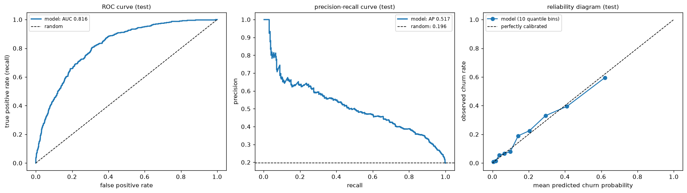
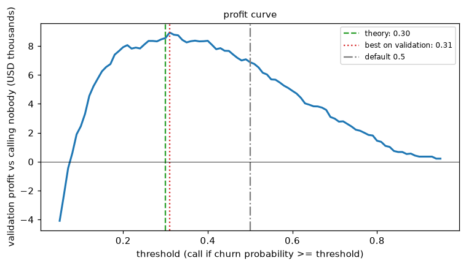

# Level 3 capstone solution: a churn classifier from scratch, matched with scikit-learn

> **Level 3 · Capstone solution** · Back to the [capstone brief](../level-3-capstone.md)

This is one complete, worked solution. Yours can differ in structure and still be right: compare it against the [acceptance checklist](../level-3-capstone.md#acceptance-checklist), not line by line. The code is also saved in the repository as `scripts/capstones/level-3/make_churn_data.py` (the generator) and `scripts/capstones/level-3/solution.py` (everything below, as one script). To reproduce it:

<!-- skip-run -->
```bash
cd scripts/capstones/level-3
python solution.py        # prints every result below and writes figures/
```

The numbers below come from running exactly this code with the default seeds.

## Setup

??? example "The capstone data generator: make_churn_data.py"

    ```python
    """Generate the Level 3 capstone data: a synthetic churn data set for a subscription telecom company.

    Usage:
        python make_churn_data.py            # writes churn.csv in the current directory
        from make_churn_data import make_churn_data
        df = make_churn_data()               # a pandas DataFrame, one row per customer

    The data are synthetic, seeded, and realistically imperfect: mixed column types, missing
    values (some missing at random, some not), and about 20% churners.
    """
    from pathlib import Path

    import numpy as np
    import pandas as pd


    def make_churn_data(n=10_000, seed=42):
        """Return a DataFrame of n customers with a binary `churned` label (1 = cancelled next month)."""
        rng = np.random.default_rng(seed)

        contract = rng.choice(["month-to-month", "one-year", "two-year"], n, p=[0.55, 0.25, 0.20])
        extra = np.select([contract == "one-year", contract == "two-year"], [12, 24], 0)
        tenure = np.clip(np.round(rng.gamma(1.5, 14, n) + extra), 1, 72).astype(int)
        internet = rng.choice(["fiber", "dsl", "none"], n, p=[0.45, 0.35, 0.20])
        n_products = 1 + rng.binomial(4, 0.3, n)
        monthly = (20 + 50 * (internet == "fiber") + 30 * (internet == "dsl") + 5 * n_products
                   + rng.normal(0, 8, n)).clip(15, None).round(2)
        payment = rng.choice(["credit card", "bank transfer", "electronic check", "mailed check"], n,
                             p=[0.30, 0.25, 0.30, 0.15])
        autopay = np.where(np.isin(payment, ["credit card", "bank transfer"]),
                           rng.random(n) < 0.7, rng.random(n) < 0.1)
        tickets = rng.poisson(0.4 + 0.6 * (internet == "fiber"), n)
        satisfaction = np.clip(np.round(3.6 - 0.4 * tickets + rng.normal(0, 1, n)), 1, 5)
        last_login = rng.exponential(10, n).round(1)
        age = np.clip(np.round(rng.normal(45, 14, n)), 18, 90)
        region = rng.choice(["north", "south", "east", "west"], n)

        logit = (-1.75 - 0.045 * tenure + 0.02 * (monthly - 65)
                 + 1.1 * (contract == "month-to-month") - 0.9 * (contract == "two-year")
                 + 0.45 * (payment == "electronic check") + 0.35 * (internet == "fiber")
                 + 0.30 * tickets - 0.4 * autopay + 0.035 * last_login
                 - 0.45 * (satisfaction - 3) - 0.10 * (n_products - 2) - 0.005 * (age - 45))
        churned = (rng.random(n) < 1 / (1 + np.exp(-logit))).astype(int)

        # Missing values. Survey answers are missing more often for unhappy customers (not at random);
        # login tracking and age have gaps unrelated to anything (completely at random).
        sat_missing = rng.random(n) < np.where(satisfaction <= 2, 0.35, 0.10)
        login_missing = rng.random(n) < 0.06
        age_missing = rng.random(n) < 0.04

        df = pd.DataFrame({
            "customer_id": [f"C{100000 + i}" for i in range(n)],
            "tenure_months": tenure,
            "monthly_charges": monthly,
            "contract": contract,
            "payment_method": payment,
            "internet_service": internet,
            "autopay": autopay,
            "num_products": n_products,
            "support_tickets_90d": tickets,
            "satisfaction_score": pd.array(np.where(sat_missing, np.nan, satisfaction), dtype="Int64"),
            "days_since_last_login": np.where(login_missing, np.nan, last_login),
            "age": pd.array(np.where(age_missing, np.nan, age), dtype="Int64"),
            "region": region,
            "churned": churned,
        })
        return df


    if __name__ == "__main__":
        out = Path("churn.csv")
        make_churn_data().to_csv(out, index=False)
        print(f"wrote {out.resolve()}")
    ```

## Part A: Splits and exploration

The test set is split off first and not touched again until Part E. The validation set is used only to choose the decision threshold; the regularization strength is chosen by cross-validation inside the training set.

```python
import numpy as np
import pandas as pd
import matplotlib.pyplot as plt
from scipy.special import expit
from scipy.stats import rankdata
from sklearn.model_selection import train_test_split

df = make_churn_data()
NUM = ["tenure_months", "monthly_charges", "num_products", "support_tickets_90d",
       "satisfaction_score", "days_since_last_login", "age"]
CAT = ["contract", "payment_method", "internet_service", "region", "autopay"]


def prepare(frame):
    """Model columns only; autopay stored as text so it's treated as a category."""
    out = frame[NUM + CAT].copy()
    out["autopay"] = np.where(frame["autopay"], "yes", "no")
    return out, frame["churned"].to_numpy()


idx = np.arange(len(df))
idx_rest, idx_te = train_test_split(idx, test_size=0.2, stratify=df["churned"], random_state=0)
idx_tr, idx_va = train_test_split(idx_rest, test_size=0.25, stratify=df["churned"].to_numpy()[idx_rest],
                                  random_state=0)
X_tr_df, y_tr = prepare(df.iloc[idx_tr])
X_va_df, y_va = prepare(df.iloc[idx_va])
X_te_df, y_te = prepare(df.iloc[idx_te])
for name, yy in [("train", y_tr), ("validation", y_va), ("test", y_te)]:
    print(f"{name:>10}: {len(yy):>5} customers, churn rate {yy.mean():.3f}")

train = df.iloc[idx_tr]                                   # exploration uses the training set only
print("\nmissing share (train):", train[NUM].isna().mean()[lambda s: s > 0].round(3).to_dict())
print("churn rate by contract:", train.groupby("contract")["churned"].mean().round(3).to_dict())
sat_missing = train["satisfaction_score"].isna()
print(f"churn rate, satisfaction answered: {train.loc[~sat_missing, 'churned'].mean():.3f}, "
      f"missing: {train.loc[sat_missing, 'churned'].mean():.3f}")
```

```text
     train:  6000 customers, churn rate 0.196
validation:  2000 customers, churn rate 0.196
      test:  2000 customers, churn rate 0.196

missing share (train): {'satisfaction_score': 0.152, 'days_since_last_login': 0.057, 'age': 0.038}
churn rate by contract: {'month-to-month': 0.298, 'one-year': 0.105, 'two-year': 0.027}
churn rate, satisfaction answered: 0.185, missing: 0.257
```

Two observations shape the preprocessing. First, month-to-month customers churn far more than customers on contracts, so `contract` will be a strong feature. Second, customers who didn't answer the satisfaction survey churn noticeably more often than those who did. Their missingness isn't random: unhappy customers skip surveys. Imputing the median alone would erase that signal, so we add a missing indicator for every numeric column with gaps.

## Part B: Preprocessing from scratch

```python
class Preprocessor:
    """Median imputation, missing indicators, and standardization for numeric columns;
    one-hot encoding with the first (alphabetical) level dropped for categorical columns.
    Every statistic is learned in fit() from the training data only."""

    def fit(self, frame):
        self.medians_ = {c: np.nanmedian(self._col(frame, c)) for c in NUM}
        self.missing_ = [c for c in NUM if np.isnan(self._col(frame, c)).any()]
        numeric = self._numeric(frame)
        self.mean_, self.std_ = numeric.mean(axis=0), numeric.std(axis=0)
        self.levels_ = {c: sorted(frame[c].unique()) for c in CAT}
        self.names_ = (NUM + [f"{c}_missing" for c in self.missing_]
                       + [f"{c}={lv}" for c in CAT for lv in self.levels_[c][1:]])
        return self

    @staticmethod
    def _col(frame, c):
        return frame[c].to_numpy(dtype=float, na_value=np.nan)

    def _numeric(self, frame):
        cols = []
        for c in NUM:
            v = self._col(frame, c)
            cols.append(np.where(np.isnan(v), self.medians_[c], v))
        indicators = [np.isnan(self._col(frame, c)).astype(float) for c in self.missing_]
        return np.column_stack(cols + indicators)

    def transform(self, frame):
        numeric = (self._numeric(frame) - self.mean_) / self.std_
        dummies = [(frame[c].to_numpy() == lv).astype(float) for c in CAT for lv in self.levels_[c][1:]]
        return np.column_stack([numeric] + dummies)


prep = Preprocessor().fit(X_tr_df)
X_tr, X_va, X_te = prep.transform(X_tr_df), prep.transform(X_va_df), prep.transform(X_te_df)
print("feature matrix:", X_tr.shape)
print("features:", prep.names_)
n_num = len(NUM) + len(prep.missing_)
print("train numeric means ~0:", np.allclose(X_tr[:, :n_num].mean(axis=0), 0),
      "| validation numeric means (first 3):", np.round(X_va[:, :3].mean(axis=0), 3))
```

```text
feature matrix: (6000, 21)
features: ['tenure_months', 'monthly_charges', 'num_products', 'support_tickets_90d', 'satisfaction_score', 'days_since_last_login', 'age', 'satisfaction_score_missing', 'days_since_last_login_missing', 'age_missing', 'contract=one-year', 'contract=two-year', 'payment_method=credit card', 'payment_method=electronic check', 'payment_method=mailed check', 'internet_service=fiber', 'internet_service=none', 'region=north', 'region=south', 'region=west', 'autopay=yes']
train numeric means ~0: True | validation numeric means (first 3): [ 0.019  0.012 -0.016]
```

The training columns have mean exactly 0 and standard deviation 1; the validation columns don't, which confirms that the validation set was transformed with training statistics, as it would be in production.

## Part C: Logistic regression with L2, from scratch

**The objective.** With $\mathbf{x}_i$ including a leading 1 for the intercept, $z_i = \mathbf{w}^\top\mathbf{x}_i$ and $p_i = \sigma(z_i)$, the negative log-likelihood of a Bernoulli model per example is $-y_i\log p_i - (1 - y_i)\log(1 - p_i) = \log(1 + e^{z_i}) - y_i z_i$. Adding the L2 penalty on every weight except the intercept:

$$
J(\mathbf{w}) = \frac{1}{n}\sum_{i=1}^n\left[\log(1 + e^{z_i}) - y_i z_i\right] + \frac{\lambda}{2}\sum_{j \geq 1} w_j^2.
$$

**The gradient.** $\frac{d}{dz}\log(1 + e^{z}) = \sigma(z)$, so $\frac{\partial}{\partial z_i}[\log(1 + e^{z_i}) - y_i z_i] = p_i - y_i$, and by the chain rule with $\partial z_i/\partial\mathbf{w} = \mathbf{x}_i$:

$$
\nabla J(\mathbf{w}) = \frac{1}{n}\mathbf{X}^\top(\mathbf{p} - \mathbf{y}) + \lambda\,\tilde{\mathbf{w}}, \qquad \tilde{\mathbf{w}} = (0, w_1, \dots, w_d).
$$

**The step size.** The Hessian is $\frac{1}{n}\mathbf{X}^\top\mathbf{S}\mathbf{X} + \lambda\tilde{\mathbf{I}}$ with $S_{ii} = p_i(1 - p_i) \leq \frac{1}{4}$, so its largest eigenvalue is at most $L = \frac{1}{4}\lambda_{\max}\!\left(\frac{1}{n}\mathbf{X}^\top\mathbf{X}\right) + \lambda$. Gradient descent with $\eta = 1/L$ is therefore stable (it's below $2/L$) and decreases the objective at every step.

```python
def add_intercept(X):
    return np.column_stack([np.ones(len(X)), X])


def objective(w, Xb, y, lam):
    z = Xb @ w
    return np.mean(np.logaddexp(0, z) - y * z) + 0.5 * lam * w[1:] @ w[1:]


def gradient(w, Xb, y, lam):
    g = Xb.T @ (expit(Xb @ w) - y) / len(y)
    g[1:] += lam * w[1:]
    return g


def numerical_gradient(f, w, h=1e-6):
    g = np.zeros_like(w)
    for j in range(len(w)):
        e = np.zeros_like(w); e[j] = h
        g[j] = (f(w + e) - f(w - e)) / (2 * h)
    return g


def fit_logreg(X, y, lam, tol=1e-8, max_iter=100_000):
    """L2-regularized logistic regression by gradient descent with step 1/L."""
    Xb = add_intercept(X)
    L = 0.25 * np.linalg.eigvalsh(Xb.T @ Xb / len(y))[-1] + lam
    w = np.zeros(Xb.shape[1])
    for it in range(max_iter):
        g = gradient(w, Xb, y, lam)
        if np.linalg.norm(g) < tol:
            break
        w -= g / L
    return w, it


def predict_proba(w, X):
    return expit(add_intercept(X) @ w)


# Gradient check at three random points
rng = np.random.default_rng(0)
Xb_tr = add_intercept(X_tr)
for k in range(3):
    w_rand = rng.normal(0, 0.5, Xb_tr.shape[1])
    ga = gradient(w_rand, Xb_tr, y_tr, 1e-2)
    gn = numerical_gradient(lambda w: objective(w, Xb_tr, y_tr, 1e-2), w_rand)
    print(f"gradient check {k + 1}: relative error = {np.linalg.norm(ga - gn) / np.linalg.norm(ga + gn):.1e}")

w_demo, iters = fit_logreg(X_tr, y_tr, lam=1e-3)
print(f"fit with lambda = 1e-3: {iters} iterations, objective {objective(w_demo, Xb_tr, y_tr, 1e-3):.5f}, "
      f"|gradient| = {np.linalg.norm(gradient(w_demo, Xb_tr, y_tr, 1e-3)):.1e}")
```

```text
gradient check 1: relative error = 2.5e-10
gradient check 2: relative error = 2.5e-10
gradient check 3: relative error = 3.4e-10
fit with lambda = 1e-3: 1436 iterations, objective 0.36691, |gradient| = 1.0e-08
```

## Part D: Choosing the regularization strength

The folds are built once and reused for every $\lambda$, so the comparison between values is paired. The preprocessor is refit on each fold's training part.

```python
def stratified_folds(y, k=5, seed=0):
    """Shuffle each class separately and deal its indices round-robin into k folds."""
    rng = np.random.default_rng(seed)
    fold = np.empty(len(y), dtype=int)
    for cls in (0, 1):
        members = rng.permutation(np.flatnonzero(y == cls))
        fold[members] = np.arange(len(members)) % k
    return [(np.flatnonzero(fold != f), np.flatnonzero(fold == f)) for f in range(k)]


def log_loss_np(y, p, eps=1e-15):
    p = np.clip(p, eps, 1 - eps)
    return -np.mean(y * np.log(p) + (1 - y) * np.log(1 - p))


def roc_auc_np(y, s):
    """Probability that a random positive outranks a random negative (Mann-Whitney)."""
    r = rankdata(s)
    n_pos, n_neg = y.sum(), len(y) - y.sum()
    return (r[y == 1].sum() - n_pos * (n_pos + 1) / 2) / (n_pos * n_neg)


folds = stratified_folds(y_tr, k=5, seed=0)
print("positives per validation fold:", [int(y_tr[va].sum()) for _, va in folds])
lambdas = np.logspace(-5, 0, 11)
cv = {}
for lam in lambdas:
    losses, aucs = [], []
    for tr, va in folds:
        p_fold = Preprocessor().fit(X_tr_df.iloc[tr])
        w, _ = fit_logreg(p_fold.transform(X_tr_df.iloc[tr]), y_tr[tr], lam)
        p = predict_proba(w, p_fold.transform(X_tr_df.iloc[va]))
        losses.append(log_loss_np(y_tr[va], p)); aucs.append(roc_auc_np(y_tr[va], p))
    cv[lam] = (np.mean(losses), np.std(losses) / np.sqrt(len(folds)), np.mean(aucs))
    print(f"lambda = {lam:.1e}: CV log-loss {cv[lam][0]:.5f} (se {cv[lam][1]:.5f}), CV ROC-AUC {cv[lam][2]:.4f}")

best_lam = min(cv, key=lambda l: cv[l][0])
limit = cv[best_lam][0] + cv[best_lam][1]
one_se_lam = max(l for l in lambdas if cv[l][0] <= limit)
print(f"best lambda = {best_lam:.1e}; one-standard-error rule picks {one_se_lam:.1e}")

lam = best_lam
w_hat, iters = fit_logreg(X_tr, y_tr, lam)
print(f"final fit on the training set: {iters} iterations")
```

```text
positives per validation fold: [235, 235, 235, 235, 235]
lambda = 1.0e-05: CV log-loss 0.36806 (se 0.00456), CV ROC-AUC 0.8371
lambda = 3.2e-05: CV log-loss 0.36805 (se 0.00455), CV ROC-AUC 0.8371
lambda = 1.0e-04: CV log-loss 0.36803 (se 0.00452), CV ROC-AUC 0.8372
lambda = 3.2e-04: CV log-loss 0.36798 (se 0.00444), CV ROC-AUC 0.8371
lambda = 1.0e-03: CV log-loss 0.36806 (se 0.00425), CV ROC-AUC 0.8370
lambda = 3.2e-03: CV log-loss 0.36907 (se 0.00388), CV ROC-AUC 0.8359
lambda = 1.0e-02: CV log-loss 0.37283 (se 0.00331), CV ROC-AUC 0.8330
lambda = 3.2e-02: CV log-loss 0.38231 (se 0.00258), CV ROC-AUC 0.8287
lambda = 1.0e-01: CV log-loss 0.40309 (se 0.00182), CV ROC-AUC 0.8232
lambda = 3.2e-01: CV log-loss 0.43586 (se 0.00110), CV ROC-AUC 0.8164
lambda = 1.0e+00: CV log-loss 0.46681 (se 0.00050), CV ROC-AUC 0.8113
best lambda = 3.2e-04; one-standard-error rule picks 3.2e-03
final fit on the training set: 1560 iterations
```

The cross-validated log-loss is flat across the small values of $\lambda$ and rises once the penalty starts to bite. With 6,000 training customers and about 20 features, there's little variance to remove, so regularization barely matters here, which is itself a useful finding. The one-standard-error rule allows a stronger penalty with essentially the same performance.

## Part E: Threshold, evaluation, and calibration

**The threshold.** Calling a customer with churn probability $p$ costs USD 30 and, with probability $p$, saves a churner 40% of the time, worth USD 250. The expected value of calling is $0.4 \times 250\,p - 30 = 100p - 30$, positive when $p > 0.3$. That's the theoretical threshold, valid if the probabilities are calibrated. We also choose it empirically on the validation set.

```python
VALUE_SAVED, OFFER_COST, P_STAY = 250.0, 30.0, 0.4


def profit(y, p, t):
    """Expected profit (USD) of calling everyone with p >= t, relative to calling nobody."""
    call = p >= t
    return P_STAY * VALUE_SAVED * np.sum(call & (y == 1)) - OFFER_COST * np.sum(call)


t_theory = OFFER_COST / (P_STAY * VALUE_SAVED)
p_va = predict_proba(w_hat, X_va)
grid = np.round(np.arange(0.05, 0.951, 0.01), 2)
val_profit = np.array([profit(y_va, p_va, t) for t in grid])
t_best = grid[np.argmax(val_profit)]
print(f"theoretical threshold {t_theory:.2f}; best on validation {t_best:.2f} "
      f"(validation profit USD {val_profit.max():,.0f} vs USD {profit(y_va, p_va, t_theory):,.0f} at {t_theory:.2f})")
```

```text
theoretical threshold 0.30; best on validation 0.31 (validation profit USD 8,930 vs USD 8,550 at 0.30)
```

The validation-chosen threshold lands right next to the theoretical one, which is what you'd expect from a calibrated model, and the profit curve is flat near its peak.

Now the test set, used once, with every metric computed from scratch.

```python
def pr_points(y, s):
    """Precision and recall at every distinct score threshold, highest first."""
    order = np.argsort(-s, kind="mergesort")
    ys, ss = y[order], s[order]
    last = np.r_[np.flatnonzero(np.diff(ss)), len(s) - 1]
    tp = np.cumsum(ys)[last]
    fp = (last + 1) - tp
    return tp / (last + 1), tp / y.sum(), fp / (len(y) - y.sum())


def average_precision_np(y, s):
    precision, recall, _ = pr_points(y, s)
    return np.sum(np.diff(np.r_[0, recall]) * precision)


def calibration_bins(y, p, n_bins=10):
    """Mean predicted probability and observed churn rate in quantile bins."""
    edges = np.quantile(p, np.linspace(0, 1, n_bins + 1))
    which = np.clip(np.searchsorted(edges, p, side="right") - 1, 0, n_bins - 1)
    return (np.array([p[which == b].mean() for b in range(n_bins)]),
            np.array([y[which == b].mean() for b in range(n_bins)]))


p_te = predict_proba(w_hat, X_te)
call = p_te >= t_best
tp, fp = np.sum(call & (y_te == 1)), np.sum(call & (y_te == 0))
fn, tn = np.sum(~call & (y_te == 1)), np.sum(~call & (y_te == 0))
mean_pred, frac_pos = calibration_bins(y_te, p_te)
test_metrics = {
    "ROC-AUC": roc_auc_np(y_te, p_te),
    "average precision (PR-AUC)": average_precision_np(y_te, p_te),
    "Brier score": np.mean((p_te - y_te) ** 2),
    "log-loss": log_loss_np(y_te, p_te),
}
for k_, v in test_metrics.items():
    print(f"{k_:>27}: {v:.4f}")
print(f"{'churn rate / mean predicted':>27}: {y_te.mean():.4f} / {p_te.mean():.4f}")
print(f"\nat threshold {t_best:.2f}: TP {tp}, FP {fp}, FN {fn}, TN {tn}; "
      f"precision {tp / (tp + fp):.3f}, recall {tp / (tp + fn):.3f}, customers called {call.sum()} of {len(y_te)}")
print(f"max calibration gap across 10 bins: {np.max(np.abs(mean_pred - frac_pos)):.3f}")

print("\ntest profit relative to calling nobody:")
for label, t in [("chosen threshold", t_best), ("theoretical 0.30", t_theory), ("default 0.5", 0.5),
                 ("call everybody", 0.0)]:
    print(f"{label:>18}: USD {profit(y_te, p_te, t):>8,.0f}")
```

```text
                    ROC-AUC: 0.8162
 average precision (PR-AUC): 0.5166
                Brier score: 0.1240
                   log-loss: 0.3879
churn rate / mean predicted: 0.1960 / 0.1897

at threshold 0.31: TP 220, FP 247, FN 172, TN 1361; precision 0.471, recall 0.561, customers called 467 of 2000
max calibration gap across 10 bins: 0.048

test profit relative to calling nobody:
  chosen threshold: USD    7,990
  theoretical 0.30: USD    8,310
       default 0.5: USD    5,490
    call everybody: USD  -20,800
```

```python
fig, axes = plt.subplots(1, 3, figsize=(16, 4.6))
precision, recall, fpr = pr_points(y_te, p_te)
axes[0].plot(np.r_[0, fpr], np.r_[0, recall], lw=2, label=f"model: AUC {test_metrics['ROC-AUC']:.3f}")
axes[0].plot([0, 1], [0, 1], "k--", lw=1, label="random")
axes[0].set_xlabel("false positive rate"); axes[0].set_ylabel("true positive rate (recall)")
axes[0].set_title("ROC curve (test)", fontsize=10); axes[0].legend(fontsize=8)
axes[1].plot(recall, precision, lw=2, label=f"model: AP {test_metrics['average precision (PR-AUC)']:.3f}")
axes[1].axhline(y_te.mean(), color="k", ls="--", lw=1, label=f"random: {y_te.mean():.3f}")
axes[1].set_xlabel("recall"); axes[1].set_ylabel("precision")
axes[1].set_title("precision-recall curve (test)", fontsize=10); axes[1].legend(fontsize=8)
axes[2].plot(mean_pred, frac_pos, "o-", label="model (10 quantile bins)")
axes[2].plot([0, 1], [0, 1], "k--", lw=1, label="perfectly calibrated")
axes[2].set_xlabel("mean predicted churn probability"); axes[2].set_ylabel("observed churn rate")
axes[2].set_title("reliability diagram (test)", fontsize=10); axes[2].legend(fontsize=8)
plt.tight_layout()
plt.show()

fig, ax = plt.subplots(figsize=(7, 4))
ax.plot(grid, val_profit / 1000, lw=2)
ax.axvline(t_theory, color="tab:green", ls="--", label=f"theory: {t_theory:.2f}")
ax.axvline(t_best, color="tab:red", ls=":", label=f"best on validation: {t_best:.2f}")
ax.axvline(0.5, color="gray", ls="-.", label="default 0.5")
ax.axhline(0, color="k", lw=0.5)
ax.set_xlabel("threshold (call if churn probability >= threshold)")
ax.set_ylabel("validation profit vs calling nobody (USD thousands)")
ax.set_title("profit curve", fontsize=10); ax.legend(fontsize=8)
plt.tight_layout()
plt.show()
```

On the test set, the theoretical threshold of 0.30 happens to earn slightly more than the validation-chosen 0.31. The difference, about USD 300, is noise from evaluating on 2,000 customers, and it's why a broad, flat profit peak is reassuring: any threshold near 0.3 is a good decision. The default 0.5 earns about a third less, and calling everybody loses money, because 80% of the offers would go to customers who weren't leaving.



*Test-set ROC and precision-recall curves, and the reliability diagram. The points follow the diagonal closely, so a predicted 30% means roughly 30%.*



*Validation profit by threshold. The curve has a broad peak around the theoretical threshold of 0.3; the default 0.5 leaves a large share of the profit on the table.*

## Part F: Matching scikit-learn

scikit-learn's `LogisticRegression` minimizes $C\sum_i \ell_i + \frac{1}{2}\lVert\mathbf{w}\rVert^2$ (without penalizing the intercept). Dividing by $Cn$ gives $\frac{1}{n}\sum_i \ell_i + \frac{1}{2Cn}\lVert\mathbf{w}\rVert^2$, which is our objective when $\lambda = \frac{1}{Cn}$, so $C = \frac{1}{\lambda n}$ with $n$ the number of training rows.

```python
from sklearn.compose import ColumnTransformer
from sklearn.impute import SimpleImputer
from sklearn.linear_model import LogisticRegression
from sklearn.metrics import roc_auc_score, average_precision_score, brier_score_loss, log_loss
from sklearn.model_selection import cross_val_score
from sklearn.pipeline import Pipeline, make_pipeline
from sklearn.preprocessing import OneHotEncoder, StandardScaler
from sklearn.calibration import calibration_curve


def sk_pipeline(C):
    pre = ColumnTransformer([
        ("num", make_pipeline(SimpleImputer(strategy="median", add_indicator=True), StandardScaler()), NUM),
        ("cat", OneHotEncoder(drop="first"), CAT),
    ])
    return Pipeline([("pre", pre), ("clf", LogisticRegression(C=C, tol=1e-12, max_iter=10_000))])


C = 1 / (lam * len(y_tr))
sk = sk_pipeline(C).fit(X_tr_df, y_tr)
print(f"lambda = {lam:.1e}  ->  C = {C:.4f}")
print("features match:", np.allclose(sk["pre"].transform(X_te_df), X_te))
w_sk = np.r_[sk["clf"].intercept_, sk["clf"].coef_.ravel()]
p_sk = sk.predict_proba(X_te_df)[:, 1]
print(f"max |coefficient difference|: {np.abs(w_sk - w_hat).max():.1e}")
print(f"max |probability difference|: {np.abs(p_sk - p_te).max():.1e}")

sk_metrics = {"ROC-AUC": roc_auc_score(y_te, p_te), "average precision (PR-AUC)": average_precision_score(y_te, p_te),
              "Brier score": brier_score_loss(y_te, p_te), "log-loss": log_loss(y_te, p_te)}
for k_ in test_metrics:
    print(f"{k_:>27}: ours {test_metrics[k_]:.6f}   sklearn {sk_metrics[k_]:.6f}")
frac_sk, mean_sk = calibration_curve(y_te, p_te, n_bins=10, strategy="quantile")
print("calibration bins match:", np.allclose(frac_sk, frac_pos) and np.allclose(mean_sk, mean_pred))

print("\ncross-validated log-loss with our folds, ours vs sklearn:")
for l in [1e-4, 1e-2, 1e-1]:
    s = -cross_val_score(sk_pipeline(1 / (l * len(folds[0][0]))), X_tr_df, y_tr, cv=folds, scoring="neg_log_loss")
    print(f"lambda = {l:.0e}: ours {cv[l][0]:.5f}   sklearn {s.mean():.5f}")
```

```text
lambda = 3.2e-04  ->  C = 0.5270
features match: True
max |coefficient difference|: 1.4e-06
max |probability difference|: 3.9e-07
                    ROC-AUC: ours 0.816238   sklearn 0.816238
 average precision (PR-AUC): ours 0.516636   sklearn 0.516636
                Brier score: ours 0.124038   sklearn 0.124038
                   log-loss: ours 0.387914   sklearn 0.387914
calibration bins match: True

cross-validated log-loss with our folds, ours vs sklearn:
lambda = 1e-04: ours 0.36803   sklearn 0.36803
lambda = 1e-02: ours 0.37283   sklearn 0.37283
lambda = 1e-01: ours 0.40309   sklearn 0.40309
```

Everything agrees: the feature matrices, the coefficients and probabilities (to the solvers' tolerance), every test metric, the calibration bins, and the cross-validated log-loss for each $\lambda$. Note one subtlety in the last check: inside cross-validation, each fit sees only the fold's training rows, so `C` must be computed with that $n$, not the full training size.

### Which features matter?

```python
coefs = pd.Series(w_hat[1:], index=prep.names_).sort_values(key=np.abs, ascending=False)
print(coefs.round(3).head(8).to_string())
```

```text
contract=two-year                 -1.887
contract=one-year                 -0.978
tenure_months                     -0.839
satisfaction_score                -0.487
autopay=yes                       -0.471
monthly_charges                    0.465
payment_method=electronic check    0.445
days_since_last_login              0.398
```

Because the numeric features are standardized, their coefficients are log-odds changes per standard deviation; the categorical ones are log-odds differences from the dropped reference level (month-to-month for `contract`, bank transfer for `payment_method`, dsl for `internet_service`). The largest effects are the contract type and tenure. These are associations, not causal effects: moving a customer onto a contract might not reduce their churn risk as much as the coefficient suggests, because customers who choose contracts differ in other ways. That's a question for an experiment, not this model.

## The one-page summary for Priya

```python
called = int((p_te >= t_best).sum())
saved = profit(y_te, p_te, t_best)
print(f"Call customers whose predicted churn probability is at least {t_best:.0%}: "
      f"{called} of {len(y_te)} test customers ({called / len(y_te):.0%}).")
print(f"Expected profit on these {len(y_te)} customers: USD {saved:,.0f}, versus USD 0 for calling nobody and "
      f"USD {profit(y_te, p_te, 0.0):,.0f} for calling everybody.")
```

```text
Call customers whose predicted churn probability is at least 31%: 467 of 2000 test customers (23%).
Expected profit on these 2000 customers: USD 7,990, versus USD 0 for calling nobody and USD -20,800 for calling everybody.
```

**Recommendation.** Each month, call the customers whose predicted churn probability is at least the chosen threshold, about a quarter of the base. On the 2,000 held-out test customers, this policy is worth about USD 8,000 a month compared with calling nobody, about USD 2,500 more than using a 50% cutoff, while calling everybody would *lose* about USD 21,000. The threshold follows from the economics: an offer pays for itself when the churn probability exceeds USD 30 / (40% × USD 250) = 30%.

**How good is the model?** It ranks well: a random churner gets a higher score than a random non-churner about 82% of the time (ROC-AUC), and among the customers it flags, 47% churn, more than twice the 20% base rate, while it catches 56% of all churners. Its probabilities are calibrated: across ten groups of test customers, the predicted and observed churn rates differ by at most about 5 percentage points, so Finance can use them for forecasts.

**What drives churn?** Month-to-month contracts, short tenure, low satisfaction scores, and high monthly charges are associated with higher churn; two-year contracts and autopay with lower. These are correlations; test interventions (such as contract incentives) with an A/B test before acting on them.

**Why trust it?** The model was built from first principles, every metric was computed by hand, and a standard library (scikit-learn) reproduces it to many decimal places. It was evaluated once on customers it had never seen.

## What to take away

- Preprocessing is part of the model: fit it on training data, refit it inside each CV fold, and add missing indicators when missingness carries information.
- The gradient check, the curvature-based step size, and the comparison with scikit-learn are cheap, and together they make the from-scratch model trustworthy.
- Regularization strength barely mattered here because $n$ is large relative to $d$; cross-validation told us so rather than us assuming it.
- The business threshold (about 0.3) differs sharply from the default 0.5, and choosing it from costs is worth far more money here than tuning the regularization strength.
- Calibration is what lets the probabilities be used as numbers; check it with a reliability diagram, not just AUC.
