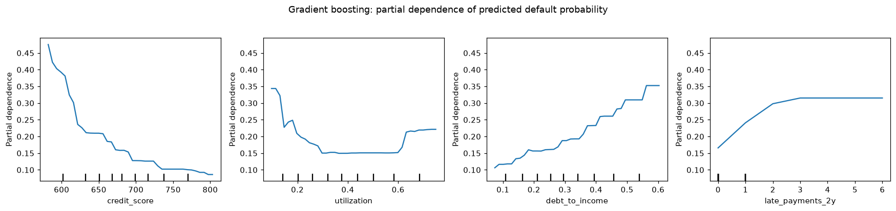

# Level 4 capstone solution: a model bake-off

> **Level 4 · Capstone solution** · Back to the [capstone brief](../level-4-capstone.md)

This is one complete, worked solution. Yours can differ in structure, models, and wording and still be right: compare it against the [acceptance checklist](../level-4-capstone.md#acceptance-checklist), not line by line. The code is also saved in the repository as `scripts/capstones/level-4/make_loan_data.py` (the generator) and `scripts/capstones/level-4/solution.py` (everything below, as one script). To reproduce it:

<!-- skip-run -->
```bash
cd scripts/capstones/level-4
python solution.py           # prints every result and writes figures/
```

The numbers below come from running exactly this code with the default seed. Timings will differ on your machine.

## Setup

The data comes from the generator in the brief. It's repeated here so this page runs on its own.

??? example "The capstone data generator: make_loan_data.py"

    ```python
    """Generate the Level 4 capstone dataset: synthetic personal-loan applications and defaults.

    Usage:
        python make_loan_data.py                 # writes loans.csv in the current directory
        from make_loan_data import make_loans
        df = make_loans()                        # pandas DataFrame

    The data is synthetic and seeded. Default risk has nonlinear effects (a credit-score
    cliff, a U-shaped utilization effect, saturating late payments), interactions (debt
    ratio matters more on 60-month loans, small-business loans are riskier for low
    incomes), two categorical features, missing values, and a few pure-noise columns.
    """
    from pathlib import Path

    import numpy as np
    import pandas as pd


    def make_loans(n=5000, seed=42):
        rng = np.random.default_rng(seed)
        income = rng.lognormal(np.log(58), 0.45, n).round(1)                       # thousands of USD
        credit = np.clip(rng.normal(680, 60, n), 450, 850).round()
        dti = np.clip(rng.beta(2.2, 5, n) + 0.08 * (income < 35), 0, 0.95).round(3)
        utilization = rng.beta(2, 3, n).round(3)
        late = rng.poisson(0.25 + 1.2 * (credit < 620), n)
        emp_years = rng.exponential(6, n).round(1)
        loan_amount = np.clip(rng.lognormal(np.log(12), 0.6, n), 1, 60).round(1)   # thousands of USD
        term = rng.choice([36, 60], n, p=[0.65, 0.35])
        lines = rng.poisson(8, n)
        home = rng.choice(["rent", "mortgage", "own"], n, p=[0.45, 0.4, 0.15])
        purpose = rng.choice(["debt_consolidation", "home_improvement", "car", "small_business", "other"],
                             n, p=[0.45, 0.15, 0.15, 0.1, 0.15])
        noise = rng.normal(size=(n, 3))

        logit = (
            -4.0
            + 1.6 / (1 + np.exp((credit - 615) / 12))                 # cliff below about 615
            - 0.006 * (credit - 680)
            + 16.0 * (utilization - 0.45) ** 2                        # U-shape around 45%
            + 1.1 * np.log1p(late)                                    # saturating late payments
            + 2.5 * dti * (1 + 1.2 * (term == 60))                    # interaction: DTI x long term
            - 0.6 * np.log(income / 58)
            + 0.9 * ((purpose == "small_business") & (income < 50))  # interaction: purpose x income
            + 0.25 * (home == "rent")
            - 0.03 * np.minimum(emp_years, 10)
            + 0.15 * np.log(loan_amount / income)
        )
        default = (rng.random(n) < 1 / (1 + np.exp(-logit))).astype(int)

        df = pd.DataFrame({
            "income_kusd": income, "credit_score": credit, "debt_to_income": dti,
            "utilization": utilization, "late_payments_2y": late, "employment_years": emp_years,
            "loan_amount_kusd": loan_amount, "term_months": term, "open_credit_lines": lines,
            "home_ownership": home, "purpose": purpose,
            "noise_1": noise[:, 0].round(3), "noise_2": noise[:, 1].round(3), "noise_3": noise[:, 2].round(3),
            "default": default,
        })
        # Missing values: employment years more often missing for renters; some credit scores missing
        miss_emp = rng.random(n) < np.where(home == "rent", 0.12, 0.05)
        df.loc[miss_emp, "employment_years"] = np.nan
        df.loc[rng.random(n) < 0.03, "credit_score"] = np.nan
        return df


    if __name__ == "__main__":
        out = Path("loans.csv")
        make_loans().to_csv(out, index=False)
        print(f"wrote {out.resolve()}")
    ```

Load the data and take a first look:

```python
import time
import numpy as np
import pandas as pd
import matplotlib.pyplot as plt
from scipy import stats
from sklearn.base import clone
from sklearn.compose import ColumnTransformer
from sklearn.pipeline import Pipeline, make_pipeline
from sklearn.preprocessing import StandardScaler, OneHotEncoder, OrdinalEncoder, SplineTransformer
from sklearn.impute import SimpleImputer
from sklearn.model_selection import (train_test_split, RepeatedStratifiedKFold, StratifiedKFold,
                                     GridSearchCV, cross_validate)
from sklearn.dummy import DummyClassifier
from sklearn.linear_model import LogisticRegression
from sklearn.neighbors import KNeighborsClassifier
from sklearn.svm import SVC
from sklearn.ensemble import RandomForestClassifier, HistGradientBoostingClassifier
from sklearn.metrics import roc_auc_score, average_precision_score, brier_score_loss
from sklearn.inspection import permutation_importance, PartialDependenceDisplay

df = make_loans()
print(df.shape, "| default rate:", round(df["default"].mean(), 3))
print("missing shares:", df.isna().mean()[lambda s: s > 0].round(3).to_dict())
print("default rate by purpose:", df.groupby("purpose")["default"].mean().round(3).to_dict())
print("default rate by term:", df.groupby("term_months")["default"].mean().round(3).to_dict())
```

```text
(5000, 15) | default rate: 0.207
missing shares: {'credit_score': 0.03, 'employment_years': 0.082}
default rate by purpose: {'car': 0.187, 'debt_consolidation': 0.201, 'home_improvement': 0.214, 'other': 0.203, 'small_business': 0.261}
default rate by term: {36: 0.163, 60: 0.29}
```

About one applicant in five defaults, so ROC AUC and average precision are both sensible; accuracy would be misleading (always predicting "repays" scores about 79%). Two columns have missing values, and they'll be handled inside the pipelines.

## Part A: The validation design

The design has three layers, chosen before looking at any model's score:

1. **A final test set** (20%, stratified) that's touched exactly once, at the end, to confirm the chosen model's performance.
2. **Nested cross-validation** on the remaining 80% (the development set) to compare models fairly. The **outer loop** is repeated stratified 5-fold CV, repeated twice with different shuffles (10 folds). Inside each outer training fold, an **inner** 3-fold grid search tunes the model's hyperparameters. The outer test fold never influences tuning, so each outer score is an honest estimate for "this model family, tuned this way".
3. **Identical outer folds for every model**, so the comparisons are paired: on each fold, every model faces exactly the same training and test rows.

```python
TARGET = "default"
cat_cols = ["home_ownership", "purpose"]
num_cols = [c for c in df.columns if c not in cat_cols + [TARGET]]
X = df[cat_cols + num_cols].astype({c: float for c in num_cols})   # floats everywhere (partial dependence needs it)
y = df[TARGET].to_numpy()

X_dev, X_test, y_dev, y_test = train_test_split(X, y, test_size=0.2, stratify=y, random_state=0)
outer = RepeatedStratifiedKFold(n_splits=5, n_repeats=2, random_state=1)
inner = StratifiedKFold(n_splits=3, shuffle=True, random_state=0)
print(f"development rows {len(X_dev)}, test rows {len(X_test)}, "
      f"default rate dev {y_dev.mean():.3f} / test {y_test.mean():.3f}")
```

```text
development rows 4000, test rows 1000, default rate dev 0.206 / test 0.207
```

**Metrics.** The primary metric is **ROC AUC**: the lender ranks applicants by risk and sets cut-offs later, so the quality of the ranking is what matters. **Average precision** is reported as a second ranking metric that focuses on the defaulters, and the **Brier score** (mean squared error of predicted probabilities, lower is better) checks probability quality, which matters for pricing. The SVM produces no probabilities without an extra calibration step, so it gets no Brier score.

## Part B: The candidate models

Every model is a pipeline, so imputation, encoding, and scaling are learned inside each training fold. Distance- and gradient-based models get one-hot categories and standardized numbers; the random forest gets ordinal-encoded categories and no scaling; histogram gradient boosting handles missing values and categories natively. The grids are deliberately small.

```python
def scaled_prep():
    return ColumnTransformer([
        ("cat", OneHotEncoder(handle_unknown="ignore"), cat_cols),
        ("num", make_pipeline(SimpleImputer(strategy="median", add_indicator=True), StandardScaler()), num_cols)])

def spline_prep():
    return ColumnTransformer([
        ("cat", OneHotEncoder(handle_unknown="ignore"), cat_cols),
        ("num", make_pipeline(SimpleImputer(strategy="median", add_indicator=True),
                              SplineTransformer(n_knots=5, degree=3), StandardScaler()), num_cols)])

def tree_prep():
    return ColumnTransformer([
        ("cat", OrdinalEncoder(handle_unknown="use_encoded_value", unknown_value=-1), cat_cols),
        ("num", SimpleImputer(strategy="median", add_indicator=True), num_cols)])

def hgb_prep():                                    # categories first, NaN passed through
    return ColumnTransformer([
        ("cat", OrdinalEncoder(handle_unknown="use_encoded_value", unknown_value=-1), cat_cols),
        ("num", "passthrough", num_cols)])

models = {
    "baseline (prior)": (Pipeline([("prep", scaled_prep()), ("clf", DummyClassifier(strategy="prior"))]), {}),
    "logistic L2": (Pipeline([("prep", scaled_prep()), ("clf", LogisticRegression(max_iter=2000))]),
                    {"clf__C": [0.01, 0.1, 1, 10]}),
    "logistic L1": (Pipeline([("prep", scaled_prep()),
                              ("clf", LogisticRegression(l1_ratio=1.0, solver="liblinear", max_iter=2000))]),
                    {"clf__C": [0.01, 0.1, 1]}),
    "logistic L2 + splines": (Pipeline([("prep", spline_prep()), ("clf", LogisticRegression(max_iter=5000))]),
                              {"clf__C": [0.1, 1]}),
    "kNN": (Pipeline([("prep", scaled_prep()), ("clf", KNeighborsClassifier())]),
            {"clf__n_neighbors": [25, 75, 150]}),
    "SVM (RBF)": (Pipeline([("prep", scaled_prep()), ("clf", SVC(kernel="rbf"))]),
                  {"clf__C": [0.3, 1, 3], "clf__gamma": ["scale", 0.01]}),
    "random forest": (Pipeline([("prep", tree_prep()),
                                ("clf", RandomForestClassifier(n_estimators=300, max_features="sqrt", random_state=0))]),
                      {"clf__min_samples_leaf": [1, 5, 20]}),
    "gradient boosting (HGB)": (Pipeline([("prep", hgb_prep()),
                                          ("clf", HistGradientBoostingClassifier(
                                              categorical_features=[0, 1], max_iter=500, early_stopping=True,
                                              validation_fraction=0.15, n_iter_no_change=30, random_state=0))]),
                                {"clf__learning_rate": [0.05, 0.1], "clf__max_leaf_nodes": [7, 15]}),
}
print(len(models), "models;", "grid sizes:", {k: int(np.prod([len(v) for v in g.values()])) for k, (_, g) in models.items()})
```

```text
8 models; grid sizes: {'baseline (prior)': 1, 'logistic L2': 4, 'logistic L1': 3, 'logistic L2 + splines': 2, 'kNN': 3, 'SVM (RBF)': 6, 'random forest': 3, 'gradient boosting (HGB)': 4}
```

The spline model is an extra: a linear model whose numeric features are expanded into smooth piecewise polynomials, so it can bend (for example, the credit-score cliff and the U-shaped utilization effect) while staying additive and interpretable.

## Part C: Nested cross-validation results

```python
cv_results, fold_auc, chosen = {}, {}, {}
for name, (pipe, grid) in models.items():
    est = GridSearchCV(pipe, grid, cv=inner, scoring="roc_auc") if grid else pipe
    scoring = {"auc": "roc_auc", "ap": "average_precision"}
    if name != "SVM (RBF)":
        scoring["brier"] = "neg_brier_score"
    t0 = time.perf_counter()
    res = cross_validate(est, X_dev, y_dev, cv=outer, scoring=scoring, n_jobs=4, return_estimator=bool(grid))
    wall = time.perf_counter() - t0
    fold_auc[name] = res["test_auc"]
    cv_results[name] = {
        "AUC": f"{res['test_auc'].mean():.3f} ± {res['test_auc'].std():.3f}",
        "avg precision": f"{res['test_ap'].mean():.3f} ± {res['test_ap'].std():.3f}",
        "Brier": f"{-res['test_brier'].mean():.4f}" if "test_brier" in res else "n/a",
        "fit+tune s/fold": round(res["fit_time"].mean(), 2),
    }
    if grid:
        chosen[name] = pd.Series([str(e.best_params_) for e in res["estimator"]]).value_counts().to_dict()
table = pd.DataFrame(cv_results).T.sort_values("AUC", ascending=False)
print(table.to_string())
```

```text
                                   AUC  avg precision   Brier fit+tune s/fold
logistic L2 + splines    0.841 ± 0.015  0.635 ± 0.033  0.1148            0.86
random forest            0.834 ± 0.009  0.605 ± 0.032  0.1197            18.3
gradient boosting (HGB)  0.833 ± 0.013  0.615 ± 0.030  0.1178            8.33
SVM (RBF)                0.833 ± 0.011  0.612 ± 0.028     n/a             4.5
logistic L2              0.805 ± 0.015  0.586 ± 0.027  0.1242            0.92
logistic L1              0.805 ± 0.015  0.585 ± 0.027  0.1235            0.46
kNN                      0.805 ± 0.015  0.556 ± 0.032  0.1374            1.12
baseline (prior)         0.500 ± 0.000  0.206 ± 0.001  0.1639            0.04
```

The models fall into clear groups. At the top, four models sit within 0.01 of each other: logistic regression with spline features (0.841), the random forest, gradient boosting, and the RBF SVM (0.833 to 0.834). A second group, the plain L1 and L2 logistic regressions and kNN, sits around 0.805. The baseline scores exactly 0.5, confirming the metric is wired correctly. The fold-to-fold standard deviations (0.009 to 0.015) are as large as the gaps inside the top group, which is the first hint that those gaps may be noise. Costs differ much more than accuracy: tuning and fitting the random forest takes many seconds per fold, the logistic models under one second.


Which hyperparameters did the inner searches pick? If the choice jumps around between folds, the grid is probably flat in that region (which is fine) or the data is too small to tell settings apart.

```python
for name, counts in chosen.items():
    print(f"{name:<25} {counts}")
```

```text
logistic L2               {"{'clf__C': 0.01}": 7, "{'clf__C': 0.1}": 3}
logistic L1               {"{'clf__C': 0.1}": 9, "{'clf__C': 1}": 1}
logistic L2 + splines     {"{'clf__C': 0.1}": 10}
kNN                       {"{'clf__n_neighbors': 150}": 10}
SVM (RBF)                 {"{'clf__C': 3, 'clf__gamma': 0.01}": 10}
random forest             {"{'clf__min_samples_leaf': 5}": 9, "{'clf__min_samples_leaf': 20}": 1}
gradient boosting (HGB)   {"{'clf__learning_rate': 0.05, 'clf__max_leaf_nodes': 7}": 8, "{'clf__learning_rate': 0.1, 'clf__max_leaf_nodes': 7}": 2}
```

The choices are stable, which is good. But two of them sit at the **edge of their grid**: kNN always picked the largest $k$ (150), and L2 logistic regression mostly picked the smallest $C$ (0.01, the strongest regularization). When the best value is at the boundary, the true optimum may lie beyond it, so a follow-up run should extend those grids. (Neither model is near the top group, so it wouldn't change the conclusion here, but in a real project you'd check.)


The spread of fold scores is as informative as the means:

```python
order = table.index[::-1]
fig, ax = plt.subplots(figsize=(9, 4.8))
ax.boxplot([fold_auc[n] for n in order], orientation="horizontal", tick_labels=list(order))
for k, n in enumerate(order, start=1):
    ax.scatter(fold_auc[n], np.full(10, k) + np.random.default_rng(k).uniform(-0.12, 0.12, 10), s=12, color="k", alpha=0.6)
ax.set_xlabel("ROC AUC on each of the 10 outer folds")
ax.set_title("Nested CV: four models are tied at the top")
plt.tight_layout()
plt.show()
```


*Each dot is one outer fold. The boxes for the top models overlap heavily, so the ranking needs a proper paired test.*

## Part D: Are the differences real?

The fold scores of two models are paired (same folds), so compare their per-fold differences. But a plain paired t-test on cross-validation folds is overconfident: the training sets of different folds overlap heavily, so the fold scores are positively correlated, and the test's variance estimate is too small. The **corrected resampled t-test** (Nadeau and Bengio, 2003) inflates the variance of the mean difference by replacing $1/J$ with $1/J + n_{\text{test}}/n_{\text{train}}$, where $J$ is the number of folds:

$$
t = \frac{\bar{d}}{\sqrt{\left(\frac{1}{J} + \frac{n_{\text{test}}}{n_{\text{train}}}\right)\hat{\sigma}_d^2}}, \qquad \text{df} = J - 1.
$$

It's a heuristic correction, not an exact test, and it's the standard choice for repeated k-fold comparisons.

```python
def corrected_ttest(a, b, n_train, n_test):
    d = np.asarray(a) - np.asarray(b)
    J = len(d)
    t = d.mean() / np.sqrt((1 / J + n_test / n_train) * d.var(ddof=1))
    return d.mean(), t, 2 * stats.t.sf(abs(t), df=J - 1)

best = table.index[0]
n_test_fold = len(X_dev) // 5
n_train_fold = len(X_dev) - n_test_fold
print(f"reference model: {best}")
print(f"{'compared with':<25}{'mean diff':>10}{'corrected p':>13}{'naive p':>10}")
for name in table.index[1:]:
    diff, t, p = corrected_ttest(fold_auc[best], fold_auc[name], n_train_fold, n_test_fold)
    naive_p = stats.ttest_rel(fold_auc[best], fold_auc[name]).pvalue
    print(f"{name:<25}{diff:>10.4f}{p:>13.4f}{naive_p:>10.4f}")
```

```text
reference model: logistic L2 + splines
compared with             mean diff  corrected p   naive p
random forest                0.0068       0.2617    0.0518
gradient boosting (HGB)      0.0080       0.3012    0.0704
SVM (RBF)                    0.0078       0.2094    0.0323
logistic L2                  0.0353       0.0001    0.0000
logistic L1                  0.0353       0.0002    0.0000
kNN                          0.0352       0.0007    0.0000
baseline (prior)             0.3406       0.0000    0.0000
```

Against the spline model, no other top-group model is significantly different under the corrected test ($p$ between 0.21 and 0.30). The naive paired t-test would have declared the SVM significantly worse ($p = 0.03$) and the random forest borderline ($p = 0.05$): that's the overconfidence the correction removes. The plain linear models and kNN are clearly worse ($p < 0.001$ even after correction), by about 0.035 AUC. **Conclusion: a four-way tie at the top, and a real gap to the plain linear models.**


## Part E: Final fit, test-set check, and cost

Refit the strongest candidates on the whole development set (tuning with 5-fold CV there), record the training and prediction time of the final configuration, and evaluate each once on the untouched test set. The bootstrap gives each test AUC an interval, and a paired bootstrap compares the top two. The business-facing number is the **capture rate**: the share of all test-set defaults that fall among the 20% of applicants the model ranks riskiest.

```python
finalists = ["logistic L2", "logistic L2 + splines", "random forest", "gradient boosting (HGB)"]
final = {}
for name in finalists:
    pipe, grid = models[name]
    gs = GridSearchCV(pipe, grid, cv=StratifiedKFold(5, shuffle=True, random_state=0), scoring="roc_auc").fit(X_dev, y_dev)
    t0 = time.perf_counter(); model = clone(gs.best_estimator_).fit(X_dev, y_dev); fit_s = time.perf_counter() - t0
    t0 = time.perf_counter(); p = model.predict_proba(X_test)[:, 1]; pred_ms = 1000 * (time.perf_counter() - t0)
    final[name] = {"model": model, "p": p, "params": gs.best_params_, "fit_s": fit_s, "pred_ms": pred_ms}

rng = np.random.default_rng(0)
boot = [rng.integers(0, len(y_test), len(y_test)) for _ in range(1000)]
def capture_at(p, share=0.2):
    top = np.argsort(-p)[: int(share * len(p))]
    return y_test[top].sum() / y_test.sum()

print(f"{'model':<25}{'test AUC':>9}{'95% bootstrap CI':>19}{'Brier':>8}{'capture@20%':>13}{'fit s':>7}{'predict ms':>11}")
for name, f in final.items():
    aucs = [roc_auc_score(y_test[b], f["p"][b]) for b in boot]
    lo, hi = np.percentile(aucs, [2.5, 97.5])
    print(f"{name:<25}{roc_auc_score(y_test, f['p']):>9.3f}{f'[{lo:.3f}, {hi:.3f}]':>19}"
          f"{brier_score_loss(y_test, f['p']):>8.4f}{capture_at(f['p']):>13.3f}{f['fit_s']:>7.2f}{f['pred_ms']:>11.1f}")
for name, f in final.items():
    print(f"  {name}: {f['params']}")

a, b = final["gradient boosting (HGB)"]["p"], final["logistic L2 + splines"]["p"]
diffs = np.array([roc_auc_score(y_test[i], a[i]) - roc_auc_score(y_test[i], b[i]) for i in boot])
print(f"HGB minus spline logistic, test AUC: {roc_auc_score(y_test, a) - roc_auc_score(y_test, b):+.4f}, "
      f"95% paired bootstrap CI [{np.percentile(diffs, 2.5):+.4f}, {np.percentile(diffs, 97.5):+.4f}]")
```

```text
model                     test AUC   95% bootstrap CI   Brier  capture@20%  fit s predict ms
logistic L2                  0.797     [0.762, 0.831]  0.1314        0.512   0.02        6.8
logistic L2 + splines        0.841     [0.811, 0.870]  0.1170        0.580   0.06       10.3
random forest                0.832     [0.801, 0.861]  0.1214        0.551   2.63       58.6
gradient boosting (HGB)      0.836     [0.807, 0.865]  0.1193        0.556   0.23       12.4
  logistic L2: {'clf__C': 0.01}
  logistic L2 + splines: {'clf__C': 0.1}
  random forest: {'clf__min_samples_leaf': 5}
  gradient boosting (HGB): {'clf__learning_rate': 0.05, 'clf__max_leaf_nodes': 7}
HGB minus spline logistic, test AUC: -0.0056, 95% paired bootstrap CI [-0.0188, +0.0073]
```

The test set agrees with the nested cross-validation within its uncertainty: 0.841 for the spline model, 0.836 for gradient boosting, 0.832 for the random forest, and 0.797 for plain logistic regression. With 1,000 test rows, each AUC has a 95% interval about 0.06 wide, so the test set alone couldn't separate the top three; the paired interval for gradient boosting minus the spline model, $-0.019$ to $+0.007$, includes zero. The spline model also has the best Brier score, and among the riskiest 20% of test applicants it captures 58% of all eventual defaults, against 51% for plain logistic regression: about 14 more of the 207 defaulters per 1,000 applicants.


Timings depend on the machine; what matters is the order of magnitude. All of these fit in seconds on 4,000 rows and score the test set in milliseconds.

## Part F: Interpretability

**The linear model** explains itself through its coefficients (on standardized features, so their sizes are comparable):

```python
lr = final["logistic L2"]["model"]
names = lr.named_steps["prep"].get_feature_names_out()
coefs = pd.Series(lr.named_steps["clf"].coef_[0], index=names)
print(coefs.reindex(coefs.abs().sort_values(ascending=False).index).head(10).round(3).to_string())
```

```text
num__credit_score                 -0.610
num__debt_to_income                0.546
num__late_payments_2y              0.431
num__term_months                   0.327
num__income_kusd                  -0.280
cat__purpose_small_business        0.145
num__utilization                  -0.103
cat__purpose_debt_consolidation   -0.077
num__noise_2                      -0.076
num__employment_years             -0.068
```

Credit score, debt-to-income, late payments, and the 60-month term dominate. Utilization gets a small coefficient, not because it doesn't matter but because its effect is U-shaped: the best straight line through a U is nearly flat. That's precisely what the plain linear model misses and the spline model captures. Notice too that `noise_2` gets a small nonzero coefficient: coefficients of weak features are noisy, so don't over-read them.


**The boosted model** needs model-agnostic tools from [Interpretability](../../chapters/05-applied-ml/04-interpretability.md): permutation importance on the test set (how much AUC drops when one column is shuffled) and partial dependence (the average prediction as one feature varies).

```python
hgb = final["gradient boosting (HGB)"]["model"]
pi = permutation_importance(hgb, X_test, y_test, scoring="roc_auc", n_repeats=10, random_state=0, n_jobs=2)
imp = pd.Series(pi.importances_mean, index=X_test.columns).sort_values(ascending=False)
print("permutation importance (drop in test AUC):")
print(imp.round(4).to_string())

fig, ax = plt.subplots(1, 4, figsize=(16, 3.6))
PartialDependenceDisplay.from_estimator(hgb, X_dev, ["credit_score", "utilization", "debt_to_income", "late_payments_2y"],
                                        ax=ax, response_method="predict_proba", grid_resolution=40)
fig.suptitle("Gradient boosting: partial dependence of predicted default probability", y=1.03)
plt.tight_layout()
plt.show()
```

```text
permutation importance (drop in test AUC):
credit_score         0.1069
utilization          0.0603
debt_to_income       0.0460
late_payments_2y     0.0377
term_months          0.0301
income_kusd          0.0286
noise_2              0.0020
loan_amount_kusd     0.0009
noise_1              0.0004
employment_years     0.0003
home_ownership      -0.0003
purpose             -0.0003
open_credit_lines   -0.0013
noise_3             -0.0018
```



*The boosted model recovered the nonlinear shapes in the data: the credit-score cliff, the U-shaped utilization effect, and saturating late payments. A plain linear model can only draw straight lines through these.*

The noise columns have importances near zero, as they should, and so do `purpose` and `home_ownership`, whose effects in this data are small. The partial dependence curves match the structure built into the generator, which is reassuring: the model's gains come from real nonlinear effects, not from noise. The spline model represents the same shapes, but as one explicit curve per feature on the log-odds scale, which can be plotted, reviewed, and signed off feature by feature like a traditional credit scorecard.

## Part G: The recommendation

!!! example "Recommendation"

    **Build the credit model as a regularized logistic regression with spline features. It ranks applicants as well as any model we tested, including gradient boosting, and it's the easiest to explain, the cheapest to run, and the best calibrated.**

    **What we compared.** Eight approaches, from a no-skill baseline to gradient-boosted trees, each tuned the same way and scored on the same ten cross-validation splits of 4,000 past applications, with 1,000 more applications held back for a final check. We measured how well each model ranks applicants by risk (ROC AUC, where 0.5 is guessing and 1.0 is perfect).

    **The result.** Four models are tied at the top: the spline logistic regression (AUC 0.841), a random forest (0.834), gradient boosting (0.833), and a support vector machine (0.833). Their differences are within the noise (corrected tests, $p$ from 0.21 to 0.30); on the held-out applications, gradient boosting and the spline model differ by 0.006, with a 95% interval from $-0.019$ to $+0.007$. A plain linear model, close to how a traditional points system works, is clearly worse (0.805, $p < 0.001$). The gain comes from three nonlinear effects the plain model can't draw: risk climbs steeply below a credit score of about 620, both very low and very high credit utilization are risky, and extra late payments matter less after the first two. In business terms, among the 20% of applicants the spline model ranks riskiest, we'd find 58% of the eventual defaults, against 51% with a plain linear model.

    **Why not gradient boosting?** It's as accurate, not more. The spline model gives each feature one reviewable risk curve, so every decision can be explained to the regulator from the model itself, without approximation tools; it trains in well under a second and is the simplest to monitor and retrain monthly. It also produced the best-calibrated probabilities, which matters for pricing. The random forest was the slowest to train and the largest to deploy, and the SVM produces no probabilities without an extra calibration step.

    **Risks and limitations.** (1) The data contains only applicants who were approved in the past, so performance on applicants the old system rejected is unknown. (2) Outcomes need two years to mature, so the newest data is always missing. (3) The spline model is additive: if two factors interact (for example, debt-to-income may matter more on 60-month loans), it won't capture that unless we add the interaction explicitly. (4) Before launch, the model needs a fairness review across protected groups.

    **Next steps.** Data science: test explicit interaction terms (debt-to-income × term first) and choose approval cut-offs with the credit team's cost estimates (two weeks). Engineering: run the model in shadow mode next to the current points system for one month. Risk: keep gradient boosting as a monthly-retrained challenger model; if it pulls ahead by a meaningful, statistically clear margin, revisit this decision.

### How this solution meets the checklist

- **Test set used once**: created before any modeling, scored only in Part E, after every model choice was made.
- **Leak-proof preprocessing**: imputation, encoding, scaling, and spline expansion all live inside pipelines, refit within every training fold.
- **Fair comparison**: every model is tuned by an inner grid search and evaluated on the same ten outer folds (nested cross-validation).
- **Uncertainty**: means ± standard deviations across folds, bootstrap intervals on the test set, and a paired bootstrap for the key difference.
- **Significance done right**: the corrected resampled t-test, shown next to the overconfident naive test; ties are reported as ties.
- **Cost and interpretability**: tuning, training, and prediction times; coefficients for the linear model; permutation importance and partial dependence for gradient boosting; noise columns checked.
- **Recommendation**: the decision in the first two sentences, numbers with uncertainty, trade-offs, risks, and owners for next steps.
