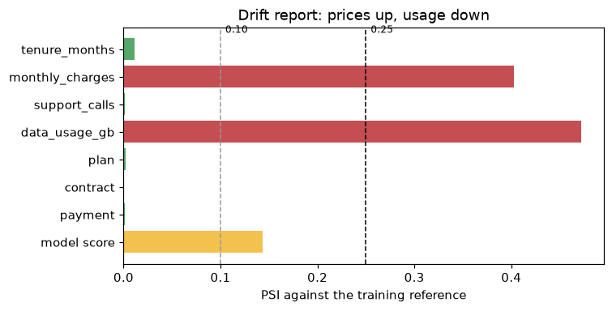

# Level 5 capstone solution: a production-ready churn service

> **Level 5 · Capstone solution** · Back to the [capstone brief](../level-5-capstone.md)

This is one complete, worked solution. Yours can differ in structure, tools, and wording and still be right: compare it against the [acceptance checklist](../level-5-capstone.md#acceptance-checklist), not line by line. The project is saved in the repository under `scripts/capstones/level-5/`. To reproduce everything below:

<!-- skip-run -->
```bash
cd scripts/capstones/level-5
pip install -r requirements-dev.txt
python train.py                      # tune, track, save model/ (about a minute)
python test_app.py                   # 8 tests, no server needed
python monitor.py --simulate drift   # drift report; exit code 1 on ALERT
uvicorn app:app --port 8000          # serve it
```

The outputs on this page come from running exactly these files with their default seeds. (The page runs them in a scratch copy of the folder, so nothing in the repository changes.)

## The project

```text
scripts/capstones/level-5/
├── train.py              data, pipeline, Optuna tuning, threshold, MLflow, artifacts
├── app.py                FastAPI service with pydantic validation
├── test_app.py           API contract and model behavior tests
├── monitor.py            data-quality checks and drift report
├── Dockerfile            the serving image
├── .dockerignore
├── requirements.txt      pinned serving dependencies
├── requirements-dev.txt  training, tracking, monitoring, and test dependencies
└── README.md
```

Running `train.py` adds `model/` (the artifact, its metadata, and a drift reference), `mlflow.db`, and `mlruns/` (the tracking store). The design follows the [ML in production](../../chapters/05-applied-ml/05-ml-in-production.md) chapter: one pipeline object from raw input to prediction, built by one function and used everywhere.

The cell below copies the project to a scratch folder and defines a helper that runs a script there and prints its output, so you can follow along from a notebook started at the repository root.

```python
import json
import os
import shutil
import subprocess
import sys
from pathlib import Path

import joblib
import numpy as np
import pandas as pd

PROJECT = Path(os.environ.get("CAPSTONE_DIR", "scripts/capstones/level-5")).resolve()
WORK = Path("level5-capstone-run").resolve()
shutil.rmtree(WORK, ignore_errors=True)
shutil.copytree(PROJECT, WORK, ignore=shutil.ignore_patterns("model", "mlflow.db", "mlruns", "__pycache__",
                                                             "drift_report.json"))

def run(*args):
    """Run a project script in the scratch folder, print its output and exit code."""
    result = subprocess.run([sys.executable, *args], cwd=WORK, capture_output=True, text=True,
                            env={**os.environ, "MLFLOW_DISABLE_AGENT_HINT": "1"})
    print(result.stdout.rstrip())
    if result.returncode != 0:
        print(f"[exit code {result.returncode}]")
        if not result.stdout.strip():
            print(result.stderr.strip().splitlines()[-1])

print(sorted(p.name for p in WORK.iterdir()))
```

```text
['.dockerignore', 'Dockerfile', 'README.md', 'app.py', 'monitor.py', 'requirements-dev.txt', 'requirements.txt', 'test_app.py', 'train.py']
```

## Parts A to D: training, tuning, and tracking

`train.py` does the whole training workflow in one reproducible run. The key decisions:

- **One pipeline.** `build_pipeline(params)` returns a `ColumnTransformer` (median imputation and scaling for numerics; mode imputation and one-hot encoding with `handle_unknown="ignore"` for categoricals) followed by a `HistGradientBoostingClassifier`. Tuning, the final fit, the API, and the tests all use it, so there is no second copy of the preprocessing to drift out of sync.
- **A baseline first.** A logistic regression with the same preprocessing sets the bar.
- **Optuna with pruning.** The objective loops over 4 CV folds itself and reports the running mean AUC after each fold, so the `MedianPruner` can stop weak trials early. Learning rate, leaf size, and L2 penalty are searched on log scales. Each trial is logged as a nested MLflow run.
- **The threshold from out-of-fold predictions.** An offer to a customer with churn probability $p$ is worth $0.3 \times 200\,p - 20$ dollars in expectation, so it pays when $p > 1/3$. The script picks the profit-maximizing threshold on out-of-fold predictions of the training set, which keeps the test set untouched.
- **The test set once.** Only the final pipeline is scored on it.
- **Artifacts with metadata.** `model.joblib`, `metadata.json` (version, threshold, schema, metrics, data hash, library versions), and `reference.csv` (2,000 training rows with model scores, for drift monitoring). The model is also logged and registered in MLflow.

??? example "train.py (full source)"

    <!-- skip-run -->
    ```python
    """Level 5 capstone: train, tune, track, and save the churn model.

    Usage (from this directory):
        python train.py                     # 25 Optuna trials, writes model/ and mlflow.db
        python train.py --n-trials 10       # faster
        python train.py --data customers.csv  # train on your own CSV with the same columns plus `churned`

    Outputs:
        model/model.joblib      the fitted scikit-learn pipeline (preprocessing + model)
        model/metadata.json     version, threshold, schema, metrics, data hash, library versions
        model/reference.csv     a sample of training rows with model scores (the drift reference)
        mlflow.db, mlruns/      the MLflow tracking store (browse with: mlflow ui --backend-store-uri sqlite:///mlflow.db)
    """
    import argparse
    import hashlib
    import json
    import logging
    import os
    import platform
    import warnings
    from pathlib import Path

    os.environ.setdefault("OMP_NUM_THREADS", "2")      # small data: a few threads are faster than many
    os.environ.setdefault("MLFLOW_ENABLE_ARTIFACTS_PROGRESS_BAR", "false")
    os.environ.setdefault("MLFLOW_DISABLE_AGENT_HINT", "1")

    import joblib
    import mlflow
    import mlflow.sklearn
    import numpy as np
    import optuna
    import pandas as pd
    import sklearn
    from sklearn.compose import ColumnTransformer
    from sklearn.ensemble import HistGradientBoostingClassifier
    from sklearn.impute import SimpleImputer
    from sklearn.linear_model import LogisticRegression
    from sklearn.metrics import average_precision_score, brier_score_loss, roc_auc_score
    from sklearn.model_selection import StratifiedKFold, cross_val_predict, train_test_split
    from sklearn.pipeline import Pipeline
    from sklearn.preprocessing import OneHotEncoder, StandardScaler

    MODEL_VERSION = "1.0.0"
    NUMERIC = ["tenure_months", "monthly_charges", "support_calls", "data_usage_gb"]
    CATEGORICAL = ["plan", "contract", "payment"]
    TARGET = "churned"
    # Valid input ranges and categories: used by the API schema and by monitoring.
    SCHEMA = {
        "tenure_months": [0, 600], "monthly_charges": [1, 500], "support_calls": [0, 100], "data_usage_gb": [0, 2000],
        "plan": ["basic", "standard", "premium"], "contract": ["monthly", "annual"],
        "payment": ["card", "bank", "invoice"],
    }
    # Business costs (USD): a retention offer costs 20; it saves a churner worth 200 with probability 0.3.
    OFFER_COST, CUSTOMER_VALUE, OFFER_SUCCESS = 20.0, 200.0, 0.3

    logging.getLogger("mlflow").setLevel(logging.ERROR)
    optuna.logging.set_verbosity(optuna.logging.WARNING)
    warnings.filterwarnings("ignore", category=UserWarning, module="mlflow")


    def make_churn_data(n=6000, seed=0, charges_shift=0.0, premium_effect=-0.5, usage_scale=1.0):
        """Synthetic churn data for a subscription business.

        charges_shift and usage_scale change P(X) (data drift); premium_effect changes P(y | X) (concept drift).
        About 5% of data_usage_gb values are missing, as in real usage logs.
        """
        rng = np.random.default_rng(seed)
        tenure = rng.integers(1, 72, n)
        plan = rng.choice(["basic", "standard", "premium"], n, p=[0.5, 0.3, 0.2])
        base_price = pd.Series(plan).map({"basic": 45, "standard": 70, "premium": 95}).to_numpy()
        charges = np.round(np.clip(base_price + charges_shift + rng.normal(0, 12, n), 10, 300), 2)
        contract = np.where(rng.random(n) < 0.35 + 0.004 * tenure, "annual", "monthly")
        payment = rng.choice(["card", "bank", "invoice"], n, p=[0.5, 0.3, 0.2])
        calls = rng.poisson(1.5, n)
        usage = np.round(rng.gamma(2.0, 15.0 * usage_scale, n), 1)
        logit = (-1.0 - 0.02 * tenure + 1.8 * (tenure <= 6)                  # new customers churn most
                 + 0.03 * (charges - base_price) + 0.012 * (charges - 65)    # overpaying for the plan
                 + 0.15 * calls + 1.3 * (calls >= 3) * (contract == "monthly")
                 - 1.0 * (contract == "annual") + 0.6 * (payment == "invoice")
                 + 1.4 * (usage < 8)                                         # barely using the service
                 + np.select([plan == "basic", plan == "premium"], [0.3, premium_effect], 0.0))
        churned = (rng.random(n) < 1 / (1 + np.exp(-logit))).astype(int)
        usage = usage.astype(float)
        usage[rng.random(n) < 0.05] = np.nan
        return pd.DataFrame({"tenure_months": tenure, "monthly_charges": charges, "support_calls": calls,
                             "data_usage_gb": usage, "plan": plan, "contract": contract, "payment": payment,
                             TARGET: churned})


    def build_pipeline(params=None):
        """Preprocessing + gradient boosting, as one estimator."""
        params = params or {}
        numeric = Pipeline([("impute", SimpleImputer(strategy="median")), ("scale", StandardScaler())])
        categorical = Pipeline([("impute", SimpleImputer(strategy="most_frequent")),
                                ("onehot", OneHotEncoder(handle_unknown="ignore", sparse_output=False))])
        prep = ColumnTransformer([("num", numeric, NUMERIC), ("cat", categorical, CATEGORICAL)])
        model = HistGradientBoostingClassifier(max_iter=200, early_stopping=False, random_state=0, **params)
        return Pipeline([("prep", prep), ("model", model)])


    def build_baseline():
        """A logistic regression with the same preprocessing: the model to beat."""
        pipe = build_pipeline()
        pipe.steps[-1] = ("model", LogisticRegression(max_iter=1000))
        return pipe


    def data_fingerprint(df):
        return hashlib.sha256(pd.util.hash_pandas_object(df, index=False).to_numpy().tobytes()).hexdigest()[:12]


    def best_threshold(y, p):
        """Send the offer when the expected saving beats its cost; pick the threshold by expected profit."""
        thresholds = np.round(np.arange(0.05, 0.95, 0.01), 2)
        profit = [np.sum(np.where(p >= t, y * OFFER_SUCCESS * CUSTOMER_VALUE - OFFER_COST, 0.0)) / len(y)
                  for t in thresholds]
        k = int(np.argmax(profit))
        return float(thresholds[k]), float(profit[k])


    def objective_factory(X, y, cv):
        def objective(trial):
            params = {
                "learning_rate": trial.suggest_float("learning_rate", 0.01, 0.3, log=True),
                "max_leaf_nodes": trial.suggest_int("max_leaf_nodes", 4, 48),
                "min_samples_leaf": trial.suggest_int("min_samples_leaf", 10, 200, log=True),
                "l2_regularization": trial.suggest_float("l2_regularization", 1e-4, 10.0, log=True),
            }
            scores = []
            for fold, (tr, va) in enumerate(cv.split(X, y)):
                pipe = build_pipeline(params).fit(X.iloc[tr], y[tr])
                scores.append(roc_auc_score(y[va], pipe.predict_proba(X.iloc[va])[:, 1]))
                trial.report(float(np.mean(scores)), fold)          # running mean after each fold
                if trial.should_prune():
                    raise optuna.TrialPruned()
            cv_auc = float(np.mean(scores))
            with mlflow.start_run(run_name=f"trial {trial.number}", nested=True):
                mlflow.log_params(params)
                mlflow.log_metric("cv_auc", cv_auc)
            return cv_auc
        return objective


    def main():
        parser = argparse.ArgumentParser(description=__doc__, formatter_class=argparse.RawDescriptionHelpFormatter)
        parser.add_argument("--data", help="CSV with the feature columns and `churned`; default: synthetic data")
        parser.add_argument("--n-trials", type=int, default=25)
        parser.add_argument("--seed", type=int, default=0)
        parser.add_argument("--out", default="model")
        parser.add_argument("--tracking-uri", default="sqlite:///mlflow.db")
        args = parser.parse_args()

        df = pd.read_csv(args.data) if args.data else make_churn_data(seed=args.seed)
        X, y = df[NUMERIC + CATEGORICAL], df[TARGET].to_numpy()
        X_train, X_test, y_train, y_test = train_test_split(X, y, test_size=0.25, stratify=y, random_state=args.seed)
        cv = StratifiedKFold(n_splits=4, shuffle=True, random_state=args.seed)
        print(f"data: {len(df):,} rows, churn rate {y.mean():.3f}; train {len(X_train):,}, test {len(X_test):,}")

        mlflow.set_tracking_uri(args.tracking_uri)
        mlflow.set_experiment("churn-capstone")
        with mlflow.start_run(run_name=f"churn {MODEL_VERSION}"):
            mlflow.set_tag("data_sha256", data_fingerprint(X_train))
            mlflow.log_params({"n_trials": args.n_trials, "seed": args.seed, "n_train": len(X_train)})

            # 1. Baseline to beat
            base_p = cross_val_predict(build_baseline(), X_train, y_train, cv=cv, method="predict_proba")[:, 1]
            base_auc = roc_auc_score(y_train, base_p)
            mlflow.log_metric("baseline_cv_auc", base_auc)
            print(f"baseline logistic regression: CV AUC {base_auc:.4f}")

            # 2. Tune gradient boosting with Optuna (TPE + median pruning), one nested MLflow run per trial
            study = optuna.create_study(direction="maximize",
                                        sampler=optuna.samplers.TPESampler(seed=args.seed),
                                        pruner=optuna.pruners.MedianPruner(n_startup_trials=5, n_warmup_steps=1))
            study.optimize(objective_factory(X_train, y_train, cv), n_trials=args.n_trials)
            pruned = sum(t.state == optuna.trial.TrialState.PRUNED for t in study.trials)
            best = study.best_params
            print(f"optuna: {args.n_trials} trials ({pruned} pruned); best CV AUC {study.best_value:.4f}")
            print("best params:", {k: round(v, 4) if isinstance(v, float) else v for k, v in best.items()})
            mlflow.log_params({f"best_{k}": v for k, v in best.items()})
            mlflow.log_metric("best_cv_auc", study.best_value)

            # 3. Choose the decision threshold from out-of-fold predictions (not the test set)
            oof = cross_val_predict(build_pipeline(best), X_train, y_train, cv=cv, method="predict_proba")[:, 1]
            threshold, cv_profit = best_threshold(y_train, oof)
            print(f"threshold {threshold:.2f} (CV expected profit USD {cv_profit:.2f} per customer)")

            # 4. Fit on all training data and evaluate once on the test set
            pipe = build_pipeline(best).fit(X_train, y_train)
            p_test = pipe.predict_proba(X_test)[:, 1]
            flagged = p_test >= threshold
            metrics = {
                "test_auc": roc_auc_score(y_test, p_test),
                "test_avg_precision": average_precision_score(y_test, p_test),
                "test_brier": brier_score_loss(y_test, p_test),
                "test_flag_rate": float(flagged.mean()),
                "test_profit_per_customer": float(np.mean(np.where(
                    flagged, y_test * OFFER_SUCCESS * CUSTOMER_VALUE - OFFER_COST, 0.0))),
            }
            metrics = {k: round(float(v), 4) for k, v in metrics.items()}
            mlflow.log_metrics(metrics)
            mlflow.log_metric("threshold", threshold)
            print("test:", metrics)

            # 5. Save the artifact, its metadata, and a drift reference
            out = Path(args.out)
            out.mkdir(parents=True, exist_ok=True)
            joblib.dump(pipe, out / "model.joblib")
            reference = X_train.sample(min(2000, len(X_train)), random_state=args.seed)
            reference.assign(score=pipe.predict_proba(reference)[:, 1].round(5)).to_csv(out / "reference.csv", index=False)
            meta = {
                "name": "churn", "version": MODEL_VERSION, "threshold": threshold,
                "features": {"numeric": NUMERIC, "categorical": CATEGORICAL}, "schema": SCHEMA,
                "best_params": best, "metrics": metrics, "baseline_cv_auc": round(base_auc, 4),
                "best_cv_auc": round(study.best_value, 4), "training_rows": len(X_train),
                "training_data_sha256": data_fingerprint(X_train),
                "versions": {"python": platform.python_version(), "scikit-learn": sklearn.__version__,
                             "pandas": pd.__version__, "numpy": np.__version__},
            }
            (out / "metadata.json").write_text(json.dumps(meta, indent=2))
            mlflow.log_artifacts(str(out), artifact_path="model_files")
            # MLflow saves scikit-learn models with skops, which refuses types it can't vet unless you
            # vouch for them. We created this model ourselves, so we trust its tree predictor type.
            info = mlflow.sklearn.log_model(
                pipe, name="model", input_example=X_train.head(3),
                pip_requirements=[f"scikit-learn=={sklearn.__version__}", f"pandas=={pd.__version__}"],
                skops_trusted_types=["numpy.dtype", "sklearn.ensemble._hist_gradient_boosting.predictor.TreePredictor"])
            version = mlflow.register_model(info.model_uri, "churn-capstone").version
            print(f"saved {out}/ (model.joblib, metadata.json, reference.csv); "
                  f"registered churn-capstone version {version}")


    if __name__ == "__main__":
        main()
    ```

```python
run("train.py")
```

```text
data: 6,000 rows, churn rate 0.253; train 4,500, test 1,500
baseline logistic regression: CV AUC 0.7838
optuna: 25 trials (3 pruned); best CV AUC 0.8102
best params: {'learning_rate': 0.0182, 'max_leaf_nodes': 15, 'min_samples_leaf': 32, 'l2_regularization': 0.0056}
threshold 0.36 (CV expected profit USD 3.96 per customer)
test: {'test_auc': 0.7789, 'test_avg_precision': 0.5805, 'test_brier': 0.1489, 'test_flag_rate': 0.2353, 'test_profit_per_customer': 3.4133}
saved model/ (model.joblib, metadata.json, reference.csv); registered churn-capstone version 1
```

Reading the output:

- **Tuning beat the baseline** by a clear margin in cross-validation (about 0.81 against 0.78 AUC). The data has nonlinear effects (a churn spike in the first months, very low usage, frequent support calls on monthly contracts) that trees capture and a linear model doesn't.
- **The test AUC is lower than the best CV AUC.** Two things contribute. The best of 25 trials carries the winner's curse from the [tuning chapter](../../chapters/05-applied-ml/02-hyperparameter-tuning.md), and the test set has only 1,500 customers, so its AUC has a standard error of roughly 0.013. The test number is the one to report; the CV number was used for selection.
- **The threshold** landed close to the theoretical $1/3$, which is a sign that the gradient-boosting probabilities are reasonably calibrated. About a quarter of customers get an offer, and the expected profit is a few dollars per customer across the whole base.

Now look at what MLflow recorded. The tracking store is a SQLite file in the project folder:

```python
import logging

os.environ["MLFLOW_ENABLE_ARTIFACTS_PROGRESS_BAR"] = "false"
import mlflow
import mlflow.sklearn

logging.getLogger("mlflow").setLevel(logging.ERROR)
mlflow.set_tracking_uri(f"sqlite:///{WORK / 'mlflow.db'}")
runs = mlflow.search_runs(experiment_names=["churn-capstone"])
parent = runs[runs["tags.mlflow.parentRunId"].isna()].iloc[0]
trials = runs[runs["tags.mlflow.parentRunId"].notna()].sort_values("metrics.cv_auc", ascending=False)
print(f"{len(runs)} runs: 1 training run + {len(trials)} completed trials (pruned trials aren't logged)")
print("training run metrics:", {k.removeprefix("metrics."): round(float(v), 4) for k, v in sorted(parent.items())
                                if k.startswith("metrics.") and not pd.isna(v)})
top = trials[["tags.mlflow.runName", "metrics.cv_auc", "params.learning_rate", "params.max_leaf_nodes"]].head(3)
print(top.astype({"params.learning_rate": float}).round(4).to_string(index=False))

meta = json.loads((WORK / "model" / "metadata.json").read_text())
registered = mlflow.sklearn.load_model("models:/churn-capstone/1")
from_disk = joblib.load(WORK / "model" / "model.joblib")
ref = pd.read_csv(WORK / "model" / "reference.csv")
X_ref = ref[meta["features"]["numeric"] + meta["features"]["categorical"]]
print("registered model == saved model:",
      bool(np.allclose(registered.predict_proba(X_ref)[:, 1], from_disk.predict_proba(X_ref)[:, 1])))
print({k: meta[k] for k in ["version", "threshold", "training_data_sha256", "versions"]})
```

```text
23 runs: 1 training run + 22 completed trials (pruned trials aren't logged)
training run metrics: {'baseline_cv_auc': 0.7838, 'best_cv_auc': 0.8102, 'test_auc': 0.7789, 'test_avg_precision': 0.5805, 'test_brier': 0.1489, 'test_flag_rate': 0.2353, 'test_profit_per_customer': 3.4133, 'threshold': 0.36}
tags.mlflow.runName  metrics.cv_auc  params.learning_rate params.max_leaf_nodes
           trial 22          0.8102                0.0182                    15
           trial 21          0.8096                0.0236                    12
           trial 20          0.8087                0.0193                     7
registered model == saved model: True
{'version': '1.0.0', 'threshold': 0.36, 'training_data_sha256': '4e2121293543', 'versions': {'python': '3.13.5', 'scikit-learn': '1.9.1', 'pandas': '3.0.6', 'numpy': '2.5.3'}}
```

Every number in the console output is now in a searchable store, along with every trial's parameters. That's what lets you answer "which model is in production, and how was it chosen?" six months from now.

## Part E: the API and its tests

`app.py` defines a `Customer` schema with pydantic: integer and float fields with bounds from the training schema, `Literal` types for categories, an optional `data_usage_gb`, and `extra="forbid"`, so that a misspelled field is an error instead of being silently ignored (which would leave the model imputing a value the caller thought they'd sent). The model is loaded in the FastAPI `lifespan` function, once, at startup, so importing the module never fails and requests never pay the loading cost. Besides `/health` and `/predict`, a `/model-info` endpoint reports the running model's version, threshold, metrics, and data hash.

??? example "app.py (full source)"

    <!-- skip-run -->
    ```python
    """Level 5 capstone: the churn model as an HTTP service.

    Run locally (after `python train.py`):
        uvicorn app:app --host 0.0.0.0 --port 8000
    Then open http://localhost:8000/docs for interactive documentation.

    Endpoints:
        GET  /health      liveness, plus the model name and version being served
        GET  /model-info  the model's metadata (threshold, metrics, training data hash)
        POST /predict     churn probabilities for 1 to 1,000 customers, with input validation

    The model directory comes from the MODEL_DIR environment variable (default: ./model).
    """
    import json
    import os
    import time
    from contextlib import asynccontextmanager
    from pathlib import Path
    from typing import Literal

    import joblib
    import pandas as pd
    from fastapi import FastAPI, HTTPException
    from pydantic import BaseModel, ConfigDict, Field


    class Customer(BaseModel):
        """One customer's features. Bounds match the training schema in train.py."""

        model_config = ConfigDict(extra="forbid")          # a misspelled field is an error, not ignored

        tenure_months: int = Field(ge=0, le=600, description="months as a customer")
        monthly_charges: float = Field(ge=1, le=500, description="monthly bill in USD")
        support_calls: int = Field(ge=0, le=100, description="support calls in the last month")
        data_usage_gb: float | None = Field(default=None, ge=0, le=2000,
                                            description="monthly data usage; may be missing")
        plan: Literal["basic", "standard", "premium"]
        contract: Literal["monthly", "annual"]
        payment: Literal["card", "bank", "invoice"]


    class PredictRequest(BaseModel):
        customers: list[Customer] = Field(min_length=1, max_length=1000)


    class Prediction(BaseModel):
        churn_probability: float
        at_risk: bool


    class PredictResponse(BaseModel):
        model_version: str
        threshold: float
        predictions: list[Prediction]


    def create_app(model_dir: str | None = None) -> FastAPI:
        """Build the app. The model is loaded once, at startup, from model_dir or $MODEL_DIR."""
        state = {}

        @asynccontextmanager
        async def lifespan(app: FastAPI):
            path = Path(model_dir or os.environ.get("MODEL_DIR", "model"))
            state["model"] = joblib.load(path / "model.joblib")
            state["meta"] = json.loads((path / "metadata.json").read_text())
            state["columns"] = state["meta"]["features"]["numeric"] + state["meta"]["features"]["categorical"]
            yield
            state.clear()

        app = FastAPI(title="Churn model", lifespan=lifespan)

        @app.get("/health")
        def health():
            if "model" not in state:
                raise HTTPException(status_code=503, detail="model not loaded")
            return {"status": "ok", "model": state["meta"]["name"], "model_version": state["meta"]["version"]}

        @app.get("/model-info")
        def model_info():
            meta = state["meta"]
            return {k: meta[k] for k in ["name", "version", "threshold", "metrics", "training_data_sha256", "versions"]}

        @app.post("/predict", response_model=PredictResponse)
        def predict(request: PredictRequest):
            started = time.perf_counter()
            frame = pd.DataFrame([c.model_dump() for c in request.customers])[state["columns"]]
            frame["data_usage_gb"] = frame["data_usage_gb"].astype(float)      # None -> NaN, imputed by the pipeline
            proba = state["model"].predict_proba(frame)[:, 1]
            threshold = state["meta"]["threshold"]
            response = PredictResponse(
                model_version=state["meta"]["version"], threshold=threshold,
                predictions=[Prediction(churn_probability=round(float(p), 4), at_risk=bool(p >= threshold))
                             for p in proba])
            state["last_latency_ms"] = (time.perf_counter() - started) * 1000   # a hook for monitoring
            return response

        return app


    app = create_app()
    ```

Call it in-process with `TestClient`, which runs the app's lifespan without starting a server:

```python
import warnings

warnings.filterwarnings("ignore", message=".*httpx.*")
sys.path.insert(0, str(WORK))
from fastapi.testclient import TestClient

import app as churn_app

customers = [
    {"tenure_months": 3, "monthly_charges": 89.5, "support_calls": 4, "data_usage_gb": 5.0,
     "plan": "basic", "contract": "monthly", "payment": "invoice"},
    {"tenure_months": 60, "monthly_charges": 92.0, "support_calls": 0, "data_usage_gb": None,
     "plan": "premium", "contract": "annual", "payment": "card"},
]
with TestClient(churn_app.create_app(str(WORK / "model"))) as client:
    print(client.get("/health").json())
    print(client.post("/predict", json={"customers": customers}).json())
    bad = {**customers[0], "monthly_charges": 8950.0, "plan": "gold", "monthly_charge": 89.5}
    r = client.post("/predict", json={"customers": [bad]})
    print(r.status_code, [f"{'.'.join(map(str, e['loc'][3:]))}: {e['msg']}" for e in r.json()["detail"]])
```

```text
{'status': 'ok', 'model': 'churn', 'model_version': '1.0.0'}
{'model_version': '1.0.0', 'threshold': 0.36, 'predictions': [{'churn_probability': 0.8885, 'at_risk': True}, {'churn_probability': 0.0726, 'at_risk': False}]}
422 ['monthly_charges: Input should be less than or equal to 500', "plan: Input should be 'basic', 'standard' or 'premium'", 'monthly_charge: Extra inputs are not permitted']
```

A new, low-usage, monthly customer with four support calls is flagged; a five-year annual premium customer isn't, even with a missing usage value (the pipeline imputes it). The bad request is rejected with all three problems listed: the charge in cents, the unknown plan, and the misspelled field.

`test_app.py` holds the tests. They're ordinary pytest functions, and the file also runs them itself when executed directly. They cover the API contract (health, a valid batch, five kinds of invalid input plus empty and oversized batches, a missing optional value) and the model's behavior (a high-risk profile scores above a loyal one, predictions don't depend on batch order, more support calls don't lower risk, and the model clears a performance floor and beats the baseline).

??? example "test_app.py (full source)"

    <!-- skip-run -->
    ```python
    """Level 5 capstone: tests for the churn service and model.

    Run with pytest if you have it (`pytest test_app.py`), or directly: `python test_app.py`.
    Requires a trained model in ./model (run `python train.py` first), or set MODEL_DIR.
    """
    import json
    import os
    import sys
    import warnings
    from pathlib import Path

    warnings.filterwarnings("ignore", message=".*httpx.*")      # a dependency deprecation notice

    import numpy as np
    from fastapi.testclient import TestClient

    from app import create_app
    from train import CATEGORICAL, NUMERIC, make_churn_data

    MODEL_DIR = Path(os.environ.get("MODEL_DIR", "model"))
    META = json.loads((MODEL_DIR / "metadata.json").read_text())

    VALID = {"tenure_months": 3, "monthly_charges": 89.5, "support_calls": 4, "data_usage_gb": 5.0,
             "plan": "basic", "contract": "monthly", "payment": "invoice"}
    LOYAL = {"tenure_months": 60, "monthly_charges": 92.0, "support_calls": 0, "data_usage_gb": 45.0,
             "plan": "premium", "contract": "annual", "payment": "card"}


    def client():
        return TestClient(create_app(str(MODEL_DIR)))


    def predict(c, customers):
        return c.post("/predict", json={"customers": customers})


    # ---------- API contract ----------

    def test_health_reports_model_version():
        with client() as c:
            r = c.get("/health")
        assert r.status_code == 200
        assert r.json() == {"status": "ok", "model": "churn", "model_version": META["version"]}


    def test_predict_returns_one_prediction_per_customer():
        with client() as c:
            r = predict(c, [VALID, LOYAL])
        assert r.status_code == 200
        body = r.json()
        assert body["model_version"] == META["version"] and body["threshold"] == META["threshold"]
        assert len(body["predictions"]) == 2
        for p in body["predictions"]:
            assert 0.0 <= p["churn_probability"] <= 1.0
            assert p["at_risk"] == (p["churn_probability"] >= META["threshold"])


    def test_missing_optional_value_is_accepted():
        with client() as c:
            r = predict(c, [{**VALID, "data_usage_gb": None}])
        assert r.status_code == 200


    def test_invalid_inputs_are_rejected_with_422():
        bad_cases = [
            {**VALID, "tenure_months": -1},                  # out of range
            {**VALID, "monthly_charges": 8950.0},            # cents instead of dollars
            {**VALID, "plan": "gold"},                       # unknown category
            {**VALID, "monthly_charge": 89.5},               # misspelled field (extra fields forbidden)
            {k: v for k, v in VALID.items() if k != "contract"},   # missing required field
        ]
        with client() as c:
            for case in bad_cases:
                assert predict(c, [case]).status_code == 422, case
            assert c.post("/predict", json={"customers": []}).status_code == 422
            assert c.post("/predict", json={"customers": [VALID] * 1001}).status_code == 422


    # ---------- model behavior ----------

    def test_high_risk_profile_scores_above_loyal_profile():
        with client() as c:
            p_new, p_loyal = [x["churn_probability"] for x in predict(c, [VALID, LOYAL]).json()["predictions"]]
        assert p_new > p_loyal


    def test_invariance_to_batch_order():
        customers = [VALID, LOYAL, {**VALID, "plan": "standard"}]
        with client() as c:
            forward = [x["churn_probability"] for x in predict(c, customers).json()["predictions"]]
            backward = [x["churn_probability"] for x in predict(c, customers[::-1]).json()["predictions"]]
        assert forward == backward[::-1]


    def test_directional_more_support_calls_do_not_lower_risk():
        import joblib
        model = joblib.load(MODEL_DIR / "model.joblib")
        X = make_churn_data(n=300, seed=123)[NUMERIC + CATEGORICAL]
        more = X.assign(support_calls=X["support_calls"] + 3)
        # tree ensembles aren't guaranteed monotone; allow tiny decreases from noise
        assert np.mean(model.predict_proba(more)[:, 1] >= model.predict_proba(X)[:, 1] - 0.01) > 0.95


    def test_model_beats_baseline_and_floor():
        assert META["metrics"]["test_auc"] >= 0.75
        assert META["best_cv_auc"] > META["baseline_cv_auc"]


    # ---------- run without pytest ----------

    if __name__ == "__main__":
        tests = [(name, f) for name, f in sorted(globals().items()) if name.startswith("test_") and callable(f)]
        failed = 0
        for name, test in tests:
            try:
                test()
                print(f"PASS {name}")
            except AssertionError as err:
                failed += 1
                print(f"FAIL {name}: {err}")
        print(f"{len(tests) - failed}/{len(tests)} tests passed")
        sys.exit(1 if failed else 0)
    ```

```python
run("test_app.py")
```

```text
PASS test_directional_more_support_calls_do_not_lower_risk
PASS test_health_reports_model_version
PASS test_high_risk_profile_scores_above_loyal_profile
PASS test_invalid_inputs_are_rejected_with_422
PASS test_invariance_to_batch_order
PASS test_missing_optional_value_is_accepted
PASS test_model_beats_baseline_and_floor
PASS test_predict_returns_one_prediction_per_customer
8/8 tests passed
```

The directional test allows tiny decreases: a gradient-boosting model isn't guaranteed to be monotone in any feature, so the test checks that at least 95% of customers don't get *less* risky with three more support calls. If you need a guarantee, `HistGradientBoostingClassifier` accepts `monotonic_cst` to enforce it.

## Part F: packaging

The Dockerfile installs the pinned serving dependencies before copying the code (so rebuilding after a code change reuses the cached dependency layer), copies only the two model files the service needs, runs as an unprivileged user, and declares a health check that calls `/health`. Training dependencies (Optuna, MLflow) stay out of the image, in `requirements-dev.txt`.

```dockerfile
# Level 5 capstone: the churn model service.
# Build after training (python train.py), from this directory:
#   docker build -t churn-api:1.0.0 .
#   docker run --rm -p 8000:8000 churn-api:1.0.0
FROM python:3.13-slim

ENV PYTHONDONTWRITEBYTECODE=1 \
    PYTHONUNBUFFERED=1 \
    MODEL_DIR=/app/model

WORKDIR /app

# Dependencies first, so this layer stays cached until requirements.txt changes
COPY requirements.txt .
RUN pip install --no-cache-dir -r requirements.txt

# The service code and the trained model artifact
COPY app.py .
COPY model/model.joblib model/metadata.json ./model/

# Run as an unprivileged user
RUN useradd --create-home appuser
USER appuser

EXPOSE 8000
HEALTHCHECK --interval=30s --timeout=3s --start-period=10s \
    CMD python -c "import urllib.request; urllib.request.urlopen('http://localhost:8000/health')"
CMD ["uvicorn", "app:app", "--host", "0.0.0.0", "--port", "8000", "--workers", "2"]
```

??? example "requirements.txt, requirements-dev.txt, and .dockerignore"

    ```text
    # Serving dependencies (installed in the Docker image). Pin exact versions:
    # the pickled pipeline must be loaded with the scikit-learn version it was trained with.
    fastapi==0.142.2
    uvicorn==0.54.0
    pydantic==2.13.5
    scikit-learn==1.9.1
    pandas==3.0.6
    numpy==2.5.3
    joblib==1.6.0
    ```

    ```text
    # Training, tracking, monitoring, and testing (not needed in the serving image).
    -r requirements.txt
    optuna==5.0.0
    mlflow==3.16.1
    scipy==1.18.1
    httpx==0.28.1
    pytest
    ```

    ```text
    __pycache__/
    mlruns/
    mlflow.db
    *.csv
    drift_report.json
    model/reference.csv
    ```

Docker wasn't run to produce this page. With Docker installed, build and smoke-test the image like this:

<!-- skip-run -->
```bash
cd scripts/capstones/level-5
python train.py
docker build -t churn-api:1.0.0 .
docker run --rm -d -p 8000:8000 --name churn churn-api:1.0.0
curl -s localhost:8000/health        # {"status":"ok","model":"churn","model_version":"1.0.0"}
docker stop churn
```

## Part G: monitoring and retraining

`monitor.py` checks a batch against the training reference in two stages. First, **data quality**: required columns, missing rates, ranges, and categories from the schema saved in `metadata.json`. If anything fails, it stops there with a blocking alert, because drift statistics on broken data are meaningless and retraining on it would bake the bug into the next model. Second, **drift**: PSI for every feature (quantile bins for numerics, one bin per category) and for the model's scores, with a KS test for numerics as a secondary signal. It writes `drift_report.json` and exits with code 1 on any ALERT, so a scheduler can halt the scoring job.

??? example "monitor.py (full source)"

    <!-- skip-run -->
    ```python
    """Level 5 capstone: a data-quality and drift report for a batch of production data.

    Usage (after `python train.py`):
        python monitor.py --batch new_customers.csv        # check a real batch
        python monitor.py --simulate none                   # a simulated batch with no drift
        python monitor.py --simulate drift                  # prices up, usage down (data drift)
        python monitor.py --simulate bug                    # charges in cents and a renamed category

    Compares the batch with model/reference.csv (a sample of training data with model scores):
    data-quality checks against the training schema, PSI for every feature and for the model's
    scores, and a two-sample KS test for numeric features. Writes drift_report.json, prints a
    table, and exits with code 1 if any check is at ALERT level (so a scheduler can stop the
    scoring job).
    """
    import argparse
    import json
    import sys
    from pathlib import Path

    import joblib
    import numpy as np
    import pandas as pd
    from scipy import stats

    from train import make_churn_data

    PSI_WARN, PSI_ALERT = 0.10, 0.25          # common rules of thumb, not laws
    MAX_MISSING, MAX_OUT_OF_RANGE = 0.10, 0.01


    def psi_numeric(reference, current, bins=10, eps=1e-4):
        """Population stability index with quantile bins from the reference."""
        reference, current = reference.dropna().to_numpy(), current.dropna().to_numpy()
        edges = np.unique(np.quantile(reference, np.linspace(0, 1, bins + 1)))
        edges[0], edges[-1] = -np.inf, np.inf
        e = np.histogram(reference, edges)[0] / len(reference)
        a = np.histogram(current, edges)[0] / len(current)
        e, a = np.clip(e, eps, None), np.clip(a, eps, None)
        return float(np.sum((a - e) * np.log(a / e)))


    def psi_categorical(reference, current, eps=1e-4):
        cats = sorted(set(reference.dropna()) | set(current.dropna()))
        e = reference.value_counts(normalize=True).reindex(cats, fill_value=0).to_numpy()
        a = current.value_counts(normalize=True).reindex(cats, fill_value=0).to_numpy()
        e, a = np.clip(e, eps, None), np.clip(a, eps, None)
        return float(np.sum((a - e) * np.log(a / e)))


    def level(psi):
        return "ALERT" if psi > PSI_ALERT else "WARN" if psi > PSI_WARN else "OK"


    def quality_checks(batch, meta):
        """Schema checks: required columns, missing rates, ranges, unseen categories."""
        issues = []
        cols = meta["features"]["numeric"] + meta["features"]["categorical"]
        missing_cols = [c for c in cols if c not in batch.columns]
        if missing_cols:
            return [{"check": "columns", "status": "ALERT", "detail": f"missing columns {missing_cols}"}]
        for col in meta["features"]["numeric"]:
            lo, hi = meta["schema"][col]
            miss = batch[col].isna().mean()
            out = (~batch[col].dropna().between(lo, hi)).mean()
            if miss > MAX_MISSING:
                issues.append({"check": f"{col} missing", "status": "ALERT", "detail": f"{miss:.1%} missing"})
            if out > MAX_OUT_OF_RANGE:
                issues.append({"check": f"{col} range", "status": "ALERT",
                               "detail": f"{out:.1%} outside [{lo}, {hi}]"})
        for col in meta["features"]["categorical"]:
            unseen = sorted(set(batch[col].dropna()) - set(meta["schema"][col]))
            if unseen:
                issues.append({"check": f"{col} categories", "status": "ALERT", "detail": f"unseen values {unseen}"})
        return issues


    def drift_report(batch, reference, model, meta):
        rows = []
        for col in meta["features"]["numeric"]:
            p = psi_numeric(reference[col], batch[col])
            ks = stats.ks_2samp(reference[col].dropna(), batch[col].dropna())
            rows.append({"feature": col, "psi": round(p, 4), "ks_d": round(float(ks.statistic), 4),
                         "ks_p": float(f"{ks.pvalue:.2g}"), "status": level(p)})
        for col in meta["features"]["categorical"]:
            p = psi_categorical(reference[col], batch[col])
            rows.append({"feature": col, "psi": round(p, 4), "ks_d": None, "ks_p": None, "status": level(p)})
        cols = meta["features"]["numeric"] + meta["features"]["categorical"]
        scores = pd.Series(model.predict_proba(batch[cols])[:, 1])
        p = psi_numeric(reference["score"], scores)
        rows.append({"feature": "model score", "psi": round(p, 4), "ks_d": None, "ks_p": None, "status": level(p)})
        summary = {"mean_score_reference": round(float(reference["score"].mean()), 4),
                   "mean_score_batch": round(float(scores.mean()), 4),
                   "flag_rate_batch": round(float((scores >= meta["threshold"]).mean()), 4)}
        return rows, summary


    def simulate(kind, n=2000, seed=99):
        if kind == "none":
            return make_churn_data(n=n, seed=seed)
        if kind == "drift":
            return make_churn_data(n=n, seed=seed, charges_shift=12.0, usage_scale=0.6)
        if kind == "bug":
            df = make_churn_data(n=n, seed=seed)
            df["monthly_charges"] = df["monthly_charges"] * 100           # dollars -> cents upstream
            df["plan"] = df["plan"].replace({"premium": "Premium"})        # a renamed category
            return df
        raise ValueError(kind)


    def main():
        parser = argparse.ArgumentParser(description=__doc__, formatter_class=argparse.RawDescriptionHelpFormatter)
        src = parser.add_mutually_exclusive_group(required=True)
        src.add_argument("--batch", help="CSV of production rows with the model's feature columns")
        src.add_argument("--simulate", choices=["none", "drift", "bug"])
        parser.add_argument("--model-dir", default="model")
        parser.add_argument("--out", default="drift_report.json")
        args = parser.parse_args()

        model_dir = Path(args.model_dir)
        meta = json.loads((model_dir / "metadata.json").read_text())
        model = joblib.load(model_dir / "model.joblib")
        reference = pd.read_csv(model_dir / "reference.csv")
        batch = pd.read_csv(args.batch) if args.batch else simulate(args.simulate)
        source = args.batch or f"simulated ({args.simulate})"

        issues = quality_checks(batch, meta)
        report = {"model_version": meta["version"], "batch": source, "rows": len(batch), "quality": issues}
        if issues:
            report["drift"], report["summary"] = [], {}
            report["status"] = "ALERT"
            report["action"] = "Block scoring and retraining; fix the data pipeline first."
        else:
            rows, summary = drift_report(batch, reference, model, meta)
            report["drift"], report["summary"] = rows, summary
            worst = max((r["status"] for r in rows), key=["OK", "WARN", "ALERT"].index)
            report["status"] = worst
            report["action"] = {"OK": "No action.",
                                "WARN": "Investigate the drifting features; watch performance as labels arrive.",
                                "ALERT": "Major drift: check impact on performance; consider retraining."}[worst]
        Path(args.out).write_text(json.dumps(report, indent=2))

        print(f"drift report for model {meta['version']} | batch: {source} | {len(batch):,} rows")
        if issues:
            for i in issues:
                print(f"  [{i['status']}] {i['check']}: {i['detail']}")
        else:
            table = pd.DataFrame(report["drift"]).set_index("feature")
            table["ks_p"] = table["ks_p"].map(lambda v: "-" if pd.isna(v) else f"{v:.2g}")
            print(table.to_string(na_rep="-"))
            print("summary:", report["summary"])
        print(f"status: {report['status']} -> {report['action']}")
        sys.exit(1 if report["status"] == "ALERT" else 0)


    if __name__ == "__main__":
        main()
    ```

Three simulated batches, each with a different expected verdict. First, new customers from the same distribution:

```python
run("monitor.py", "--simulate", "none")
```

```text
drift report for model 1.0.0 | batch: simulated (none) | 2,000 rows
                    psi    ks_d  ks_p status
feature
tenure_months    0.0113  0.0345  0.18     OK
monthly_charges  0.0063  0.0300  0.33     OK
support_calls    0.0016  0.0150  0.98     OK
data_usage_gb    0.0074  0.0246   0.6     OK
plan             0.0021       -     -     OK
contract         0.0006       -     -     OK
payment          0.0012       -     -     OK
model score      0.0083       -     -     OK
summary: {'mean_score_reference': 0.2515, 'mean_score_batch': 0.2417, 'flag_rate_batch': 0.2225}
status: OK -> No action.
```

Everything is stable. Now a batch where prices rose by USD 12 and data usage fell by 40%:

```python
run("monitor.py", "--simulate", "drift")
drift = pd.DataFrame(json.loads((WORK / "drift_report.json").read_text())["drift"])
```

```text
drift report for model 1.0.0 | batch: simulated (drift) | 2,000 rows
                    psi    ks_d     ks_p status
feature
tenure_months    0.0113  0.0345     0.18     OK
monthly_charges  0.4027  0.2315  2.2e-47  ALERT
support_calls    0.0016  0.0150     0.98     OK
data_usage_gb    0.4718  0.2616  1.2e-57  ALERT
plan             0.0021       -        -     OK
contract         0.0006       -        -     OK
payment          0.0012       -        -     OK
model score      0.1436       -        -   WARN
summary: {'mean_score_reference': 0.2515, 'mean_score_batch': 0.3025, 'flag_rate_batch': 0.325}
status: ALERT -> Major drift: check impact on performance; consider retraining.
[exit code 1]
```

```python
import matplotlib.pyplot as plt

colors = drift["status"].map({"OK": "#55A868", "WARN": "#F2C14E", "ALERT": "#C44E52"})
fig, ax = plt.subplots(figsize=(7, 3.6))
ax.barh(drift["feature"], drift["psi"], color=colors)
ax.axvline(0.10, color="#999999", ls="--", lw=1)
ax.axvline(0.25, color="black", ls="--", lw=1)
ax.text(0.105, -0.6, "0.10", fontsize=8)
ax.text(0.255, -0.6, "0.25", fontsize=8)
ax.invert_yaxis()
ax.set_xlabel("PSI against the training reference")
ax.set_title("Drift report: prices up, usage down")
plt.tight_layout()
plt.show()
```



*The two drifted inputs cross the major-shift line, and the shift propagates into the model's scores: more customers now look risky.*

The monitor pinpoints the two drifted features, and the score PSI and the higher flag rate show that the drift matters to the model's output: the retention team will suddenly get a longer list. Finally, a batch with the classic upstream bugs, charges in cents and a renamed category:

```python
run("monitor.py", "--simulate", "bug")
```

```text
drift report for model 1.0.0 | batch: simulated (bug) | 2,000 rows
  [ALERT] monthly_charges range: 100.0% outside [1, 500]
  [ALERT] plan categories: unseen values ['Premium']
status: ALERT -> Block scoring and retraining; fix the data pipeline first.
[exit code 1]
```

The data-quality stage catches both bugs and blocks everything else, exactly the check that would have saved the scenario's three broken weeks.

Input monitoring can't see **concept drift**, where the same inputs start to mean something different. Simulate a competitor offer that makes premium customers leave, score the batch, and compare performance once the labels arrive:

```python
from sklearn.metrics import roc_auc_score

import train as churn_train

model = from_disk
cols = meta["features"]["numeric"] + meta["features"]["categorical"]
for name, effect in [("same behavior", -0.5), ("premium customers leaving", 1.5)]:
    batch = churn_train.make_churn_data(n=3000, seed=7, premium_effect=effect)
    p = model.predict_proba(batch[cols])[:, 1]
    print(f"{name:26s} churn rate {batch['churned'].mean():.3f}   mean score {p.mean():.3f}   "
          f"AUC {roc_auc_score(batch['churned'], p):.3f}")
```

```text
same behavior              churn rate 0.241   mean score 0.240   AUC 0.782
premium customers leaving  churn rate 0.316   mean score 0.240   AUC 0.765
```

The input distribution is identical in both batches (same seed, same features), so the drift report would say OK, and the model's mean score doesn't move. But the actual churn rate jumps from 24% to 32%, and the AUC drops: the model now misses a whole group of churners, and only the labels reveal it. Hence the retraining policy has three triggers:

1. **Performance (primary).** When a month's labels arrive, recompute AUC and profit per customer on that cohort. Retrain if AUC drops more than 0.03 below the test estimate, or if profit per customer drops by more than a third.
2. **Drift (investigate).** A drift ALERT triggers an investigation and an early performance check on whatever labels exist, not an automatic retrain.
3. **Schedule (backstop).** Retrain at least every 90 days on the most recent 12 months of data.

Data-quality alerts **block** both scoring and retraining. A retrained model (the challenger) is promoted only if it beats the current model (the champion) on the most recent labeled month, which neither was trained on, and after a shadow period in which both score live traffic.

## Part H: README and model card

The project's `README.md` covers setup, training, testing, serving, Docker, tracking, and monitoring:

??? example "README.md"

    ````markdown
    # Churn model service (Level 5 capstone solution)

    A small, production-style ML project: a churn model trained as a scikit-learn pipeline, tuned with
    Optuna, tracked with MLflow, served with FastAPI, packaged with Docker, and monitored for drift.
    It is the worked solution to the handbook's
    [Level 5 capstone](../../../docs/exercises/level-5-capstone.md).

    ## Layout

    | File | What it does |
    |---|---|
    | `train.py` | Generates (or loads) data, tunes a gradient-boosting pipeline with Optuna, picks a cost-based threshold, logs everything to MLflow, and saves `model/` |
    | `app.py` | FastAPI service: `/health`, `/model-info`, and `/predict` with pydantic validation |
    | `test_app.py` | API contract tests and model behavior tests (run with pytest or `python test_app.py`) |
    | `monitor.py` | Data-quality checks and a drift report (PSI, KS) for a batch of production data |
    | `Dockerfile` | Serving image: pinned dependencies, the model, a non-root user, a health check |
    | `requirements.txt` | Pinned serving dependencies (used by the image) |
    | `requirements-dev.txt` | Training, tracking, monitoring, and test dependencies |

    ## Quick start

    ```bash
    python -m venv .venv && source .venv/bin/activate
    pip install -r requirements-dev.txt

    python train.py                     # ~1 minute: writes model/ and mlflow.db
    python test_app.py                  # or: pytest test_app.py
    python monitor.py --simulate drift  # writes drift_report.json; exit code 1 on ALERT

    uvicorn app:app --port 8000         # then open http://localhost:8000/docs
    curl -s -X POST localhost:8000/predict -H "Content-Type: application/json" \
      -d '{"customers": [{"tenure_months": 3, "monthly_charges": 89.5, "support_calls": 4,
           "data_usage_gb": 5.0, "plan": "basic", "contract": "monthly", "payment": "invoice"}]}'
    ```

    ## Docker

    ```bash
    python train.py                     # the image copies model/model.joblib and model/metadata.json
    docker build -t churn-api:1.0.0 .
    docker run --rm -p 8000:8000 churn-api:1.0.0
    ```

    ## Experiment tracking

    Runs are stored in a local SQLite file (`mlflow.db`) with artifacts in `mlruns/`. Each training run is a
    parent run with one nested run per Optuna trial, the test metrics, the model files, and a registered
    model version (`churn-capstone`). Browse them with:

    ```bash
    mlflow ui --backend-store-uri sqlite:///mlflow.db
    ```

    ## Monitoring and retraining

    `monitor.py` compares a batch with `model/reference.csv` (a sample of the training data with model
    scores). Data-quality failures (missing columns, out-of-range values, unseen categories) block
    scoring and retraining. Otherwise it reports PSI for every feature and for the model's scores
    (OK below 0.1, WARN up to 0.25, ALERT above; these are rules of thumb), with KS tests for numeric
    features as a secondary signal. A suggested policy: retrain when performance on newly labeled data
    drops by more than 0.03 AUC, investigate on drift ALERTs, and retrain at least every 90 days; promote
    a retrained model only after it beats the current one on recent holdout data.

    ## Notes

    - The data is synthetic (see `make_churn_data` in `train.py`); `--data your.csv` trains on a CSV
      with the same columns plus `churned`.
    - Loading a pickled model runs code: only load `model.joblib` files you created or trust, and serve
      them with the scikit-learn version recorded in `model/metadata.json`.
    ````

A model card for this model, filled in from the outputs above:

| Section | Content |
|---|---|
| Model | Churn classifier 1.0.0: scikit-learn pipeline (imputation, scaling, one-hot encoding) and `HistGradientBoostingClassifier`, tuned with 25 Optuna trials |
| Intended use | Rank monthly-billed customers for retention offers; at-risk if predicted churn probability is at or above the stored threshold |
| Not intended for | Pricing, credit, or any decision that denies service; customers outside the training population |
| Training data | 4,500 synthetic customers (training split); data hash stored in `metadata.json` |
| Metrics | Baseline CV AUC 0.784; tuned CV AUC 0.810; test AUC 0.779, average precision 0.58, Brier score 0.149; 23.5% of test customers flagged; USD 3.41 expected profit per customer |
| Decision threshold | Chosen to maximize expected profit (offer USD 20, value USD 200, 30% save rate) on out-of-fold predictions |
| Limitations | Not monotone in support calls by construction; sensitive to price changes (monitor `monthly_charges`); performance on concept drift is only visible with labels |
| Monitoring | Data-quality checks and PSI on every batch; performance on each labeled cohort; retraining policy as above |

## Summary for the Head of Retention

> The new model ranks customers by churn risk clearly better than the simple baseline. On customers it has never seen, it identifies at-risk customers with an AUC of about 0.78. We'll send offers to customers whose predicted churn risk is above about 36%, roughly a quarter of the base, which is where an offer's expected saving outweighs its USD 20 cost. On test data, that policy yields about USD 3.41 of expected profit per customer, across all customers. The model runs as a service the CRM can call; it rejects malformed input instead of guessing; and every batch is checked for data problems and drift. We'll know it needs retraining when the monthly results show its accuracy or profit dropping, and in any case every 90 days.

## How this solution meets the checklist

| Checklist item | Where |
|---|---|
| Reproducible, end-to-end training | `python train.py` from a clean folder, fixed seeds; the outputs above |
| All preprocessing in one pipeline | `build_pipeline` in `train.py`; CV and tuning run on it |
| Baseline reported and beaten | "baseline logistic regression" vs "best CV AUC" in the training output |
| Threshold from out-of-fold predictions; test used once | `best_threshold` on `cross_val_predict` output; one test evaluation |
| MLflow: runs per trial, final run, registered model | The MLflow query above |
| Metadata saved with the artifact | `model/metadata.json` |
| 422 on invalid input; optional field accepted | `test_invalid_inputs_are_rejected_with_422`, `test_missing_optional_value_is_accepted` |
| Contract and behavior tests pass | `python test_app.py`: 8/8 |
| Dockerfile best practices | Pinned requirements, cached dependency layer, non-root user, `HEALTHCHECK` |
| Monitor verdicts: OK, drift ALERT, blocking data-quality ALERT | The three monitoring runs |
| README with setup, serving, monitoring, retraining policy | `README.md` above |
