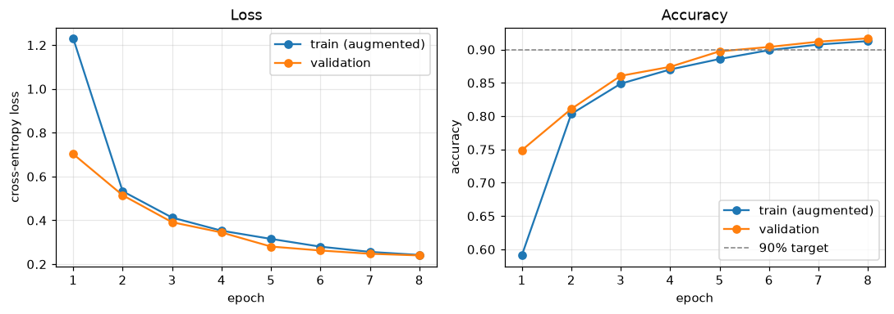
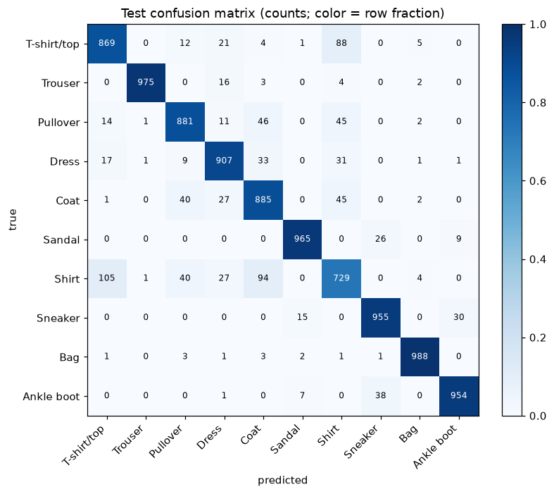
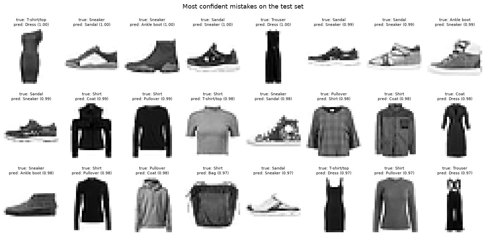

# Level 7 capstone solution: a FashionMNIST classifier above 90%

> **Level 7 · Capstone solution** · Back to the [capstone brief](../level-7-capstone.md)

This is one complete, worked solution. Yours can differ in architecture, augmentation, and wording and still be right: compare it against the [acceptance checklist](../level-7-capstone.md#acceptance-checklist), not line by line. The project is saved in the repository under `scripts/capstones/level-7/`. To reproduce everything below:

<!-- skip-run -->
```bash
cd scripts/capstones/level-7
python train.py --model linear --epochs 3 --no-augment   # the baseline, about 10 seconds
python train.py                                         # SmallResNet, 8 epochs, about 5-8 minutes on a CPU
python evaluate.py                                      # test accuracy, error analysis, figures
```

The outputs on this page come from running exactly these files with their default seeds, on a CPU with 4 threads. (The page runs them in a scratch copy of the folder, so nothing in the repository changes.) A GPU would make training several times faster, but isn't needed.

## The project

```text
scripts/capstones/level-7/
├── data.py        FashionMNIST loading, seeded train/val split, normalization, v2 augmentation, loaders
├── model.py       ResidualBlock, SmallResNet (ResNet-style CNN), LinearBaseline
├── train.py       seeded training loop: AdamW + one-cycle, CSV/TensorBoard logging, best checkpoint
└── evaluate.py    one test evaluation, per-class accuracy, confusion matrix, confused pairs, figures
```

```python
import json
import os
import shutil
import subprocess
import sys
from pathlib import Path

import numpy as np
import torch

torch.set_num_threads(4)
PROJECT = Path(os.environ.get("CAPSTONE_DIR", "scripts/capstones/level-7")).resolve()
DATA = Path("data").resolve()                             # FashionMNIST lives here (downloaded once)
WORK = Path("level7-capstone-run").resolve()
shutil.rmtree(WORK, ignore_errors=True)
shutil.copytree(PROJECT, WORK, ignore=shutil.ignore_patterns("runs", "__pycache__"))

def run(*args):
    """Run a project script in the scratch folder, print its output and exit code."""
    result = subprocess.run([sys.executable, *args, "--data-dir", str(DATA)], cwd=WORK,
                            capture_output=True, text=True)
    print(result.stdout.rstrip())
    if result.returncode != 0:
        print(f"[exit code {result.returncode}]")
        print(result.stderr.strip().splitlines()[-1])

print(sorted(p.name for p in WORK.iterdir()))
```

```text
['data.py', 'evaluate.py', 'model.py', 'train.py']
```

## Part A: the data pipeline

`data.py` loads FashionMNIST once as `uint8` tensors and keeps everything in memory (it's only 47 MB), so a `DataLoader` with `num_workers=0` is fast enough. The key decisions:

- **A seeded split.** A fixed permutation sends 6,000 of the 60,000 training images to validation and 54,000 to training. The official 10,000-image test set is untouched until the end.
- **Normalization from the training split only.** The mean and standard deviation are computed on the 54,000 training images and reused, unchanged, for validation and test.
- **Label-preserving augmentation, training only.** `v2.RandomCrop(28, padding=2)` shifts each image by up to 2 pixels, and `v2.RandomHorizontalFlip()` mirrors it. Both match the brief (off-center photos, items facing either way) and never change the category. Vertical flips and large rotations would create images that never occur at test time, so they're left out.

??? example "data.py (full source)"

    <!-- skip-run -->
    ```python
    """Level 7 capstone: FashionMNIST data pipeline.

    Loads FashionMNIST once as uint8 tensors, splits the official training set into
    train and validation with a fixed seed, and wraps each split in a Dataset that
    applies torchvision.transforms v2 augmentation (training split only).
    """

    import torch
    from torch.utils.data import DataLoader, Dataset
    from torchvision import datasets
    from torchvision.transforms import v2

    CLASSES = ["T-shirt/top", "Trouser", "Pullover", "Dress", "Coat",
               "Sandal", "Shirt", "Sneaker", "Bag", "Ankle boot"]


    class FashionDataset(Dataset):
        """Images as a uint8 tensor (N, 28, 28) plus labels; returns normalized float tensors."""

        def __init__(self, images, labels, mean, std, augment=False):
            self.images, self.labels = images, labels
            self.mean, self.std = mean, std
            # Light, label-preserving augmentation: shift by up to 2 pixels and mirror left-right.
            # Vertical flips or big rotations would create images that never occur at test time.
            self.augment = v2.Compose([v2.RandomCrop(28, padding=2), v2.RandomHorizontalFlip()]) if augment else None

        def __len__(self):
            return len(self.labels)

        def __getitem__(self, i):
            x = self.images[i].unsqueeze(0).float().div(255)      # (1, 28, 28) in [0, 1]
            if self.augment is not None:
                x = self.augment(x)
            return (x - self.mean) / self.std, self.labels[i]


    def load_splits(data_dir="data", val_size=6000, seed=0):
        """Return (train, val, test) datasets. The test set is the official 10,000-image test split."""
        train_full = datasets.FashionMNIST(data_dir, train=True, download=True)
        test = datasets.FashionMNIST(data_dir, train=False, download=True)
        g = torch.Generator().manual_seed(seed)
        perm = torch.randperm(len(train_full.targets), generator=g)
        val_idx, tr_idx = perm[:val_size], perm[val_size:]
        X, y = train_full.data, train_full.targets
        # Normalization statistics come from the training split only (no peeking at val or test).
        pixels = X[tr_idx].float().div(255)
        mean, std = pixels.mean().item(), pixels.std().item()
        train_ds = FashionDataset(X[tr_idx], y[tr_idx], mean, std, augment=True)
        val_ds = FashionDataset(X[val_idx], y[val_idx], mean, std)
        test_ds = FashionDataset(test.data, test.targets, mean, std)
        return train_ds, val_ds, test_ds


    def make_loaders(train_ds, val_ds, test_ds, batch_size=128, seed=0):
        g = torch.Generator().manual_seed(seed)
        train_dl = DataLoader(train_ds, batch_size=batch_size, shuffle=True, generator=g, num_workers=0)
        val_dl = DataLoader(val_ds, batch_size=512, num_workers=0)
        test_dl = DataLoader(test_ds, batch_size=512, num_workers=0)
        return train_dl, val_dl, test_dl
    ```

## Part B: the baseline

A softmax regression on raw pixels, trained for 3 epochs without augmentation, sets the bar:

```python
run("train.py", "--model", "linear", "--epochs", "3", "--no-augment")
```

```text
data: train 54,000, val 6,000, test 10,000 (normalize mean 0.2859, std 0.3529); augment=False
model: linear, 7,850 parameters
epoch  1  train loss 0.7170 acc 0.7569 | val loss 0.4782 acc 0.8328  * saved best.pt
epoch  2  train loss 0.4603 acc 0.8400 | val loss 0.4433 acc 0.8450  * saved best.pt
epoch  3  train loss 0.4042 acc 0.8598 | val loss 0.4173 acc 0.8543  * saved best.pt
best val acc 0.8543; checkpoint runs/linear/best.pt
```

The linear model reaches about 85% validation accuracy. That's already respectable, which is the point of a baseline: the CNN has to beat 85%, not 10%. The sanity checks from Chapter 2 come next. The CNN's loss at initialization should be about $\ln 10 = 2.30$, and it should be able to memorize one batch:

```python
sys.path.insert(0, str(WORK))
import torch.nn.functional as F
from data import load_splits, make_loaders
from model import SmallResNet, count_params

train_ds, val_ds, test_ds = load_splits(str(DATA))
train_dl, val_dl, test_dl = make_loaders(train_ds, val_ds, test_ds)
xb, yb = next(iter(train_dl))
torch.manual_seed(0)
net = SmallResNet()
net.eval()
with torch.no_grad():
    print(f"loss at initialization: {F.cross_entropy(net(xb), yb).item():.3f} (ln 10 = 2.303)")
print(f"SmallResNet: {count_params(net):,} parameters")

xb, yb = xb[:32], yb[:32]
opt = torch.optim.AdamW(net.parameters(), lr=3e-3)
net.train()
for step in range(101):
    loss = F.cross_entropy(net(xb), yb)
    opt.zero_grad()
    loss.backward()
    opt.step()
    if step % 50 == 0:
        print(f"  overfit one batch, step {step:3d}: loss {loss.item():.4f}")
```

```text
loss at initialization: 2.339 (ln 10 = 2.303)
SmallResNet: 77,754 parameters
  overfit one batch, step   0: loss 2.4145
  overfit one batch, step  50: loss 0.0189
  overfit one batch, step 100: loss 0.0029
```

Both checks pass, so the model, the loss, and the update are wired correctly.

## Part C: the model

`SmallResNet` is a ResNet in miniature, sized for a CPU:

| Stage | Layers | Output shape |
|---|---|---|
| Stem | $3 \times 3$ conv (16 channels), batch norm, ReLU | $16 \times 28 \times 28$ |
| Stage 1 | residual block, 16 channels | $16 \times 28 \times 28$ |
| Stage 2 | residual block, stride 2, 32 channels, $1 \times 1$ projection shortcut | $32 \times 14 \times 14$ |
| Stage 3 | residual block, stride 2, 64 channels, $1 \times 1$ projection shortcut | $64 \times 7 \times 7$ |
| Head | global average pooling, dropout 0.1, linear | 10 logits |

Each residual block is two $3 \times 3$ convolutions with batch norm, plus the shortcut, as in the [CNN chapter](../../chapters/07-deep-learning-pytorch/03-convolutional-networks.md). Convolutions use Kaiming initialization and no bias (batch norm's shift makes it redundant). Downsampling is done by strided convolutions rather than pooling, and global average pooling keeps the head to 650 parameters. The receptive field of the last stage covers the whole $28 \times 28$ image.

??? example "model.py (full source)"

    <!-- skip-run -->
    ```python
    """Level 7 capstone: models.

    SmallResNet is a ResNet-style CNN sized for a CPU: a 3x3 stem, then three
    residual stages at 28x28, 14x14, and 7x7 resolution, global average pooling,
    and one linear layer. LinearBaseline is softmax regression on raw pixels.
    """

    import torch.nn as nn
    import torch.nn.functional as F


    class ResidualBlock(nn.Module):
        """Two 3x3 conv-BN layers plus a shortcut; a 1x1 conv shortcut when the shape changes."""

        def __init__(self, c_in, c_out, stride=1):
            super().__init__()
            self.conv1 = nn.Conv2d(c_in, c_out, 3, stride, 1, bias=False)
            self.bn1 = nn.BatchNorm2d(c_out)
            self.conv2 = nn.Conv2d(c_out, c_out, 3, 1, 1, bias=False)
            self.bn2 = nn.BatchNorm2d(c_out)
            self.shortcut = nn.Identity()
            if stride != 1 or c_in != c_out:
                self.shortcut = nn.Sequential(nn.Conv2d(c_in, c_out, 1, stride, bias=False), nn.BatchNorm2d(c_out))

        def forward(self, x):
            out = F.relu(self.bn1(self.conv1(x)))
            out = self.bn2(self.conv2(out))
            return F.relu(out + self.shortcut(x))


    class SmallResNet(nn.Module):
        def __init__(self, width=16, num_classes=10, dropout=0.1):
            super().__init__()
            w = width
            self.stem = nn.Sequential(nn.Conv2d(1, w, 3, 1, 1, bias=False), nn.BatchNorm2d(w), nn.ReLU())
            self.stages = nn.Sequential(
                ResidualBlock(w, w, 1),          # 28x28
                ResidualBlock(w, 2 * w, 2),      # 14x14
                ResidualBlock(2 * w, 4 * w, 2),  # 7x7
            )
            self.head = nn.Sequential(nn.AdaptiveAvgPool2d(1), nn.Flatten(), nn.Dropout(dropout),
                                      nn.Linear(4 * w, num_classes))
            for m in self.modules():
                if isinstance(m, nn.Conv2d):
                    nn.init.kaiming_normal_(m.weight, mode="fan_out", nonlinearity="relu")

        def forward(self, x):
            return self.head(self.stages(self.stem(x)))


    class LinearBaseline(nn.Module):
        def __init__(self, num_classes=10):
            super().__init__()
            self.net = nn.Sequential(nn.Flatten(), nn.Linear(28 * 28, num_classes))

        def forward(self, x):
            return self.net(x)


    def build_model(name="resnet", width=16):
        if name == "linear":
            return LinearBaseline()
        return SmallResNet(width=width)


    def count_params(model):
        return sum(p.numel() for p in model.parameters() if p.requires_grad)
    ```

## Part D: training and tracking

`train.py` trains for 8 epochs with AdamW (weight decay $5 \times 10^{-4}$) and a one-cycle schedule peaking at $4 \times 10^{-3}$, stepped every batch. Every epoch it appends a row to `history.csv` (and writes TensorBoard scalars if `tensorboard` is installed), and it saves `best.pt` (model and optimizer state, epoch, validation accuracy, and the full config including the normalization statistics) whenever validation accuracy improves.

??? example "train.py (full source)"

    <!-- skip-run -->
    ```python
    """Level 7 capstone: train a FashionMNIST classifier on a CPU.

    Usage (from this directory):
        python train.py                         # SmallResNet, 8 epochs, writes runs/resnet/
        python train.py --model linear --epochs 3 --no-augment   # the baseline, writes runs/linear/
        python train.py --data-dir /path/to/data --epochs 12 --width 24

    Outputs in runs/<run-name>/:
        best.pt        checkpoint with the best validation accuracy (model + optimizer state, config, epoch)
        history.csv    one row per epoch: train/val loss and accuracy, learning rate, seconds
        tb/            TensorBoard event files, if the tensorboard package is installed
    """

    import argparse
    import csv
    import json
    import random
    import time
    from pathlib import Path

    import numpy as np
    import torch
    import torch.nn.functional as F

    from data import load_splits, make_loaders
    from model import build_model, count_params


    def seed_everything(seed):
        random.seed(seed)
        np.random.seed(seed)
        torch.manual_seed(seed)


    def run_epoch(model, loader, optimizer=None, scheduler=None):
        """One pass over loader. Trains if an optimizer is given, otherwise evaluates. Returns (loss, acc)."""
        train = optimizer is not None
        model.train(train)
        total_loss, correct, n = 0.0, 0, 0
        with torch.set_grad_enabled(train):
            for xb, yb in loader:
                logits = model(xb)
                loss = F.cross_entropy(logits, yb)
                if train:
                    optimizer.zero_grad(set_to_none=True)
                    loss.backward()
                    optimizer.step()
                    scheduler.step()
                total_loss += loss.item() * len(yb)
                correct += (logits.argmax(1) == yb).sum().item()
                n += len(yb)
        return total_loss / n, correct / n


    def make_logger(out_dir):
        """TensorBoard if available; the CSV history is always written."""
        try:
            from torch.utils.tensorboard import SummaryWriter
            return SummaryWriter(out_dir / "tb")
        except ImportError:
            return None


    def main():
        p = argparse.ArgumentParser()
        p.add_argument("--data-dir", default="data")
        p.add_argument("--model", choices=["resnet", "linear"], default="resnet")
        p.add_argument("--width", type=int, default=16)
        p.add_argument("--epochs", type=int, default=8)
        p.add_argument("--batch-size", type=int, default=128)
        p.add_argument("--lr", type=float, default=4e-3, help="peak learning rate of the one-cycle schedule")
        p.add_argument("--weight-decay", type=float, default=5e-4)
        p.add_argument("--no-augment", action="store_true")
        p.add_argument("--seed", type=int, default=0)
        p.add_argument("--threads", type=int, default=4)
        p.add_argument("--out", default=None)
        args = p.parse_args()

        torch.set_num_threads(args.threads)
        seed_everything(args.seed)
        out = Path(args.out or f"runs/{args.model}")
        out.mkdir(parents=True, exist_ok=True)

        train_ds, val_ds, test_ds = load_splits(args.data_dir, seed=args.seed)
        if args.no_augment:
            train_ds.augment = None
        train_dl, val_dl, _ = make_loaders(train_ds, val_ds, test_ds, args.batch_size, seed=args.seed)
        model = build_model(args.model, args.width)
        print(f"data: train {len(train_ds):,}, val {len(val_ds):,}, test {len(test_ds):,} "
              f"(normalize mean {train_ds.mean:.4f}, std {train_ds.std:.4f}); augment={not args.no_augment}")
        print(f"model: {args.model}, {count_params(model):,} parameters")

        optimizer = torch.optim.AdamW(model.parameters(), lr=args.lr, weight_decay=args.weight_decay)
        scheduler = torch.optim.lr_scheduler.OneCycleLR(optimizer, max_lr=args.lr, epochs=args.epochs,
                                                        steps_per_epoch=len(train_dl))
        writer = make_logger(out)
        config = vars(args) | {"mean": train_ds.mean, "std": train_ds.std}
        (out / "config.json").write_text(json.dumps(config, indent=2))

        fields = ["epoch", "train_loss", "train_acc", "val_loss", "val_acc", "lr", "seconds"]
        best_acc = -1.0
        with open(out / "history.csv", "w", newline="") as f:
            log = csv.DictWriter(f, fieldnames=fields)
            log.writeheader()
            for epoch in range(1, args.epochs + 1):
                t0 = time.time()
                lr = optimizer.param_groups[0]["lr"]
                tr_loss, tr_acc = run_epoch(model, train_dl, optimizer, scheduler)
                va_loss, va_acc = run_epoch(model, val_dl)
                row = dict(epoch=epoch, train_loss=round(tr_loss, 4), train_acc=round(tr_acc, 4),
                           val_loss=round(va_loss, 4), val_acc=round(va_acc, 4), lr=round(lr, 6),
                           seconds=round(time.time() - t0, 1))
                log.writerow(row)
                f.flush()
                if writer is not None:
                    for k in ["train_loss", "train_acc", "val_loss", "val_acc", "lr"]:
                        writer.add_scalar(k, row[k], epoch)
                flag = ""
                if va_acc > best_acc:
                    best_acc = va_acc
                    torch.save({"model": model.state_dict(), "optimizer": optimizer.state_dict(),
                                "epoch": epoch, "val_acc": va_acc, "config": config}, out / "best.pt")
                    flag = "  * saved best.pt"
                print(f"epoch {epoch:2d}  train loss {tr_loss:.4f} acc {tr_acc:.4f} | "
                      f"val loss {va_loss:.4f} acc {va_acc:.4f}{flag}")
        if writer is not None:
            writer.close()
        print(f"best val acc {best_acc:.4f}; checkpoint {out / 'best.pt'}")


    if __name__ == "__main__":
        main()
    ```

```python
import time

t0 = time.time()
run("train.py")
print(f"[wall time {(time.time() - t0) / 60:.1f} min]")
```

```text
data: train 54,000, val 6,000, test 10,000 (normalize mean 0.2859, std 0.3529); augment=True
model: resnet, 77,754 parameters
epoch  1  train loss 1.2308 acc 0.5909 | val loss 0.7026 acc 0.7488  * saved best.pt
epoch  2  train loss 0.5328 acc 0.8032 | val loss 0.5146 acc 0.8108  * saved best.pt
epoch  3  train loss 0.4125 acc 0.8487 | val loss 0.3914 acc 0.8605  * saved best.pt
epoch  4  train loss 0.3527 acc 0.8700 | val loss 0.3446 acc 0.8740  * saved best.pt
epoch  5  train loss 0.3152 acc 0.8858 | val loss 0.2803 acc 0.8973  * saved best.pt
epoch  6  train loss 0.2798 acc 0.8990 | val loss 0.2623 acc 0.9038  * saved best.pt
epoch  7  train loss 0.2560 acc 0.9075 | val loss 0.2474 acc 0.9118  * saved best.pt
epoch  8  train loss 0.2420 acc 0.9126 | val loss 0.2398 acc 0.9168  * saved best.pt
best val acc 0.9168; checkpoint runs/resnet/best.pt
[wall time 7.3 min]
```

The logged metrics, read back from the CSV the script wrote:

```python
import evaluate as ev

history = ev.read_history(WORK / "runs/resnet")
print("epoch  train_loss  train_acc  val_loss  val_acc  lr        seconds")
for i in range(len(history["epoch"])):
    print(f"{int(history['epoch'][i]):5d}  {history['train_loss'][i]:10.4f}  {history['train_acc'][i]:9.4f}  "
          f"{history['val_loss'][i]:8.4f}  {history['val_acc'][i]:7.4f}  {history['lr'][i]:.6f}  {history['seconds'][i]:7.1f}")
fig = ev.plot_curves(history)
import matplotlib.pyplot as plt
plt.show()
```

```text
epoch  train_loss  train_acc  val_loss  val_acc  lr        seconds
    1      1.2308     0.5909    0.7026   0.7488  0.000160     32.7
    2      0.5328     0.8032    0.5146   0.8108  0.001585     69.3
    3      0.4125     0.8487    0.3914   0.8605  0.003745     67.2
    4      0.3527     0.8700    0.3446   0.8740  0.003887     62.9
    5      0.3152     0.8858    0.2803   0.8973  0.003245     57.0
    6      0.2798     0.8990    0.2623   0.9038  0.002221     51.9
    7      0.2560     0.9075    0.2474   0.9118  0.001130     37.3
    8      0.2420     0.9126    0.2398   0.9168  0.000305     57.0
```


*Training curves from `history.csv`. The learning rate warms up for the first 30% of steps and then anneals; most of the gain comes as it falls.*

Three things to read from the curves:

- **Validation accuracy crosses 90% at epoch 6** and ends at 91.7%. Almost all the improvement after epoch 4 comes as the one-cycle schedule anneals the learning rate: large steps early explore, small steps late settle.
- **Training accuracy sits *below* validation accuracy** the whole way (91.3% versus 91.7% at the end). That's not a bug. Training metrics are computed on augmented images, in train mode with dropout, while the weights are still changing; validation uses clean images in eval mode. With this much augmentation and regularization, the model isn't overfitting, which suggests a wider network or more epochs would still help (see the stretch ideas below).
- **The epochs take 33 to 69 seconds** on this machine, which was shared with other jobs. The whole run took about 7 minutes, inside the ten-minute budget.

The run is seeded end to end (`random`, NumPy, PyTorch, and the `DataLoader`'s generator), so rerunning it on the same machine reproduces these numbers exactly; this page's run matched the author's earlier run digit for digit.

## Part E: one honest evaluation

`evaluate.py` loads `best.pt`, rebuilds the model from its saved config, and scores the official test set once:

??? example "evaluate.py (full source)"

    <!-- skip-run -->
    ```python
    """Level 7 capstone: evaluate the best checkpoint on the test set, once, and analyze its errors.

    Usage (from this directory, after train.py):
        python evaluate.py                       # uses runs/resnet/
        python evaluate.py --run runs/resnet --data-dir /path/to/data

    Prints test accuracy, per-class accuracy, and the most-confused pairs. Saves to the run folder:
        test_metrics.json, curves.png, confusion.png, misclassified.png
    The plotting functions return matplotlib figures, so a notebook can import and show them.
    """

    import argparse
    import csv
    import json
    from pathlib import Path

    import matplotlib

    matplotlib.use("Agg")
    import matplotlib.pyplot as plt
    import numpy as np
    import torch
    from sklearn.metrics import confusion_matrix

    from data import CLASSES, load_splits, make_loaders
    from model import build_model


    @torch.no_grad()
    def predict(model, loader):
        model.eval()
        probs, labels = [], []
        for xb, yb in loader:
            probs.append(torch.softmax(model(xb), 1))
            labels.append(yb)
        return torch.cat(probs).numpy(), torch.cat(labels).numpy()


    def read_history(run_dir):
        with open(Path(run_dir) / "history.csv") as f:
            rows = list(csv.DictReader(f))
        return {k: np.array([float(r[k]) for r in rows]) for k in rows[0]}


    def plot_curves(history):
        fig, axes = plt.subplots(1, 2, figsize=(10, 3.6))
        e = history["epoch"]
        axes[0].plot(e, history["train_loss"], "o-", label="train (augmented)")
        axes[0].plot(e, history["val_loss"], "o-", label="validation")
        axes[0].set(xlabel="epoch", ylabel="cross-entropy loss", title="Loss")
        axes[1].plot(e, history["train_acc"], "o-", label="train (augmented)")
        axes[1].plot(e, history["val_acc"], "o-", label="validation")
        axes[1].axhline(0.9, color="gray", ls="--", lw=1, label="90% target")
        axes[1].set(xlabel="epoch", ylabel="accuracy", title="Accuracy")
        for ax in axes:
            ax.grid(alpha=0.3)
            ax.legend()
        fig.tight_layout()
        return fig


    def plot_confusion(cm):
        fig, ax = plt.subplots(figsize=(7.5, 6.5))
        norm = cm / cm.sum(1, keepdims=True)
        im = ax.imshow(norm, cmap="Blues", vmin=0, vmax=1)
        for i in range(len(CLASSES)):
            for j in range(len(CLASSES)):
                ax.text(j, i, cm[i, j], ha="center", va="center", fontsize=8,
                        color="white" if norm[i, j] > 0.6 else "black")
        ax.set_xticks(range(10), CLASSES, rotation=45, ha="right")
        ax.set_yticks(range(10), CLASSES)
        ax.set(xlabel="predicted", ylabel="true", title="Test confusion matrix (counts; color = row fraction)")
        fig.colorbar(im, ax=ax, fraction=0.046)
        fig.tight_layout()
        return fig


    def plot_misclassified(images, labels, probs, n=24):
        """The n misclassified test images the model was most confident about."""
        pred = probs.argmax(1)
        wrong = np.where(pred != labels)[0]
        wrong = wrong[np.argsort(-probs[wrong, pred[wrong]])][:n]
        cols = 8
        fig, axes = plt.subplots(int(np.ceil(len(wrong) / cols)), cols, figsize=(13, 6.6))
        for ax in axes.flat:
            ax.axis("off")
        for ax, i in zip(axes.flat, wrong):
            ax.imshow(images[i], cmap="gray_r")
            ax.set_title(f"true: {CLASSES[labels[i]]}\npred: {CLASSES[pred[i]]} ({probs[i, pred[i]]:.2f})",
                         fontsize=7.5)
        fig.suptitle("Most confident mistakes on the test set")
        fig.tight_layout()
        return fig


    def confused_pairs(cm, k=5):
        off = cm.copy()
        np.fill_diagonal(off, 0)
        order = np.dstack(np.unravel_index(np.argsort(-off.ravel()), off.shape))[0][:k]
        return [(CLASSES[i], CLASSES[j], int(off[i, j])) for i, j in order]


    def main():
        p = argparse.ArgumentParser()
        p.add_argument("--run", default="runs/resnet")
        p.add_argument("--data-dir", default="data")
        args = p.parse_args()
        torch.set_num_threads(4)
        run = Path(args.run)

        ckpt = torch.load(run / "best.pt", map_location="cpu")
        cfg = ckpt["config"]
        model = build_model(cfg["model"], cfg["width"])
        model.load_state_dict(ckpt["model"])
        train_ds, val_ds, test_ds = load_splits(args.data_dir, seed=cfg["seed"])
        _, _, test_dl = make_loaders(train_ds, val_ds, test_ds)

        probs, labels = predict(model, test_dl)
        pred = probs.argmax(1)
        acc = (pred == labels).mean()
        cm = confusion_matrix(labels, pred)
        print(f"checkpoint: epoch {ckpt['epoch']}, val acc {ckpt['val_acc']:.4f}")
        print(f"TEST accuracy: {acc:.4f}  ({(pred != labels).sum()} errors out of {len(labels):,})")
        print("per-class accuracy:")
        for c, name in enumerate(CLASSES):
            print(f"  {name:12s} {cm[c, c] / cm[c].sum():.3f}")
        print("most-confused pairs (true -> predicted: count):")
        pairs = confused_pairs(cm)
        for t, pr, n in pairs:
            print(f"  {t:12s} -> {pr:12s} {n}")

        metrics = {"test_accuracy": round(float(acc), 4), "best_epoch": ckpt["epoch"],
                   "val_accuracy": round(float(ckpt["val_acc"]), 4),
                   "per_class": {n: round(float(cm[c, c] / cm[c].sum()), 4) for c, n in enumerate(CLASSES)},
                   "confused_pairs": pairs}
        (run / "test_metrics.json").write_text(json.dumps(metrics, indent=2))
        np.save(run / "test_probs.npy", probs)
        plot_curves(read_history(run)).savefig(run / "curves.png", dpi=110)
        plot_confusion(cm).savefig(run / "confusion.png", dpi=110)
        plot_misclassified(test_ds.images.numpy(), labels, probs).savefig(run / "misclassified.png", dpi=110)
        print(f"saved test_metrics.json, test_probs.npy, curves.png, confusion.png, misclassified.png to {run}/")


    if __name__ == "__main__":
        main()
    ```

```python
run("evaluate.py")
metrics = json.loads((WORK / "runs/resnet/test_metrics.json").read_text())
print("\nbaseline vs CNN:", json.loads((WORK / "runs/linear/config.json").read_text())["model"], "->",
      metrics["test_accuracy"])
```

```text
checkpoint: epoch 8, val acc 0.9168
TEST accuracy: 0.9108  (892 errors out of 10,000)
per-class accuracy:
  T-shirt/top  0.869
  Trouser      0.975
  Pullover     0.881
  Dress        0.907
  Coat         0.885
  Sandal       0.965
  Shirt        0.729
  Sneaker      0.955
  Bag          0.988
  Ankle boot   0.954
most-confused pairs (true -> predicted: count):
  Shirt        -> T-shirt/top  105
  Shirt        -> Coat         94
  T-shirt/top  -> Shirt        88
  Pullover     -> Coat         46
  Coat         -> Shirt        45
saved test_metrics.json, test_probs.npy, curves.png, confusion.png, misclassified.png to runs/resnet/

baseline vs CNN: linear -> 0.9108
```

**Test accuracy is 91.08%**, above the 90% target, measured once on the official test set with the checkpoint chosen on validation. It's 0.6 points below the validation accuracy, a normal gap: the checkpoint was selected for doing well on the validation set, so validation is slightly optimistic. Against the baseline's 85.4% (validation), the CNN removes about 40% of the errors.

The per-class numbers are very uneven. Bags, trousers, and sandals are above 96%; **Shirt is at 72.9%**, by far the worst, followed by T-shirt/top (86.9%), Pullover (88.1%), and Coat (88.5%). A single overall accuracy hides that a shirt listing is miscategorized more than one time in four.

## Part F: error analysis

```python
from sklearn.metrics import confusion_matrix

probs = np.load(WORK / "runs/resnet/test_probs.npy")
labels = test_ds.labels.numpy()
pred = probs.argmax(1)
cm = confusion_matrix(labels, pred)
fig = ev.plot_confusion(cm)
plt.show()
```


*Rows are true classes, columns predictions. Most errors sit in two blocks: upper-body garments (T-shirt/top, Pullover, Coat, Shirt) and footwear (Sandal, Sneaker, Ankle boot).*

```python
fig = ev.plot_misclassified(test_ds.images.numpy(), labels, probs)
plt.show()
```


*The model's 24 most confident mistakes. Several look more like the predicted class than the labeled one.*

The numbers behind the recommendation:

```python
top2 = (np.argsort(-probs, axis=1)[:, :2] == labels[:, None]).any(1).mean()
upper = [0, 2, 4, 6]                                     # T-shirt/top, Pullover, Coat, Shirt
in_block = np.isin(labels, upper) & np.isin(pred, upper) & (labels != pred)
print(f"top-1 accuracy {(pred == labels).mean():.4f}, top-2 accuracy {top2:.4f}")
print(f"errors inside the upper-body block (T-shirt, Pullover, Coat, Shirt): {in_block.sum()} of {(pred != labels).sum()}")
shirt = labels == 6
print(f"Shirt: accuracy {(pred[shirt] == 6).mean():.3f}; predicted as", {ev.CLASSES[c]: int((pred[shirt] == c).sum()) for c in upper if c != 6})
conf = probs.max(1)
for lo, hi in [(0.0, 0.6), (0.6, 0.9), (0.9, 1.01)]:
    m = (conf >= lo) & (conf < hi)
    print(f"confidence in [{lo:.1f}, {min(hi, 1):.1f}): {m.mean():5.1%} of test images, accuracy {(pred[m] == labels[m]).mean():.3f}")
```

```text
top-1 accuracy 0.9108, top-2 accuracy 0.9761
errors inside the upper-body block (T-shirt, Pullover, Coat, Shirt): 534 of 892
Shirt: accuracy 0.729; predicted as {'T-shirt/top': 105, 'Pullover': 40, 'Coat': 94}
confidence in [0.0, 0.6):  6.9% of test images, accuracy 0.500
confidence in [0.6, 0.9): 19.1% of test images, accuracy 0.769
confidence in [0.9, 1.0): 74.0% of test images, accuracy 0.986
```

**What the model confuses.** The five most-confused pairs are Shirt → T-shirt/top (105), Shirt → Coat (94), T-shirt/top → Shirt (88), Pullover → Coat (46), and Coat → Shirt (45). They're all inside the upper-body block, which accounts for 534 of the 892 errors (60%). At $28 	imes 28$ pixels in grayscale, a shirt, a T-shirt, a pullover, and a coat are all a torso with sleeves; what separates them (buttons, collars, fabric, sleeve length) is a few pixels or isn't visible at all. Shirt is the catch-all class, so it's confused with every neighbor. The second, smaller block is footwear: sandal, sneaker, and ankle boot (about 125 errors), where low-top boots and closed sandals blur the boundaries.

**What the mistakes look like.** The gallery shows the mistakes the model was most sure about, and they fall into three groups:

- **Probable label errors.** The first image is labeled T-shirt/top but is plainly a dress, which is what the model says; the "Trouser" predicted as Dress looks like a jumpsuit or long dress; a "Sneaker" predicted as Ankle boot has a high ankle. FashionMNIST's labels come from the product categories of the original catalog, and some are simply wrong or arguable. No model should be "fixed" to agree with those.
- **Genuinely ambiguous items.** Dark, long-sleeved shirts predicted as Pullover or Coat, a plaid pullover predicted as Shirt: a person would hesitate too at this resolution.
- **Real model errors.** Sandals with closed, sneaker-like straps predicted as Sneaker with near-full confidence. More data on closed sandals, or a higher-resolution input, would be the fix.

**Confidence is informative.** The bucket table shows that the 74% of test images where the model's top probability is at least 0.9 are right 98.6% of the time, while the 6.9% below 0.6 are right only half the time. (In the middle bucket, confidence 0.6 to 0.9, accuracy is 76.9%, roughly in line with the confidence. A reliability diagram, as in [Evaluation metrics](../../chapters/03-ml-fundamentals/06-evaluation-metrics.md), would check calibration properly.)

**Recommendation for the Head of Catalog.**

1. **Auto-fill the category when the model is confident** (top probability ≥ 0.9): about three-quarters of listings, at about 98.6% accuracy, far better than the current one-in-twelve error rate of manual selection.
2. **Otherwise, show the top two suggestions.** Top-2 accuracy is 97.6%, so the right category is almost always one click away. This matters most for the upper-body garments: Shirt versus T-shirt/top versus Coat is where the model, and probably sellers, struggle.
3. **Audit the training labels** for the confident mistakes. Some "errors" are label errors, and cleaning them improves both training and the honesty of the metric.
4. **Next model improvements**, in order of expected value: a wider network and more epochs (the curves show no overfitting yet), higher-resolution photos for shirts, and test-time augmentation with horizontal flips.

## Checking the acceptance list

| Checklist item | Where it's satisfied |
|---|---|
| Test accuracy ≥ 90%, measured once, checkpoint chosen on validation | 91.08% test; `best.pt` selected by validation accuracy; `evaluate.py` is the only code that touches the test set |
| Validation from training data; normalization from training split only | `load_splits`: seeded 54,000 / 6,000 split; mean and std from the 54,000 |
| Augmentation on training data only, label-preserving | `RandomCrop(28, padding=2)` and `RandomHorizontalFlip` on the training `Dataset` only |
| Baseline, initial loss, single-batch overfit | Linear baseline 85.4% (val); initial loss 2.339 vs $\ln 10 = 2.303$; one batch overfit to 0.003 |
| Residual blocks; parameter count | `ResidualBlock` with projection shortcuts; 77,754 parameters |
| Seeded and reproducible | `seed_everything` plus a seeded loader generator; this run reproduced the earlier run exactly |
| Metrics logged to a file; curves from the file | `history.csv` (and TensorBoard if installed); `plot_curves(read_history(...))` |
| Checkpoint contents | `best.pt`: model and optimizer state, epoch, validation accuracy, config with normalization statistics |
| Confusion matrix, confused pairs, gallery | `evaluate.py`: `confusion.png`, the printed top-5 pairs, `misclassified.png` |
| Report with a recommendation | The error analysis and recommendation above |
| Under ten minutes on a CPU | About 7 minutes for training, 10 seconds for the baseline, 15 seconds for evaluation |

**Stretch ideas, not run here.** Training without augmentation (`python train.py --no-augment --out runs/noaug`) for the ablation; averaging the predictions for each test image and its mirror image for test-time augmentation; and `--width 24 --epochs 12`, which roughly triples the training time and is a good candidate for a Colab GPU.
