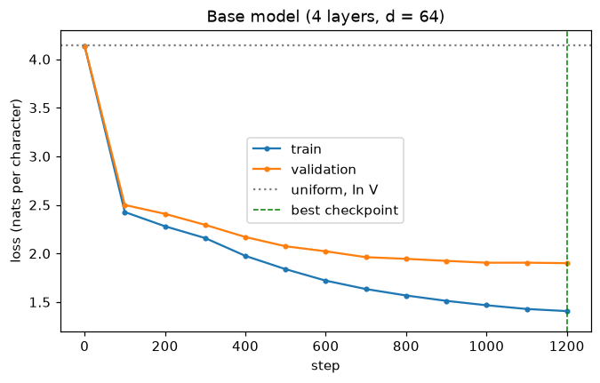
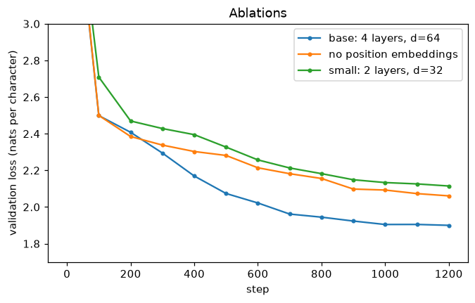

# Level 8 capstone solution: a small GPT from scratch

> **Level 8 · Capstone solution** · Back to the [capstone brief](../level-8-capstone.md)

This is one complete, worked solution. Yours can differ in structure and still be right: compare it against the [acceptance checklist](../level-8-capstone.md#acceptance-checklist), not line by line. The project is saved in the repository under `scripts/capstones/level-8/`. The text isn't included; download it first. To reproduce everything:

<!-- skip-run -->
```bash
cd scripts/capstones/level-8
python data.py --download                                   # saves alice.txt (Project Gutenberg #11)
python train.py --out runs/base                             # the main run, a few minutes on a CPU
python train.py --out runs/nopos --no-pos                   # ablation 1: no position embeddings
python train.py --out runs/small --n-layer 2 --n-embd 32    # ablation 2: a smaller model
python sample.py --ckpt runs/base/ckpt.pt --temperature 0.8 --top-k 10
```

!!! note "About the numbers on this page"
    The outputs here come from running exactly these files with their default seeds, on an excerpt of the book: its first two chapters, 22,297 characters. With the full book (roughly 150,000 characters), every run sees more varied text, so validation loss will be lower and overfitting later (your numbers will vary). Timings depend on your CPU.

## The project

```text
scripts/capstones/level-8/
├── data.py     download, load, split, character and BPE tokenizers, batching
├── model.py    GPTConfig and a configurable GPT with generate()
├── train.py    AdamW, warmup + cosine schedule, clipping, best-checkpoint saving, full evaluation
└── sample.py   load a checkpoint and sample with temperature and top-k
```

The cell below copies the project and the text into a scratch folder and defines a helper that runs a script there and prints its output, so you can follow along from a notebook started at the repository root with `alice.txt` next to it.

```python
import json
import math
import os
import shutil
import subprocess
import sys
from pathlib import Path

import matplotlib.pyplot as plt
import torch

torch.set_num_threads(4)
PROJECT = Path(os.environ.get("CAPSTONE_DIR", "scripts/capstones/level-8")).resolve()
WORK = Path("level8-capstone-run").resolve()
shutil.rmtree(WORK, ignore_errors=True)
shutil.copytree(PROJECT, WORK, ignore=shutil.ignore_patterns("runs", "__pycache__", "alice.txt"))
shutil.copy("alice.txt", WORK / "alice.txt")

def run(*args):
    """Run a project script in the scratch folder and print its output."""
    result = subprocess.run([sys.executable, *args], cwd=WORK, capture_output=True, text=True)
    print(result.stdout.rstrip())
    if result.returncode != 0:
        print(f"[exit code {result.returncode}]\n" + result.stderr.strip())

print(sorted(p.name for p in WORK.iterdir()))
```

```text
['alice.txt', 'data.py', 'model.py', 'sample.py', 'train.py']
```

## Part A: data and tokenization

`data.py` splits the *text* into the first 90% and last 10% before building any tokenizer, so the split is identical for every tokenizer. The character alphabet comes from the whole text (a fixed property of the corpus); BPE merges are learned from the training text only. Running the file prints both tokenizations.

```python
run("data.py")
```

```text
char: vocab 63, train 20,067 tokens (20,067 chars), val 2,230 tokens (2,230 chars), 1.00 chars/token
bpe: vocab 263, train 8,957 tokens (20,067 chars), val 1,049 tokens (2,230 chars), 2.24 chars/token
```

The BPE tokenizer with 200 merges needs about 2.2 characters per token on the validation text. With so little text, though, a 263-token vocabulary would give each token few training examples, so the main runs use characters, and the comparison is left as an extra experiment.

??? example "data.py (full source)"

    <!-- skip-run -->
    ```python
    """Level 8 capstone: text loading, tokenization, and batching.

    The corpus is not part of the repository. Download it once with
        python data.py --download
    which saves Project Gutenberg eBook #11 (Alice's Adventures in Wonderland,
    public domain) to alice.txt with the Gutenberg header and license removed.
    """

    import argparse
    import re
    import urllib.request
    from collections import Counter
    from pathlib import Path

    import torch

    GUTENBERG_URL = "https://www.gutenberg.org/cache/epub/11/pg11.txt"


    def download_alice(path="alice.txt"):
        raw = urllib.request.urlopen(GUTENBERG_URL).read().decode("utf-8")
        start = raw.index("\n", raw.index("*** START")) + 1
        end = raw.index("*** END")
        Path(path).write_text(raw[start:end].strip())
        print(f"saved {path}")


    def load_text(path="alice.txt"):
        path = Path(path)
        if not path.exists():
            raise FileNotFoundError(f"{path} not found. Run `python data.py --download` first.")
        return path.read_text()


    class CharTokenizer:
        """One token per character. The alphabet is a fixed property of the corpus, so it's built from the whole text."""

        kind = "char"

        def __init__(self, text):
            self.chars = sorted(set(text))
            self.stoi = {c: i for i, c in enumerate(self.chars)}

        @property
        def vocab_size(self):
            return len(self.chars)

        def encode(self, s):
            return [self.stoi[c] for c in s]

        def decode(self, ids):
            return "".join(self.chars[i] for i in ids)

        def state(self):
            return {"kind": self.kind, "chars": self.chars}


    PRETOKENIZE = re.compile(r" ?[A-Za-z]+| ?[0-9]+| ?[^A-Za-z0-9\s]+|\s+")


    class BPETokenizer:
        """A small byte-pair-encoding tokenizer over characters (see the Language models chapter)."""

        kind = "bpe"

        def __init__(self, text=None, n_merges=200, alphabet=None, state=None):
            if state is not None:
                self.base, self.merges = state["base"], [tuple(m) for m in state["merges"]]
            else:
                self.base = sorted(set(text) | set(alphabet or ""))
                self.merges = self._train(text, n_merges)
            self.vocab = self.base + ["".join(m) for m in self.merges]
            self.stoi = {t: i for i, t in enumerate(self.vocab)}
            self.rank = {m: r for r, m in enumerate(self.merges)}

        @staticmethod
        def _train(text, n_merges):
            words = Counter(PRETOKENIZE.findall(text))
            splits = {w: list(w) for w in words}
            merges = []
            for _ in range(n_merges):
                pairs = Counter()
                for w, n in words.items():
                    s = splits[w]
                    for a, b in zip(s, s[1:]):
                        pairs[a, b] += n
                if not pairs:
                    break
                best = max(pairs, key=pairs.get)
                merges.append(best)
                for w in words:
                    s, out, i = splits[w], [], 0
                    while i < len(s):
                        if i < len(s) - 1 and (s[i], s[i + 1]) == best:
                            out.append(s[i] + s[i + 1])
                            i += 2
                        else:
                            out.append(s[i])
                            i += 1
                    splits[w] = out
            return merges

        @property
        def vocab_size(self):
            return len(self.vocab)

        def encode(self, s):
            ids = []
            for chunk in PRETOKENIZE.findall(s):
                sym = [c for c in chunk if c in self.stoi]
                while len(sym) > 1:
                    r, i = min((self.rank.get((a, b), float("inf")), i) for i, (a, b) in enumerate(zip(sym, sym[1:])))
                    if r == float("inf"):
                        break
                    sym[i:i + 2] = [sym[i] + sym[i + 1]]
                ids.extend(self.stoi[t] for t in sym)
            return ids

        def decode(self, ids):
            return "".join(self.vocab[i] for i in ids)

        def state(self):
            return {"kind": self.kind, "base": self.base, "merges": [list(m) for m in self.merges]}


    def tokenizer_from_state(state):
        if state["kind"] == "char":
            tok = CharTokenizer("")
            tok.chars = state["chars"]
            tok.stoi = {c: i for i, c in enumerate(tok.chars)}
            return tok
        return BPETokenizer(state=state)


    def make_splits(text, tokenizer_kind="char", val_frac=0.1, n_merges=200):
        """Split the text first (the last val_frac is validation), then build the tokenizer.

        BPE merges are learned from the training text only, so validation text is never used for fitting.
        The character alphabet comes from the whole text so that every validation character can be encoded.
        """
        cut = int(len(text) * (1 - val_frac))
        train_text, val_text = text[:cut], text[cut:]
        alphabet = sorted(set(text))
        tok = CharTokenizer(text) if tokenizer_kind == "char" else BPETokenizer(train_text, n_merges, alphabet)
        train_ids = torch.tensor(tok.encode(train_text), dtype=torch.long)
        val_ids = torch.tensor(tok.encode(val_text), dtype=torch.long)
        return tok, train_ids, val_ids, len(train_text), len(val_text)


    def get_batch(ids, batch_size, block_size, generator=None):
        ix = torch.randint(len(ids) - block_size - 1, (batch_size,), generator=generator)
        x = torch.stack([ids[i:i + block_size] for i in ix])
        y = torch.stack([ids[i + 1:i + block_size + 1] for i in ix])
        return x, y


    if __name__ == "__main__":
        ap = argparse.ArgumentParser()
        ap.add_argument("--download", action="store_true", help="download alice.txt from Project Gutenberg")
        ap.add_argument("--data", default="alice.txt")
        args = ap.parse_args()
        if args.download:
            download_alice(args.data)
        text = load_text(args.data)
        for kind in ["char", "bpe"]:
            tok, tr, va, n_tr, n_va = make_splits(text, kind)
            print(f"{kind}: vocab {tok.vocab_size}, train {len(tr):,} tokens ({n_tr:,} chars), "
                  f"val {len(va):,} tokens ({n_va:,} chars), {n_tr / len(tr):.2f} chars/token")
    ```

A round-trip test on the validation text, using the project's own functions:

```python
sys.path.insert(0, str(WORK))
from data import get_batch, load_text, make_splits

text = load_text(WORK / "alice.txt")
tok, train_ids, val_ids, n_tr, n_va = make_splits(text, "char")
val_text = text[n_tr:]
print("char round trip:", tok.decode(tok.encode(val_text)) == val_text)
btok, *_ = make_splits(text, "bpe")
print("BPE round trip: ", btok.decode(btok.encode(val_text)) == val_text)
```

```text
char round trip: True
BPE round trip:  True
```

## Part B: the model

`model.py` is the GPT from the [Language models](../../chapters/08-modern-deep-learning/02-language-models.md) chapter, made configurable through `GPTConfig`, with a `pos_emb` switch for the ablation and GPT-2's extra detail of scaling the residual output projections' initialization by $1/\sqrt{2L}$, so the residual stream's variance doesn't grow with depth.

??? example "model.py (full source)"

    <!-- skip-run -->
    ```python
    """Level 8 capstone: a configurable GPT (decoder-only transformer)."""

    import math
    from dataclasses import asdict, dataclass

    import torch
    import torch.nn as nn
    import torch.nn.functional as F


    @dataclass
    class GPTConfig:
        vocab_size: int
        block_size: int = 64      # context length
        n_layer: int = 4
        n_head: int = 4
        n_embd: int = 64
        dropout: float = 0.1
        pos_emb: bool = True      # learned absolute position embeddings on/off (for the ablation)

        def to_dict(self):
            return asdict(self)


    class CausalSelfAttention(nn.Module):
        def __init__(self, cfg):
            super().__init__()
            assert cfg.n_embd % cfg.n_head == 0
            self.n_head, self.dropout = cfg.n_head, cfg.dropout
            self.qkv = nn.Linear(cfg.n_embd, 3 * cfg.n_embd)
            self.proj = nn.Linear(cfg.n_embd, cfg.n_embd)

        def forward(self, x):
            B, T, C = x.shape
            q, k, v = self.qkv(x).view(B, T, 3, self.n_head, C // self.n_head).permute(2, 0, 3, 1, 4)
            y = F.scaled_dot_product_attention(q, k, v, is_causal=True,
                                               dropout_p=self.dropout if self.training else 0.0)
            return self.proj(y.transpose(1, 2).reshape(B, T, C))


    class Block(nn.Module):
        def __init__(self, cfg):
            super().__init__()
            self.ln1 = nn.LayerNorm(cfg.n_embd)
            self.attn = CausalSelfAttention(cfg)
            self.ln2 = nn.LayerNorm(cfg.n_embd)
            self.mlp = nn.Sequential(nn.Linear(cfg.n_embd, 4 * cfg.n_embd), nn.GELU(),
                                     nn.Linear(4 * cfg.n_embd, cfg.n_embd))
            self.drop = nn.Dropout(cfg.dropout)

        def forward(self, x):
            x = x + self.drop(self.attn(self.ln1(x)))
            return x + self.drop(self.mlp(self.ln2(x)))


    class GPT(nn.Module):
        def __init__(self, cfg: GPTConfig):
            super().__init__()
            self.cfg = cfg
            self.tok_emb = nn.Embedding(cfg.vocab_size, cfg.n_embd)
            self.pos_emb = nn.Embedding(cfg.block_size, cfg.n_embd) if cfg.pos_emb else None
            self.drop = nn.Dropout(cfg.dropout)
            self.blocks = nn.ModuleList([Block(cfg) for _ in range(cfg.n_layer)])
            self.ln_f = nn.LayerNorm(cfg.n_embd)
            self.head = nn.Linear(cfg.n_embd, cfg.vocab_size, bias=False)
            self.head.weight = self.tok_emb.weight            # weight tying
            self.apply(self._init)
            for name, p in self.named_parameters():           # GPT-2: scale residual projections by 1/sqrt(2L)
                if name.endswith("proj.weight") or name.endswith("mlp.2.weight"):
                    nn.init.normal_(p, mean=0.0, std=0.02 / math.sqrt(2 * cfg.n_layer))

        @staticmethod
        def _init(m):
            if isinstance(m, (nn.Linear, nn.Embedding)):
                nn.init.normal_(m.weight, mean=0.0, std=0.02)
            if isinstance(m, nn.Linear) and m.bias is not None:
                nn.init.zeros_(m.bias)

        def n_params(self):
            return sum(p.numel() for p in self.parameters())

        def forward(self, idx, targets=None):
            B, T = idx.shape
            assert T <= self.cfg.block_size, f"sequence of {T} exceeds block size {self.cfg.block_size}"
            x = self.tok_emb(idx)
            if self.pos_emb is not None:
                x = x + self.pos_emb(torch.arange(T, device=idx.device))
            x = self.drop(x)
            for blk in self.blocks:
                x = blk(x)
            logits = self.head(self.ln_f(x))
            loss = None
            if targets is not None:
                loss = F.cross_entropy(logits.view(-1, logits.size(-1)), targets.view(-1))
            return logits, loss

        @torch.no_grad()
        def generate(self, idx, max_new_tokens, temperature=1.0, top_k=None, generator=None):
            """Autoregressive sampling with temperature and top-k. temperature=0 means greedy."""
            self.eval()
            for _ in range(max_new_tokens):
                logits, _ = self(idx[:, -self.cfg.block_size:])
                logits = logits[:, -1]
                if temperature == 0:
                    nxt = logits.argmax(-1, keepdim=True)
                else:
                    logits = logits / temperature
                    if top_k is not None:
                        kth = torch.topk(logits, min(top_k, logits.size(-1))).values[:, [-1]]
                        logits = logits.masked_fill(logits < kth, float("-inf"))
                    nxt = torch.multinomial(logits.softmax(-1), 1, generator=generator)
                idx = torch.cat([idx, nxt], dim=1)
            return idx
    ```

Check the parameter formula for all three configurations, and run the causality test.

```python
from model import GPT, GPTConfig

def formula(V, T, d, L, pos=True):
    return V * d + (T * d if pos else 0) + L * (12 * d**2 + 13 * d) + 2 * d

V = tok.vocab_size
for name, kw in [("base", dict(n_layer=4, n_embd=64)), ("nopos", dict(n_layer=4, n_embd=64, pos_emb=False)),
                 ("small", dict(n_layer=2, n_embd=32))]:
    m = GPT(GPTConfig(vocab_size=V, block_size=64, **kw))
    print(f"{name:6s} code {m.n_params():7,}  formula {formula(V, 64, kw['n_embd'], kw['n_layer'], kw.get('pos_emb', True)):7,}")

torch.manual_seed(0)
m = GPT(GPTConfig(vocab_size=V, block_size=64)).eval()
x, _ = get_batch(train_ids, 4, 64)
x2 = x.clone()
x2[:, 40] = (x2[:, 40] + 1) % V
with torch.no_grad():
    a, _ = m(x)
    b, _ = m(x2)
print("causality: positions < 40 unchanged:", torch.allclose(a[:, :40], b[:, :40], atol=1e-6),
      "| position 40 changed:", not torch.allclose(a[:, 40], b[:, 40]))
```

```text
base   code 208,192  formula 208,192
nopos  code 204,096  formula 204,096
small  code  29,536  formula  29,536
causality: positions < 40 unchanged: True | position 40 changed: True
```

## Part C: training

`train.py` uses AdamW (betas 0.9 and 0.95, weight decay 0.1 on matrices only), gradient clipping at 1.0, 100 warmup steps then cosine decay to 10% of the peak learning rate of 0.003, and evaluates every 100 steps on fixed batches. A `*` marks a new best validation loss, at which point the checkpoint is saved. At the end it reloads the best checkpoint and evaluates the whole validation text exactly.

??? example "train.py (full source)"

    <!-- skip-run -->
    ```python
    """Level 8 capstone: train a small GPT on a text file.

    Examples (from this directory, with alice.txt present):
        python train.py --out runs/base
        python train.py --out runs/nopos --no-pos
        python train.py --out runs/small --n-layer 2 --n-embd 32
        python train.py --out runs/bpe --tokenizer bpe

    Writes <out>/ckpt.pt (the best checkpoint by validation loss) and <out>/history.json.
    """

    import argparse
    import json
    import math
    import time
    from pathlib import Path

    import torch

    from data import get_batch, load_text, make_splits
    from model import GPT, GPTConfig


    def parse_args():
        ap = argparse.ArgumentParser(description=__doc__, formatter_class=argparse.RawDescriptionHelpFormatter)
        ap.add_argument("--data", default="alice.txt")
        ap.add_argument("--out", default="runs/base")
        ap.add_argument("--tokenizer", choices=["char", "bpe"], default="char")
        ap.add_argument("--bpe-merges", type=int, default=200)
        ap.add_argument("--block-size", type=int, default=64)
        ap.add_argument("--n-layer", type=int, default=4)
        ap.add_argument("--n-head", type=int, default=4)
        ap.add_argument("--n-embd", type=int, default=64)
        ap.add_argument("--dropout", type=float, default=0.1)
        ap.add_argument("--no-pos", action="store_true", help="disable position embeddings (ablation)")
        ap.add_argument("--steps", type=int, default=1200)
        ap.add_argument("--batch-size", type=int, default=32)
        ap.add_argument("--lr", type=float, default=3e-3)
        ap.add_argument("--warmup", type=int, default=100)
        ap.add_argument("--weight-decay", type=float, default=0.1)
        ap.add_argument("--eval-every", type=int, default=100)
        ap.add_argument("--eval-batches", type=int, default=10)
        ap.add_argument("--seed", type=int, default=0)
        ap.add_argument("--threads", type=int, default=4)
        return ap.parse_args()


    def lr_at(step, args):
        """Linear warmup, then cosine decay to 10% of the peak learning rate."""
        if step < args.warmup:
            return args.lr * (step + 1) / args.warmup
        progress = (step - args.warmup) / max(1, args.steps - args.warmup)
        return args.lr * (0.1 + 0.9 * 0.5 * (1 + math.cos(math.pi * progress)))


    @torch.no_grad()
    def estimate_loss(model, splits, args):
        """Mean loss on the same random batches every time, so evaluations are comparable."""
        model.eval()
        out = {}
        for name, ids in splits.items():
            g = torch.Generator().manual_seed(1234)
            losses = [model(*get_batch(ids, args.batch_size, args.block_size, g))[1].item()
                      for _ in range(args.eval_batches)]
            out[name] = sum(losses) / len(losses)
        model.train()
        return out


    @torch.no_grad()
    def full_eval(model, ids, block_size):
        """Exact mean loss over all of `ids`, in non-overlapping windows. Returns (mean nats per token, n tokens)."""
        model.eval()
        total, count = 0.0, 0
        for start in range(0, len(ids) - 1, block_size):
            x = ids[start:start + block_size]
            y = ids[start + 1:start + block_size + 1]
            x = x[:len(y)]
            logits, _ = model(x.unsqueeze(0))
            total += torch.nn.functional.cross_entropy(logits[0], y, reduction="sum").item()
            count += len(y)
        return total / count, count


    def main():
        args = parse_args()
        torch.manual_seed(args.seed)
        torch.set_num_threads(args.threads)
        out = Path(args.out)
        out.mkdir(parents=True, exist_ok=True)

        text = load_text(args.data)
        tok, train_ids, val_ids, n_train_chars, n_val_chars = make_splits(text, args.tokenizer, n_merges=args.bpe_merges)
        cfg = GPTConfig(vocab_size=tok.vocab_size, block_size=args.block_size, n_layer=args.n_layer,
                        n_head=args.n_head, n_embd=args.n_embd, dropout=args.dropout, pos_emb=not args.no_pos)
        model = GPT(cfg)
        print(f"tokenizer {args.tokenizer}: vocab {tok.vocab_size}, train {len(train_ids):,} tokens, "
              f"val {len(val_ids):,} tokens")
        print(f"model: {model.n_params():,} parameters, config {cfg.to_dict()}")

        decay = [p for n, p in model.named_parameters() if p.dim() >= 2]
        no_decay = [p for n, p in model.named_parameters() if p.dim() < 2]
        opt = torch.optim.AdamW([{"params": decay, "weight_decay": args.weight_decay},
                                 {"params": no_decay, "weight_decay": 0.0}], lr=args.lr, betas=(0.9, 0.95))

        splits = {"train": train_ids, "val": val_ids}
        history = {"step": [], "train": [], "val": [], "lr": []}
        best_val, best_step = float("inf"), -1
        t0 = time.time()
        for step in range(args.steps + 1):
            if step % args.eval_every == 0 or step == args.steps:
                losses = estimate_loss(model, splits, args)
                for k in ["train", "val"]:
                    history[k].append(round(losses[k], 4))
                history["step"].append(step)
                history["lr"].append(lr_at(min(step, args.steps - 1), args))
                flag = ""
                if losses["val"] < best_val:
                    best_val, best_step, flag = losses["val"], step, " *"
                    torch.save({"model": model.state_dict(), "config": cfg.to_dict(), "tokenizer": tok.state(),
                                "step": step}, out / "ckpt.pt")
                print(f"step {step:5d} | train {losses['train']:.3f} | val {losses['val']:.3f}{flag}", flush=True)
            if step == args.steps:
                break
            for group in opt.param_groups:
                group["lr"] = lr_at(step, args)
            x, y = get_batch(train_ids, args.batch_size, args.block_size)
            _, loss = model(x, y)
            opt.zero_grad(set_to_none=True)
            loss.backward()
            torch.nn.utils.clip_grad_norm_(model.parameters(), 1.0)
            opt.step()
        train_time = time.time() - t0

        # Final, exact evaluation of the best checkpoint on the whole validation text.
        model.load_state_dict(torch.load(out / "ckpt.pt")["model"])
        val_nll, n_val_tokens = full_eval(model, val_ids, args.block_size)
        bits_per_char = val_nll * n_val_tokens / n_val_chars / math.log(2)
        tokens_seen = args.steps * args.batch_size * args.block_size
        summary = {
            "best_step": best_step, "val_loss": round(val_nll, 4), "val_perplexity": round(math.exp(val_nll), 3),
            "val_bits_per_char": round(bits_per_char, 4), "n_params": model.n_params(),
            "tokens_seen": tokens_seen, "train_flops_6ND": 6 * model.n_params() * tokens_seen,
            "train_seconds": round(train_time, 1),
        }
        history.update(summary=summary, config=cfg.to_dict(), args=vars(args))
        (out / "history.json").write_text(json.dumps(history, indent=1))
        print(f"best checkpoint at step {best_step}; full validation: loss {val_nll:.4f} nats/token, "
              f"perplexity {math.exp(val_nll):.2f}, {bits_per_char:.3f} bits/char")
        print(f"trained {tokens_seen:,} tokens in {train_time:.0f} s")


    if __name__ == "__main__":
        main()
    ```

```python
run("train.py", "--out", "runs/base")
```

```text
tokenizer char: vocab 63, train 20,067 tokens, val 2,230 tokens
model: 208,192 parameters, config {'vocab_size': 63, 'block_size': 64, 'n_layer': 4, 'n_head': 4, 'n_embd': 64, 'dropout': 0.1, 'pos_emb': True}
step     0 | train 4.137 | val 4.138 *
step   100 | train 2.426 | val 2.499 *
step   200 | train 2.280 | val 2.408 *
step   300 | train 2.158 | val 2.294 *
step   400 | train 1.975 | val 2.169 *
step   500 | train 1.838 | val 2.074 *
step   600 | train 1.720 | val 2.022 *
step   700 | train 1.633 | val 1.961 *
step   800 | train 1.567 | val 1.945 *
step   900 | train 1.512 | val 1.923 *
step  1000 | train 1.467 | val 1.905 *
step  1100 | train 1.428 | val 1.905
step  1200 | train 1.406 | val 1.900 *
best checkpoint at step 1200; full validation: loss 1.8772 nats/token, perplexity 6.54, 2.707 bits/char
trained 2,457,600 tokens in 178 s
```

```python
def history(name):
    return json.loads((WORK / "runs" / name / "history.json").read_text())

h = history("base")
fig, ax = plt.subplots(figsize=(7, 4))
ax.plot(h["step"], h["train"], "o-", ms=3, label="train")
ax.plot(h["step"], h["val"], "o-", ms=3, label="validation")
ax.axhline(math.log(V), color="gray", ls=":", label="uniform, ln V")
ax.axvline(h["summary"]["best_step"], color="green", ls="--", lw=1, label="best checkpoint")
ax.set(xlabel="step", ylabel="loss (nats per character)", title="Base model (4 layers, d = 64)", ylim=(1.2, 4.3))
ax.legend()
plt.show()
print({k: h["summary"][k] for k in ["best_step", "val_loss", "val_perplexity", "val_bits_per_char", "train_flops_6ND"]})
```

```text
{'best_step': 1200, 'val_loss': 1.8772, 'val_perplexity': 6.535, 'val_bits_per_char': 2.707, 'train_flops_6ND': 3069915955200}
```



*Training loss keeps falling; validation loss flattens, and the gap between them is the overfitting the best-checkpoint logic protects against.*

## Part D: sampling and evaluation

`sample.py` loads a checkpoint, rebuilds the tokenizer from the state saved inside it, and samples with temperature and top-k (temperature 0 is greedy).

??? example "sample.py (full source)"

    <!-- skip-run -->
    ```python
    """Level 8 capstone: generate text from a trained checkpoint.

        python sample.py --ckpt runs/base/ckpt.pt --prompt "Alice " --temperature 0.8 --top-k 10
    """

    import argparse

    import torch

    from data import tokenizer_from_state
    from model import GPT, GPTConfig


    def main():
        ap = argparse.ArgumentParser()
        ap.add_argument("--ckpt", default="runs/base/ckpt.pt")
        ap.add_argument("--prompt", default="Alice ")
        ap.add_argument("--n", type=int, default=300, help="number of new tokens")
        ap.add_argument("--temperature", type=float, default=0.8)
        ap.add_argument("--top-k", type=int, default=None)
        ap.add_argument("--seed", type=int, default=0)
        args = ap.parse_args()

        torch.set_num_threads(4)
        ckpt = torch.load(args.ckpt)
        tok = tokenizer_from_state(ckpt["tokenizer"])
        model = GPT(GPTConfig(**ckpt["config"]))
        model.load_state_dict(ckpt["model"])
        idx = torch.tensor([tok.encode(args.prompt)], dtype=torch.long)
        g = torch.Generator().manual_seed(args.seed)
        out = model.generate(idx, args.n, temperature=args.temperature, top_k=args.top_k, generator=g)
        print(tok.decode(out[0].tolist()))


    if __name__ == "__main__":
        main()
    ```

```python
for args in [["--temperature", "0"], ["--temperature", "0.8", "--top-k", "10"], ["--temperature", "1.0"]]:
    print(f"--- {' '.join(args)}")
    run("sample.py", "--ckpt", "runs/base/ckpt.pt", "--prompt", "Alice ", "--n", "200", *args)
    print()
```

```text
--- --temperature 0
Alice to the was not the was not the had was not the had was the was not the her little was the was not the was the was not the had was not the her little was the was not the was the was not the had was not

--- --temperature 0.8 --top-k 10
Alice say to looker, and said the goold down onersher, and swhe mare ot the herself lacke, and of the get door to at a one a of the teare her key fould and her fall had dand the was onck of herssing! There

--- --temperature 1.0
Alice very you! "I must I'm?" "I should my the Alice hoversed you feelt in a cright backe, and of beat agot one-n, I go and a my telle, the batice, that mooped all make, and creabbbbe. Ear!" ppesid Then dar
```

Now the perplexity report with the two baselines, all on the full validation text:

```python
counts = torch.bincount(train_ids, minlength=V).float() + 1          # add-one smoothing
unigram = -torch.log(counts / counts.sum())[val_ids].mean().item()
rows = [("uniform", math.log(V)), ("unigram", unigram), ("GPT (base)", h["summary"]["val_loss"])]
print(f"{'model':12s} {'nats/char':>9s} {'perplexity':>10s} {'bits/char':>9s}")
for name, l in rows:
    print(f"{name:12s} {l:9.3f} {math.exp(l):10.2f} {l / math.log(2):9.3f}")
```

```text
model        nats/char perplexity bits/char
uniform          4.143      63.00     5.977
unigram          3.089      21.95     4.456
GPT (base)       1.877       6.54     2.708
```

## Part E: the ablations

Two controlled experiments, each changing exactly one thing relative to the base run: removing the position embeddings, and shrinking the model to 2 layers of width 32. Same data, seed, and number of steps.

```python
run("train.py", "--out", "runs/nopos", "--no-pos")
print()
run("train.py", "--out", "runs/small", "--n-layer", "2", "--n-embd", "32")
```

```text
tokenizer char: vocab 63, train 20,067 tokens, val 2,230 tokens
model: 204,096 parameters, config {'vocab_size': 63, 'block_size': 64, 'n_layer': 4, 'n_head': 4, 'n_embd': 64, 'dropout': 0.1, 'pos_emb': False}
step     0 | train 4.160 | val 4.157 *
step   100 | train 2.409 | val 2.500 *
step   200 | train 2.287 | val 2.385 *
step   300 | train 2.216 | val 2.338 *
step   400 | train 2.145 | val 2.303 *
step   500 | train 2.075 | val 2.281 *
step   600 | train 1.990 | val 2.214 *
step   700 | train 1.908 | val 2.182 *
step   800 | train 1.847 | val 2.156 *
step   900 | train 1.783 | val 2.098 *
step  1000 | train 1.745 | val 2.093 *
step  1100 | train 1.711 | val 2.073 *
step  1200 | train 1.683 | val 2.061 *
best checkpoint at step 1200; full validation: loss 2.0419 nats/token, perplexity 7.71, 2.945 bits/char
trained 2,457,600 tokens in 123 s

tokenizer char: vocab 63, train 20,067 tokens, val 2,230 tokens
model: 29,536 parameters, config {'vocab_size': 63, 'block_size': 64, 'n_layer': 2, 'n_head': 4, 'n_embd': 32, 'dropout': 0.1, 'pos_emb': True}
step     0 | train 4.144 | val 4.148 *
step   100 | train 2.632 | val 2.709 *
step   200 | train 2.391 | val 2.470 *
step   300 | train 2.321 | val 2.428 *
step   400 | train 2.266 | val 2.395 *
step   500 | train 2.196 | val 2.327 *
step   600 | train 2.117 | val 2.257 *
step   700 | train 2.060 | val 2.213 *
step   800 | train 2.013 | val 2.182 *
step   900 | train 1.978 | val 2.149 *
step  1000 | train 1.958 | val 2.133 *
step  1100 | train 1.937 | val 2.126 *
step  1200 | train 1.928 | val 2.115 *
best checkpoint at step 1200; full validation: loss 2.0953 nats/token, perplexity 8.13, 3.022 bits/char
trained 2,457,600 tokens in 26 s
```

```python
fig, ax = plt.subplots(figsize=(7, 4))
print(f"{'run':6s} {'params':>8s} {'best step':>9s} {'val loss':>9s} {'perplexity':>10s} {'train-val gap at end':>21s}")
for name, label in [("base", "base: 4 layers, d=64"), ("nopos", "no position embeddings"), ("small", "small: 2 layers, d=32")]:
    h = history(name)
    s = h["summary"]
    ax.plot(h["step"], h["val"], "o-", ms=3, label=label)
    print(f"{name:6s} {s['n_params']:8,} {s['best_step']:9d} {s['val_loss']:9.4f} {s['val_perplexity']:10.2f} {h['val'][-1] - h['train'][-1]:21.3f}")
ax.set(xlabel="step", ylabel="validation loss (nats per character)", title="Ablations", ylim=(1.7, 3.0))
ax.legend()
plt.show()
```

```text
run      params best step  val loss perplexity  train-val gap at end
base    208,192      1200    1.8772       6.54                 0.494
nopos   204,096      1200    2.0419       7.71                 0.378
small    29,536      1200    2.0953       8.13                 0.187
```



*Validation loss for the base model, the same model without position embeddings, and a 7 times smaller model. The base model is best throughout the second half of training.*

What the ablations show:

- **Position embeddings help, but their absence isn't fatal.** Without them, the best validation loss is 2.042 instead of 1.877 nats per character (perplexity 7.71 versus 6.54). Compare that with the sorting model in [Attention and transformers](../../chapters/08-modern-deep-learning/01-attention-and-transformers.md), which failed completely without positions. The difference is the causal mask. In an encoder, every position sees the same set of tokens, so attention is blind to order. In a causal decoder, position $t$ sees exactly $t + 1$ tokens, so, for example, a head that attends uniformly produces an average over $t + 1$ items whose statistics change with $t$, and later layers can read position out of that. Haviv et al. (2022) showed that causal language models without positional encodings learn positional information this way and come surprisingly close to models with them. What the model can't easily do without positions is tell "ab" from "ba" among the preceding characters, and spelling depends on exactly that, so it pays a clear price.
- **The bigger model generalizes better, despite overfitting more.** The small model (29,536 parameters, 7 times fewer) has the smallest gap between training and validation loss (0.19), but its validation loss is the worst of the three, 2.095. It's underfitting: it can't represent enough of English spelling. The base model has a larger gap (0.49) and the best validation loss. The gap measures overfitting, but validation loss is what you care about; a larger model that overfits somewhat can still be the better model.
- **None of the runs has hit its best validation loss before the end.** All three keep improving slightly until step 1,200, although the base model's curve is nearly flat over its last 300 steps. With the cosine schedule ending at 10% of the peak learning rate, late steps are small, which also limits how quickly overfitting can grow. On a longer schedule, the base model's validation loss would turn upward, and the saved checkpoint would come from before that point.

These are single-seed results. The differences between runs (0.16 to 0.22 nats) are large compared with the step-to-step noise in the logs, but a careful study would repeat each run with three or more seeds and report the spread.

## Part F: an example write-up

**Setup.** A character-level GPT (vocabulary 63) trained on the first two chapters of *Alice's Adventures in Wonderland* (22,297 characters), split into the first 90% for training (20,067 characters) and the last 10% for validation (2,230 characters). The base model has 4 pre-LN layers, 4 heads, width 64, a 64-character context, dropout 0.1, and 208,192 parameters. It trained for 1,200 steps of 32 sequences: 2.46 million tokens, about 122 passes over the training text, about $3.1 \times 10^{12}$ FLOPs by $6ND$, and about three minutes on a laptop-class CPU.

**Results.** The step-0 loss was 4.137, matching $\ln 63 = 4.143$. On the full validation text, the best checkpoint reaches 1.877 nats per character: a perplexity of 6.54, or 2.71 bits per character, against 21.95 for a unigram model and 63 for uniform guessing. The training loss ended at 1.41, so the model fits its training text much better than new text. Samples at temperature 0.8 with top-k 10 contain real words and character names from the book, plausible punctuation, and many invented words. Greedy decoding loops on "the was not the" almost immediately.

**Ablations.** Removing position embeddings cost 0.165 nats per character; a 7 times smaller model cost 0.218. Position information matters for spelling, but a causal model recovers some of it from the mask alone. The larger model overfits more but is still better on validation data.

**What surprised me.** How much the no-position model could still learn. How quickly a few hundred thousand parameters exhaust 20,000 characters: by the end, the base model is on its 122nd pass over the data. And how unreliable the quick validation estimate is on so little text: the 10-batch estimate said 1.900, while the exact full-text evaluation said 1.877.

**Limitations.** One tiny corpus, one seed per configuration, and a validation set of only 2,230 characters, so differences of a few hundredths of a nat are within noise. The validation text is a continuous passage from the end of Chapter II, so it's not a random sample of the book's style. Perplexity on this text says nothing about usefulness for any downstream task.

**With 100 times the compute.** More compute on the same text would mostly buy more overfitting: the bottleneck is data, not compute. The first step is more text: the whole book, then a few hundred public-domain books. Chinchilla's rule of about 20 tokens per parameter assumes unique tokens; for repeated data, Muennighoff et al. (2023) found that a few epochs are nearly as good as fresh data, with quickly diminishing returns after that. With a few megabytes of text, I'd switch to a BPE vocabulary of a few thousand tokens (so the 64-token context covers more text), scale to 6 to 8 layers and width 256, and use RoPE so the context could be extended later. Then I'd run each configuration with three seeds before believing a difference.

## How this solution meets the checklist

| Checklist item | Where |
|---|---|
| Contiguous split before tokenizer fitting; BPE merges from training text only | `make_splits` in `data.py`, Part A |
| Round trip on validation text | Part A |
| Size from the command line; parameter count matches the formula | `train.py` flags; Part B |
| Causality test | Part B |
| Step-0 loss near $\ln V$ | Part C log, step 0 |
| AdamW, clipping, warmup + cosine, best checkpoint | `train.py`; `*` marks in the logs |
| Loss curves with overfitting visible | Part C figure |
| Temperature, top-k, greedy sampling | `sample.py`; Part D |
| Full-validation loss, perplexity, bits per character, baselines | Part D table |
| One-variable ablations, explained | Part E |
| Reproducible numbers | fixed seeds, fixed evaluation batches, and this page's outputs come from running the files |
