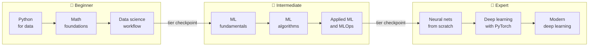

---
hide:
  - navigation
  - toc
---

# The ML Handbook

## From your first DataFrame to transformers and diffusion models

A hands-on handbook that takes you from basic Python to a deep understanding of data science, machine learning, and deep learning. You learn every idea three ways: the **intuition**, the **math**, and the **code**. You implement algorithms from scratch in NumPy before you use the library versions, and every level ends with a capstone project that proves the skills.

[Start here](start-here.md){ .md-button .md-button--primary }
[See the full roadmap](roadmap.md){ .md-button }
[Set up your environment](setup.md){ .md-button }

## Three tiers, nine levels

-   :material-sprout:{ .lg .middle } **🌱 Beginner: Data Science Foundations**

    ---

    **Levels 0–2.** Master the Python data stack, the math underneath ML (linear algebra, calculus, probability, statistics), and the full data science workflow from SQL to A/B tests.

    - Level 0: Python for data
    - Level 1: Math foundations
    - Level 2: Data science workflow

    [:octicons-arrow-right-24: Beginner tier](tiers/beginner.md)

-   :material-cog:{ .lg .middle } **🔧 Intermediate: Machine Learning**

    ---

    **Levels 3–5.** Learn how ML really works, implement the classic algorithms from scratch, then build, tune, explain, and deploy models in production.

    - Level 3: ML fundamentals
    - Level 4: ML algorithms in depth
    - Level 5: Applied ML and MLOps

    [:octicons-arrow-right-24: Intermediate tier](tiers/intermediate.md)

-   :material-rocket-launch:{ .lg .middle } **🚀 Expert: Deep Learning**

    ---

    **Levels 6–8.** Build neural networks and autograd from scratch, train deep models in PyTorch, and understand transformers, LLMs, diffusion, and RL.

    - Level 6: Neural networks from scratch
    - Level 7: Deep learning with PyTorch
    - Level 8: Modern deep learning

    [:octicons-arrow-right-24: Expert tier](tiers/expert.md)

## The learning path

The [full roadmap](roadmap.md) lists every chapter and the concepts it teaches.

## How every idea is taught

-   :material-lightbulb-on-outline:{ .lg .middle } **Intuition**

    ---

    A plain-language explanation, an analogy, or a picture, so you know *what* the idea is and *why* it exists before any symbols appear.

-   :material-sigma:{ .lg .middle } **Math**

    ---

    The precise formulation, with every symbol defined and results derived rather than just stated. You'll be able to read papers, not just tutorials.

-   :material-code-braces:{ .lg .middle } **Code**

    ---

    A from-scratch NumPy implementation first, then the scikit-learn or PyTorch version, checked against each other with real output.

## How each chapter is organized

| Part | What you get |
|---|---|
| **1. Why it matters** | A short real story where this knowledge saved a project, or its absence sank one. |
| **2. Concepts** | Intuition → math → code, built up step by step with diagrams and figures. |
| **3. In practice** | Complete, runnable code with real output, and the common mistakes to avoid. |
| **4. Exercises** | 4–6 tasks, from easy to hard: derivations, coding, and reasoning, each with a hidden solution. |
| **5. Check yourself** | Questions to answer without notes, with hidden answers. |

Each chapter closes with key takeaways, further reading, and a link to what comes next.

## Who this is for

- You know **some Python** and want to become genuinely good at data science and ML, not just copy notebooks.
- You're a **software or data engineer** moving into ML, and you want to understand what the libraries are doing.
- You **use ML already** but feel shaky on the math, or on why your models behave the way they do.

You don't need a math degree. The [math foundations level](chapters/01-math-foundations/index.md) builds everything you need from high-school algebra, and every formula is checked numerically in code.

## Ready?

Read [how to use this handbook](start-here.md) first. It takes ten minutes and makes the rest of the handbook far more effective.

[Start here](start-here.md){ .md-button .md-button--primary }
[Cheat sheets](cheatsheets/index.md){ .md-button }
