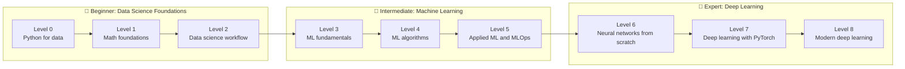

# The Full Roadmap

This page is the handbook's complete syllabus. It shows every tier, level, and chapter, and the concepts each chapter teaches. Use it to see where you are, what comes next, and how the pieces connect.

| Tier | Levels | You go from… | …to | Time (est.) |
|---|---|---|---|---|
| 🌱 **Beginner** | 0–2 | Knowing a little Python | Analyzing real data with confidence, backed by the math and statistics underneath | 10–14 weeks |
| 🔧 **Intermediate** | 3–5 | Analyzing data | Building, evaluating, explaining, and deploying classical ML models | 12–16 weeks |
| 🚀 **Expert** | 6–8 | Using ML libraries | Building neural networks from scratch, training deep models in PyTorch, and understanding transformers, LLMs, and diffusion | 14–20 weeks |

The estimates assume about an hour a day, most days. The math takes longer for some people than others, and that's fine. Understanding beats speed.

!!! tip "The one rule"
    Every level ends with a **capstone** project. Don't move on until you can finish it **without notes**. The capstone proves you can use the skills, not just recognize them.

---

## 🌱 Beginner tier: Data Science Foundations

**Goal:** Fluency with data. Get fast with the Python data stack, learn the math that every later chapter relies on, and run a full data science project from question to answer.

**At the end of this tier you can:** set up a clean, reproducible Python environment; manipulate data with NumPy and pandas; make clear charts; read and use linear algebra, calculus, probability, and statistics; query data with SQL; clean and explore messy datasets; engineer features; analyze an A/B test correctly; and present your findings.

### Level 0: Python for data

| Chapter | Key concepts |
|---|---|
| [The data landscape](chapters/00-python-for-data/01-the-data-landscape.md) | AI vs ML vs DL vs data science · the kinds of learning · the end-to-end workflow · roles (analyst, data scientist, ML engineer, researcher) · the tool stack · how to study this field |
| [Setting up your environment](chapters/00-python-for-data/02-environment-setup.md) | Python versions · virtual environments with venv and uv · conda and when to use it · Jupyter and JupyterLab · VS Code notebooks · project layout · requirements and lock files · GPU and CUDA basics · Google Colab |
| [Python essentials for data work](chapters/00-python-for-data/03-python-essentials.md) | Data structures and their costs · comprehensions · functions, `*args`/`**kwargs`, lambdas · classes and dataclasses · iterators and generators · type hints · files and paths · common idioms and pitfalls |
| [NumPy](chapters/00-python-for-data/04-numpy.md) | ndarrays and memory layout · dtypes · vectorization and why it's fast · indexing, slicing, fancy and boolean indexing · broadcasting rules · aggregations and axes · reshaping · linear algebra · random number generation |
| [pandas](chapters/00-python-for-data/05-pandas.md) | Series and DataFrame · reading and writing CSV, Parquet, JSON · `loc`/`iloc` · filtering · missing values · `groupby` and split-apply-combine · merge and join · pivot and melt · datetime and time series · method chaining · performance, and polars as an alternative |
| [Data visualization](chapters/00-python-for-data/06-visualization.md) | Matplotlib's figure/axes model · line, bar, scatter, histogram, and box plots · seaborn for statistical plots · choosing the right chart · color and accessibility · small multiples · plots for EDA · interactive plotting with plotly |

**Capstone:** [Analyze a real dataset end to end in a notebook](exercises/level-0-capstone.md)

### Level 1: Math foundations

| Chapter | Key concepts |
|---|---|
| [Linear algebra](chapters/01-math-foundations/01-linear-algebra.md) | Vectors, geometrically and as data · dot product and cosine similarity · norms · matrices as transformations · matrix multiplication · systems of linear equations · rank, span, basis, and independence · inverse and determinant · projections · everything in NumPy |
| [Matrix decompositions](chapters/01-math-foundations/02-matrix-decompositions.md) | Eigenvalues and eigenvectors · eigendecomposition · symmetric matrices · SVD and its geometry · low-rank approximation · the link to PCA · conditioning and numerical stability |
| [Calculus and gradients](chapters/01-math-foundations/03-calculus-and-gradients.md) | Derivatives as rates of change · rules, including the chain rule · partial derivatives · gradients and the direction of steepest ascent · Jacobian and Hessian · Taylor approximation · finding minima · convexity · numerical vs analytical gradients |
| [Probability](chapters/01-math-foundations/04-probability.md) | Sample spaces and events · conditional probability · Bayes' theorem · random variables · common distributions (Bernoulli, binomial, Poisson, uniform, normal, exponential) · expectation and variance · joint, marginal, and conditional distributions · covariance · law of large numbers · central limit theorem |
| [Statistics](chapters/01-math-foundations/05-statistics.md) | Descriptive statistics · sampling and sampling distributions · estimators, bias, and variance · maximum likelihood estimation · confidence intervals · hypothesis testing and p-values · t-tests, chi-square, ANOVA · the bootstrap · multiple testing · Bayesian vs frequentist thinking |
| [Information theory and optimization](chapters/01-math-foundations/06-information-theory-and-optimization.md) | Entropy · cross-entropy · KL divergence · why minimizing cross-entropy is maximum likelihood · loss functions as objectives · gradient descent · convex optimization · constrained optimization and Lagrange multipliers |

**Capstone:** [Linear regression three ways, from scratch: normal equations, gradient descent, and statistical inference](exercises/level-1-capstone.md)

### Level 2: The data science workflow

| Chapter | Key concepts |
|---|---|
| [SQL and data acquisition](chapters/02-data-science-workflow/01-sql-and-data-acquisition.md) | Relational thinking · SELECT, WHERE, GROUP BY, HAVING · joins · subqueries and CTEs · window functions · SQL from Python with sqlite3 and DuckDB · file formats (CSV, JSON, Parquet) · calling APIs · scraping ethics |
| [Data cleaning](chapters/02-data-science-workflow/02-data-cleaning.md) | Tidy data · types and parsing · missing data mechanisms (MCAR, MAR, MNAR) and imputation · outliers · duplicates · inconsistent categories and strings · dates and time zones · validation and data contracts |
| [Exploratory data analysis](chapters/02-data-science-workflow/03-exploratory-data-analysis.md) | An EDA checklist · univariate distributions · bivariate relationships · correlation (Pearson, Spearman) and its limits · correlation vs causation · Simpson's paradox · segmenting · forming hypotheses |
| [Feature engineering](chapters/02-data-science-workflow/04-feature-engineering.md) | Encoding categoricals (one-hot, ordinal, target) · scaling and normalization · transformations (log, Box-Cox) · binning · date and time features · text features (bag of words, TF-IDF) · interactions · feature selection · data leakage |
| [Experimentation and A/B testing](chapters/02-data-science-workflow/05-experimentation-and-ab-testing.md) | Randomized experiments · metrics and guardrails · power analysis and sample size · running and analyzing a test · peeking and other pitfalls · novelty effects · multi-armed bandits · intro to causal inference (confounding, DAGs, difference-in-differences) |
| [Communicating results](chapters/02-data-science-workflow/06-communicating-results.md) | Knowing your audience · the pyramid principle · effective charts · writing an analysis report · dashboards · reproducible analysis · notebooks vs scripts · version control for data work |

**Capstone:** [A full data science investigation: SQL, cleaning, EDA, an A/B test, and a written report](exercises/level-2-capstone.md)

---

## 🔧 Intermediate tier: Machine Learning

**Goal:** Understanding, then practice. Learn how machine learning works from the ground up, master the classical algorithms, and ship models that are reliable in the real world.

**At the end of this tier you can:** explain generalization, the bias-variance trade-off, and regularization; implement core algorithms from scratch; choose and tune the right model for a tabular problem; evaluate it with the right metrics; explain its predictions; and deploy and monitor it as a service.

### Level 3: Machine learning fundamentals

| Chapter | Key concepts |
|---|---|
| [What is machine learning?](chapters/03-ml-fundamentals/01-what-is-machine-learning.md) | Learning from data · supervised, unsupervised, self-supervised, and reinforcement learning · features, labels, models, parameters, and hyperparameters · loss functions · the hypothesis space · generalization · the no free lunch theorem · the scikit-learn API |
| [Linear regression](chapters/03-ml-fundamentals/02-linear-regression.md) | The model · least squares · the normal equation · gradient descent · assumptions and diagnostics · polynomial features · interpreting coefficients · from scratch and with scikit-learn |
| [Logistic regression and classification](chapters/03-ml-fundamentals/03-logistic-regression.md) | Why not linear regression for classes · the sigmoid · log-loss and its derivation · decision boundaries · multiclass with softmax · probabilistic interpretation · from scratch and with scikit-learn |
| [Generalization and the bias-variance trade-off](chapters/03-ml-fundamentals/04-generalization-bias-variance.md) | Underfitting and overfitting · train, validation, and test sets · the bias-variance decomposition · model capacity · learning curves · k-fold and stratified cross-validation · time-series splits · double descent |
| [Regularization](chapters/03-ml-fundamentals/05-regularization.md) | Why constrain a model · L2 (ridge) · L1 (lasso) and sparsity · elastic net · the geometric view · the Bayesian view (priors) · early stopping · choosing the strength |
| [Evaluation metrics](chapters/03-ml-fundamentals/06-evaluation-metrics.md) | MAE, MSE, RMSE, R² · the confusion matrix · accuracy and its traps · precision, recall, F1 · ROC curves and AUC · precision-recall curves · calibration · choosing a threshold · business-cost metrics |
| [Gradient descent in depth](chapters/03-ml-fundamentals/07-gradient-descent-in-depth.md) | Batch, stochastic, and mini-batch · learning rate effects · convergence · feature scaling and conditioning · loss landscapes · momentum preview · implementing and debugging it |

**Capstone:** [Build a churn classifier from scratch in NumPy, then match it with scikit-learn](exercises/level-3-capstone.md)

### Level 4: ML algorithms in depth

| Chapter | Key concepts |
|---|---|
| [k-nearest neighbors and naive Bayes](chapters/04-ml-algorithms/01-knn-and-naive-bayes.md) | Instance-based learning · distance metrics · choosing k · the curse of dimensionality · generative vs discriminative models · naive Bayes variants · text classification |
| [Decision trees](chapters/04-ml-algorithms/02-decision-trees.md) | Recursive partitioning · impurity (Gini, entropy) and information gain · regression trees · stopping and pruning · interpretability · instability · from scratch |
| [Ensembles: random forests and boosting](chapters/04-ml-algorithms/03-ensembles.md) | The wisdom of crowds · bagging · random forests and out-of-bag error · boosting · AdaBoost · gradient boosting derived · XGBoost, LightGBM, and CatBoost · stacking · why boosted trees win on tabular data |
| [Support vector machines](chapters/04-ml-algorithms/04-support-vector-machines.md) | Maximum margin · hard and soft margins · hinge loss · the dual problem (intuition) · the kernel trick · RBF and polynomial kernels · SVR · when to use SVMs |
| [Clustering](chapters/04-ml-algorithms/05-clustering.md) | k-means and k-means++ · choosing k (elbow, silhouette) · hierarchical clustering and dendrograms · DBSCAN · Gaussian mixture models and EM · evaluating clusters |
| [Dimensionality reduction](chapters/04-ml-algorithms/06-dimensionality-reduction.md) | Why reduce dimensions · PCA derived from variance and from SVD · explained variance · whitening · kernel PCA · t-SNE · UMAP · visualizing high-dimensional data responsibly |
| [Time series forecasting](chapters/04-ml-algorithms/07-time-series.md) | Trend, seasonality, noise · stationarity and differencing · autocorrelation · smoothing and Holt-Winters · ARIMA · ML with lag features · backtesting and walk-forward validation |
| [Anomaly detection and recommender systems](chapters/04-ml-algorithms/08-anomaly-detection-and-recommenders.md) | Statistical outlier detection · isolation forests · one-class methods · collaborative filtering · matrix factorization · content-based recommendations · evaluating recommenders |

**Capstone:** [A model bake-off on a tabular dataset, with rigorous validation and a written recommendation](exercises/level-4-capstone.md)

### Level 5: Applied ML and MLOps

| Chapter | Key concepts |
|---|---|
| [ML pipelines](chapters/05-applied-ml/01-ml-pipelines.md) | Leakage-proof preprocessing · `Pipeline` and `ColumnTransformer` · custom transformers · reproducibility · project structure for ML |
| [Hyperparameter tuning](chapters/05-applied-ml/02-hyperparameter-tuning.md) | Grid search · random search · Bayesian optimization with Optuna · early stopping and successive halving · nested cross-validation · avoiding overfitting the validation set |
| [Imbalanced data](chapters/05-applied-ml/03-imbalanced-data.md) | Why imbalance breaks models · the right metrics · class weights · resampling and SMOTE · threshold moving · cost-sensitive learning |
| [Interpretability](chapters/05-applied-ml/04-interpretability.md) | Global vs local explanations · coefficients and impurity importance · permutation importance · partial dependence and ICE plots · SHAP · LIME · counterfactuals · pitfalls |
| [ML in production](chapters/05-applied-ml/05-ml-in-production.md) | The ML lifecycle · saving models · batch vs online serving · a FastAPI model service · Docker · experiment tracking with MLflow · data and concept drift · monitoring · retraining · testing ML systems |
| [Responsible ML](chapters/05-applied-ml/06-responsible-ml.md) | Sources of bias · fairness definitions and their trade-offs · measuring fairness · privacy and anonymization · differential privacy (intro) · model cards and documentation · security (adversarial inputs, data poisoning) |

**Capstone:** [Ship a production-ready model service: pipeline, tuning, tracking, an API, Docker, and monitoring](exercises/level-5-capstone.md)

---

## 🚀 Expert tier: Deep Learning

**Goal:** Building and mastery. Understand neural networks down to every gradient, train deep models efficiently in PyTorch, and understand the architectures behind modern AI.

**At the end of this tier you can:** derive backpropagation and implement a neural network and an autograd engine from scratch; train and debug CNNs, RNNs, and transformers in PyTorch; fine-tune pretrained models; explain how LLMs, diffusion models, and CLIP work; and reason about training at scale.

### Level 6: Neural networks from scratch

| Chapter | Key concepts |
|---|---|
| [From neurons to networks](chapters/06-neural-networks/01-from-neurons-to-networks.md) | The perceptron and its limits (XOR) · multilayer perceptrons · activation functions (sigmoid, tanh, ReLU, GELU) and why nonlinearity matters · the universal approximation theorem · output layers and losses |
| [Forward and backpropagation](chapters/06-neural-networks/02-forward-and-backpropagation.md) | Computational graphs · the chain rule on graphs · deriving backprop for an MLP · matrix calculus for layers · softmax + cross-entropy gradient · gradient checking |
| [A neural network in NumPy](chapters/06-neural-networks/03-neural-network-in-numpy.md) | Layer abstractions · a full training loop · mini-batches · training on handwritten digits · visualizing what it learned · debugging a network that won't learn |
| [Optimizers](chapters/06-neural-networks/04-optimizers.md) | SGD revisited · momentum and Nesterov · AdaGrad · RMSProp · Adam and AdamW · learning rate schedules and warmup · comparing optimizers empirically |
| [Training deep networks](chapters/06-neural-networks/05-training-deep-networks.md) | Vanishing and exploding gradients · initialization (Xavier, He) · batch normalization · layer normalization · dropout · weight decay · gradient clipping · residual connections · a debugging checklist |
| [Autograd from scratch](chapters/06-neural-networks/06-autograd-from-scratch.md) | Reverse-mode automatic differentiation · building a scalar autograd engine · topological sort · extending it to tensors · how PyTorch's autograd works underneath |

**Capstone:** [Build a tiny deep learning library with autograd, and train it to over 95% accuracy on digits](exercises/level-6-capstone.md)

### Level 7: Deep learning with PyTorch

| Chapter | Key concepts |
|---|---|
| [PyTorch fundamentals](chapters/07-deep-learning-pytorch/01-pytorch-fundamentals.md) | Tensors and devices · autograd in PyTorch · `nn.Module` · `Dataset` and `DataLoader` · moving between NumPy and PyTorch · GPU basics |
| [The training loop](chapters/07-deep-learning-pytorch/02-the-training-loop.md) | The canonical loop · train vs eval mode · validation · checkpointing · reproducibility and seeding · mixed precision · logging with TensorBoard · learning-rate finders · overfitting a single batch |
| [Convolutional neural networks](chapters/07-deep-learning-pytorch/03-convolutional-networks.md) | Why convolutions · kernels, stride, padding · pooling · receptive fields · LeNet to VGG to ResNet · data augmentation · visualizing filters and activations · object detection and segmentation overview |
| [Sequence models](chapters/07-deep-learning-pytorch/04-sequence-models.md) | Sequences and recurrence · vanilla RNNs · backpropagation through time · LSTMs and GRUs · bidirectional and stacked RNNs · sequence-to-sequence · teacher forcing · the limits that led to attention |
| [Embeddings and NLP basics](chapters/07-deep-learning-pytorch/05-embeddings-and-nlp.md) | Tokenization · one-hot vs dense embeddings · word2vec (skip-gram, negative sampling) · GloVe · embedding geometry · text classification with embeddings · subword tokenization preview |
| [Transfer learning](chapters/07-deep-learning-pytorch/06-transfer-learning.md) | Why pretrained models work · feature extraction vs fine-tuning · torchvision models · freezing and unfreezing · discriminative learning rates · Hugging Face basics · domain shift |

**Capstone:** [Train an image classifier above 90% accuracy, with augmentation, tracking, and an error analysis](exercises/level-7-capstone.md)

### Level 8: Modern deep learning

| Chapter | Key concepts |
|---|---|
| [Attention and transformers](chapters/08-modern-deep-learning/01-attention-and-transformers.md) | Attention as soft lookup · scaled dot-product attention · self-attention · multi-head attention · positional encodings (sinusoidal, learned, RoPE) · the transformer block · encoder, decoder, and encoder-decoder · building one from scratch |
| [Language models](chapters/08-modern-deep-learning/02-language-models.md) | Next-token prediction · BPE tokenization · causal masking · GPT architecture · pretraining data and objectives · sampling (temperature, top-k, top-p) · perplexity · scaling laws · emergent abilities |
| [LLMs in practice](chapters/08-modern-deep-learning/03-llms-in-practice.md) | Prompting · in-context learning · fine-tuning and instruction tuning · parameter-efficient fine-tuning (LoRA) · RLHF and DPO · retrieval-augmented generation · embeddings and vector search · evaluating LLMs · hallucination and safety |
| [Generative models](chapters/08-modern-deep-learning/04-generative-models.md) | Autoencoders · variational autoencoders and the ELBO · GANs and their training dynamics · diffusion models (forward noising, reverse denoising, the training objective) · guidance · latent diffusion |
| [Self-supervised and multimodal learning](chapters/08-modern-deep-learning/05-self-supervised-and-multimodal.md) | Learning without labels · contrastive learning (SimCLR, InfoNCE) · masked modeling (BERT, MAE) · vision transformers · CLIP · multimodal models |
| [Scaling and efficiency](chapters/08-modern-deep-learning/06-scaling-and-efficiency.md) | How GPUs work · memory budgets for training · mixed precision (fp16, bf16) · gradient accumulation and checkpointing · data, tensor, and pipeline parallelism · DDP and FSDP · quantization · distillation and pruning · inference optimization (KV cache, batching) |
| [Reinforcement learning](chapters/08-modern-deep-learning/07-reinforcement-learning.md) | Agents, environments, and rewards · MDPs · value functions and the Bellman equation · Q-learning · deep Q-networks · policy gradients and REINFORCE · actor-critic and PPO · RL in LLM training |

**Capstone:** [Train a small GPT from scratch on a text corpus, and write up what you learned](exercises/level-8-capstone.md)

---

## Alongside every level

- **[Cheat sheets](cheatsheets/index.md)**: one-page references to keep open while you practice.
- **[Glossary](cheatsheets/glossary.md)**: every term defined in one place.
- **[Progress checklist](progress.md)**: tick off chapters and capstones as you go.
- **A "mistakes I made" log**: write down every bug, leak, and wrong conclusion, and what it taught you.
